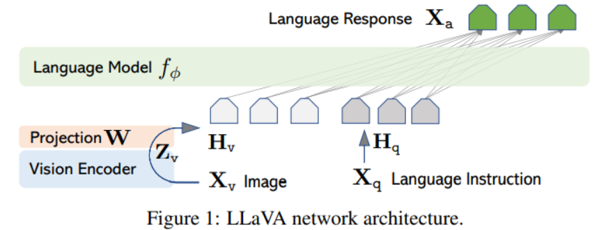
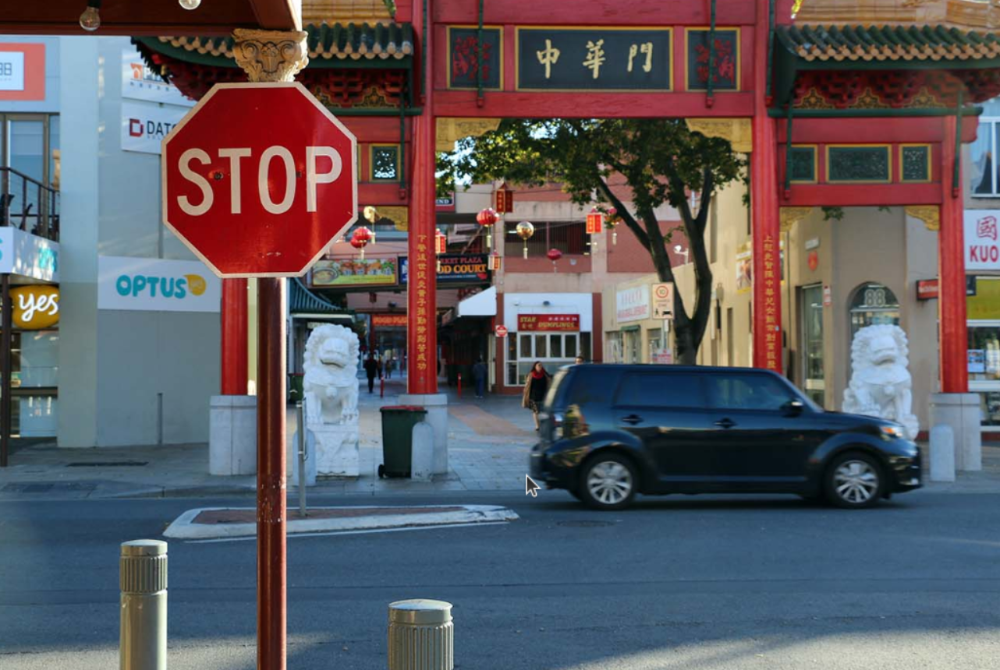
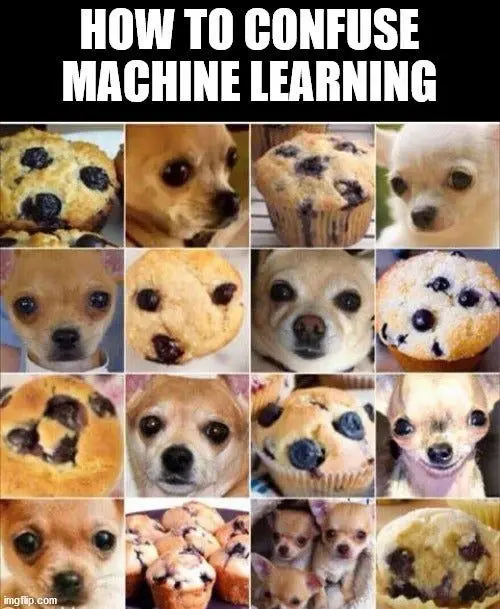
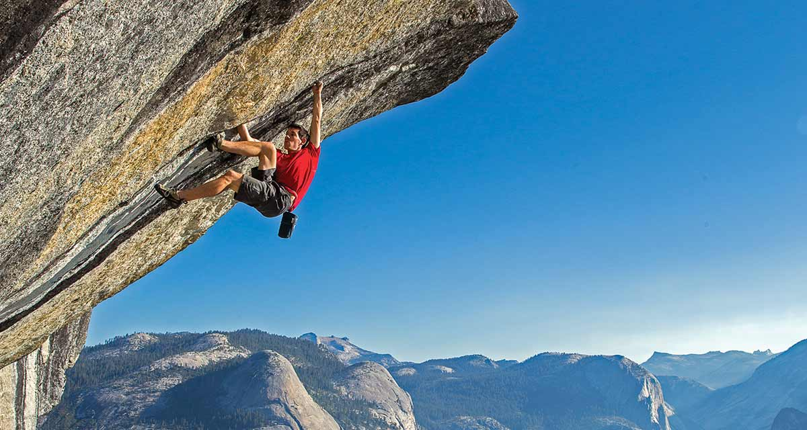
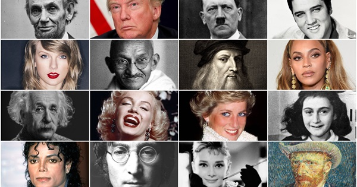

# Multimodal (Visual and Language) understanding with LLaVA-NeXT

LLaVa (Large Language And Vision Assistant) was introduced in 2023 and became a milestone for multimodal models. It combines a pretrained [vision encoder](https://openai.com/research/clip) and a pretrained [LLM](https://lmsys.org/blog/2023-03-30-vicuna/) for general purpose visual and language understanding. In January 2024, LLaVa-NeXT was released, which boasts significant enhancements, including higher input's visual resolution and improved logical reasoning and world knowledge.

At its core, LLaVa models use a simple linear layer to connect image features into the word embedding space, which makes them more efficient to run experiments. Other multimodal models such as Flamingo and BLIP-2 use more sophisticated methods such as gated cross-attention and Q-former to connect the image and language representation. The figure below shows the high-level architecture of LLaVa [(source)](https://arxiv.org/pdf/2304.08485.pdf).



The data for fine-tuning LLaVa models is generated by a language-only GPT-4, with hundreds of thousands of language-image instruction-following samples in total, including conversations, detailed descriptions, and complex reasoning. The goal is to create a powerful model capable of understanding and executing instructions given in both textual and visual formats. The reason for using GPT-generated data is because for multimodal instruction-following data, "the process for creating such data is time-consuming and less well-defined when human crowd-scouring is considered" [(source)](https://arxiv.org/html/2304.08485v2). Please refer to [this HuggingFace dataset](https://huggingface.co/datasets/liuhaotian/LLaVA-Instruct-150K/) for more examples of the dataset.

For evaluation, LLaVa models are given questions and images to generate a response. This response is then compared with the ground truth textual descriptions and rated by GPT-4 based on their helpfulness, relevance, accuracy, and level of detail. The evaluation yielded an overall score on a scale of 1 to 10, with higher scores being better.

For a deeper dive into the inner workings and evaluation of the original LLaVa, we recommend that users take a look at [Visual Instruction Tuning](https://arxiv.org/abs/2304.08485) by Haotian Liu, et al and their [website](https://llava-vl.github.io/). For more details on LLaVa-NeXT, we recommend that users look at HuggingFace' [documentation](https://huggingface.co/docs/transformers/en/model_doc/llava_next) and this [announcement](https://llava-vl.github.io/blog/2024-01-30-llava-next/)

In this blog, we run some inferences with the recently released LLaVa-NeXT and demonstrate how it works out-of-the-box with AMD GPUs and ROCm.

## Prerequisites

* Software:
  * [ROCm](https://rocm.docs.amd.com/projects/install-on-linux/en/latest/tutorial/quick-start.html)
  * [PyTorch](https://rocm.docs.amd.com/projects/install-on-linux/en/latest/how-to/3rd-party/pytorch-install.html)
  * Linux OS

For a list of supported GPUs and OS, please refer to [this page](https://rocm.docs.amd.com/projects/install-on-linux/en/latest/reference/system-requirements.html). For convenience and stability, we recommend you to directly pull and run the rocm/pytorch Docker in your Linux system with the following code:

```sh
docker run -it --ipc=host --network=host --device=/dev/kfd --device=/dev/dri \
           --group-add video --cap-add=SYS_PTRACE --security-opt seccomp=unconfined \
           --name=olmo rocm/pytorch:rocm6.0_ubuntu20.04_py3.9_pytorch_2.1.1 /bin/bash
```

* Hardware:

Make sure the system recognizes your GPU:

``` python
! rocm-smi --showproductname
```

```sh
================= ROCm System Management Interface ================
========================= Product Info ============================
GPU[0] : Card series: Instinct MI210
GPU[0] : Card model: 0x0c34
GPU[0] : Card vendor: Advanced Micro Devices, Inc. [AMD/ATI]
GPU[0] : Card SKU: D67301
===================================================================
===================== End of ROCm SMI Log =========================
```

Let's check if we have the right version of ROCm installed.

```python
!apt show rocm-libs -a
```

```text
Package: rocm-libs
Version: 5.7.0.50700-63~22.04
Priority: optional
Section: devel
Maintainer: ROCm Libs Support <rocm-libs.support@amd.com>
Installed-Size: 13.3 kBA
Depends: hipblas (= 1.1.0.50700-63~22.04), hipblaslt (= 0.3.0.50700-63~22.04), hipfft (= 1.0.12.50700-63~22.04), hipsolver (= 1.8.1.50700-63~22.04), hipsparse (= 2.3.8.50700-63~22.04), miopen-hip (= 2.20.0.50700-63~22.04), rccl (= 2.17.1.50700-63~22.04), rocalution (= 2.1.11.50700-63~22.04), rocblas (= 3.1.0.50700-63~22.04), rocfft (= 1.0.23.50700-63~22.04), rocrand (= 2.10.17.50700-63~22.04), rocsolver (= 3.23.0.50700-63~22.04), rocsparse (= 2.5.4.50700-63~22.04), rocm-core (= 5.7.0.50700-63~22.04), hipblas-dev (= 1.1.0.50700-63~22.04), hipblaslt-dev (= 0.3.0.50700-63~22.04), hipcub-dev (= 2.13.1.50700-63~22.04), hipfft-dev (= 1.0.12.50700-63~22.04), hipsolver-dev (= 1.8.1.50700-63~22.04), hipsparse-dev (= 2.3.8.50700-63~22.04), miopen-hip-dev (= 2.20.0.50700-63~22.04), rccl-dev (= 2.17.1.50700-63~22.04), rocalution-dev (= 2.1.11.50700-63~22.04), rocblas-dev (= 3.1.0.50700-63~22.04), rocfft-dev (= 1.0.23.50700-63~22.04), rocprim-dev (= 2.13.1.50700-63~22.04), rocrand-dev (= 2.10.17.50700-63~22.04), rocsolver-dev (= 3.23.0.50700-63~22.04), rocsparse-dev (= 2.5.4.50700-63~22.04), rocthrust-dev (= 2.18.0.50700-63~22.04), rocwmma-dev (= 1.2.0.50700-63~22.04)
Homepage: https://github.com/RadeonOpenCompute/ROCm
Download-Size: 1012 B
APT-Manual-Installed: yes
APT-Sources: http://repo.radeon.com/rocm/apt/5.7 jammy/main amd64 Packages
Description: Radeon Open Compute (ROCm) Runtime software stack
```

Make sure PyTorch also recognizes the GPU:

``` python
import torch
print(f"number of GPUs: {torch.cuda.device_count()}")
print([torch.cuda.get_device_name(i) for i in range(torch.cuda.device_count())])
```

``` text
number of GPUs: 1
['AMD Radeon Graphics']
```

Let's start testing LLaVa-NeXT.

## Libraries

Before you begin, make sure you install the transformers library from HuggingFace.

``` python
! pip install -q transformers
```

Next import the modules you'll be working with for this blog:

```python
from transformers import LlavaNextProcessor, LlavaNextForConditionalGeneration
import torch
from PIL import Image
import requests
import time
```

### Loading the model

Let's load our model. We'll use Mistral-7B for LLM and CLIP for vision encoder.

```python
device = "cuda:0" 
model = LlavaNextForConditionalGeneration.from_pretrained("llava-hf/llava-v1.6-mistral-7b-hf", torch_dtype=torch.float16, low_cpu_mem_usage=True) 
model.to(device)
processor = LlavaNextProcessor.from_pretrained("llava-hf/llava-v1.6-mistral-7b-hf")
print(f"{model.num_parameters() / 1e9:.2f}B parameters")
print(model)
```

```text
Loading checkpoint shards: 100%|██████████| 4/4 [00:00<00:00, 13.97it/s]
Special tokens have been added in the vocabulary, make sure the associated word embeddings are fine-tuned or trained.
7.57B parameters
LlavaNextForConditionalGeneration(
  (vision_tower): CLIPVisionModel(
    (vision_model): CLIPVisionTransformer(
      (embeddings): CLIPVisionEmbeddings(
        (patch_embedding): Conv2d(3, 1024, kernel_size=(14, 14), stride=(14, 14), bias=False)
        (position_embedding): Embedding(577, 1024)
      )
      (pre_layrnorm): LayerNorm((1024,), eps=1e-05, elementwise_affine=True)
      (encoder): CLIPEncoder(
        (layers): ModuleList(
          (0-23): 24 x CLIPEncoderLayer(
            (self_attn): CLIPAttention(
              (k_proj): Linear(in_features=1024, out_features=1024, bias=True)
              (v_proj): Linear(in_features=1024, out_features=1024, bias=True)
              (q_proj): Linear(in_features=1024, out_features=1024, bias=True)
              (out_proj): Linear(in_features=1024, out_features=1024, bias=True)
            )
            (layer_norm1): LayerNorm((1024,), eps=1e-05, elementwise_affine=True)
            (mlp): CLIPMLP(
              (activation_fn): QuickGELUActivation()
              (fc1): Linear(in_features=1024, out_features=4096, bias=True)
              (fc2): Linear(in_features=4096, out_features=1024, bias=True)
            )
            (layer_norm2): LayerNorm((1024,), eps=1e-05, elementwise_affine=True)
          )
        )
      )
      (post_layernorm): LayerNorm((1024,), eps=1e-05, elementwise_affine=True)
    )
  )
  (multi_modal_projector): LlavaNextMultiModalProjector(
    (linear_1): Linear(in_features=1024, out_features=4096, bias=True)
    (act): GELUActivation()
    (linear_2): Linear(in_features=4096, out_features=4096, bias=True)
  )
  (language_model): MistralForCausalLM(
    (model): MistralModel(
      (embed_tokens): Embedding(32064, 4096)
      (layers): ModuleList(
        (0-31): 32 x MistralDecoderLayer(
          (self_attn): MistralAttention(
            (q_proj): Linear(in_features=4096, out_features=4096, bias=False)
            (k_proj): Linear(in_features=4096, out_features=1024, bias=False)
            (v_proj): Linear(in_features=4096, out_features=1024, bias=False)
            (o_proj): Linear(in_features=4096, out_features=4096, bias=False)
            (rotary_emb): MistralRotaryEmbedding()
          )
          (mlp): MistralMLP(
            (gate_proj): Linear(in_features=4096, out_features=14336, bias=False)
            (up_proj): Linear(in_features=4096, out_features=14336, bias=False)
            (down_proj): Linear(in_features=14336, out_features=4096, bias=False)
            (act_fn): SiLU()
          )
          (input_layernorm): MistralRMSNorm()
          (post_attention_layernorm): MistralRMSNorm()
        )
      )
      (norm): MistralRMSNorm()
    )
    (lm_head): Linear(in_features=4096, out_features=32064, bias=False)
  )
)
```

### Multimodal inference

Let's first create a function that accepts a prompt and a local image path or an image url as arguments, then utilizes the model to generate a textual response. We adapt our code from HuggingFace' [documentation](https://huggingface.co/docs/transformers/en/model_doc/llava).

```python
def run_inference(text='', image_source='', is_url=False): 
    # load image from either a url or local file
    if is_url == True:
        image = Image.open(requests.get(image_source, stream=True).raw)
    else:
        image = Image.open(image_source)
        image = image.convert("RGB")
    # show image 
    image.show() 
    
    # create prompt and process input 
    start = time.time()
    prompt = f"<image>\nUSER: {text}\nASSISTANT:"
    inputs = processor(text=prompt, images=image, return_tensors="pt").to(device)
    
    # Generate response
    generate_ids = model.generate(**inputs, max_length=500)
    response = processor.batch_decode(generate_ids, skip_special_tokens=True, clean_up_tokenization_spaces=False)[0]
    print(f"Generated in {time.time() - start: .2f} secs")
    print(response) 
    return response
```

Now, we are ready to test out the model. Below are several examples of our interaction with the model about the input image.

Example 1:

```python
text = "What's the content of the image?"
response = run_inference(text, "https://www.ilankelman.org/stopsigns/australia.jpg", is_url=True)
```



```text
Generated in  3.66 secs

USER: What's the content of the image?
ASSISTANT: The image shows a stop sign at an intersection, with a black car driving through it. The stop sign is located on a street corner, and there are Chinese characters on the building behind the car. The architecture of the buildings suggests an Asian influence, possibly in a Chinatown area.
```

Example 2:

```python
text = "Describe the image and what's funny about it"
response = run_inference(text, "images/example2.jpg", is_url=False)
```


```text
Generated in  4.20 secs

USER: Describe the image and what's funny about it
ASSISTANT: The image features a cat sitting on the edge of a boat, wearing a pair of sunglasses. The cat is looking directly at the camera, giving the impression that it is posing for a photo. The sunglasses add a humorous and anthropomorphic touch to the image, as it's not common for cats to wear accessories like sunglasses. The cat's serious expression and the sunglasses create a comical contrast, making the image amusing and entertaining. 
```

Example 3:

```python
text = "Explain the humor in the image"
response = run_inference(text, "images/example3.jpg", is_url=False)
```



```text
Generated in  4.84 secs

USER: Explain the humor in the image
ASSISTANT: The image is a humorous collage of various animals, including dogs and a cat, with their faces digitally altered to look like they are eating muffins. The humor arises from the unexpected and absurd nature of the images. It's amusing to see animals, which are not capable of eating muffins, depicted as if they are enjoying a human-like snack. The juxtaposition of the animals' natural behavior with the human activity of eating muffins creates a whimsical and comical effect. 
```

Example 4:

```python
text = "Tell me about the content of this image and what's unusual about it?"
response = run_inference(text, "images/example4.jpg", is_url=False)
```



```text
Generated in  4.44 secs

USER: Tell me about the content of this image and what's unusual about it?
ASSISTANT: The image shows a person climbing a rock face, likely a part of a mountain. The climber is wearing a red shirt and appears to be in the midst of a challenging ascent, with their hands and feet gripping the rock. The unusual aspect of this image is the perspective; it's taken from a low angle, which makes the climber appear to be hanging from the rock face, almost as if they are defying gravity. This perspective creates a dramatic and somewhat surreal effect, emphasizing the height and difficulty of the climb. 
```

Example 5:

```python
text = "What are the names of the people in the image?"
response = run_inference(text, "images/example5.jpg", is_url=False)
```



```text
Generated in  1.87 secs

USER: What are the names of the people in the image?
ASSISTANT: The image contains a collage of various historical figures and celebrities. However, without specific names, I can only describe the individuals as "historical figures" and "celebrities." 
```

Example 6:

```python
text = "Identify the landmark in the image and tell me one fun fact about it"
response = run_inference(text, "images/example6.jpg", is_url=False)
```


```text
Generated in  3.32 secs

USER: Identify the landmark in the image and tell me one fun fact about it
ASSISTANT: The landmark in the image is the Colosseum, located in Rome, Italy. One fun fact about the Colosseum is that it was originally built for gladiatorial contests and other public spectacles, such as mock sea battles, animal hunts, and executions. It is one of the most iconic symbols of Imperial Rome and has been a major tourist attraction for centuries. .
```

We see that the model does an excellent job at identifying objects, scenaries, and context in the image. Aside from example 3 where the model is not able to understand the humor, the rest of the explanations are quite good.

### Text inference

It's worth pointing out that we can also run inference with just a textual prompt without an input image. We just slightly tweak our function above:

```python
def run_text_only(text=''): 
    # create prompt and process input 
    start = time.time()
    prompt = f"USER: {text}\nASSISTANT:"
    inputs = processor(text=prompt,return_tensors="pt").to(device)
    
    # Generate response
    generate_ids = model.generate(**inputs, max_length=500)
    response = processor.batch_decode(generate_ids, skip_special_tokens=True, clean_up_tokenization_spaces=False)[0]
    print(f"Generated in {time.time() - start: .2f} secs")
    print(response) 
    return response
```

Here are two examples:

```python
text = "Explain three laws of thermodynamics" 
response = run_text_only(text) 
```

```text
Generated in  6.94 secs
USER: Explain three laws of thermodynamics
ASSISTANT: The three laws of thermodynamics are fundamental principles that describe the behavior of energy in a system. Here's a brief explanation of each:

1. **First Law of Thermodynamics**: Also known as the Law of Conservation of Energy, this law states that energy cannot be created or destroyed, only converted from one form to another. This means that the total amount of energy in a closed system remains constant.

2. **Second Law of Thermodynamics**: This law states that the total entropy (a measure of the disorder or randomness of a system) of an isolated system can only increase over time. In other words, natural processes tend to move towards a state of disorder.

3. **Third Law of Thermodynamics**: This law states that as the temperature of a system approaches absolute zero (0 Kelvin), the entropy of the system approaches a minimum value. This means that it is impossible to reach absolute zero, as the entropy would have to be zero.

These laws are fundamental to the study of thermodynamics and have wide-ranging implications in physics, chemistry, and engineering. 
```

```python
text = "Why is the sky blue?" 
response = run_text_only(text) 
```

```text
Generated in  3.00 secs
USER: Why is the sky blue?
ASSISTANT: The sky appears blue because of the scattering of light by the Earth's atmosphere. The Earth's atmosphere is made up of many gases, including nitrogen and oxygen. When sunlight enters the Earth's atmosphere, it is scattered in all directions by these gases. Blue light is scattered more than other colors because it travels in smaller, shorter waves. This means that when you look up at the sky, you are seeing the blue light that has been scattered by the Earth's atmosphere. 
```

## Disclaimers

Third-party content is licensed to you directly by the third party that owns the content and is
not licensed to you by AMD. ALL LINKED THIRD-PARTY CONTENT IS PROVIDED “AS IS”
WITHOUT A WARRANTY OF ANY KIND. USE OF SUCH THIRD-PARTY CONTENT IS DONE AT
YOUR SOLE DISCRETION AND UNDER NO CIRCUMSTANCES WILL AMD BE LIABLE TO YOU FOR
ANY THIRD-PARTY CONTENT. YOU ASSUME ALL RISK AND ARE SOLELY RESPONSIBLE FOR ANY
DAMAGES THAT MAY ARISE FROM YOUR USE OF THIRD-PARTY CONTENT.
