<head>
  <meta charset="UTF-8">
  <meta name="description" content="LLM Inference optimizations on AMD Instinct (TM) GPUs">
  <meta name="author" content="Seungrok Jung">
  <meta name="keywords" content="LLM, optimization, inference, AMD, GPU, MI210, MI250">
</head>

# Large language model inference optimizations on AMD GPUs

Large language models (LLMs) have transformed natural language processing and comprehension,
facilitating a multitude of AI applications in diverse fields. LLMs have various promising use cases,
including AI assistants, chatbots, programming, gaming, learning, searching, and recommendation
systems. These applications leverage the capabilities of LLMs to provide personalized and interactive
experiences, which enhances user engagement.

LLMs use transformer architecture to solve gradient vanishing and explosion problems. This
architecture allows for easy parallelization of self-attention, making it possible to efficiently utilize multiple GPUs. Other architectures, such as recurrent neural networks (RNN) and its variants (e.g.,
LSTM and GRU), struggle when handling long sequences of words.

Despite impressive capabilities, LLMs like GPT and Llama require aggressive optimization before being
deployed for commercial applications due to their large parameter size and autoregressive sequential
processing behavior. Many efforts have been made to improve the throughput, latency, and memory
footprint of LLMs by utilizing GPU computing capacity (TFLOPs) and memory bandwidth (GB/s).

We'll discuss these optimization techniques by comparing the performance metrics of the
[Llama-2-7B](https://huggingface.co/TheBloke/Llama-2-7B-Chat-fp16) and
[Llama-2-70B](https://huggingface.co/TheBloke/Llama-2-70B-Chat-fp16) models on AMD's
[MI250](https://www.amd.com/en/products/server-accelerators/instinct-mi250) and
[MI210](https://www.amd.com/en/products/server-accelerators/amd-instinct-mi210) GPUs.

## Model characteristics: Llama2-7b and Llama2-70b

The Llama2-7b and 70b models are capable of handling 32,000 vocabulary words. These models can
process a maximum length of 4,096 token sequences. Llama2 optimized its training and inference
performance by adopting the following new features:

* **Sigmoid Linear Unit (SiLU) activation**: Replaces the commonly used Rectified Linear Unit
  (ReLU) to reduce the vanishing gradient problem for smoother activation.

* **Rotary positional embedding**: Reduces the computing costs of a classic absolution positional
  embedding layer, while retaining the positional information of the token sequence.

* **Pre-normalization**: The LlamaRMSNorm module normalizes the *input* instead of the *output*,
  which reduces the gradient vanishing and explosion problem.

In the Llama-2-7b model, there are 32 attention heads in the self-attention module; each head has 128
dimensions. The Multilayer Perceptron (MLP) module has 11,008 intermediate size and it is composed
of three layers: `gate_proj`, `up_proj`, and `down_proj`.

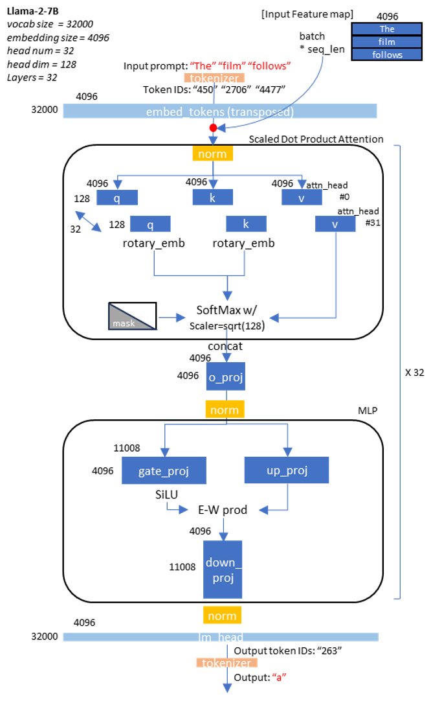
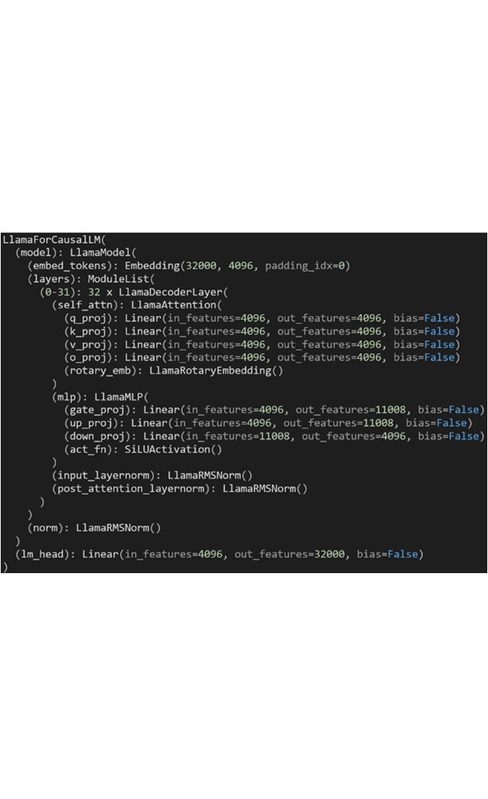

Based on their behaviors, LLMs are categorized into the following:

* **Masked Language Model (MLM)**: Predicts a new masked word between the provided context
  words. BERT is an example of an MLM.
* **Causal Language Model (CLM)**: Predicts the next word after the provided context words. One
  well-known CLM example is GPT text generation. CLM is also known as an autoregressive token
  generation model due to its sequential processing behavior.

In this blog, we focus more on Llama2 CLM.

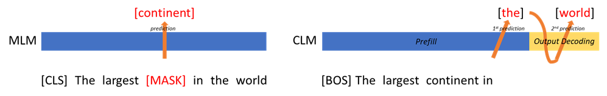

The token generation in a CLM is performed in the following two phases:

* **Time to first token (TTFT)**: The time taken to generate the first token. Prefill latency is defined
  as the average TTFT across requests. In the following figure, TTFT is the time taken to generate "*in*"
  from the input prompt to "*The largest continent*".
* **Time per output token (TPOT)**: The time taken to generate each output token in an
  autoregressive manner. Output decoding latency is defined as the average TPOT across requests,
  and is usually estimated using the time taken during the output decoding phase. In the following
  figure, TPOT is the decoding latency of "*the*".

The TTFT and TPOT are used to calculate the latency in a CLM:

[latency](https://www.databricks.com/blog/llm-inference-performance-engineering-best-practices) =
TTFT + TPOT \* (max_new_tokens - 1)

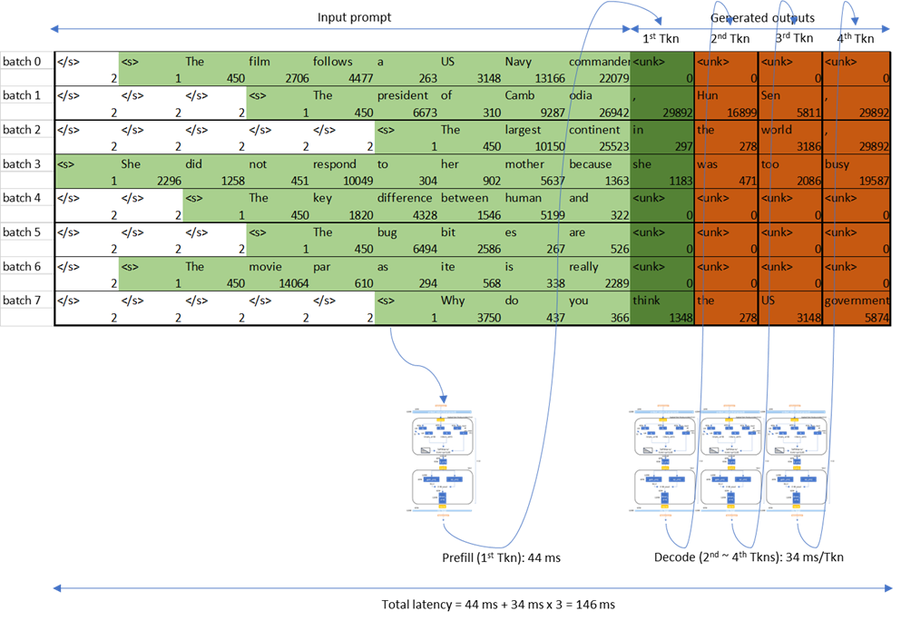

The dimension of the input in the **prefill** phase after token embedding is proportional to
**batch_size \* input sequence_length**. The tokens in the prefill phase are processed at the same
time. However, the input to the **output decoding**, after token embedding, is proportional to
**batch_size**; tokens in this phase are processed sequentially. This is why the output decoding
operation is composed of tall and skinny GEMM (or GEMV) when the batch size is 1.

For the sake of simplicity, we use greedy-decoding for generated tokens, which is known to have
minimal token decoding overhead from output logits. In real chatbot scenarios where rich and
unexpected output token generation is allowed, it's better to consider sampling-based decoding and
higher beam width. But, in the greedy-decoding scheme, the autoregressive CLM generates top-1
tokens from the model output logit.

## Device characteristics: MI210

AMD's Instinct (TM) MI210 has a maximum computing capacity of 181 TFLOPs at the FP16 datatype. To
fully leverage matrix core performance, the matrix dimension of GEMM should be large enough. The
LLM prefill decoding phase with large batch uses large input matrices and can benefit from the high
performance of matrix cores. With MI210, during the prefill phase where the prompt sequence length
and batch size are large, the GEMM operations are compute-bound.

MI210 can provide a maximum double data rate (DDR) memory bandwidth up to 1.6 TB/s. The output
decoding processes tokens sequentially. This autoregressive decoding has only one dimension of
sequence length (which makes the tall and skinny GEMM or GEMV) where the operations are
memory-bound. Due to this sequential nature of LLM output token generation, the output decoding
benefits from DDR bandwidth.

MI250 is composed of two Graphics Compute Dies (GCD) from MI210. Therefore, MI250 has two times
the computing capacity, memory size, and memory bandwidth of MI210. The LLM can be assigned to
the two silicon dies of MI250 in tensor parallel (TP), pipeline parallel (PP), or data parallel (DP) styles of
model parallelism. This data parallel can double the LLM throughput with a two-fold model parameter
duplication overhead. The lack of overhead causes the tensor parallel to be widely used due to its
ability to fit larger LLM onto high-capacity MI250 DDR with some collective operation synchronization
overheads.

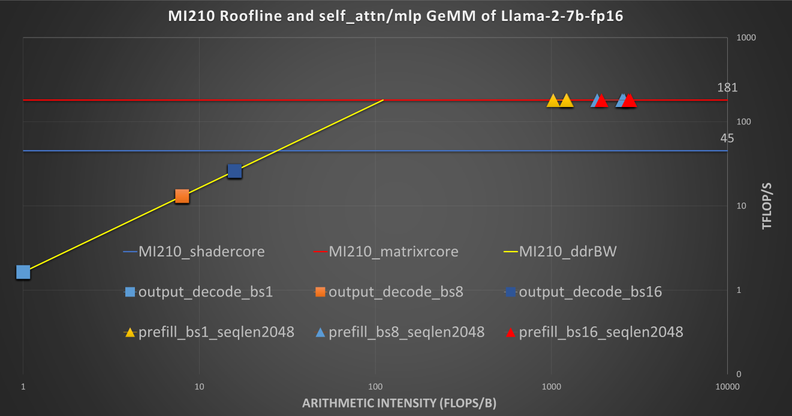

In the preceding figure, note that the roofline of the MI250 single GCD is similar to that of MI210.

## Software setup

### Installing ROCm on the host

To install ROCm 6.0 on the host, see the
[install instructions](https://rocm.docs.amd.com/projects/install-on-linux/en/docs-6.0.0/tutorial/install-overview.html).

### Setting up docker

To set up the official [PyTorch ROCm Docker container](https://hub.docker.com/r/rocm/pytorch/tags),
use the following command:

```sh
docker run -it --network=host --device=/dev/kfd --device=/dev/dri --group-add=video --ipc=host --cap-add=SYS_PTRACE --security-opt seccomp=unconfined --shm-size 8G --name llm_optimization rocm/pytorch:rocm6.0_ubuntu22.04_py3.9_pytorch_2.0.1
```

### Configuring the library and toolkit

Run the following command to install PyTorch 2.3 nightly:

```sh
pip3 uninstall torch torchvision torchaudio pytorch-triton-rocm -y
pip3 install --pre torch torchvision torchaudio --index-url https://download.pytorch.org/whl/nightly/rocm6.0
```

For library setup, refer to Hugging Face’s
[transformers](https://github.com/huggingface/transformers).

For toolkit setup, refer to [Text Generation Inference (TGI)](https://github.com/huggingface/text-generation-inference).

## Optimization comparison of Llama-2-7b on MI210

* **Prefill latency**

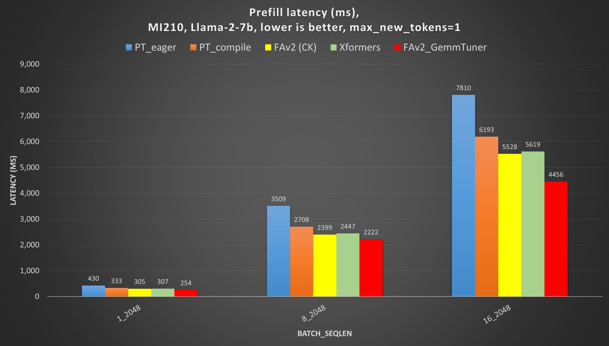

* **Output decoding latency**

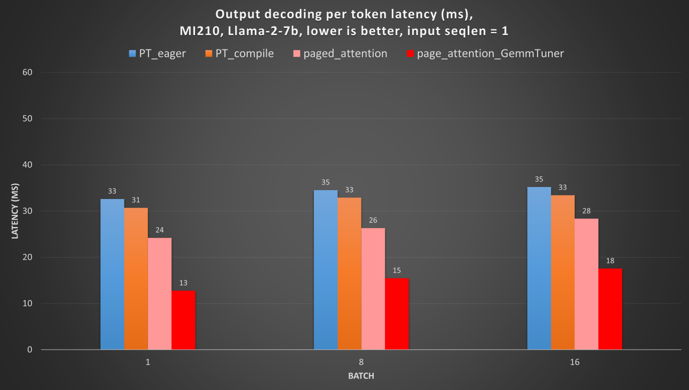

### Default machine-learning framework

PyTorch 2 supports two running modes: eager and compilation. Eager mode is the default PyTorch
mode, in which the operators of a model are run sequentially as soon as they are encountered during
runtime. Compilation mode is covered under the LLM inference optimization techniques.

To run a LLM decoder model (e.g., Llama-2), Hugging Face provides the transformers library to run
models on top of PyTorch.

The transformers library uses various token generation options as arguments in its
[APIs](https://huggingface.co/docs/transformers/main/en/main_classes/text_generation#transformers.GenerationConfig).
In this blog, to fairly compare the performance of each optimization, these options are deployed:

* **Prefill**: With a 2,048 sequence length prompt, the prefill latency increases according to the batch
  size, because large GEMM computation during the prefill is compute-bound.

* **Output decoding**: The output decoding latency doesn't increase much when the batch size
  increases, as the arithmetic intensity of GEMM during this phase is still memory bandwidth-bound.

## LLM inference optimization techniques

Here, we discuss the various LLM inference optimization techniques.

### PyTorch compilation mode

In [PyTorch compilation mode](https://pytorch.org/tutorials/intermediate/torch_compile_tutorial.html),
a model is synthesized into a graph and then lowered to prime operators. These operators are
compiled using TorchInductor, which uses OpenAI’s Triton as a building block for GPU acceleration.
One advantage of PyTorch compilation mode is that its GPU kernels are written in Python, making it
easier to modify and extend them. PyTorch compilation mode often delivers higher performance, as
model operations are fused before runtime, which allows for easy deployment of high-performance
kernels.

To run an LLM decoder model (e.g., Llama2) in PyTorch compilation mode, specific layers of the model
must be explicitly assigned as compilation targets. The PyTorch compilation mode requires
recompilation with dynamic input shapes of the LLM decoder model, where the input batch size and
sequence length can change during runtime. To support recompilation with dynamic input shapes, set
the parameter `dynamic=True`.

```python
for i in range(model.config.num_hidden_layers):
    model.model.decoder.layers[i].self_attn = torch.compile(model.model.decoder.layers[i].self_attn, backend="inductor", mode="default", dynamic=True)
```

* **Prefill**: The prefill latency is significantly reduced. But, for LLM decoder models, it still suffers
  huge initial recompilation overhead for various batch sizes and input sequence lengths. The prefill
  latency is measured after the initial recompilation (warmups).

* **Output decoding**: The output decoding latency is slightly better, because the model was
  partially compiled. However, the graph fell back to eager mode due to the dynamic shapes of partial
  key/value caches. There's an effort to address this issue (known as
  [static key/value cache](https://pytorch.org/blog/accelerating-generative-ai-2)). The static key/value
  cache, along with `torch.compile`, shows much better output decoding performance, but we don't
  cover this in our blog.

### Flash Attention v2

The Flash Attention ([`flash_attention`](https://arxiv.org/abs/2205.14135)) algorithm is designed to
address the large memory movements required for the query, key, and value components of the
Multi-head Attention (MHA) module in a [transformer](https://arxiv.org/pdf/1706.03762). This is
achieved by tiling the partial queries and storing them in a faster cache memory, rather than constantly
reading from the slower external DDR memory during MHA computations.
`flash_attention v2`](https://arxiv.org/abs/2307.08691) maximizes parallelism over long input sequence
lengths, leading to a significant performance boost over the native MHA.

You can seamlessly use the
[`flash_attention v2 module` for ROCm](https://github.com/ROCm/flash-attention) with the latest
transformers library from Hugging Face.

```python
from transformers import AutoModelForCausalLM, AutoTokenizer
model = AutoModelForCausalLM.from_pretrained(model_id, attn_implementation="flash_attention_2")
```

* **Prefill**: The Flash Attention modules significantly reduce the prefill processing latency for large
  batch sizes and long sequence lengths, as MHA matrix dimensions are proportional to these. This
  leads to more gains for the flash attentions.

* **Output decoding**: `flash_attention` isn't effective during the output decoding phase, as the
  sequence length is just 1.

### Memory-efficient multi-head-attention

Memory-efficient, multi-head-attention (Xformers) is a collection of customizable modules from Meta.
They're used to optimize transformers. The key feature of Xformers is the memory-efficient MHA
module that can significantly reduce memory traffic during MHA processing. This module uses a
similar algorithm to `flash_attention` to reduce the DDR read or write bandwidth.

You can seamlessly integrate
[Xformers' memory-efficient MHA module for ROCM](https://github.com/ROCm/xformers) into
Hugging Face's transformers library.

* **Prefill**: Memory-efficient MHA also significantly reduces the prefill processing latency for large
  batch sizes and long sequence lengths, for the same reason as `flash_attention v2`.

* **Output decoding**: Xformers isn't effective during the output decoding phase, as the sequence
  length is just 1.

### Paged attention (vLLM)

Paged attention ([`paged_attention`](https://arxiv.org/pdf/2309.06180)) from the vLLM inference
system is an algorithm that can efficiently reduce the memory consumption, and decrease the latency
by two to four times during the output decoding phase. Paged attention manages Key and Value
cache (K-V cache) during the output decoding phase by using virtual memory and paging to reduce
memory fragmentation. Conventional K-V caching pre-allocates memory for maximum output token
lengths (2,048 or 4,096, depending on the model), which can cause memory fragmentation if the
actual decoding length is shorter. This algorithm's virtual memory with paging can save K-V cache
memory when beam search is large and multiple requests are run in parallel.

[`vLLM's paged_attention` module for ROCm](https://github.com/ROCm/vllm) is currently available.

* **Prefill**: Paged attention isn't effective during the prefill. as this phase doesn't utilize K-V cache.

* **Output decoding**: Paged attention can significantly reduce the decoding latencies.

### PyTorch TunableOp

PyTorch TunableOp allows you to use high-performance [rocblas](https://github.com/ROCm/rocBLAS)
and [hipblaslt](https://github.com/ROCm/hipBLASLt) libraries for GEMM. It profiles the LLM and
prepares the best-performing GEMM kernels for each MHA and MLP modules. During runtime, the
best-performing GEMM kernels are launched instead of PyTorch built in the GEMM kernels.

[PyTorch TunableOp](https://github.com/pytorch/pytorch/blob/main/aten/src/ATen/cuda/tunable/README.md)
is available now.

* **Prefill**: Combined with `flash_attention v2`, PyTorch TunableOp shows significant performance
  increases in different batch sizes.

* **Output decoding**: With paged attention, PyTorch TunableOp also significantly reduces the
  latency for tall and skinny GEMM (or GEMV). Therefore, output decoding performance benefits the
  most from rocBLAS and hipBLASLt GEMMs.

## Multi-GPU LLM inference optimization

* **Prefill latency**

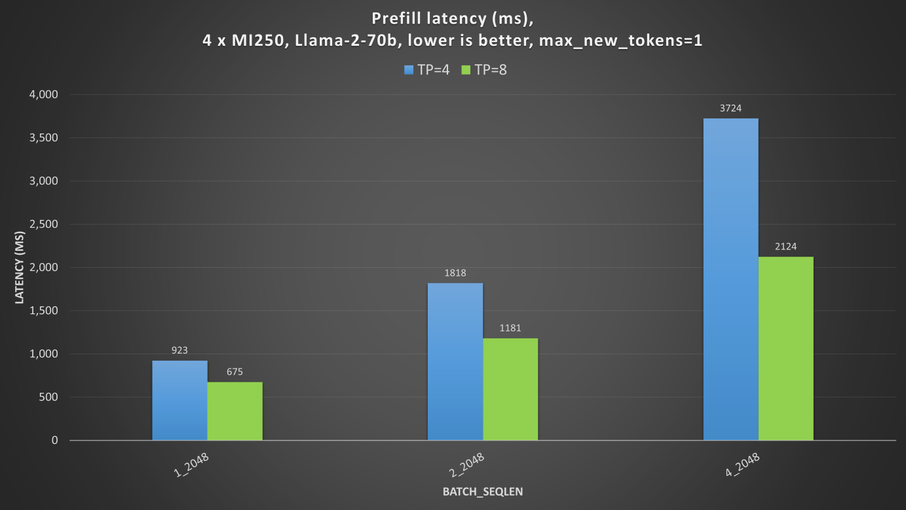

* **Output decoding latency**

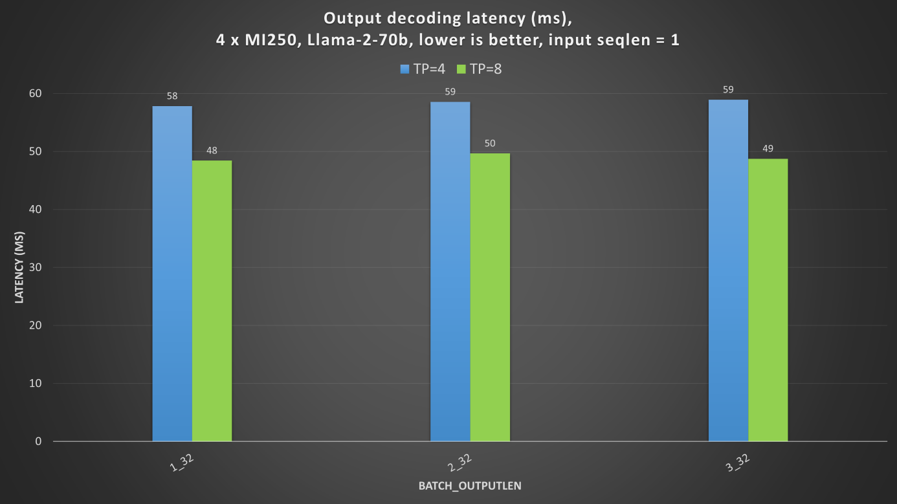

### Hugging Face Text Generation Inference

Scaling out multi-GPU inference and training requires model parallelism techniques, such as
[TP, PP, or DP](https://huggingface.co/transformers/v4.9.2/parallelism.html). TP is widely used, as it
doesn't cause pipeline bubbles; DP gives high throughput, but requires a duplicate copy of parameters
loaded to GPU DDRs.

In this blog, we use TP to split the model across multiple GPUs and Hugging face's
[TGI](https://github.com/huggingface/text-generation-inference) to measure multi-GPU LLM inference.
Hugging Face's TGI implementation of ROCm-enabled `flash_attention` and `paged_attention`,
compatibility with PyTorch TunableOp, and scope for ROCm-enabled quantizations (such as GPTQ)
makes it a good choice.

One server with 4 x MI250 has a total of 8 graphics compute dies (GCDs). Each GCD has 64 GB of HBM.

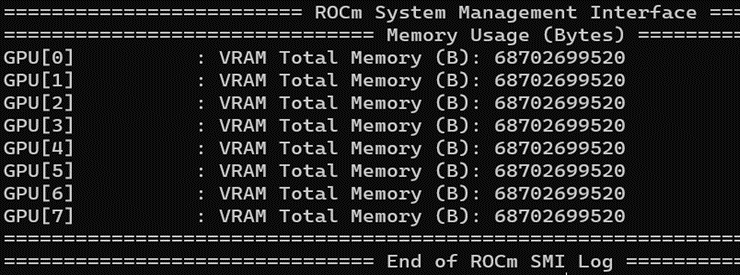


To fully utilize multiple MI250 GPUs, you need to consider the interconnect bandwidth between the
GPU's GCDs, as the inter-GCD connections have non-uniform throughput. For example, with TP=4,
using GCD#0,1,4,6 together gives the best performance, as the collective operations (such as
all-reduce or all-gather) cause less synchronization overhead in TP.

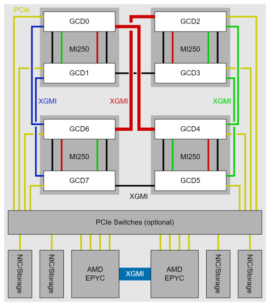
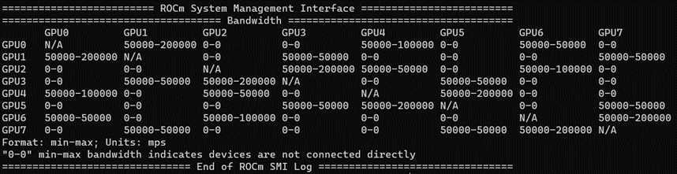

With non-uniform memory access (NUMA) balancing enabled, the GPU must wait for the preemptive
memory management unit (MMU) notifier changes derived from page faults. Therefore, disabling
NUMA balancing is recommended in order to keep the periodic automatic balancing from interfering
with GPU operations.

```sh
echo 0 > /proc/sys/kernel/numa_balancing
```

* **Prefill** and **output decoding**: the TP=8 (8 GCDs) case shows better prefill and output
  decoding latencies than TP=4 (4 GCDs). The latency enhancement is not doubled, as collective
  operations to synchronize MHA and MLP for every layer is also a huge latency bottleneck.

## Summary

In this blog, we introduced several software optimization techniques to deploy state-of-the-art LLMs
on AMD CDNA2 GPUs. These include PyTorch 2 compilation, Flash Attention v2, `paged_attention`,
PyTorch TunableOp, and multi-GPU inference. These have all been well-adopted by the AI community.
Using these optimizations, you can enjoy up to three times the out-of-the-box acceleration, depending
on batch size and input sequence length.
