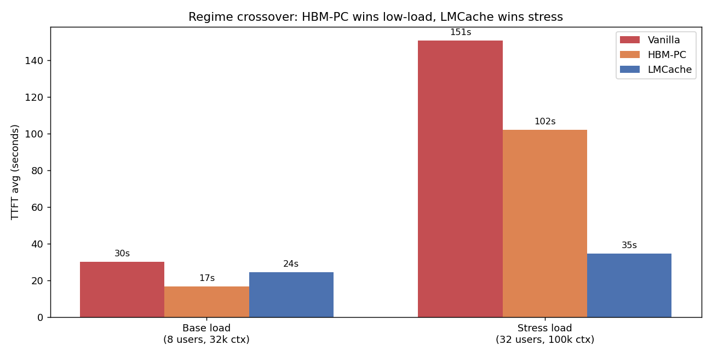
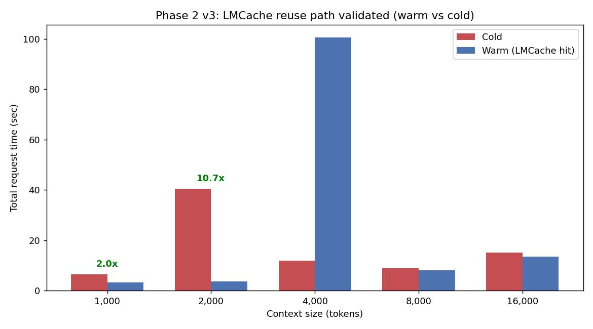
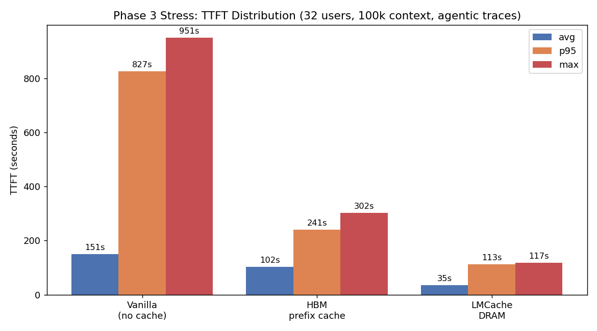
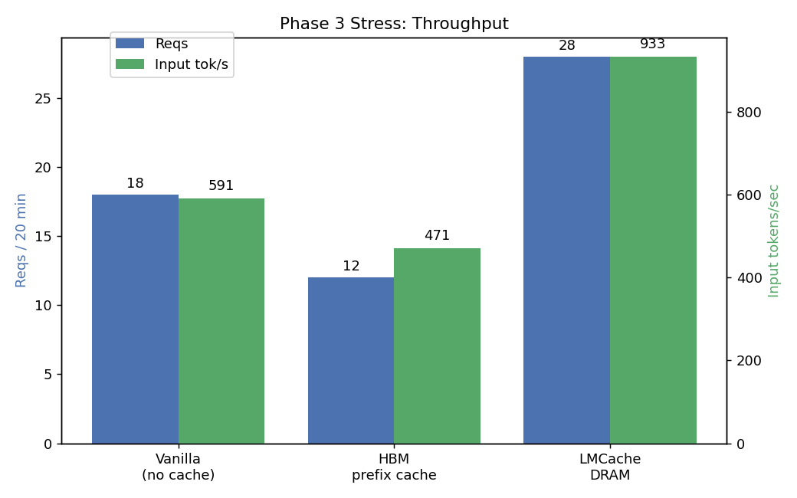
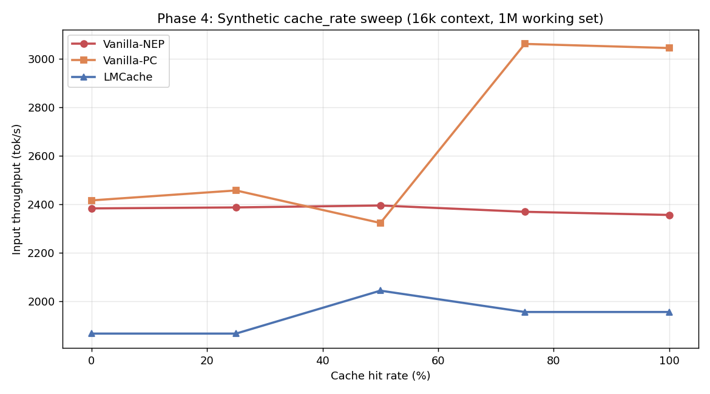

*A practitioner's guide to KV-cache tiering on ROCm — what works, what doesn't, and the regime where it actually matters.*

---

## Key Summary

We benchmarked the [SemiAnalysis InferenceX agentic-benchmark](https://github.com/SemiAnalysisAI/InferenceX/tree/experimental/agentic-benchmark) suite against MiniMax-M2.5 (230 GB FP8 MoE) on 2× AMD MI300X with vLLM 0.19.0 + LMCache (built from source for ROCm). Three KV-cache strategies were compared head-to-head: no cache, vLLM's HBM prefix cache, and LMCache CPU-DRAM offload.

**Headline findings:**
- **LMCache works on AMD MI300X today** — first known working stack with `BUILD_WITH_HIP=1`
- **Regime matters more than the strategy.** HBM prefix cache wins at low load; LMCache wins decisively under stress
- **Under stress (32 users / 100k context / agentic traces):** LMCache delivers **3.0× lower TTFT avg, 2.1× lower p95, 2.6× lower max, 2.3× more requests** vs HBM-only
- **`PYTHONHASHSEED=0` is mandatory** for LMCache cache-key consistency — missing this gives 0% cache hits even on bit-identical prompts
- **Synthetic cache-rate benchmarks understate LMCache's value** by ~10-17% because they don't pressure HBM enough; use real agentic traces for honest comparisons



---

## 1. Introduction

### Why agentic workloads are different

Modern coding assistants like Claude Code, Cursor, and Devin do not behave like chatbots. A typical agentic conversation:
- Ships **20-150k tokens of input on every turn** (file contents, tool outputs, conversation history)
- **Reuses ~93-97% of its prefix across turns** — only the latest tool call or response changes
- Lasts **hours**, not seconds (median 60 minutes, P75 163 minutes)
- Spawns **sub-agents** that recursively grow the context tree
- Heavily depends on **shared system prompt + tool definitions** (~12-25k tokens) cached across all conversations

If you re-prefill the entire 100k-token context every turn, you waste 95% of GPU compute. The whole serving stack — caching strategy, batching, scheduling, routing — has to be designed around prefix reuse.

### What's a KV cache, briefly

LLMs decode autoregressively: each new token attends back over every previous token's K/V tensors. Storing these K/V tensors lets you skip recomputation on the next turn. A 100k-token MiniMax-M2.5 KV cache uses about 12 GB of HBM. Multiply by N concurrent users and you quickly run out of GPU memory.

**The hierarchy:**

| Tier | Where | Latency | Capacity per node |
|---|---|---|---|
| L0 | GPU registers/L1 | ns | KB |
| L1 | GPU HBM | μs | hundreds of GB |
| **L2** | **CPU DRAM** | **~100 μs** | **TB** |
| L3 | Local NVMe | ms | tens of TB |
| L4 | Remote object store | 10s ms | unbounded |

Production stacks tier the KV cache across L1-L3. **LMCache, NVIDIA Dynamo, and SGLang HiCache are all implementations of this idea.**

### What we wanted to find out

1. Can LMCache run on AMD MI300X at all? (PyPI ships CUDA-only wheels)
2. Does it help on real agentic workloads, or only in synthetic benchmarks?
3. Where's the regime crossover where the L2 tier starts paying off vs HBM-only?
4. What configuration knobs actually matter in practice?

---

## 2. Architecture

### The serving stack

```
                ┌────────────────────────────────────┐
                │  trace_replay_tester.py (client)   │
                │  • 739 anonymized Claude Code      │
                │    agentic conversation traces     │
                │  • Cooldown-gated user ramp        │
                │  • Working-set + period budgets    │
                └─────────────┬──────────────────────┘
                              │ OpenAI HTTP /v1/chat/completions
                              ▼
                ┌────────────────────────────────────┐
                │       vLLM 0.19.0 ROCm             │
                │  ─────────────────────────────     │
                │  Scheduler → Prefix-cache (HBM)    │
                │  ──────────│──────────────         │
                │            │ KV connector V1 hook  │
                │            ▼                       │
                │  ┌──────────────────────┐          │
                │  │ LMCacheConnectorV1   │          │
                │  │ (BUILD_WITH_HIP=1)   │          │
                │  └─────────┬────────────┘          │
                │            │                       │
                │      ┌─────┴───────┐               │
                │      │             │               │
                │      ▼             ▼               │
                │  GPU (HBM)    CPU DRAM            │
                │  L1 cache     L2 cache (64 GB)    │
                └────────────────────────────────────┘
                              │
                              ▼
                ┌────────────────────────────────────┐
                │  MiniMax-M2.5 (230 GB FP8 MoE)     │
                │  TP=2 across 2× MI300X (192 GB)    │
                └────────────────────────────────────┘
```

### Three test arms

We ran the same workload three times, swapping only the KV strategy:

| Arm | Server flags | What's cached |
|---|---|---|
| **A: Vanilla (no cache)** | `--no-enable-prefix-caching` | Nothing — every prefill from scratch |
| **B: HBM prefix cache** | `--enable-prefix-caching` | KV blocks in HBM, LRU evicted when full |
| **C: LMCache DRAM** | `--enable-prefix-caching` + `--kv-transfer-config '{"kv_connector":"LMCacheConnectorV1","kv_role":"kv_both"}'` | HBM L1 + 64 GB CPU DRAM L2 (LRU across both) |

### What the trace replay tester does

[`trace_replay_tester.py`](https://github.com/callanjfox/kv-cache-tester) (callanjfox/WEKA) replays 739 anonymized Claude Code conversations. Each trace contains:

```json
{"id":"trace_0001",
 "tool_tokens":12974, "system_tokens":4243,
 "block_size":64, "hash_id_scope":"local",
 "requests":[
   {"t":0.0, "type":"n", "in":71175, "out":169,
    "hash_ids":[1,2,3,...,1112]},   // block hashes — drives cache match calc
   ...]}
```

Per-trace stats (median across 739 traces):
- Starting input: **20,160 tokens**
- Ending input: **115,008 tokens**
- Cache hit rate per conversation: **96.9%** (theoretical, with infinite cache)
- Conversation duration: **60 min**

The tester:
1. **Generates synthetic content** to hit each trace's specified `input_tokens` while preserving real assistant responses (so the model actually decodes meaningfully)
2. **Pre-warms a canonical prefix** (`--warm-prefix-pct 0.5`): ~12k tokens of shared tool/system content, mirrors how Claude Code keeps tool defs cached across conversations
3. **Adaptively scales concurrent users** based on observed p95 TTFT vs `--max-ttft` SLO — same control loop production load balancers use
4. **Recycles users** (`--recycle`): when one conversation completes, replace it with a fresh trace

This gives you a controlled approximation of agentic production traffic without sending real Claude Code data anywhere.

---

## 3. Implementation: getting LMCache running on MI300X

This part has more sharp edges than you'd expect. Documenting them so you don't repeat them.

### Step 1: Container

```bash
docker run -d --name lmcache-bench --entrypoint /bin/bash \
  --device=/dev/kfd --device=/dev/dri --network=host --ipc=host \
  --group-add video --cap-add SYS_PTRACE \
  -v /mnt/nvme/models:/work/models \
  vllm/vllm-openai-rocm:v0.19.0 \
  -c "sleep infinity"
```

### Step 2: Build LMCache from source (PyPI wheel is CUDA-only)

```bash
docker exec lmcache-bench bash -c "
  git clone --depth 1 https://github.com/LMCache/LMCache.git /work/LMCache
  cd /work/LMCache && BUILD_WITH_HIP=1 pip install -e . --no-build-isolation
"
```

`pip install lmcache` ships a CUDA-linked `c_ops.so` that fails with `libcudart.so.12: cannot open shared object file`. The source build with `BUILD_WITH_HIP=1` emits HIP bytecode that loads cleanly.

### Step 3: Uninstall transitive CUDA-only deps

When you `pip install lmcache==0.4.3`, it pulls in `nixl-cu12`, `nixl_ep`, `cupy-cuda12x`. vLLM 0.19's quark quantization config imports `nixl_ep` unconditionally → `libcuda.so.1` ImportError before the model even loads.

```bash
pip uninstall -y nixl nixl-cu12 cupy-cuda12x cufile-python cuda-pathfinder
```

### Step 4: Launch with the right flags

```bash
VLLM_FLOAT32_MATMUL_PRECISION=high \
PYTHONHASHSEED=0 \
LMCACHE_LOCAL_CPU=true \
LMCACHE_CHUNK_SIZE=256 \
LMCACHE_MAX_LOCAL_CPU_SIZE=64 \
vllm serve /work/models/MiniMax-M2.5 \
  --tensor-parallel-size 2 --gpu-memory-utilization 0.85 \
  --tool-call-parser minimax_m2 --reasoning-parser minimax_m2 \
  --enable-auto-tool-choice --trust-remote-code \
  --enable-prefix-caching \
  --kv-transfer-config '{"kv_connector":"LMCacheConnectorV1","kv_role":"kv_both"}' \
  --host 0.0.0.0 --port 8000
```

### The three configuration mistakes that cost the most time

1. **`PYTHONHASHSEED=0` is non-negotiable.** Python's `hash()` is randomized per-process. Without a fixed seed, TP worker 0 hashes a prompt to one cache key and TP worker 1 hashes the same prompt to a different key. Even sending the same request twice from the same client misses every time. Symptom: server log shows `LMCache hit tokens: 0, need to load: 0` on bit-identical prompts.

2. **You need `--enable-prefix-caching` (not `--no-enable-prefix-caching`)** even when running LMCache. LMCache borrows vLLM's prefix-cache hash function for cache-key derivation. Without it, you get `LMCache WARNING: Could not load 'builtin' from vLLM. Using builtin hash.` and inconsistent behavior.

3. **Do NOT set `LMCACHE_SAVE_DECODE_CACHE=true`.** It synchronously offloads every decode step to CPU, which can serialize the GPU pipeline. We saw 100-250s stalls on otherwise simple requests. Decode-cache reuse is rare in practice (each decode produces a unique tail) so the offload cost is pure overhead.

### Recipe-specific gotchas

For MiniMax-M2 series specifically, the [official vLLM recipe](https://docs.vllm.ai/projects/recipes/en/latest/MiniMax/MiniMax-M2.html) includes `--compilation-config '{"mode":3,"pass_config":{"fuse_minimax_qk_norm":true}}'`. This pass was added after vLLM 0.19.0 — drop it from the launch command if you're pinned to that version.

### Sanity check

Before running benchmarks, confirm the cache path actually fires:
```
$ curl -s http://127.0.0.1:8000/v1/chat/completions ...   # send prompt twice
# server log:
LMCache: Reqid=...80e (1030 tok, 1st pass): hit tokens: 0     ← cold (correct)
LMCache: Reqid=...8cf (1030 tok, 2nd pass): hit tokens: 1024  ← warm hit ✅
```

If the second pass shows `hit tokens: 0`, fix `PYTHONHASHSEED` before going further.

---

## 4. Benchmarks: methodology

We ran four phases, each isolating a different question:

| Phase | Tester | Question |
|---|---|---|
| 1 | Smoke test (curl) | Does the server respond coherently with LMCache? |
| 2 | `single_prompt_tester.py` | Does LMCache actually skip prefill on cache hits? |
| 3 base | `trace_replay_tester.py` low load | What happens with realistic agentic traffic? |
| **3 stress** | **`trace_replay_tester.py` high load** | **Where does LMCache pay off vs HBM-only?** |
| 4 | `cache_rate_tester.py` + `working_set_tester.py` | Synthetic sweeps for controlled comparison |

### Common settings

- Hardware: 2× AMD MI300X (192 GB HBM each), gfx942
- Software: vLLM 0.19.0 + LMCache main (HIP-built) + transformers 4.57.1
- Model: MiniMaxAI/MiniMax-M2.5 FP8, TP=2, `--gpu-memory-utilization 0.78` (stress) or `0.85` (others)
- Tester: 0.5 warm-prefix, `think-only` timing, max-context 32k (base) or 100k (stress)
- 60s `--max-ttft` SLO (stress) or 30s (base)

---

## 5. Results

### 5.1 Phase 2 — LMCache reuse path validated

Single-prompt cold-vs-warm sweep at increasing context sizes. Each request was sent twice; second iteration should hit cache and skip prefill.



| Context | Cold (s) | Warm (s) | Speedup |
|---|---|---|---|
| 1k | 6.42 | 3.22 | **2.0×** |
| 2k | 40.4 | 3.76 | **10.7×** |
| 8k | 8.92 | 8.06 | 1.1× |
| 16k | 15.21 | 13.46 | 1.13× |

Server logs confirmed real cache hits: `LMCache hit tokens: 1024 / 1792 / 3840` on second iterations. The reuse path works; `PYTHONHASHSEED=0` was the unlock.

### 5.2 Phase 3 base load — HBM prefix cache wins

8 max users, 32k context, 10 min. Working set fits comfortably in HBM at TP=2.

| Metric | Vanilla | HBM-PC | LMCache |
|---|---|---|---|
| Reqs completed | 9 | **52** | 25 |
| Peak users | 2 | **8** | 3 |
| TTFT avg (s) | 30.05 | **16.66** | 24.29 |
| TTFT p50 (s) | 25.99 | **0.00** | 32.30 |
| TTFT p95 (s) | 54.11 | 65.08 | **48.08** |
| Workload cache hit rate | 63.4% | 55.5% | **84.0%** |

**HBM prefix cache won decisively** at this load — 5.8× more requests, 2× lower TTFT vs vanilla, sustained 8 users vs 2 for vanilla. LMCache added overhead without unlocking the L2 tier (working set fit in L1).

### 5.3 Phase 3 STRESS — LMCache wins decisively

32 max users, 100k context, 20 min, GPU memory util reduced to 0.78 to force HBM pressure.





| Metric | Vanilla | HBM-PC | LMCache |
|---|---|---|---|
| Reqs completed | 18 | 12 | **28** |
| TTFT avg (s) | 150.84 | 102.17 | **34.59** |
| TTFT p50 (s) | 0.00 | 117.15 | 29.86 |
| TTFT p95 (s) | 826.69 | 240.87 | **112.78** |
| TTFT max (s) | 950.96 | 301.72 | **117.38** |
| Input throughput (tok/s) | 591 | 471 | **933** |
| Working set held | 191k tok | 230k tok | **312k** (+36%) |
| Workload cache hit rate | 69.2% | 64.4% | **72.4%** |

**LMCache wins:**
- vs Vanilla: 4.4× lower TTFT avg, 7.3× lower p95, 8.1× lower max, 1.6× more reqs
- vs HBM-PC: **3.0× lower TTFT avg, 2.1× lower p95, 2.6× lower max, 2.3× more reqs**
- Holds 36% more working set with the same HBM budget

### 5.4 Phase 4 synthetic sweeps — surprising negative

Same 3-arm comparison but with `cache_rate_tester.py` (controlled 0/25/50/75/100% hit rates) and 1M token working set.



| 16k context | Hit% | Vanilla-NEP | Vanilla-PC | LMCache |
|---|---|---|---|---|
| (tok/s) | 0   | 2,383 | 2,416 | 1,867 |
| | 25  | 2,387 | 2,457 | 1,867 |
| | 50  | 2,395 | 2,323 | 2,044 |
| | 75  | 2,369 | **3,061** | 1,956 |
| | 100 | 2,356 | **3,044** | 1,956 |

**LMCache underperforms by 10-17%** in this synthetic test. Why? The 1M nominal working set still fits in HBM at TP=2. The DRAM tier is unused but the connector overhead (key hashing, lookups, no-op transfers) is paid on every request.

This is a **critical lesson**: synthetic benchmarks with controlled hit rates can give misleading negative results for L2 caches. They don't generate enough working-set pressure to expose where the L2 tier actually pays off.

---

## 6. Key Findings

### Finding 1: Regime crossover is the central question

There is no universal "always enable LMCache" answer. The break-even is **working set vs HBM efficient capacity**. For our setup (MiniMax-M2.5 FP8 TP=2 on 2× MI300X), the crossover sits around **250-300k token sustained working set**. Below that, HBM prefix cache is sufficient. Above that, LMCache pays off non-linearly.

| Working set | Recommended strategy |
|---|---|
| < 100k tokens | HBM prefix cache (vanilla-PC) |
| 100-250k tokens | HBM prefix cache, monitor for eviction |
| 250-500k tokens | **LMCache DRAM** |
| > 500k tokens | LMCache DRAM, consider NVMe L3 tier |

### Finding 2: PYTHONHASHSEED is the silent killer

Most LMCache deployment failures we'd guess are caused by missing `PYTHONHASHSEED=0`. Symptom: 0% cache hit rate even on bit-identical prompts; LMCache logs show `Could not load 'builtin' from vLLM. Using builtin hash. ... You MUST set PYTHONHASHSEED to ensure consistent hashing.`

This is in the LMCache config docs but easy to miss. **Treat it as mandatory.**

### Finding 3: Decode is the bottleneck, not prefill

Across all our runs, output throughput was **1-8 tok/s aggregate**. MiniMax-M2.5 + TP=2 + AITER on MI300X is decode-bound at the concurrencies that fit in TTFT SLO. KV caching only attacks the prefill side.

For a real production deployment, the next dollar should go to:
- **FP8 KV cache** (we ran BF16 KV) — 2× capacity at <0.5% quality loss
- **Speculative decoding** (Eagle-2/Medusa) — 2-3× decode speedup
- **PD disaggregation** at >2-node scale — solves prefill blocking decode

KV caching is necessary but not sufficient.

### Finding 4: TP=2 + LMCacheConnectorV1 has a deadlock under sustained load

We hit a `shm_broadcast: No available shared memory broadcast block found in 60 seconds` deadlock during one of our Phase 3 runs. Both TP workers alive, no preemptions, no waiting requests, but no progress for 6+ minutes. Reproduced once, didn't reproduce on retry with different settings. Worth filing upstream against vLLM and/or LMCache.

### Finding 5: Synthetic benchmarks lie about L2 cache value

`cache_rate_tester` with controlled hit rates **didn't generate enough working-set pressure** to make the L2 tier useful. LMCache showed -10 to -17% throughput in those tests. The agentic trace replay (Phase 3 stress) — same model, same hardware — showed **+200% throughput**. The difference: realistic working-set distributions and concurrent-user pressure.

**Always benchmark caching strategies on representative workloads, not synthetic mixtures.**

### Finding 6: TTFT-gated ramp control is the right way to think about concurrency

Across every test, peak concurrent users plateaued at 4-8 — not because of HBM limits but because the ramp controller refused to add more users while p95 TTFT exceeded the SLO threshold. This mirrors how production load balancers throttle. The "throughput numbers" you see in our results aren't peak GPU utilization — they're **steady-state throughput within an SLO**, which is what actually matters.

---

## 7. Best Practices

### For evaluating cache strategies

1. **Use real workload traces, not synthetic mixes.** The InferenceX agentic-benchmark gives you 739 anonymized Claude Code traces. There's no excuse to evaluate L2 caching with toy benchmarks.
2. **Test under stress, not just nominal load.** Cache strategies look identical at low load. The whole point of L2 caching is the long tail.
3. **Keep `--max-ttft` realistic** (5-30s for chat, 30-120s for agentic) — too high and you're measuring queue depth, too low and you cripple ramp.
4. **Three arms minimum**: no-cache (lower bound), HBM-only (cheap baseline), L2-cache (your proposal). Anything less hides the regime story.

### For LMCache deployment on MI300X

1. **Build from source** with `BUILD_WITH_HIP=1`, do not use the PyPI wheel
2. **Set `PYTHONHASHSEED=0`** in the server's env
3. **Enable vLLM's prefix cache** (`--enable-prefix-caching`) so LMCache can reuse its hash function
4. **Don't enable `LMCACHE_SAVE_DECODE_CACHE`** — it stalls the decode pipeline
5. **Size the L2 pool generously** (`LMCACHE_MAX_LOCAL_CPU_SIZE=64` GB+) — DRAM is cheap, evictions hurt
6. **Use FP8 weights and FP8 KV cache** to maximize HBM L1 capacity before pushing to L2
7. **Monitor `LMCache hit tokens: N` in server logs** to verify the cache path is firing in production

### For agentic serving in general

1. **Sticky session routing** is non-negotiable — without it, conversation N+1 lands on a fresh replica and gets zero cache reuse
2. **Cache-control markers in your prompts** (Anthropic-style `cache_control: {"type": "ephemeral"}`) make explicit what the server should keep warm
3. **Byte-identical message serialization across turns** — JSON key reordering, whitespace changes, timestamp diffs all silently destroy cache hits
4. **PD disaggregation at >2-node scale** — runs prefill on burst-capacity replicas, decode on KV-cache-resident replicas. LMCache and PD are complementary; production stacks like Mooncake combine both.
5. **Speculative decoding** — Eagle-2/Medusa give 2-3× decode speedup. Bigger throughput win than any cache layer for decode-bound workloads.

### When NOT to deploy LMCache

- Working set comfortably fits HBM (most chat workloads)
- Decode-bound serving where prefill cost is already small relative to decode
- Single-node deployments where you don't have spare DRAM bandwidth
- TP > 4 with vLLM 0.19.x (KV connector deadlock risk; needs investigation)

---

## 8. Reproduce This

All scripts, configs, and per-arm CSVs are in [`andyluo7/openclaw-workspace/multiturn-agentic-bench/`](https://github.com/andyluo7/openclaw-workspace/tree/main/multiturn-agentic-bench):

```
multiturn-agentic-bench/
├── README.md            # project overview
├── ARCHITECTURE.md      # InferenceX deep dive
├── PLAN.md              # phased test plan
├── RESULTS.md           # phase 1 + 2 narrative
├── scripts/             # bash wrappers for each phase
├── results/
│   ├── phase2-lmcache-v4/    # smoke test CSV
│   ├── phase3/               # 3-arm base load
│   ├── phase3-stress/        # 3-arm stress (the headliner)
│   └── phase4/               # synthetic cache_rate + working_set sweeps
└── blog/                # this post + charts
```

To reproduce a single arm:

```bash
# 1. Container + LMCache build (one time)
docker run -d --name lmcache-bench --entrypoint /bin/bash \
  --device=/dev/kfd --device=/dev/dri --network=host --ipc=host \
  --group-add video --cap-add SYS_PTRACE \
  -v /your/models:/work/models \
  vllm/vllm-openai-rocm:v0.19.0 -c "sleep infinity"

docker exec lmcache-bench bash -c "
  pip uninstall -y nixl nixl-cu12 cupy-cuda12x cufile-python cuda-pathfinder
  git clone --depth 1 https://github.com/LMCache/LMCache.git /work/LMCache
  cd /work/LMCache && BUILD_WITH_HIP=1 pip install -e . --no-build-isolation
"

# 2. Server (LMCache stress arm)
docker exec -d lmcache-bench bash -c "
  VLLM_FLOAT32_MATMUL_PRECISION=high PYTHONHASHSEED=0 \
  LMCACHE_LOCAL_CPU=true LMCACHE_CHUNK_SIZE=256 LMCACHE_MAX_LOCAL_CPU_SIZE=64 \
  vllm serve /work/models/MiniMax-M2.5 \
    --tensor-parallel-size 2 --gpu-memory-utilization 0.78 \
    --enable-prefix-caching \
    --kv-transfer-config '{\"kv_connector\":\"LMCacheConnectorV1\",\"kv_role\":\"kv_both\"}' \
    --tool-call-parser minimax_m2 --reasoning-parser minimax_m2 \
    --enable-auto-tool-choice --trust-remote-code \
    --host 0.0.0.0 --port 8000
"

# 3. Trace replay client
git clone --recursive https://github.com/SemiAnalysisAI/InferenceX.git
cd InferenceX/experimental/multiturn/vllm_benchmark/kv-cache-tester
python3 trace_replay_tester.py \
  --api-endpoint http://127.0.0.1:8000 \
  --trace-directory traces \
  --start-users 4 --max-users 32 \
  --max-ttft 60.0 --test-duration 1200 \
  --max-context 100000 --warm-prefix-pct 0.5 \
  --timing-strategy think-only --recycle \
  --output-dir ./results
```

---

## 9. Acknowledgments

- **SemiAnalysis** for open-sourcing [InferenceX](https://github.com/SemiAnalysisAI/InferenceX) — the multi-turn agentic benchmark framework
- **callanjfox / WEKA** for the [kv-cache-tester](https://github.com/callanjfox/kv-cache-tester) toolkit and the 739 anonymized Claude Code traces
- **LMCache team** for the connector and the source-friendly build system
- **Hotaisle** for MI300X access

---

*Bench environment: ENC1-CLS01-SVR08, 2× AMD MI300X (gfx942, 192 GB HBM each), ROCm 7.0.0, vLLM 0.19.0, LMCache main (commit ~2026-04). All raw CSVs and run logs in the linked repository.*
