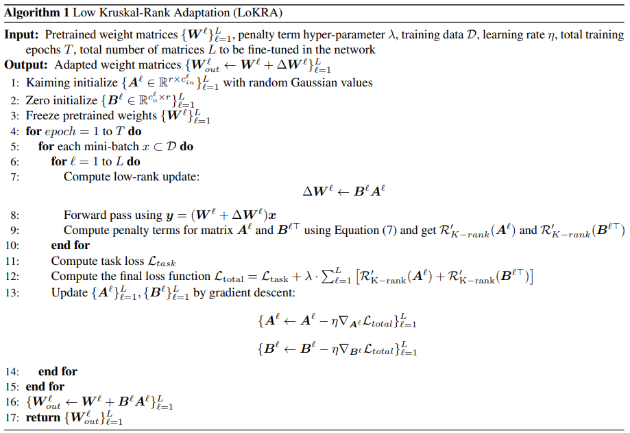
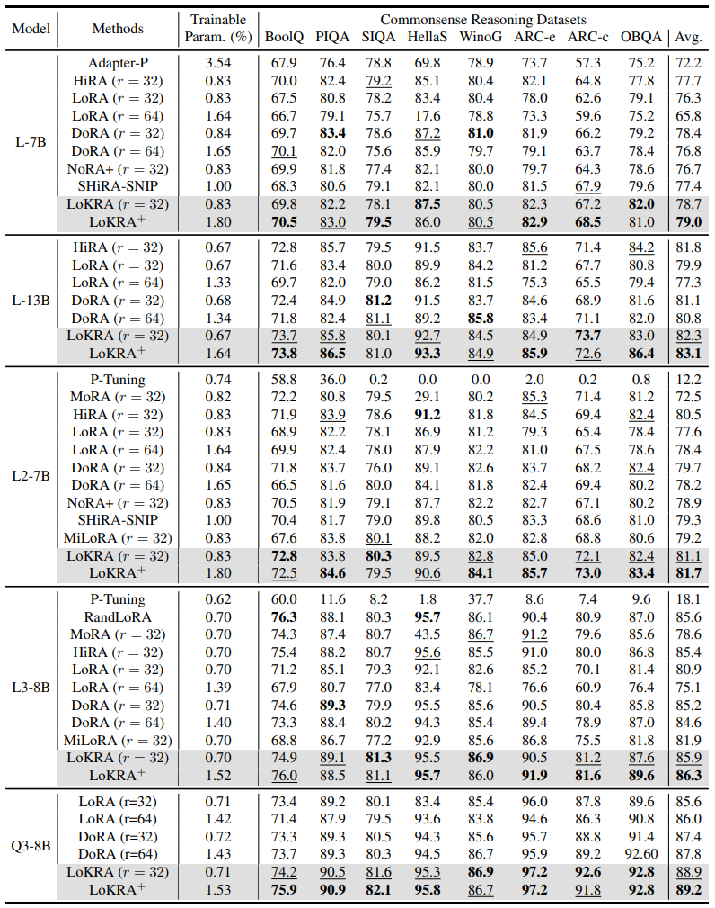

<!---
Copyright (c) 2026 Advanced Micro Devices, Inc. (AMD)

Permission is hereby granted, free of charge, to any person obtaining a copy
of this software and associated documentation files (the "Software"), to deal
in the Software without restriction, including without limitation the rights
to use, copy, modify, merge, publish, distribute, sublicense, and/or sell
copies of the Software, and to permit persons to whom the Software is
furnished to do so, subject to the following conditions:

The above copyright notice and this permission notice shall be included in all
copies or substantial portions of the Software.

THE SOFTWARE IS PROVIDED "AS IS", WITHOUT WARRANTY OF ANY KIND, EXPRESS OR
IMPLIED, INCLUDING BUT NOT LIMITED TO THE WARRANTIES OF MERCHANTABILITY,
FITNESS FOR A PARTICULAR PURPOSE AND NONINFRINGEMENT. IN NO EVENT SHALL THE
AUTHORS OR COPYRIGHT HOLDERS BE LIABLE FOR ANY CLAIM, DAMAGES OR OTHER
LIABILITY, WHETHER IN AN ACTION OF CONTRACT, TORT OR OTHERWISE, ARISING FROM,
OUT OF OR IN CONNECTION WITH THE SOFTWARE OR THE USE OR OTHER DEALINGS IN THE
SOFTWARE.
--->

# Low Kruskal-Rank Adaptation

In this blog, you will explore how to enhance Low-Rank Adaptation (LoRA) which uses matrix rank, and replace it with Kruskal rank for efficient training. LoRA is one of the most widely used parameter-efficient fine-tuning (PEFT) methods for adapting pre-trained large language models (LLMs) to downstream tasks. Although LoRA significantly reduces the number of trainable parameters and lowers fine-tuning costs, its performance is often limited by the inherent low-rank assumption. We revisit the notion of rank for LoRA update matrices and show that the standard matrix rank fails to capture duplicated directions and redundancy in the update subspace. Motivated by this analysis, we argue that the Kruskal rank offers a more informative criterion for characterizing update diversity. We therefore propose Low Kruskal Rank Adaptation (LoKRA), a new PEFT algorithm with provable theoretical guarantees that mitigates the limitations of LoRA. We further introduce LoKRA+, an enhanced variant that provides a tighter theoretical lower bound on the Kruskal rank and yields stronger empirical performance. Experiments on multiple LLMs show that our approach consistently outperforms LoRA and other baselines, establishing state-of-the-art performance across a range of benchmarks. The paper is accepted by ICML 2026 ([paper link](https://icml.cc/virtual/2026/poster/63686)), and the code is publicly available on [GitHub](https://github.com/AMD-AGI/LoKRA).

## Why LoRA Fails to Capture Redundancy?

Standard matrix rank is a local measure of independence: it only requires the existence of some linearly independent channels, while allowing arbitrary dependencies among the remaining channels. In the LoRA setting, rank guarantees at most the existence of r independent update directions, whereas the other directions can still be highly correlated or even redundant. When such directions collapse or become degenerate, the expressive capacity of the update matrix may deteriorate substantially. Unlike standard matrix rank, Kruskal rank captures global and robust independence by requiring every subset of up to k columns (rows) to be linearly independent, thereby reflecting the overall diversity of the matrix’s column (row) space. In the LoRA setting, a high Kruskal rank of the update matrix guarantees that any collection of up to k update directions remains independent, allowing the update matrix to adapt along diverse directions and potentially improving stability and generalization.

For example, consider a matrix with rank r and Kruskal rank k. If we append a new column that is identical to an existing one, no new information is introduced. Nevertheless, the matrix rank remains r, whereas the Kruskal rank drops from k to 1. This demonstrates that even when the update matrix in LoRA attains full matrix rank under its parameter budget, it may still exhibit substantial redundancy and duplicated directions, which Kruskal rank explicitly exposes.

## LoKRA and LoKRA+

Given the update matrix ∆W = BA, we optimize the Kruskal rank of A and B^T by introducing a penalty term into the original loss function and derive our LoKRA method. This algorithm can increase the Kruskal rank of learnable matrices A and B^T during LoRA training. However, LoKRA has an unbounded theoretical lower-bound that may harm performance. Thus, we use the Khatri-Rao product to replace the original matrix multiplication and obtain ∆W=D⊙C, where ⊙ represents the Khatri-Rao product. With this modification, we obtain a reasonable lower bound on the Kruskal rank of the update matrix. The LoKRA algorithm is shown below, and LoKRA+ follows a similar procedure.

<i>Algorithm 1. Low Kruskal-Rank Adaptation (LoKRA).</i>

## Results: Accuracy on AMD Hardware

<i>Table 1. Results of the proposed LoKRA and LoKRA+ and other baselines with LLaMA-7B/13B, LLaMA2-7B, LLaMA3-8B, and Qwen3-8B on commonsense reasoning datasets. For all metrics, higher is better. The best performance is bolded, and the second best is highlighted in underline.</i>

As shown in Table 1, LoKRA consistently outperforms LoRA by optimizing the K-rank of the update matrix, which better alleviates redundancy in parameter updates. Under the same trainable-parameter budget, our method improves average accuracy by 2.4%-5.0% across all base models, and surpasses the previous best method by 0.3%, 0.5%, 0.6%, 0.3%, and 1.5% on LLaMA-7B, LLaMA-13B, LLaMA2-7B, LLaMA3-8B, and Qwen3-8B, respectively. LoKRA+ further improves over LoKRA by 0.3%, 0.8%, 0.6%, 0.4%, and 0.3%. Although LoKRA+ introduces additional trainable parameters, it still achieves the best overall performance and outperforms LoRA under the same parameter budget (see Figure 1 for details). Finally, since HiRA reports results under a different training evaluation protocol (e.g., best-checkpoint selection and a different HuggingFace trainer), we re-implement HiRA under the same setting as DoRA for a fair comparison. All experiments were conducted on a single AMD Instinct MI300 Accelerator with ROCm.

## Summary

In this blog, we revisit the rank of LoRA updates and show that the conventional matrix rank is insufficient to identify redundancy and duplicated directions in parameter updates. To solve this problem, we propose a new PEFT algorithm called LoKRA that theoretically guarantees a higher Kruskal rank for the update matrix and minimizes redundancy under limited trainable parameters, by maximizing the log-determinant of each sub-matrix to promote column-wise linear independence. A LoKRA+ algorithm that replaces matrix multiplication with the Khatri-Rao product is further studied to better align with Kruskal-rank. Experimental results demonstrate the superiority of our methods.

Looking ahead, we will continue exploring the combination of Kruskal-rank and LoRA. You can dive deeper into the methodology and extensive benchmarks in our [paper](https://icml.cc/virtual/2026/poster/63686), and access our implementation on [GitHub](https://github.com/AMD-AGI/LoKRA).

We also invite you to explore the AMD Developer Cloud, featuring AMD Instinct™ accelerators purpose-built for AI workflows. For questions or collaboration opportunities, reach out to the AMD team at amd_ai_mkt@amd.com. Stay tuned for future posts, expanded tooling, and hands-on tutorials as we continue advancing LLM pruning research and deployment.

## Disclaimers

Third-party content is licensed to you directly by the third party that owns the content and is not licensed to you by AMD. ALL LINKED THIRD-PARTY CONTENT IS PROVIDED “AS IS” WITHOUT A WARRANTY OF ANY KIND. USE OF SUCH THIRD-PARTY CONTENT IS DONE AT YOUR SOLE DISCRETION AND UNDER NO CIRCUMSTANCES WILL AMD BE LIABLE TO YOU FOR ANY THIRD-PARTY CONTENT. YOU ASSUME ALL RISK AND ARE SOLELY RESPONSIBLE FOR ANY DAMAGES THAT MAY ARISE FROM YOUR USE OF THIRD-PARTY CONTENT.
