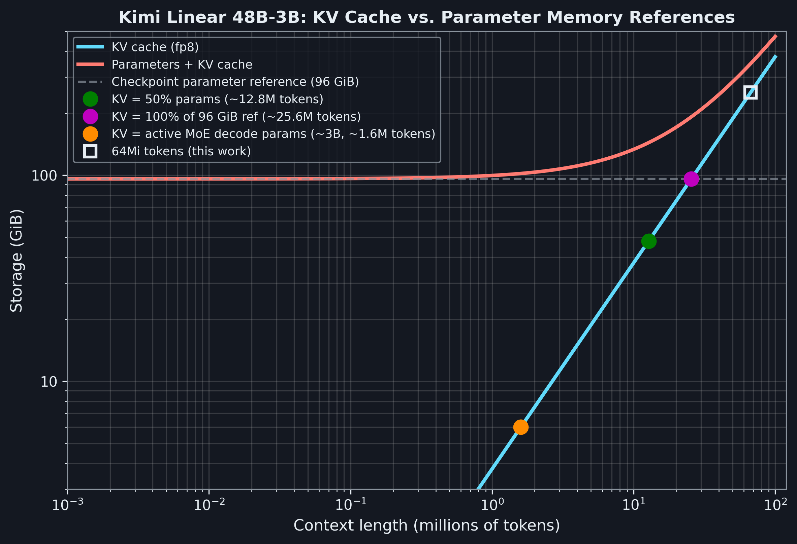
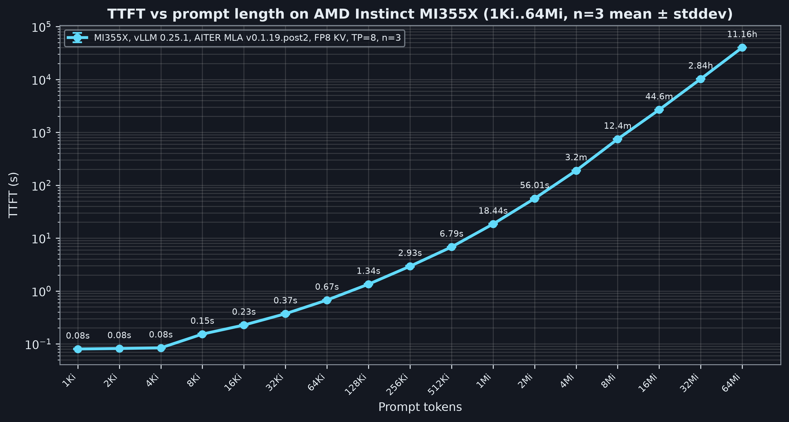
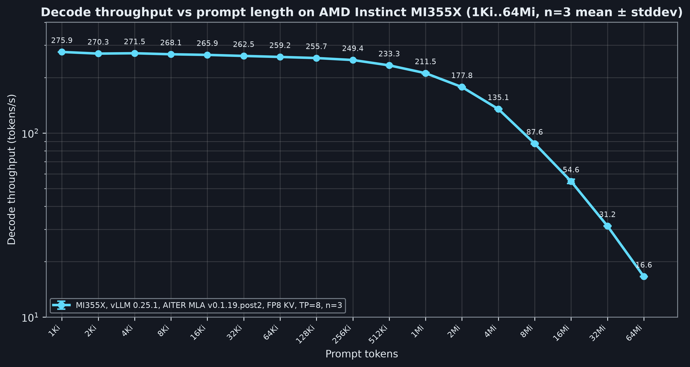

<!---
Copyright (c) 2026 Advanced Micro Devices, Inc. (AMD)

Permission is hereby granted, free of charge, to any person obtaining a copy
of this software and associated documentation files (the "Software"), to deal
in the Software without restriction, including without limitation the rights
to use, copy, modify, merge, publish, distribute, sublicense, and/or sell
copies of the Software, and to permit persons to whom the Software is
furnished to do so, subject to the following conditions:

The above copyright notice and this permission notice shall be included in all
copies or substantial portions of the Software.

THE SOFTWARE IS PROVIDED "AS IS", WITHOUT WARRANTY OF ANY KIND, EXPRESS OR
IMPLIED, INCLUDING BUT NOT LIMITED TO THE WARRANTIES OF MERCHANTABILITY,
FITNESS FOR A PARTICULAR PURPOSE AND NONINFRINGEMENT. IN NO EVENT SHALL THE
AUTHORS OR COPYRIGHT HOLDERS BE LIABLE FOR ANY CLAIM, DAMAGES OR OTHER
LIABILITY, WHETHER IN AN ACTION OF CONTRACT, TORT OR OTHERWISE, ARISING FROM,
OUT OF OR IN CONNECTION WITH THE SOFTWARE OR THE USE OR OTHER DEALINGS IN THE
SOFTWARE.
--->

# Serving 64Mi-Token Contexts on One AMD Instinct™ MI355X Node

On a single 8-GPU AMD Instinct™ MI355X node, we served Kimi Linear 48B-A3B across six orders of magnitude of context length, from 1024 tokens out to 64Mi (67,108,864). We ran vLLM with an FP8 KV cache and tensor parallelism set to 8 (TP=8), and we recorded prefill time-to-first-token (TTFT) as well as decode throughput at every length [\[1\]](#endnotes).

This blog reports those numbers, shows how FP8 KV storage lets the largest contexts fit on one node, and gives you a single command to reproduce the whole sweep.

## Long-Context Workloads

Long context has moved from research demos into shipping developer tools. [VSCode 1.123](https://code.visualstudio.com/updates/v1_123) (June 2026) enabled 1M-token context windows in chat and agent workflows for compatible Anthropic and OpenAI models. [Claude Opus 4.6](https://www.anthropic.com/news/claude-opus-4-6) brought 1M context to Anthropic's Opus-class models in beta, and Google's [Gemini 1.5 Pro reached a 2M-token window in general availability](https://developers.googleblog.com/en/new-features-for-the-gemini-api-and-google-ai-studio/) in mid-2024. The same scaling pressure shows up beyond LLMs: recent vision-transformer work on AMD Instinct™ MI250X has [scaled self-attention to 1M-token sequences](https://journals.sagepub.com/doi/10.1177/10943420251394758) for climate and scientific imaging. The workloads driving that change cluster into three patterns.

**Whole-repository code understanding.** Repository-scale code understanding and refactoring routinely run into millions of source tokens. Anthropic's [1M-context announcement](https://www.anthropic.com/news/1m-context) cites loading "entire codebases ... over 75,000 lines of code" in a single request.

**Long-horizon agents.** Agents accumulate tool-call histories and intermediate reasoning with no natural truncation point, to the point that vendors are now shipping dedicated [context-compaction features](https://www.anthropic.com/news/claude-opus-4-6) to keep long-running sessions inside the window.

**Resident in-context corpora.** Teams increasingly keep a whole corpus in context when relationships span documents or regions, since retrieval-based chunking tends to flatten those relationships. [Evo 2](https://www.nature.com/articles/s41586-026-10176-5) (Nature, 2026) trains a 1M-token biological foundation model at single-nucleotide resolution, the resolution needed to span entire chromosome regions in one pass. The [many-shot in-context learning](https://arxiv.org/abs/2404.11018) regime, evaluated on Gemini 1.5 Pro's 1M window, shows the same pattern in a model-agnostic form. Resident in-context corpora deliver measurable gains over few-shot prompting across a wide range of tasks.

All three cases favor a **build-once, reuse-many** approach over per-query prefill. You pay for the expensive prefix at most once, then reuse it across many user suffixes.

Most "long-context" inference work today targets prompts in the 100K–1M range, well inside the context envelope of contemporary open-weight models. We asked a harder question. **How far can we push a single open-weight model on one node?** Answering that question means serving a prefix 64× larger than the model's advertised limit.

At this scale, three system-level effects dominate:

- **Capacity becomes the limiting factor.** Each AMD Instinct MI355X GPU has 288 GiB of HBM. Under TP=8, model parameters are sharded across the 8 ranks (~12 GiB per rank in BF16), but the KV cache is **replicated per rank** in the current multi-head latent attention (MLA) implementation, so the per-rank HBM has to hold the full KV footprint. At 64Mi tokens, the BF16 KV cache does not fit, and FP8 KV storage enables this cache to fit on one node.

- **Prefill becomes the dominant cost.** A 64Mi prefill takes about 11.2 hours before the first token appears (n=3 mean) [\[1\]](#endnotes), so one prefix has to serve many requests to amortize the prefill cost.
- **Implementation assumptions break past the advertised envelope.** Cache-replication, workspace-sizing, and dispatch-table assumptions that hold inside the advertised 1M-token envelope can break past it. Beyond 16Mi tokens, KV addressing needs 64 bit pointers.

This blog walks through how we made this operating point work on AMD Instinct™ MI355X hardware and what we measured.

## The Model and the Hardware

**Model.** We picked Kimi Linear 48B-A3B (`moonshotai/Kimi-Linear-48B-A3B-Instruct`, revision `e1df551a…`), a mixture-of-experts (MoE) model with about 3B of its 48B parameters active per token, for its hybrid attention stack, which suits long-context tasks:

- **7 multi-head latent attention (MLA) layers** with a low-rank KV factorization (rank 512 and a 64-dimensional RoPE component). MLA's quadratic attention cost is the dominant prefill term at long context.
- **20 Kimi Delta Attention (KDA) layers**, linear-attention layers with short convolution buffers. Their per-token state is constant, so it does not grow with the prompt length $L$.

The hybrid design has no absolute positional encoding to break, so Kimi Linear is a credible candidate for extending context at inference time.

**Hardware.** One 8-GPU AMD Instinct™ MI355X node (`gfx950`, AMD ROCm™ 7.2.3 software stack, Ubuntu 22.04.5 LTS with Linux 6.8.0, AMD EPYC™ host CPUs). Each GPU has 288 GiB of HBM3e (~2.25 TiB aggregate per node). Under TP=8, each tensor-parallel rank lives on one GPU and has the full 288 GiB available to it.

**Serving stack.** vLLM, FP8 AITER MLA backend, tensor parallelism = 8, data parallelism = 1, pipeline parallelism = 1, FP8 (`fp8_e4m3`) KV cache, custom all-reduce enabled, full-graph capture for decode plus piecewise capture for prefill. Exact version pins are in [Reproducing the Sweep](#reproducing-the-sweep).

## KV Cache Capacity is the Bottleneck

The KV cache is the only piece of model state whose size grows with prompt length. Every MLA layer appends two compressed vectors per token to its cache: a latent KV projection of width $r_{kv}$ and a positional RoPE-key of width $d_{\mathrm{rope}}$. The 20 KDA layers carry constant-size recurrent state (~43 MiB total, independent of $L$). Only the 7 MLA layers grow. So at a given precision, the model architecture fixes the KV bytes per token, and the *total* KV cache scales linearly in $L$:

$$B_{\mathrm{KV}}(L) = N_{\mathrm{MLA}} \cdot L \cdot (r_{kv} + d_{\mathrm{rope}}) \cdot s_{kv}.$$

Here $B_{\mathrm{KV}}(L)$ is the total KV cache size in bytes and $L$ is the prompt length in tokens. The model fixes the rest: $N_{\mathrm{MLA}} = 7$ MLA layers, latent KV rank $r_{kv} = 512$, and cached RoPE-key dimension $d_{\mathrm{rope}} = 64$. The per-element byte size $s_{kv}$ is 1 in FP8 and 2 in BF16. Substituting the constants gives

$$B_{\mathrm{KV}}(L) = 7 \cdot L \cdot 576 \cdot s_{kv},$$

which yields **4032 bytes per token in FP8 and 8064 bytes per token in BF16**. The "linear in $L$" property makes long context expensive. At the model's advertised 1Mi limit, the KV cache is roughly 4 GiB, but at 64Mi it grows by a factor of 64 to 252 GiB, into the same range as the full model checkpoint. Plugging in $L = 64\text{Mi}$:

| KV precision | Per-rank logical KV at 64Mi | Fits in 288 GiB per rank? |
| --- | ---: | :---: |
| BF16 | **504 GiB** | No |
| FP8 | **252.0 GiB** | Yes |

Three crossover points sit well below the target operating point:

- KV reaches the **active MoE decode footprint** (~6 GiB BF16, ~3B params) at **~1.6M** tokens.
- KV reaches **50% of the 96 GiB checkpoint** at **~12.8M** tokens.
- KV reaches **parity with the full 96 GiB checkpoint** at **~25.6M** tokens.

By 64Mi, KV is **2.625× the full-checkpoint reference**. At 64Mi, we have to either lower KV precision or shard the MLA cache row across ranks. We lowered KV precision. Figure 1 below plots this KV growth against the model's fixed parameter memory and marks the crossover points above.



*Figure 1. KV cache footprint as a function of context length. FP8 KV at the 64Mi operating point (open square) sits at ~252 GiB, dominated by the seven MLA layers. KDA recurrent and convolution state contributes only ~43 MiB total and is invisible at this scale.*

## Results: 1Ki to 64Mi on AMD Instinct MI355X

*This section reports systems-capacity and serving measurements. We do not claim that Kimi Linear's task accuracy holds at 64Mi tokens, which is 64× beyond the model's advertised 1Mi context limit.*

We swept the input length over all 17 powers of 2 from 1Ki to 64Mi (1024 to 67,108,864 tokens), and we ran the full sweep three times on the same physical node, so the spread reflects run-to-run rather than node-to-node variance. Before each measurement, we warmed up `vllm serve` with three short prompts. We measured prefill at each length on the first request. Before every run, we checked that the tokenized prompt length matched the target, and after every timed run, we checked that decode produced output.

All numbers below are n=3 mean ± stddev across the three passes. The decode-throughput coefficient of variation stays under 1% across the entire sweep, apart from 16Mi at 2.7%. At the long-context points where TTFT is a meaningful prefill metric (≥1Mi), the three passes agree to within ~1.3%.

As Figure 2 below shows, **TTFT** grows steeply with context length [\[1\]](#endnotes):



*Figure 2. Prefill time-to-first-token versus prompt length on a single AMD Instinct MI355X node (n=3 mean ± stddev). TTFT grows steeply with context length as the MLA prefill cost dominates, from 0.08 s at 1Ki through 18.44 s at 1Mi to 11.16 hours at 64Mi.*

Decode slows down more gently. As Figure 3 below shows, **decode throughput** falls by roughly 17× across the sweep [\[1\]](#endnotes):



*Figure 3. Decode throughput versus prompt length on a single AMD Instinct MI355X node (n=3 mean ± stddev). Throughput declines gradually across the full sweep, from 275.9 tok/s at 1Ki to 16.6 tok/s at 64Mi, as the growing KV cache raises per-token decode cost.*

Table 1 below lists selected points from the measurement sweep, giving the exact values behind both curves (n=3 mean ± stddev) [\[1\]](#endnotes).

| Prompt | Tokens | TTFT (s) | Decode tok/s |
| :--- | ---: | ---: | ---: |
| 1Ki | 1,024 | 0.08 ± 0.00 | 275.9 ± 0.3 |
| 64Ki | 65,536 | 0.67 ± 0.01 | 259.2 ± 0.3 |
| 1Mi | 1,048,576 | 18.44 ± 0.24 | 211.5 ± 1.7 |
| 8Mi | 8,388,608 | 745.22 ± 2.45 | 87.6 ± 0.5 |
| 32Mi | 33,554,432 | 10,224.59 ± 43.65 | 31.2 ± 0.1 |
| 64Mi | 67,108,864 | 40,171.67 ± 115.49 | 16.6 ± 0.0 |

*Table 1. Selected points from the 1Ki–64Mi sweep on one 8-GPU AMD Instinct MI355X node (n=3 mean ± stddev).*

Prefill dominates the economics at the long end. A 1Ki-token response at 64Mi takes about a minute, or 0.15% of the 11.2-hour prefill that produced it. Any practical use at this length therefore depends on amortizing that prefill across many requests sharing a resident prefix.

## Reproducing the Sweep

We produced the numbers in [Results: 1Ki to 64Mi on AMD Instinct MI355X](#results-1ki-to-64mi-on-amd-instinct-mi355x) with a pinned vLLM 0.25.1 container image (`long-context-serving:v0.25.1`) that uses AITER MLA kernels. The image and the sweep scripts live in the [`AMDLongContextServing`](https://github.com/AMD-AGI/AMDLongContextServing) repository. To reproduce our numbers, pin AITER at release `v0.1.19.post2`, which supports 64-bit KV-addresses for contexts beyond $2^{24}$ (16Mi) tokens. Clone the repository and run a single command from the repo root. That command builds the image, generates the prompt data, and runs the sweep inside the container:

```bash
git clone https://github.com/AMD-AGI/AMDLongContextServing
cd AMDLongContextServing
make run                              # full 1Ki..64Mi sweep
make run FROM=4Mi TO=8Mi REPEATS=3    # sub-range with repeats per point
```

`FROM` and `TO` are inclusive context-length bounds expanded to powers of two (accepting `Ki`/`Mi` suffixes or raw token counts), and `REPEATS` sets the number of measured runs per point. The benchmark downloads a gated model from Hugging Face, so set `HF_TOKEN` in the environment or write the token to `~/hf_token` before the first run. The benchmark appends to the campaign report at `experiments/hf_long_context/runs/<run_id>_campaign/report.md` after every sweep point.

## Summary

In this blog, we served Kimi Linear 48B-A3B across six orders of magnitude of context length on a single 8-GPU AMD Instinct™ MI355X node. We swept from 1024 tokens out to 64Mi (67,108,864) and measured prefill TTFT and decode throughput at every point. An FP8 KV cache brings the per-rank KV footprint from 504 GiB in BF16 down to 252 GiB, so serving fits on one node. We packaged the entire sweep behind a single reproducible command so you can run it yourself. We also documented the systems behavior that only appears at extreme context: prefill dominates cold-start cost, decode throughput falls by a factor of 17 across the range, and the build-once, reuse-many pattern becomes essential.

These results give practitioners a concrete, measured baseline for long-context serving on AMD Instinct hardware, so they do not need to rely on advertised context limits alone. Clone the [`AMDLongContextServing`](https://github.com/AMD-AGI/AMDLongContextServing) repository and reproduce the sweep on your own node.

---

## Endnotes

<a id="endnotes"></a>

**[1]** Based on testing by AMD in August 2026, measuring prefill time-to-first-token (TTFT) and decode throughput for Kimi Linear 48B-A3B (`moonshotai/Kimi-Linear-48B-A3B-Instruct`) on a single 8-GPU AMD Instinct™ MI355X node (`gfx950`, ROCm 7.2.3, Ubuntu 22.04.5 LTS, AMD EPYC host CPUs) under vLLM 0.25.1 with the AITER MLA backend, FP8 (`fp8_e4m3`) KV cache, tensor parallelism = 8, data parallelism = 1, pipeline parallelism = 1, custom all-reduce enabled, full-graph capture for decode plus piecewise capture for prefill. Prompt lengths swept over all 17 powers of 2 from 1024 to 67,108,864 tokens using synthetic input scaled to each target length. Reported values are n=3 mean ± standard deviation across three independent passes of the full sweep. TTFT is measured until the first emitted token. Decode throughput is measured per emitted token. Server manufacturers may vary configurations, yielding different results. Performance may vary based on the use of the latest drivers and optimizations.

## Disclaimers

© 2026 Advanced Micro Devices, Inc. All rights reserved. AMD, the AMD Arrow logo, Instinct, EPYC, ROCm, and combinations thereof are trademarks of Advanced Micro Devices, Inc. Microsoft and Visual Studio Code are trademarks of Microsoft Corporation. Anthropic and Claude are trademarks of Anthropic, PBC. Google and Gemini are trademarks of Google LLC. OpenAI is a trademark of OpenAI, Inc. Moonshot AI and Kimi are trademarks of Moonshot AI. Other product names used in this publication are for identification purposes only and may be trademarks of their respective owners.

Third-party content is licensed to you directly by the third party that owns the content and is not licensed to you by AMD. ALL LINKED THIRD-PARTY CONTENT IS PROVIDED "AS IS" WITHOUT A WARRANTY OF ANY KIND. USE OF SUCH THIRD-PARTY CONTENT IS DONE AT YOUR SOLE DISCRETION AND UNDER NO CIRCUMSTANCES WILL AMD BE LIABLE TO YOU FOR ANY THIRD-PARTY CONTENT. IN NO EVENT WILL AMD BE LIABLE TO ANY PERSON FOR ANY RELIANCE, DIRECT, INDIRECT, SPECIAL, OR OTHER CONSEQUENTIAL DAMAGES ARISING FROM THE USE OF ANY INFORMATION CONTAINED HEREIN, EVEN IF AMD IS EXPRESSLY ADVISED OF THE POSSIBILITY OF SUCH DAMAGES.

© 2026 Advanced Micro Devices, Inc. All rights reserved
