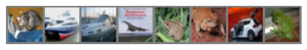

# Using LoRA for efficient fine-tuning: Fundamental principles

<span style="font-size:0.7em;">5, Feb 2024 by {hoverxref}`Sean Song<seansong>`. </span>

[Low-Rank Adaptation of Large Language Models (LoRA)](https://arxiv.org/abs/2106.09685) is used to
address the challenges of fine-tuning large language models (LLMs). Models like GPT and Llama, which
boast billions of parameters, are typically cost-prohibitive to fine-tune for specific tasks or domains.
LoRA preserves pre-trained model weights and incorporates trainable layers within each model block.
This results in a significant reduction in the number of parameters that need to be fine-tuned and
considerably reduces GPU memory requirements. The key benefit of LoRA is that it substantially
decreases the number of trainable parameters--sometimes by a factor of up to 10,000--leading to a
considerable decrease in GPU resource demands.

## Why LoRA works

Pre-trained LLMs have a low “intrinsic dimension” when they are adapted to a new task, which means
that data can be effectively represented or approximated by a lower-dimensional space while retaining
most of its essential information or structure. We can decompose the new weight matrix for the
adapted task into lower-dimensional (smaller) matrices without losing a lot of important information.
We achieve this by low-rank approximation.

The rank of a matrix is a value that gives you an idea of the matrix’s complexity. A low-rank
approximation of a matrix aims to approximate the original matrix as closely as possible, but with a
lower rank. A lower-rank matrix reduces computational complexity, and thus increases the efficiency of
matrix multiplications. Low-rank decomposition refers to the process of effectively approximating
matrix A by deriving low-rank approximations of A. Singular value decomposition (SVD) is a common
method for low-rank decomposition.

Suppose `W` represents the weight matrix in a given neural network layer and suppose `ΔW` is the
weight update for `W` after a full fine-tuning. We can then decompose the weight update matrix `ΔW`
into two smaller matrices: `ΔW = WA*WB`, where `WA` is an `A × r`-dimensional matrix, and `WB` is an
`r × B`-dimensional matrix. Here, we keep the original weight `W` frozen and only train the new
matrices `WA` and `WB`. This summarizes the LoRA method, which is also illustrated in the following
figure.


## The benefits of LoRA

* **Reduced resource consumption.**
    Fine-tuning deep learning models typically requires substantial computational resources, which can
    be expensive and time-consuming. LoRA reduces the demand for resources while maintaining high
    performance.

* **Faster iterations.**
    LoRA enables rapid iterations, making it easier to experiment with different fine-tuning tasks and
    adapt models quickly.

* **Improved transfer learning.**
    LoRA enhances the effectiveness of transfer learning, as models with LoRA adapters can be
    fine-tuned with fewer data. This is particularly valuable in situations where labeled data are
    scarce.

* **Broad applicability.**
    LoRA is versatile and can be applied across diverse domains, including natural language processing,
    computer vision, and speech recognition.

* **Lower carbon footprint.**
    By reducing computational requirements, LoRA contributes to a greener and more sustainable
    approach to deep learning.

## Train a neural network using the LoRA technique

In this blog, we utilize the [CIFAR-10](https://www.cs.toronto.edu/~kriz/cifar.html) dataset to train a basic image classifier from scratch using several epochs. Following that, we further train the model with LoRA, illustrating the advantages of incorporating LoRA into the training process.

### Setup

This demo was creating using the following settings. For comprehensive support details, please refer to the [ROCm documentation](https://rocm.docs.amd.com/projects/install-on-linux/en/latest/).

* Hardware & OS:
  * [AMD Instinct GPU](https://www.amd.com/en/products/accelerators/instinct.html)
  * Ubuntu 22.04.3 LTS
* Software:
  * [ROCm 5.7.0+](https://rocm.docs.amd.com/en/latest/)
  * [Pytorch 2.0+](https://pytorch.org/)

### Getting started

1. Import the packages.

    ```python
    import torch
    import torchvision
    import torchvision.transforms as transforms
    ```

2. Load the dataset and set the device.

    ```python
    # 10 classes from CIFAR10 dataset
    classes = ('airplane', 'automobile', 'bird', 'cat', 'deer', 'dog', 'frog', 'horse', 'ship', 'truck')

    # batch size
    batch_size = 8

    # image preprocessing
    preprocessor = transforms.Compose(
        [transforms.ToTensor(),
        transforms.Normalize((0.5, 0.5, 0.5), (0.5, 0.5, 0.5))])

    # training dataset
    train_set = torchvision.datasets.CIFAR10(root='./dataset', train=True,
                                            download=True, transform=preprocessor)
    train_loader = torch.utils.data.DataLoader(train_set, batch_size=batch_size,
                                            shuffle=True, num_workers=8)
    # test dataset
    test_set = torchvision.datasets.CIFAR10(root='./dataset', train=False,
                                        download=True, transform=preprocessor)
    test_loader = torch.utils.data.DataLoader(test_set, batch_size=batch_size,
                                            shuffle=False, num_workers=8)

    # Define the device
    device = torch.device("cuda:0" if torch.cuda.is_available() else "cpu")
    ```

3. Display some samples from the dataset.

    ```python
    import matplotlib.pyplot as plt
    import numpy as np

    # helper function to display image
    def image_display(images):
        # get the original image
        images = images * 0.5 + 0.5
        plt.imshow(np.transpose(images.numpy(), (1, 2, 0)))
        plt.axis('off')
        plt.show()

    # get a batch of images
    images, labels = next(iter(train_loader))
    # display images
    image_display(torchvision.utils.make_grid(images))
    # show ground truth labels
    print('Ground truth labels: ', ' '.join(f'{classes[labels[j]]}' for j in range(images.shape[0])))
    ```

    Output:

    

    ```text
    Ground truth labels:  cat ship ship airplane frog frog automobile frog
    ```

4. Create a basic three-layer neural network for image classification, focusing on simplicity to clearly illustrate the LoRA effect.

    ```python
    import torch.nn as nn
    import torch.nn.functional as F

    class net(nn.Module):
        def __init__(self):
            super().__init__()
            self.fc1 = nn.Linear(3*32*32, 4096)
            self.fc2 = nn.Linear(4096, 2048)
            self.fc3 = nn.Linear(2048, 10)

        def forward(self, x):
            x = torch.flatten(x, 1)
            x = F.relu(self.fc1(x))
            x = F.relu(self.fc2(x))
            x = self.fc3(x)
            return x

    # move the model to device
    classifier = net().to(device)
    ```

5. Train the model.

    We use [cross-entropy](https://pytorch.org/docs/stable/generated/torch.nn.CrossEntropyLoss.html) loss and [Adam](https://pytorch.org/docs/stable/generated/torch.optim.Adam.html) for the loss function and optimizer.

    ```python
    import torch.optim as optim

    def train(train_loader, classifier, start_epoch = 0, epochs=1, device="cuda:0"):
        classifier = classifier.to(device)
        classifier.train()
        criterion = nn.CrossEntropyLoss()
        optimizer = optim.Adam(classifier.parameters(), lr=0.001)
        
        for epoch in range(epochs):  # training loop

            loss_log = 0.0
            for i, data in enumerate(train_loader, 0):
                inputs, labels = data[0].to(device), data[1].to(device)
                # Resets the parameter gradients
                optimizer.zero_grad()
        
                outputs = classifier(inputs)
                loss = criterion(outputs, labels)
                loss.backward()
                optimizer.step()
        
                # print loss after every 1000 mini-batches
                loss_log += loss.item()
                if i % 2000 == 1999:    
                    print(f'[{start_epoch + epoch}, {i+1:5d}] loss: {loss_log / 2000:.3f}')
                    loss_log = 0.0
    ```

    Start to train the model.

    ```python
    import time

    start_epoch = 0
    epochs = 1
    # warm up the gpu with one epoch
    train(train_loader, classifier, start_epoch=start_epoch, epochs=epochs, device=device)

    # run another epoch to record the time
    start_epoch += epochs
    epochs = 1
    start = time.time()
    train(train_loader, classifier, start_epoch=start_epoch, epochs=epochs, device=device)
    torch.cuda.synchronize()
    end = time.time()
    train_time = (end - start)

    print(f"One epoch takes {train_time:.3f} seconds")
    ```

    Output:

    ```text
        [0,  2000] loss: 1.987
        [0,  4000] loss: 1.906
        [0,  6000] loss: 1.843
        [1,  2000] loss: 1.807
        [1,  4000] loss: 1.802
        [1,  6000] loss: 1.782
        One epoch takes 31.896 seconds
    ```

    It takes around 31 seconds for one epoch.

    Save the model.

    ```python
    model_path = './classifier_cira10.pth'
    torch.save(classifier.state_dict(), model_path)
    ```

    We will train the same model with LoRA applied later and check how long it takes to train with one epoch.

6. Load the saved model and have a quick test.

    ```python
    # Prepare the test data.
    images, labels = next(iter(test_loader))
    # display the test images
    image_display(torchvision.utils.make_grid(images))
    # show ground truth labels
    print('Ground truth labels: ', ' '.join(f'{classes[labels[j]]}' for j in range(images.shape[0])))

    # Load the saved model and have a test
    model = net()
    model.load_state_dict(torch.load(model_path))
    model = model.to(device)
    images = images.to(device)
    outputs = model(images)
    _, predicted = torch.max(outputs, 1)

    print('Predicted: ', ' '.join(f'{classes[predicted[j]]}'
                                for j in range(images.shape[0])))
    ```

    Output:

    

    ```text
    Ground truth labels:  cat ship ship airplane frog frog automobile frog
    Predicted:  deer truck airplane ship deer frog automobile bird
    ```

    We observe that training the model for only two epochs does not produce a satisfactory outcome. Let's examine how the model performs on the entire test dataset.

    ```python
    def test(model, test_loader, device):
        model=model.to(device)
        model.eval()
        correct = 0
        total = 0
        with torch.no_grad():
            for data in test_loader:
                images, labels = data[0].to(device), data[1].to(device)
                # images = images.to(device)
                # labels = labels.to(device)
                # inference
                outputs = model(images)
                # get the best prediction
                _, predicted = torch.max(outputs.data, 1)
                
                total += labels.size(0)
                correct += (predicted == labels).sum().item()
        
        print(f'Accuracy of the given model on the {total} test images is {100 * correct // total} %')

    test(model, test_loader, device)
    ```

   Output:

    ```text
        Accuracy of the given model on the 10000 test images is 32 %
    ```

    This outcome suggests that there is significant potential to improve the model through further training. In the following sections, we will apply LoRA to the model and continue the training using this approach.

7. Apply LoRA to the model.

    Define helper functions used to apply LoRA to the model.

    ```python
    class ParametrizationWithLoRA(nn.Module):
        def __init__(self, features_in, features_out, rank=1, alpha=1, device='cpu'):
            super().__init__()

            # Create A B and scale used in ∆W = BA x α/r
            self.lora_weights_A = nn.Parameter(torch.zeros((rank,features_out)).to(device))
            nn.init.normal_(self.lora_weights_A, mean=0, std=1)
            self.lora_weights_B = nn.Parameter(torch.zeros((features_in, rank)).to(device))
            self.scale = alpha / rank
            
            self.enabled = True

        def forward(self, original_weights):
            if self.enabled:
                return original_weights + torch.matmul(self.lora_weights_B, self.lora_weights_A).view(original_weights.shape) * self.scale
            else:
                return original_weights

    def apply_parameterization_lora(layer, device, rank=1, alpha=1):
        """
        Apply loRA to a given layer
        """
        features_in, features_out = layer.weight.shape
        return ParametrizationWithLoRA(
            features_in, features_out, rank=rank, alpha=alpha, device=device
        )
        
    def enable_lora(model, enabled=True):
        """
        enabled = True: incorporate the the lora parameters to the model
        enabled = False: the lora parameters have no impact on the model
        """
        for layer in [model.fc1, model.fc2, model.fc3]:
            layer.parametrizations["weight"][0].enabled = enabled
    ```

    Apply LoRA to our model.

    ```python
    import torch.nn.utils.parametrize as parametrize
    parametrize.register_parametrization(model.fc1, "weight", apply_parameterization_lora(model.fc1, device))
    parametrize.register_parametrization(model.fc2, "weight", apply_parameterization_lora(model.fc2, device))
    parametrize.register_parametrization(model.fc3, "weight", apply_parameterization_lora(model.fc3, device))
    ```

    Now, our model's parameters comprise two parts: the original parameters and the parameters introduced by LoRA. As we have not yet trained this updated model, the LoRA weights are initialized in a manner that should not impact the model's accuracy (refer to 'ParametrizationWithLoRA'). Therefore, disabling or enabling LoRA should result in the same accuracy for the model. Let's test this hypothesis.

    ```python
    enable_lora(model, enabled=False)
    test(model, test_loader, device)
    ```

    Output:

    ```text
        Accuracy of the network on the 10000 test images: 32 %
    ```

    ```python
    enable_lora(model, enabled=True)
    test(model, test_loader, device)
    ```

    Output:

    ```text
        Accuracy of the network on the 10000 test images: 32 %
    ```

    That's what we expected.

    Now let's take a look how many parameters were added by LoRA.

    ```python
    total_lora_params = 0
    total_original_params = 0
    for index, layer in enumerate([model.fc1, model.fc2, model.fc3]):
        total_lora_params += layer.parametrizations["weight"][0].lora_weights_A.nelement() + layer.parametrizations["weight"][0].lora_weights_B.nelement()
        total_original_params += layer.weight.nelement() + layer.bias.nelement()

    print(f'Number of parameters in the model with LoRA: {total_lora_params + total_original_params:,}')
    print(f'Parameters added by LoRA: {total_lora_params:,}')
    params_increment = (total_lora_params / total_original_params) * 100
    print(f'Parameters increment: {params_increment:.3f}%')
    ```

    Output:

    ```text
        Number of parameters in the model with LoRA: 21,013,524
        Parameters added by LoRA: 15,370
        Parameters increment: 0.073%
    ```

    The LoRA only adds 0.073% parameters to our model.

8. Continue to train the model with LoRA

    Before we continue to train the model we want to freeze all the model's original parameters as the paper mentioned. By doing this we only update the weights introduced by LoRA, which is 0.073% of the amount of the original model's parameters.

    ```python
    for name, param in model.named_parameters():
        if 'lora' not in name:
            param.requires_grad = False
    ```

    Continue to train the model with LoRA applied.

    ```python
    # make sure the loRA is enabled 
    enable_lora(model, enabled=True)

    start_epoch += epochs
    epochs = 1
    # warm up the GPU with the new model (loRA enabled) one epoch for testing the training time
    train(train_loader, model, start_epoch=start_epoch, epochs=epochs, device=device)

    start = time.time()
    # run another epoch to record the time
    start_epoch += epochs
    epochs = 1
    import time
    start = time.time()
    train(train_loader, model, start_epoch=start_epoch, epochs=epochs, device=device)
    torch.cuda.synchronize()
    end = time.time()
    train_time = (end - start)
    print(f"One epoch takes {train_time} seconds")
    ```

    Output:

    ```text
        [2,  2000] loss: 1.643
        [2,  4000] loss: 1.606
        [2,  6000] loss: 1.601
        [3,  2000] loss: 1.568
        [3,  4000] loss: 1.560
        [3,  6000] loss: 1.585
        One epoch takes 16.622623205184937 seconds
    ```

    You may notice that it now only takes around 16 seconds to complete training for one epoch, which is approximately 53% of the time required to train the original model (31 seconds).

    The decrease in loss signifies that the model has learned from updating the parameters introduced by LoRA. Now, if we test the model with LoRA enabled, the accuracy should be higher than what we previously achieved with the original model (32%). If we disable LoRA, the model should yield the same accuracy as the original model. Let's proceed with these tests.

    ```python
    enable_lora(model, enabled=True)
    test(model, test_loader, device)
    enable_lora(model, enabled=False)
    test(model, test_loader, device)
    ```

    Output:

    ```text
        Accuracy of the given model on the 10000 test images is 42 %
        Accuracy of the given model on the 10000 test images is 32 %
    ```

    Test the updated model again with the previous images.

    ```python
    # display the test images
    image_display(torchvision.utils.make_grid(images.cpu()))
    # show ground truth labels
    print('Ground truth labels: ', ' '.join(f'{classes[labels[j]]}' for j in range(images.shape[0])))

    # Load the saved model and have a test
    enable_lora(model, enabled=True)
    images = images.to(device)
    outputs = model(images)
    _, predicted = torch.max(outputs, 1)

    print('Predicted: ', ' '.join(f'{classes[predicted[j]]}'
                                for j in range(images.shape[0])))
    ```

    Output:

    

    ```text
        Ground truth labels:  cat ship ship airplane frog frog automobile frog
        Predicted:  cat ship ship ship frog frog automobile frog
    ```

    We can observe that the new model performed better compared to the results obtained in step 6, demonstrating that the parameters have indeed learned meaningful information.

## Conclusion

In this blog post, we explore the LoRA algorithm, delving into its principles and implementation on AMD GPU with ROCm. We have developed a basic network and LoRA modules from scratch to demonstrate how LoRA effectively reduces trainable parameters and training time. We invite you to delve deeper by reading about [Fine-tuning the Llama model with LoRA](https://rocm.blogs.amd.com/artificial-intelligence/llama-lora/README.html) and [Fine-tuning Llama on a single AMD GPU with QLoRA](https://rocm.blogs.amd.com/artificial-intelligence/llama-Qlora/README.html).

## Disclaimers

Third-party content is licensed to you directly by the third party that owns the content and is not licensed to you by AMD. ALL LINKED THIRD-PARTY CONTENT IS PROVIDED “AS IS” WITHOUT A WARRANTY OF ANY KIND. USE OF SUCH THIRD-PARTY CONTENT IS DONE AT YOUR SOLE DISCRETION AND UNDER NO CIRCUMSTANCES WILL AMD BE LIABLE TO YOU FOR ANY THIRD-PARTY CONTENT. YOU ASSUME ALL RISK AND ARE SOLELY RESPONSIBLE FOR ANY DAMAGES THAT MAY ARISE FROM YOUR USE OF THIRD-PARTY CONTENT.
