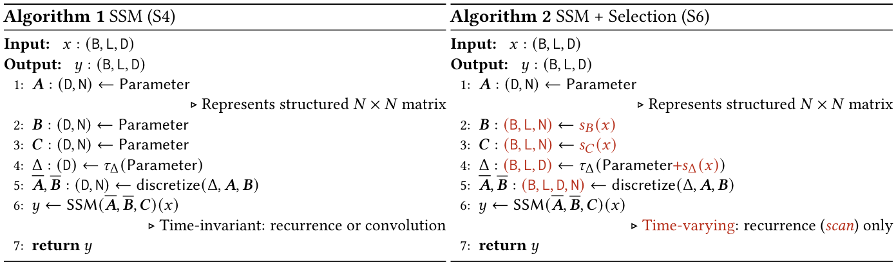
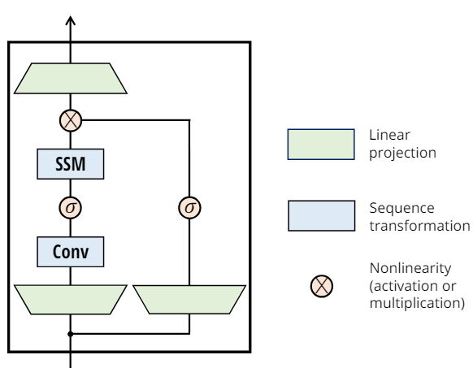
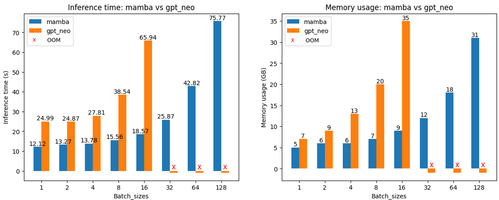

# Mamba on AMD GPUs with ROCm

<span style="font-size:0.7em;">28, Jun 2024 by {hoverxref}`Sean Song<seansong>`, {hoverxref}`Jassani Adeem<jassadee>`, {hoverxref}`Moskvichev Arseny<moskarse>`. </span>

Recently, [Mamba](https://arxiv.org/abs/2312.00752) introduced a novel architecture that not only surpasses the Transformers in modeling effectiveness but also achieves linear scaling to the input sequence length.

In this blog, we delve into the Mamba architecture and demonstrate how to use Mamba on AMD GPUs with the ROCm platform.

## Mamba basics: Selective SSM

The Transformer architecture is a foundational model, achieving state-of-the-art performance across various modalities, including language, vision, and audio. Despite its success, Transformers, driven by the [attention mechanism](https://arxiv.org/abs/1706.03762), exhibit fundamental limitations. Firstly, their computational complexity scales quadratically with sequence length. Secondly, they are constrained to model within a finite context window. Numerous novel architectures have been proposed to address these issues, such as [linear attention mechanisms](https://arxiv.org/abs/2006.16236), [gated convolutional and recurrent models](https://arxiv.org/abs/1612.08083), and [structured state space models (SSMs)](https://arxiv.org/abs/2303.03982). While these alternatives often achieve subquadratic or linear-time computational efficiency, they typically fall short in data modeling effectiveness, which is evaluated based on task-specific metrics such as accuracy, precision, recall, and others.

A sequence processing problem can be viewed as a compression task. The optimal model architecture should efficiently compress the context of the sequence and generate effective results. Although the Transformer architecture with its attention mechanism achieves state-of-the-art effectiveness, it is inefficient in terms of context compression. This is evident from the fact that during autoregressive inference it needs the entire context (KV cache) stored.

$$
\text{Attention}(Q, K, V) = \text{Softmax}\left(\frac{QK^T}{\sqrt{d_k}}\right) V
$$

On the other hand, the [Recurrent Neural Network (RNN)](https://en.wikipedia.org/wiki/Recurrent_neural_network) is efficient for its finite state, but less effective because of its approach to context compression.

Building on this finding, the Mamba model proposed a selective State Space Model (SSM) architecture, primarily based on [Structured State Space sequence model (S4)](https://arxiv.org/abs/2111.00396), a state space model (SSM) broadly related to RNN. This selective SSM architecture combines the efficiencies inherent in RNNs with a selective mechanism to achieve transformer-quality performance. Before delving deeper into Mamba, let us first review the SSM architecture.

### State Space Model (SSM)

The SSM model was trained to map an input sequence x(t) to output y(t) through an intermediate state h(t), which is supposed to capture the context of the sequence properly and used to generate the output effectively. The discretized SSM model can be defined with the following equations.

$$
\begin{align}
h_{t} &= \bar A h_{t-1}  + \bar B x_{t} \\
y_{t} &= Ch_{t}
\end{align}
$$

Discretized parameters are indicated with a bar in the above equations. Note that there is a discretization step required to get the above equations from the continuous SSM equations, which is not shown here. For a comprehensive understanding, we recommend reading more from [Structured State Space sequence model (S4)](https://arxiv.org/abs/2111.00396).

An important property of this SSM equation is that the parameters $\bar A$, $\bar B$, and C are constant over time. This makes the model's dynamics are constant, which is called Linear time invariance (LTI). The LTI architecture performs efficiently with linear-time scaling. However, the modeling capability is constrained by the LTI property because the LTI model treats each input token with the same set of parameters and can't selectively treat different data/tokens differently. This non-selective nature of LTI leads to the aggregation of the information across a long sequence introducing noise and diminishing the effectiveness of the modeling.

By comparing Transformer and SSM, we can find Transformer excels in effectiveness but is less efficient, while SSM is more efficient but less effective.

<div align="center">

|Name |Transformer|SSM  |
|-----|:----:|:---:|
|Effectiveness|&check;  |&cross;   |
|Efficiency   |&cross;   | &check; |

</div>

### Selective SSM

Neither Transformers nor SSMs are perfect. Mamba aims to balance effectiveness and efficiency by incorporating a selection mechanism into the SSM model. This allows the parameters affecting the hidden state and output to be input-dependent.

$$
\begin{align}
h_{t}  &= \overline{A(x_{t})} h_{t-1}  + \overline{B(x_{t})} x_{t} \\
y_{t}  &= C(x_{t})h_{t}
\end{align}
$$

This selectivity mechanism overcomes the effectiveness flaw of LTI models by selectively ignoring or focusing on a token in the sequence. This functions similarly to the attention mechanism of the Transformer that weights different tokens with different attention to decide how much a specific token should be ignored or focused on. But different from the Transformer without compression at all, which needs the historical info (K&V) for each token, the recurrent representation of the selective SSM compresses the entire history data into a state, which could be efficiently used to incorporate the context to the inferences.



Image source: [Mamba: Linear-Time Sequence Modeling with Selective State Spaces](https://arxiv.org/abs/2312.00752).

Algorithms 1 and 2 illustrate the difference (highlighted in red) between SSM and selective SSM. The primary difference is making the parameters, *Δ*, *B*, and *C* as functions of the input. *Δ* controls the balance between how much to focus on or ignore the current input. You may find *A* is kept as constant and not input-dependent because *A* is discretized with *Δ* and the selectivity in *Δ* can ensure enough selectivity in $\bar A$. By making *B* and *C* dynamic and selective, it allows fine-grained control over how much the current input *x* contributes to the intermediate state *h* and the intermediate state *h* to output *y*.  

### Optimization of Selective SSM

There are two levels of optimizations are exploited to enable efficient execution of mamba on model GPU.

* Selective Scan Algorithm:

  Because of the dynamic nature of the selective SSM (parameters *Δ*, *B*, and *C* are input independent), it can't be calculated with the convolution representation as the SSM (*A*, *B*, *C* are fixed matrices) see equations 3a and 3b in the original paper. To avoid the sequential recurrence and enable the parallelization, for a given input sequence the calculation of selective SSM can be optimized with a [parallel scan algorithm](https://arxiv.org/abs/2208.04933) (Smith, et al. 2023; Blelloch 1990), which is similar to the concept of [parallel prefix sum](https://en.wikipedia.org/wiki/Prefix_sum#Algorithm_2:_Work-efficient).

* Hardware-aware Optimization:

  In modern GPUs most of the operations (except matrix multiplication) are bounded by memory access ([FlashAttention](https://arxiv.org/abs/2205.14135) Dao, et al. 2022). To overcome this bottleneck, similar strategies (kernel fusion and recomputation) used in FlashAttention are applied to the selective SSM implementation targeting GPU.

  * Kernel fusion: Instead of generating the $\bar A$, $\bar B$  of size (B, L, D, N) in GPU HBM. It fuses the operations of steps 5 and 6 in the SRAM to avoid saving and reading $\bar A$, $\bar B$ to/from HBM, which are *N* times larger than the size of X and Y (B, L, D). This can help to reduce IOs by *O*(N) (the state dimension) and lead to a significant speedup.  

  * During the training backpropagation, it's necessary to use the intermediate states to update the weights. To reduce the memory caused by storing these intermediate states, it recomputes these states in the backward pass when inputs are in SRAM. This helps the selective SSM layer has the same memory usage as the FlashAttention transformer layer.

  
  Image source [Mamba: Linear-Time Sequence Modeling with Selective State Spaces](https://arxiv.org/abs/2312.00752)

### Mamba architecture

A standard Mamba block consists of a gated MLP and a selective SSM module. A Mamba model repeats this block and interleaves them with standard normalization and residual connections. Understanding selective SSM is key to understanding the Mamba architecture.



Image source [Mamba: Linear-Time Sequence Modeling with Selective State Spaces](https://arxiv.org/abs/2312.00752)

## Mamba inference on AMD GPU with ROCm

The [Mamba repo](https://github.com/state-spaces/mamba) hosts the source code for the Mamba model. To install and run the Mamba on AMD GPUs with ROCm, there is an additional step you need to do to make that work.  The [csrc](https://github.com/state-spaces/mamba/tree/main/csrc) folder has the CUDA source code which has incorporated the hardware-aware optimization for Mamba. PyTorch uses a tool called [`Hipify_torch`](https://github.com/ROCm/hipify_torch) to translate CUDA source code to HIP C++, making custom kernels suitable for running on ROCm. This translation process is called internally by PyTorch during the building of the CUDA extension, ensuring a seamless experience when using custom kernels on ROCm. For more details, we encourage you to read about [HIPIFY](https://github.com/ROCm/HIPIFY?tab=readme-ov-file) and [`Hipify_torch`](https://github.com/ROCm/hipify_torch). Fortunately, we have already completed this for you, so you can directly install and use the Mamba model on AMD GPUs with ROCm.

### Setup

This blog was created using the following setup. For comprehensive support details about the setup, please refer to the [ROCm documentation](https://rocm.docs.amd.com/projects/install-on-linux/en/latest/).

* Hardware & OS:
  * [AMD Instinct GPU](https://www.amd.com/en/products/accelerators/instinct.html)
  * Ubuntu 22.04.3 LTS
* Software:
  * [ROCm 6.1+](https://rocm.docs.amd.com/projects/install-on-linux/en/develop/how-to/amdgpu-install.html)
  * [PyTorch 2.4+ for ROCm](https://rocm.docs.amd.com/projects/install-on-linux/en/latest/how-to/3rd-party/pytorch-install.html)
  
In this blog, we utilize the [`rocm/pytorch-nightly`](https://hub.docker.com/r/rocm/pytorch-nightly/tags) docker image on a Linux machine equipped with an MI210 GPU and the AMD GPU driver version 6.7.0.

Note: *If your machine does not have ROCm installed or if you need to update the driver, follow the steps show in [ROCm installation via AMDGPU installer](https://rocm.docs.amd.com/projects/install-on-linux/en/develop/how-to/amdgpu-install.html). In this blog, We install ROCm, including the GPU driver, using the package [`amdgpu-install_6.1.60101-1_all.deb`](https://repo.radeon.com/amdgpu-install/6.1.1/ubuntu/jammy/amdgpu-install_6.1.60101-1_all.deb) for ROCm.*

### Getting Started

We use the [rocm/pytorch-nightly](https://hub.docker.com/r/rocm/pytorch-nightly/tags) Docker image and build Mamba in the container.

```bash
docker pull rocm/pytorch-nightly:latest
docker run -it --name mamba --rm \
            --device=/dev/kfd --device=/dev/dri/ \
            --group-add=video --shm-size 8G \
            rocm/pytorch-nightly
```

Install Mamba on AMD GPU with ROCm.

```bash
git clone https://github.com/state-spaces/mamba.git
cd mamba
pip install .
```

### Mamba Inference

You can find the `mamba_transformer_evaluation.py` file used in this blog from [the ROCm blogs repository](https://github.com/ROCm/rocm-blogs/tree/release/blogs/artificial-intelligence/mamba/src/).

```bash
python mamba_transformer_evaluation.py --model-name "state-spaces/mamba-2.8b" --prompt "Please explain Turing test and provide your perspective on Turing test." --topp 0.9 --temperature 0.7 --repetition-penalty 1.2
```

Output:

```text
    Loading model state-spaces/mamba-2.8b
    Number of parameters: 2768345600
    ['Please explain Turing test and provide your perspective on Turing test.\nI am not sure what is the difference between a human being, an AI or even another person? I have read about this in some books but still confused with it.. Please help me to understand more clearly... \n\nA:\n\nThe turing machine was invented by Alan M.Turing as part of his work into computability theory (which he called "theory A".) The idea behind that invention were twofold : first you can simulate any other computer using only one tape']
    Prompt length: 14, generation length: 100
    prompt processing + decoding time: 1.20s
    memory used: 5GB
```

### Efficiency Comparison between Mamba and Transformer

Mamba enjoys fast inference, linear scaling in sequence length, and Transformer-quality performance. In this section, we examine Mamba's inference capabilities and compare them to a Transformer model with FlashAttention-2 implemented. For performance metrics such as perplexity, refer to the evaluation section of the original paper. For a fair comparison with a Transformer model, we choose [`EleutherAI/gpt-neo-2.7B`](https://huggingface.co/EleutherAI/gpt-neo-2.7B) as the baseline. `gpt-neo-2.7B` is a transformer model designed using EleutherAI's replication of the GPT-3 architecture. It supports FlashAttention-2 and has a similar amount of parameters as `state-spaces/mamba-2.8b`.

#### Install Flash Attention for Transformer

Install the FlashAttention on ROCm with the following steps.

```bash
git clone --recursive https://github.com/ROCm/flash-attention.git
cd flash-attention
MAX_JOBS=$((`nproc` - 1)) pip install -v .
```

Install following packages needed by `EleutherAI/gpt-neo-2.7B` model.

```python
!pip install accelerate git+https://github.com/huggingface/transformers matplotlib
```

Let's have a test to make sure the FlashAttention is installed correctly on the platform.

Run the model without FlashAttention.

```bash
python mamba_transformer_evaluation.py --model-name "EleutherAI/gpt-neo-2.7B" --attn_implementation "eager" --prompt "Please explain Turing test and provide your perspective on Turing test." --topp 0.9 --temperature 0.7 --repetition-penalty 1.2
```

Output:

```text
    Loading model EleutherAI/gpt-neo-2.7B
    EleutherAI/gpt-neo-2.7B model configuration attn_implementation:eager
    Number of parameters: 2651307520
    ['Please explain Turing test and provide your perspective on Turing test.\n\nA Turing test is a test that can be used to determine whether a computer can think. It is a test that can be used to determine whether a computer can think.\n\nA Turing test is a test that can be used to determine whether a computer can think. It is a test that can be used to determine whether a computer can think.\n\n−\n\nThe Turing test is a test that can be used to determine whether a computer can think. It is a test that']
    Prompt length: 12, generation length: 100
    prompt processing + decoding time: 2.93s
    memory used: 5GB
```

Run the model again with FlashAttention enabled.

```bash
python mamba_transformer_evaluation.py --model-name "EleutherAI/gpt-neo-2.7B" --attn_implementation "flash_attention_2" --prompt "Please explain Turing test and provide your perspective on Turing test." --topp 0.9 --temperature 0.7 --repetition-penalty 1.2
```

Output:

```text
    Loading model EleutherAI/gpt-neo-2.7B
    EleutherAI/gpt-neo-2.7B model configuration attn_implementation:flash_attention_2
    Number of parameters: 2651307520
    ['Please explain Turing test and provide your perspective on Turing test.\n\nA Turing test is a test that can be used to determine whether a computer can think. It is a test that can be used to determine whether a computer can think.\n\nA Turing test is a test that can be used to determine whether a computer can think. It is a test that can be used to determine whether a computer can think.\n\n−\n\nThe Turing test is a test that can be used to determine whether a computer can think. It is a test that']
    Prompt length: 12, generation length: 100
    prompt processing + decoding time: 2.46s
    memory used: 5GB
```

We can observe that the processing time drops from 2.93s to 2.46s, which means FLashAttention is installed successfully.

Next, we run the Mamba-2.8B and GPT-Neo-2.7B models with the same configurations (batch size, prompt, prompt length (1k), number of generated tokens (1k), etc.). In each iteration, the batch size will double. We monitor the inference time and memory usage during each run, allowing us to compare the efficiency of the Mamba model and the Transformer model on an AMD GPU with ROCm.

```python
import subprocess
sizes = [1, 2, 4, 8, 16, 32, 64, 128]
for batch_size in sizes:
    print(f"************ Evaluating mamba and transformed with Batch size: {batch_size} ***************")
    command_mamba = f"python mamba_transformer_evaluation.py --model-name 'state-spaces/mamba-2.8b' --batch {batch_size} --promptlen 1024 --genlen 1024 --topp 0.9 --temperature 0.7 --repetition-penalty 1.2"
    command_transformer = f"python mamba_transformer_evaluation.py --model-name 'EleutherAI/gpt-neo-2.7B' --attn_implementation 'flash_attention_2' --batch {batch_size} --promptlen 1024  --genlen 1024 --topp 0.9 --temperature 0.7 --repetition-penalty 1.2"
    subprocess.run(command_mamba, shell=True)
    subprocess.run(command_transformer, shell=True)
```

Output:

```text
    ************ Evaluating mamba and transformed with Batch size: 1 ***************
    Loading model state-spaces/mamba-2.8b
    Number of parameters: 2768345600
    Prompt length: 1024, generation length: 1024
    prompt processing + decoding time: 12.12s
    memory used: 5GB

    Loading model EleutherAI/gpt-neo-2.7B
    EleutherAI/gpt-neo-2.7B model configuration attn_implementation:flash_attention_2
    Number of parameters: 2651307520
    Prompt length: 1024, generation length: 1024
    prompt processing + decoding time: 24.99s
    memory used: 7GB

    ************ Evaluating mamba and transformed with Batch size: 2 ***************
    Loading model state-spaces/mamba-2.8b
    Number of parameters: 2768345600
    Prompt length: 1024, generation length: 1024
    prompt processing + decoding time: 13.27s
    memory used: 6GB

    Loading model EleutherAI/gpt-neo-2.7B
    EleutherAI/gpt-neo-2.7B model configuration attn_implementation:flash_attention_2
    Number of parameters: 2651307520
    Prompt length: 1024, generation length: 1024
    prompt processing + decoding time: 24.87s
    memory used: 9GB
    ************ Evaluating mamba and transformed with Batch size: 4 ***************
    Loading model state-spaces/mamba-2.8b
    Number of parameters: 2768345600
    Prompt length: 1024, generation length: 1024
    prompt processing + decoding time: 13.78s
    memory used: 6GB

    Loading model EleutherAI/gpt-neo-2.7B
    EleutherAI/gpt-neo-2.7B model configuration attn_implementation:flash_attention_2
    Number of parameters: 2651307520
    Prompt length: 1024, generation length: 1024
    prompt processing + decoding time: 27.61s
    memory used: 13GB

    ************ Evaluating mamba and transformed with Batch size: 8 ***************
    Loading model state-spaces/mamba-2.8b
    Number of parameters: 2768345600
    Prompt length: 1024, generation length: 1024
    prompt processing + decoding time: 15.56s
    memory used: 7GB

    Loading model EleutherAI/gpt-neo-2.7B
    EleutherAI/gpt-neo-2.7B model configuration attn_implementation:flash_attention_2
    Number of parameters: 2651307520
    Prompt length: 1024, generation length: 1024
    prompt processing + decoding time: 38.54s
    memory used: 20GB

    ************ Evaluating mamba and transformed with Batch size: 16 ***************
    Loading model state-spaces/mamba-2.8b
    Number of parameters: 2768345600
    Prompt length: 1024, generation length: 1024
    prompt processing + decoding time: 18.57s
    memory used: 9GB

    Loading model EleutherAI/gpt-neo-2.7B
    EleutherAI/gpt-neo-2.7B model configuration attn_implementation:flash_attention_2
    Number of parameters: 2651307520
    Prompt length: 1024, generation length: 1024
    prompt processing + decoding time: 65.94s
    memory used: 35GB

    ************ Evaluating mamba and transformed with Batch size: 32 ***************
    Loading model state-spaces/mamba-2.8b
    Number of parameters: 2768345600
    Prompt length: 1024, generation length: 1024
    prompt processing + decoding time: 25.87s
    memory used: 12GB

    Traceback (most recent call last):
      File "mamba_transformer_evaluation.py", line 89, in <module>
        fn()
      File "mamba_transformer_evaluation.py", line 70, in <lambda>
        fn = lambda: model.generate(
      File "/opt/conda/envs/py_3.8/lib/python3.8/site-packages/torch/utils/_contextlib.py", line 115, in decorate_context
        return func(*args, **kwargs)
      ...
      File "/opt/conda/envs/py_3.8/lib/python3.8/site-packages/transformers/models/gpt_neo/modeling_gpt_neo.py", line 330, in forward
        value = torch.cat((past_value, value), dim=-2)
    torch.OutOfMemoryError: HIP out of memory. Tried to allocate 278.00 MiB. GPU 0 has a total capacity of 63.98 GiB of which 190.00 MiB is free. Of the allocated memory 59.51 GiB is allocated by PyTorch, and 3.95 GiB is reserved by PyTorch but unallocated. If reserved but unallocated memory is large try setting PYTORCH_HIP_ALLOC_CONF=expandable_segments:True to avoid fragmentation.  See documentation for Memory Management  (https://pytorch.org/docs/stable/notes/cuda.html#environment-variables)


    Loading model EleutherAI/gpt-neo-2.7B
    EleutherAI/gpt-neo-2.7B model configuration attn_implementation:flash_attention_2
    Number of parameters: 2651307520

    ************ Evaluating mamba and transformed with Batch size: 64 ***************
    Loading model state-spaces/mamba-2.8b
    Number of parameters: 2768345600
    Prompt length: 1024, generation length: 1024
    prompt processing + decoding time: 42.82s
    memory used: 18GB

    Traceback (most recent call last):
      File "mamba_transformer_evaluation.py", line 82, in <module>
        out = fn()
      File "mamba_transformer_evaluation.py", line 70, in <lambda>
        fn = lambda: model.generate(
      ...
        key = torch.cat((past_key, key), dim=-2)
    torch.OutOfMemoryError: HIP out of memory. Tried to allocate 428.00 MiB. GPU 0 has a total capacity of 63.98 GiB of which 68.00 MiB is free. Of the allocated memory 54.31 GiB is allocated by PyTorch, and 9.26 GiB is reserved by PyTorch but unallocated. If reserved but unallocated memory is large try setting PYTORCH_HIP_ALLOC_CONF=expandable_segments:True to avoid fragmentation.  See documentation for Memory Management  (https://pytorch.org/docs/stable/notes/cuda.html#environment-variables)


    Loading model EleutherAI/gpt-neo-2.7B
    EleutherAI/gpt-neo-2.7B model configuration attn_implementation:flash_attention_2
    Number of parameters: 2651307520

    ************ Evaluating mamba and transformed with Batch size: 128 ***************
    Loading model state-spaces/mamba-2.8b
    Number of parameters: 2768345600
    Prompt length: 1024, generation length: 1024
    prompt processing + decoding time: 75.77s
    memory used: 31GB

    Traceback (most recent call last):
      File "mamba_transformer_evaluation.py", line 82, in <module>
        out = fn()
      File "mamba_transformer_evaluation.py", line 70, in <lambda>
        fn = lambda: model.generate(
      ...
        key = torch.cat((past_key, key), dim=-2)
    torch.OutOfMemoryError: HIP out of memory. Tried to allocate 642.00 MiB. GPU 0 has a total capacity of 63.98 GiB of which 486.00 MiB is free. Of the allocated memory 61.38 GiB is allocated by PyTorch, and 1.80 GiB is reserved by PyTorch but unallocated. If reserved but unallocated memory is large try setting PYTORCH_HIP_ALLOC_CONF=expandable_segments:True to avoid fragmentation.  See documentation for Memory Management  (https://pytorch.org/docs/stable/notes/cuda.html#environment-variables)


    Loading model EleutherAI/gpt-neo-2.7B
    EleutherAI/gpt-neo-2.7B model configuration attn_implementation:flash_attention_2
    Number of parameters: 2651307520
```

Now we compare the efficiency of the Mamba and the Transformer models by plotting the inference time and memory usage against the batch size.



The left plot shows that the inference time for GPT-Neo-2.7B increases dramatically as the batch size increases. In contrast, thanks to the efficiency of the selective SSM, Mamba's inference time doesn't increase as drastically. GPT-Neo-2.7B fails at a batch size of 32 and cannot run further with batch sizes ≥ 32 because it requires more memory than the hardware can provide (MI210 has 64GB of memory).

The right plot reveals a similar trend: the memory usage for the GPT-Neo-2.7B model is significantly higher than that for the Mamba model because of the KV cache used by the attention, and it stops at a batch size of 32 due to out-of-memory (OOM) issues. In contrast, the Mamba model can continue to run with batch sizes larger than 32. This allows Mamba to perform inference or training with larger batch sizes for higher throughput.

These two plots demonstrate the efficiency of the Mamba model, aligning with the findings presented in the Mamba paper.

## Acknowledgments

We would like to extend our gratitude to Tri Dao for reviewing and merging the changes to support ROCm in the Mamba repository.

## Reference

[Mamba: Linear-Time Sequence Modeling with Selective State Spaces](https://arxiv.org/abs/2312.00752)\
[Efficiently Modeling Long Sequences with Structured State Spaces](https://arxiv.org/abs/2111.00396)\
[Introduction to State Space Models (SSM)](https://huggingface.co/blog/lbourdois/get-on-the-ssm-train)\
[GPT-Neo](https://github.com/EleutherAI/gpt-neo)

## Disclaimers

Third-party content is licensed to you directly by the third party that owns the content and is not licensed to you by AMD. ALL LINKED THIRD-PARTY CONTENT IS PROVIDED “AS IS” WITHOUT A WARRANTY OF ANY KIND. USE OF SUCH THIRD-PARTY CONTENT IS DONE AT YOUR SOLE DISCRETION AND UNDER NO CIRCUMSTANCES WILL AMD BE LIABLE TO YOU FOR ANY THIRD-PARTY CONTENT. YOU ASSUME ALL RISK AND ARE SOLELY RESPONSIBLE FOR ANY DAMAGES THAT MAY ARISE FROM YOUR USE OF THIRD-PARTY CONTENT.
