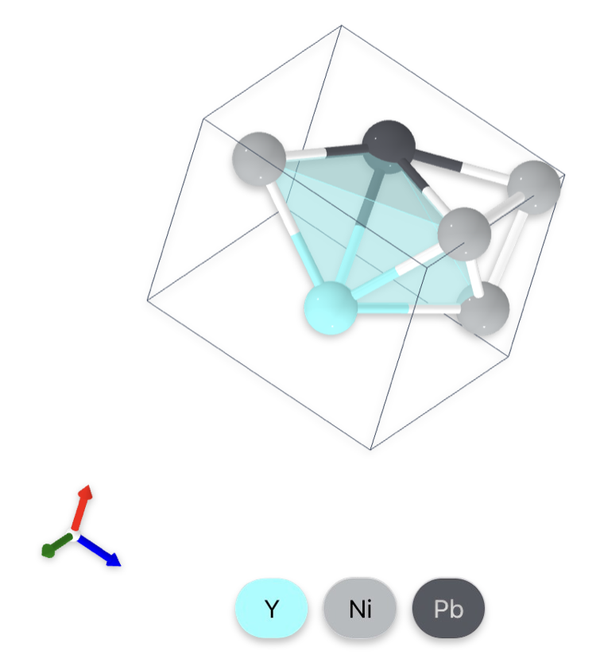
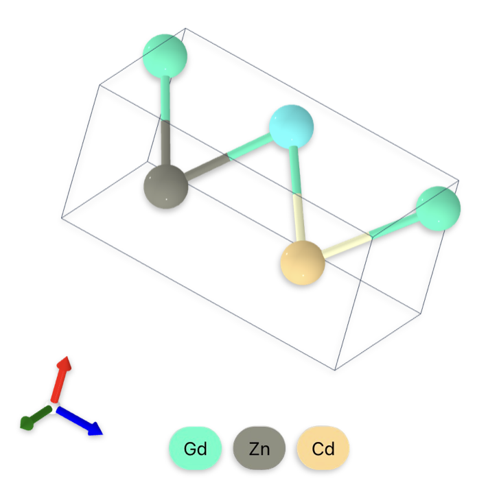
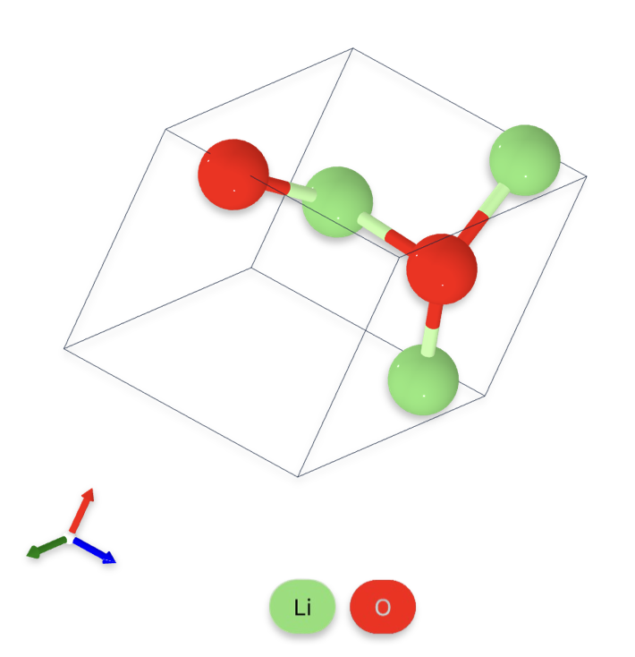

<!---
Copyright (c) 2025 Advanced Micro Devices, Inc. (AMD)

Permission is hereby granted, free of charge, to any person obtaining a copy
of this software and associated documentation files (the "Software"), to deal
in the Software without restriction, including without limitation the rights
to use, copy, modify, merge, publish, distribute, sublicense, and/or sell
copies of the Software, and to permit persons to whom the Software is
furnished to do so, subject to the following conditions:

The above copyright notice and this permission notice shall be included in all
copies or substantial portions of the Software.

THE SOFTWARE IS PROVIDED "AS IS", WITHOUT WARRANTY OF ANY KIND, EXPRESS OR
IMPLIED, INCLUDING BUT NOT LIMITED TO THE WARRANTIES OF MERCHANTABILITY,
FITNESS FOR A PARTICULAR PURPOSE AND NONINFRINGEMENT. IN NO EVENT SHALL THE
AUTHORS OR COPYRIGHT HOLDERS BE LIABLE FOR ANY CLAIM, DAMAGES OR OTHER
LIABILITY, WHETHER IN AN ACTION OF CONTRACT, TORT OR OTHERWISE, ARISING FROM,
OUT OF OR IN CONNECTION WITH THE SOFTWARE OR THE USE OR OTHER DEALINGS IN THE
SOFTWARE.
--->

# Accelerating AI-Driven Crystalline Materials Design with MatterGen on AMD Instinct MI300X

The search for new inorganic materials has always been central to scientific and technological progress. From the silicon that powered the microelectronics revolution to the lithium compounds enabling modern batteries, advances in materials have defined entire eras of innovation. Yet, discovering new compounds with desired properties remains an exceptionally difficult challenge.

Historically, materials discovery was driven by experiment and intuition. Scientists synthesized and tested new compounds based on empirical rules, gradually building up chemical knowledge. The introduction of first-principles simulation methods (also called [*ab initio* methods](https://en.wikipedia.org/wiki/Ab_initio_quantum_chemistry_methods)) such as density functional theory (DFT) and molecular dynamics (MD) in the late twentieth century transformed the field by enabling researchers to calculate crystal structures and material properties directly from quantum mechanics. These methods underpin computational databases such as the [Materials Project](https://next-gen.materialsproject.org/) and the Open Quantum Materials Database ([OQMD](https://oqmd.org/)), and complement experimental repositories like the Inorganic Crystal Structure Database ([ICSD](https://www.psds.ac.uk/icsd)). Together they contain on the order of 10<sup>5</sup>-10<sup>6</sup> inorganic materials, whether experimentally characterized or computed using first-principles methods. However, theoretical estimates suggest that the space of thermodynamically stable inorganic materials could be 10<sup>5</sup> times larger, including up to 10<sup>10</sup>-10<sup>11</sup> potential compounds that have not yet been explored.

In recent years, machine learning and artificial intelligence have begun to reshape this landscape. Early models such as [CGCNN](https://arxiv.org/abs/1710.10324) and [MEGNet](https://arxiv.org/abs/1812.05055) leveraged graph-based representations of existing datasets to predict material properties. The arrival of generative AI models has facilitated the possibility of inverse design, or targeting material design according to desired properties. This shift marks a major turning point: instead of merely screening known compounds, AI systems can now generate hypothetical materials directly, effectively compressing years of experimental work into days of large-scale inference. Diffusion-based models, in particular, can be adapted to generate crystal structures that are chemically valid and physically meaningful. Among the latest of these models is **MatterGen**, a diffusion-based model that leverages controlled corruption approaches to achieve state-of-the-art performance in generating novel, stable, and diverse materials. Released alongside MatterGen, MatterSim is a machine learning force field (MLFF) that learns an interatomic potential to predict energies, forces, and stresses for materials, enabling fast structure relaxation and stability checks without computationally expensive DFT.

By bringing together MatterGen, MatterSim, and the ROCm software stack, researchers can now run a complete, open-source workflow for generative materials discovery on fully open software. This combination removes barriers imposed by proprietary ecosystems, making advanced AI-driven materials research accessible to universities, independent developers, and industry teams alike. The ability to generate, relax, and evaluate novel crystal structures with freely available tools marks a key step toward democratizing computational materials design.

In this blog, we’ll walk through building a fully ROCm-compatible environment and running the complete MatterGen workflow from model setup and inference to MatterSim-based evaluation on AMD Instinct MI300X accelerators.

## MatterGen

[MatterGen](https://github.com/microsoft/mattergen) [[1]](#1), developed by Microsoft Research AI for Science and published in Nature, is a diffusion-based generative model for inorganic materials design. While diffusion models are well known for content generation in the image and video domains, the strict requirements for respecting periodic structures and symmetries exhibited by inorganic materials require several adaptations. MatterGen resolves this issue by conditionally learning a joint distribution covering atomic positions, chemical species, and lattice parameters from large crystal structure datasets, enabling the generation of novel, symmetry-consistent crystal structures that are both physically plausible and thermodynamically stable.  While the exact implementation of these conditions is beyond the scope of this tutorial, they can be broken into three categories:

* Coordinate Diffusion: the iterative sampling of periodic noise to the individual atomic coordinates within a lattice.
* Atomic Diffusion:  the iterative sampling of atomic elements for a lattice utilizing the D3PM probabilistic approach.
* Lattice Diffusion: the iterative sampling of noise to a clean lattice matrix while preserving symmetry, volume scale, and stability.

Exploring the vast design space of possible crystalline materials efficiently remains one of the important challenges of computational materials science. MatterGen, together with its companion evaluator [MatterSim](https://github.com/microsoft/mattersim) [[2]](#2), addresses this challenge by combining large-scale generative modeling with rapid, ML-based evaluation.

### Licensing and Data Sources

Both MatterGen and MatterSim are released under the MIT License. The MIT License is a permissive open-source license that allows anyone to freely use, modify, and redistribute the code, provided that the original copyright notice and license text are included in any copies or substantial portions of the software.
This makes MatterGen and MatterSim highly accessible for both academic research and industrial applications, encouraging further experimentation and integration across hardware and software ecosystems.

As mentioned in [huggingface model card](https://huggingface.co/microsoft/mattergen#training-data) training details:
> MatterGen was trained on crystalline materials from the following data sources: 1. MP (https://next-gen.materialsproject.org/; v2022.10.28, Creative Commons Attribution 4.0 International License), an open-access resource containing DFT-relaxed crystal structures obtained from a variety of sources, but largely based upon experimentally-known crystals. 2. The Alexandria dataset (https://alexandria.icams.rub.de/; Creative Commons Attribution 4.0 International License), an open-access resource containing DFT-relaxed crystal structures from a variety of sources, including a large quantity of hypothetical crystal structures generated by ML methods or other algorithmic means.

#### Figures

All figures have been generated using the Materials Project [Crystal Toolkit](https://next-gen.materialsproject.org/toolkit) [[3]](#3) [[4]](#4).

### Repository Overview

The GitHub repository provides everything needed to train, generate, and evaluate materials:

* Pre-trained base model for unconditional generation and fine-tuned models for property-conditioned generation
* A data preprocessing and training pipeline for custom datasets
* Integration with MatterSim for rapid structural relaxation and approximate stability assessment
* CLI tools (`mattergen-train`, `mattergen-generate`, `mattergen-evaluate`) for reproducible workflows

## Installation and Setup

### 0. Requirements

* AMD GPU: See the [ROCm documentation page](https://rocm.docs.amd.com/projects/install-on-linux/en/latest/reference/system-requirements.html) for supported hardware and operating systems.
* ROCm kernel-mode driver: As described in [Running ROCm Docker Containers](https://rocm.docs.amd.com/projects/install-on-linux/en/latest/how-to/docker.html) need to install [amdgpu-dkms](https://instinct.docs.amd.com/projects/amdgpu-docs/en/latest/install/detailed-install/post-install.html#verify-kernel-mode-driver-installation).
* Docker: See [Install Docker Engine on Ubuntu](https://docs.docker.com/engine/install/ubuntu/#install-using-the-repository) for installation instructions.
* AMD Container Toolkit: See [Quick Start Guide](https://instinct.docs.amd.com/projects/container-toolkit/en/latest/container-runtime/quick-start-guide.html) for installation and corresponding [ROCm blog](https://rocm.blogs.amd.com/software-tools-optimization/amd-container-toolkit/README.html).

### 1. Clone ROCm-blogs Repo

Clone ROCm-blogs repo and navigate to the MatterGen blog directory:

```bash
git clone https://github.com/ROCm/rocm-blogs.git
cd rocm-blogs/blogs/artificial-intelligence/mattergen
```

Follow the next setup steps from this directory.

### 2. Docker Container

Docker image: `rocm/pytorch:rocm7.0_ubuntu22.04_py3.10_pytorch_release_2.7.1`

Run Docker container with the AMD Container Toolkit (**recommended**). This command selects all available AMD GPUs, but if you want to specify a particular GPU, you can set the `AMD_VISIBLE_DEVICES` environment variable [accordingly](https://instinct.docs.amd.com/projects/container-toolkit/en/latest/container-runtime/quick-start-guide.html#step-6-verify-container-runtime-installation).

```bash
docker run -d \
    --runtime=amd \
    -e AMD_VISIBLE_DEVICES=all \
    --name mattergen \
    -v $(pwd):/workspace/ \
    rocm/pytorch:rocm7.0_ubuntu22.04_py3.10_pytorch_release_2.7.1 \
    tail -f /dev/null
```

Or run it directly without the toolkit:

```bash
docker run -d \
    --device=/dev/kfd \
    --device=/dev/dri \
    --group-add video \
    --name mattergen \
    -v $(pwd):/workspace/ \
    rocm/pytorch:rocm7.0_ubuntu22.04_py3.10_pytorch_release_2.7.1 \
    tail -f /dev/null
```

Enter the interactive session and continue with the setup:

```bash
docker exec -it mattergen bash
```

### 3. Install Dependencies

Run the setup script to install all dependencies:

```bash
cd /workspace
bash /workspace/src/setup.bash
```

The `setup.bash` script installs MatterGen and MatterSim dependencies, including all required ROCm-specific adjustments. The setup may take several minutes to complete; see [ROCm-specific changes](#rocm-specific-changes) for details.

#### ROCm-Specific Changes

##### Install MatterGen

The `pyproject.toml` file in the MatterGen repository is updated to account for ROCm-compatible packages already included in the Docker image. Training configurations were also updated since newer PyTorch releases removed the `verbose` argument from `ReduceLROnPlateau`.

##### Install Torch Scatter

The fork [silogen/pytorch_scatter](https://github.com/silogen/pytorch_scatter) adds ROCm compatibility to the original CUDA-only `torch-scatter`. It updates CUDA-specific intrinsics and dispatch macros to build and run correctly on AMD GPUs. Key changes include casting the warp `mask` to `unsigned long long` for HIP intrinsics and simplifying `AT_DISPATCH_*` macros for ROCm’s compiler.

##### Install Torch Sparse

The official `torch-scatter` package only supports CUDA. The fork [silogen/pytorch_sparse](https://github.com/silogen/pytorch_sparse) adds ROCm support by replacing CUDA-specific intrinsics with HIP equivalents and fixing half-precision warp shuffle calls (casting `mask` to `unsigned long long`). This enables correct compilation and execution on AMD GPUs like the MI300X.

##### Install MatterSim

To enable both MatterGen generation and MatterSim evaluation in the same container, we updated `pyproject.toml` in MatterSim and fixed a [recent ASE API change](https://ase-lib.org/changelog.html#optimizers): the optimizer’s `converged()` method now requires the current forces (gradient array) as an argument rather than none. Without this change, structure relaxation would fail due to an argument mismatch in `batch_relax.py`.

## Inference

### Unconditional Generation

Unconditional generation refers to creating new crystal structures without conditioning on any specific physical or chemical property. In this mode, MatterGen samples directly from the learned distribution of stable inorganic materials, generating novel yet physically plausible compounds from elements across the periodic table.

The following command runs MatterGen in unconditional mode using a pre-trained model (`mattergen_base`), generating `batch_size` × `num_batches` candidate crystal structures and writing them to the specified output directory:

```bash
cd /workspace/mattergen
export MODEL_NAME=mattergen_base
export RESULTS_PATH="/workspace/results/"  # Samples will be written to this directory

# generate batch_size * num_batches samples
mattergen-generate $RESULTS_PATH --pretrained-name=$MODEL_NAME --batch_size=16 --num_batches 1
```

Each generated structure includes atomic species, fractional coordinates, and lattice parameters.

Once the model is loaded, generation logs should look something like this:

```txt
...
100%|██████████████████████████████████████████████████████████████████████████████████████████████████████████████████████| 1000/1000 [01:07<00:00, 14.90it/s]
Generating samples: 100%|████████████████████████████████████████████████████████████████████████████████████████████████████████| 1/1 [01:09<00:00, 69.95s/it]
Full Formula (Y1 Ni3 Pb1) Reduced Formula: YNi3Pb abc   :   4.164379   4.960063   5.244526 angles: 118.005613 113.363648  89.872450 pbc   :       True       True       True Sites (5)   #  SP           a         b         c ---  ----  --------  --------  --------   0  Ni    0.94176   0.11105   0.944921   1  Ni    0.941391  0.614454  0.944409   2  Y     0.247827  0.669224  0.556491   3  Ni    0.473751  0.3941    0.008095   4  Pb    0.639349  0.059719  0.33899
...
```



**Figure 1.** Generated YNi3Pb crystal structure

Figure 1 illustrates the crystal structure of `YNi3Pb`, showcasing the arrangement of atoms within the unit cell.

### Property-conditioned generation

Property-conditioned generation allows MatterGen to generate new crystal structures that are biased toward specific target properties, such as magnetic density, band gap, or formation energy. Instead of sampling freely, the model uses learned correlations between structure and properties to steer the diffusion process toward desired outcomes - effectively enabling goal-directed material design.

In the example below, MatterGen generates structures with a target magnetic density of 0.15, using the pre-trained model `dft_mag_density`. The `--diffusion_guidance_factor` parameter (`γ`) controls how strongly the sampling process is steered toward the target property. The MatterGen authors use `γ = 2` for conditional generation experiments. In the broader literature on classifier-free guidance, larger `γ` values typically enforce the condition more tightly (at the cost of sample diversity), while smaller values allow more variety but weaker enforcement of the target.

```bash
cd /workspace/mattergen
export MODEL_NAME=dft_mag_density
export RESULTS_PATH="/workspace/results/$MODEL_NAME/"  # Samples will be written to this directory, e.g., `results/dft_mag_density`

# Generate conditional samples with a target magnetic density of 0.15
mattergen-generate $RESULTS_PATH --pretrained-name=$MODEL_NAME --batch_size=16 --properties_to_condition_on="{'dft_mag_density': 0.15}" --diffusion_guidance_factor=2.0
```

Once the model is loaded, the generation process runs as follows.

```txt
...
100%|████████████████████████████████████████████████████████████████████████████████████████████████████████████████████████████████████████████████████████████| 1000/1000 [01:25<00:00, 11.65it/s]
Generating samples: 100%|██████████████████████████████████████████████████████████████████████████████████████████████████████████████████████████████████████████████| 1/1 [01:28<00:00, 88.58s/it]
Full Formula (Gd2 Zn1 Cd1) Reduced Formula: Gd2ZnCd abc   :   3.640142   3.647330   7.461630 angles:  90.169500  90.068059  90.234797 pbc   :       True       True       True Sites (4)   #  SP           a         b         c ---  ----  --------  --------  --------   0  Cd    0.355134  0.665757  0.728367   1  Gd    0.855355  0.165479  0.996989   2  Gd    0.855352  0.165821  0.459999   3  Zn    0.355449  0.665798  0.228099
...
```



**Figure 2.** Generated Gd2ZnCd crystal structure

As you can see in Figure 2 the generated crystal structure is visualized, showing the arrangement of atoms in the unit cell.

### Multiple property-conditioned generation

MatterGen can also perform multi-property conditioned generation, where structures are guided simultaneously by several target properties, for example, stability and composition. This enables more focused material discovery, such as finding low-energy compounds within a specific chemical system.

In the example below, the model is conditioned on two properties:

* an energy above hull of `0.05 eV/atom` (favoring thermodynamically stable materials), and
* a chemical system containing lithium and oxygen (`Li–O`).

The `chemical_system_energy_above_hull` model is trained to understand these coupled constraints and generate realistic candidates that satisfy both simultaneously.

```bash
cd /workspace/mattergen
export MODEL_NAME=chemical_system_energy_above_hull
export RESULTS_PATH="/workspace/results/$MODEL_NAME/"  # Samples will be written to this directory, e.g., `results/dft_mag_density`

mattergen-generate $RESULTS_PATH --pretrained-name=$MODEL_NAME --batch_size=16 --properties_to_condition_on="{'energy_above_hull': 0.05, 'chemical_system': 'Li-O'}" --diffusion_guidance_factor=2.0
```

This multi-objective capability allows researchers to efficiently search complex design spaces, for example, exploring only stable oxide materials or optimizing for both mechanical and electronic properties in a single generation pass.

```txt
...
00%|████████████████████████████████████████████████████████████████████████████████████████████████████████████████████████████████████████████████████████████| 1000/1000 [01:35<00:00, 10.51it/s]
Generating samples: 100%|██████████████████████████████████████████████████████████████████████████████████████████████████████████████████████████████████████████████| 1/1 [01:37<00:00, 97.64s/it]
Full Formula (Li2 O2) Reduced Formula: Li2O2 abc   :   3.474467   3.398895   3.927323 angles: 109.467748  89.996089 120.203228 pbc   :       True       True       True Sites (4)   #  SP           a         b         c ---  ----  --------  --------  --------   0  O     0.669711  0.442197  0.87849   1  Li    0.569478  0.238476  0.312442   2  Li    0.992167  0.085032  0.807543   3  O     0.890822  0.880672  0.242275
...
```



**Figure 3.** Generated Li2O2 crystal structure

Figure 3 illustrates the crystal structure of `Li2O2`, showcasing the arrangement of atoms within the unit cell.

## Evaluation

### MatterSim

MatterSim is the evaluation and relaxation engine that complements MatterGen, providing ML-based structural relaxation and stability estimation much faster than traditional *ab initio* methods. The environment already includes MatterSim, so evaluation can be run directly after generation. The default models, `MatterSim-v1.0.0-1M` (fast) and `MatterSim-v1.0.0-5M` (more accurate), are based on the `M3GNet` architecture and trained on large-scale DFT data. For reproducibility, users are encouraged to specify the exact model version when reporting results.

#### Run Evaluation

```bash
cd /workspace/mattergen

export RESULTS_PATH="/workspace/results/" # where the results are generated
git lfs pull -I data-release/alex-mp/reference_MP2020correction.gz --exclude=""  # first download the reference dataset from Git LFS
mattergen-evaluate --structures_path=$RESULTS_PATH --relax=True --structure_matcher='disordered' --save_as="$RESULTS_PATH/metrics.json"
```

Once the evaluation completes, the results are saved in `$RESULTS_PATH/metrics.json`.

## Train Your MatterGen Model

Download the dataset:

```bash
cd /workspace/mattergen

sudo apt install unzip
# Download file from LFS
git lfs pull -I data-release/mp-20/ --exclude=""
unzip data-release/mp-20/mp_20.zip -d datasets
csv-to-dataset --csv-folder datasets/mp_20/ --dataset-name mp_20 --cache-folder datasets/cache
```

The `mp_20` dataset is a Materials Project–derived dataset restricted to crystal structures with up to 20 atoms per unit cell. It is provided in the repository as an example dataset for training and benchmarking MatterGen.

Training runs for 900 epochs or until convergence.
MatterGen uses [Pytorch Lightning](https://lightning.ai/docs/pytorch/stable/) as the training framework.
By default, the configuration runs training on a single GPU. For distributed training across multiple GPUs, the [DDP strategy](https://lightning.ai/docs/pytorch/stable/api/lightning.pytorch.strategies.DDPStrategy.html#lightning.pytorch.strategies.DDPStrategy) can be enabled.

Default configurations are provided in the following directories:

* Data module: `mattergen/mattergen/conf/data_module/mp_20.yaml`
* Trainer: `mattergen/mattergen/conf/trainer/default.yaml`
* Lightning module: `mattergen/mattergen/conf/lightning_module/default.yaml`

On a single AMD Instinct MI300X, training with the default configuration for 900 epochs typically takes about 15 hours.

```bash
mattergen-train data_module=mp_20 ~trainer.logger
```

## Summary

MatterGen, developed by Microsoft Research AI for Science, represents a major step forward in generative materials discovery. By releasing this model and its companion MatterSim under open-source licenses, Microsoft has made cutting-edge research in diffusion-based inorganic materials design broadly accessible to the scientific and HPC community. These tools enable researchers to explore vast chemical spaces and accelerate the discovery of novel, stable compounds using modern AI methods.

In this post, we focused on the practical implementation of the workflow on AMD Instinct MI300X accelerators, consisting of building a fully ROCm-compatible environment and running the complete MatterGen workflow of training, inference, and MatterSim-based evaluation. We demonstrated that state-of-the-art generative materials models can run efficiently on AMD hardware using the ROCm software stack. Together, open-source models (MatterGen, MatterSim) and an open software platform enable transparent, reproducible, and scalable materials research. By lowering technical barriers and improving accessibility, this work broadens who can experiment with AI-driven materials discovery. We encourage the community to explore MatterGen and MatterSim on ROCm hardware and share results from larger-scale experiments.

## Acknowledgments

We thank Yijie Xu, Rahul Biswas, Luka Tsabadze, Pauli Pihajoki, Baiqiang Xia, and Daniel Warna for their contributions through technical discussions, reviews, and hands-on support.

## References

<a id="1">[1]</a> Zeni, C., Pinsler, R., Zügner, D. *et al.* A generative model for inorganic materials design. *Nature* **639**, 624–632 (2025).
[https://doi.org/10.1038/s41586-025-08628-5](https://doi.org/10.1038/s41586-025-08628-5)

<a id="2">[2]</a> Yang, H. *et al.* (2024). MatterSim: A Deep Learning Atomistic Model Across Elements, Temperatures and Pressures. arXiv:2405.04967 [cond-mat.mtrl-sci].
[https://doi.org/10.48550/arXiv.2405.04967](https://doi.org/10.48550/arXiv.2405.04967)

<a id="3">[3]</a> Horton, M.K., Huck, P., Yang, R.X. et al. Accelerated data-driven materials science with the Materials Project. Nat. Mater. 24, 1522–1532 (2025).
[https://doi.org/10.1038/s41563-025-02272-0](https://doi.org/10.1038/s41563-025-02272-0)

<a id="4">[4]</a> Anubhav Jain, Shyue Ping Ong, Geoffroy Hautier, Wei Chen, William Davidson Richards, Stephen Dacek, Shreyas Cholia, Dan Gunter, David Skinner, Gerbrand Ceder, Kristin A. Persson; Commentary: The Materials Project: A materials genome approach to accelerating materials innovation. APL Mater. 1 July 2013; 1 (1): 011002.
[https://doi.org/10.1063/1.4812323](https://doi.org/10.1063/1.4812323)

## Additional Resources

* [MatterGen](https://github.com/microsoft/mattergen)
* [MatterSim](https://github.com/microsoft/mattersim)

## Disclaimers

Third-party content is licensed to you directly by the third party that owns the
content and is not licensed to you by AMD. ALL LINKED THIRD-PARTY CONTENT IS
PROVIDED “AS IS” WITHOUT A WARRANTY OF ANY KIND. USE OF SUCH THIRD-PARTY CONTENT
IS DONE AT YOUR SOLE DISCRETION AND UNDER NO CIRCUMSTANCES WILL AMD BE LIABLE TO
YOU FOR ANY THIRD-PARTY CONTENT. YOU ASSUME ALL RISK AND ARE SOLELY RESPONSIBLE
FOR ANY DAMAGES THAT MAY ARISE FROM YOUR USE OF THIRD-PARTY CONTENT.
