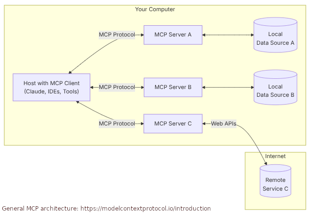

<!---
Copyright (c) 2025 Advanced Micro Devices, Inc. (AMD)

Permission is hereby granted, free of charge, to any person obtaining a copy
of this software and associated documentation files (the "Software"), to deal
in the Software without restriction, including without limitation the rights
to use, copy, modify, merge, publish, distribute, sublicense, and/or sell
copies of the Software, and to permit persons to whom the Software is
furnished to do so, subject to the following conditions:

The above copyright notice and this permission notice shall be included in all
copies or substantial portions of the Software.

THE SOFTWARE IS PROVIDED "AS IS", WITHOUT WARRANTY OF ANY KIND, EXPRESS OR
IMPLIED, INCLUDING BUT NOT LIMITED TO THE WARRANTIES OF MERCHANTABILITY,
FITNESS FOR A PARTICULAR PURPOSE AND NONINFRINGEMENT. IN NO EVENT SHALL THE
AUTHORS OR COPYRIGHT HOLDERS BE LIABLE FOR ANY CLAIM, DAMAGES OR OTHER
LIABILITY, WHETHER IN AN ACTION OF CONTRACT, TORT OR OTHERWISE, ARISING FROM,
OUT OF OR IN CONNECTION WITH THE SOFTWARE OR THE USE OR OTHER DEALINGS IN THE
SOFTWARE.
--->

# Enabling Real-Time Context for LLMs: Model Context Protocol (MCP) on AMD GPUs

The [Model Context Protocol](https://modelcontextprotocol.io/introduction) (MCP) is an open protocol introduced by [Anthropic](https://www.anthropic.com/news/model-context-protocol) that standardizes how applications provide context to large language models (LLMs). It enables AI models to interface with various data sources and tools. MCP enhances the integration of LLMs with data and tools by offering pre-built integrations, flexibility in switching between different LLM providers, and ensuring data security best practices.

MCP utilizes a client-server architecture (see the figure below), where host applications and custom AI tools connect to multiple MCP servers. These servers are lightweight programs that offer specific capabilities through the standardized protocol, allowing access to local data sources like files and databases, as well as remote services via internet APIs. This architecture supports efficient data exchange and workflow management, facilitating the creation of sophisticated AI-driven applications.



This blog uses the [MCP Python SDK](https://github.com/modelcontextprotocol/python-sdk) and the official [MCP Simple Chatbot](https://github.com/modelcontextprotocol/python-sdk/tree/main/examples/clients/simple-chatbot) example to create a Chatbot client. The client interacts with both local and external data sources using a set of specialized MCP servers.

The chatbot uses the [`meta-llama/Llama-3.2-3B-Instruct`](https://huggingface.co/meta-llama/Llama-3.2-3B-Instruct) LLM from Meta, served by the [vLLM serving engine](https://docs.vllm.ai/en/v0.8.3/index.html) running on an AMD MI300X GPU. In this setup, the MCP architecture is designed to interact with three different MCP servers: a weather forecasting MCP server, an Airbnb listing MCP server, and a database interaction through a SQLite MCP server.

All the files required to follow this blog are available in the [ROCm Blogs GitHub folder](https://github.com/ROCm/rocm-blogs/tree/release/blogs/artificial-intelligence/mcp-model-context-protocol).

## Requirements

* AMD GPU: See the [ROCm documentation page](https://rocm.docs.amd.com/projects/install-on-linux/en/latest/reference/system-requirements.html) for supported hardware and operating systems.

* ROCm 6.4: See the [ROCm installation for Linux](https://rocm.docs.amd.com/projects/install-on-linux/en/latest/index.html) for installation instructions.

* Docker: See [Install Docker Engine on Ubuntu](https://docs.docker.com/engine/install/ubuntu/#install-using-the-repository) for installation instructions.

* Hugging Face Access Token: This blog requires a [Hugging Face](https://huggingface.co/) account with an existing or newly generated [User Access Token](https://huggingface.co/docs/hub/security-tokens).

* Access to the `meta-llama/Llama-3.2-3B-Instruct` model on Hugging Face. The `meta-llama` family models are [gated models](https://huggingface.co/docs/hub/models-gated) on Hugging Face. To request access, visit [meta-llama/Llama-3.2-3B-Instruct](https://huggingface.co/meta-llama/Llama-3.2-3B-Instruct).

* AccuWeather API key: MCP Weather Server requires an AccuWeather API key in order to access hourly and daily weather forecasts. Create a [developer account at AccuWeather](https://developer.accuweather.com/), next add an [AccuWeather App](https://developer.accuweather.com/user/me/apps) and select the Core Weather Product. Once a new app has been created, the API key will be presented to you.

This blog utilizes a [custom Dockerfile](https://github.com/ROCm/rocm-blogs/tree/release/blogs/artificial-intelligence/mcp-model-context-protocol/docker/Dockerfile) that provides all the necessary instructions to build a Docker image, allowing you to run the blog without manually installing any dependencies.

## Start the Docker Container

1. Clone the repo and `cd` into the blog directory:

    ```bash
    git clone https://github.com/ROCm/rocm-blogs.git
    cd rocm-blogs/blogs/artificial-intelligence/mcp-model-context-protocol
    ```

2. Build the `vllm-mcp` Docker image:

    ```bash
    cd docker
    docker build -t vllm-mcp -f Dockerfile .
    ```

3. Start the Docker container in interactive mode:

    ```bash
    docker run -it --rm --cap-add=SYS_PTRACE \
    --security-opt seccomp=unconfined \
    --device=/dev/kfd \
    --device=/dev/dri \
    --group-add video \
    --ipc=host --shm-size 8G \
    -v ../:/mcp \
    -w /mcp \
    --name vllm-mcp \
    vllm-mcp
    ```

You can now follow along with the rest of the blog.

## MCP Elements: Client and Servers

MCP is an open standard designed to allow LLMs to interface with external tools and data sources. The MCP framework is based on a client-server model, where the **MCP client** is integrated into the LLM-powered application and manages the discovery, connection, and communication with MCP servers. An **MCP Server** is a service that exposes capabilities to the LLM through three types of interfaces: [callable tools](https://modelcontextprotocol.io/specification/2025-03-26/server/tools), read-only [resources](https://modelcontextprotocol.io/specification/2025-03-26/server/resources), and [prompt templates](https://modelcontextprotocol.io/specification/2025-03-26/server/prompts).

In this architecture, the client explores the capabilities within each MCP server using [JSON-RPC 2.0](https://www.jsonrpc.org/specification) (JSON-based protocol for remote procedure calls) over STDIO (local communication between programs in command-line environments) or HTTP+SSE (remote/network communication for cloud tools or streaming processes). The client also facilitates function calls or data access as needed during an LLM interaction.

For example, when you ask the LLM to retrieve the weather or access a database, the MCP client routes the request to the appropriate MCP server, which executes the function and returns the structured data. This response is then integrated into the LLM's input, allowing the LLM to generate a more accurate and context-aware response.

The next section shows you the implementation of an MCP client and its interaction with a set of MCP servers through the example of a simple chatbot.

## Chatbot Example

This example is derived from the official [MCP Simple Chatbot](https://github.com/modelcontextprotocol/python-sdk/tree/main/examples/clients/simple-chatbot) but incorporates the `Llama-3.2-B-Instruct` LLM, which is locally hosted via the vLLM serving engine. The example also interfaces with three distinct MCP servers, each fulfills a specific purpose.

### Server Configurations and Chatbot Class Components

One of the key strengths of MCP is its plug-and-play design where every MCP server speaks the same JSON-RPC dialect and publishes a short manifest of the tools it offers. The MCP client in this example has access to a JSON file ([servers_config.json](https://github.com/ROCm/rocm-blogs/tree/release/blogs/artificial-intelligence/mcp-model-context-protocol/src/servers_config.json)) that contains a single top-level object called `mcpServers`. Each key inside that object consists of the name of the available MCP server, and its value describes how to launch the server. To add a new server, just paste another JSON block under the `mcpServers` object.

The MCP servers accessible to the chatbot can be found in the [servers_config.json](https://github.com/ROCm/rocm-blogs/tree/release/blogs/artificial-intelligence/mcp-model-context-protocol/src/servers_config.json) file:

```json
{
  "mcpServers": {  
    "weather": {
      "command": "npx",
      "args": ["-y", "@timlukahorstmann/mcp-weather"],
      "env": {
        "ACCUWEATHER_API_KEY": "<YOUR_ACCUWEATHER_API_TOKEN>"
      }
    },
    "airbnb": {
      "command": "npx",
      "args": [
        "-y",
        "@openbnb/mcp-server-airbnb",
        "--ignore-robots-txt"        
      ]
    },
    "sqlite": {
      "command": "mcp-server-sqlite",
      "args": ["--db-path", "./test.db"]
    }
  }
}
```

The MCP client has access to three MCP servers: weather information, Airbnb stay-listings, and database exploration through the SQLite database engine. Open MCP server catalogs such as [awesome-mcp-servers](https://mcpservers.org/) list dozens of ready-made integrations.

Similarly, see the [/main.py](https://github.com/ROCm/rocm-blogs/tree/release/blogs/artificial-intelligence/mcp-model-context-protocol/src/main.py) file for the chatbot’s class definitions. The Python code for the chatbot defines a `LLMClient` class whose purpose is to manage the communication with the LLM provider. The code below shows the configurations for the client to communicate with `Llama-3.2-3B-Instruct` model. You must set objects such as `url`, `headers` and `payload` with appropriate values for the example to work.

```python
class LLMClient:
    """Manages communication with the LLM provider."""

    ...

    def get_response(self, messages: list[dict[str, str]]) -> str:
        """Get a response from the LLM.
        Args:
            messages: A list of message dictionaries.
        Returns:
            The LLM's response as a string.
        Raises:
            httpx.RequestError: If the request to the LLM fails.
        """

        # This is the vLLM endpoint for making request to the LLM
        url = "http://0.0.0.0:8000/v1/chat/completions" 

        # A provider api_key needs to be passed. For local deployment this key can take any value.
        # The 'LLM_API_KEY' needs to be set into the '.env' file.
        headers = {
            "Content-Type": "application/json",
            "Authorization": f"Bearer {self.api_key}", 
        }

        # Passing the name of the LLM model the MCP client will interact with.
        payload = {
            "messages": messages,
            "model": "meta-llama/Llama-3.2-3B-Instruct",
            "temperature": 0.7,
            "max_tokens": 4096,
            "top_p": 1,
            "stream": False,
            "stop": None,
        }

        ...
```

Another important class in `main.py` is `ChatSession`, which manages the interactions between you, the `Llama-3.2-3B-Instruct` model (locally served with vLLM), and the tools provided by each MCP server.

The `process_llm_response` method in this class manages the LLM's replies to user queries (`llm_response`). It examines the LLM response, determines the appropriate MCP tool to invoke, and sends a request to the corresponding MCP server hosting that tool.

```python
class ChatSession:
    """Orchestrates the interaction between user, LLM, and tools."""
    
    ...
    
    async def process_llm_response(self, llm_response: str) -> str:
        """Process the LLM response and execute tools if needed.
        Args:
            llm_response: The response from the LLM.
        Returns:
            The result of tool execution or the original response.
        """
        ...

        try:
            tool_call = json.loads(llm_response)

           if "tool" in tool_call and "arguments" in tool_call:
                logging.info(f"Executing tool: {tool_call['tool']}")
                logging.info(f"With arguments: {tool_call['arguments']}")

                for server in self.servers:
                    tools = await server.list_tools()
                    if any(tool.name == tool_call["tool"] for tool in tools):
                        try:
                            result = await server.execute_tool(
                                tool_call["tool"], tool_call["arguments"]
                            )            
```

### Start vLLM Server

In the `vllm-mcp` container, start the vLLM server with `Llama-3.2-B-Instruct` model as follows:

```bash
HF_TOKEN=<YOUR_HF_TOKEN> vllm serve meta-llama/Llama-3.2-3B-Instruct \
  --api-key token-abc123 \
  --disable-log-requests \
  --tensor-parallel-size 1 \
  --dtype float16 \
  --no-enable-chunked-prefill \
  --num-scheduler-steps 10 \
  --distributed-executor-backend mp
```

The `--api-key` argument corresponds to the `LLM_API_KEY` required by the `LLMClient` class. You can assign any value to it (`token-abc123` in this example), but ensure that it is also included in the [`.env`](https://github.com/ROCm/rocm-blogs/tree/release/blogs/artificial-intelligence/mcp-model-context-protocol/src/.env) file. For a description of the remaining `vllm serve` arguments, see: [vLLM engine arguments](https://docs.vllm.ai/en/v0.7.3/serving/engine_args.html).

vLLM will start an HTTP server at `http://0.0.0.0:8000`. Once it is ready to accept request, the following message is displayed:

```bash
INFO 06-11 15:41:55 [api_server.py:1336] Starting vLLM API server on http://0.0.0.0:8000
INFO 06-11 15:41:55 [launcher.py:28] Available routes are:
INFO 06-11 15:41:55 [launcher.py:36] Route: /openapi.json, Methods: HEAD, GET
...
INFO 06-11 15:41:55 [launcher.py:36] Route: /v1/chat/completions, Methods: POST
INFO 06-11 15:41:55 [launcher.py:36] Route: /v1/completions, Methods: POST
...
INFO 06-11 15:41:55 [launcher.py:36] Route: /metrics, Methods: GET
INFO:     Started server process [124]
INFO:     Waiting for application startup.
INFO:     Application startup complete.
```

### Start the Chatbot

To start the chatbot, open a second terminal and log into the running `vllm-mcp` container with:

```bash
docker exec -it vllm-mcp /bin/bash
```

Run:

```bash
cd /mcp/src
python main.py
```

You will see a prompt to enter your request.

```text
Weather MCP Server running on stdio
Server started with options: ignore-robots-txt
Airbnb MCP Server running on stdio

You: 
```

#### MCP Server: weather information service

For example, you can request the weather for a specific city:

```text
You: Retrieve the current weather information for Miami.
```

The response will look like:

```bash
2025-06-12 20:14:53,677 - INFO - HTTP Request: POST http://0.0.0.0:8000/v1/chat/completions "HTTP/1.1 200 OK"
2025-06-12 20:14:53,677 - INFO - 
Assistant: {
  "tool": "weather-get_hourly",
  "arguments": {
    "location": "Miami",
    "units": "metric"
  }
}
2025-06-12 20:14:53,678 - INFO - Executing tool: weather-get_hourly
2025-06-12 20:14:53,678 - INFO - With arguments: {'location': 'Miami', 'units': 'metric'}
2025-06-12 20:14:53,680 - INFO - Executing weather-get_hourly...
2025-06-12 20:14:56,067 - INFO - HTTP Request: POST http://0.0.0.0:8000/v1/chat/completions "HTTP/1.1 200 OK"
2025-06-12 20:14:56,067 - INFO - 
Final response: The current weather in Miami is mostly sunny with temperatures ranging from 28.5°C to 29.4°C. It's expected to be partly cloudy tonight and mostly clear tomorrow.

You: 
```

Based on the LLM response, the MCP client invokes the `weather-get-hourly` tool from the `weather` MCP server to retrieve the weather information in Miami. For additional Weather MCP Server tools, see: [MCP Weather Server](https://github.com/TimLukaHorstmann/mcp-weather).

#### MCP Server: Airbnb

You can try `mcp-server-airbnb`, an MCP Server for searching [Airbnb](https://www.airbnb.com/) and retrieving listing details.

```text
You: get airbnb listings for the city of Miami in Florida. Check in August 4th 2025 and checkout August 6th 2025
```

The final response will look like:

```text
Final response: Based on the search results, here are some Airbnb listings in Miami, Florida for August 4th-6th, 2025:

1. **City View | Rooftop Infinity Pools. Poolside Bar** - A 1-bedroom apartment with a rooftop pool, located in the Miami Beach area. Prices start at €106 per night.
2. **Escape to paradise: Miami's ultimate oasis.** - A 2-bedroom apartment located in the South Beach area, with a pool and free beach chairs. Prices start at €110 per night.
3. **Balcony Studio | Free Beach Chairs Rentals** - A 1-bedroom studio apartment with a balcony, located in the Miami Beach area. Prices start at €77 per night.
4. **Cute Queen Room, Pool, Restaurant, Near the Beach** - A 2-bedroom apartment with a pool, located in the South Beach area. Prices start at €151 per night.
5. **Double unit in South Beach, walk to the ocean!** - A 2-bedroom apartment located in the South Beach area, with a pool and free beach chairs. Prices start at €123 per night.

Please note that prices may vary depending on the availability and the specific dates of your stay. It's always best to check the Airbnb website for the most up-to-date pricing and availability.
```

For additional Airbnb MCP Server tools, see: [Airbnb MCP Server - Tools](https://github.com/openbnb-org/mcp-server-airbnb#tools).

#### MCP server: SQLite

For database interaction through SQLite, the [SQLite MCP Server](https://pypi.org/project/mcp-server-sqlite/) enables running SQL queries, analyzing business data, and automatically generating business insight memos.

You can prompt the MCP client chatbot for a conversation as follows:

```text
You: List all the existing tables in the test.db database
```

The response would be:

```text
There is one table in the database named "products".
```

Request for the column names and types:

```text
You: Give me all the column names and types for the products table.
```

The output will be:

```text
The products table has three columns:

* id (a unique identifier that is an integer)
* name (a text field that stores the product name)
* price (a real number that stores the product price)
```

When the request becomes more complex, such as:

```text
You: Finally, sort the "products" table in descending order based on the "price" column and print the first 3 records.
```

You will receive a response as follows:

```text
Final response: Here are the first 3 records from the "products" table, sorted in descending order by price:

1. Mini Drone - $299.99
2. Smart Watch - $199.99
3. Portable SSD - $179.99
```

```{note}
The chatbot responses might differ from the output above. They may even be shown as an incomplete output. You can try to re-submit your request in those cases.
```

## Summary

Model Context Protocol (MCP) is an open standard that defines how AI-powered clients and servers communicate with each other to provide LLMs with live context from both internal and external sources. This blog showcased a custom MCP chatbot client powered by a local `Llama3.2-3B-Instruct` model served via vLLM on an AMD MI300X GPU. This client interacts with three MCP servers supplying the LLM back with fresh context, enabling coherent and data driven responses within the MCP ecosystem. To explore scaling this setup on a multi-node infrastructure for better availability and low latency, check out the blog on [Scale LLM Inference with Multi-Node Infrastructure](https://rocm.blogs.amd.com/artificial-intelligence/multinode-inference/README.html).

## Disclaimers

Third-party content is licensed to you directly by the third party that owns the
content and is not licensed to you by AMD. ALL LINKED THIRD-PARTY CONTENT IS
PROVIDED “AS IS” WITHOUT A WARRANTY OF ANY KIND. USE OF SUCH THIRD-PARTY CONTENT
IS DONE AT YOUR SOLE DISCRETION AND UNDER NO CIRCUMSTANCES WILL AMD BE LIABLE TO
YOU FOR ANY THIRD-PARTY CONTENT. YOU ASSUME ALL RISK AND ARE SOLELY RESPONSIBLE
FOR ANY DAMAGES THAT MAY ARISE FROM YOUR USE OF THIRD-PARTY CONTENT.
