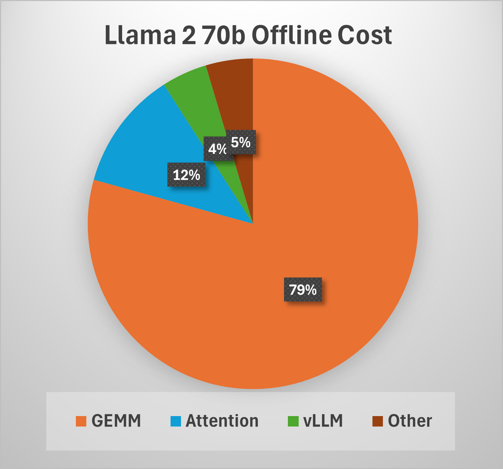
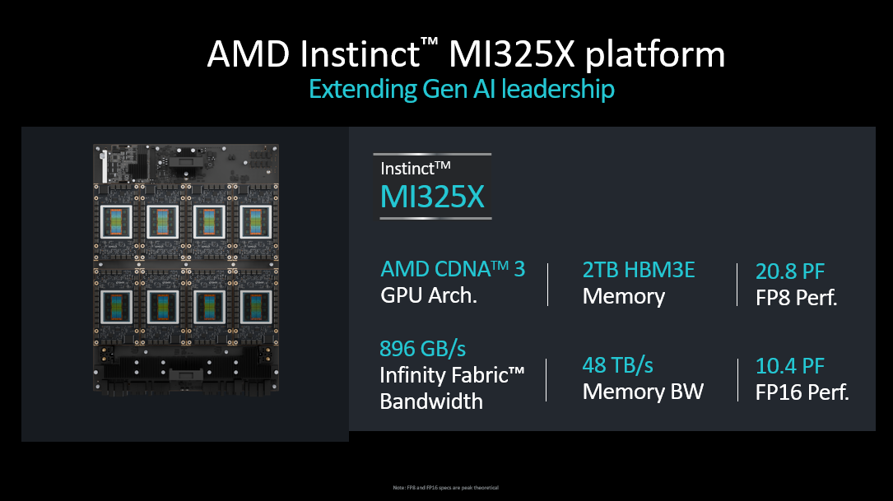
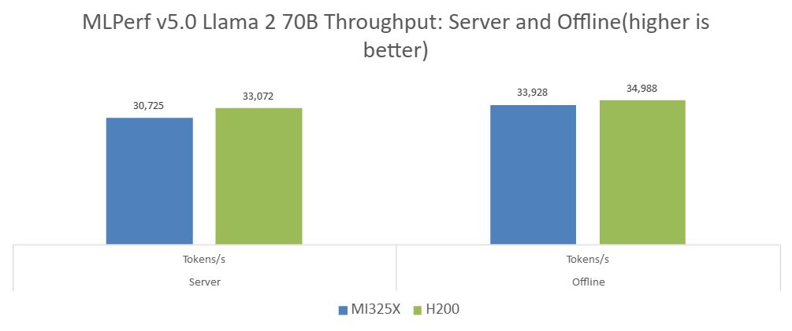
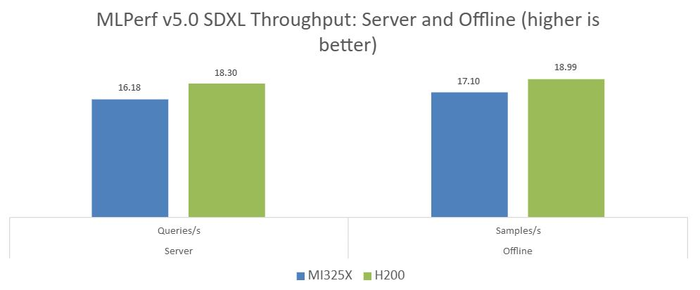

<!---
Copyright (c) 2025 Advanced Micro Devices, Inc. (AMD)

Permission is hereby granted, free of charge, to any person obtaining a copy
of this software and associated documentation files (the "Software"), to deal
in the Software without restriction, including without limitation the rights
to use, copy, modify, merge, publish, distribute, sublicense, and/or sell
copies of the Software, and to permit persons to whom the Software is
furnished to do so, subject to the following conditions:

The above copyright notice and this permission notice shall be included in all
copies or substantial portions of the Software.

THE SOFTWARE IS PROVIDED "AS IS", WITHOUT WARRANTY OF ANY KIND, EXPRESS OR
IMPLIED, INCLUDING BUT NOT LIMITED TO THE WARRANTIES OF MERCHANTABILITY,
FITNESS FOR A PARTICULAR PURPOSE AND NONINFRINGEMENT. IN NO EVENT SHALL THE
AUTHORS OR COPYRIGHT HOLDERS BE LIABLE FOR ANY CLAIM, DAMAGES OR OTHER
LIABILITY, WHETHER IN AN ACTION OF CONTRACT, TORT OR OTHERWISE, ARISING FROM,
OUT OF OR IN CONNECTION WITH THE SOFTWARE OR THE USE OR OTHER DEALINGS IN THE
SOFTWARE.
--->

# AMD Instinct™ MI325X GPUs Produce Strong Performance in MLPerf Inference v5.0

AI transformation and its ever-increasing demands of GenAI, LLMs, reasoning models and new advances in inference and training emphasize the need for innovative GPU architectures and products designed and delivered at an accelerated pace. Understanding the performance of AI models on these GPUs is critical for continuous advances in AI deployments and adoption. However, benchmarking AI models is challenging due to their inherent complexity and variety of possible deployments and tasks. Approaching this problem from a cross-industry perspective is preferable to have a benchmark that is comparable across different platforms and vendors. MLPerf is such a benchmark created by a cross-industry  [MLCommons consortium](https://mlcommons.org/) of which AMD is a founding member.

[MLPerf Inference: Datacenter v5.0 benchmark results](https://mlcommons.org/benchmarks/inference-datacenter/) was published on April 2, 2025, and AMD has once again achieved highly competitive results as well as publishing on the AMD Instinct MI325X GPU for the first time. Check out our blog on [Reproducing AMD MLPerf Inference v5.0 Submission](https://rocm.blogs.amd.com/artificial-intelligence/reproducing-amd-mlperf-inference-submission/README.html) if you are interested in running the benchmark using our recipe. In this blog we provide you with a behind the scene view on our optimizations: you will dive into our latest MLPerf v5.0 results and discover the advanced optimizations behind our Llama 2 70B and Stable-diffusion-XL inference benchmarks, from quantization and General Matrix Multiplication (GEMM) tuning to cutting-edge vLLM scheduling and platform enhancements. Let's start!

## MI325X architecture

The MI325X Instinct GPU, the latest AMD Instinct family GPU for the modern data center, offers industry-leadership performance and optimized total cost of ownership (TCO). Based on the 3rd generation CDNA 3 core architecture, advanced stacking, and chiplet technology, the MI325X delivers high throughput and efficiency due to its improved matrix core technology and highly streamlined compute units in an OAM (Open Accelerator Module) package. The AMD Instinct MI325X platform with 8 discrete GPUs and an EPYC CPU is an integral building block of high-performance AI infrastructure. This GPU offers a large HBM3E memory capacity of 256GB and 6TB/s memory bandwidth, making for a single-GPU capable of serving and training some of the largest models out there. As AI demands increase, the MI325X delivers high performance on a variety of precisions, such as FP16, BF16, FP8, and INT8, for serving, training, and data analytics on a variety of use cases and models. With AMD ROCm software, the MI325X unleashes increased developer efficiency, ease of use, and out-of-box productivity for a variety of popular industry AI frameworks, performance math, AI and HPC libraries, and software packages. The key specifications of the MI325X GPU and MI325X platform are illustrated below:


## Llama 2 70B MLPerf inference benchmark

Llama 2 70B has quickly become the most popular benchmark in the [MLPerf Inference](https://mlcommons.org/benchmarks/inference-datacenter/) suite of benchmarks. First introduced in MLPerf Inference v4.0, it uses a highly popular model from the Llama family of models. [The MLPerf reference implementation of the benchmark](https://mlcommons.org/2024/03/mlperf-llama2-70b/) provides a full benchmark specification, which includes a model checkpoint, dataset, and performance and accuracy metrics. Specifically, the benchmark uses Open Orca Q&A dataset and measures performance in Offline and Server scenarios. The former processes all samples in one batch, while the latter is an online type of serving where queries arrive at a rate according to a Poisson distribution and need to be processed within specified latency constraints.

ResNet50 has traditionally been the most popular MLPerf Inference benchmark, however, in MLPerf Inference v5.0, Llama 2 70B has become the most popular benchmark indicating that benchmarking community has fully embraced large language models. Overall, Llama 2 70B has received 45 submissions from 16 organizations in the closed category. AMD has submitted results on an 8xMI325X server as well as having submissions with four partners: ASUSTeK, GigaComputing, MangoBoost, and Supermicro.

### Optimized vLLM Docker image

We have built our submission on top of the AMD optimized vLLM Docker avaialable from DockerHub at [rocm/vllm-dev](https://hub.docker.com/r/rocm/vllm-dev). (The one used in our submission is `rocm/vllm-dev:nightly_main_20250203`). These Docker images are highly optimized and released weekly. They come integrated with pre-tuned GEMM solution with BLAS libraries, supporting GEMM shapes for inference of many popular LLM models.

#### Improvements to vLLM

vLLM now supports multi-step scheduling of the decode operation to enhance efficiency. Scheduling introduces CPU overhead, which can lower GPU utilization and throughput. By scheduling `N` decode steps at once, the GPU executes `N` forward steps consecutively without waiting for CPU instructions, effectively reducing the overhead by distributing it across `N` steps.

To maximize throughput in vLLM, several hyperparameters must be tuned, including `num_scheduler_steps`, as mentioned above. Additionally, `max_num_batched_tokens` determines the maximum batch size for prefill, while `max_num_seqs` controls the maximum batch size for decoding. In the server scenario, QPS (queries per second) must also be carefully adjusted to balance incoming and completed queries while meeting the constraints on TTFT (Time to First Token) and TPOT (Time per Output Token).

#### Scheduler changes

The vLLM scheduler is a crucial component for efficient LLM serving. It dynamically determines whether to perform a `prefill` or a `decode` operation at any given moment while managing the number of queries that can be batched together. This directly impacts the GPU performance by optimizing floating point operations per second (FLOPS) and maximizing memory efficiency.

To enhance the performance, we batch as many queries as possible, minimizing the overhead of end-to-end kernel calls and maximizing GPU throughput. In the offline scenario, we consistently achieve batch sizes close to the maximum &mdash; 65K for prefill and 2048 for decode. In the server scenario, while adhering to TTFT constraints, we avoid prefill when the number of queries that are waiting to be prefilled is low, ensuring efficient GPU utilization.

### Harness optimization - Load balancing

LLM serving typically uses multiple GPUs with multiple vLLM instances to serve the user queries. It is essential that we distribute the load on each GPU equally, as imbalance in loads can cause significant queueing delays, and execution pipelines that are much slower compared to other GPUs, resulting in a reduction of overall system throughput. The problem is further complicated by the variations in input sequence length (ISL) and output sequence length (OSL) of each query. To address this problem, we incorporate a novel load balancing algorithm that carefully chooses the GPU with the minimum load, based on the number of queries and size of queries in each GPU, to assign an incoming query.

### Quantization of Llama 2 70B

In this section, we examine how we used [AMD Quark](https://quark.docs.amd.com/latest/) for quantization to produce our optimized models for AMD’s MLPerf Inference submission. AMD Quark is a publicly available model optimization library that comes with comprehensive documentation and examples. In the current MLPerf round, we built upon our [previous MLPerf submission](https://rocm.blogs.amd.com/artificial-intelligence/mlperf-inf-4-1/README.html). The new quantization uses Open Compute Project (OCP) FP8-e4m3 format. The outline of our approach to quantization is given below. For more details, see the [MLPerf Inference: Datacenter official site](https://mlcommons.org/benchmarks/inference-datacenter/).

#### Quantization strategy

Model quantization typically requires calibration to ensure the quantized model maintains a certain accuracy level with respect to a certain dataset. For calibration, we used the entire calibration dataset provided by mlcommons/inference for each model. The input of the calibration dataset was serialized and systematically processed into fixed-length sequences through tokenization, incorporating dynamic padding and truncation, as part of the preprocessing step.

In our submission, we use per-tensor symmetric static quantization to convert all key tensors, like inputs and weights in `nn.Linear` modules, into the OCP FP8-e4m3 format. The formula we use is:

$$ x_q = round( clip( 448 \frac{ x }{scale}, -448, 448 ) ) $$

where $x_q$ is the quantized form of value $x$, scale is the maximum absolute value (absmax) of the tensor, and the constant 448 represents the numerical range of values in OCP FP8-e4m3. The scaled value is rounded using the half-even method after clipping.

All linear layers in the decoder blocks are quantized, covering both inputs and weights. The quantization scales for inputs and weights are computed during calibration. The weights for query (Q), key (K), and value (V) share one common scale, which is the highest of their individual scales. We also apply the AutoSmoothQuant algorithm in AMD Quark to reduce errors. The KV cache entries are also quantized.

We experimented with several quantization recipes, such as FP8 Attention quantization (GEMM in attention module calculations performed in FP8). AMD Quark has feature support for a variety of recipes, which enables rapid experimentation. Quark's export format supports these features and enables seamless deployment with vLLM.

### GEMM optimizations

In the Llama 2 70B model, GEMM accounts for over 70% of the total end-to-end computation cost. We identified the most performance-critical FP8 GEMMs and optimized them with hipBLASLt offline GEMM tuning to pick appropriate tile sizes to reach high compute efficiencies. As a result of this work, prefill and decode phases on MI325X achieve 1.5K TFLOPs and 1.4K TFLOPs, at batch sizes of 65K and 2048 respectively. We repeat GEMM tuning runs as we optimize and improve performance for the other phases of the benchmark that enable the GPU to handle larger batch sizes while keeping within the TTFT and TPOT latency thresholds.



### System level tuning

While the bulk of performance comes from GPUs, server design and configuration also contribute to the performance improvement. Specifically, we find that a high frequency Turin CPU provides the best performance executing harness commands with minimum overhead.

In addition, performance can be improved by the following OS config settings:

```bash
echo 3 | sudo tee /proc/sys/vm/drop_caches
sudo cpupower idle-set -d 2
sudo cpupower frequency-set -g performance
echo 0 | sudo tee /proc/sys/kernel/nmi_watchdog
echo 0 | sudo tee /proc/sys/kernel/numa_balancing
echo 0 | sudo tee /proc/sys/kernel/randomize_va_space
echo 'always' | sudo tee /sys/kernel/mm/transparent_hugepage/enabled
echo 'always' | sudo tee /sys/kernel/mm/transparent_hugepage/defrag
```

GPU power throttling can occur during the performance runs and can impact the performance. The following commands restrict maximum frequencies to 1700 MHz to avoid throttling and improve overall performance for offline scenario.

```bash
sudo rocm-smi --setperfdeterminism 1700
sudo amd-smi set --soc-pstate 0 -g all
```

## Performance charts and takeaways of Llama 2 70B submission

Our MLPerf Inference v5.0 submissions established performance leadership of the latest AMD data center MI325X GPU in the marketplace. The MI325X GPU, with its industry-leading compute TFLOPs, memory capacity, and bandwidth, coupled with open source software optimizations across the ROCm stack, AI frameworks, and libraries, is ready to power AI data centers running Generative AI, LLMs, and other transformative technologies. The figure below highlights the MI325 platform used in the MLPerf Inference v5.0 submission, and Table 1 summarizes the host CPU and GPU configurations that were used for running the workloads.



<br />

|Host CPU   |   GPU    |
|:-:|:--------:|
|2X AMD EPYC 9575F (128 cores) | 8X AMD Instinct MI325X  |
|128 MiB L2, 512 MiB L3 caches | AMD Infinity Cache 256 MB|
|2.21 TB DDR | 256 GB HBM3e Device Memory |
|1500 – 5008 MHz | 500 – 2100 MHz |

**Table 1:** The system configuration used in measuring the performance of Llama 2 70B benchmark

In the following performance chart, we show the performance results of the MI325X compared with the Nvidia H200 on Llama 2 70B offline and server submissions, submission IDs 5.0-0001 and 5.0-0060, respectively. MI325X competes head-to-head with the H200 GPU. Full results can be found on [MLCommons](https://mlcommons.org/benchmarks/inference-datacenter/) while code and other artifacts can be found in the [submission repository](https://github.com/mlcommons/inference_results_v5.0). To aid reproducibility we have also released pre-built docker images along with quantized models which are used in our [reproduction blog](https://rocm.blogs.amd.com/artificial-intelligence/reproducing-amd-mlperf-inference-submission/README.html).



In addition, we collaborated with several partners - Supermicro, Giga Computing and AsusTek - enabling them to submit on MI325X-based system solutions. Mangoboost successfully [published the highest ever Llama 2 70B Offline performance](https://www.mangoboost.io/resources/blog/mangoboost-sets-the-highest-mlperf-inference-v5-0-result-in-history-for-llama2-70b-offline) of around 103K tokens/sec with a 4-node MI300X cluster enabled by their LLMboost stack. Notably, this submission achieved the highest-ever offline performance recorded in MLPerf submissions for the Llama 2 70B benchmark. Overall, these submissions validate the scalability and performance of AMD Instinct solutions in AI workloads.

## Stable-diffusion-xl (SDXL) text-to-image MLPerf inference benchmark

StabilityAI's stable-diffusion-xl (SDXL) text-to-image pipeline is a popular generative AI workload for datacenter benchmarks. The workload outlined by MLCommons uses the stable-diffusion-xl-base-1.0 checkpoint from StabilityAI, and the text-to-image pipeline uses a series of submodels to turn user prompts into 1024x1024 color images. The submodels and their purposes are as follow:

- CLIPTokenizer : turns prompts into integer tokens.
- CLIPTextModel + CLIPTextModelWithProjection : encodes prompt integer tokens into prompt embeddings.
- UNetCondition2d : Conditions random latents using the prompt embeddings, over a “denoising loop” of 20 steps.
- VAE (AutoencoderKL): Decodes the conditioned latents into an image array.

The workload is compute bound for datacenter applications, as the full pipeline with quantization is small enough to run on GPUs with 8GB of VRAM. Much of the workload latency is contained in the UNet loop which runs the pipeline's largest model 20 times per image generated.

The MLPerf submission benchmarks test how fast a submission with given hardware and software stack can process a large amount (5000 or more) of text to image requests, and will measure throughput in samples (images) per second. Submissions must also show they can pass the accuracy tests to validate their performance results.

### SDXL benchmark software overview

The SDXL MLPerf inference submission for Instinct MI325X uses ROCm 6.3.3 for driver support, and leverages the open-source SHARK compiler and runtime stack for MI325X kernel code generation and execution.

The SHARK stack consists of:

- [Torch-MLIR](https://github.com/llvm/torch-mlir): allows PyTorch programs to be imported into MLIR by using the torch dialect.
- [MLIR](https://mlir.llvm.org): provides the compiler infrastructure, core dialects, and transformations.
- [IREE](https://github.com/iree-org/iree): IREE Compiler is responsible for compiling torch dialect MLIR into AMDGPU machine instructions, and IREE Runtime is responsible for scheduling execution of compiled artifacts.
- [shark-ai](https://github.com/nod-ai/shark-ai): provides model implementations for key components, allowing top-down control over model intake processes via sharktank, and cutting-edge inference serving with IREE Runtime via shortfin.

The majority of the program optimizations are implemented within the IREE compiler stack. The use of MLIR allows the IREE compiler to use dialects that model the program semantics at different levels of abstraction and progressively optimize the program through the lowering process.

### Full program optimizations

One of the main advantages of using a compiler-based approach like SHARK/IREE is the ability to perform whole program optimizations. Since the IREE compiler has the representation of the entire program, it can perform optimizations that span many layers of the program easily as compiler passes. Such cross-layer optimizations are challenging to implement in a robust fashion for kernel library-based approaches.

For example, while PyTorch natively represents convolutions with operands in the NCHW format, GPU architectures require operands to be in NHWC layout for efficient execution. IREE compiler can transpose the operands from NCHW layout to NHWC layout, while amortizing the cost of the transposition. This is done by either propagating the transposes towards the edges of the program and reducing the number of transpositions, or by fusing the transposes with their producers.

Fusion is another important optimization needed to achieve good performance, as well as reduce the memory footprint of the execution. IREE aggressively fuses a sequence of elementwise operations with each other. The resulting fused elementwise operations are additionally fused with any preceding GEMM, Convolution or [Attention](https://iree.dev/reference/mlir-dialects/LinalgExt/#iree_linalg_extattention-linalgextattentionop) operations.

### Kernel code generation

Generating efficient kernels for the compute operations is critical for good performance of the model. IREE relies heavily on the [Structured Op-based code generation](https://arxiv.org/pdf/2202.03293) that is implemented in MLIR using the [Linalg](https://mlir.llvm.org/docs/Dialects/Linalg/) and [Vector](https://mlir.llvm.org/docs/Dialects/Vector/) dialects. The overall flow of code generation for operations can be summarized as follows:

1. Distribute the work to the different parallel hierarchies available on the target and ensure that the working set of computations fit in various cache hierarchies, via Linalg dialect tiling transformations.
2. Vectorize tiled linalg operations.
3. Lower the vector operations to actual machine vector instructions.

This overall flow is customized for different classes of compute operations.

- For operations that are like contractions, i.e. variants of batched matrix-matrix multiply, key to performance on MI325x GPUs is to target [MFMA instructions](https://rocm.blogs.amd.com/software-tools-optimization/matrix-cores/README.html).
- For attention operation, the compilation pipelines ensures that it targets MFMA instructions for the matmul -> softmax -> matmul operation sequence, while accounting for compatibility of register layouts between the two matmul operations.
- For convolution code generation, an implicit-GEMM based algorithm is used to target MFMA instructions.

### Tuning

The compilation pipelines, described above, have several knobs that need to be controlled for efficient code generation. The IREE compiler heuristically picks default values for these knobs that often prove to be imperfect. The [SHARK tuner](https://github.com/nod-ai/shark-ai/tree/main/tuner) searches for optimal values of these knobs. The top dispatches in terms of execution times are identified and targeted for tuning. The best-found tuning configurations are then picked up by the IREE compiler for the final compilation.

### Shortfin

Shortfin is an open-source project that interfaces the IREE runtime C API in a way that is familiar to ML frontend developers but enables asynchronous scheduling of ML workloads on arbitrary system topologies. The SDXL submission was built around the existing [shortfin SDXL server](https://github.com/nod-ai/shark-ai/tree/main/shortfin/python/shortfin_apps/sd), using its core inference components (the "service") as the engine for our MLPerf SDXL harness.

Data dependency in SDXL is very linear, so the focus of service optimizations was to achieve tight scheduling of kernel execution on all available devices (maximize GPU utilization). Using shortfin to schedule the SDXL inference pipeline execution greatly mitigated device synchronization bottlenecks during runtime.

### SDXL MLPerf harness

MLCommons provides a LoadGen library that simulates realistic system workloads for various ML applications. To interface with the MLPerf LoadGen library, we instantiate python components of the shortfin SDXL service in a multi-threaded python harness.

The harness' job is to make sure that work is distributed across available shortfin executor threads most efficiently, and that the handoff from synchronous harness components to the asynchronous shortfin SDXL components does not introduce unnecessary thread locks.

### Quantization of SDXL

The quantization is performed through post training quantization (PTQ) to the SDXL model using the open-source quantization library [Brevitas](https://github.com/Xilinx/brevitas):
  
- The quantization process is focused around the UNet part of the network. In particular, the CLIP module is not quantized, while the VAE is adapted so that FP16 inference is possible without the risk of incurring numerical issues.
- Quantization nodes are inserted into UNet for Linear and Conv2d layers, and the attention operation. Specifically, we quantize the inputs to the layers and their weights to INT8, using per-channel weight scales and per-tensor activation scales. Some layers that show a high sensitivity to quantization (e.g., time embedding layers) are excluded from this process and left at FP16 precision. The attention operation (i.e., the scaled dot product computation) is quantized to FP8, with per-tensor scales.
- The quantization process involves three main algorithms: activation equalization (SmoothQuant), activation calibration and bias correction.

### Batching

We ran experiments to identify an ideal batch size and system configuration for maximizing throughput, finding:

- As kernel batch size was increased, latency per sample decreased. This was enabled by the MI325X's high memory bandwidth and reuse of weights across samples within a batch.
- Tuning for higher batch sizes provided additional throughput improvement.
- CPX Compute partitioning (8 HIP devices per MI325X physical device) yielded the best throughput over SPX, QPX modes.
- NPS1 (NUMA partition socket) memory partitioning was more performant than NPS4.

The MI325X hardware's superior memory capabilities allow a system with eight physical MI325X devices to be configured as 64 independent CPX mode devices. Each CPX device was used to run an SDXL program with batch size 16. This allowed the platform to generate 1,024 images at once under peak load in the Offline scenario.

### Performance charts and takeaways of SDXL submission

Table 2 summarizes the host CPU and GPU configurations that were used for running the SDXL benchmark. They are slightly different from those used in the Llama 2 70B benchmark shown in Table 1.

|Host CPU   |   GPU    |
|:-:|:--------:|
|2X AMD EPYC 9655 (192 cores) | 8X AMD Instinct Mi325X (CPX/NPS1 Mode) |
|192 MiB L2, 768 MiB L3 caches | AMD Infinity Cache 256 MB|
|2.21 TB DDR | 256 GB HBM3e Device Memory |
|1500 – 5192 MHz | 500 – 2100 MHz |

**Table 2:** The system configuration used in measuring the performance of stable-diffusion-xl on MI325X.

The performance achieved on MI325X compared to Nvidia H200 in MLPerf Inference for SDXL benchmark is shown in the figure below, MLPerf submission IDs 5.0-0002 and 5.0-0060, respectively. The results show a high level of competitive performance of the AMD solution vs competing solutions.



## Summary

This blog walks through the key optimization strategies used in the MLPerf Inference: Datacenter v5.0 submissions for the Llama 2 70B and SDXL models by AMD. If you are interested in exploring these strategies further or running the benchmark result yourself, visit the blog on [Reproducing AMD MLPerf Inference v5.0 Submission](https://rocm.blogs.amd.com/artificial-intelligence/reproducing-amd-mlperf-inference-submission/README.html). AMD is always pushing the boundary of what our products are capable of.  Make sure you check back for our latest software and hardware releases that will improve the performance of the workloads described in this blog even further.

## Disclaimers

Third-party content is licensed to you directly by the third party that owns the
content and is not licensed to you by AMD. ALL LINKED THIRD-PARTY CONTENT IS
PROVIDED “AS IS” WITHOUT A WARRANTY OF ANY KIND. USE OF SUCH THIRD-PARTY CONTENT
IS DONE AT YOUR SOLE DISCRETION AND UNDER NO CIRCUMSTANCES WILL AMD BE LIABLE TO
YOU FOR ANY THIRD-PARTY CONTENT. YOU ASSUME ALL RISK AND ARE SOLELY RESPONSIBLE
FOR ANY DAMAGES THAT MAY ARISE FROM YOUR USE OF THIRD-PARTY CONTENT.
