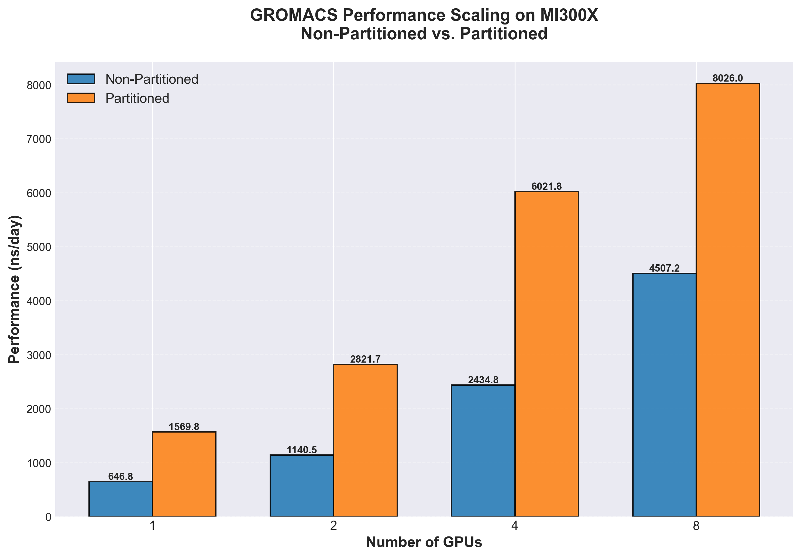
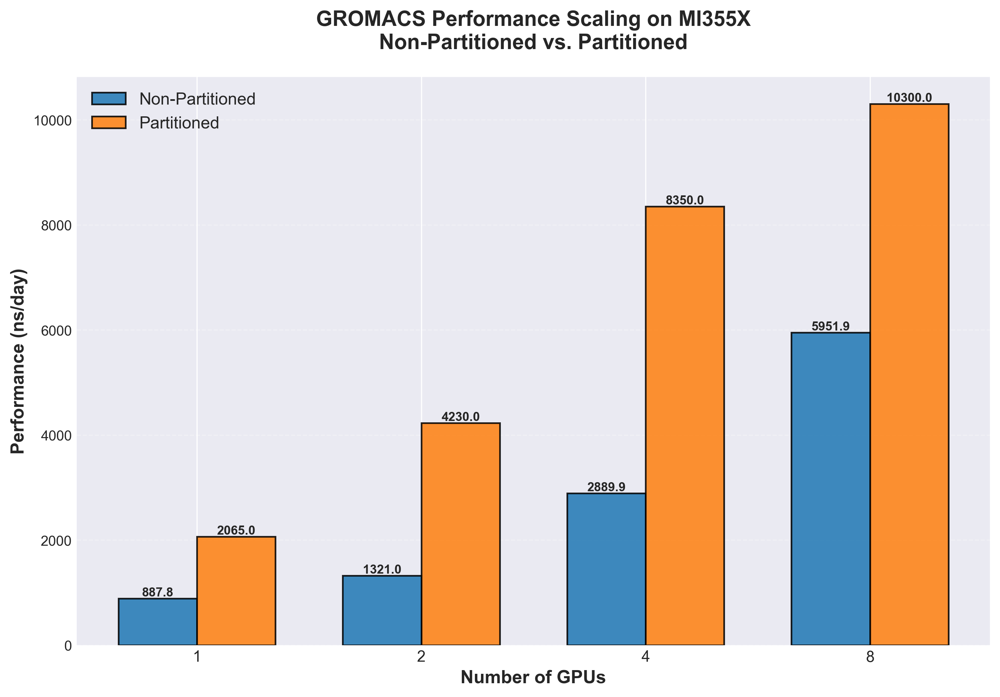

<!---
Copyright (c) 2026 Advanced Micro Devices, Inc. (AMD)

Permission is hereby granted, free of charge, to any person obtaining a copy
of this software and associated documentation files (the "Software"), to deal
in the Software without restriction, including without limitation the rights
to use, copy, modify, merge, publish, distribute, sublicense, and/or sell
copies of the Software, and to permit persons to whom the Software is
furnished to do so, subject to the following conditions:

The above copyright notice and this permission notice shall be included in all
copies or substantial portions of the Software.

THE SOFTWARE IS PROVIDED "AS IS", WITHOUT WARRANTY OF ANY KIND, EXPRESS OR
IMPLIED, INCLUDING BUT NOT LIMITED TO THE WARRANTIES OF MERCHANTABILITY,
FITNESS FOR A PARTICULAR PURPOSE AND NONINFRINGEMENT. IN NO EVENT SHALL THE
AUTHORS OR COPYRIGHT HOLDERS BE LIABLE FOR ANY CLAIM, DAMAGES OR OTHER
LIABILITY, WHETHER IN AN ACTION OF CONTRACT, TORT OR OTHERWISE, ARISING FROM,
OUT OF OR IN CONNECTION WITH THE SOFTWARE OR THE USE OR OTHER DEALINGS IN THE
SOFTWARE.
--->

# GROMACS Performance on AMD Instinct MI355X

Are you planning a hardware upgrade for your molecular dynamics workflows? In this blog, we benchmark [GROMACS](https://www.gromacs.org/about.html) on AMD's latest Instinct MI355X GPU and compare it head-to-head with the MI300X, demonstrating significant throughput improvements that accelerate time-to-results for life-science research. You will see exactly how much faster MI355X runs the standard ADH dodec benchmark across 1 to 8 GPUs. Use these results to make informed decisions about your next HPC deployment.

## Prerequisites

Molecular dynamics (MD) simulations are essential for understanding biomolecular systems at the atomic level, including docking and binding interactions key for drug discovery. As system sizes grow and simulation timescales extend, computational performance becomes critical.

Before diving into the benchmarks, here is what you should know:

- **GROMACS basics**: Familiarity with running GROMACS simulations helps, but is not required. We provide context where needed.
- **Multidir runs**: GROMACS multidir launches multiple independent simulation replicas in parallel. This approach suits ensemble MD, free-energy screening, and parameter sweeps.

For details on GPU compute partitioning and how to run GROMACS multidir workloads, see [Applying GPU Compute Partitioning for GPU Workloads](https://rocm.blogs.amd.com/artificial-intelligence/gpu-partitioning-workloads/README.html).

## Hardware and Software Setup

### Test System

We ran all benchmarks on a dual-socket server with the following configuration (see [Table 1](#tab1)):

<a id="tab1"></a>
| Component | Specification |
|-----------|---------------|
| CPUs | 2x AMD EPYC 9654 96-Core Processors |
| GPUs | 8x AMD Instinct MI300X or 8x AMD Instinct MI355X |
| Software | GROMACS with ROCm support |
**Table 1:** Server configuration used for experiments

### Benchmark Workload

The ADH dodec (alcohol dehydrogenase dodecahedron) system serves as our test case. ADH is a crucial enzyme for metabolizing alcohol and other biological substances, making it a relevant model for drug interaction studies. This medium-sized biomolecular benchmark represents realistic production workloads and is widely used for GPU performance evaluation in the MD community.

### Partitioning Modes

- **SPX (Single Partition)**: All 8 XCDs on the GPU operate as one logical device. This is the default mode.
- **CPX (Compute Partitioned)**: Each XCD appears as an independent GPU, giving you up to 8 logical devices per physical card.

For multidir workloads that run many independent replicas, CPX mode often delivers higher aggregate throughput. See [Applying GPU Compute Partitioning for GPU Workloads](https://rocm.blogs.amd.com/artificial-intelligence/gpu-partitioning-workloads/README.html) for partitioning instructions.

## Results and Discussion

Let's examine the benchmark data. All performance figures are in ns/day (nanoseconds of simulation time per wall-clock day)—higher is better.

### MI300X Throughput

[Table 2](#tab2) shows MI300X performance across GPU counts, comparing SPX and CPX modes:

<a id="tab2"></a>
| Compute Mode | 1x MI300X | 2x MI300X | 4x MI300X | 8x MI300X |
|--------------|-----------|-----------|-----------|-----------|
| SPX (Non-Partitioned) | 647 ns/day | 1,140 ns/day | 2,435 ns/day | 4,507 ns/day |
| CPX (Partitioned) | 1,570 ns/day | 2,822 ns/day | 6,022 ns/day | 8,026 ns/day |
| **Speedup** | **2.43x** | **2.48x** | **2.47x** | **1.78x** |

**Table 2:** MI300X GROMACS performance with ADH dodec benchmark

<a id="fig1"></a>


*Figure 1: MI300X multidir throughput in SPX (blue) vs. CPX (orange) mode. Higher ns/day is better.*

As shown in [Figure 1](#fig1), partitioning delivers substantial gains—up to 2.47x at 4 GPUs. Even at 8 GPUs, where CPU resources start to limit scaling, you still see a 1.78x improvement.

### MI355X Throughput

Now let's look at MI355X. [Table 3](#tab3) shows how the next-generation architecture delivers higher baseline performance:

<a id="tab3"></a>
| Compute Mode | 1x MI355X | 2x MI355X | 4x MI355X | 8x MI355X |
|--------------|-----------|-----------|-----------|-----------|
| SPX (Non-Partitioned) | 888 ns/day | 1,321 ns/day | 2,890 ns/day | 5,952 ns/day |
| CPX (Partitioned) | 2,065 ns/day | 4,230 ns/day | 8,350 ns/day | 10,300 ns/day |
| **Speedup** | **2.33x** | **3.20x** | **2.89x** | **1.73x** |

**Table 3:** MI355X GROMACS performance with ADH dodec benchmark

<a id="fig2"></a>


*Figure 2: MI355X multidir throughput in SPX (blue) vs. CPX (orange) mode. Higher ns/day is better.*

As seen in [Figure 2](#fig2), MI355X reaches 10,300 ns/day with 8 GPUs in CPX mode. The 2-GPU configuration shows a remarkable 3.20x speedup from partitioning, indicating excellent scaling efficiency at that scale.

### Head-to-Head: MI355X vs MI300X

How much faster is MI355X? [Table 4](#tab4) and [Table 5](#tab5) quantify the generational improvement with and without partitioning enabled:

<a id="tab4"></a>
| Configuration | MI355X (CPX) | MI300X (CPX) | MI355X Advantage |
|---------------|--------------|--------------|------------------|
| 1 GPU | 2,065 ns/day | 1,570 ns/day | **+31.5%** |
| 2 GPUs | 4,230 ns/day | 2,822 ns/day | **+49.9%** |
| 4 GPUs | 8,350 ns/day | 6,022 ns/day | **+38.7%** |
| 8 GPUs | 10,300 ns/day | 8,026 ns/day | **+28.3%** |

**Table 4:** MI355X advantage over MI300X with GPU partitioning enabled

For non-partitioned workloads, [Table 5](#tab5) shows MI355X still outperforms:
<a id="tab5"></a>
| Configuration | MI355X (SPX) | MI300X (SPX) | MI355X Advantage |
|---------------|--------------|--------------|------------------|
| 1 GPU | 888 ns/day | 647 ns/day | **+37.2%** |
| 2 GPUs | 1,321 ns/day | 1,140 ns/day | **+15.9%** |
| 4 GPUs | 2,890 ns/day | 2,435 ns/day | **+18.7%** |
| 8 GPUs | 5,952 ns/day | 4,507 ns/day | **+32.1%** |

**Table 5:** MI355X performance advantage over MI300X without GPU partitioning

## Discussion

### Key Findings

The benchmarks reveal several important insights:

**MI355X delivers substantial gains over MI300X.** In partitioned mode, MI355X achieves 28-50% higher throughput, depending on the GPU count (see [Table 4](#tab4)). The largest gain (49.9%) occurs at the 2-GPU configuration, suggesting MI355X scales particularly well in this regime.

**GPU partitioning benefits both architectures.** Both MI300X and MI355X show 1.7x to 3.2x speedups when using CPX mode for multidir workloads (see [Figure 1](#fig1) and [Figure 2](#fig2)). This technique is essential for maximizing throughput in ensemble MD scenarios.

**Scaling efficiency varies with GPU count.** At 8 GPUs with 128 replicas, speedups from partitioning are slightly lower (1.73-1.78x). At this scale, system resources may become a limiting factor as replica count increases.

```{note}
The ADH benchmarks are configured to offload all compute-intensive work to the GPU, keeping the CPU off the critical path. However, pair list regeneration &mdash; an infrequent but potentially expensive step &mdash; remains CPU-bound. Systems with more physical CPU cores can reduce the overhead of this step, particularly at high replica counts where many pair list updates may coincide.
```

### Practical Implications

Whether you are a researcher running production simulations or a developer optimizing HPC workflows, these results offer actionable guidance:

- **Leverage GPU partitioning on both MI300X and MI355X.** Enabling CPX mode delivers 1.7-3.2x throughput gains for multidir workloads on either GPU generation. This is a straightforward configuration change that benefits any ensemble-style simulation campaign.
- **MI355X offers the highest throughput.** For new deployments or hardware refreshes, MI355X provides 28%+ performance improvement over MI300X, enabling faster iteration on research questions and shorter queue times for batch jobs.
- **Balance compute resources.** Tune the number of concurrent replicas for optimal performance, especially at very high replica counts.

## Summary

This benchmark comparison demonstrates that the AMD Instinct MI355X delivers significant performance improvements for GROMACS molecular dynamics simulations compared to the MI300X. Key takeaways:

- MI355X achieves up to 10,300 ns/day throughput on ADH dodec with 8 GPUs in partitioned mode
- MI355X performance advantage ranges from 28% to 50% over MI300X, depending on configuration
- GPU compute partitioning (CPX mode) provides 1.7-3.2x speedups on both architectures
- The best results require balancing GPU partitions and tuning replica counts for your specific system configuration

For life-science researchers running ensemble MD simulations, free-energy calculations, or parameter sweeps, upgrading to MI355X accelerates time-to-results and enables larger-scale computational campaigns.

## Further Reading

- [GROMACS Official Website](https://www.gromacs.org/about.html)
- [Applying GPU Compute Partitioning for GPU Workloads](https://rocm.blogs.amd.com/artificial-intelligence/gpu-partitioning-workloads/README.html)
- [Deep Dive into MI300 Compute and Memory Partition Modes](https://rocm.blogs.amd.com/software-tools-optimization/compute-memory-modes/README.html)
- [GPU Partitioning Made Easy](https://rocm.blogs.amd.com/software-tools-optimization/gpu-operator-partitioning/README.html)

## Disclaimers

Third-party content is licensed to you directly by the third party that owns the content and is not licensed to you by AMD. ALL LINKED THIRD-PARTY CONTENT IS PROVIDED "AS IS" WITHOUT A WARRANTY OF ANY KIND. USE OF SUCH THIRD-PARTY CONTENT IS DONE AT YOUR SOLE DISCRETION AND UNDER NO CIRCUMSTANCES WILL AMD BE LIABLE TO YOU FOR ANY THIRD-PARTY CONTENT. YOU ASSUME ALL RISK AND ARE SOLELY RESPONSIBLE FOR ANY DAMAGES THAT MAY ARISE FROM YOUR USE OF THIRD-PARTY CONTENT.

The benchmarks presented in this blog were conducted under specific test conditions. Performance may vary based on system configuration, software versions, workload characteristics, and other factors. The information contained herein is for informational purposes only.
