<!---
Copyright (c) 2026 Advanced Micro Devices, Inc. (AMD)

Permission is hereby granted, free of charge, to any person obtaining a copy
of this software and associated documentation files (the "Software"), to deal
in the Software without restriction, including without limitation the rights
to use, copy, modify, merge, publish, distribute, sublicense, and/or sell
copies of the Software, and to permit persons to whom the Software is
furnished to do so, subject to the following conditions:

The above copyright notice and this permission notice shall be included in all
copies or substantial portions of the Software.

THE SOFTWARE IS PROVIDED "AS IS", WITHOUT WARRANTY OF ANY KIND, EXPRESS OR
IMPLIED, INCLUDING BUT NOT LIMITED TO THE WARRANTIES OF MERCHANTABILITY,
FITNESS FOR A PARTICULAR PURPOSE AND NONINFRINGEMENT. IN NO EVENT SHALL THE
AUTHORS OR COPYRIGHT HOLDERS BE LIABLE FOR ANY CLAIM, DAMAGES OR OTHER
LIABILITY, WHETHER IN AN ACTION OF CONTRACT, TORT OR OTHERWISE, ARISING FROM,
OUT OF OR IN CONNECTION WITH THE SOFTWARE OR THE USE OR OTHER DEALINGS IN THE
SOFTWARE.
--->

# AMD Instinct™ GPUs MLPerf Inference v6.0 Submission

The results for the [MLPerf Inference v6.0 benchmark](https://mlcommons.org/2026/03/texttovideo-inference/) were released on April 1st 2026. In this round, AMD showcased the performance of the MI355X system, as well as the capability and versatility of the ROCm software stack.

AMD's latest results showed improved performance for standard and pruned MLPerf models in the Open category:

- Highly optimized FP4 Large Language Models (LLMs) on AMD Instinct MI355X and MI350X
- First-ever results for the new [gpt-oss-120b](https://openai.com/index/introducing-gpt-oss/) and [Wan2.2](https://wan22.studio/) benchmarks
- Distributed inference on up to 12 nodes for [Llama 2 70B](https://ollama.com/library/llama2:70b) and gpt-oss-120b
- Performance exceeding 1 million tokens per second in multi-node inference

## AMD Instinct MI355X GPU

All AMD submissions in MLPerf Inference v6.0 were based on the MI355X system. The MI355X system is an  Instinct GPU launched in 2025. It was featured in both [MLPerf Inference v5.1](https://rocm.blogs.amd.com/artificial-intelligence/mlperf-inference-v5.1/README.html) and [MLPerf Training v5.1](https://rocm.blogs.amd.com/artificial-intelligence/mlperf-training-v5.1/README.html).
Designed specifically for AI workloads, high-performance computing (HPC), and large-scale cloud deployments, the MI355X leverages AMD's advanced CDNA architecture to deliver exceptional compute power and efficiency. The MI350 Series GPU specifications are shown below.

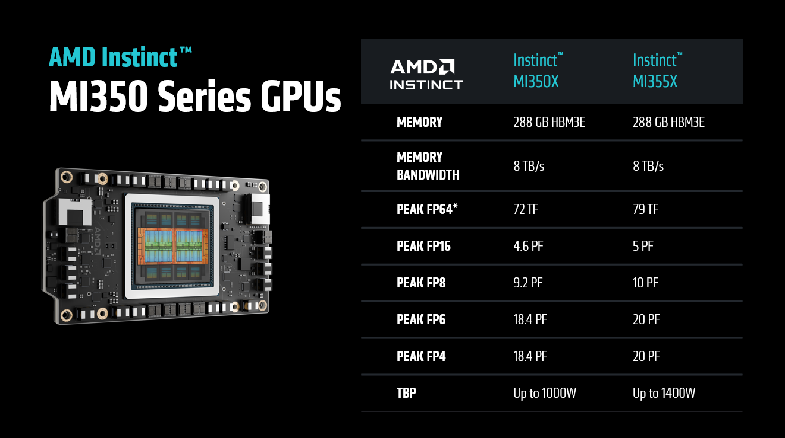

AMD’s ROCm software ecosystem, when paired with the MI355X GPU, offers a mature, open platform for building and scaling AI applications.
A notable feature of the MI355X-ROCm integration is the robust 4-bit floating-point (FP4) precision support that delivers up to 20 petaflops of performance with 288 GB of HBM3 memory and 8TB/s memory bandwidth, which is ideal for deploying and training large-scale generative AI models with low-latency inference.
The MI355X GPU's liquid cooling technology provides improved performance under sustained workloads, reducing energy demands, enhancing reliability, and extending hardware lifespan.

## Performance Optimizations

### gpt-oss-120b

gpt-oss-120b is a popular open, 117‑billion‑parameter mixture-of-experts model. It natively supports configurable reasoning effort levels. It's known for its capabilities in advanced coding, competition mathematics, and graduate-level scientific logic.

gpt-oss-120b is a [new workload introduced in MLPerf Inference v6.0](https://mlcommons.org/2026/03/mlperf-inference-gpt-oss/). It features a split dataset strategy where separate datasets are used for performance measurement and accuracy evaluation.

The [reference implementation](https://github.com/mlcommons/inference/tree/master/language/gpt-oss-120b) provides a reproducible end‑to‑end reference model specification, with a tokenizer and data pipeline, accuracy/quality targets, and a compliant harness that plugs into the MLPerf LoadGen. Submitters can run apples‑to‑apples measurements across Offline and Server scenarios.

#### gpt-oss-120b Optimizations

##### Optimized Attention

AMD extended the unified attention kernel to enable true end-to-end FP8 execution. Queries were run in 8-bit floating-point (FP8) precision alongside keys and values, reducing memory traffic on the query path and allowing the QKᵀ matrix multiplication to leverage native FP8 tensor instructions, achieving higher throughput than with 16-bit floating point (FP16) or brain floating point 16 (BF16) precision in some cases. This leads to faster prefills and better decode throughput, especially with larger batch sizes. This update also simplified the inner loop, resulting in more efficient scheduling and improved overall hardware use.

AMD is pioneering ways to accelerate AI development using AI itself to shorten the kernel optimization loop—using models and automation to propose high-performance GPU code instead of relying solely on manual tuning. For this project, we applied [GEAK](https://github.com/AMD-AIG-AIMA/GEAK-Agent), an AI-powered framework for automated GPU kernel optimization, to improve a unified attention Triton kernel. GEAK discovered high-performing configurations and reworked the inner tile loop by refining how the QK dot product (tl.dot(Q, K)) and the P·V accumulation (tl.dot(P.to(V.dtype), V)) are scheduled relative to global-memory loads of K and V tiles, increasing overlap between data movement and compute. For the FP8 path, it removed the need to upcast KV tensors to match higher-precision queries, eliminating per-tile branching and casting while reducing register pressure from temporary widened values—allowing larger tile sizes without register spilling. Together, these GEAK-driven optimizations delivered an approximate 8–10% end-to-end speedup.

##### Optimized MoE

The Mixture-of-Experts (MoE) general matrix multiplication (GEMM) kernel handles the high-throughput matrix multiplications essential for MoE layers. This process involves routing tokens to specific experts, gathering rows into expert-specific batches, and performing multiplications against quantized weights.

The kernel distributes parallel work across the GPU using a 3D grid of tiles. To improve performance for intermediate batch sizes, AMD optimized the tiling logic to prevent hardware underutilization. This increased the total number of blocks in the grid, improving occupancy and parallel efficiency without altering the underlying mathematical operations.

##### Quantized Model

The model was compressed using [AMD Quark]( https://quark.docs.amd.com/latest/). The full calibration dataset provided by [MLCommons Inference](https://mlcommons.org/benchmarks/inference-datacenter/) was used for calibration. As part of the preprocessing step, inputs from the dataset were tokenized and serialized into fixed-length sequences using dynamic padding and truncation. The weights and activations of all applicable PyTorch modules were quantized to OCP MXFP4 or OCP FP8-e4m3 formats. Additionally, KV caches were quantized to OCP FP8-e4m3 format.

##### vLLM Tuning <a id="gpt-vllm"></a>

To improve performance, tuning experiments were conducted on vLLM parameters and used to refine the scheduler configurations. Specifically, the vLLM scheduler was adjusted to control the dispatch of queued requests based on the number of in-flight requests. Fine-tuning this scheduling threshold reduced GPU idle time. The scheduler was also modified to be more KV-cache-aware.

### Llama 2 70B

Llama 2 70B is a 70‑billion‑parameter, decoder‑only Transformer from Meta that MLCommons introduced as an LLM workload in MLPerf Inference shortly after the model was released. In the last few MLPerf Inference rounds it has become the most popular model by number of submissions. Its widespread adoption in the competition underscores its role as a de facto baseline for LLM inference, enabling fair, transparent comparison of hardware and software stacks.

#### Llama 2 70B Optimizations

##### Multi-Head Attention (MHA) Improvement

In real-world LLM serving, each inference step handles a heterogeneous batch of tokens spanning multiple request types. AMD's `ROCM_AITER_FA` uses multi-path routing strategies that dispatch work to specialized kernels, treating workload-aware optimization as a core design principle rather than a hidden kernel implementation detail. Its three-path routing is purpose-built for mixed workloads: instead of pushing all requests through a single kernel, it directs each type to a dedicated kernel tuned for its specific characteristics. In `ROCM_AITER_FA`, tokens are steered to one of three pipelines: prefill, extend, or decode. To support that, the vLLM model runner reorders requests within mixed batches so memory access stays contiguous before routing. The MHA stack relies on a pre-shuffled KV-cache layout and uses AITER’s `pa_fwd_asm kernel` for the decode attention step.  

For more information about the ROCm attention backends, see [Beyond Porting: How vLLM Orchestrates High-Performance Inference on AMD ROCm](https://vllm.ai/blog/rocm-attention-backend).

##### GEMM Tuning

In Llama2-70B, MXFP4 GEMMs account for the majority of end-to-end computations. AMD used profiling to isolate the critical GEMMs. These were then optimized in AITER through tile tuning for high TFLOPs.

##### vLLM Tuning

The same vLLM tuning used to optimize the [gpt-oss-120b](#gpt-vllm) inference workload was also applied to Llama 2 70B inference.

### Wan2.2-T2V-A14B

Wan2.2-T2V-A14B is a 14‑billion‑parameter text‑to‑video generative model that MLCommons introduced as a workload in the MLPerf Inference v6.0 benchmark. This is a mixture-of-experts (MoE) model that consists of two experts that are activated sequentially during the denoising process. The first expert is known as the High Noise Expert and is active during the early stages of denoising. The model then switches to the Low Noise Expert to complete the denoising process.

Unlike other MLPerf Inference datacenter models, Wan2.2-T2V-A14B does not use a server scenario. It only uses a Single Stream setup where queries are processed one by one. A Closed category MLPerf Inference submission requires both Offline and Single Stream scores. Accuracy evaluation uses the [VBench dataset](https://github.com/Vchitect/VBench) and 99% of reference accuracy is required to satisfy accuracy constraints.

#### Wan 2.2 Optimizations

The Wan2.2 submission used [xDiT](https://github.com/xdit-project/xDiT) as the underlying inference engine to parallelize the video generation task over multiple GPU ranks.

##### Optimized attention operators

Up to 80% of the compute time in Wan 2.2 is consumed by self-attention operations with a long context length. To improve inference times, approximate attention kernels delivered through [AITER](https://github.com/ROCm/aiter) were used. To maintain output video quality, a hybrid schedule was used where most of the denoising steps used attention kernels with aggressive quantization and the last few denoising steps used a higher-precision kernel.

In this workload, a mixture of Sage attention with FP8 and FP4 compute for the Q*K product was used. The aggressive quantization steps used FP4 quantization, and the last denoising steps used higher-precision FP8 quantized attention.

##### Quantized GEMMs

A significant amount of compute time can be saved by quantizing GEMMs from their default accuracy down to MXFP4 accuracy. In this submission, MXFP4 GEMMs delivered via AITER were used. For more information about the benefits of MXFP4, see [Breaking the Accuracy-Speed Barrier: How MXFP4/6 Quantization Revolutionizes Image and Video Generation](https://rocm.blogs.amd.com/artificial-intelligence/mxfp-t2i-t2v/README.html).

##### Parallel VAE

The final step of video generation with diffusion models involves a variational autoencoder (VAE) step, where the denoised latent tensor is decoded into the final output video frames. In the Single Stream scenario this step can be parallelized across all the GPU ranks, further boosting performance. The latent tensor is split among ranks to distribute the computation load using the open source implementation from [DistVAE](https://github.com/xdit-project/DistVAE).

### Llama 3.1 405B

In MLPerf Inference v5.1, AMD submitted Llama-3.1-405B in the Open division. [Intelligent pruning](https://rocm.blogs.amd.com/artificial-intelligence/mlperf-llama-pruning/README.html) of layers in transformer blocks was used to maximize performance while maintaining high accuracy. In the current round, AMD built upon the MLPerf Inference v5.1 submission and achieved improved performance results.

The most significant change that was made was to the parallelization strategy. In MLPerf v5.1, Tensor Parallelization of 1 (TP1) was used. In MLPerf v6.0 TP2 was used. IN TP2, tensors are divided between two GPUs. The [QuickReduce](https://github.com/mk1-project/quickreduce) library was used to minimize the cost of GPU-GPU communication. As in MLPerf v5.1, close to 25% of the model layers in the transformer block were dropped resulting in a Rouge-L accuracy score of 99.43%.

Load balancing with a BatchPacking method was used. In this technique, query requests are packed by batch size with a greedy algorithm to distribute workloads across GPUs as evenly as possible. Results for the Interactive scenario of MLPerf inference for FP4 model of Llama 3.1 405B with Tensor Parallel Size of 8 (TP8) and QuickReduce techniques achieved a throughput of 793 tokens/second by intelligently dropping around 20% of the layers among 126 layers in the Transformer block of the Llama 3.1 405B model, resulting in a Rouge-L accuracy score of 99.30% and an exact match score of 95.98%.

### Multi-Node Inference

MLPerf v6.0 featured the first AMD Multi-Node MI355X submission. It was the first ever MLPerf submission with over a million tokens/sec for Llama 2 70B (11-nodes) and gpt-oss-120b (12-nodes) in the Closed division.

This was accomplished with efficient scale-up and scale-out end-to-end ROCm solution stack optimization that achieved a 97-98% scaling efficiency. This involved an AMD MLPerf Stack with vLLM using [ZMQ](https://zeromq.org/get-started/) a point-to-point network connection across the distributed nodes.

One node in the cluster was designated to be the Head node. The Head node acted as the orchestrator for interfacing with the MLPerf LoadGen. The remainder of the nodes in the cluster were designated to be Worker nodes for workload scheduling/management. The figure below shows the multi-node topology (Logical View) with the Head node running the MLPerf harness and drives the Worker nodes. The Head node also runs a local SUT.

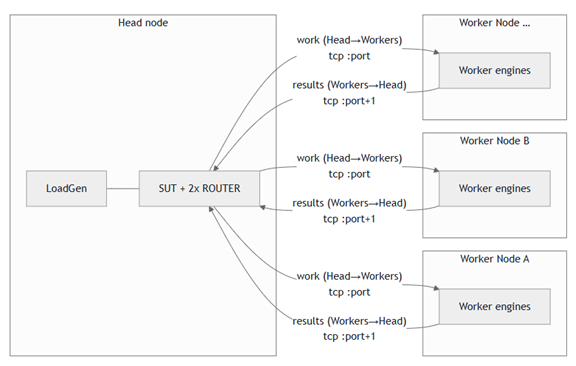

The GPU engine on each Worker node runs a worker process that connects to the Head node’s IP over TCP using ZeroMQ (ZMQ). Each engine uses two logical TCP channels to communicate work and results to the Head node. The figure below shows the socket usage between the Head node and the Worker nodes.

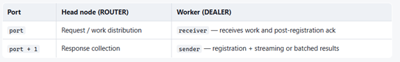

Every worker process is a DEALER with a unique identity string, so the ROUTER can target a specific GPU engine and attribute each reply accordingly as follows:

- port P — “Downstream”: the System Under Test (SUT) sends work (prompts, batch slices, shutdown None) to the chosen worker identity.
- port P+1 — “Upstream”: workers send results-registration, streaming tokens or batched outputs, and shutdown None.

The figure below shows the configuration sequence. The Head node starts. It creates a ZMQ context and binds the router. It enables the router to listen to the other nodes. Each participant Worker node then starts. Each logical engine uses one socket to port `P` for receiving work and post-registration acknowledgements, and one socket to port `P+1`  for registration and results.

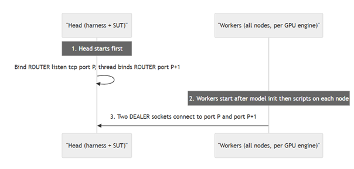  

The figure below shows the operational flow for both Offline and Server scenarios. In the server scenario, after the cluster is configured, policy-based query distribution to worker nodes happens. This can be round robin, shortest load queue, or another distribution method. In the offline scenario, `calculate_workload_distribution` determines how the queries from the MLPerf Loadgen are distributed across the worker nodes. This is policy based. It can be based on the GPU capabilities, equal distribution, weighted distribution, or another policy.

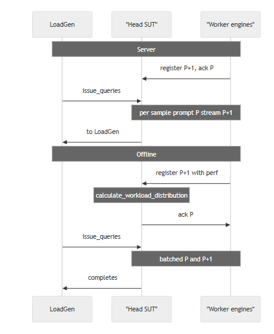

### System Tuning

While GPUs drive the majority of performance, optimized server design and configuration also significantly enhance overall performance. Specifically, a high-frequency CPU, such as the AMD EPYC™ 9575F, delivers optimal results as an AI Head node, running the CPU software stack with minimal overhead.

System optimizations and tuning can be grouped into the following categories: BIOS options and OS configuration.

#### BIOS Options

The following BIOS settings were chosen for AMD's submissions:

- High Performance mode & Core Performance boost (set to enabled): Enables Core Performance Boost to reach up to 5GHz with AMD EPYC™ 9575F.
- Determinism Control/Enable (set to Power): Maximum performance of any individual system by maximizing the capabilities of a given CPU.
- Nodes Per Socket (NPS – set to 1 or 4 based on workload affinity): This setting enables a trade-off between minimizing local memory latency for NUMA-aware scheduling vs. maximizing per core memory bandwidth for non-NUMA-friendly workloads.
- APBDIS (set to 1): Enable fixed Infinity Fabric P-state control.
- DC C-states (set to Disabled): Prevent the AMD Infinity Fabric from entering a low-power state.
- SMT Control (Disabled): Single hardware thread per core.

#### OS Configuration

The following OS configurations were selected for AMD's submissions:

- CPU Core States (C-states): Deeper sleep state (C2) is disabled and frequency governor is set to performance (e.g., using Linux cpupower utility).
- Reduce any performance overhead of the CPU or memory:

    ```bash
    echo 0 | sudo tee /proc/sys/kernel/nmi_watchdog
    echo 0 | sudo tee /proc/sys/kernel/numa_balancing
    echo 0 | sudo tee /proc/sys/kernel/randomize_va_space
    echo ‘always’ | sudo tee /sys/kernel/mm/transparent_hugepage/enabled
    echo ‘always’ | sudo tee /sys/kernel/mm/transparent_hugepage/defrag
    ```

More optimization options are discussed in the [AMD product optimization guides](https://rocm.docs.amd.com/en/latest/how-to/system-optimization/index.html).

## Results Overview

Results published by AMD are summarized below:

| Submission ID | Benchmark | Category | GPU | Number of Nodes | Offline score Tokens/s| Server Score Tokens/s | Interactive Score Tokens/s |
| --- | --- | --- | --- | --- | --- | --- | --- |
| 6.0-0002 | Llama2-70b | Closed | MI355X | 1 | 103480 | 100282 | 73608 |
| 6.0-0001 | Gpt-oss-120b | Closed | MI355X | 1 | 95004 | 82136 |  |
| 6.0-0002 | Llama2-70b | Closed | MI355X | 11 | 1042110 | 1016380 | 785522 |
| 6.0-0003 | Gpt-oss-120b | Closed | MI355X | 12 | 1031070 | 900054 |  |
| 6.0-0103 | WAN | Open | MI335X | 1 |  | 27.4 s (SingleStream) |  |
| 6.0-0102 | Llama3.1-405 | Open |  |  | 2011 |  | 794 |

> **Note:**
>
> The WAN benchmark Server scenario results are the results for Single Stream. Its score is given as latency in seconds, rather than tokens/second for all other benchmarks.

### Llama2-70b Performance Improvement over MLPerf Rounds

MLPerf Inference v6.0 marks the fourth time that AMD submitted the Llama2-70b benchmark. The current round of submissions show a large performance improvement relative to previous rounds as illustrated in the figure below. Offline scores improved by 4.4x and Server scores improved by 4.8x. This was mainly due to FP4 quantization in the MI355X GPU.

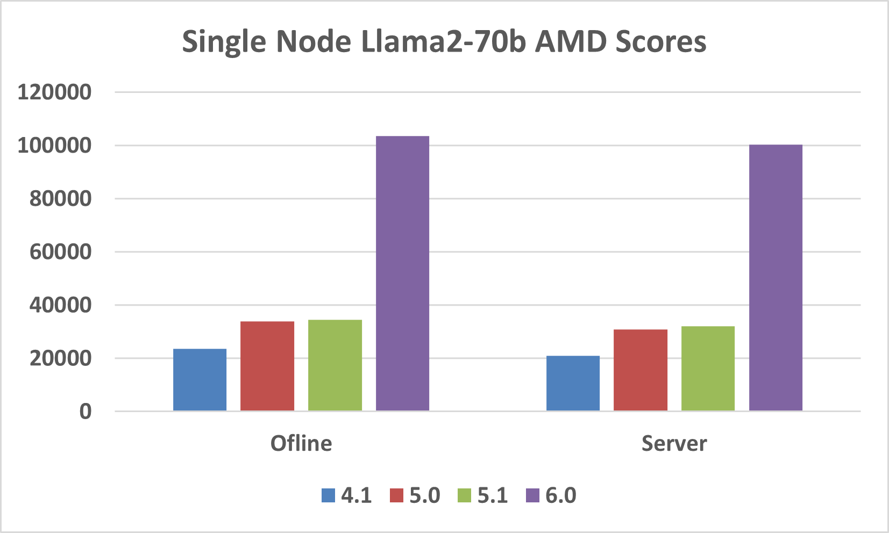

### Single Node Llama 2 70B

The AMD Instinct MI355X GPU showed comparable performance to the Nvidia B200 and B300 GPUs (see figure below). The MI355X tied with Nvidia in Offline mode. It was competitive with Nvidia in Server mode. And in Interactive mode it surpassed Nvidia.

Against Nvidia's B300, AMD's GPU delivers 92% in offline mode, 93% in server mode, and exceeds with 104% in interactive mode. These results underscore the AMD Instinct MI355X GPU's efficiency and capability in handling demanding inference tasks, highlighting its robust performance in interactive environments.

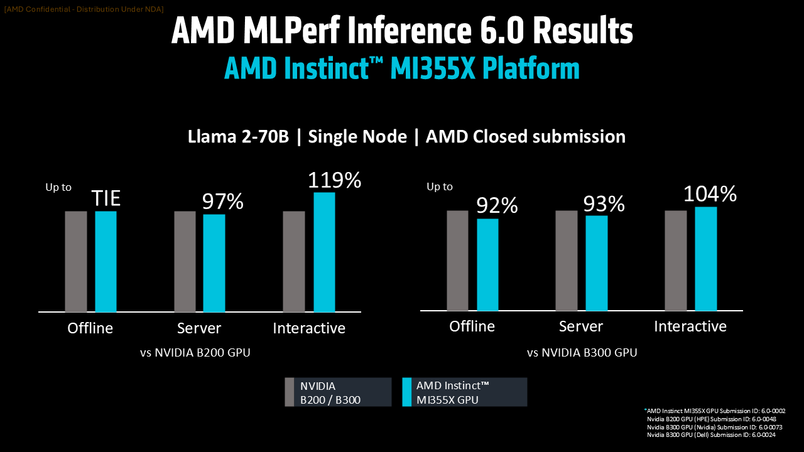

### Single Node gpt-oss-120b

AMD submitted a highly competitive score for this debut MLPerf benchmark. This demonstrates increased velocity of AI optimizations on Instinct GPUs and the ROCm software platform. The figure below shows a comparison of AMD MI355X against Nvidia B200 and B300 for gpt-oss-120b. Due to the lack of B200 score from Nvidia, the two best results submitted by Nvidia OEM partners is shown.

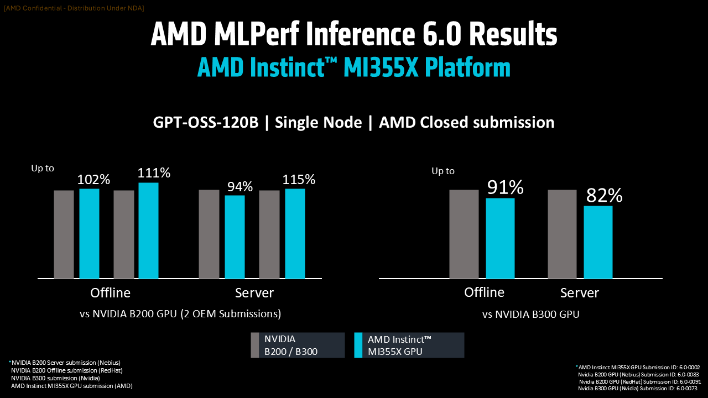

AMD delivers robust performance, achieving up to 115% in server mode and 111% in offline mode. The comparison against B300 is also strong and underscores AMD's competitive edge and strength, particularly in offline operations.

### Multi-Node Llama 2 70B

AMD showcased multi-node settings to demonstrate the robustness of its platforms. For Llama 2 70B, all 3 scenarios (Offline, Server, and Interactive) were run on 11 nodes using 87 GPUs. The results show excellent scaling, with Offline and Server achieving 93% scaling efficiency while Interactive is even better at 98%. In terms of absolute numbers, both Offline and Server scenarios generated over one million tokens/second, as illustrated in the figure below.

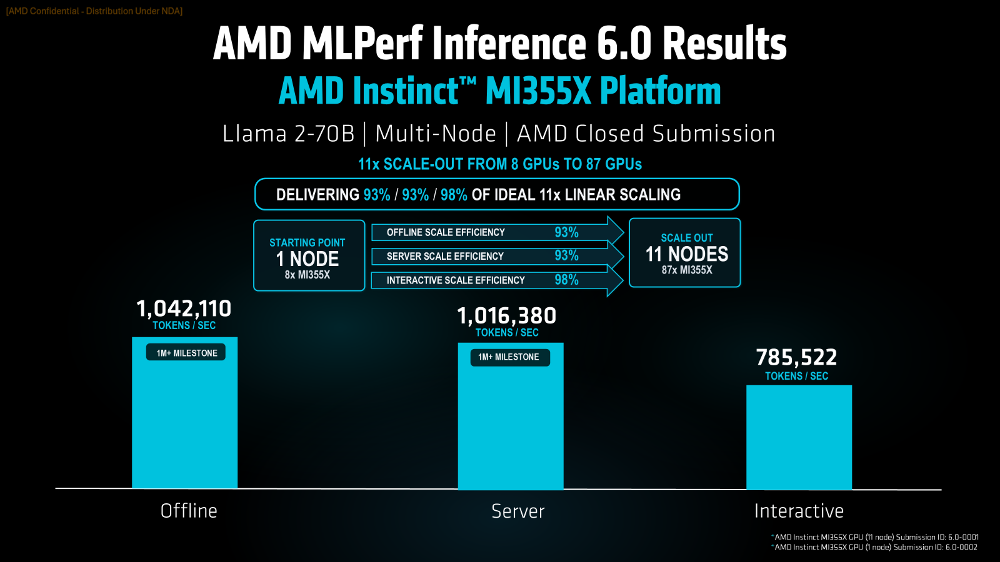

### Multi-Node gpt-oss-120b

The gpt-oss-120b benchmark was also evaluated in the multi-node setting. The results (see figure below) show an efficient distributed inference with scaling of 92% and 93% over 12 nodes. The Offline scenario also broke the 1 million tokens/second barrier.

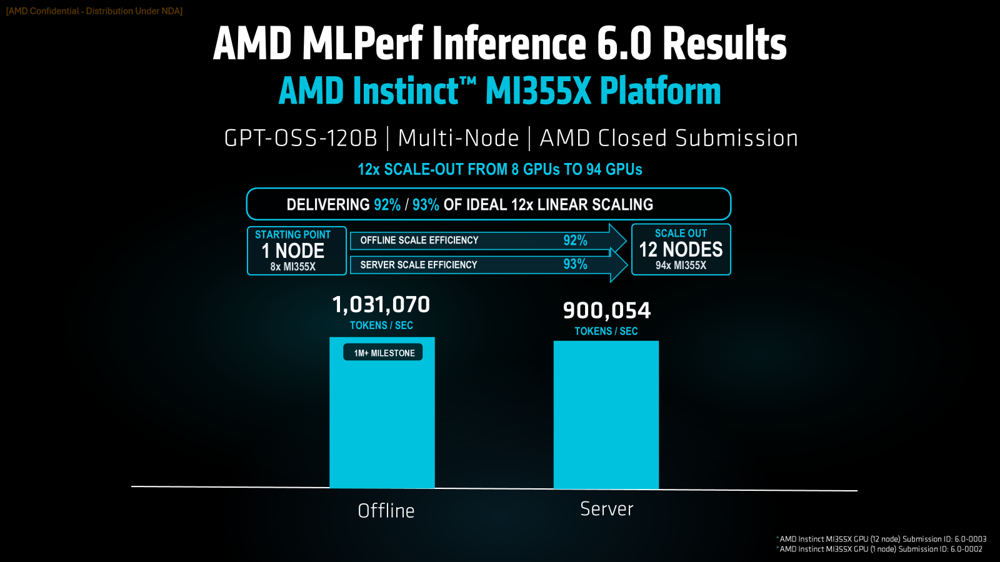

### Single Node Wan-2.2-t2v (Text-to-video)

To show that Instinct GPUs could handle generative AI workloads outside of LLMs, AMD submitted scores for the Wan-2.2-t2v text-to-video workload  (see figure below).

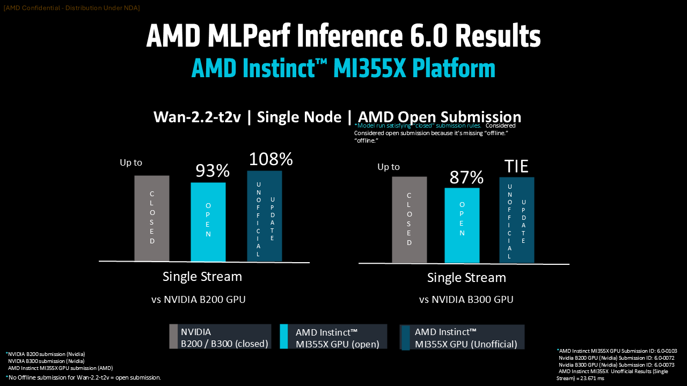

In the figure below, you can find AMD's unofficial Offline scores for MLPerf Inference 6.0. These scores were obtained while the submissions were undergoing review process.

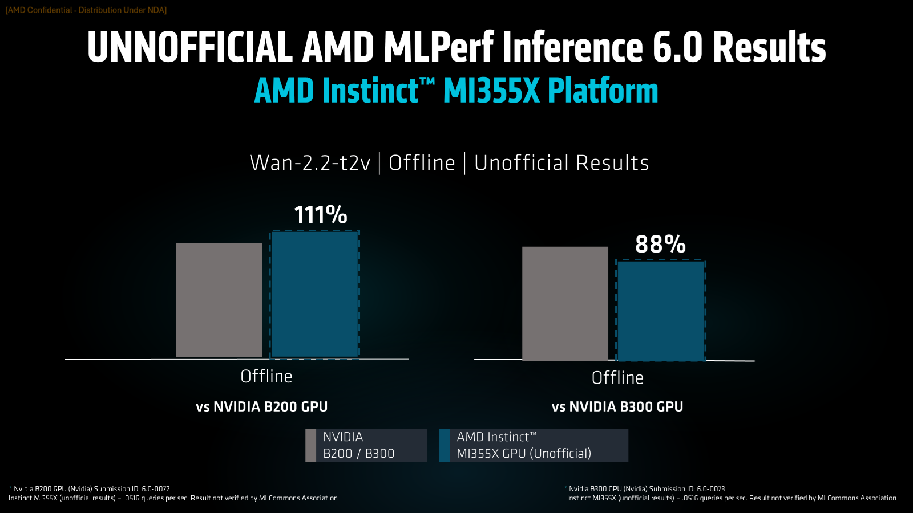

## Partners Submissions

The MLPerf Inference v6.0 submission highlights the growing strength of the AMD Instinct GPU ecosystem, with partners delivering competitive performance across multiple Instinct platforms (MI300X, MI325X, MI350X and MI355X), and two models (Llama 2 70B and gpt-oss-120b). AMD had 9 partners: Oracle, Cisco, Dell, Giga Computing, MangoBoost, MiTAC, HPE, Supermicro, and Red Hat.

The joint submission by Dell and MangoBoost is notable for being the first ever MLPerf Inference submission featuring three different GPUs: MI300X, MI325X, and MI355X. Furthermore, the GPUs were distributed across geographical locations, with MI300X and MI335X located in Korea while MI355X was located in the USA.

## Summary

This blog discusses AMD's performance in the [MLPerf Inference v6.0 benchmarks](https://mlcommons.org/benchmarks/inference-datacenter/), highlighting the capabilities of AMD Instinct™ GPUs, particularly the MI355X Platform.

Released on April 1, 2026, this MLPerf round emphasized both hardware performance and the versatility of the ROCm software stack.

Key achievements include highly optimized FP4 large language models, the first submissions for gpt-oss-120b and Wan2.2 benchmarks, and distributed inference across multiple nodes.

The MI355X, with its advanced CDNA architecture, excels in AI and HPC tasks, offering significant memory, compute, and thermal efficiency.

AMD’s submissions show competitive performance against NVIDIA GPUs, especially in Server and Offline scenarios. These results underline AMD's ongoing strength in AI and HPC acceleration, bolstered by collaborations with partners like Oracle, Cisco, and HPE, enhancing their ecosystem through varied Instinct platforms and models.

## Disclaimers

Third-party content is licensed to you directly by the third party that owns the
content and is not licensed to you by AMD. ALL LINKED THIRD-PARTY CONTENT IS
PROVIDED “AS IS” WITHOUT A WARRANTY OF ANY KIND. USE OF SUCH THIRD-PARTY CONTENT
IS DONE AT YOUR SOLE DISCRETION AND UNDER NO CIRCUMSTANCES WILL AMD BE LIABLE TO
YOU FOR ANY THIRD-PARTY CONTENT. YOU ASSUME ALL RISK AND ARE SOLELY RESPONSIBLE
FOR ANY DAMAGES THAT MAY ARISE FROM YOUR USE OF THIRD-PARTY CONTENT.
