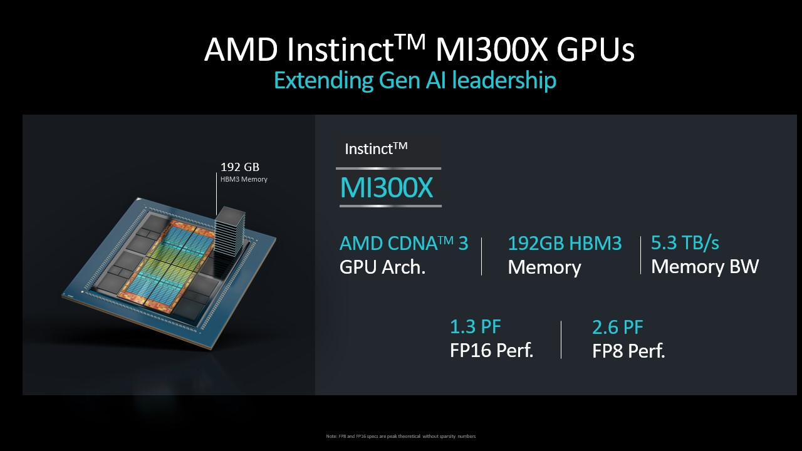
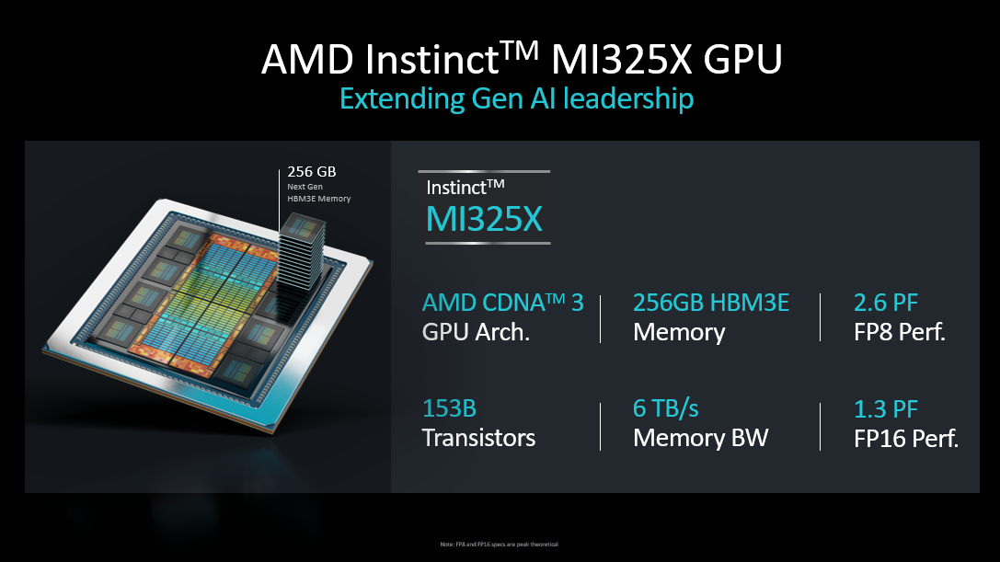
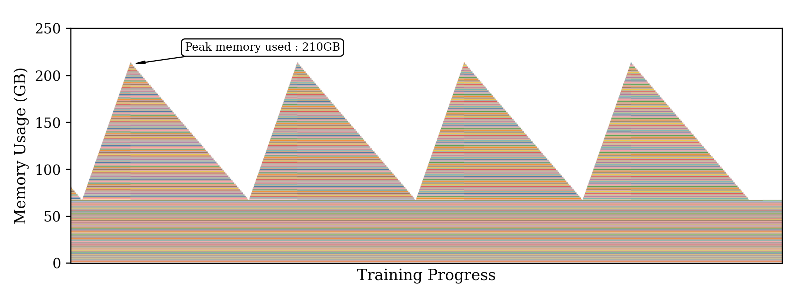
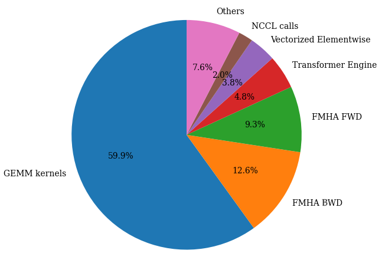
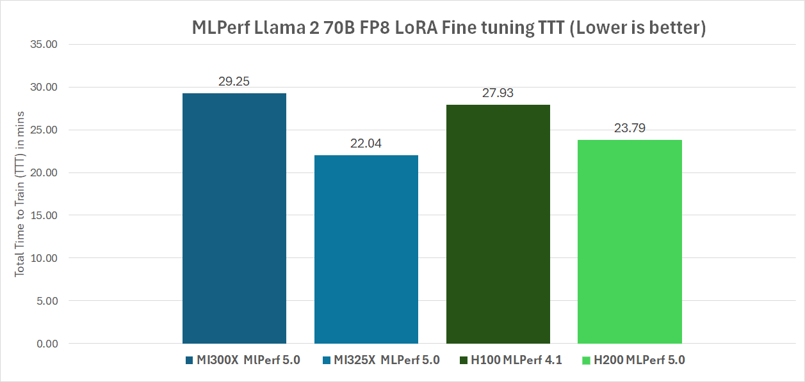
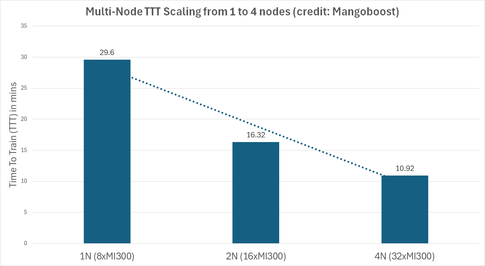

<!---
Copyright (c) 2025 Advanced Micro Devices, Inc. (AMD)

Permission is hereby granted, free of charge, to any person obtaining a copy
of this software and associated documentation files (the "Software"), to deal
in the Software without restriction, including without limitation the rights
to use, copy, modify, merge, publish, distribute, sublicense, and/or sell
copies of the Software, and to permit persons to whom the Software is
furnished to do so, subject to the following conditions:

The above copyright notice and this permission notice shall be included in all
copies or substantial portions of the Software.

THE SOFTWARE IS PROVIDED "AS IS", WITHOUT WARRANTY OF ANY KIND, EXPRESS OR
IMPLIED, INCLUDING BUT NOT LIMITED TO THE WARRANTIES OF MERCHANTABILITY,
FITNESS FOR A PARTICULAR PURPOSE AND NONINFRINGEMENT. IN NO EVENT SHALL THE
AUTHORS OR COPYRIGHT HOLDERS BE LIABLE FOR ANY CLAIM, DAMAGES OR OTHER
LIABILITY, WHETHER IN AN ACTION OF CONTRACT, TORT OR OTHERWISE, ARISING FROM,
OUT OF OR IN CONNECTION WITH THE SOFTWARE OR THE USE OR OTHER DEALINGS IN THE
SOFTWARE.
--->

# AMD’s MLPerf Training Debut: Optimizing LLM Fine-Tuning with Instinct™ GPUs

MLPerf Training is one of the most influential benchmarks in the AI community, playing a critical role in measuring and advancing the performance of machine learning training across diverse hardware and software platforms. Established to provide a fair, standardized way to evaluate training speed and efficiency on real-world workloads, MLPerf Training has become the chosen standard for researchers, engineers, and organizations striving to test the boundaries of AI capability. By fostering transparency and innovation, it focuses on progression in both academic research and industry applications, helping the community identify the most effective technologies to power the next generation of intelligent systems.

This is AMD’s first MLPerf™ Training submission - a significant milestone for the company and the broader AI ecosystem. This debut not only showcases AMD’s commitment to delivering high performance and scalability, but also reflects the growing maturity of its hardware and software solutions tailored for AI workloads. For the community, AMD’s entry brings fresh innovation and competition, fueling advancements that benefit everyone invested in accelerating machine learning training. This exciting step marks another milestone of AMD’s ongoing journey to shape the future of AI. In this round, a submission was made on two of the leading AMD Instinct™ GPU architectures: MI300X and MI325X.

## MI300X and MI325X Instinct GPU Architectures

The AMD Instinct MI300X and MI325X discrete GPUs are based on the AMD CDNA™ 3 core architecture built to achieve industry leading AI performance and good total cost of ownership (TCO) to lead the AI transformation. Built with advanced stacking and chiplet technology, both architectures deliver high throughput and efficiency with matrix core technology in an OAM (Open Accelerator Module) package. The AMD Instinct MI300X and MI325X platforms are designed with 8 discrete GPUs and an EPYC™ CPU forming an integral building block of high-performance AI infrastructure for inference and training. Both GPUs have high memory capacities to meet the demands to execute GenAI, LLM (large language model) and reasoning models to execute large batch sizes, sequence lengths, and data sets. This also enables them to run some of the large model training and inference on a single-GPU.  MI300X has a large HBM3 memory capacity of 192GB and 5.3 TB/s memory bandwidth, and the newer MI325X has 256 GB of HBM3e memory offering 6 TB/s memory bandwidth. Both architectures support a variety of precisions such as FP16, BF16, FP8, and INT8, for serving, training, and data analytics on a variety of use cases and models. Paired with AMD ROCm™ software stack, they unleash increased developer efficiency, ease of use, and out-of-box productivity with support for a rich portfolio of AI frameworks, performance math, AI and HPC libraries, and software packages. The key specifications of the MI300X and MI325X GPUs and platforms are illustrated below:

## Llama 2 70B LoRA Benchmark

The [Llama 2 70B LoRA benchmark](https://github.com/mlcommons/training/tree/master/llama2_70b_lora) represents a prominent workload within the MLPerf Training competition, focusing on the efficient fine-tuning of a large-scale language model using advanced parameter-efficient adaptation techniques. This benchmark centers on the Llama 2 70B model, a popular open-weight large language model developed to deliver superior performance across a wide range of natural language processing tasks. Fine-tuning is a downstream task starting from a pre-trained LLM that is adapted to a specific language task. In this use case, the SCROLLS (Standardized Comparison Over Long Language Sequences) government report dataset is used to fine-tune the base Llama 2 70B model. The dataset consists of question-summary pairs based on reports written by government research agencies, including Congressional Research Service and U.S. Government Accountability Office. Benchmark specification has chosen the large context length of 8192 tokens (equivalent of roughly 6,144 words) to push to the maximum context to fit in an 8-GPU system at the time of introduction of the benchmark. This has become the single most popular training benchmark submission among all the MLPerf models in the training category with a record of 51 publications running on a variety of accelerators and GPUs.

### Model Overview

Llama 2 70B is a popular transformer-based language model with 70 billion parameters, designed to perform tasks in language understanding and generation. Its scale and complexity present significant challenges for training, requiring highly optimized hardware and software solutions to achieve competitive performance while adhering to MLPerf’s strict accuracy and efficiency standards.

### LoRA Fine-Tuning Technique

Low-Rank Adaptation (LoRA) is a parameter-efficient fine-tuning method that modifies only a small subset of the model's parameters by injecting trainable low-rank matrices into specific layers of the transformer architecture, such as attention and feed-forward modules. This approach significantly reduces memory consumption and computational overhead compared to full fine-tuning, enabling faster training and lowering resource requirements without compromising model accuracy.

### Benchmark Setup

**Task:** The benchmark involves fine-tuning the pre-trained Llama 2 70B model on targeted downstream language tasks as specified by the MLPerf Training rules, ensuring standardized evaluation across submissions.

**Dataset:** The [SCROLLS dataset](https://arxiv.org/abs/2201.03533) approved by the MLPerf consortium, which includes question-summary pairs on reports from government research agencies.

**Measured Metrics:** The benchmark evaluates time-to-train convergence, throughput, energy efficiency, and adherence to MLPerf’s accuracy thresholds, ensuring that results meet or exceed reference quality metrics. Specifically, for the Llama 2 70B LoRA fine-tuning benchmark, in addition to the overall Total Time to Train (TTT) metric, the following accuracy and convergence criteria must be met for a submission to be considered as valid:

- Loss metric: Cross entropy of the next token prediction for loss function.
- Model Accuracy: Once convergence is detected based on evaluation loss, the ROUGE scores are computed to evaluate performance.
- Runs:  The benchmark is run 10 times to convergence, with the best and worst scores dropped to calculate the TTT while following the "reference convergence point criteria" (ensuring fairness across all submissions).

## Optimization Techniques

### Utilizing Large Memory

AMD's MI300X accelerator features 192GB of HBM3 memory with 5.3TB/s of bandwidth across eight memory stacks while the newer MI325X upgrades to 256GB of HBM3E memory delivering 6TB/s of bandwidth. This represents a substantial 33% boost in memory capacity and 13% increase in bandwidth between generations. Hence, alternative compute-communication trade-offs are made when optimizing Llama2 70B LoRA on these accelerators.  

The figure above depicts the peak memory usage over time when training Llama 2 70B LoRA on the MLPerf dataset. With peak memory usage at ~210 GB, the model fails to fit on a single MI300X GPU.

On the MI300X, instead of distributing the model using Tensor Parallelism (TP) or Context Parallelism (CP) to reduce peak memory load, FULL Activation Checkpointing was employed, recomputing all 21 transformer blocks during the backward pass. This helps to avoid the expensive GPU-to-GPU communication during TP and/or CP. Based on these experiments, each offloaded block can reduce peak memory by 2GB. This optimization alone helped improve the throughput by 22% over the TP2 configuration. Furthermore, with the superior 256GB HBM capacity on the MI325X GPU, the re-computation of the layers was avoided. Significant part of the throughput improvement comes from 10% faster GEMM operations as a result of moving from TP2 to TP1. GEMMs benefitted from high arithmetic intensity (thereby making it purely compute-bound operation) when the model is trained with TP1 compared to TP2.

To further save memory, the low-level memory profile of the model was inspected during both the checkpoint loading and training phases. During the backward pass, gradients with respect to the input are computed as  $\frac{\partial L}{\partial x} = \frac{\partial L}{\partial y} \cdot W^T$. Since the base weights $W$ are frozen in LoRA training, $W^T$ required during the backward pass may be cached at the cost of increased memory usage. This implementation turns off  these framework-level caches that preemptively save the $W^T$. This reduces the overall peak memory load and fit the model onto a single GPU. This optimization was applied to both the MI300X and the MI325X.

### Flash Attention Optimization

Flash Attention is a hardware-aware attention algorithm that optimizes compute and memory efficiency of the scaled dot-product attention mechanism.  In the standard formulation of attention, the output is computed as:

$$\text{Attention}(Q, K, V) = \text{Softmax}\left(\frac{QK^T}{\sqrt{d_k}}\right) V$$

where *Q*, *K*, and *V* are the query, key, and value matrices respectively, and *dₖ* is the key dimension.

Integrating with AMD’s Composable Kernel was leveraged to backend the FAv3 backward pass implementation. The kernel can be enabled via the Transformer Engine integration by using the flags that can be found in the [Transformer Engine documentation](https://github.com/ROCm/TransformerEngine/tree/release_v1.11_rocm?tab=readme-ov-file#fa-v3-backward-kernels-in-ck-backend). The improved dqdkdv backward kernel helped reduce the TTT by ~23%.

In this setup, BF16 Flash Attention was leveraged through the ROCm Transformer Engine, using Composable Kernel as the backend.

### GEMM Tuning

In this MLPerf Training v5.0 submission, the ROCm Transformer Engine was utilized, which integrates seamlessly with [hipBLASLt](https://github.com/ROCm/hipBLASLt) to optimize GEMM performance.

The distribution of time spent on different kernels (see pie chart above) shows that GEMMs make up 60% of the end-to-end latency and therefore, it is critical to optimize them to get a performant training run. For a given input/output datatype, matrix shape, epilogue, etc, the hipBLASLt library contains several underlying kernels to perform the GEMM operation. The default kernel picked by the library may or may not be the most performant, and therefore, users can perform extensive search over available kernels to pick the most performant one. The tuning operation basically picks the best kernel with optimal workgroup, work item, tile size, shared memory allocation, etc suited for the given GEMM operation. The offline GEMM tuning process is straight-forward and [explained in detail in the official documentation](https://rocm.blogs.amd.com/artificial-intelligence/gemm_blog/README.html). The offline GEMM tuning resulted in about *10% improvement for the FP8 GEMMs*.

### Transformer Engine Improvements

Next, several non-GEMM kernels were optimized by developing forward and backward implementations. These include RMSNorm, SwiGLU, fused rope, cast transpose, and cast kernels.

- RMSNorm: The Llama 2 model adopts pre-normalization. The RMSNorm is applied before each attention and feed-forward layer throughout the transformer blocks, replacing the traditional LayerNorm used in other large language models. Both persistent and non-persistent implementations of RMSNorm in Triton were developed. This improved the training throughput by 2%.
- SwiGLU: Llama 2 models use the SwiGLU activation function in their feed-forward layers instead of the standard ReLU activation commonly found in most deep learning models. Our improvement to DSwiGLU yields an overall 1.5% improvement in training throughput.
- Elementwise Cast transpose and Cast: With Flash Attention running in FP16 and GEMMs in FP8 (E4M3/E5M2), the model requires frequent cast & cast transpose ops. These memory-bound kernels account for more than 3.5% of the workload. Custom HIP kernels were developed to improve the performance of these memory-bound kernels.

### System Tuning

While the majority of performance gains came from optimizing GPU kernels and exploiting high-throughput memory bandwidth, CPU configuration and OS-level settings play a crucial supporting role as well. Misconfigured systems, even with powerful GPUs, can experience performance bottlenecks due to suboptimal process scheduling, memory fragmentation, or thermal throttling.

Prior to launching model training, a runtime system-tuning shell script is used to prepare the system for high-performance GPU training. The script performs the following tasks:

- Clears the file system cache to start from a clean memory state, avoiding stale cache effects.
- Disables low-power sleep states to prevent CPUs from going to sleep between kernel launches.
- Sets the CPU frequency to performance mode to keep CPUs at max clock speed, reducing frequency scaling latency.
- Disables NUMA (Non-Uniform Memory Access) balancing, address space randomization, and watchdog timers to reduce runtime overhead and variability.
- Enables Transparent Huge Pages (THP) and defragmentation to improve memory access efficiency.

## MLPerf Training v5.0 Submission

With all the above optimizations,  AMD's ML performance leadership is affirmed with this first-ever AMD MLPerf Training submission on MI325X and MI300X platforms based on the Llama 2 70B LoRA Finetuning workload performance. This achieved a total training time (TTT) of 22.04 minutes on a single MI325X [QuantaGrid D74A-7U](https://www.qct.io/product/index/Server/rackmount-server/GPGPU-Xeon-Phi/QuantaGrid-D74A-7U) node with 8 X MI325X GPUs on an AMD EPYC 9575F host CPU. On a single [Supermicro AS-8125GS-TNMR2](https://www.supermicro.com/en/products/system/gpu/8u/as%20-8125gs-tnmr2) system with 8 X MI300X GPUs, this achieved a TTT of 29.25 minutes. This MI325X score beats the H200 comparable MLPerf Training v5.0 publication average score (H200 TTT range from 23.08 to 26.10 minutes) at 23.97 minutes by 8.1%, and the MI300X score is within 4.5% of the Nvidia H100 MLPerf Training v4.1 score of 27.93 minutes. Check out this [blog](https://rocm.blogs.amd.com/artificial-intelligence/reproduce-mlperf-training-v5.0/README.html) if you are interested in reproducing the submission results from AMD. The comparable H200 MLPerf 5.0 publication IDs are 5.0-0050, 5.0-0078, 5.0-0034, 5.0-0022, 5.0-0090, 5.0-0045 and 5.0-0081, and all of the H200 MLPerf 5.0 submissions are from Nvidia's partners. The comparable H100 submission is from MLPerf 4.1 publication ID 4.1-0050. In the chart below, the two v5.0 submissions from AMD are shown, with publication IDs 5.0-0026 and 5.0-0027 on MI325X and MI300X respectively, along with the other comparisons mentioned above.
These results demonstrate that AMD’s Instinct platform offers competitive performance on state-of-the-art LLM workloads, validating its readiness for production-scale AI training.

Additionally, AMD is proud to showcase partners Gigacomuting, QCT, and Supermicro, as they have also submitted results with MI325X platforms. Furthermore, partners such as Oracle, Dell and Mangoboost, have submitted results with MI300X platforms. In particular, Mangoboost submitted a 4-node MI300X configuration with a record result of 10.91 minutes across 32 MI300X GPUs powered by [LLMBoost MLOPs software and GPUBoost RocEv2 RDMA solution](https://www.mangoboost.io/resources/blog/mangoboost-sets-a-new-standard-for-multi-nodes-llama2-70b-lora-on-amd-mi300x-gpu). The chart below shows the excellent scaling efficiency with multiple MI300X nodes demonstrated by Mangoboost.

All these collaborations and publications establish MI300X and MI325X as strong training GPU architectures with scalability enabled by the ROCm software stack. With this first-ever MLPerf Training benchmark submission, AMD Instinct solutions show their performance leadership over other accelerators on GenAI LLM model training and fine-tuning tasks.

## Summary

The Llama 2 70B LoRA benchmark MLPerf Training v5.0 submission highlights AMD’s ability to effectively support large language model workloads through innovative optimization techniques. Through the thoughtful combination of advanced performance optimization techniques, AMD’s submission not only pushes performance boundaries, but also demonstrates that AMD Instinct products are competitive alternatives in the industry.

This compelling benchmark demonstrates AMD’s strengths in hardware acceleration and software ecosystem maturity, positioning another key contribution to the evolving landscape of large-scale AI training.

## Disclaimers

Third-party content is licensed to you directly by the third party that owns the
content and is not licensed to you by AMD. ALL LINKED THIRD-PARTY CONTENT IS
PROVIDED “AS IS” WITHOUT A WARRANTY OF ANY KIND. USE OF SUCH THIRD-PARTY CONTENT
IS DONE AT YOUR SOLE DISCRETION AND UNDER NO CIRCUMSTANCES WILL AMD BE LIABLE TO
YOU FOR ANY THIRD-PARTY CONTENT. YOU ASSUME ALL RISK AND ARE SOLELY RESPONSIBLE
FOR ANY DAMAGES THAT MAY ARISE FROM YOUR USE OF THIRD-PARTY CONTENT.
