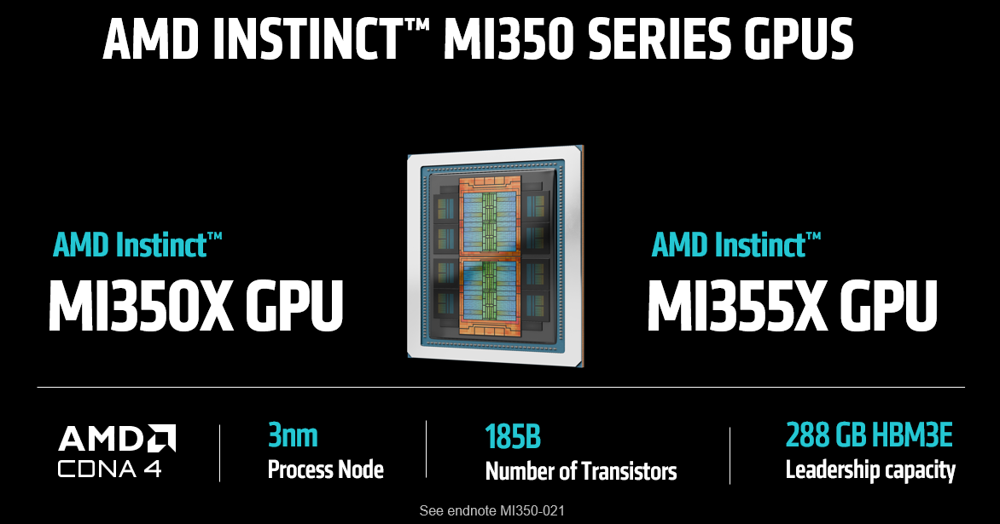
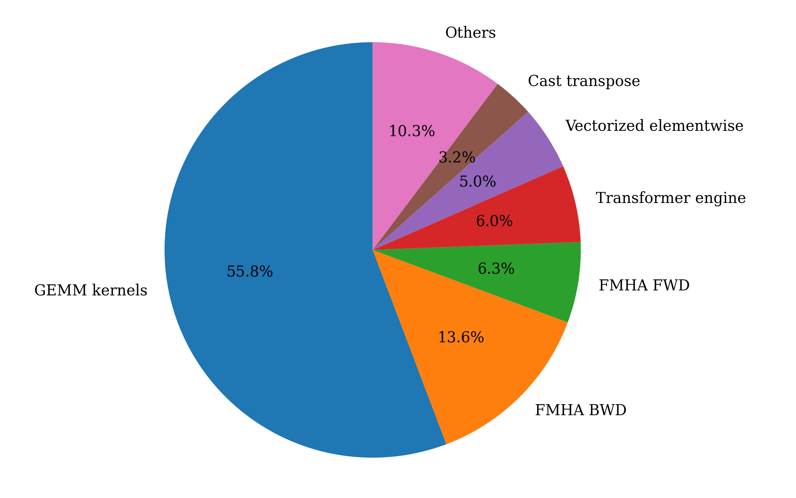
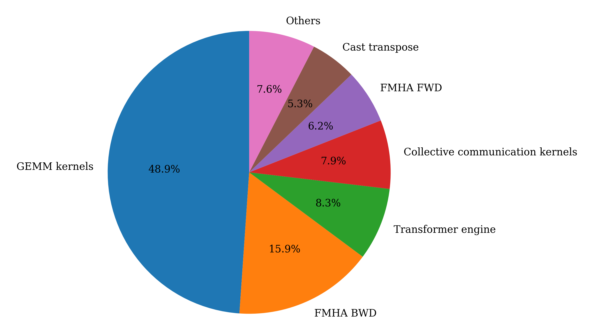
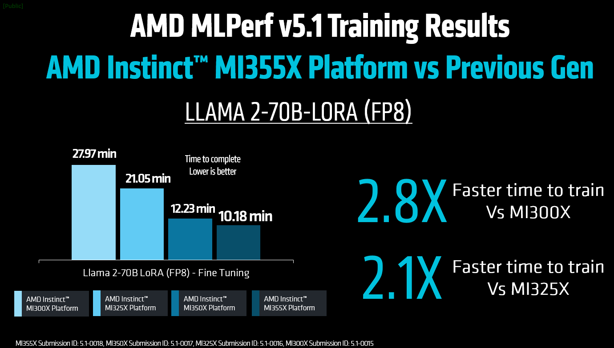
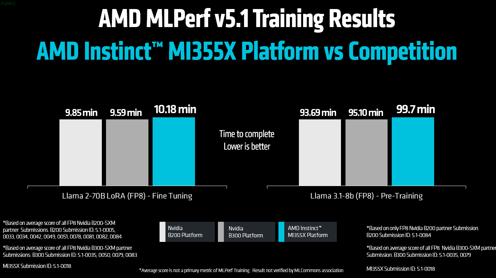
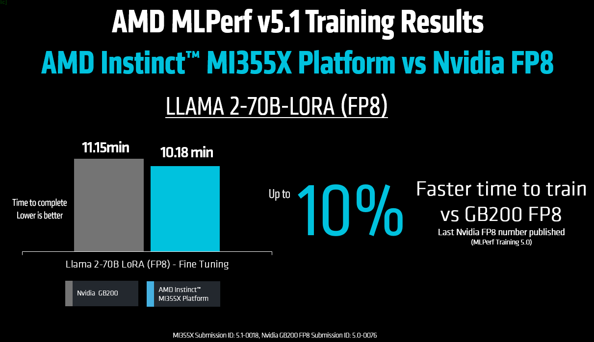

<!---
Copyright (c) 2025 Advanced Micro Devices, Inc. (AMD)

Permission is hereby granted, free of charge, to any person obtaining a copy
of this software and associated documentation files (the "Software"), to deal
in the Software without restriction, including without limitation the rights
to use, copy, modify, merge, publish, distribute, sublicense, and/or sell
copies of the Software, and to permit persons to whom the Software is
furnished to do so, subject to the following conditions:

The above copyright notice and this permission notice shall be included in all
copies or substantial portions of the Software.

THE SOFTWARE IS PROVIDED "AS IS", WITHOUT WARRANTY OF ANY KIND, EXPRESS OR
IMPLIED, INCLUDING BUT NOT LIMITED TO THE WARRANTIES OF MERCHANTABILITY,
FITNESS FOR A PARTICULAR PURPOSE AND NONINFRINGEMENT. IN NO EVENT SHALL THE
AUTHORS OR COPYRIGHT HOLDERS BE LIABLE FOR ANY CLAIM, DAMAGES OR OTHER
LIABILITY, WHETHER IN AN ACTION OF CONTRACT, TORT OR OTHERWISE, ARISING FROM,
OUT OF OR IN CONNECTION WITH THE SOFTWARE OR THE USE OR OTHER DEALINGS IN THE
SOFTWARE.
--->

# Technical Dive into AMD MLPerf Training v5.1 Submission

MLPerf Training v5.1 was released on November 12th 2025 and for this round, AMD has showcased its newest GPUs and added a new benchmark. The highlights of this round include:

- First MLPerf Training results on AMD Instinct™ MI355X and MI350X GPUs.
- Results on a new MLPerf Training benchmark, Llama 3.1 8B pretraining. AMD led the development of this benchmark, which is designed to be a more accessible version of the Llama 3.1 405B pretraining benchmark while preserving most of the features of the larger model benchmark.
- Submissions on three generations of AMD Instinct GPUs: MI355X, MI350X, MI325X, and MI300X.

This blog provides a brief description of the AMD Instinct MI350 series GPUs, followed by the benchmarks that AMD has submitted results in this round. Most importantly, this blog provides the technical details of how the submitted results were achieved. Finally, the blog highlights the submitted results and compares them against competing submissions. Details on how to reproduce the submission results by AMD can be found in the blog on [Reproducing AMD MLPerf Training v5.1 Submission Result](https://rocm.blogs.amd.com/artificial-intelligence/mlperf-training5.1-repro/README.html).

## AMD Instinct MI350 Series GPUs

Building upon the success of the [MLPerf Inference v5.1 submission](https://rocm.blogs.amd.com/artificial-intelligence/mlperf-inference-v5.1/README.html), this AMD submission features the [MI355X GPU](https://www.amd.com/content/dam/amd/en/documents/instinct-tech-docs/product-briefs/amd-instinct-mi355x-gpu-brochure.pdf) again. The MI355X GPU is designed to deliver outstanding performance for the latest generation artificial intelligence models. Utilizing AMD [CDNA 4 architecture](https://www.amd.com/content/dam/amd/en/documents/instinct-tech-docs/white-papers/amd-cdna-4-architecture-whitepaper.pdf), this GPU delivers computational power and efficiency, making it an excellent option for organizations aiming to advance AI model training and inference. The MI355X GPU is seamlessly integrated with the AMD ROCmTM software ecosystem, providing developers with a robust, open platform for creating and scaling AI applications.

MI350 Series GPUs have native support for FP4 (4-bit floating-point) precision, offering up to 20 petaflops of FP4 performance, an essential feature for deploying large-scale AI models today. This high-performing FP4 computation, combined with an industry-leading 288 GB of high-bandwidth HBM3e memory with a bandwidth of 8TB/s, greatly minimizes memory and computational overhead without sacrificing accuracy. These characteristics render the MI355X GPU perfect for cutting-edge generative AI models, facilitating low-latency inference for large-scale model deployment with numerous simultaneous users, while also enabling efficient training on vast datasets.

The MI355X GPU is also characterized by its thermal efficiency, which is enhanced by its support for liquid cooling. This sophisticated cooling mechanism ensures stable peak performance during sustained high workloads while decreasing energy consumption in data centers. For operators managing dense GPU arrays, liquid cooling not only allows for higher sustained clock speeds but also enhances system reliability and extends hardware longevity.

Overall, the AMD Instinct MI355X GPU combines raw performance, effective memory management, scalability, and support from a comprehensive software ecosystem, making it a leading competitor in the fast-evolving realm of AI and HPC acceleration.

## MLPerf Training Benchmarks

AMD submitted results for two benchmarks in MLPerf training v5.1: Llama 2 70B LoRA finetuning and Llama 3.1 8B pretraining. These two benchmarks are briefly described below. Please visit [ML Commons](https://mlcommons.org/benchmarks/training/) for more details about these benchmarks.

### Llama 2 70B LoRA finetuning

The [Llama 2 70B LoRA benchmark](https://github.com/mlcommons/training/tree/master/llama2_70b_lora) is a key workload in the MLPerf Training competition, focusing on the efficient fine-tuning of a large-scale language model using advanced parameter-efficient training techniques. The Llama 2 70B model is a widely-used open-weight large language model renowned for its exceptional performance across various natural language processing tasks. In this context, fine-tuning involves tailoring a pre-trained large language model (LLM) to a specific language task using the SCROLLS (Standardized Comparison Over Long Language Sequences) government report dataset. This dataset includes question-summary pairs derived from reports by agencies such as the Congressional Research Service and the U.S. Government Accountability Office. The benchmark employs a substantial context length of 8,192 tokens (or about 6,144 words) to maximize context fitting in an 8-GPU system upon the benchmark's introduction. It has emerged as the most favored training benchmark submission among MLPerf models in the training category, with submissions covering a wide range of accelerators and GPUs. The Low-Rank Adaptation (LoRA) method, integral to this benchmark, is a Parameter-Efficient Fine-Tuning (PEFT) technique that adjusts a select set of the model's parameters by introducing trainable low-rank matrices into specific layers of the transformer architecture, including attention and feed-forward modules. This method considerably reduces memory usage and computational demands compared to full fine-tuning, facilitating quicker training and decreased resource consumption without sacrificing model accuracy.

### Llama 3.1 8B pretraining

The [Llama 3.1 8B pretraining benchmark](https://mlcommons.org/2025/10/training-llama-3-1-8b/), introduced in MLPerf Training v5.1, democratizes modern LLM pretraining evaluation, making it accessible to a much wider group of organizations, including many academic institutions and small AI startups. It is specifically designed for easy setup and execution on small to moderately-sized computational resources, requiring only a single node, but also being scalable to a large number of nodes. In fact, it shares many similarities, with Llama3.1-405b MLPerf Training benchmark: It reuses the same dataset, shares convergence evaluation metric (perplexity).

This benchmark is the first MLPerf training benchmark led by AMD. The design goal has been to create a benchmark similar to existing Llama3.1-405b benchmark, but making it accessible on a single node while preserving as many features as possible. This model also replaces BERT pre-training benchmark, which has been part of the MLPerf Training suite for a long time, but has become obsolete compared to modern LLMs.

An important feature of this benchmark is that it does not require a checkpoint as a start, but instead it randomizes weights at the start. This avoids the need for checkpoint conversion, which can become a hurdle when submitters want to use a different training framework compared to the reference implementation. This also means that this benchmark represents an early part of model training with initial fast convergence followed by a slowdown in later stages.

The benchmark provides three tunable hyperparameters: batch size, learning rate, and number of warmup samples, although they must align with behaviors defined by [Reference Convergence Points (RCPs)](https://github.com/mlcommons/training_policies/blob/master/training_rules.adoc#13-reference-convergence-points-rcps). The benchmark utilizes a subset of the C4 (Colossal Cleaned Common Crawl) dataset split for training and validation. Each evaluation run tests the first 1,024 sequences (about 8.4 million tokens) from the validation set. The training data is shuffled to introduce variability, while the validation data is kept unshuffled to ensure consistent evaluation across different runs.

## Optimization Techniques

The techniques used to achieve the performance in the MLPerf training v5.1 submissions are described below.

### GEMM tuning

To understand the importance of General Matrix Multiply (GEMM) operations in the two workloads submitted, consider the distribution of time spent on different kernel categories:

| Distribution of kernel time-Llama 2 70B | Distribution of kernel time-Llama 3 8B |
| --- | --- |
|  |  |

As illustrated in the pie charts above, GEMM operations constitute the dominant portion of the workloads. Kernel tuning is performed to identify optimal tile sizes that maximize compute core utilization. A novel automated infrastructure has been developed to address instruction scheduling by analyzing instruction-level parallelism and memory access patterns, to minimize idle cycles and maximize throughput. The resulting optimized GEMM implementations are upstreamed to `hipBLASLt` under the [rocm-libraries](https://github.com/ROCm/rocm-libraries) repository, making the improvements accessible to the wider ROCm ecosystem.

### Flash attention v3

Beyond GEMM operations, the forward and backward passes of Flash Multi-Head Attention (FMHA), also referred as Flash Attention (FA), represent the second most computationally intensive kernels in both Llama model variants considered in this blog. These attention operations constitute a substantial portion of end-to-end training latency. To address this performance bottleneck, an enhanced implementation of BF16 Flash Attention version 3 (FAv3) has been developed utilizing the [AITER](https://github.com/ROCm/aiter) framework. The current FAv3 implementation delivers significant speedup compared to the previous version due to improved memory access patterns and enhanced core utilization.

### Optimizing validation performance through DataLoader worker tuning

During our model training pipeline optimization, we identified a critical bottleneck in the validation phase that was consuming 15 minutes per validation step. Investigation revealed that our validation DataLoader was configured with an excessive number of worker processes, which introduced significant overhead from process spawning, inter-process communication, and data serialization costs. Unlike the training phase where high worker counts can effectively parallelize data loading across large batch iterations, validation typically processes smaller datasets with fewer forward passes, making the multiprocessing overhead counterproductive.

By reducing the number of workers in our validation DataLoader and finding the sweet spot between parallelization benefits and overhead costs, we achieved a dramatic reduction in validation time, from 15 minutes down to just 3 minutes per epoch. This optimization not only accelerated our overall training workflow but also reduced compute resource consumption, allowing for more frequent validation checks without impacting development velocity.

### Comprehensive software stack upgrades

As part of our continuous infrastructure modernization efforts, we executed a comprehensive upgrade across our entire ML training stack, transitioning from ROCm 6.4 to 7.0, PyTorch 2.6 to 2.8, and ROCm Transformer Engine v1.9 to v2.2.

ROCm 7 adds comprehensive support for the latest AMD Instinct MI350 Series GPUs and their AI Tensor Engines. One of the key optimization features in ROCm 7 is the incorporation of pre-optimized transformer engine kernels via the AI Tensor Engine to leverage OCP-FP8/MXFP8/MXFP6/MXFP4 precision. By leveraging lower-precision data types and advanced kernel fusion, ROCm 7 demonstrated a dramatic performance leap for AI workloads including training. Additionally, improved collective communication library RCCL, abstracted by the new NIXL layer, reduces communication overhead and improves GPU utilization.

PyTorch 2.8 introduced functional support for `gfx950` architecture on ROCm 7, ensuring seamless hardware-software integration and unlocking architecture-specific optimizations for our AMD accelerators. Collectively, these ROCm-optimized upgrades have substantially improved our training throughput on AMD MI355X GPU while enabling more efficient memory utilization for both pretraining of the Llama 3.1 8B model and parameter-efficient LoRA adaptation of the Llama 2 70B model.

### ROCm Transformer Engine improvements

Building upon the optimizations developed at AMD, several non-GEMM kernels - namely SwiGLU, and Fused Cross Entropy, have seen significant performance improvements since the MLPerf training v5.0 round.

- SwiGLU: Llama 2 models use the SwiGLU activation function in their feed-forward layers instead of the standard ReLU activation commonly found in most deep learning models.
- Triton Fused Cross-Entropy: A fused cross-entropy implementation in Triton was developed with conditional gradient scaling, per-row gradient output support via stride indexing, and valid token count handling for masked sequences.
- To reduce peak memory utilization on the Llama2 70B model and fit larger batch sizes, we employ the following 2 strategies–storing forward activations in 8 bit and improving the ROCm transformer engine’s weight caching mechanism. With the above 2 changes, we were able to avoid using any activation recomputation.

### System tuning

While the majority of performance gains came from optimizing GPU kernels and exploiting high-throughput memory bandwidth, CPU configuration and OS-level settings play a crucial supporting role as well. Misconfigured systems, even with powerful GPUs, can experience performance bottlenecks due to suboptimal process scheduling, memory fragmentation, or thermal throttling.

Prior to launching model training, a runtime system-tuning shell script is used to prepare the system for high-performance GPU training. The script performs the following tasks:

- Clears the file system cache to start from a clean memory state, avoiding stale cache effects.
- Disables low-power sleep states to prevent CPUs from going to sleep between kernel launches.
- Sets the CPU frequency to performance mode to keep CPUs at max clock speed, reducing frequency scaling latency.
- Disables NUMA (Non-Uniform Memory Access) balancing, address space randomization, and watchdog timers to reduce runtime overhead and variability.
- Enables Transparent Huge Pages (THP) and defragmentation to improve memory access efficiency.

## Submission results

In MLPerf Inference v5.1 AMD submitted results on 4 AMD Instinct GPUs spanning multiple generations: MI355X, MI350X, MI325X, MI300X. Compared to the previous MLPerf Training round (v5.0), where we submitted results for the Llama 2 70B LoRA finetuning benchmark, in this round we have added a brand new Llama 3.1 8B pretraining benchmark as another model optimized on Instinct GPUs. Both benchmarks utilize FP8 numerical precision, which currently provides the best balance between performance and accuracy in LLM training.

While the new benchmark focused on the latest generation of GPUs, Llama 2 70B LoRA finetuning was submitted on four AMD Instinct GPUs with results shown in the figure below. All results use the same training code and the only difference being the configuration file that is customized for each GPU. Therefore, the benchmark reflects compute capabilities across three generations of Instinct GPUs. As can be seen from the figure below, comparing results on MI355X and MI300X GPUs shows an impressive 2.8x improvement in training time. Similarly, MI355X GPU comparison with MI325X yields 2.1x improvement, demonstrating superior computational capabilities of the latest generation on AMD GPUs.

This MLPerf Training round also has submissions from nine partners, a record for AMD. Specifically, Asus, Cisco, Dell, Giga Computing, Krai, MangoBoost, MiTAC, QCT, and Supermicro all submitted results on AMD Instinct GPUs demonstrating increased acceptance of AMD Instinct GPUs as premier platform for AI training by the industry.

To compare performance relative to competition, we compare the submissions on the B200-SXM and B300-SXM systems that use FP8 numerical precision. The comparison is shown in the figure below for both benchmarks and shows a highly competitive performance. For Llama 2 70B LoRA finetuning, the difference between AMD Instinct MI355X and the Nvidia platforms is only 3% for B200 and 6% for B300. Similarly, for Llama 3.1 8B pretraining benchmark, the difference between AMD Instinct MI355X and B200 platform is only 6%, and 5% for MI355X vs B300 platform comparison. The close performance relative to the competition demonstrates that AMD Instinct GPUs provide a real alternative to Nvidia GPUs for your training workloads.

It is also worth noting that no FP8 submissions were made by Nvidia in the current MLPerf Training v5.1 round—only FP4 results were submitted by them. AMD chose not to submit in FP4 for this round because FP4 is not production-ready for training workloads at the moment. The format currently introduces tradeoffs in numerical accuracy and often requires switching back to FP8 precision midway through the training to reach the training accuracy goal. Instead, AMD continues to focus optimization efforts on FP8 training, the datatype most widely adopted by the industry today and best suited for large-scale, high-accuracy model training, while working on FP4 algorithmic development to make it usable in real life scenarios in the near future.

The latest FP8 training number published by Nvidia is from the previous MLPerf Training v5.0 round where 8 GB200 GPUs reached an 11.145 minute training time on the Llama 2 70B LoRA finetuning benchmark (Submission ID 5.0-0076). In this round, AMD Instinct MI355X platform (Submission ID 5.1-0018) completed the same workload in 10.18 minutes—nearly a 10% performance improvement in FP8 training (see figure below).

## Summary

This blog provides a deep dive into the technical details of AMD MLPerf Training v5.1 submissions. The submissions underscore the company’s ability to power large language model (LLM) workloads at scale through a carefully engineered blend of hardware and software optimizations. By bringing together highly optimized kernels, pipeline optimization, and advanced system tuning strategies, AMD pushes performance forward while demonstrating that AMD Instinct GPUs are credible, competitive alternatives in mainstream AI training environments.

The result is more than a strong score—it reflects a maturing end-to-end ecosystem. On the hardware side, AMD Instinct GPUs deliver high throughput and memory bandwidth designed for the intensive demands of LLM training workloads, with interconnects and topology-aware scaling that keep multi-GPU training efficient. On the software side, the AMD ROCm software stack, including libraries like AITER and Transformer Engine, works in concert with modern frameworks to reduce overheads, improve utilization, and simplify deployment. These capabilities translate into better scaling behavior, reliable reproducibility under MLPerf rules, and the flexibility to adapt to diverse model architectures and dataset sizes.

Taken together, the MLPerf Training v5.1 submissions highlight AMD strengths in hardware acceleration and software ecosystem maturity, adding a meaningful contribution to the rapidly evolving landscape of large-scale AI training. It affirms that organizations have a viable, high-performance choice for LLM development and production—one that advances state-of-the-art training efficiency while broadening industry competition and innovation. Interested in reproducing AMD submission results on your AMD Instinct platform? Visit the blog on [Reproducing AMD MLPerf Training v5.1 Submission Result](https://rocm.blogs.amd.com/artificial-intelligence/mlperf-training5.1-repro/README.html).

## Disclaimers

The information contained herein is for informational purposes only and is subject to change without notice. While every precaution has been taken in the preparation of this document, it may contain technical inaccuracies, omissions and typographical errors, and AMD is under no obligation to update or otherwise correct this information. Advanced Micro Devices, Inc. makes no representations or warranties with respect to the accuracy or completeness of the contents of this document, and assumes no liability of any kind, including the implied warranties of noninfringement, merchantability or fitness for particular purposes, with respect to the operation or use of AMD hardware, software or other products described herein. No license, including implied or arising by estoppel, to any intellectual property rights is granted by this document. Terms and limitations applicable to the purchase or use of AMD products are as set forth in a signed agreement between the parties or in AMD's Standard Terms and Conditions of Sale. GD-18u.

## Endnotes

 MI350-021 - Calculations by AMD Performance Labs in May 2025, based on the published memory capacity specifications of AMD Instinct™ MI350X / MI355X OAM 8xGPU platform vs. an NVIDIA Blackwell B200 8xGPU platform. Server manufacturers may vary configurations, yielding different results. MI350-021
