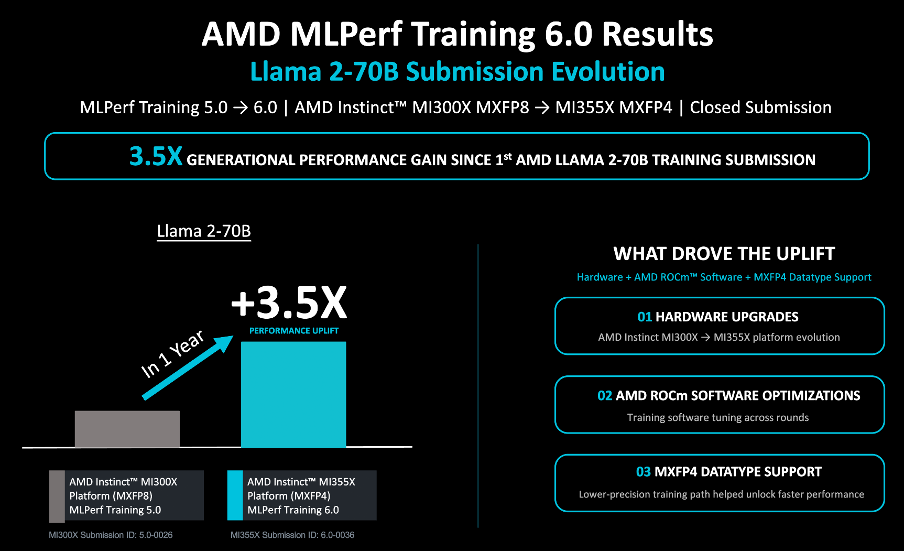
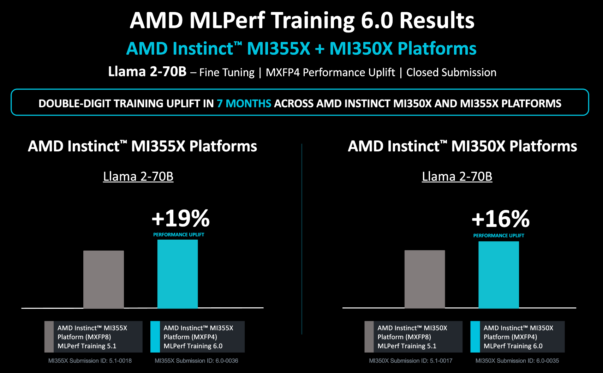
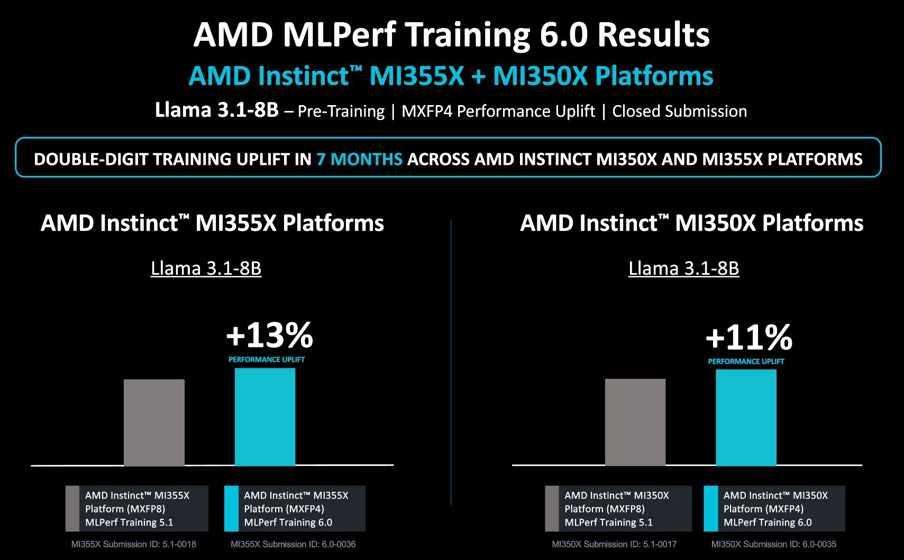
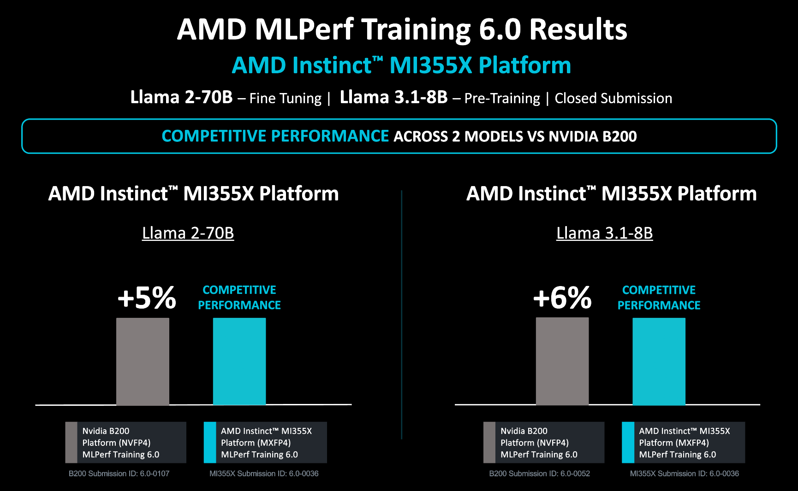
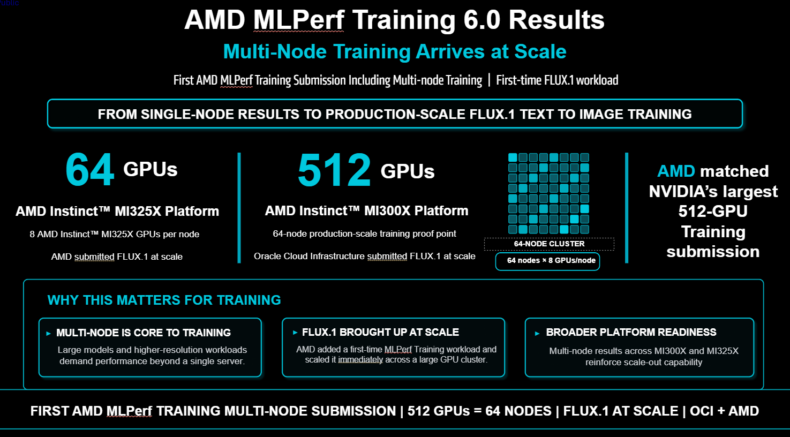

<!---
Copyright (c) 2026 Advanced Micro Devices, Inc. (AMD)

Permission is hereby granted, free of charge, to any person obtaining a copy
of this software and associated documentation files (the "Software"), to deal
in the Software without restriction, including without limitation the rights
to use, copy, modify, merge, publish, distribute, sublicense, and/or sell
copies of the Software, and to permit persons to whom the Software is
furnished to do so, subject to the following conditions:

The above copyright notice and this permission notice shall be included in all
copies or substantial portions of the Software.

THE SOFTWARE IS PROVIDED "AS IS", WITHOUT WARRANTY OF ANY KIND, EXPRESS OR
IMPLIED, INCLUDING BUT NOT LIMITED TO THE WARRANTIES OF MERCHANTABILITY,
FITNESS FOR A PARTICULAR PURPOSE AND NONINFRINGEMENT. IN NO EVENT SHALL THE
AUTHORS OR COPYRIGHT HOLDERS BE LIABLE FOR ANY CLAIM, DAMAGES OR OTHER
LIABILITY, WHETHER IN AN ACTION OF CONTRACT, TORT OR OTHERWISE, ARISING FROM,
OUT OF OR IN CONNECTION WITH THE SOFTWARE OR THE USE OR OTHER DEALINGS IN THE
SOFTWARE.
--->

# Technical Dive into AMD's MLPerf Training v6.0 Submission

AMD is proud to share its MLPerf Training v6.0 results, marking another step forward in our commitment to delivering competitive AI training performance using the latest AMD Instinct GPUs. This round covers three benchmarks — Llama 2 70B LoRA fine-tuning, Llama 3.1 8B pretraining, and Flux.1-schnell text-to-image pretraining — with AMD's own submissions spanning the MI325X, MI350X, and MI355X Instinct GPUs, alongside a large-scale 512-GPU MI300X submission from OCI in partnership with AMD.

MLPerf Training is the industry's most rigorous public benchmark suite for AI training workloads, covering a broad range of model architectures and use cases. Participation in each successive round allows AMD to demonstrate generational progress, validate our software stack under competitive scrutiny, and provide transparency to customers evaluating AI infrastructure options.

Three key milestones define this round:

- The debut of a production-ready **MXFP4 (FP4) training recipe** for the LLM benchmarks
- The first-ever use of AMD's **Primus** training framework in MLPerf Training submissions
- AMD's **first multi-node submissions**, marking a critical step toward large-scale training — the natural operating mode for production AI training workloads

Together, these milestones signal the growing maturity of AMD's training software stack and the readiness of the MI355X's native FP4 hardware for production-scale training. Furthermore, the multi-node results are particularly significant: AI training is inherently a cluster-scale problem, and demonstrating strong scaling beyond a single server is essential for credibility in this space. Details on how to reproduce the submission results by AMD can be found in the blog on [Reproducing AMD MLPerf Training v6.0 Submission Result](https://rocm.blogs.amd.com/artificial-intelligence/mlperf-training6.0-repro/README.html).

## Software Improvements

This submission round brings significant advances in our software stack. The two most important ones are:

- **Training Framework:** Primus, AMD's unified training framework, makes its MLPerf debut driving both LLM benchmarks — the clearest sign yet that AMD's training software is ready for production-grade workloads. The section below details how it does so.
- **Numerical precision:** while our previous submission used FP8 training, this round introduces a production-ready MXFP4 recipe as the lowest-precision compute path for both LLM benchmarks — the deepest reduced-precision training AMD has ever submitted. The recipe is described in [The MXFP4 Training Recipe section](#the-mxfp4-training-recipe) below.

## Primus: First Use in MLPerf Training Submissions

[Primus](https://github.com/AMD-AGI/Primus) is AMD's unified, modular training framework for large-scale foundation model training on AMD Instinct GPUs. It presents a single CLI and configuration system over multiple training backends — Megatron-LM, Megatron-Bridge, and TorchTitan — so the same workflow drives pretraining, post-training, and reinforcement learning without users having to manage each framework separately. This round's two LLM submissions exercise that design directly: Llama 3.1 8B pretraining runs on the Megatron-LM backend, while Llama 2 70B LoRA fine-tuning runs on the Megatron-Bridge backend, each from one configuration entry point.

Primus is part of a three-component ecosystem:

- **Primus** (Primus-LM): The unified training framework, providing workflow orchestration, the `primus-cli`, configuration templates, and ROCm-native backend integrations.
- **Primus-Turbo**: A high-performance acceleration library that delivers optimized GEMM, FlashAttention, and communication operators for Instinct GPUs via AITER, Composable Kernel, and ROCm Triton — without modifying framework source code.
- **Primus-SaFE**: A cluster management and fault tolerance layer that transforms a collection of AMD GPU servers into a resilient, self-monitoring training environment.

Driving two structurally different workloads — a fully MXFP4 Llama 3.1 8B dense model pretraining run and a Llama 2 70B LoRA fine-tuning run with a mid-training MXFP4-to-FP8 precision transition — through one framework demonstrates Primus's production readiness for large-scale training workloads on AMD hardware. In future rounds, AMD expects Primus coverage to extend further across an even broader set of benchmarks and workloads.

Customers and developers interested in evaluating Primus for their own workloads can access the GitHub repository at [github.com/AMD-AGI/Primus](https://github.com/AMD-AGI/Primus). The `rocm/primus` [Docker Hub registry](https://hub.docker.com/r/rocm/primus/tags) provides ready-to-use images covering PyTorch, Megatron-LM, Megatron-Bridge, and TorchTitan training environments.

## The MXFP4 Training Recipe

The MXFP4 (Microscaling FP4) training recipe leverages the native FP4
hardware on AMD Instinct MI355X GPUs to push training throughput beyond what
FP8 alone can deliver — approximately 2× the compute density of FP8 while
retaining enough dynamic range for stable training. Implemented as a
first-class precision mode in the ROCm Transformer Engine, it uses the OCP
Microscaling format: each data value is stored in E2M1 format (2-bit exponent,
1-bit mantissa), and groups of 32 contiguous elements share a single E8M0
scaling factor (8-bit exponent). This block-scaled design strikes a
fine-grained balance between compression and representational fidelity.

### Quantization Pipeline

The recipe configures quantization for all linear
layers in the transformer stack. The pipeline produces packed FP4 data (two
E2M1 values per byte) alongside E8M0 scales in both row-wise and column-wise
layouts, serving all three training GEMMs: the forward pass, the data gradient
(Dgrad), and the weight gradient (Wgrad). How this pipeline is applied —
including which GEMMs are active and how weights are cached or skipped — varies
by model and is detailed in the [Training Optimizations section](#training-optimizations) below.

Before quantization, a deterministic 16-point Hadamard rotation is applied to
each block of values. This rotation disperses outlier energy across dimensions,
reducing quantization distortion without altering the underlying computation —
the orthogonality of the Hadamard transform ensures exact cancellation across
the forward–backward cycle. The use of a deterministic rotation proved
essential: experiments showed that the weight gradient (Wgrad) quantization is
the dominant source of training instability, and that stochastic rounding or
randomized Hadamard transforms fail to stabilize the full pipeline.

### Fused Kernel Implementation

The entire quantization pipeline — Hadamard
rotation, scale computation, FP4 casting, byte packing, data shuffling, and
scale swizzling — is fused into a single HIP kernel launch. This eliminates
intermediate memory round-trips that would otherwise bottleneck the pipeline.
The resulting MXFP4 tensors are dispatched to AITER's hand-tuned ASM FP4×FP4
GEMM kernels, with per-model configurations loaded from pre-computed CSV files
to ensure optimal tile sizes and instruction scheduling for every matrix shape
encountered during training.

## Recipe-Specific Implementations: Llama 2 70B and Llama 3.1 8B

While both LLM models use the same MXFP4 quantization infrastructure in
Transformer Engine, their training recipes differ significantly: Llama 3.1 8B
trains end-to-end in MXFP4, whereas Llama 2 70B LoRA requires a mid-training
transition to FP8 to recover convergence.

### Llama 3.1 8B Pretraining

Llama 3.1 8B pretraining is the simpler of the two recipes: a single MXFP4
regime with deterministic Hadamard rotation enabled and no mid-training
precision transitions. Before the measured training begins, a warmup phase
using FP8 hybrid precision JIT-compiles all kernels; the model state is then
fully reset for a clean start. The transpose cache is enabled for this model,
keeping a precomputed weight transpose alongside the primary quantized data to
avoid recomputation during backward GEMMs.

### Llama 2 70B LoRA Fine-Tuning

The Llama 2 70B LoRA fine-tuning recipe is more involved because training in
MXFP4 alone does not converge to the MLPerf quality target. To recover the
required accuracy, the recipe uses a two-phase precision schedule with a
mid-training *healing* transition from MXFP4 to FP8. The full run proceeds as
follows:

1. **Synthetic warmup.** Before the measured run, a short synthetic warmup
   JIT-compiles all kernels, after which the model, optimizer, scheduler, and
   FP8/FP4 state are fully reset for a clean start.
2. **Pre-quantization.** On entry to the training loop, every Transformer
   Engine linear weight is quantized to MXFP4 on the GPU, while an FP8
   (E4M3) copy of each weight is stashed and pinned in CPU memory for later
   use during the healing phase.
3. **MXFP4 phase.** The model trains in MXFP4 — with block scaling and
   deterministic Hadamard rotation — through the compute-dominant portion of
   the run.
4. **Healing transition.** A single healing step restores the stashed FP8
   weights from CPU back to the GPU, switches the active recipe to FP8
   DelayedScaling (HYBRID format: E4M3 for the forward pass, E5M2 for the
   backward pass), and clears all MXFP4 metadata so that Transformer Engine
   re-initializes under the FP8 recipe.
5. **FP8 healing phase.** Training continues in FP8 for the remaining
   iterations (up to a 550-iteration cap), recovering the accuracy needed to
   reach the quality target.

Because base weights are frozen in LoRA, only the low-rank adapters are
updated — a property the recipe exploits to skip unnecessary work in the
quantization pipeline (see Training Optimizations below). The healing
transition itself is carefully sequenced to avoid GPU memory spikes, described in more detail below.

## Training Optimizations

### MXFP4 Precision Pipeline

The MI355X submissions use MXFP4 (E2M1) precision for all three linear
GEMMs in training: the forward pass, the data gradient (Dgrad), and the weight
gradient (Wgrad). Input activations and gradients are quantized on the fly
through a fused HIP kernel, while weights are quantized to MXFP4 once and
cached across forward calls to avoid redundant computation. For LoRA
fine-tuning, where the base model weights are frozen and no weight gradient is
needed, the weight quantization step is skipped entirely.

Beyond the core GEMM pipeline, several additional kernel-level optimizations
are applied to both LLM models:

- **Flash Attention v3** kernels (via AITER) for both forward and backward
  attention passes
- **Optimized ASM RoPE kernels** (via AITER), replacing Transformer Engine's
  native implementation
- **Fused SwiGLU activations** through Transformer Engine

### Llama 2 70B: Memory-Efficient Healing Transition

The Llama 2 70B recipe includes a "healing" phase that transitions from MXFP4
to FP8 precision. This transition is carefully sequenced to avoid GPU memory
spikes using a two-pass design:

1. All MXFP4 weights are unlinked and their GPU memory is freed
2. The stashed FP8 weights are streamed from CPU to GPU over a dedicated copy
   stream

This ensures that the two sets of weights are never co-resident on the GPU.
Notably, activation recomputation is not used in either phase of this
submission's recipe.

### Flux.1-schnell: Targeted Kernel and Graph Optimizations

The Flux.1-schnell image generation model benefits from a series of targeted
optimizations, each contributing measurable throughput gains:

- **torch.compile region fusion (+4.1%):** Compiling the double and
  single-block stacks as whole regions allows the compiler to fuse operations
  across blocks into fewer, larger kernels, reducing launch overhead.
- **CUDA graph capture and replay (+5.3%):** Capturing the full training
  iteration as a local CUDA graph and replaying it eliminates per-kernel CPU
  launch latency, which is particularly impactful for the many small DiT
  kernels in the model.
- **Custom HIP RMSNorm kernels (+28%, plus 3% from further tuning):**
  Replacing the default Triton-based RMSNorm with custom HIP kernels for both
  forward and backward passes yields the single largest improvement. Additional
  kernel tuning contributes a further 3% gain.
- **Optimized FP8 cast/transpose path (+0.5%):** Tuning the FP8 cast and
  transpose operations to use the fastest available kernel — via the custom
  implementation in ROCm Transformer Engine — adds a small but measurable
  improvement.

## Benchmark Results

MLPerf Training v6.0 results can be found [here](https://mlcommons.org/benchmarks/training/). The primary metric is time-to-train (TTT) in minutes.

### Performance Gains Since First MLPerf Training Submission

AMD submitted its first MLPerf Training results in the v5.0 round, published a
year ago in June 2025. That submission contained Llama 2 70B LoRA scores on
MI300X and MI325X Instinct GPUs. Compared to the MI300X score from that round,
current training performance on MI355X is **3.5× faster** — a remarkable
improvement over the span of just a single year. Three key factors drive this gain 
as illustrated in the figure below:

1. **MI355X hardware improvements**, including native FP4 compute and increased
   memory bandwidth
2. **AMD ROCm software optimizations**, with mature kernel libraries (AITER,
   Transformer Engine) and improved compiler support
3. **MXFP4 datatype support**, enabling 2× the compute density of FP8 while
   maintaining training stability

### Performance Gains Since Last Round

The previous round, [MLPerf Training v5.1](https://rocm.blogs.amd.com/artificial-intelligence/mlperf-training-v5.1/README.html), was published approximately seven
months ago. In that round, AMD submitted results for the Llama 2 70B LoRA and
Llama 3.1 8B benchmarks on four Instinct GPUs: MI300X, MI325X, MI350X, and
MI355X. Compared to those submissions, the scores for Llama 2 70B fine-tuning improved by **19%** on MI355X and **16%** on MI350X. The scores for Llama 3.1 8B pretraining improved by **13%** on MI355X and **11%** on the MI350X (see the figures below). The key drivers behind these gains were MXFP4 training recipes and additional GPU kernel optimizations.

### Llama 2 70B and Llama 3.1 8B Competitive Performance

The figure below shows competitive performance of AMD MI355X GPUs compared to NVIDIA B200 GPU for Llama 2 70B LoRA and Llama 3.1 8B pretraining. The results show that for both benchmarks, MI355X delivers performance very similar to the NVIDIA GPU system, with a difference being about 5%.

### Multi-Node Training for Flux.1-schnell

One of the highlights of this round of MLPerf Training is AMD embracing multi-node submissions. This is demonstrated in two submissions: AMD's own on 8 nodes of MI325X GPUs (64 GPUs total) and in collaboration with OCI on 64 nodes of MI300X GPUs (512 GPUs). These results demonstrate the scalability of AMD software stack and the ability to deliver efficient training at scale. The results from the collaboration with OCI are especially impressive due to the large scale, which equals the highest scale submitted for this benchmark in this round (see figure below).

## Summary

AMD's MLPerf Training v6.0 submission demonstrates continued progress across both hardware and software. On the hardware side, the CDNA4-generation MI355X delivers competitive time-to-train results against NVIDIA B200 on both single-node LLM benchmarks — Llama 2 70B LoRA fine-tuning and Llama 3.1 8B pretraining — at an iso-GPU count of 8, while the MI325X powers an 8-node Flux.1-schnell text-to-image submission. On the software side, this round marks the first MLPerf Training submission powered by Primus, AMD's unified training framework, used across both LLM benchmarks, alongside the debut of a production MXFP4 training recipe on the MI355X's native FP4 hardware. The combination of MXFP4 and FP8 precision with optimized ROCm kernel libraries delivers measurable improvements in training throughput on AMD Instinct hardware. AMD remains committed to transparent, round-over-round participation in MLPerf Training as a mechanism for publicly validating progress across both hardware generations and the broader ROCm software ecosystem. For instructions on how to reproduce the submission results by AMD, check out the blog [Reproducing AMD MLPerf Training v6.0 Submission Result](https://rocm.blogs.amd.com/artificial-intelligence/mlperf-training6.0-repro/README.html).

## Additional Resources 

1. [Cim, M., Palangappa, P., Hodak, M., Dwivedula, R., Arunachalam, M., & Kandemir, M. T. (2026). *Pretraining large language models with MXFP4 on native FP4 hardware*. arXiv.](https://arxiv.org/abs/2605.09825)
2. [Technical Dive into AMD MLPerf Training v5.1 Submission](https://rocm.blogs.amd.com/artificial-intelligence/mlperf-training-v5.1/README.html)
3. [AMD CDNA 4 Architecture Whitepaper](https://www.amd.com/content/dam/amd/en/documents/instinct-tech-docs/white-papers/amd-cdna-4-architecture-whitepaper.pdf)
4. [OCP Microscaling Formats (MX) v1.0 Specification](https://www.opencompute.org/documents/ocp-microscaling-formats-mx-v1-0-spec-final-pdf)

## Disclaimers

The information presented in this document is for informational purposes only and may contain technical inaccuracies, omissions, and typographical errors. The information contained herein is subject to change and may be rendered inaccurate for many reasons, including but not limited to product and roadmap changes, component and motherboard version changes, new model and/or product releases, product differences between differing manufacturers, software changes, BIOS flashes, firmware upgrades, or the like. Any computer system has risks of security vulnerabilities that cannot be completely prevented or mitigated. AMD assumes no obligation to update or otherwise correct or revise this information. 
However, AMD reserves the right to revise this information and to make changes from time to time to the content hereof without obligation of AMD to notify any person of such revisions or changes.
THIS INFORMATION IS PROVIDED ‘AS IS.” AMD MAKES NO REPRESENTATIONS OR WARRANTIES WITH RESPECT TO THE CONTENTS HEREOF AND ASSUMES NO RESPONSIBILITY FOR ANY INACCURACIES, ERRORS, OR OMISSIONS THAT MAY APPEAR IN THIS INFORMATION. AMD SPECIFICALLY DISCLAIMS ANY IMPLIED WARRANTIES OF NON-INFRINGEMENT, MERCHANTABILITY, OR FITNESS FOR ANY PARTICULAR PURPOSE. IN NO EVENT WILL AMD BE LIABLE TO ANY PERSON FOR ANY RELIANCE, DIRECT, INDIRECT, SPECIAL, OR OTHER CONSEQUENTIAL DAMAGES ARISING FROM THE USE OF ANY INFORMATION CONTAINED HEREIN, EVEN IF AMD IS EXPRESSLY ADVISED OF THE POSSIBILITY OF SUCH DAMAGES.
AMD, the AMD Arrow logo, ROCm, Instinct, and combinations thereof are trademarks of Advanced Micro Devices, Inc. Other product names used in this publication are for identification purposes only and may be trademarks of their respective companies.
© 2026 Advanced Micro Devices, Inc. All rights reserved
