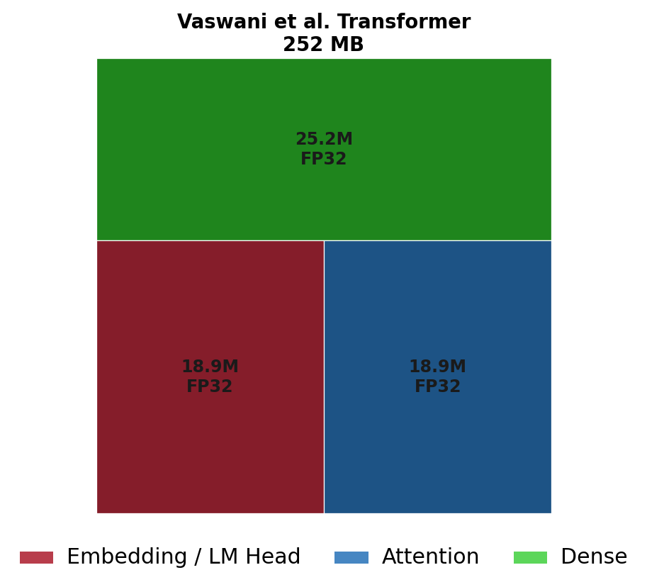
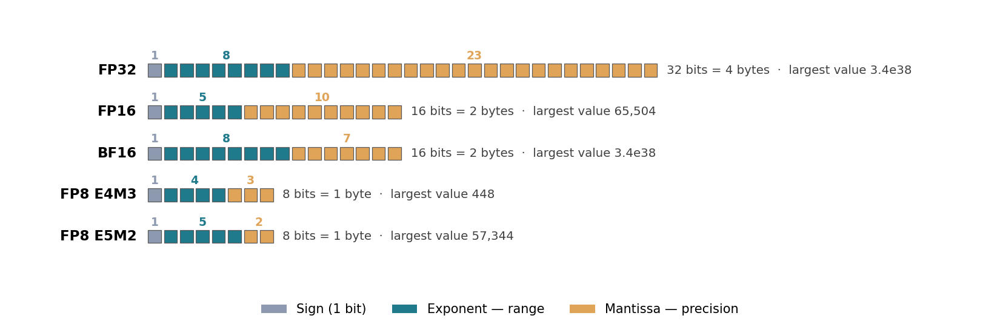
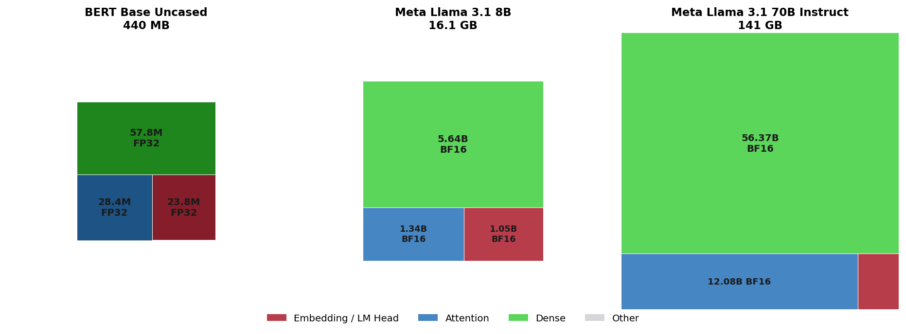
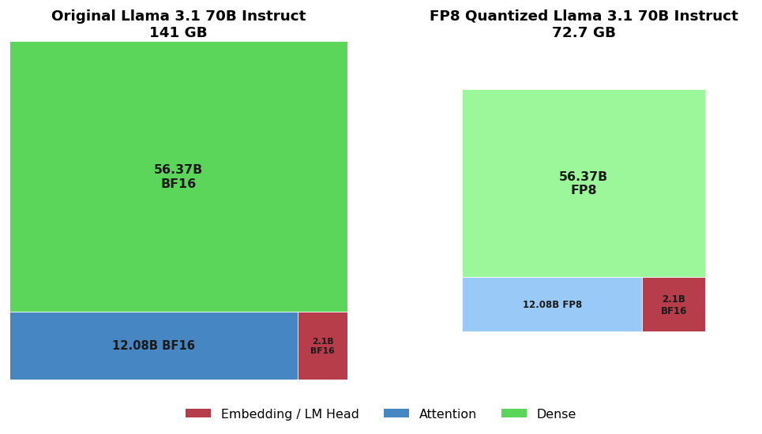
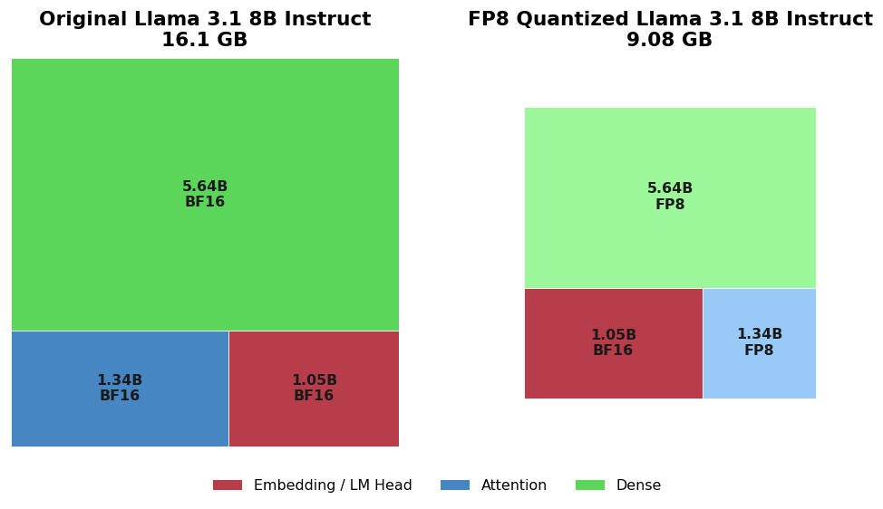
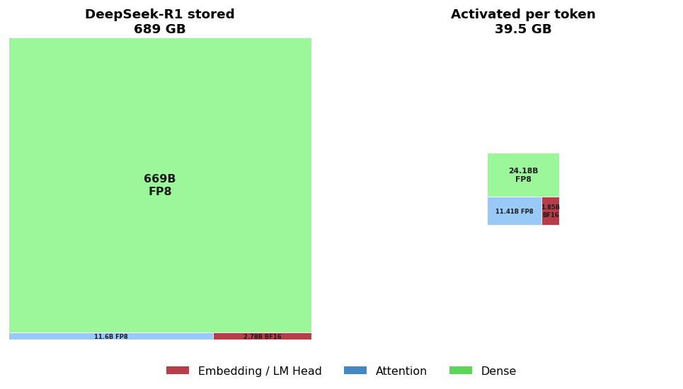
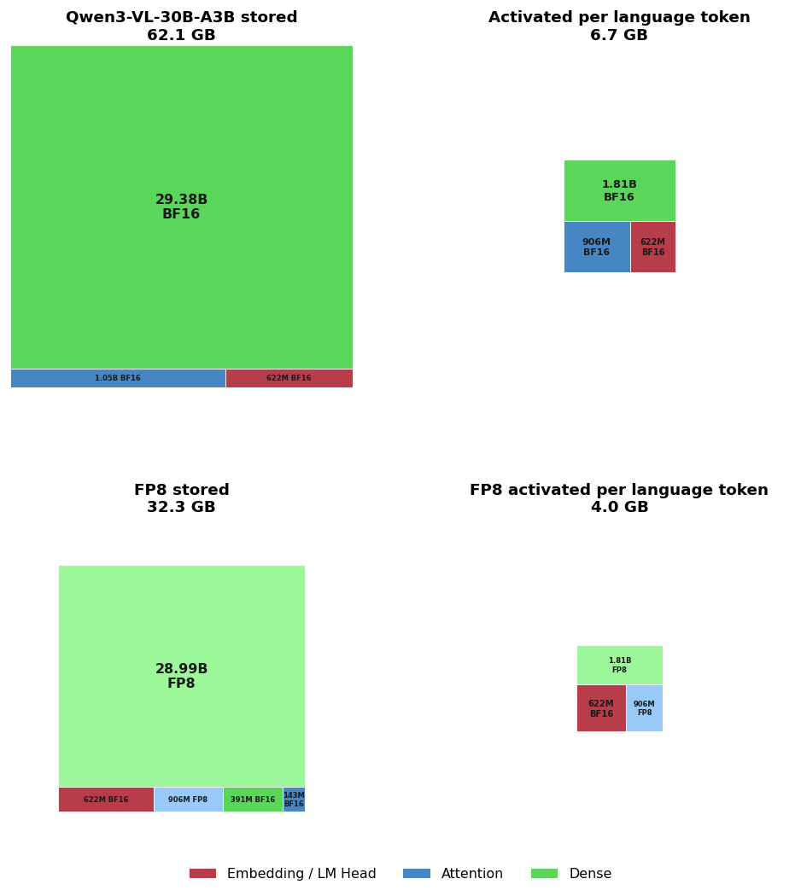

<!---
Copyright (c) 2026 Advanced Micro Devices, Inc. (AMD)

Permission is hereby granted, free of charge, to any person obtaining a copy
of this software and associated documentation files (the "Software"), to deal
in the Software without restriction, including without limitation the rights
to use, copy, modify, merge, publish, distribute, sublicense, and/or sell
copies of the Software, and to permit persons to whom the Software is
furnished to do so, subject to the following conditions:

The above copyright notice and this permission notice shall be included in all
copies or substantial portions of the Software.

THE SOFTWARE IS PROVIDED "AS IS", WITHOUT WARRANTY OF ANY KIND, EXPRESS OR
IMPLIED, INCLUDING BUT NOT LIMITED TO THE WARRANTIES OF MERCHANTABILITY,
FITNESS FOR A PARTICULAR PURPOSE AND NONINFRINGEMENT. IN NO EVENT SHALL THE
AUTHORS OR COPYRIGHT HOLDERS BE LIABLE FOR ANY CLAIM, DAMAGES OR OTHER
LIABILITY, WHETHER IN AN ACTION OF CONTRACT, TORT OR OTHERWISE, ARISING FROM,
OUT OF OR IN CONNECTION WITH THE SOFTWARE OR THE USE OR OTHER DEALINGS IN THE
SOFTWARE.
--->

# Model Weight Profiles: Where Do the Parameters Go?

This blog describes model weight profiles, which show how many model parameters are devoted to embeddings, attention, dense layers, and other components, and in which number formats.
That split can be used to calculate the total model size, the savings from a quantization recipe, and the size of a runtime cache such as the KV cache.

Many models include a total parameter count in their title or model card, and it is natural to turn that into an estimate for the size on disk.
For example, the [amd/Llama-3.1-8B-Instruct-FP8-KV](https://huggingface.co/amd/Llama-3.1-8B-Instruct-FP8-KV) model is a version of [Llama 3.1 8B](https://huggingface.co/unsloth/Meta-Llama-3.1-8B), quantized to FP8.
With eight billion parameters at one byte each, we might expect roughly 8 GB on disk.
However, the [model checkpoint](https://huggingface.co/amd/Llama-3.1-8B-Instruct-FP8-KV/tree/main) is actually 9.08 GB, because not all of the model is FP8.
[AMD Quark](https://quark.docs.amd.com/latest/) quantizes the linear layers but keeps the token embedding table and the LM head in BF16, so 1.05 billion parameters are still two-byte BF16, which accounts for the difference.

The model weight profiles we introduce in this blog provide the extra detail needed to explain discrepancies like this.
Most parameters fall into a few families: embeddings, dense layers, attention, and convolutions.
A weight profile measures how much of a model goes to each.
This matters more as lower-bit formats spread, because recipes like [W4A8 for Kimi-K2.5](https://rocm.blogs.amd.com/artificial-intelligence/kimi-k2.5-w4a8/README.html) or [MXFP4 for image generation](https://rocm.blogs.amd.com/artificial-intelligence/quark-xdit/README.html) compress some families and leave others alone.

## Anatomy of Simple LLMs

This section introduces the three weight families that most language models today are made of, and what each family is used for.
The diagram below traces four tokens left to right through a single block: embeddings in red, attention in blue, dense layers in green.


### Embeddings

Embeddings turn each token into a row of numbers.
Llama 3.1 has 128,256 tokens and stores 4,096 numbers for each of them, so reading "The cat sat" starts with three row lookups in a 128,256 × 4,096 table:

| Token | Token index | Embedding vector |
| --- | --- | --- |
| The | 791 | 0.00027, -0.00340, -0.00064, -0.00806, … |
| cat | 4719 | -0.00873, 0.00230, -0.00552, 0.00977, … |
| sat | 37568 | -0.00568, -0.00294, 0.01544, 0.00537, … |

Those are decimal renderings of the actual numbers, stored as BF16 in [amd/Llama-3.1-8B-Instruct-FP8-KV](https://huggingface.co/amd/Llama-3.1-8B-Instruct-FP8-KV), where they match [unsloth/Meta-Llama-3.1-8B-Instruct](https://huggingface.co/unsloth/Meta-Llama-3.1-8B-Instruct) bit for bit.

Word vectors go back at least to information retrieval in the 1970s, where the vector coordinates were just weighted counts of how often each term appeared in each document.
By the late 1980s, techniques like [latent semantic analysis](https://en.wikipedia.org/wiki/Latent_semantic_analysis) compressed this space to a few hundred dimensions, treating word meanings as geometric vectors.
In the early 2010s, systems like [word2vec](https://arxiv.org/abs/1301.3781) and [fastText](https://arxiv.org/abs/1607.04606) learned those vectors with neural networks, and today these neural vocabulary vectors are usually called embeddings.

The LM head at the far right of the diagram runs the mapping backwards, turning embedding vectors back into scores over the vocabulary.
Those scores are then passed through a [softmax](https://en.wikipedia.org/wiki/Softmax_function) to estimate a probability for each possible next token.

### Dense Layers

Dense layers are the ordinary neural network part and have collected the most names: linear layer, fully connected layer, feed-forward network (FFN), multi-layer perceptron (MLP).
For profiling purposes these are one family: full matrices that join every input number to every output number.
The names differ mostly over how many of those matrices are stacked and what sits between them.
This is the family [backpropagation](https://doi.org/10.1038/323533a0) was introduced to train in the 1980s, and the one GPUs later made practical at billions of parameters.
It is also the family most often quantized to fewer bits, and the one Mixture of Experts models copy into parallel experts ([GPTQ](https://arxiv.org/abs/2210.17323); [Hugging Face on MoE](https://huggingface.co/blog/moe)).

### Attention Layers

Attention lets each token gather information from the surrounding tokens, instead of being transformed on its own.
That is how the model processes *cat* in position 2 differently from *cat* in position 6, and so tells *The cat sat on the child* from *The child sat on the cat*.

Attention weights project every token vector into a query, a key, and a value: queries and keys encode both content and position and are matched to score how relevant one token is to another. Then each token takes a weighted mixture of the most relevant values.
That mechanism outperformed the recurrent and convolutional models that dominated language and sequence tasks before it (see [Dive into Deep Learning](https://d2l.ai/chapter_attention-mechanisms-and-transformers/self-attention-and-positional-encoding.html#comparing-cnns-rnns-and-self-attention)).

## The Original Transformer Example — Attention is 30% of What You Need

Using those three families, we can draw a model profile for the original Transformer from [Attention Is All You Need](https://arxiv.org/abs/1706.03762) — a 2017 English-to-German translation model that jumped well ahead of what had come before, and whose layout has been the template for language models ever since.

The model weight profile can be worked out from details given in the paper.
<details>
<summary>Dimensions of the original transformer</summary>

- Six layers read the English sentence and six write the German one.
- Every one of those layers is attention followed by a dense block, so the two families alternate all the way up.
- Tokens stay 512 numbers wide from layer to layer, widening to 2,048 inside each dense block before coming back to 512.
- One vocabulary of about 37,000 word pieces is shared between the two languages.
- Attention is divided into eight heads, which do not add eight copies of the weights: each head projects into a 64-dimensional slice ($512/8$), and the eight slices are concatenated back to 512, the same parameter count as four square $512 \times 512$ matrices for Q, K, V, and O.

</details>

| Family | Parameters | FP32 size | Calculation Details |
| --- | --- | --- | --- |
| Embeddings | 18.9M | 75.8 MB | 37,000 tokens × 512, one matrix shared by both encoders and the output layer |
| Attention | 18.9M | 75.5 MB | 18 blocks (6 encoder, 6 decoder, 6 cross) × 4 matrices (Q, K, V, O) of 512 × 512 |
| Dense | 25.2M | 100.8 MB | 12 blocks × 2 matrices of 512 × 2048 |
| Norms | 0.03M | 0.1 MB | 30 layer norms of 2 × 512 |
| Total | 63.0M | 252 MB | |

Drawn to scale, the table leads to the following model weight profile diagram:



Dense layers take 40% of the weights, with embeddings and attention on roughly 30% each.
The paper is named for attention, but embeddings and dense layers together contain 70% of its weights.

The other parameters (the “Norms” row from the table above) make too small a contribution to see at this scale.
For ease of presentation, each treemap in this blog leaves out similar remainders — normalizations, biases, and in the vision models a little convolution.
These contributions stay under three percent in all of these models.

## Floating Point Number Formats

Every weight in the original transformer profile is FP32, four bytes each, which was the ordinary choice in 2017.
At 63M parameters, four bytes each comes to 252 MB.
DeepSeek-R1 has 685B parameters: four bytes each would be 2.7 TB, more than most machines can hold.
Models at that scale work by storing most of the weights in leaner formats.

In standard formats, a floating-point number divides its bits three ways.
One bit carries the sign, the exponent bits set the range of magnitudes the format can reach, and the mantissa bits set how finely it can separate values within that range.
Shrinking a format means taking bits from the exponent, the mantissa, or both, and the alternatives to FP32 differ mainly in which of the two they protect.



BF16 keeps all eight of FP32's exponent bits and spends the savings on the mantissa, so it reaches the same magnitudes with coarser steps between them, and converting from FP32 costs precision without risking overflow.
FP16 makes the opposite choice, holding more mantissa within a range that stops at 65,504, which is why training in FP16 usually needs loss scaling to keep small values from vanishing.
The two FP8 formats come from the same argument applied at one byte, proposed together in [FP8 Formats for Deep Learning](https://arxiv.org/abs/2209.05433): `E4M3` holds an extra mantissa bit for weights and activations, and `E5M2` holds an extra exponent bit for gradients, whose magnitudes vary far more widely.

Embedding precision is usually kept.
[Quantization of generative language models](https://aclanthology.org/2022.acl-long.331/) found that reduced precision made word embeddings less distinguishable from one another, and recovered the loss with row-wise quantization and contrastive distillation.
Embeddings spend their precision separating thousands of vocabulary entries that differ only slightly, so recipes leave that family wider and round dense and attention weights down to FP8.

The treemaps in the rest of this post use shade for the number format, palest for FP8, mid-tone for BF16 and FP16, and darkest for FP32.
A pale block is a family that a quantization recipe converted; a dark block sitting next to it is one that the same recipe left as it found it.

## Larger LLMs and Quantization

The transformer has been such a successful architecture that LLMs are still mainly built using embeddings, dense layers, and attention.
On [Hugging Face](https://huggingface.co/models), useful metadata may appear on the model card, but detailed tensor metadata usually comes from the JSON header at the beginning of each Safetensors shard.
These headers record every tensor's name, shape, dtype, and byte offsets, which is enough to count the weights in each family.
That is how the rest of the examples below were built (though the attribute schemas are not yet uniform enough for one recipe to fit every model).

The diagram below shows model weight profiles for three language models:
[BERT base](https://huggingface.co/google-bert/bert-base-uncased) from 2018, at 110M parameters in FP32,
and [Llama 3.1 8B](https://huggingface.co/meta-llama/Llama-3.1-8B) and [Llama 3.1 70B Instruct](https://huggingface.co/meta-llama/Llama-3.1-70B-Instruct) from 2024,
both using BF16 parameters.



The footprint of the dense layers grows from 53% of BERT to 70% of the Llama 8B model and 80% of Llama 70B, and embeddings shrink from 22% to 13% to 3%.
The reason is that an embedding table costs vocabulary × width, which grows only as fast as the width, while each layer costs a multiple of width squared, and models have become both deeper and wider.
Attention falls from 26% of BERT to roughly 17% in both Llama models.

That trend influences what quantization methods can accomplish.
[AMD Quark](https://quark.docs.amd.com/latest/) is the toolkit that produced the FP8 Llama checkpoints in this section: it quantizes models for Instinct GPUs, including FP8 weights, activations, and KV cache, and [this tutorial](https://rocm.docs.amd.com/projects/ai-developer-hub/en/latest/notebooks/gpu_dev_optimize/fp8_quantization_quark_vllm.html) walks Llama 3.1 8B from Quark into vLLM.
A typical recipe leaves the embeddings and LM head in BF16, so those are the parameters a weight-only FP8 pass cannot halve.

The diagram below draws both checkpoints at the same scale, so the area that vanishes is the space saved.
Dense and attention turn pale as they drop to FP8, while the embedding block stays BF16 and takes up exactly the same area in each panel.



At 70B the [FP8 checkpoint](https://huggingface.co/amd/Llama-3.1-70B-Instruct-FP8-KV) is 72.7 GB, which compared with the original 141 GB is a compression factor of 1.94.
This is because the 4.2 GB of BF16 embeddings, which are unchanged, account for only 3% of the model.

The diagram below shows the same contrast for the Llama 3.1 8B model:



Using the same Quark recipe on 8B reduces 16.1 GB to 9.08 GB, a factor of only 1.77, because this time the unchanged BF16 embeddings are 13% of the parameters, and nearly a quarter of the quantized file.
Using the same recipe on the same hardware can have a different payoff, entirely because of the weight profile.

## Mixture of Experts — Stored and Activated Profiles

A Mixture of Experts (MoE) is a way of training bigger models more cheaply, and of running inference faster, by using only the most relevant parts of each dense layer for each token.
Those parts are extra copies of the dense block, called experts; only a few of them are used for any particular token, but all of them still have to be stored and loaded, so these models get two diagrams: everything stored, and the much smaller amount used per token.
The [Hugging Face explainer](https://huggingface.co/blog/moe) covers the motivation, history, and implementation of MoE models in more detail.

For example, [DeepSeek-R1](https://huggingface.co/deepseek-ai/DeepSeek-R1) is a large Mixture of Experts, already released in FP8, with the embeddings and LM head left in BF16.
The two diagrams below compare everything stored with the much smaller profile activated for a token during standard decoding.



In the stored profile (left), dense layers account for 97% of the bytes, and the other families are slivers by comparison.
The activated profile (right) returns to something close to the dense models above: dense 61%, attention 29%, and embeddings 9% of its memory.
The main model's expert pool has to be available in memory because any expert might be the one a token needs.
The checkpoint also stores an optional Multi-Token Prediction layer for speculative decoding, which a standard decoder can leave unloaded.
Only 39.5 GB participates in the arithmetic for a token on that path, and this activated profile has more direct influence on how fast the model runs.

## Mixture of Experts and Quantization Together

In this last example, we analyze the model weight profiles for [Qwen3-VL-30B-A3B-Instruct](https://huggingface.co/Qwen/Qwen3-VL-30B-A3B-Instruct), a popular Mixture of Experts model.
It is published in BF16 and FP8, and we can compare stored, language-token, and quantized profiles in the same picture below:



The BF16 model stores 62.1 GB and uses 6.7 GB of that for a language token.
Quantizing to [FP8](https://huggingface.co/Qwen/Qwen3-VL-30B-A3B-Instruct-FP8) reduces those numbers to 32.3 GB stored and 4.0 GB per language token.

This multimodal model combines a language stack split into 128 experts with a dense vision encoder, which is used in full for each image.
The FP8 model quantizes the language attention and expert weights, while the token embeddings and language-model head, MoE router, normalization weights, and vision encoder remain BF16 (including its patch-embedding convolution and positional embeddings).
A further 1.8M F32 scale values are used to rescale blocks of quantized expert and attention weights, contributing to the quite complicated [model weight profile](./src/qwen3_vl_30b_a3b_instruct_fp8.profile.yaml).

The retained BF16 weights occupy 2.4 GB, or 7% of the stored FP8 model.
The 1.24 GB embedding and LM head then account for 31% of the 4.0 GB used for a language token.
Only eight of the 128 experts are selected per token, reducing 29.0B stored expert parameters to 1.81B active parameters.

As quantization and expert routing successively reduce the other weights, the unchanged embeddings become a larger share of what remains.
This is a good example of what some architectural complexity and attention to numerical detail achieve: a much larger multimodal model whose per-token weight distribution resembles Llama 3.1 8B, but with a smaller activated-weight footprint.

## How These Examples Were Built

The profiles in this blog were inferred from Hugging Face tensor names and dtypes, which works often enough to be useful, though not yet reliable in general.
[Kaggle Models](https://github.com/Kaggle/kaggle-cli/blob/main/docs/models_metadata.md) already separates the card from structured metadata for each variation, covering framework, provenance, license, and training data.
The llama.cpp [GGUF specification](https://github.com/ggml-org/ggml/blob/master/docs/gguf.md) goes further inside the file, recording architecture, context length, embedding and feed-forward widths, layer and attention-head counts, quantization details, and tensor descriptors.

### Gathering Metadata from Hugging Face

[Safetensors](https://huggingface.co/docs/safetensors) is Hugging Face's 2022 format for storing model weights, and it is now the usual checkpoint format on the Hub.
Each Safetensors shard begins with a JSON header that explicitly records every tensor's name, shape, dtype, and byte offsets.
The [metadata example](./src/fetch_hub_metadata.py) reads these headers through the Hugging Face API and multiplies each tensor's shape dimensions to count its parameters, without downloading the tensor values.
The [family profiler](./src/family_profile.py) then uses tensor names to count embeddings, attention, dense layers, and everything else.
Its short rules reproduce the BERT example above.
The [profile builder](./src/build_profiles.py) uses table-driven rules and pinned Hub revisions to regenerate exactly the ten YAML profiles in this blog.
The [regression tests](./src/test_build_profiles.py) rebuild all ten profiles and compare every field with the committed files:

```bash
cd blogs/artificial-intelligence/model-weight-profiles/src
python build_profiles.py --check
python -m unittest -v test_build_profiles.py
```

### Target Schema

Each profile records the model ID, relevant architecture settings, and sources, followed by a `stored_params` view and, for MoE models, an `activated_params` view.
Each view gives its total parameter and byte counts, divides them into families, and then keeps the contributing tensor groups with their dtype and shape.

For example, this is the entry for the embedding family from the Llama 3.1 8B profile:

```yaml
embedding:
  parameters: 1050673152
  bytes: 2101346304
  param_groups:
    token_embeddings:
      parameters: 525336576
      dtype: BF16
      tensor_shape: [128256, 4096]
    lm_head:
      parameters: 525336576
      dtype: BF16
      tensor_shape: [128256, 4096]
```

Each group is a vocabulary of 128,256 tokens by a width of 4,096, one matrix going in and another coming out, and Llama 3.1 keeps them as separate copies rather than reusing one for both.

The YAML files used for the figures in this post are in this blog's [`src/`](./src/) folder: the original transformer, BERT, Llama 3.1 8B and 70B (BF16 and FP8), DeepSeek-R1, and Qwen3-VL-30B-A3B (BF16 and FP8).
DeepSeek-R1's profile is about 6 KB; the checkpoint it describes is 689 GB.
A short record of families, counts, and dtypes is enough to say what to expect from a large model — how much will sit in memory, which families a quantization recipe can touch, and how an MoE's stored and activated sizes come apart.

### Profile Drawing

The [drawing example](./src/draw_treemap.py) makes a stored-weight treemap from one of those YAML profiles.
Rectangle area represents bytes, color represents weight family, and shade represents dtype.
The layout comes from the Python [squarify](https://github.com/laserson/squarify) implementation of the squarified treemap algorithm; Matplotlib draws the rectangles, labels, and figure.

## Runtime Memory Beyond the Weights

Everything so far has been an inventory of what a checkpoint contains.
Once the model is actually running, many other factors come into play: as a server such as [vLLM](https://docs.vllm.ai/) comes up, weights are fused, sliced across GPUs, and retiled for the kernels, while the server selects kernels and graphs for the prompt lengths and batch sizes it expects to serve.

The largest use of GPU memory after the weights are loaded is usually the KV cache, which holds exactly the keys and values from the attention section above — one of each, per token, per layer, kept rather than recomputed.
The KV cache is what makes long prompts answerable at speed: it remembers what each layer already worked out about the tokens seen so far, so a new token does not send the model back over the whole prompt again.
[Pope et al. (2022)](https://arxiv.org/abs/2211.05102) treat that cache as a central memory and bandwidth cost of large-scale transformer inference, and show how multi-query attention and partitioning support longer contexts.

KV caches naturally grow with every token in every conversation being held open, and we can use model profile data to estimate how much memory each token uses.
In Llama 3.1 8B, a token arrives as a vector of 4,096 numbers, and each attention layer projects it into queries, keys, and values.
The queries use all 4,096, split into 32 heads of 128, but the keys and values are deliberately narrower: 8 heads of 128, or 1,024 numbers each.
This is [grouped-query attention](https://arxiv.org/abs/2305.13245), where each key-value head is shared by four query heads, and it is the `k_proj` and `v_proj` shapes of $1024 \times 4096$ in the [Llama 3.1 8B profile](./src/llama_3_1_8b_instruct.profile.yaml), next to $4096 \times 4096$ for `q_proj`.
The cache keeps the keys and values, not the queries, so a token leaves behind 1,024 numbers of key and 1,024 of value in each layer.
At two bytes each, that is 4 KB per layer, and Llama 3.1 8B has 32 of them, so a single token costs 128 KB.
A conversation of 10,000 tokens therefore holds about 1.3 GB of cache, and twelve such conversations take as much memory as the BF16 weights themselves: 16.1 GB.

Because that total moves with the traffic, allocation becomes a serving problem in its own right: [PagedAttention](https://arxiv.org/abs/2309.06180), the mechanism behind vLLM, divides each request's cache into blocks that can be placed, shared, and reclaimed without needing contiguous memory.
It matters most for agents that repeatedly revisit earlier context, the subject of AMD's work on [agentic serving with Moonshot AI](https://www.amd.com/en/developer/resources/technical-articles/2026/rebuilding-agentic-ai-for-amd-gpu.html) and [KV-cache management with Tensormesh](https://www.tensormesh.ai/blog-posts/tensormesh-and-amd-collaborate-to-empower-fewer-gpus-to-serve-more-models-2).

Runtime gets more complicated from here, with activations, arithmetic precision, memory bandwidth, communication, and kernel layout all contributing to how the system performs.
Although the diagrams barely show this runtime profile, the KV example demonstrates one way the data can be used: layer count, key-value head count, head width, and dtype are enough to predict the cache required per token.

## Summary

Model weight profiles turn a headline parameter count into a map of what the model contains.
They show which families set the memory footprint, how much a quantization recipe can save, and why an MoE has different stored and activated sizes.

Get to know the profile of any model you work with.
Knowing where its parameters sit tells you whether it will fit, which families a quantization recipe can reach, and what the cache will cost per token, before you start a job that finds out the hard way.
The scripts in [`src/`](./src/) built the profiles in this post from Hub files in seconds.
They know the layouts used here; a model with a different layout will need different parsing code.

A model card that declared families, parameter counts, precisions, and the few architecture fields needed for runtime estimates would make these questions routine instead of requiring a reconstruction.
As models evolve through new architectures, numerical formats, and serving techniques, this detail becomes especially valuable.
This post has shown how a profile can give useful insight on a handful of models.
You can apply the same approach to the models you work with, and over time model weight profiles will be used systematically across the field.

## Additional Resources

### Parameter Families and Key Experiments

[Bogoychev (2021)](https://aclanthology.org/2021.blackboxnlp-1.28/) divides transformer parameters into the same three families used here — embeddings, attention, and feed-forward layers — and tests each family separately.
The experiments show why both parts of a profile matter: feed-forward layers contain considerably more parameters than attention, while training either family can be equally important to the resulting model.
[Chung et al. (2021)](https://arxiv.org/abs/2010.12821) focus on the embedding family, shrinking a multilingual BERT's input embeddings and reinvesting the 77M parameters saved in wider or deeper transformer layers.
[Q-BERT](https://arxiv.org/abs/1909.05840) found embeddings more sensitive than transformer layers to naive low-bit quantization: four-bit embeddings caused large accuracy losses, although group-wise mixed precision reduced the loss to about 0.5%.

### Other Number Systems

The profiles in this post use real floating-point weights, from FP32 down to FP8.
That is one choice among several: [Real, Complex, and Binary Semantic Vectors](https://www.researchgate.net/publication/262251483_Real_Complex_and_Binary_Semantic_Vectors) compared those three number systems and their respective prevalence in statistics, physics, and computer science.

Work at fewer than eight bits is active.
[BitNet](https://arxiv.org/abs/2402.17764) trains ternary weights in $\{-1, 0, 1\}$, about 1.58 bits each.
[iFairy](https://arxiv.org/abs/2508.05571) stores 2-bit complex weights in $\{\pm 1, \pm i\}$.
Neither appears in the treemaps here.

Complex numbers also appear in current models without a complex weight format.
[RoPE](https://arxiv.org/abs/2104.09864) rotates adjacent pairs of numbers as if they were a complex plane, so relative position is a product of phases, while the stored weights remain ordinary real tensors.

## Disclaimers

The information presented in this document is for informational purposes only and may contain technical inaccuracies, omissions, and typographical errors. The information contained herein is subject to change and may be rendered inaccurate for many reasons, including but not limited to product and roadmap changes, component and motherboard version changes, new model and/or product releases, product differences between differing manufacturers, software changes, BIOS flashes, firmware upgrades, or the like. Any computer system has risks of security vulnerabilities that cannot be completely prevented or mitigated. AMD assumes no obligation to update or otherwise correct or revise this information.
However, AMD reserves the right to revise this information and to make changes from time to time to the content hereof without obligation of AMD to notify any person of such revisions or changes.
THIS INFORMATION IS PROVIDED ‘AS IS.” AMD MAKES NO REPRESENTATIONS OR WARRANTIES WITH RESPECT TO THE CONTENTS HEREOF AND ASSUMES NO RESPONSIBILITY FOR ANY INACCURACIES, ERRORS, OR OMISSIONS THAT MAY APPEAR IN THIS INFORMATION. AMD SPECIFICALLY DISCLAIMS ANY IMPLIED WARRANTIES OF NON-INFRINGEMENT, MERCHANTABILITY, OR FITNESS FOR ANY PARTICULAR PURPOSE. IN NO EVENT WILL AMD BE LIABLE TO ANY PERSON FOR ANY RELIANCE, DIRECT, INDIRECT, SPECIAL, OR OTHER CONSEQUENTIAL DAMAGES ARISING FROM THE USE OF ANY INFORMATION CONTAINED HEREIN, EVEN IF AMD IS EXPRESSLY ADVISED OF THE POSSIBILITY OF SUCH DAMAGES.
AMD, the AMD Arrow logo, AMD Instinct, AMD ROCm, and combinations thereof are trademarks of Advanced Micro Devices, Inc. Other product names used in this publication are for identification purposes only and may be trademarks of their respective companies.
© 2026 Advanced Micro Devices, Inc. All rights reserved.
