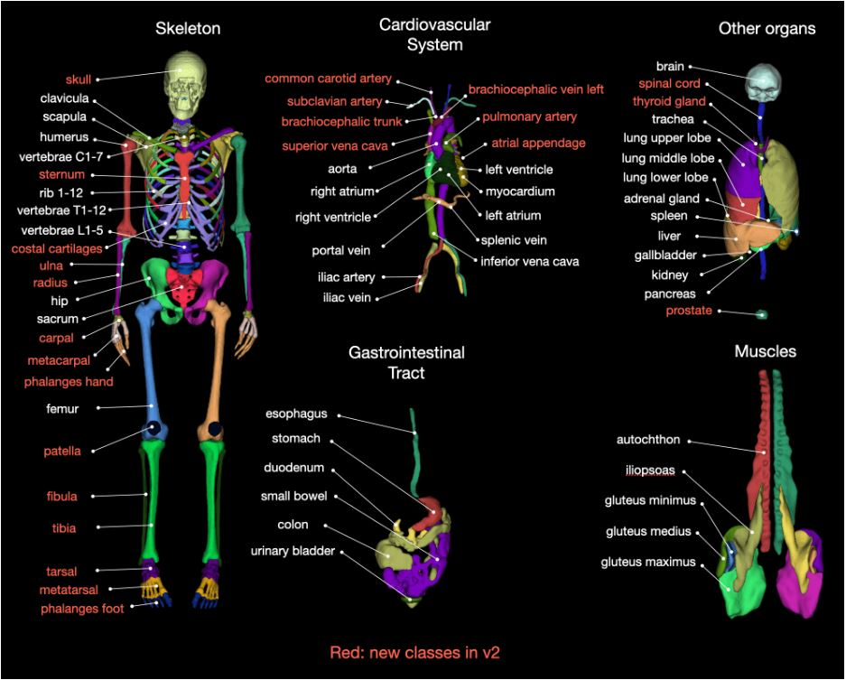
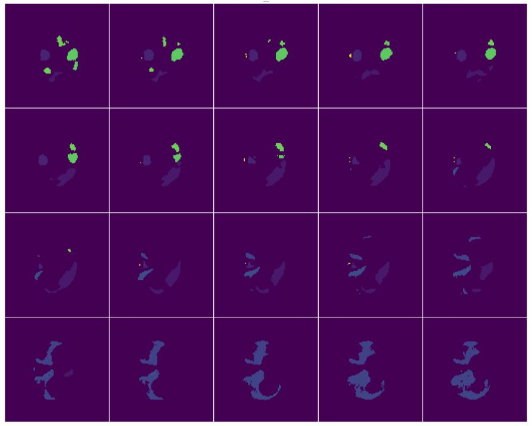

# Total body segmentation using MONAI Deploy on an AMD GPU

Medical Open Network for Artificial Intelligence (MONAI) is an open-source organization that provides
PyTorch implementation of state-of-the-art medical imaging models, ranging from classification and
segmentation to image generation. Catering to the needs of researchers, clinicians, and fellow domain
contributors, MONAI's lifecycle provides three different end-to-end workflow tools: MONAI Core,
MONAI Label, and MONAI Deploy.

MONAI Core provides models that can be used for end-to-end training and inferencing. MONAI Label
is an intelligent tool that automates dataset labelling based on user interactions. MONAI Deploy is a
packaging tool that provides CLI commands (`monai-deploy exec`, `monai-deploy package`) to deploy
production-ready AI applications. Moreover, it allows your application to be composed into a
MAP/Docker image that can be run using the `monai-deploy run` command. MONAI Deploy provides
[packaged example applications](https://github.com/Project-MONAI/monai-deploy-app-sdk/tree/main/examples/apps)
(such as spleen segmentation and breast density classification).

As explained in
[MONAI's tutorial](https://colab.research.google.com/github/Project-MONAI/monai-bootcamp/blob/main/MONAIDeploy/01_segmentation_app.ipynb#scrollTo=VH19gqwt2JF2),
creating an application/SDK requires us to define a set of
[operators](https://github.com/Project-MONAI/monai-deploy-app-sdk/blob/v0.5.1/monai/deploy/core/operator.py#L26)
that will be carried out sequentially. An operator is a unit of work in an application and can have many
virtual input/output ports. Each port enables the progression of the application by passing the output
of the previous operator's output port to the current operator's input port. For example, the official
tutorial for the
[Spleen Segmentation application](https://github.com/Project-MONAI/monai-deploy-app-sdk/tree/main/examples/apps/ai_spleen_seg_app)
uses five pre-defined operators:

* **DICOMDataLoaderOperator**: Loads DICOM (standard medical volume storage format) studies
  from ```.dcm``` files from the input folder.
* **DICOMSeriesSelectorOperator**: Loads a particular data series from each DICOM study based on
  a rule set. The rule set used in this example uses a regular expression that filters out CT files from
  each study. Alternatively, we can also add multiple conditions, for example: `Spleen & CT 1` for first
  condition and `Abdomen & CT 2` for second condition, as shown [here](https://github.com/Project-MONAI/monai-deploy-app-sdk/blob/v0.5.1/monai/deploy/operators/dicom_series_selector_operator.py#L48).

    ```text
    {
    "selections": [

        {
            "name": "CT Series",
            "conditions": {
                "StudyDescription": "(.*?)",
                "Modality": "(?i)CT",
                "SeriesDescription": "(.*?)"
            }
        }
    ]
    }
    ```

* **DICOMSeriesToVolumeOperator**: Converts a DICOM instance to a NumPy array for further
  processing.
* **MonaiBundleInferenceOperator**: The AI operator loads a generic TorchScript model, selects the
  device, performs input pre-processing, and output post-processing. The `model.ts` bundle in the data
  folder is used to load the model of interest, and is passed in the
  `model-deploy exec -m model.ts -i dcm -o output` command.
  This operator is typically generic to any MONAI bundle and adapts to different config parameters,
  such as input transformations, data type, input parameters, and model inference (as defined in
  `bundle('model/extra/metadata.json'. Warning - Do not change the bundle name to anything other
  than model.ts. Doing so, may result in errors while reading the metadata config file)`).
* **DICOMSegmentationWriterOperator**: The binary-per-pixel output of the AI model is
  processed by this operator to generate the predicted segmented spleen. It's later converted to a
  DICOM instance and saved to disk.

In this blog, we go through MONAI Deploy for a total body segmentation example using NIfTI
volumes. Existing examples use operators that explore DICOM data and metadata, and don't easily
integrate with NIfTI data. This blog serves as a starter for writing custom operators for NIfTI data.

You can find files related to this blog post in this [GitHub folder](.).

## Implementation

To follow along with this blog, you'll need to:

* Install ROCm-based `torch` and `torchvision`. This experiment was carried out on ROCm 5.7.0. Refer to
  the [system requirements](https://rocm.docs.amd.com/projects/install-on-linux/en/latest/reference/system-requirements.html)
  for hardware and OS support.

  ```bash
  pip install torch==2.0.1 torchvision==0.15.2 -f https://repo.radeon.com/rocm/manylinux/rocm-rel-5.7/
  ```

* Install the MONAI Deploy App SDK 0.5.1 binary. This helps launch applications using commands
  such as `monai-deploy run` and `monai-deploy package`

  ```bash
  pip install monai-deploy-app-sdk==0.5.1
  ```

* Download a single test subject for inferencing from
  [zenodo.org](https://zenodo.org/records/10047263) into the input folder i.e., [ts_data](./src/ts_data)

  ```bash
   curl https://zenodo.org/records/10047263/files/Totalsegmentator_dataset_small_v201.zip --output ts.zip
   unzip ts.zip s0011/ct.nii.gz
   mv s0011/ct.nii.gz ts_data

   // Remove downloads
   rm -r s0011
   rm ts.zip
  ```

* Install other required libraries.

  ```bash
  pip install monai pydicom highdicom SimpleITK Pillow nibabel scikit-image numpy-stl trimesh
  ```

### Code

[TotalSegmentator](https://github.com/wasserth/TotalSegmentator) is an open source project that uses
a ResNet equivalent to segment 105 parts from a whole body human CT scan. This includes skull,
stomach, heart, lungs, and gastrointestinal tracts. The list of all classes is stored
[here](https://github.com/Project-MONAI/model-zoo/blob/dev/models/wholeBody_ct_segmentation/configs/metadata.json#L86).



We use MONAI's pre-trained model to build the TotalSegmentator app using MONAI Deploy App SDK.
You can find the training configuration used to pre-train this model on
[Project-MONAI GitHub repo](https://github.com/Project-MONAI/model-zoo/blob/dev/models/wholeBody_ct_segmentation/configs/train.json).
We shall use this config file to construct the pre-processing and post-processing pipeline
of our model and load it with the
[pretrained checkpoint](https://github.com/Project-MONAI/model-zoo/tree/dev/models/wholeBody_ct_segmentation#high-resolution-and-low-resolution-models). Make sure to download the checkpoint and place it in the input folder i.e., [ts_data](./src/ts_data),
otherwise the scripts throws an error as shown in the code block below.

```bash
curl https://drive.google.com/file/d/1c3osYscnr6710ObqZZS8GkZJQlWlc7rt/view?usp=share_link -o ./ts_data/model.pt
```

Build the first operator of the TotalSegmentator app - PreprocessNiftiOperator, which loads a NIfTI file
and the pre-trained model from the input path.

```python
@md.output('image', np.ndarray, IOType.IN_MEMORY)
@md.output('model', str, IOType.IN_MEMORY)
class PreprocessNiftiOperator(Operator):
    def __init__(self):
        super().__init__()

    def compute(self, op_input, op_output, context):
        input_path = op_input.get().path
        logging.info(input_path)
        files = os.listdir(input_path)

        if model not in files:
            logging.error('Cannot find model.pt file in the input path')
            return

        input_file = files[0] # ct.nii.gz file
        nifti_input = nib.load(os.path.join(input_path,input_file)).get_fdata()
        op_output.set(nifti_input, 'image')
        op_output.set(os.path.join(input_path, 'model.pt'), 'model')
```

Next, define the core operator of the TotalSegmentator app, `SegInferenceOperator`, which
pre-processes the data, loads the SegResNet model, and carries out inferencing and post-processing
on the output. The decorators of this operator define the datatypes and storage type of `InputContext`
and `OutputContext` ports in a temporary datastore. This datastore is created inside the MONAI
working directory, `<current_dir>/.monai_workdir/`, during the application launch to store intermediate
results. `SegInferenceOperator` expects two input ports that hold NumPy data and the path of the
pre-trained `ckpt`. It outputs an 'Output saved' message to successfully end the operator.

```python
@md.input('image', np.ndarray, IOType.IN_MEMORY)
@md.input('model', str, IOType.IN_MEMORY)
@md.output('output_msg', str, IOType.IN_MEMORY)
class SegInferenceOperator(Operator):
    def __init__(self, roi_size=96,
                       pre_transforms = True,
                       post_transforms = True,
                       model_name = 'SegResNet'):
        super().__init__()

    def compute(self, op_input, op_output, context):
        input_image = op_input.get("image") #ndarray
        input_image = np.expand_dims(input_image, axis=-1)
        # input_image = torch.tensor(input_image).float()

        # We're not using standard MonaiSegInferenceOperator because of its deep integration
        # with DICOM style metadata rendering inflexible for NIfTI  data. Moreover, it loads
        # monai.core.model.Model skeleton from app context rather than torch.nn.Module

        net = SegResNet(spatial_dims= 3,
                        in_channels= 1,
                        out_channels= 105,
                        init_filters= 32,
                        blocks_down= [1,2,2,4],
                        blocks_up= [1,1,1],
                        dropout_prob= 0.2)


        #Load the model with pretrained checkpoint extracted from InputContext
        net.load_state_dict(torch.load(op_input.get('model')))
        device = torch.device("cuda" if torch.cuda.is_available() else "cpu")
        net.to(device)

        # Define the list of transforms to be applied
        pixdim = [3.0, 3.0, 3.0]
        self.pre_transforms = Compose([
            EnsureChannelFirstd(keys='image', channel_dim=-1),
            Orientationd(keys='image', axcodes='RAS'),
            # Resized(keys="image", spatial_size=(208,208,208), mode="trilinear", align_corners=True),
            Spacingd(keys='image', pixdim=pixdim, mode='bilinear'),
            NormalizeIntensityd(keys='image', nonzero=True),
            ScaleIntensityd(keys='image', minv=-1.0, maxv=1.0)
        ])
        self.post_transforms = Compose([
            Activationsd(keys='pred', sigmoid=True),
            AsDiscreted(keys='pred', argmax=True),
            Invertd(keys='pred', transform=self.pre_transforms, orig_keys='image'),
            SaveImaged(keys='pred', output_dir='/home/aac/monai-2/output', meta_keys='pred_meta_dict')
        ])

        dataset = Dataset(data=[{'image':input_image}], transform=self.pre_transforms)
        dataloader = DataLoader(dataset, batch_size=1)

        for i in dataloader:
            logging.info(f'Preprocessed input size is {i["image"].shape}')
            o = net(i['image'].to(device))
            logging.info(f'Output size is {o.shape}')
            i['pred'] = o.detach()
            out = [self.post_transforms(x) for x in decollate_batch(i)]
        op_output.set("Output saved",'output_msg')
```

You can now build this application using these two operators:

```python
import logging

# Required for setting SegmentDescription attributes. Direct import, as this is not part of the app's
# SDK package.
from pydicom.sr.codedict import codes
from operators import PreprocessNiftiOperator, SegInferenceOperator
from monai.deploy.core import Application, resource


@resource(cpu=1, gpu=1, memory="7Gi")
class TotalBodySegmentation(Application):
    def __init__(self, *args, **kwargs):
        super().__init__(*args, **kwargs)

    def run(self, *args, **kwargs):
        # This method calls the base class to run. Can be omitted if simply calling through.
        logging.info(f"Begin {self.run.__name__}")
        super().run(*args, **kwargs)
        logging.info(f"End {self.run.__name__}")

    def compose(self):
        logging.info(self._context.model_path)
        """Creates the app specific operators and chain them up in the processing DAG."""

        logging.info(f"Begin {self.compose.__name__}")

        preprocess_op = PreprocessNiftiOperator()
        inference_op = SegInferenceOperator()

        self.add_flow(preprocess_op, inference_op, {'image': 'image', 'model': 'model'})

        logging.info(f"End {self.compose.__name__}")

if __name__ == "__main__":
    logging.basicConfig(level=logging.DEBUG)
    app_instance = TotalBodySegmentation(do_run=True)
```

The segmentation of a test example is carried out through the following command; results are saved
as NIfTI objects in the output folder.

```bash
monai-deploy exec total_body_segmentation.py -i ts_data/ -o output/ -l DEBUG
```

### Results

Visualization using MONAI's `matshow3d` library:

```python
from monai.visualize import blend_images, matshow3d
import matplotlib.pyplot as plt
import nibabel as nib
import os

output_image = nib.load(os.path.join('./output/0/0_trans.nii.gz')).get_fdata()
print(output_image.shape)
matshow3d(
    volume=output_image[:,:,200:300],
    fig=None,
    title="output image",
    figsize=(100, 100),
    every_n=5,
    frame_dim=-1,
    show=True,
    # cmap="gray",
)
```

Note that multiple parts have been segmented from each slice of the input volume. You can use
[MONAI Label](https://github.com/Project-MONAI/model-zoo/tree/dev/models/wholeBody_ct_segmentation#monai-label-showcase)
for the 3D visualization of each segment.



You can package and upload the application as a Docker image using
[monai-deploy commands](https://docs.monai.io/projects/monai-deploy-app-sdk/en/latest/getting_started/tutorials/monai_bundle_app.html).
Use the Docker tags that were used to package the application to retrieve and run it.

## Real world use case

The team who built TotalSegmentator also built another
[application](https://github.com/GSTT-CSC/TotalSegmentator-AIDE) using MONAI Deploy, based on
their custom models and training parameters. They recently launched a prototype in production to
further the amalgamation of medical research with the latest AI workflows in order to increase its
adoption. This is a real production use case of MONAI Deploy. The application generates PDF reports,
which are useful for doctors and researchers, in addition to producing segmentations.

## Acknowledgements

We would like to acknowledge the open-source contributions of Project MONAI in Medical Imaging
applications in AI.

## Disclaimers

Third-party content is licensed to you directly by the third party that owns the content and is
not licensed to you by AMD. ALL LINKED THIRD-PARTY CONTENT IS PROVIDED “AS IS”
WITHOUT A WARRANTY OF ANY KIND. USE OF SUCH THIRD-PARTY CONTENT IS DONE AT
YOUR SOLE DISCRETION AND UNDER NO CIRCUMSTANCES WILL AMD BE LIABLE TO YOU FOR
ANY THIRD-PARTY CONTENT. YOU ASSUME ALL RISK AND ARE SOLELY RESPONSIBLE FOR ANY
DAMAGES THAT MAY ARISE FROM YOUR USE OF THIRD-PARTY CONTENT.
