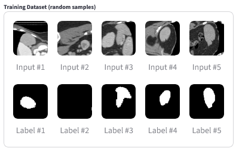
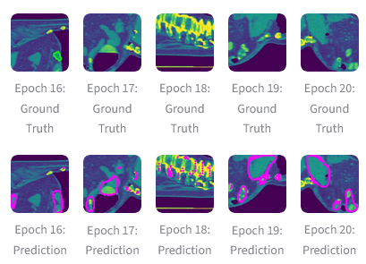
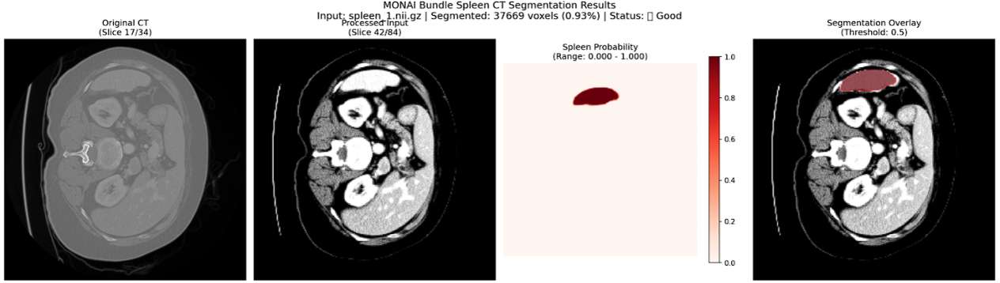
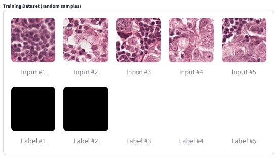
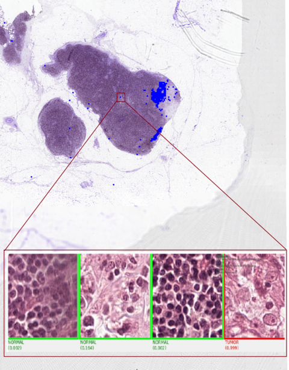

<!---
Copyright (c) 2025 Advanced Micro Devices, Inc. (AMD)

Permission is hereby granted, free of charge, to any person obtaining a copy
of this software and associated documentation files (the "Software"), to deal
in the Software without restriction, including without limitation the rights
to use, copy, modify, merge, publish, distribute, sublicense, and/or sell
copies of the Software, and to permit persons to whom the Software is
furnished to do so, subject to the following conditions:

The above copyright notice and this permission notice shall be included in all
copies or substantial portions of the Software.

THE SOFTWARE IS PROVIDED "AS IS", WITHOUT WARRANTY OF ANY KIND, EXPRESS OR
IMPLIED, INCLUDING BUT NOT LIMITED TO THE WARRANTIES OF MERCHANTABILITY,
FITNESS FOR A PARTICULAR PURPOSE AND NONINFRINGEMENT. IN NO EVENT SHALL THE
AUTHORS OR COPYRIGHT HOLDERS BE LIABLE FOR ANY CLAIM, DAMAGES OR OTHER
LIABILITY, WHETHER IN AN ACTION OF CONTRACT, TORT OR OTHERWISE, ARISING FROM,
OUT OF OR IN CONNECTION WITH THE SOFTWARE OR THE USE OR OTHER DEALINGS IN THE
SOFTWARE.
--->

# Announcing MONAI 1.0.0 for AMD ROCm: Breakthrough AI Acceleration for Medical Imaging Models on AMD Instinct™ GPUs

Today, AMD is thrilled to announce [MONAI 1.0.0 for AMD ROCm](https://github.com/ROCm-LS/monai), now available to the community as part of the ROCm-LS Early Access release.
In this blog you will learn how to use MONAI to load an analyze medical images, and see results from more advanced case studies.

[MONAI](https://monai.io/), or the Medical Open Network for AI, is an open-source, domain-specific framework for developing, training, and deploying deep learning models for medical imaging.
Built on PyTorch, it's designed to address the unique challenges of medical data, such as large, multi-dimensional images (like 3D and 4D scans), complex file formats (e.g., [DICOM](https://www.dicomstandard.org/), [NIfTI](https://nifti.nimh.nih.gov/)), and limited annotated datasets.
MONAI creates a standardized and reproducible ecosystem and collaborative platform that bridges the gap between AI research and its practical application in healthcare.

MONAI offers a comprehensive set of features and tools that cover the entire AI lifecycle for medical imaging.

* [MONAI Core](https://monai.io/core.html): This is the foundational library providing core functionalities for developing and training models. It includes:
  * Domain-specific transforms: Data augmentation and preprocessing tools optimized for medical images, handling things like intensity scaling, anatomical orientation, and resampling.
  * Specialized network architectures: MONAI includes pre-built neural networks and loss functions tailored for medical tasks, such as segmentation, classification, and registration.
  * Performance optimization: Leveraging GPU acceleration, smart caching, and distributed training to speed up workflows.
* [MONAI Label](https://monai.io/label.html): An intelligent annotation tool that uses AI to assist in labeling medical images, which significantly reduces the time and effort required for creating new datasets.
* [MONAI Deploy](https://monai.io/deploy.html): This framework simplifies the process of taking a trained model and integrating it into clinical workflows. It provides tools for creating lightweight, containerized applications that can be deployed in hospital environments, with support for clinical standards like DICOM and FHIR.
* [MONAI Model Zoo](https://monai.io/model-zoo.html): A collection of pre-trained, state-of-the-art models for various medical imaging tasks. These models serve as excellent starting points for researchers and developers, enabling them to jump-start their projects without building models from scratch.

The intersection of deep learning and medical imaging is rapidly reshaping healthcare. Every day, clinicians, researchers, and AI practitioners push the boundaries of what’s possible, from [cancer detection](https://www.nature.com/articles/s41591-024-03408-6) in radiology scans to [predicting blood infection](https://health.ucsd.edu/news/press-releases/2024-01-23-study-ai-surveillance-tool-successfully-helps-to-predict-sepsis-saves-lives/) from electronic health records.
Graphics Processing Units (GPUs) are at the core of this revolution, enabling high-resolution images to be processed rapidly.
To harness this potential, practitioners need powerful robust GPU integration, with software that handles the particularities and significance of the medical data being processed.

This is where MONAI for AMD ROCm enters the picture, heralding a new era for healthcare AI. By fusing the flexibility of open-source PyTorch for AMD ROCm, the computational power of AMD Instinct™ GPUs, the data transfer capabilities of [hipCIM](https://rocm.blogs.amd.com/software-tools-optimization/hipcim-intro/README.html), and the expansive ecosystem of [ROCm-LS](https://instinct.docs.amd.com/latest/life-science/index.html) (ROCm for Life Sciences), AMD is reshaping the medical AI landscape.

With this foundational release, AMD delivers high-performance, scalable, and truly open medical AI capabilities to researchers, clinicians, and innovators worldwide. This marks a significant milestone in AMD’s commitment to life sciences and healthcare, empowering new discoveries and improved patient outcomes.

The Early Access release provides access to new features under development for testing so users can provide feedback. It is not yet recommended for production use.

## The Vision: Building an Open, Scalable Healthcare AI Ecosystem with ROCm-LS

Already recognized as the reference toolkit for imaging AI in research and production, MONAI’s native support for AMD ROCm and Instinct™ GPUs does more than enable Python-based innovation — it unlocks new opportunities for researchers and startups to build, scale, and iterate freely, without compromise.

MONAI for AMD ROCm is more than a toolkit — it’s a foundation for an open, robust, and interoperable healthcare AI ecosystem. [ROCm-LS](https://rocm.docs.amd.com/projects/rocm-ls/en/develop/index.html) brings together optimized software suites, bioinformatics tools, and imaging frameworks, empowering scientists and clinicians to tackle genomics, population science, radiology, and more.

With ROCm-LS, AMD is lowering the barriers for the medical and life sciences community: an open, high-performance platform where you control performance, cost, and workflow. With this release, AMD signals its ongoing commitment to enabling not just faster AI, but better collaboration, transparency, and clinical impact for the global healthcare community.

## Engineered for High-Throughput Medical AI

MONAI for ROCm is more than a framework port — it's a catalyst for serious innovation in both hospitals and research labs:

* __Clinical Imaging at Full Speed:__ Accelerate massive whole slide images, multi-dimensional scans, and complex pipelines, all harnessing the parallel muscle of AMD’s Instinct™ GPUs.

* __Domain Specialization:__ Use composable Python APIs built specifically for common imaging tasks such as segmentation, classification, and registration, tailored to the quirks and realities of clinical data.

* __Scalable Science:__ Effortlessly scale your AI research from single-node to large multi-node clusters, leveraging ROCm’s support for distributed, multi-GPU training and inference — ideal for data center and cloud environments powering modern healthcare workloads.

* __Under the Hood:__ Seamless GPU Acceleration for Imaging Workflows
A game-changer in this release is the direct integration of [hipCIM](https://rocm.blogs.amd.com/software-tools-optimization/hipcim-intro/README.html), AMD’s drop-in, API-compatible version of RAPIDS cuCIM, delivering native GPU acceleration for the full medical imaging pipeline, end-to-end, on AMD Instinct™ GPUs.
hipCIM reads image files (and sometimes specific parts of images) directly from disk to GPU memory, which is much faster than traditional imaging libraries that decode image files on the CPU first.

### True Drop-in Compatibility

If you’ve used cuCIM on NVIDIA, you already know the drill — simply `import cucim` and use your existing code. On AMD, just install `amd-hipcim` — no code changes required. This full namespace equivalence eliminates migration friction for workflows with established imaging pipelines, enabling seamless onboarding.

### MONAI for AMD ROCm + hipCIM: Unblocking Performance at Every Stage

* __Instant WSI (Whole Slide Image) Acceleration:__ Whole Slide Images (WSIs) are stacked collections of digitized medical slide images. Resolution and density are crucial, and WSI files can become huge. MONAI’s WSIReader is powered by hipCIM, delivering dramatic speedups in patch extraction, multi-resolution sampling, and fast tensor conversion, enabling high-throughput workflows for even the largest pathology and radiology datasets.

* __GPU-Accelerated Transforms:__ Connected component labeling, edge detection, distance transforms, and more — MONAI transparently leverages GPU performance via hipCIM at the transform level wherever possible.

* __Intelligent Backend Selection:__ MONAI automatically detects and uses hipCIM for GPU acceleration; if unavailable, it gracefully falls back to CPU libraries like scikit-image, maintaining full portability.

### Key Accelerated Operations (with hipCIM)

* Rapid patch extraction from WSIs
* GPU-driven connected component labeling, edge detection, and distance transforms
* Dynamic backend selection for optimal performance with zero user intervention

This plug-and-play approach means there’s zero code change required between platforms — just switch your Python package, not your pipeline.
The open medical imaging community can now accelerate innovation without rebuilding workflows for every hardware refresh.

Thanks to deep hipCIM integration, you consistently extract maximum performance from your AMD platform — with no additional engineering required.

### Basic Installation Steps

Please refer to [the MONAI for AMD ROCm installation guide](https://rocm.docs.amd.com/projects/monai/en/latest/install/installation.html) for complete installation instructions.
Once the dependencies including amd-hipcim are installed, to install [the current amd-monai release](https://pypi.amd.com/simple/amd-monai/), you can simply run:

```bash
pip install amd-monai --extra-index-url=https://pypi.amd.com/simple
```

Some standard datasets are available for testing, including the [CAncer MEtastases in LYmph nOdes challeNge](https://registry.opendata.aws/camelyon/) (CAMELYON) Dataset,
a collection of annotated images that has been widely used in developing automatic cancer detection systems.
The whole dataset adds up to 3TB of data, but individual images can be downloaded easily using tools such as
the [AWS Command Line Interface](https://docs.aws.amazon.com/cli/latest/userguide/getting-started-install.html).
For example, on Linux systems, the following commands can be used to install AWS CLI, and download a copy of a particular tumor image (1.9G in this case).

```bash
apt install unzip
curl "https://awscli.amazonaws.com/awscli-exe-linux-x86_64.zip" -o "awscliv2.zip"
unzip awscliv2.zip
sudo ./aws/install
aws s3 cp --no-sign-request s3://camelyon-dataset/CAMELYON16/images/tumor_111.tif tumor_111.tif
```

The `tumor_111.tif` image can then be read into MONAI using the following python code:

```python
from monai.data import WSIReader
reader = WSIReader()
img = reader.read("tumor_111.tif")
```

## Accelerating Medical Imaging AI on AMD ROCm: MONAI At Work

Now let's take a look at MONAI at work. Our internal validation benchmarks tested the following two high impact models from the [MONAI Model Zoo](https://monai.io/model-zoo.html).
The first is a Spleen CT Segmentation Model, which is a pre-trained model for volumetric (3D) segmentation of the spleen from CT images.
The second is a Pathology Tumor Detection Model, which is a pre-trained model for automated detection of metastases in whole-slide histopathology images.

Our internal validation benchmarks tested these high-impact models from the [MONAI Model Zoo](https://monai.io/model-zoo.html).

### Spleen CT Segmentation Model

Using the [Spleen CT Segmentation](https://monai.io/model-zoo.html#/model/spleen_ct_segmentation) model trained on the [Medical Segmentation Decathlon (MSD)](https://medicaldecathlon.com/dataaws/) Spleen dataset,
we observed a consistent __1.6x__ to __1.8x__ speedup over CPU-only training, demonstrating notable efficiency gains for 3D volumetric segmentation.
The images below show examples of the training and test images used for this experiment.

| Training Samples | Predictions vs. Ground Truth |
| --- | --- |
|  |  |
| (Above) Random samples from the training dataset, for representation purposes. __Input Image (CT slice):__ A grayscale cross-section of the abdomen showing internal anatomy. __Label (mask)__: A binary map of the same slice black everywhere, with white highlighting the spleen region. When overlaid, the white region in the label corresponds exactly to the spleen in the CT image. | (Above) Mid-slice CT images with ground truth and predicted segmentation contours. Allows quick visual comparison of model predictions against reference masks across epochs. __Ground Truth__: Input CT slice overlaid with label mask. __Prediction__: Input CT slice overlaid with model prediction. |

During inference, the Spleen CT Segmentation pipeline powered by MONAI on AMD Instinct GPUs efficiently processes CT images to generate probability maps of the spleen region, which are then post-processed into segmentation masks.
The workflow consistently achieves accurate localization and clear delineation of anatomical boundaries, with confidence visualizations confirming the reliability of the automated results.
The figure below shows examples of areas being correctly classified as spleen.
These outcomes highlight the effectiveness of ROCm-accelerated MONAI in delivering fast and accurate segmentation.



### Pathology Tumor Detection

For the [Pathology Tumor Detection](https://monai.io/model-zoo.html#/model/pathology_tumor_detection) task involving whole slide images (WSI) from [CAncer MEtastases in LYmph nOdes challeNge (CAMELYON)](https://registry.opendata.aws/camelyon/), integration with the newly released [hipCIM library](https://github.com/ROCm-LS/hipCIM) for fast GPU image loading proved transformative.
Not only did we achieve a __6x__ speedup in training, but inference acceleration was even more striking —
GPU-accelerated pipelines delivered up to __7.9x__ speedup at smaller batch sizes, and scaled dramatically to __over 15x faster throughput__ at higher batch sizes (>4), compared to CPU-based inference.
This underlines the superior scalability and efficiency of AMD ROCm-powered solutions for large-scale, high-throughput digital pathology.

This out-of-the-box synergy between MONAI for AMD ROCm and hipCIM means users can immediately take advantage of significantly reduced training times, especially for large-scale pathology and high-throughput workloads.

The image below shows some of the training examples from the pathology tumor dataset.

| Pathology Classification Training Images |
| --- |
|  |
| Random samples from the training dataset.<br/> __Input Image (WSI):__ A high-resolution whole slide image tile from a histopathology slide, typically stained with H&E.<br/> __Label (mask):__ A binary mask where white indicates tumor and black indicates non-tumor. |

### Whole Slide Image (WSI) Processing

WSI inference accelerated by MONAI and hipCIM on AMD GPUs harnesses ROCm to tackle the intensive demands of gigapixel pathology slides. Thanks to hipCIM, patch extraction, streaming, and preprocessing occur rapidly on the GPU, eliminating typical CPU bottlenecks. During inference, regions of interest are automatically detected and zoomed to high resolution, with the model classifying areas as normal (green) or tumor (red) with high probability scores. Combining MONAI’s deep learning capabilities with hipCIM’s WSI acceleration achieves up to __14×__ speedup over CPU-based pipelines, enabling fast, automated insights from ultra-large datasets, making AI-powered digital pathology truly scalable and practical on AMD Instinct GPUs.

The image below shows examples of how Whole Slide Image processing can select and process very detailed parts of huge images.

| WSI Image Example |
| --- |
|  |
| Zooming in on an area of interest for detailed WSI processing |

This out-of-the-box synergy between MONAI for AMD ROCm and hipCIM empowers users to realize dramatically reduced compute times across both training and inference phases.
Especially for large-scale pathology and high-throughput workloads, the combined solution delivers the scalability, efficiency, and reliability required to advance medical imaging AI on AMD Instinct™ GPUs.

## Seamless MONAI Model Zoo Support on AMD ROCm

A key advantage of the MONAI early access release for AMD ROCm is its effortless compatibility with the [MONAI Model Zoo](https://monai.io/model-zoo.html#/).
Our internal validation demonstrates that industry-standard models, such as Pathology Tumor Detection, Spleen CT Segmentation, and [SwinUNETR](https://monai.io/model-zoo.html#/model/swin_unetr_btcv_segmentation) for advanced segmentation, work seamlessly, right out of the box.

Users can select and deploy state-of-the-art architectures from the Model Zoo without requiring low-level hardware tuning or custom engineering.
Whether running classification pipelines on gigapixel pathology slides or training transformer-based networks for complex 3D segmentation, the ROCm stack (with MONAI and hipCIM) ensures models perform efficiently and reliably on AMD Instinct™ accelerators.
For more details on the MONAI Model Zoo support, see [our documentation](https://rocm.docs.amd.com/projects/monai/en/latest/reference/model-zoo.html).

This “it just works” experience accelerates innovation and reduces friction for medical imaging researchers and developers, enabling fast iteration, experimentation, and scaling with trusted, community-maintained models.

## Effortless MONAI Bundle Integration on AMD ROCm

The early access release of MONAI for AMD ROCm not only ensures Model Zoo compatibility, but also delivers seamless support for [MONAI Bundles](https://docs.monai.io/en/stable/bundle_intro.html) — reproducible, portable packages that encapsulate models, configurations, and workflows.

Our validation confirms that loading, running, and customizing MONAI Bundles, across tasks such as pathology classification, organ segmentation, or transformer-powered pipelines, works without friction on ROCm-powered AMD Instinct™ GPUs.
This empowers researchers and practitioners to deploy, share, and scale AI solutions in clinical and research environments, leveraging optimized, community-vetted resources.

Suitable MONAI bundles can be downloaded from public datasets, for example, by using the AWS command line client installed earlier:

```bash
aws s3 cp --no-sign-request s3://msd-for-monai/Task09_Spleen.tar Task09_Spleen.tar
tar -xvf Task09_Spleen.tar
```

This unzips input files, which can be processed as a MONAI bundle using the python script below,
which performs segmentation on the given spleen image.

```python
import torch
from monai.bundle import download, load
from monai.transforms import (
    Compose, LoadImage, EnsureChannelFirst, Orientation,
    Spacing, ScaleIntensityRange, EnsureType
)
from monai.inferers import sliding_window_inference

# 1. Load model from bundle
bundle = "spleen_ct_segmentation"
download(name=bundle, bundle_dir="./models")
device = torch.device("cuda" if torch.cuda.is_available() else "cpu")
model = load(name=bundle, bundle_dir="./models").to(device).eval()

# 2. Preprocessing
pre = Compose([
    LoadImage(image_only=True),
    EnsureChannelFirst(),
    Orientation(axcodes="RAS"),
    Spacing(pixdim=(1.5, 1.5, 2.0), mode="bilinear"),
    ScaleIntensityRange(a_min=-57, a_max=164, b_min=0, b_max=1, clip=True),
    EnsureType()
])

# 3. Load image and move to device
image_path = "Task09_Spleen/imagesTr/spleen_2.nii.gz"
img = pre(image_path).unsqueeze(0)  # [B,C,D,H,W]
img = img.to(device=device, dtype=torch.float32, non_blocking=True)

# 4. Inference
with torch.no_grad():
    logits = sliding_window_inference(
        img, roi_size=(96,96,96), sw_batch_size=1, predictor=model)
    pred = torch.argmax(logits, dim=1).squeeze().cpu().numpy()

print("mask voxels:", int(pred.sum()), "of", pred.size)
```

If successful, it reports the output:

```console
mask voxels: 66813 of 16572416
```

This tells us that out of the ~16.6 million voxels in the CT volume, about 67 k were classified as spleen by the model — i.e. the segmentation found a relatively small 3-D region (the spleen) inside the much larger CT scan.

In certain cases, you may see a benign warning as below, which can be safely ignored. This is due to the fact that MONAI for AMD ROCm is being released as version 1.0.0 even though it is based on upstream MONAI 1.5.0.

_WARNING - Your MONAI version is 1.0.0, but the bundle is built on MONAI version 1.4.0._

## Shape the Future of AI in Medical Imaging with AMD

MONAI for AMD ROCm is open-source, community-driven, and designed to break barriers in healthcare innovation. If you’re ready to push boundaries in medical imaging AI, now is the time to get involved!

### Why Join the Journey?

* __Open & Accessible:__ Seamlessly integrate your workflows with PyTorch for AMD ROCm, leveraging flexible, Python-based AI development.

* __Domain-Optimized:__ Tackle complex, multi-dimensional imaging for improved patient outcomes with MONAI’s domain-specialized modules and tools.

* __Supercharged with ROCm-LS:__ Experience game-changing acceleration, scalable performance, and a thriving life sciences ecosystem, all powered by AMD Instinct™ GPUs and ROCm.

### How You Can Make an Impact

* __Try MONAI for AMD ROCm:__ Start building, benchmarking, and creating next-generation healthcare AI solutions.

* __Engage with Our Open Community:__ Share feedback, [raise issues](https://github.com/ROCm-LS/monai/issues), and [contribute directly](https://github.com/ROCm-ls//monai?tab=contributing-ov-file) to ROCm-LS, hipCIM, and MONAI’s ongoing evolution.

* __Collaborate with AMD:__ Connect with developers and AMD engineers — join benchmarking efforts, help expand model zoo support, and shape the roadmap for open medical AI.

__Let’s accelerate medical imaging innovation together. Your ideas, feedback, and involvement will drive the next wave of breakthroughs in healthcare AI, powered by open source, and AMD.__

## Summary

This article introduced MONAI for AMD ROCm, and some of its key technical benefits — in particular, the ability to process enormous image files quickly and flexibly, and to identify key information in medical images, with amazing accuracy and detail.
We demonstrated some simple examples of image loading, training, and classification, and showcased some larger-scale experiments on pathology classification and spleen segmentation.

MONAI for AMD ROCm 1.0.0 marks a pivotal moment for healthcare AI: empowering open science, unlocking scalable performance, and accelerating innovation in medical imaging — now on AMD Instinct™ GPUs. This launch is not just a milestone for MONAI, but the foundation for a dynamic, collaborative future of AI in life sciences as part of the ROCm-LS portfolio.

We invite researchers, clinicians, and innovators worldwide to join us in shaping what’s next. Together, we can refine, expand, and push the boundaries of what’s possible in medical AI, driving better outcomes and discoveries for patients everywhere.

__Are you ready to drive the next breakthrough in healthcare imaging? Start your journey with MONAI for AMD ROCm today!__

## References / Further Reading

Readers who want to learn more will enjoy reading some of these articles:

* [MONAI: An open-source framework for deep learning in healthcare](https://arxiv.org/abs/2211.02701)
* [Whole Slide Imaging (WSI) in Pathology: Current Perspectives and Future Directions](https://pmc.ncbi.nlm.nih.gov/articles/PMC7522141/)
* [hipCIM 1.0.00 documentation](https://rocm.docs.amd.com/projects/hipCIM/en/latest/)
* [ROCm-LS](https://rocm.docs.amd.com/projects/rocm-ls/en/latest/)
* [MONAI Blogs](https://monai.medium.com/)

## Disclaimers

Third-party content is licensed to you directly by the third party that owns the
content and is not licensed to you by AMD. ALL LINKED THIRD-PARTY CONTENT IS
PROVIDED “AS IS” WITHOUT A WARRANTY OF ANY KIND. USE OF SUCH THIRD-PARTY CONTENT
IS DONE AT YOUR SOLE DISCRETION AND UNDER NO CIRCUMSTANCES WILL AMD BE LIABLE TO
YOU FOR ANY THIRD-PARTY CONTENT. YOU ASSUME ALL RISK AND ARE SOLELY RESPONSIBLE
FOR ANY DAMAGES THAT MAY ARISE FROM YOUR USE OF THIRD-PARTY CONTENT.
