<!---
Copyright (c) 2025 Advanced Micro Devices, Inc. (AMD)

Permission is hereby granted, free of charge, to any person obtaining a copy
of this software and associated documentation files (the "Software"), to deal
in the Software without restriction, including without limitation the rights
to use, copy, modify, merge, publish, distribute, sublicense, and/or sell
copies of the Software, and to permit persons to whom the Software is
furnished to do so, subject to the following conditions:

The above copyright notice and this permission notice shall be included in all
copies or substantial portions of the Software.

THE SOFTWARE IS PROVIDED "AS IS", WITHOUT WARRANTY OF ANY KIND, EXPRESS OR
IMPLIED, INCLUDING BUT NOT LIMITED TO THE WARRANTIES OF MERCHANTABILITY,
FITNESS FOR A PARTICULAR PURPOSE AND NONINFRINGEMENT. IN NO EVENT SHALL THE
AUTHORS OR COPYRIGHT HOLDERS BE LIABLE FOR ANY CLAIM, DAMAGES OR OTHER
LIABILITY, WHETHER IN AN ACTION OF CONTRACT, TORT OR OTHERWISE, ARISING FROM,
OUT OF OR IN CONNECTION WITH THE SOFTWARE OR THE USE OR OTHER DEALINGS IN THE
SOFTWARE.
--->
# Continued Pretraining: A Practical Playbook for Language-Specific LLM Adaptation

What if you could make a state-of-the-art LLM fluent in a new language—without training from scratch? In this guide, we show how we did just that with Finnish.

State-of-the-art language models are transformative, but their development is resource-intensive and overwhelmingly English-centric.  This presents a significant challenge for organizations and researchers seeking high-performance models in other languages or specialized domains.  Training a new model from scratch is often prohibitively expensive, creating a barrier to entry and innovation.

Continued pretraining (CPT) offers a powerful and compute-efficient path forward.  By adapting a strong, existing model, it is possible to achieve state-of-the-art performance in a new language for a fraction of the cost of training a model from scratch, often without compromising the model's original capabilities.

However, the path to successful CPT involves a series of critical decisions, from model selection and data mixing to the specifics of the training and alignment process.  This document serves as a comprehensive technical playbook, sharing the concrete methodologies and lessons learned from our work creating the [Poro 2 model family](https://huggingface.co/collections/LumiOpen/poro-2-6835bec8186e98712b061f02): Finnish-capable versions of Llama 3.1 8B and 70B.

This guide is for practitioners who need to move beyond theory and implement a real-world language adaptation pipeline.  We provide an end-to-end walkthrough covering:

* Strategic model and data selection.
* The technical framework for training and evaluation.
* Results from our experiments that informed our final configuration.
* Our process for generating synthetic data and conducting post-training alignment.

By sharing our process, we aim to provide a clear, replicable roadmap for developing high-quality, multilingual LLMs.

## Collaborations and resources

This work was done in close collaboration with [TurkuNLP](https://turkunlp.org/) from the University of Turku. TurkuNLP’s contributions came as part of the [High Performance Language Technologies project](https://hplt-project.org/).  All work was performed using AMD Instinct MI250X processors on the [LUMI supercomputer](https://lumi-supercomputer.eu/).

## Continued Pretraining

This section introduces the core techniques used in this work, Continued Pretraining (CPT) and presents the high-level results to demonstrate its effectiveness before we detail the methodology.

Continued Pretraining is an attractive option for adding new capabilities–like support for a new language–to existing models, for a fraction of the compute compared to training a model from scratch.  Done correctly, strong English language capabilities can contribute cross-lingually to the performance of another target language, using a relatively small amount of data in the target language, and without disrupting the model’s existing capabilities.

Poro 2 was created by using CPT on the Llama 3.1 8B and 70B base models, and we show that we substantially improved performance in Finnish compared to the Llama Instruct models, while maintaining solid English proficiency. The figure below illustrates this, showing a strong head-to-head win rate for Poro 2 models on the Finnish MT-Bench.

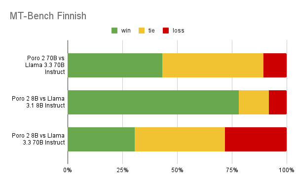

Our models show excellent performance in Finnish.  Though we use Llama 3.3 70B Instruct as the basis for our post-training synthetic data pipeline, Poro 2 70B substantially outperforms it in Finnish in a head-to-head comparison using MT-Bench.  Our smaller Poro 2 8B outperforms Llama 3.1 8B, and even manages to tie the much larger Llama 3.3 70B model in Finnish.

This strong performance is consistent across a broader set of post-training evaluations as well. As the following chart of averaged scores shows, our CPT process resulted in significant Finnish-language gains for both model sizes.

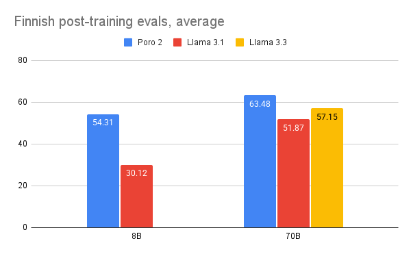

## Model Selection

The first step in any CPT project is selecting a base model.  This decision has significant implications for the final model's capabilities, cost and usability. This section outlines the key criteria we evaluated: raw capabilities, licensing terms, model size, and tokenizer efficiency.

### Capabilities

To determine which model to use as the basis for continued pretraining, we test both multilingually-oriented models, and models that are targeted primarily toward English. We find that the strongest predictor of the model’s eventual capability in the target language is the model’s existing capability in English.

Our early experiments, illustrated in the figure below, demonstrate this: stronger English models like Llama 3.1 8B consistently adapted better to Finnish during CPT than multipurpose multilingual models that were less capable in English.

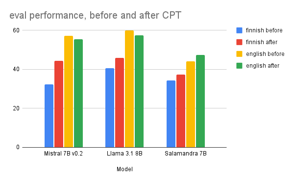

### License

Licensing is a major consideration when selecting a model to work with.  Fully open source licenses like Apache 2.0 or MIT have the fewest restrictions on what you can do with the model after you train it.  Other open weights models like Gemma or Llama models come with licensing constraints that may restrict what you can do with the models or their outputs.

### Size

Though they are more expensive to train and run, generally a larger model is best to maximize capabilities. Larger models tend to be more capable, more sample efficient, and are better at incorporating new training without damaging existing performance in other domains.

In our early experiments, we did not include math data in the pretraining data mix (50B tokens, 70% Finnish, 25% English, 4% code, 1% paired texts.) Typically, when a domain is excluded during continued pretraining, model capabilities in that domain will decline, and that certainly occurred with the 8B model: math performance declined substantially. But as shown in the figure below, despite using the same data mix, math performance of the 70B model declined significantly less.

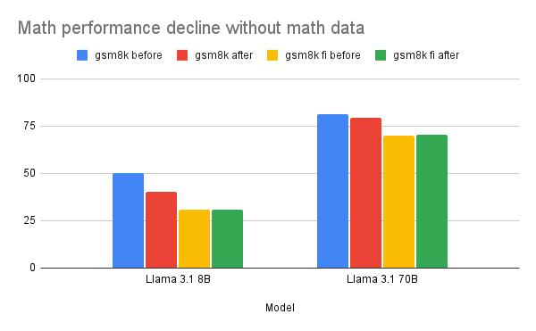

### Other Considerations

Tokenizer efficiency in the target language is an important consideration when creating or selecting language models.  Some models will have better tokenization for your target language than others. Tokenizer efficiency is usually measured with a metric called fertility–a measure of how many tokens it takes to represent a word, on average.

Having an efficient tokenizer is not mandatory to achieve good results from continued pretraining, but inefficient tokenization means that the model needs to use more compute to generate the same amount of text, and less content can fit within the model’s context window.  An inefficient tokenizer may also slightly reduce achievable model performance.

Sample scripts for measuring tokenizer fertility can be found in our [evals repo](https://github.com/LumiOpen/evals/tree/master/fertility). The following chart compares tokenizer fertility for several models, showing that while the base Llama 3.1 tokenizer is less efficient for Finnish than a custom one (like the original [Poro](https://huggingface.co/LumiOpen/Poro-34B)), it is still a viable starting point.

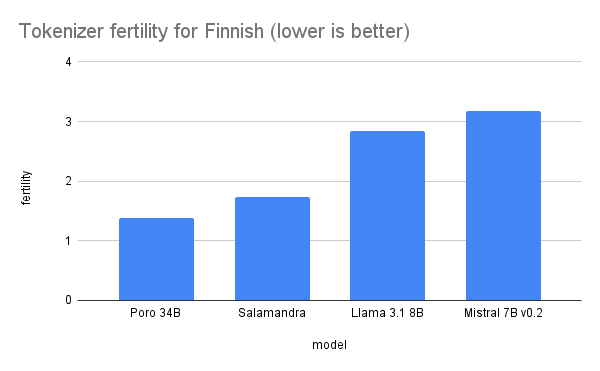

### Model Selection Summary

Our analysis led us to select the Llama 3.1 8B and 70B models.  The primary drivers for this decision were their excellent English performance, which we found to be a strong predictor of success in the target language, and the availability of both a large and small model within the same family.

## Machine Translation

A significant challenge in developing multilingual models is the scarcity of high-quality training and evaluation data in the target language.  This section explores our strategic use of machine translation (MT) to bridge this resource gap for both evaluation and training datasets.

The vast majority of available resources for LLM evaluation and training are in English. MT is a cost-effective method of making these resources available for other languages. There are many MT systems out there with varying cost, quality, and license restrictions.

Our approach to machine translation varies by the purpose of the data:

* *Evaluation Data*: We used high-quality translations from the commercial DeepL model to ensure our benchmarks were as accurate as possible.
* *Pretraining Data*: We used no machine-translated data in this phase, relying entirely on native-language corpora.
* *Post-Training Data*: We used our own open models to translate instruction prompts at scale, which allowed us to control for cost and licensing.

### Translation for Evaluations

Translating existing English language evaluations into your target language is a practical option to quickly assess model performance in that language, but there are drawbacks:

* English based evaluations may contain embedded cultural assumptions that are not relevant or misleading in your target language.
* Translation error can reduce the accuracy of the evaluation

However, we find that translated evals are still very useful, providing clear and useful signals to differentiate relative model performance.  If you do not have the time or resources to create new evaluations from scratch, or pay for expensive human translations and annotations, machine translated evals are a perfectly acceptable way to begin.

Previous published work \[[SB de Vroe et al.](https://aclanthology.org/2025.nodalida-1.9/)\] supports the idea that machine translated evals, while imperfect, can still give useful information on model capabilities in the target language. Though it’s important to remember that the scores for the original and translated versions of an evaluation are unlikely to be directly comparable, due to the limitations mentioned above.

### Translations for Post-Training Data

While translation is a straightforward method of obtaining post-training datasets in another language, previous research has shown that translated data can introduce hallucinations into the model \[[Pipatanakul et al.](https://arxiv.org/abs/2412.13702)\] or are generally of lower quality than data natively-generated in the target language \[[Aryabumi et al](https://arxiv.org/abs/2405.15032)., [Dang et al.](https://arxiv.org/abs/2407.02552)\].  Generating post-training data from scratch in Finnish, however, means we will not be able to take advantage of the high-quality curated datasets available in English \[[Lambert et al.](https://arxiv.org/abs/2411.15124)\].

To balance the need to minimise the use of translated data while ensuring that our model learns the same set of skills in English and Finnish, we translated only the prompts for the supervised fine-tuning (SFT) data and natively generated responses in Finnish, described below in the **Synthetic Data** section. The Direct Preference Optimization (DPO) data, however, needed to be translated with prompts and their corresponding chosen and rejected responses, though we did not ultimately use the translated versions.

To translate post-training data, we use [Poro](https://huggingface.co/LumiOpen/Poro-34B), an earlier Finnish-English model we trained from scratch. In previous work, we benchmarked Poro and other MT models such as [Opus-MT](https://huggingface.co/Helsinki-NLP/opus-mt-tc-big-en-fi) \[[Tiedemann et al.](https://aclanthology.org/2020.eamt-1.61/)\] and found that Poro offered better quality for Finnish translations among the open models \[[Luukkonen et al.](https://arxiv.org/abs/2404.01856)\]. As shown in the FLORES-101 benchmark results below, our Poro-34B model is competitive with other leading open translation systems.

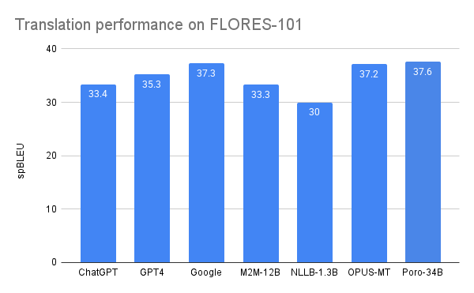

#### Translations with Few-Shot Prompting

To efficiently translate a large number of prompts and responses, we developed a framework for large-scale translation jobs with a VLLM inference backend. We use a few-shot prompt to obtain translations from Poro-34B. The few-shot prompt is composed of sentence pairs taken from the FLORES-200 dev set.

[https://github.com/LumiOpen/translation\_dispatcher](https://github.com/LumiOpen/translation_dispatcher)

### Machine Translation Summary

Our approach to translation was pragmatic and use-case driven. We invested in high-quality commercial translations for our evaluation benchmarks to ensure reliable measurement, and used our own open models for post-training data to balance cost and licensing. This hybrid strategy was essential for building a robust data pipeline, providing us with the translated benchmarks needed to properly evaluate our model's new capabilities.

## Pretraining Evaluations

With a strategy for sourcing both native and translated data, the next step is to establish a robust evaluation suite to measure our progress. Effective evaluation is critical for verifying the capabilities of the base models and ensuring that continued pretraining has the desired effect. This section details the frameworks and specific benchmarks, including the machine-translated tests discussed previously, that we used to assess performance in English, Finnish, code, and math throughout the CPT process.

### Evaluation Frameworks

We use [lm-evaluation-harness](https://github.com/EleutherAI/lm-evaluation-harness) for most of our evaluations, and maintain our [own fork](https://github.com/LumiOpen/lm-evaluation-harness) with a number of translated evals for the languages we work with. (Another popular choice for evaluations is [Lighteval](https://github.com/huggingface/lighteval).)

We also maintain [an automation framework](https://github.com/LumiOpen/evals) to automate some of our eval workflow on Slurm-based HPC systems like LUMI, which reduces the manual effort in running a large number of evaluations.

### Pretraining Evaluations Selected

We include a minimal set of popular, basic evaluations and their translated equivalents for our continued pretraining experiments.  All of these are available in our lm-evaluation-harness fork. For our Finnish evaluations, we use existing translations of ARC, MMLU, HellaSwag, GSM8K, and TruthfulQA  that were translated with DeepL \[[Thellmann et al](https://arxiv.org/pdf/2410.08928)\].

English

* arc\_challenge
* mmlu
* truthfulqa
* hellaswag

Finnish (translated)

* arc\_challenge\_mt\_fi
* mmlu\_mt\_fi
* truthfulqa\_mt\_fi
* hellaswag\_mt\_fi

Code

* humaneval

Math

* gsm8k
* gsm8k\_mt\_fi

Translation

* flores200 (en to fi, fi to en)

### Pretraining Evaluations Summary

We established a multi-domain evaluation suite using the lm-evaluation-harness framework and a custom automation framework. The final set of benchmarks provided comprehensive coverage of the key capabilities we aimed to improve and preserve, forming the basis for the analysis in our experimental runs.

## Continued Pretraining Data Mixes

The composition of the training data is arguably the most critical factor in continued pretraining, directly influencing the balance between acquiring new skills and retaining existing ones. This section covers the theory behind data mixing to prevent catastrophic forgetting and surveys the datasets we considered for Finnish, English, code, and math.

### Theory

Continued pretraining offers possibilities for compute and data efficient LLM training, utilizing knowledge transfer across domains. However, strong distribution shifts–such as training data in a new language–tend to result in catastrophic forgetting and capability loss on the original domains. Previous studies suggest that such forgetting can be alleviated by mixing the original training data with the new domain data \[[Ibrahim et al.](https://arxiv.org/abs/2403.08763)\]. For strong distribution shifts, the amount of the replayed original data required may even be 50% of the whole data mix, though there is a tradeoff: mixing in a lot of data from the original model domains may somewhat limit peak performance in the new domain, so finding the right balance between data in existing domains and data in new domains is key.

For example, the figure below shows the impact of excluding math data during our continued pretraining experiments. In the first “no math” run, we used a 50B token data mix of 70% Finnish, 25% English, 4% code and 1% paired text, which caused math performance to decline in English, and remain low in Finnish.  Swapping out the 4% code for 4% math substantially maintained English math performance during continued pretraining, while also boosting math performance in Finnish, despite the fact that math dataset is English oriented.

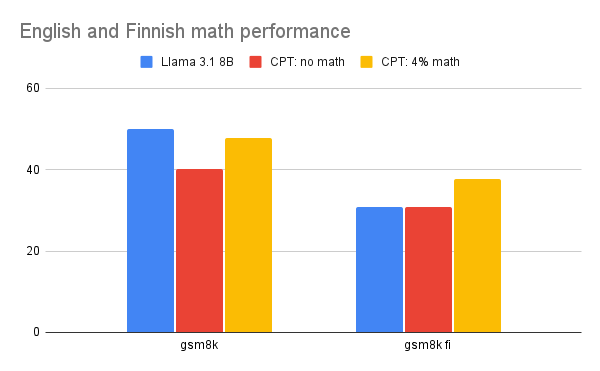

When applying continued pretraining on existing models, we rarely have access to the original training data and may even lack general information about what it contained, which increases the challenge of finding an optimal data mix. Because we are interested in maintaining performance in English, math and code while improving performance in Finnish, we combine data from all of these domains, and evaluate the impact of different data mixes.

### Available Datasets

Although data acquisition is a critical step in producing capable LLMs, it is also a challenging task including various data extraction, language identification, filtering and refinement steps. In this playbook we thus focus on the applicability of existing multilingual datasets. In particular we evaluate the Finnish subsets of FineWeb-2, HPLT v2 and CulturaX. To prevent catastrophic forgetting for English and code capabilities, our data mixes also included English, math, and code. To this end we utilize the FineWeb-Edu, StarCoder and FineMath datasets.

#### Broadly multilingual datasets

##### FineWeb2

FineWeb2 is a strictly non-English dataset with 1,893 language-script pairs, although most of these have a very small amount of data. The dataset contains almost 3T words. \[[FineWeb2](https://huggingface.co/datasets/HuggingFaceFW/fineweb-2)\]

##### HPLT v2

The second release of HPLT contains 8T tokens in 193 languages extracted from Internet Archive and Common Crawl crawls. Almost 60% of this data is non-English. An additional parallel corpora with 380M sentence pairs is also included. \[[Burchell et al.](https://arxiv.org/abs/2503.10267)\]

##### CulturaX

CulturaX covers 167 languages with 6.3T tokens in total. CulturaX combines two previous multilingual datasets: mC4 and OSCAR, with more than half of the data being non-English. \[[Nguyen et al.](https://arxiv.org/abs/2309.09400)\]

As slightly different token calculations are used for each of these datasets, we report the size of the Finnish subsets in terms of tokens after preprocessing with the Llama 3.1 tokenizer below.

| Dataset | Tokens (Finnish) |
| :---- | :---- |
| [FineWeb2](https://huggingface.co/datasets/HuggingFaceFW/fineweb-2) | 49,649,704,835 |
| [HPLT v2](https://huggingface.co/datasets/HPLT/HPLT2.0_cleaned) | 61,104,545,039 |
| [CulturaX](https://huggingface.co/datasets/uonlp/CulturaX) | 43,987,780,310 |

#### English

We elected to use a smaller, high quality English dataset rather than a general web text dataset, in the belief that this might more closely mimic the pretraining dataset the models used. We also hypothesize that the higher quality data would be of more value in maintaining the peak capabilities of the model.

We use FineWeb-Edu, a 1.3T token subset of the English FineWeb data filtered for educational content \[[Penedo et al.](https://arxiv.org/abs/2406.17557)\]. It has been demonstrated to result in similar LLM capabilities as the full FineWeb data with 10x fewer tokens.

#### Code

We use [StarCoder](https://huggingface.co/datasets/bigcode/starcoderdata), a cleaned subset of The Stack covering 86 programming languages. In addition to plain source code, the dataset contains GitHub issues and commits as well as Jupyter notebooks. \[[Li et al.](https://arxiv.org/abs/2305.06161)\]

#### Math

We use [FineMath](https://huggingface.co/datasets/HuggingFaceTB/finemath), a mathematical educational dataset extracted from Common Crawl. We use the highest quality subsets of the data, namely FineMath4+ and Infi-WebMath4+. \[[Liu et al.](https://arxiv.org/abs/2403.07747)\]

#### Parallel data

[Tatoeba Challenge](https://github.com/Helsinki-NLP/Tatoeba-Challenge) is a machine translation benchmark providing training and evaluation data for thousands of language pairs \[[Tiedemann](https://aclanthology.org/2020.wmt-1.139/)\]. The training data is sourced from the OPUS parallel corpora and test data from Tatoeba. The English-Finnish parallel data contains over 140M sentence pairs. We evaluated the impact of the paired sentences, but did not ultimately include this data in the final training run.

### Continued Pretraining Data Mix Summary

Our data strategy involved selecting high-quality, domain-specific datasets to cover all key capabilities.  For Finnish, we evaluated several large web-based corpora. To preserve existing performance, we chose specialized datasets for English (FineWeb-Edu), code (StarCoder), and math (FineMath). The final proportions of these datasets in our training mix were determined through the experiments described in a later section.

## Continued Pretraining with Megatron-LM

This section moves from strategy to implementation, outlining the technical workflow for training the models using the Megatron-LM framework on the LUMI supercomputer. We cover the three primary stages: preparing the data, converting the base model into the Megatron checkpoint format, and executing the training run.

To train with Megatron-LM, we first pretokenize the data into the format that Megatron-LM requires. The base models we use as starting points for CPT are in the Hugging Face transformers format, which needs to be converted to the Megatron checkpoint format before we can proceed with CPT. After training, the checkpoint is converted back to the Hugging Face transformers format for easier evaluation and distribution.

We performed the continued pretraining with an [older fork of Megatron-LM](https://github.com/LumiOpen/Megatron-LM-lumi%20) framework, but more recently an [updated ROCm fork of Megatron-LM](https://github.com/ROCm/Megatron-LM) has been made available, and we would recommend using that version instead, because it has a number of new features and improved training performance. We provide examples of all the steps described here in the [scripts repository](https://github.com/LumiOpen/poro2-scripts-dev%20) using the updated version.

### Pre-Tokenizing Training Data

Pre-tokenizing converts training text from jsonl-formatted input files  into numerical, tokenized representations. The data at this stage often consists of hundreds or thousands of files from different data sets. Preprocessing of the files is done in parallel and as a result for each of the input files we get 2 files following megatron mmap format (binary data file and index file). Example for converting a single file below

```shell
#!/bin/bash

# Paths (update these or pass the paths as a parameter)
INPUT_FILE=$1
OUTPUT_FOLDER=$2
OUTPUT_FILE=$OUTPUT_FOLDER/$(basename $INPUT_FILE)
WORKERS=...
mkdir -p $OUTPUT_FOLDER

python ./Megatron-LM/tools/preprocess_data.py \
    --input $INPUT_FILE \
    --output $OUTPUT_FILE \
    --json-keys text \
    --tokenizer-type HuggingFaceTokenizer \
    --tokenizer-model <path_to_your_hf_model> \
    --append-eod \
    --log-interval 50000 \
    --workers $WORKERS
```

The converted files are then merged into larger files, one per original dataset. These files follow the same mmap format (.bin, .idx). During training Megatron-LM creates batches of data at the desired data mix by specifying sampling priorities for each one of the merged dataset files.

```shell
#!/bin/bash

# Paths (update these or pass them as a parameter)
# INPUT_FOLDER contains multiple .bin and .idx files which are combined
# OUTPUT_FILE is the name of the merged file without .bin or .idx suffix

INPUT_FOLDER=$1
OUTPUT_FOLDER=$2
OUTPUT_FILE=$3

mkdir -p $OUTPUT_FOLDER

python ./Megatron-LM/tools/merge_datasets.py \
    --input $INPUT_FOLDER \
    --output-prefix $OUTPUT_FOLDER/$OUTPUT_FILE
```

Reference Slurm scripts for tokenization and merging in Lumi environment are available in our [scripts repository](https://github.com/LumiOpen/poro2-scripts-dev/).

### Converting model to Megatron format

For training with Megatron-LM, we convert the base model from Hugging Face format into a megatron checkpoint. A decision of the parallelism configuration (Tensor parallel, Pipeline parallel) is made at this point. We used TP=2, PP=1 for 8B models and TP=8, PP=8 for the 70B model on the LUMI AMD instinct MI250X-based cluster. An example script for converting the 8B model to Megatron format below

```shell
#!/bin/bash

HF_FORMAT_DIR=<path to your hf model>
TOKENIZER_MODEL=$HF_FORMAT_DIR
TARGET_PP=1
TARGET_TP=2
MEGATRON_FORMAT_DIR=megatron-checkpoints/llama3.1-8B-TP-$TARGET_TP-PP-$TARGET_PP

python3 Megatron-LM/tools/checkpoint/convert.py \
    --model-type GPT \
    --loader llama_mistral \
    --model-size llama3-8B \
    --checkpoint-type 'hf' \
    --saver mcore \
    --target-tensor-parallel-size ${TARGET_TP} \
    --target-pipeline-parallel-size ${TARGET_PP} \
    --load-dir ${HF_FORMAT_DIR} \
    --save-dir ${MEGATRON_FORMAT_DIR} \
    --tokenizer-model ${TOKENIZER_MODEL}
```

Limitation: Converting checkpoint to use Virtual pipeline parallel (VPP) was not working correctly at time of writing, but using VPP would give a performance benefit with the 70B model.

Reference scripts for converting 8B and 70B Llama models to Megatron format in a Slurm-based environment like LUMI are available in our [scripts repository](https://github.com/LumiOpen/poro2-scripts-dev/).

### Training the model

Once we've converted the model to a Megatron-LM-compatible checkpoint, we are ready to begin training. Refer to our [example Megatron-LM pretraining Slurm script](https://github.com/LumiOpen/poro2-scripts-dev/blob/main/pretrain-poro2-sbatch.sh) in our scripts repository for the specifics of our Megatron configuration.

Based on our testing and the reference configuration for the Llama 3.1 family models, these are the Hyperparameters we chose for training the model.

|  | 8B | 70B  |
| :---- | :---- | :---- |
| Epochs | 1 | 1 |
| Global batch size | 512 | 512 |
| Micro batch size | 1 | 1 |
| Learning rate | 3e-4 | 1.5e-4 |
| LR scheduler | cosine | cosine |
| Min LR | 1e-8 | 1e-8 |
| Warmup ratio | 0.05 | 0.05 |
| Max seq length | 8192 | 8192 |

### Converting megatron checkpoint to Hugging Face transformers format

After the model is trained, the final Megatron checkpoint is converted back to Hugging Face transformers checkpoint for easier use on other platforms and downstream tasks. Here is an example script to convert the latest checkpoint in LOAD\_DIR to Hugging Face transformers format.

```shell
#!/bin/bash

# paths (update these or pass as a parameter)
LOAD_DIR=$1
OUT_DIR=$2
TOKENIZER_DIR=...  # <----- Change this to your needs

python3 Megatron-LM/tools/checkpoint/convert.py \
--model-type GPT \
--loader mcore \
--saver llama_mistral \
--load-dir $LOAD_DIR \
--save-dir $OUT_DIR \
--tokenizer-dir $TOKENIZER_DIR \

```

We have an example script for converting any checkpoint (not just the latest) in load directory here  [https://github.com/LumiOpen/poro2-scripts-dev/tree/main/scripts](https://github.com/LumiOpen/poro2-scripts-dev/tree/main/scripts)

### Continued Pretraining with Megatron-LM Summary

The core technical workflow involved preparing data into the Megatron mmap format, converting Hugging Face checkpoints to the Megatron format with appropriate parallelism settings (TP/PP), and executing the training. The example scripts and hyperparameters provided in this section serve as a template for replicating this process on a similar HPC system.

## Experimental Runs

Before committing to a full-scale training run, we conducted a series of smaller experiments to determine the optimal configuration. This section details our approach to testing key variables—including learning rates, data sources, data quantity, and data mixing ratios—to arrive at a final configuration that balanced Finnish language acquisition with the preservation of existing capabilities.

We start our experiments with shorter training runs on smaller model variants. The goal of these experimental runs is to evaluate the effect of configuration opinions like hyperparameters or data mix on downstream model performance, so that we can arrive at our final training run configuration.

The experiments focus on alternative base models, learning rates, learning rate schedules, alternative data sources, data mixes, data repetition, and weight decay. For simplicity we evaluate continued pretraining independently from post-training instead of executing the whole training pipeline for every experiment.

We start with a baseline data mix of 70% Finnish CulturaX, 25% English FineWeb-Edu, 4% StarCoder and 1% English-Finnish parallel data. Initial models are pre-trained for 50B tokens. This setup already improves the Finnish capabilities of Llama 3.1 8B noticeably, with \~6pp average improvement on our Finnish benchmarks. However, we also observe a \~10pp average decrease in English capabilities, most pronounced in math evaluations.

To assess the impact of learning rate and schedules we run a grid of experiments with varying learning rates with both cosine and trapezoidal schedules. In our experiments the highest LR value 3E-04 results in the best evaluation scores, although we do observe some loss spikes during the training run, these do not seem to measurably affect performance. We do not observe direct benefits from the trapezoidal/WSD LR schedule, though it does have some indirect benefits by enabling the option of annealing/midtraining on higher quality data mixes. For this release, however, we stay with the cosine schedule for the released model. A learning rate of 3E-04 is used for all subsequent experiments with the Llama 3.1 8B model.

To evaluate the impact of data quantity and compute amount, we extend the experiments from 50B total tokens to a full epoch of the Finnish CulturaX data (44B tokens Finnish, 63B in total) and also assess the impact of repeating the Finnish data 2 or 3 times, while maintaining the same overall data ratio. In pretraining settings, previous research indicates that repeating training data for data-constrained domains can help model performance \[[Muenninghoff et al.](https://arxiv.org/abs/2305.16264)\], but in our experiments, we found that repeating our Finnish dataset did not reliably improve Finnish capabilities, but observed a steady decline in English evaluations with longer training runs. As shown in the chart below, training for more than one epoch of Finnish data offered no clear benefit, so we chose to use a single epoch for our final run.

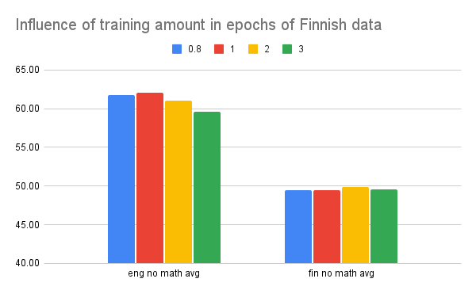

In addition to the CulturaX dataset we consider the FineWeb2 and HPLT v2 datasets. In these experiments we train the model for one full epoch of the Finnish data from each dataset. As these datasets vary slightly in size, they are not compute equivalent, but instead shed light on the differences between openly available datasets. In our experiments FineWeb2 showed the best performance for Finnish, whereas HPLT v2, despite being the largest of the datasets, resulted in weakest performance. The results of this comparison are shown below; while all datasets performed well, FineWeb2 delivered the best Finnish results, making it our choice for the final data mix.

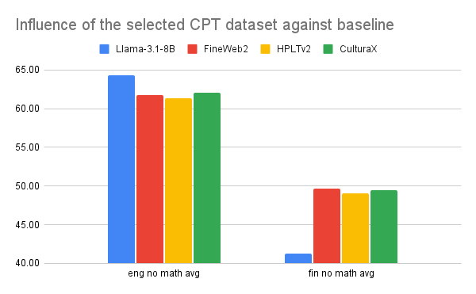

To enhance the cross-lingual transfer, we also conduct experiments varying the amount of Finnish-English parallel data from the Tatoeba Challenge corpus in the overall mix. We do not observe overall improvements in the model performance with this data, although more of it does improve the model’s translation capabilities slightly. For simplicity we exclude this data source in our final data mix.

As we observe some degradation in English, code and math evaluations with our initial data mix, after experimentation we adjust the final data mix to 30% Finnish, 30% English, 30% code and 10% math data, aiming to provide a balance of data in all critical domains, and find that this mix meets our performance goals. We train the released models for one epoch of Finnish FineWeb2 data, resulting in 165B tokens overall with this data mix (see table below). This data mix not only maintains the original model capabilities we’re concerned with, but substantially improves Finnish performance.

| Domain | Data source | Proportion (%) | Tokens |
| :---- | :---- | :---- | :---- |
| Finnish | FineWeb2 | 30 | 50B |
| English | FineWeb-Edu | 30 | 50B |
| Code | StarCoder | 30 | 50B |
| Math | FineMath | 10 | 16B |
| **Total** |  | **100** | **165B** |

As a final experiment we measure the impact of weight decay.  Some reported results use our (Megatron-LM) default value of 0.1, but smaller values are often used as well.  In our test run a lower value of 0.01 did not measurably affect downstream eval performance, so we stay with the default 0.1 weight decay for our final training run.

### Experimental Runs Summary

Through systematic experimentation, we determined our final, optimized configuration. The key findings were: 1) a higher learning rate (3E-04 for 8B) was effective; 2) repeating data did not improve performance; 3) FineWeb2 was the best-performing Finnish dataset; and 4) a balanced data mix of 30% Finnish, 30% English, 30% code, and 10% math was crucial for preventing catastrophic forgetting. This configuration, detailed in the table above, formed the basis for our final pretraining run.

## Final Pretraining Results and Analysis

Following the methodology and optimized configuration determined in the previous sections, we proceeded with the full continued pretraining run. This section presents the final evaluation results and provides an analysis of the outcomes for both the 8B and 70B models.

Our Continued Pretraining significantly improved Finnish performance across our evaluation set, while largely maintaining (and in some cases improving) English performance. The improvement is much more pronounced in the smaller 8B model compared to the larger 70B model, but the smaller model was improving from a much lower point of initial capability.

Before CPT, the base models likely saw similar data distributions, including only a very small amount of Finnish data.  Despite this, the 70B model exhibited significantly better initial Finnish performance, likely due to its greater capacity and higher sample efficiency, allowing it to generalize better from limited exposure.  This size advantage is also reflected in the higher Finnish performance of the 70B model after CPT.

The table below presents a detailed breakdown of these results across our full suite of pretraining evaluations.

|  | Llama-3.1-8B | Poro 2 8B base | Llama-3.1-70B | Poro 2 70B base |
| :---- | ----- | ----- | ----- | ----- |
| arc\_challenge | 57.94 | **60.75** | 69.45 | **69.97** |
| hellaswag | 80.05 | **80.55** | 87.81 | **87.85** |
| mmlu | **65.08** | 63.48 | **78.59** | 78.20 |
| truthfulqa\_mc | **54.02** | 48.06 | 49.78 | **51.43** |
| gsm8k | **78.01** | 54.81 | 81.05 | **81.35** |
| **eng no math avg** | **64.27** | 63.21 | 71.41 | **71.86** |
| **eng total avg** | **67.02** | 61.53 | 73.34 | **73.76** |
| arc\_challenge\_mt\_fi | 38.82 | **48.90** | 54.52 | **61.01** |
| hellaswag\_mt\_fi | 30.97 | **50.49** | 52.10 | **58.07** |
| mmlu\_mt\_fi | 49.64 | **56.25** | 71.29 | **73.76** |
| truthfulqa\_mc\_mt\_fi | 45.54 | **49.78** | 53.64 | **55.53** |
| gsm8k\_mt\_fi | 30.93 | **44.43** | 69.90 | **72.78** |
| **fin no math** | 41.24 | **51.35** | 57.89 | **62.09** |
| **fin total avg** | 39.18 | **49.97** | 60.29 | **64.23** |
| flores200 en\_fi bleu | 23.92 | **36.48** | 35.02 | **40.03** |
| flores200 fi\_en bleu | 37.42 | **40.71** | 41.67 | **43.04** |
| flores200\_en\_fi chrf | 50.36 | **60.14** | 59.16 | **62.50** |
| flores200\_fi\_en chrf | 60.44 | **62.90** | 63.03 | **64.16** |
| **translation avg** | 43.03 | **50.06** | 49.72 | **52.43** |
| humaneval\_pass@1 | **35.97** | 31.09 | **57.3** | 48.78 |
| humaneval\_pass@10 | **53.66** | 48.17 | **73.17** | 64.63 |

### Poro 2 8B

For the 8B model our approach leads to a consistent improvement in all Finnish benchmarks, with \~10pp average improvement. We are also able to maintain most of the original English capabilities with a 1pp average decrease in our evaluations.

Although we observe almost 14pp improvement on the Finnish GSM8K math evaluation, we are not able to maintain the original Llama 3.1 performance on the English variant of GSM8K. If higher math performance is critical, adding more math data to the mix, or annealing with a higher mix of high quality math data would help improve performance.

### Poro 2 70B

Llama 3.1 70B has considerably stronger initial Finnish capabilities than the smaller variant, but our continued pretraining approach still provides improvements in all of our Finnish benchmarks. The larger model is also able to maintain, and in most cases even improve, on its English capabilities.  Overall Finnish scores improve by an average of \~4pp, while English capabilities remain largely the same with a \~0.4pp average improvement.

### Performance Trade-offs: Code and Math

Our primary goal for this project was to significantly enhance Finnish language capabilities. The results demonstrate clear success on that front. However, this focus on language acquisition revealed the challenges of maintaining performance in specialized domains when the original training data is unknown.

On the humaneval benchmark, for instance, our Poro 2 models do not match the performance of the original Llama 3.1 models. This is a common challenge in continued pretraining. Without access to the original pretraining dataset, it is difficult to replicate the exact data quality and domain balance that gave the base model its initial capabilities. While our data mix included a substantial portion of code (30% from StarCoder), the performance gap suggests that the composition or quality of the original data was different from our own.

This highlights a key principle of CPT: performance is highly sensitive to the data mix, and adapting a model often involves navigating trade-offs between new and existing capabilities, especially with incomplete knowledge of the original training recipe. For projects where coding or math proficiency is the highest priority, one might need to experiment with different data allocations or seek out more specialized, high-quality datasets for those domains.

### Final Pretraining Results Summary

The final results confirm that our CPT strategy was highly effective at its primary goal: we achieved significant gains in Finnish across all benchmarks. The analysis also highlights the critical nature of data mixing and model size in managing performance trade-offs. While the larger 70B model showed more resilience, the performance drops in specialized domains like coding and math underscore the challenges of CPT when the original training data is unknown. This demonstrates that CPT is a powerful method for language acquisition, provided that data mixes are carefully balanced to align with a project's specific priorities.

## Post-training

After continued pretraining, the base models are proficient in Finnish but are not yet helpful assistants. The post-training phase aligns the models to follow instructions and engage in conversation. This section details our full post-training pipeline, including the new evaluation benchmarks we used for this phase, our supervised fine-tuning (SFT) and direct preference optimization (DPO) processes, and the datasets we selected and generated.

### Post-training evaluation

We evaluate our post-training checkpoints on general instruction following and open-ended conversational following in English and Finnish.

#### MTBench

MTBench is a multi-turn open-ended conversation benchmark that uses LLM-as-judge to score the model’s responses \[[Zheng et al.](https://arxiv.org/abs/2306.05685)\]. For Finnish, we machine-translated and manually corrected the MTBench questions into Finnish. We integrated a language identifier so that responses that are not in Finnish are given the lowest possible score of 1\. We use [GlotLID](https://huggingface.co/cis-lmu/glotlid) as our language identifier.

Code base: [https://github.com/LumiOpen/FastChat](https://github.com/LumiOpen/FastChat)

Translation: [https://huggingface.co/datasets/LumiOpen/mtbench\_multi](https://huggingface.co/datasets/LumiOpen/mtbench_multi)

#### AlpacaEval 2

AlpacaEval is a single-turn chat benchmark that uses an LLM to pick a preference between the model’s responses and a set of baseline responses from a SOTA model such as GPT-4. We use the length-controlled AlpacaEval 2 that has been shown to have a higher correlation with the Chat Arena than MTBench \[[Dubois et al.](https://arxiv.org/abs/2404.04475)\]. We machine-translated and manually corrected the questions in AlpacaEval into Finnish. We also integrated a language identifier into the evaluation so that the baseline always will be preferred in cases where the model answer is not in Finnish.

Code base: [https://github.com/LumiOpen/alpaca\_eval](https://github.com/LumiOpen/alpaca_eval)

Translation: [https://huggingface.co/datasets/LumiOpen/alpaca\_eval\_multi](https://huggingface.co/datasets/LumiOpen/alpaca_eval_multi)

For AlpacaEval and MTBench, we use GPT-4o as the judge, because it is cheaper than other popular judge models such as GPT-4 Turbo and a more up-to-date model.

#### IFEval

IFEval is an instruction following benchmark where the correctness of the model’s responses can be verified programmatically \[[Zhou et al.](https://arxiv.org/abs/2311.07911)\]. We machine-translated and manually corrected the IFEval instructions into Finnish.

We integrated the Finnish IFEval into our fork of LM Eval Harness: [https://github.com/LumiOpen/lm-evaluation-harness](https://github.com/LumiOpen/lm-evaluation-harness)

Translation: [https://huggingface.co/datasets/LumiOpen/ifeval\_mt](https://huggingface.co/datasets/LumiOpen/ifeval_mt)

### Post-training process

Post-training is a process that trains a pretrained model to act as an assistant that can respond to user prompts and follow instructions. Our post-training pipeline involves one round of supervised fine-tuning (SFT) followed by preference tuning, specifically direct preference optimization (DPO). We use the Transformers Reinforcement Learning library (TRL) as our post-training framework.

Our post-training codebase is a fork of the Alignment Handbook \[[Tunstall et al.](https://arxiv.org/abs/2310.16944)\]. We make our codebase and recipes available at: [https://github.com/LumiOpen/alignment-handbook](https://github.com/LumiOpen/alignment-handbook). Please refer to the alignment handbook repository for details on how to run the code.

#### SFT

We perform full-parameter supervised fine-tuning with a curated English and Finnish instruction dataset.  For the 8B model, we used a global batch size of 64\. We packed samples and used a maximum sequence length of 4,096 tokens. For 70B, we used a global batch size of 128\. For 8B we used 4 nodes, while for 70B we used 8 nodes. A summary of our SFT hyperparameters is shown below.

|  | 8B | 70B  |
| :---- | :---- | :---- |
| Epochs | 2 | 2 |
| Global batch size | 64 | 128 |
| Micro batch size | 2 | 1 |
| Gradient acc steps | 1 | 2 |
| Learning rate | 5e-6 | 5e-6 |
| LR scheduler | linear | linear |
| Warmup ratio | 0.03 | 0.03 |
| Max seq length | 4,096 | 4,096 |

#### DPO

We perform one round of DPO after SFT to further improve the quality of the model responses. We use the HelpSteer3 dataset for preference tuning because it has an open license and  achieved improvements relative to the SFT checkpoint that exceeded other preference datasets in our experiments (see **DPO dataset** section).

We used 4 nodes of AMD Instinct MI250X GPUs for the 8B model and 8 nodes for the 70B model. Our DPO parameters are shown below.

|  | 8B | 70B |
| :---- | :---- | :---- |
| Epochs | 3 | 3 |
| Global batch size | 64 | 64 |
| Micro batch size | 2 | 1 |
| Gradient acc steps | 1 | 1 |
| Beta | 0.01 | 0.01 |
| Learning rate | 5e-7 | 5e-7 |
| LR scheduler | cosine | cosine |
| Warmup ratio | 0.1 | 0.1 |
| Max length | 4,096 | 4,096 |

### Datasets available

There are a large number of post-training datasets currently available with varying levels of quality and diversity, most of them in English. Our SFT data mixture is built around the prompts from the [Tulu 3 SFT mix](https://huggingface.co/datasets/allenai/tulu-3-sft-mixture), which are targeted towards improving a model's abilities on a large number of tasks.  We combine prompts from this dataset with several others to create a diverse, bilingual instruction set.

#### SFT dataset

We generated most of our English SFT dataset by taking the prompts from the Tulu 3 SFT mix and generating responses from Llama 3.3 70B Instruct, though we retained the original Tulu 3 conversations for the selected prompts that contained multi-turn conversations, to help support multi-turn conversational performance.

We also generated multi-turn samples by self-synthesizing prompts and their completions over multiple turns based on the techniques in the Magpie paper \[[Xu et al.](https://arxiv.org/abs/2406.08464)\].

For Finnish, we machine translated the prompts into Finnish and used Llama 3.3 70B Instruct to generate responses to the translated prompts. We filtered out samples where the responses are not in Finnish.

We incorporated the top-rated English and Finnish conversations from the Open Assistant 2 dataset to improve the models’ conversational skill. Open Assistant is a crowd-sourced dataset of conversations generated and annotated by volunteers \[[Köpf et al.](https://proceedings.neurips.cc/paper_files/paper/2023/hash/949f0f8f32267d297c2d4e3ee10a2e7e-Abstract-Datasets_and_Benchmarks.html)\]. We also added Finnish conversations from [Avoin Avustaja](https://avoin-avustaja.fi/), a crowd-sourced dataset inspired by the OpenAssistant project. Lastly, we added English-Finnish (and vice-versa) translation samples from EuroParl \[[Koehn](https://aclanthology.org/2005.mtsummit-papers.11/)\].

Our final SFT data mixture contains 1.4M samples from the following datasets:

1. English Tulu 3 prompts with Llama-3.3-70B-Instruction responses (700K)
2. Finnish Tulu 3 prompts with Llama-3.3-70B-Instruction responses (650K)
3. De-duplicated English Magpie multi-turn conversations (14K)
4. Top-rated English and Finnish [OASST2](https://huggingface.co/datasets/OpenAssistant/oasst2) data (5K)
5. [EuroParl](https://huggingface.co/datasets/Helsinki-NLP/europarl) English-Finnish (vice-versa) translation data (1K)
6. [Avoin Avustaja](https://huggingface.co/datasets/TurkuNLP/avoin-avustaja-unfiltered) Finnish multi-turn conversations (100)

We generated all or part of the contents of the first three datasets while the latter three are preexisting. We make the full combined dataset available [here](https://huggingface.co/datasets/LumiOpen/poro2-instruction-collection).

#### DPO dataset

With an 8B SFT checkpoint, we experimented with preference datasets of varying sizes:

* [HelpSteer2](https://huggingface.co/datasets/nvidia/HelpSteer2) (7k)
* [HelpSteer3](https://huggingface.co/datasets/nvidia/HelpSteer3) (30k)
* [Ultrafeedback](https://huggingface.co/datasets/HuggingFaceH4/ultrafeedback_binarized) (60k)
* [Tulu-3-8b-preference-mixture](https://huggingface.co/datasets/allenai/llama-3.1-tulu-3-8b-preference-mixture) (270k)
* [HelpSteer2](https://huggingface.co/datasets/nvidia/HelpSteer2) English-Finnish (13k)
* [HelpSteer3](https://huggingface.co/datasets/nvidia/HelpSteer3) English-Finnish (45k)

The relatively small sizes of HelpSteer2 and 3 made it feasible for us to machine-translate these datasets into Finnish and experiment with the combined English-Finnish datasets. HelpSteer3 has multilingual samples but we excluded the non-English data for training and translation in order to focus our efforts on English and Finnish. We found that HelpSteer3 (without Finnish translations) is on par with the bilingual version and outperformed the other DPO datasets. We use HelpSteer3 (English only) in our subsequent DPO runs.

### Post-training Summary

Our post-training pipeline was a multi-stage process designed to transform the CPT base models into helpful assistants. We established a new suite of chat and instruction-following evaluations for this phase. The process involved a full-parameter SFT on a large, custom-bilingual dataset, followed by DPO using the open-license HelpSteer3 dataset to further refine the models' helpfulness and safety.

## Synthetic Data Generation

A core component of our post-training strategy was the creation of high-quality, bilingual instruction data. As off-the-shelf Finnish instruction datasets are scarce, we developed a pipeline for generating our own synthetic data. This section describes our process, from the inference framework and reward models used for selecting high-quality responses to our approach for creating multi-turn conversations.

We first translated the selected Tulu 3 prompts to Finnish. We then generated multiple responses to each prompt, and then finally we selected the highest quality response from the available generations.

### SFT prompt selection

We did not use the full set of Tulu 3 prompts for our SFT phase.  We filtered out the subset of prompts that came from non-commercially usable datasets, removed non-English prompts, and then deduplicated the remaining prompts.  These selected prompts were used as the basis for our synthetic data work.

### Inference Pipeline

In order to do large scale inference on Slurm with batch jobs, we utilized our internally developed [dispatcher framework](https://github.com/LumiOpen/dispatcher). Dispatcher makes it easy to horizontally scale inference workloads, handles resuming work if a job ends before the task is complete, and avoids the need to pre-partition the data for workers.

When generating potential model responses, we generated up to 64 parallel responses to each prompt, then selected a high quality response from among the possible options using a reward or judge model.

### Reward Models

#### ArmoRM

For English we used [ArmoRM](https://huggingface.co/RLHFlow/ArmoRM-Llama3-8B-v0.1) in the dispatcher framework to select among the best responses for each prompt.

#### LLM-as-a-Judge

There was no readily available reward model for Finnish instruction following.  As a test, we tried providing Finnish data to the English-oriented ArmoRM model and confirmed that it did not improve model performance on post-training evals beyond that achieved with random selection.

Ultimately, we adapted prompts from \[[Yuan et al.](https://arxiv.org/abs/2401.10020)\] to rate Finnish responses separately for both quality and fluency on a 5 point scale, then combined the scores to select a prompt that does well in each dimension.

We had hoped that fluency rating might be a way to spot and remove obvious dysfluencies in the Finnish synthetic post-training data, but our experiments with fluency rating yielded limited results; when human raters spot checked fluency scores they were unable to reliably differentiate between high- and low-rated generations.  We intend to return to this problem in future work.

### Multi-Turn Instruction Following

Using only single-turn instruction data during SFT results in a model that cannot follow multi-turn conversation.  To supplement the multi-turn samples from Tulu 3, we generated more multi-turn conversations in English using the Magpie method \[[Xu et al.](https://arxiv.org/abs/2406.08464)\]. The key insight of Magpie is that when an instruction-tuned model is given the chat template for the user side of the conversation, but without any user query, the model will generate its own prompt because of the autoregressive nature of the model. The model can then respond to its self-generated prompt. A subsequent conversation turn can be generated by prepending the previous turn to the user template. We found, however, that the Llama models did not reliably generate well-formed conversations in this setting and that we needed a slightly more complex multi-step prompting approach to clean up the generated data.

### Synthetic Data Generation Summary

Our synthetic data pipeline was a critical enabler for post-training. By using a dispatcher for large-scale inference and leveraging reward models (ArmoRM for English, LLM-as-a-Judge for Finnish), we generated the necessary SFT data. While our fluency rating experiments for Finnish yielded limited results, the overall pipeline successfully produced the data needed to align the Poro 2 models.

## Final Post-Training Results and Analysis

The culmination of our work is the performance of the final, post-trained models. This section presents the results on our chat and instruction-following benchmarks, comparing the Poro 2 models against their Llama 3.1 and 3.3 counterparts to quantify the improvements in both Finnish and English.

For post-training, we evaluate the models on IFEval, MTBench, and AlpacaEval in both English and Finnish. While the charts below show the averaged performance across these benchmarks, a complete breakdown of the individual scores for both the 8B and 70B models is available in the Appendix.

Our final 8B models show a clear advantage in Finnish. As illustrated in the chart below, the Poro 2 8B SFT and DPO checkpoints significantly outperform Llama 3.1 8B Instruct in Finnish while effectively maintaining English capability. The averaged results show that our SFT checkpoint outperforms Llama by around 16% in Finnish, and the DPO checkpoint widens this gap even more, outperforming Llama 8B by around 24%.

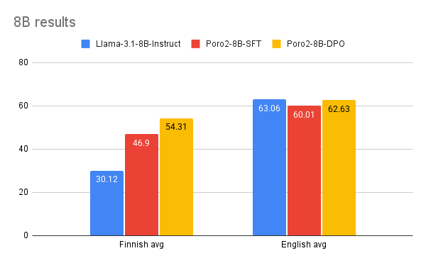

In a head-to-head pairwise comparison on MTBench, the final Poro 2 8B DPO checkpoint achieves an adjusted win rate of 85% against Llama 3.1 8B Instruct in Finnish and 49% in English. Moreover, Poro 2 8B DPO has an adjusted win rate of 51% over the much larger Llama 3.3 70B Instruct in Finnish.

The 70B models tell a similar story, outperforming even the newer Llama 3.3 70B Instruct model in Finnish. The Poro 2 70B SFT checkpoint shows a notable improvement over Llama 3.1 70B Instruct and is on par with Llama 3.3 70B Instruct. Our final DPO checkpoint improves even further, outperforming Llama 3.3 in Finnish by over 6% and Llama 3.1 by over 11%. In English, our model is on par with Llama 3.3 70B Instruct and outperforms Llama 3.1 70B Instruct.

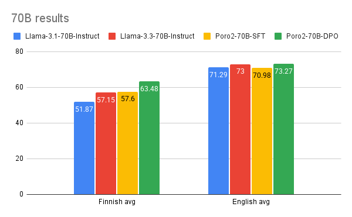

In a pairwise comparison on MTBench, Poro 2 70B DPO has an adjusted win rate of 66% in Finnish and 57% in English over Llama 3.3 70B Instruct.

Overall, these results show that the Poro 2 models have substantially improved Finnish performance over the Llama 3 models while maintaining their English proficiency.

## Summary

In this playbook, we set out to provide a clear, replicable roadmap for adapting a powerful, English-centric LLM to a new language. We demonstrated this process by creating the Poro 2 family, a set of Llama 3.1 models with excellent Finnish capabilities, trained on AMD Instinct MI250X GPUs.

For practitioners seeking to replicate this process, this guide has delivered both the methodology and the key learnings from our journey. The main takeaways are:

* **Start with Strength**: The single best predictor for success in a new language is the base model's capability in a high-resource language like English.
* **Refine the Data Mix**: A balanced data mix—in our case, 30% Finnish, 30% English, 30% code, and 10% math—was crucial for preventing catastrophic forgetting.
* **A Pragmatic Pipeline is Key**: Success requires a full-stack approach, including a robust evaluation suite, a pragmatic machine translation strategy, and a multi-stage post-training process (SFT and DPO).

The release of the Poro 2 models is an important milestone, but the work doesn't stop here. Our results open up several exciting avenues for future improvement. We aim to enhance our synthetic data pipeline, especially for multi-turn conversations and verifiable instruction-following. We are also exploring techniques to extend the tokenizer for better Finnish efficiency, experiment with annealing and mid-training data mixes, and adapt these methods for long-context models. By following the steps outlined here and building upon these future directions, developers and researchers can significantly lower the barrier to creating high-performance, multilingual AI, fostering innovation beyond the English-speaking world.

## Appendix

### Complete 8B post-training results

|  | Llama-3.1-8B-Instruct | Poro2-8B-SFT | Poro2-8B-DPO |
| :---- | ----- | ----- | ----- |
| IFEval\_fi | 47.31 | 64.69 | **66.54** |
| MTBench\_fi | 4.1 | 5.92 | **6.75** |
| AlpacaEval2\_fi | 2.05 | 16.8 | **28.89** |
| **Finnish avg** | 30.12 | 46.9 | **54.31** |
| IFEval | 79.48 | **79.66** | 79.29 |
| MTBench | **7.7** | 7.07 | 7.33 |
| AlpacaEval2 | 32.7 | 29.67 | **35.3** |
| **English avg** | **63.06** | 60.01 | 62.63 |

### Complete 70B posttraining results

|  | Llama-3.1-70B-Instruct | Llama-3.3-70B-Instruct | Poro2-70B-SFT | Poro2-70B-DPO |
| :---- | ----- | ----- | ----- | ----- |
| IFEval\_fi | 63.95 | **71.71** | 70.05 | 70.79 |
| MTBench\_fi | 7.06 | 7.4 | 7.2 | **7.77** |
| AlpacaEval2\_fi | 21.06 | 25.73 | 30.74 | **41.96** |
| **Finnish avg** | 51.87 | **57.15** | 57.6 | **63.48** |
| IFEval | 86.69 | **90.38** | 89.46 | 85.95 |
| MTBench | 8.33 | 8.35 | 8.03 | **8.41** |
| AlpacaEval2 | 43.87 | 45.12 | 43.18 | **49.77** |
| **English avg** | 71.29 | 73 | 70.98 | **73.27** |
