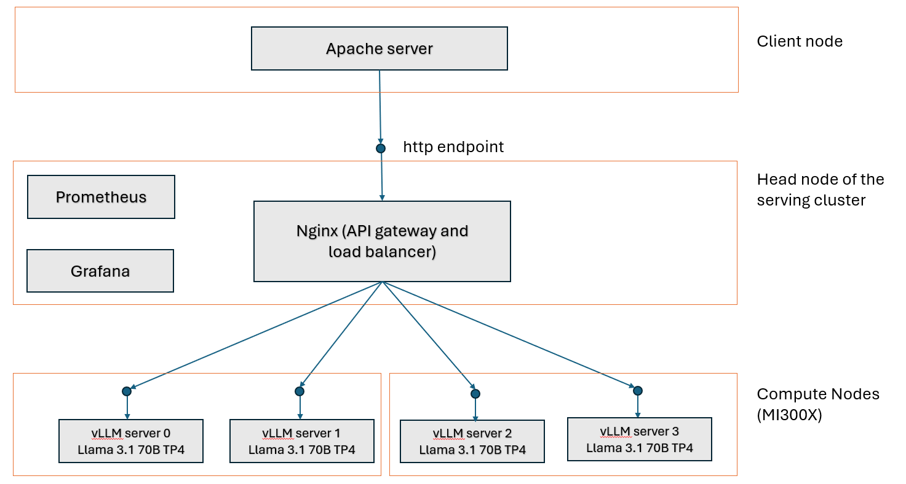
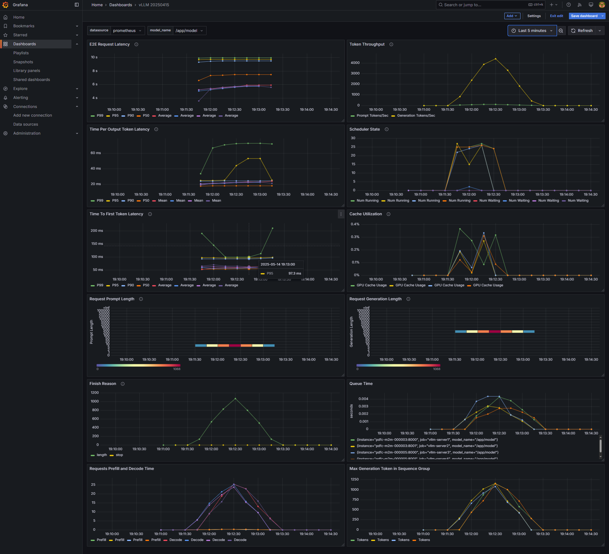
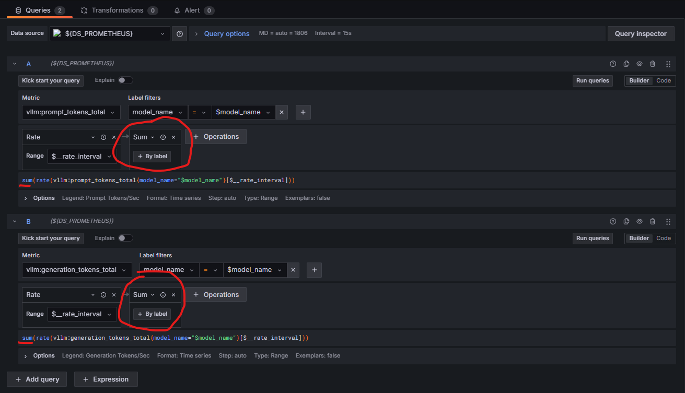
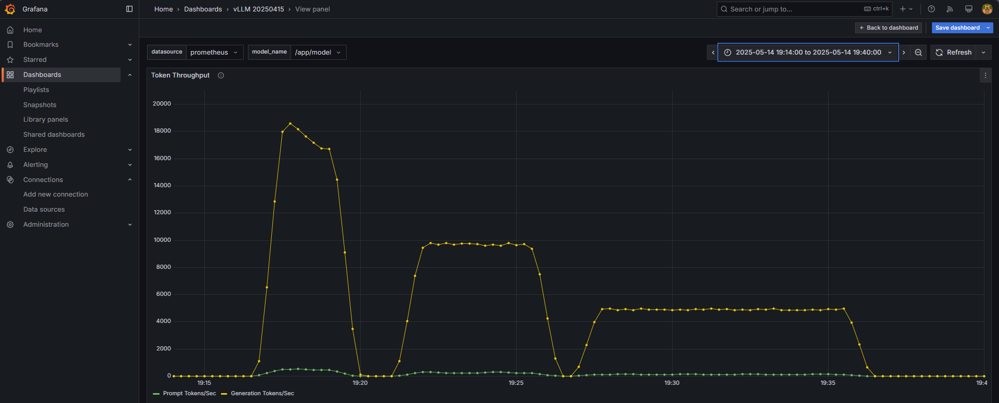

<!---
Copyright (c) 2025 Advanced Micro Devices, Inc. (AMD)

Permission is hereby granted, free of charge, to any person obtaining a copy
of this software and associated documentation files (the "Software"), to deal
in the Software without restriction, including without limitation the rights
to use, copy, modify, merge, publish, distribute, sublicense, and/or sell
copies of the Software, and to permit persons to whom the Software is
furnished to do so, subject to the following conditions:

The above copyright notice and this permission notice shall be included in all
copies or substantial portions of the Software.

THE SOFTWARE IS PROVIDED "AS IS", WITHOUT WARRANTY OF ANY KIND, EXPRESS OR
IMPLIED, INCLUDING BUT NOT LIMITED TO THE WARRANTIES OF MERCHANTABILITY,
FITNESS FOR A PARTICULAR PURPOSE AND NONINFRINGEMENT. IN NO EVENT SHALL THE
AUTHORS OR COPYRIGHT HOLDERS BE LIABLE FOR ANY CLAIM, DAMAGES OR OTHER
LIABILITY, WHETHER IN AN ACTION OF CONTRACT, TORT OR OTHERWISE, ARISING FROM,
OUT OF OR IN CONNECTION WITH THE SOFTWARE OR THE USE OR OTHER DEALINGS IN THE
SOFTWARE.
--->

# Scale LLM Inference with Multi-Node Infrastructure

Horizontal scaling of compute resources has become a critical aspect of modern computing due to the ever-increasing growth in data and computational demands. Unlike vertical scaling, which focuses on enhancing an individual system’s resources, horizontal scaling enables the expansion of a system’s capabilities by adding more instances or nodes working in parallel. In this way, it ensures high availability and low latency of the service, making it essential to handle diverse workloads and ensure optimal user experience.

This blog describes how to set up a multi-node inference infrastructure for a popular Large Language Model (LLM) [Llama 3.1 70B](https://huggingface.co/meta-llama/Llama-3.1-70B) using open source software on MI300X platforms. [vLLM](https://docs.vllm.ai/en/stable/getting_started/quickstart.html) is used to power the LLM servers to run inferences on the Llama model. The infrastructure utilizes [nginx](https://nginx.org/en/) to provide web server functionality and workload balancing between multiple server instances. The blog also describes how to set up [Prometheus](https://prometheus.io/docs/introduction/overview/) and [Grafana dashboard](https://grafana.com/grafana/) to monitor performance of the cluster. [Apache Bench](https://httpd.apache.org/docs/2.4/programs/ab.html) is used to simulate a workload to the environment for the purpose of benchmarking and illustrate monitoring of the infrastructure.

## Requirements

To follow along with this blog, you need:

- Two MI300X nodes with ROCm 6.3+ installed to host the vLLM servers.
- One server node to host the nginx server. The head node can be used for this purpose.
- One server node to run the client-side inference requests through Apache Bench.
- All nodes need to have Docker installed.

## System Architecture

The system architecture presented in this blog (see diagram below) follows a standard distributed computing architecture where the serving capacity is scaled horizontally by adding LLM servers on additional compute resources. We also divide the GPUs on each MI300X server to stand up two vLLM server instances on each of them, resulting in four vLLM instances in total with two MI300X servers.  The details on how we setup the vLLM server instances will be discussed in the next section.



## Setup vLLM Servers

[vLLM](https://docs.vllm.ai/en/stable/index.html) is one of the most popular open source LLM serving platforms. vLLM optimizes LLM serving by using innovative algorithms such as Paged Attention and continuous batching to improve GPU utilization, increase throughput, and reduce latency. This section will walk through the steps to start multiple vLLM servers in a cluster. For more details on using vLLM with ROCm, please visit our [blog on vLLM](https://rocm.blogs.amd.com/artificial-intelligence/vllm/README.html) and our [tutorial on deploying vLLM](https://rocm.docs.amd.com/projects/ai-developer-hub/en/latest/notebooks/inference/3_inference_ver3_HF_vllm.html).

To configure the vLLM inference backend layer, disable automatic NUMA balancing on *every* compute node in the cluster that will power the vLLM servers as [recommended](https://instinct.docs.amd.com/projects/amdgpu-docs/en/latest/system-optimization/mi300x.html#disable-numa-auto-balancing) by AMD to mitigate the overhead incurred during memory scanning and binding operations.

```bash
# disable automatic NUMA balancing 
sh -c 'echo 0 > /proc/sys/kernel/numa_balancing' 
# check if NUMA balancing is disabled (returns 0 if disabled) 
cat /proc/sys/kernel/numa_balancing 
0 
```

Download the model Llama 3.1 70B from [Hugging Face](https://huggingface.co/meta-llama/Llama-3.1-70B) to the desired path `<path to model>` on *every* compute node to store the model weights.

On each compute node, start a docker container with the image `rocm/vllm:latest`.

```bash
docker pull rocm/vllm:latest
docker run -it --rm \
--shm-size=32GB \
--ipc=host \
--network=host \
--device=/dev/kfd \
--device=/dev/dri \
--device=/dev/mem \
--group-add video \
--privileged \
--cap-add=CAP_SYS_ADMIN \
--security-opt seccomp=unconfined \
--security-opt apparmor=unconfined \
-v  <path to model>:/app/model \
rocm/vllm:latest
```

Suppose we want to start a vLLM server using all 8 GPUs with tensor parallelism on a MI300X node, we can do that by running the following command:

```bash
vllm serve /app/model --dtype float16 -tp 8 --port <port number>
```

The vLLM server is ready to serve requests when the line `INFO:     Application startup complete.` appears.

```bash
INFO 05-08 23:06:48 [__init__.py:239] Automatically detected platform rocm.
INFO 05-08 23:06:50 [api_server.py:1034] vLLM API server version 0.8.3.dev350+gc43debd43
...
INFO:     Started server process [17]
INFO:     Waiting for application startup.
INFO:     Application startup complete.
```

Depending on the size of the LLM, not all 8 GPUs on a MI300X server are needed to power a vLLM server instance. This blog uses Llama 3.1 70B, which can be comfortably fit in a single GPU, to illustrate the setup. To run multiple vLLM server instances of this model on the same MI300X server node, specify different ports for each server node, and use `ROCR_VISIBLE_DEVICES` to isolate each instance to different groups of GPU on the server node. In this blog, we are going to run two vLLM server instances on each MI300X server node with tensor parallelism on 4 GPUs: one on port `8000` using `GPU 0,1,2,3` and another one on port `8001` using `GPU 4,5,6,7`. To start the two vLLM instances in this manner, run the following commands on *every* MI300X server node:

```bash
ROCR_VISIBLE_DEVICES=0,1,2,3 vllm serve /app/model --dtype float16 -tp 4 --port 8000  
ROCR_VISIBLE_DEVICES=4,5,6,7 vllm serve /app/model --dtype float16 -tp 4 --port 8001
```

After finishing the above steps on both MI300X server nodes, there are 4 vLLM instances that can serve the Llama 3.1 70B model concurrently.

## API Gateway and Load Balancer

In this blog, [nginx](https://nginx.org/en/) is used to provide an API gateway as well as load balancer for web requests sent to the LLM servers. Other gateways such as [LiteLLM](https://docs.litellm.ai/docs/) can also be used. To stand up the web server with an API gateway, first create the following Dockerfile `Dockerfile.nginx` for nginx on the head node of the cluster:

```bash
FROM nginx:latest 
RUN rm /etc/nginx/conf.d/default.conf 
EXPOSE 80 
CMD ["nginx", "-g", "daemon off;"]
```

```{note}
The default HTTP port for running NGINX is 80, but it can be changed to any desired port using the EXPOSE parameter in the Dockerfile.nginx file.
```

Next, build the container `nginx-lb`:

```bash
docker build . -f Dockerfile.nginx --tag nginx-lb 
```

Create a config file `nginx_conf/nginx.conf` that captures the vLLM servers in the cluster. As described in the previous section, due to the enormous High-bandwidth memory (HBM) memory on each MI300 GPU (192 GB), it is possible to stand up multiple vLLM servers on each MI300X node for most of the popular GenAI models. In our example, there are two vLLM servers running on each MI300X server node, each with a different port number. Make sure the server node host name (or IP) and port number for each vLLM server are specified correctly in the config file.

```bash
upstream backend {
    least_conn;
    server <host name (or IP) of server node 0>:8000 max_fails=3 fail_timeout=10000s;
    server <host name (or IP) of server node 0>:8001 max_fails=3 fail_timeout=10000s;
    server <host name (or IP) of server node 1>:8000 max_fails=3 fail_timeout=10000s;
    server <host name (or IP) of server node 1>:8001 max_fails=3 fail_timeout=10000s;;
}
server {
    listen 80;
    location / {
        proxy_pass http://backend;
        proxy_set_header Host $host;
        proxy_set_header X-Real-IP $remote_addr;
        proxy_set_header X-Forwarded-For $proxy_add_x_forwarded_for;
        proxy_set_header X-Forwarded-Proto $scheme;
    }
}
```

Launch the API gateway and load balancer powered by nginx by running the docker container with the image `nginx-lb:latest` and the config file `nginx_conf/nginx.conf`. As mentioned earlier, port 80 is the default port for nginx and is used in the command below, but feel free to choose any available port number of your choice.

```bash
docker run -itd -p 80:80 --network host -v ./nginx_conf/:/etc/nginx/conf.d/ --name nginx-lb nginx-lb:latest
```

Now we are ready to validate the vLLM server and API gateway setup configuration with a single request to the API gateway:

```bash
curl --verbose http://<nginx server host name (or IP)>:80/v1/completions -H "Content-Type: application/json" -d '{"prompt": " What is AMD Instinct?", "max_tokens": 256, "temperature": 0.0 }'
```

If the API gateway and vLLM servers are setup correctly, you should see something like this:

```bash
*   Trying 10.215.224.8:80...
* Connected to pdfc-int-00000C (10.215.224.8) port 80 (#0)
> POST /v1/completions HTTP/1.1
> Host: pdfc-int-00000C
> User-Agent: curl/7.81.0
> Accept: */*
> Content-Type: application/json
> Content-Length: 76
>
* Mark bundle as not supporting multiuse
< HTTP/1.1 200 OK
< Server: nginx/1.27.5
< Date: Thu, 08 May 2025 23:11:22 GMT
< Content-Type: application/json
< Content-Length: 1696
< Connection: keep-alive
<
{"id":"cmpl-69e8f2a86fd345c7a8b04953b53c247f","object":"text_completion","created":1746745878,"model":"/app/model","choices":[{"index":0,"text":" AMD Instinct is a line of high-performance computing (HPC) and artificial intelligence (AI) accelerators designed for datacenter and cloud computing applications. It is based on AMD's Radeon Instinct architecture and is optimized for a wide range of workloads, including HPC simulations, AI training, and deep learning inference.\n What are the key features of AMD Instinct? The key features of AMD Instinct include:\n High-performance computing (HPC) and artificial intelligence (AI) acceleration\n Support for a wide range of workloads, including HPC simulations, AI training, and deep learning inference\n Optimized for datacenter and cloud computing applications\n Based on AMD's Radeon Instinct architecture\n High-bandwidth memory (HBM) and high-speed interconnects for fast data transfer\n Scalable and flexible architecture for easy integration into existing datacenter * Connection #0 to host pdfc-int-00000C left intact
and cloud infrastructure\n What are the benefits of using AMD Instinct? The benefits of using AMD Instinct include:\n Improved performance and efficiency for HPC and AI workloads\n Increased scalability and flexibility for datacenter and cloud computing applications\n Reduced power consumption and cost for datacenter and cloud infrastructure\n Enhanced security and reliability for sensitive data and applications\n What are the use cases for AMD Instinct? The use cases for AMD Inst","logprobs":null,"finish_reason":"length","stop_reason":null,"prompt_logprobs":null}],"usage":{"prompt_tokens":7,"total_tokens":263,"completion_tokens":256,"prompt_tokens_details":null}}
```

## Benchmarking Performance of the Cluster

To ensure the cluster can handle the request volume from the users, it is a good idea to benchmark the performance before using it to support production traffic. [Apache Bench](https://httpd.apache.org/docs/2.4/programs/ab.html) is a popular tool to simulate requests with different volumes and benchmark the performance of HTTP servers. The Apache Bench tool can be run from a docker container started from an Apache server docker image. In the host for the Apache server, start the container (docker image `ubuntu/apache2:2.4-22.04_beta` is used in this example):

```bash
docker run -it --rm \
--shm-size=8GB \
--ipc=host \
--network=host \
--privileged --cap-add=CAP_SYS_ADMIN \
--entrypoint bash \
ubuntu/apache2:2.4-22.04_beta
```

Inside the container, create a file named `postdata` with the prompt request and config values for the LLM request.

```bash
{"prompt": "What is AMD Instinct?", "max_tokens": 256, "temperature": 0.0 }
```

Let’s simulate 10000 user requests with this prompt and benchmark the cluster performance using the following command:

```bash
ab -n 10000 -c 1000  -T application/json -p postdata http://<nginx server host name (or IP)>:80/v1/completions
```

The output should resemble the following:

```text
This is ApacheBench, Version 2.3 <$Revision: 1879490 $>
Copyright 1996 Adam Twiss, Zeus Technology Ltd, http://www.zeustech.net/
Licensed to The Apache Software Foundation, http://www.apache.org/

Benchmarking pdfc-m2m-000003 (be patient)
Completed 1000 requests
Completed 2000 requests
Completed 3000 requests
Completed 4000 requests
Completed 5000 requests
Completed 6000 requests
Completed 7000 requests
Completed 8000 requests
Completed 9000 requests
Completed 10000 requests
Finished 10000 requests


Server Software:        nginx/1.27.5
Server Hostname:        pdfc-m2m-000003
Server Port:            80

Document Path:          /v1/completions
Document Length:        1414 bytes

Concurrency Level:      1000
Time taken for tests:   151.479 seconds
Complete requests:      10000
Failed requests:        21
   (Connect: 0, Receive: 0, Length: 21, Exceptions: 0)
Total transferred:      15648026 bytes
Total body sent:        2260000
HTML transferred:       14138026 bytes
Requests per second:    66.02 [#/sec] (mean)
Time per request:       15147.907 [ms] (mean)
Time per request:       15.148 [ms] (mean, across all concurrent requests)
Transfer rate:          100.88 [Kbytes/sec] received
                        14.57 kb/s sent
                        115.45 kb/s total

Connection Times (ms)
              min  mean[+/-sd] median   max
Connect:        0    4   5.2      2      24
Processing:  3554 14406 1127.3  14489   26987
Waiting:     3530 14404 1128.0  14487   26982
Total:       3554 14410 1125.0  14490   26999

Percentage of the requests served within a certain time (ms)
  50%  14490
  66%  14855
  75%  15155
  80%  15346
  90%  15575
  95%  15715
  98%  15903
  99%  16052
 100%  26999 (longest request)
```

From the benchmark result, we can obtain important information such as the average throughput (66.02 requests/sec) and latency (15.148 ms). Note that the performance results in this example is not optimized and is for illustration purposes only.

We repeat this benchmark with only two and then one vLLM instance(s) to understand how the performance scales with available instances. The throughput and latency is summarized in the following table.

|                                  | 1 vLLM instances | 2 vLLM instances | 4 vLLM instances |
| -------------------------------- | :--------------: | :--------------: |  :-------------: |
| Throughput (requests per second) |      18.89       |     37.01        |     66.02        |
| Mean latency (ms)                |     52.932       |     27.019       |     15.148       |

The throughput goes up roughly linearly, while the latency goes down linearly, as the number of vLLM instances increases. This shows the setup is effective in scaling the volume of requests that the cluster can handle.

## Monitoring Performance of the Cluster

Performance metrics of a cluster of vLLM instances can be monitored using the [Prometheus/Grafana stack](https://docs.vllm.ai/en/stable/examples/online_serving/prometheus_grafana.html).

[Prometheus](https://github.com/prometheus) is an open-source systems monitoring and alerting toolkit and it has a very active developer and user community. Prometheus collects and stores its metrics as time series data, i.e. metrics information is stored with the timestamp at which it was recorded, alongside optional key-value pairs called labels. Prometheus metric logging is enabled by default in the vLLM OpenAI-compatible server.

[Grafana](https://grafana.com/grafana/) is an open-source data visualization and monitoring tool that helps users create interactive and informative dashboards by pulling data from various data sources. It is widely used for tracking performance metrics of applications, infrastructure, and network systems by visualizing data through charts, graphs, and tables. Grafana is popular among developers, system administrators, and DevOps professionals for efficiently monitoring, analyzing, and optimizing the performance of applications, infrastructures, and services.

To connect vLLM metric logging to Prometheus and Grafana, follow these steps on the head node of the cluster:

### Install Prometheus

Download and extract a stable release of the Prometheus binaries for the desired architecture in the head node of the cluster. In our case we use `prometheus-3.2.1.linux-amd64.tar.gz`:

```bash
wget https://github.com/prometheus/prometheus/releases/download/v3.2.1/prometheus-3.2.1.linux-amd64.tar.gz
tar -xvf prometheus-3.2.1.linux-amd64.tar.gz
```

Move to the `prometheus-3.2.1.linux-amd64/` directory.

```bash
cd prometheus-3.2.1.linux-amd64/
```

Update the file `prometheus.yml` to include vLLM server instances that we want to collect metrics from, and set the port where the metrics will be exposed (in this case we choose `9091`). The file looks like this after the update in our setup with four vLLM instances and port `9091`:

```bash
# my global config
global:
  scrape_interval: 15s # Set the scrape interval to every 15 seconds. Default is every 1 minute.
  evaluation_interval: 15s # Evaluate rules every 15 seconds. The default is every 1 minute.
  # scrape_timeout is set to the global default (10s).

# Alertmanager configuration
alerting:
  alertmanagers:
    - static_configs:
        - targets:
          # - alertmanager:9093

# Load rules once and periodically evaluate them according to the global 'evaluation_interval'.
rule_files:
  # - "first_rules.yml"
  # - "second_rules.yml"

# A scrape configuration containing exactly one endpoint to scrape:
# Here it's Prometheus itself.
scrape_configs:
  # The job name is added as a label `job=<job_name>` to any timeseries scraped from this config.
  - job_name: "prometheus"

    # metrics_path defaults to '/metrics'
    # scheme defaults to 'http'.

    static_configs:
      - targets: ["localhost:9091"]
  - job_name: "vllm-server1"
    static_configs:
      - targets: ["<host name (or IP) of server node 0>:8000"]
  - job_name: "vllm-server2"
    static_configs:
      - targets: ["<host name (or IP) of server node 0>:8001"]
  - job_name: "vllm-server3"
    static_configs:
      - targets: ["<host name (or IP) of server node 1>:8000"]
  - job_name: "vllm-server4"
    static_configs:
      - targets: ["<host name (or IP) of server node 1>:8001"]
```

Start Prometheus on the chosen port `9091`:

```bash
./prometheus --web.listen-address=:9091
```

It will take a couple of seconds for Prometheus to collect data about itself from its own HTTP metrics endpoint. You can also verify that Prometheus is serving metrics about itself by navigating to its metrics endpoint: `localhost:9091/metrics`.

### Install Grafana

Open another terminal on the head node. Download and extract Grafana stable release binaries for the desired architecture (it is `grafana-enterprise-11.5.2.linux-amd64.tar.gz` in our case):

```bash
wget https://dl.grafana.com/enterprise/release/grafana-enterprise-11.5.2.linux-amd64.tar.gz
tar -xvf grafana-enterprise-11.5.2.linux-amd64.tar.gz
```

Run Grafana on desired port (default is `3000`):

```bash
cd grafana-v11.5.2/bin/
./grafana server
```

### Open Grafana Dashboard

On your local machine, open a ssh tunnel to the head node of the cluster with this command:

```bash
ssh -L 3000:localhost:3000 <user name>@<head node name or IP address>
```

Navigate to `http://localhost:3000` on a web browser. Log in with the default username (admin) and password (admin).

To setup a Grafana dashboard to monitor the cluster performance. We need to add the Prometheus data source to a dashboard, and import the dashboard configuration for the dashboard.

### Add Prometheus Data Source

Navigate to `http://localhost:3000/connections/datasources/new` and select `Prometheus` as the data source for the dashboard.

### Import the vLLM Metrics Dashboard

Grafana dashboard is highly customizable to display various metrics in the dashboard. Rather than putting together a dashboard from scratch, we will use a configuration provided by vLLM. Copy `grafana.json` from the [Example materials section](https://docs.vllm.ai/en/latest/examples/online_serving/prometheus_grafana.html#example-materials) of the [vLLM guide to use Prometheus and Grafana](https://docs.vllm.ai/en/latest/examples/online_serving/prometheus_grafana.html).

Navigate to `http://localhost:3000/dashboard/import`, upload this `grafana.json`, and select the Prometheus data source. You should see a screen that looks like the following (assuming you have sent some request traffic to the API gateway):



The vLLM Grafana dashboard filters performance metrics per node. Therefore, when scaling from 1 to 2 or 4 vLLM instances, the total throughput must be aggregated in the “Token Throughput Panel” for both `prompt_tokens_total` and `generation_token_total` metrics. Select `Edit` in the menu for the `Token Throughput` panel of the dashboard (the one at the top right corner). Add an `Aggregation` operation and choose `Sum` for both metrics. You should have the queries for these two metrics setup as follows:



The following is a screenshot of how inference throughput (measured in tokens per second) appears in Grafana when scaling down from four to two and then one vLLM instance(s) while routing requests from Apache Bench through the API gateway as described earlier. Each of the three benchmark runs sends 10,000 requests to the API gateway. The load balancer distributes the requests based on the availability of different instances in the cluster. When there are four instances available, higher throughput (peak at ~18,500 tokens/sec) is achieved. When there is only one vLLM instance available, the peak throughput is only about 5,000 tokens/sec. It is also evident that the amount of time it took to process all the requests in each run goes up roughly linearly as the cluster size goes down due to the decrease in throughput.



## Summary

This blog provides a step-by-step guide on how to scale the capacity of a LLM serving cluster to handle user requests in production using open-source software. We have shown that the setup is effective in scaling up the capacity almost linearly as more compute resources are added to launch additional vLLM instances. While the infrastructure is demonstrated through selected technology stack (vLLM, nginx, Prometheus, Grafana, Apache server), these components can be replaced easily and still achieve similar scaling efficiency. For example, we have tested using [SGLang](https://docs.sglang.ai/references/amd.html) instead of vLLM as the LLM serving platform and observed similar results.  If you are interested in scaling LLM inference within a Kubernetes cluster, check out our blog on [deploying the open-source llm-d framework on AMD Kubernetes infrastructure](https://rocm.blogs.amd.com/artificial-intelligence/llm-d-distributed/README.html). Please experiment with your favorite technology components and let us know what you found.

## Disclaimers

Third-party content is licensed to you directly by the third party that owns the
content and is not licensed to you by AMD. ALL LINKED THIRD-PARTY CONTENT IS
PROVIDED “AS IS” WITHOUT A WARRANTY OF ANY KIND. USE OF SUCH THIRD-PARTY CONTENT
IS DONE AT YOUR SOLE DISCRETION AND UNDER NO CIRCUMSTANCES WILL AMD BE LIABLE TO
YOU FOR ANY THIRD-PARTY CONTENT. YOU ASSUME ALL RISK AND ARE SOLELY RESPONSIBLE
FOR ANY DAMAGES THAT MAY ARISE FROM YOUR USE OF THIRD-PARTY CONTENT.
