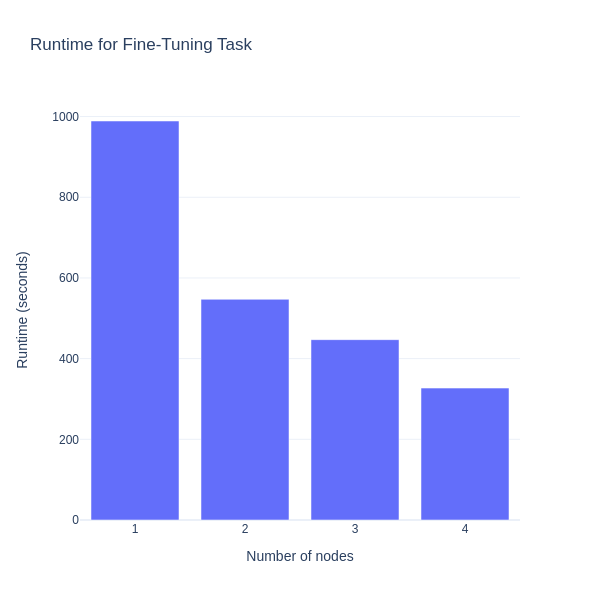

# Fine-tuning Phi-3.5-mini LLM at scale: Harnessing Accelerate and Slurm for multinode training

In this blog you will learn the process of fine-tuning the [`Phi-3.5-mini-instruct`](https://huggingface.co/microsoft/Phi-3.5-mini-instruct-onnx) Large Language Model (LLM) from Microsoft, using PyTorch in a multinode environment. The setup leverages the [Hugging Face Accelerate](https://huggingface.co/docs/accelerate/index) library to handle the complexities of multi-GPU and multinode synchronization. [Slurm](https://slurm.schedmd.com/overview.html) is used to schedule and coordinate the job as a workload manager for high-performance computing environments.  A custom Slurm Bash script launches the Docker containers on each node, ensuring the training environment is consistent across all machines. Inside the containers, PyTorch and the Accelerate library split the training data, synchronize the model updates, and optimize performance across the multinode setup. This approach lets you efficiently fine-tune large-scale models and reduce training time while maximizing hardware utilization across the entire cluster.

You can find the necessary files and resources related to this blog post in this [GitHub folder](https://github.com/ROCm/rocm-blogs/tree/release/blogs/artificial-intelligence/multinode_accelerate_phi35). Let's get started!

## Understanding multinode training, Hugging Face Accelerate, and Slurm

This section describes the key methods and tools needed for scalable model training. Multinode (distributed) training enables the use of multiple machines and/or GPUs to speed up complex tasks. Hugging Face Accelerate simplifies distributed training with PyTorch, while Slurm efficiently manages resource allocation and job scheduling across nodes. Together, these methods and tools provide the foundation for efficient large-scale model training.

### Multinode training

Multinode or distributed training is a method used to train machine learning models across multiple computational units (nodes) in a compute cluster to significantly reduce the training time. Each node in a cluster may contain multiple GPUs, which are used to accelerate the training process. The task of each GPU is to process portions of the data in parallel, while also communicating and synchronizing model updates with other GPUs.

In this setup, the training data is divided and distributed in parallel across the GPUs on different nodes. The synchronization mechanisms ensure that the model updates are consistent. Distributed training enables scaling of large datasets and complex models by utilizing multiple computational resources simultaneously. This approach is essential for training LLMs and other deep learning models that would be resource-intensive or time-consuming to train on a single machine.

### Hugging Face Accelerate library

The Hugging Face Accelerate library simplifies the process of implementing distributed training across multiple GPUs and nodes. Managing the synchronization of models and data across distributed or multinode environments requires significant manual intervention and coding effort. The Accelerate library abstracts away these complexities by providing easy-to-use APIs that handle device placement, data parallelism, and model synchronization consistently. By using Accelerate, you can focus more on the model training logic, while the library takes care of efficiently distributing the workload across all the available GPUs and nodes. For more information, see [Accelerate](https://huggingface.co/docs/accelerate/index) and [Transformers: Distributed training with Hugging Face Accelerate](https://huggingface.co/docs/transformers/accelerate).

### Slurm workload manager

[Slurm](https://slurm.schedmd.com/) (Simple Linux Utility for Resource Management) is an open-source workload manager designed for large-scale computing environments such as high-performance computing (HPC) clusters. It is responsible for allocating resources (GPUS, CPUs, memory) and scheduling jobs on the cluster. In multinode training, Slurm orchestrates the execution of distributed jobs by managing the resources across multiple nodes, launching tasks, and ensuring that each process is assigned to the correct GPU. With its flexible job scheduling capabilities, Slurm allows users to queue jobs, define resource requirements, and handle complex workflows. For more information about Slurm, see [Slurm workload manager](https://slurm.schedmd.com/).

## Getting Started: Python script for fine-tuning Phi-3.5-mini-instruct using Accelerate

This section focuses on the implementation details needed for fine-tuning the [`Phi-3.5-mini-instruct`](https://huggingface.co/microsoft/Phi-3.5-mini-instruct) LLM, for the task of classification using the [`yelp_review_full`](https://huggingface.co/datasets/Yelp/yelp_review_full) dataset. The `yelp_review_full` dataset is a text classification dataset that consists of customer reviews sourced from [Yelp](https://www.yelp.com/) and its primary purpose is to train models for sentiment analysis or text classification tasks. The fine-tuning process described here uses the Hugging Face Accelerate library which is designed to simplify the process of training in multiple devices. By leveraging Accelerate's multinode training capabilities, you can scale the fine-tuning process efficiently across multiple nodes and GPUs.

This [classification_finetuning_phi35.py](https://github.com/ROCm/rocm-blogs/tree/release/blogs/artificial-intelligence/multinode_accelerate_phi35/src/classification_finetuning_phi35.py) Python script covers the essential steps such as dataset preparation, model initialization, and optimizer setup, all orchestrated through the Accelerate's API. To use Accelerate, the `Accelerator` class needs to be initialized, automatically detecting the available hardware and setting up the environment accordingly. Then, the model, optimizer, and data loaders are passed to the `Accelerator` instance, which handles their distribution across the nodes.

```python
import torch
from datasets import load_dataset
from transformers import AutoTokenizer
from torch.utils.data import DataLoader
from transformers import AutoModelForSequenceClassification
from torch.optim import AdamW
from transformers import get_scheduler
from tqdm.auto import tqdm

from accelerate import Accelerator

# Instantiate the Accelerator class
accelerator = Accelerator()

print("Loading the data")

# Dataset preparation stage
# For illustration purposes we are fine-tuning the model on the first 1% of data. The dataset has 5 labels
dataset = load_dataset("yelp_review_full",split={'train': 'train[:1%]', 'test': 'test[:1%]'}) 

print("Tokenizing the data")

llm_model = "microsoft/Phi-3.5-mini-instruct"

# Tokenize the data with map method
tokenizer = AutoTokenizer.from_pretrained(llm_model)

def tokenize_function(examples):
    return tokenizer(examples["text"], padding="max_length", truncation=True, max_length=256)

tokenized_datasets = dataset.map(tokenize_function, batched=True)
tokenized_datasets = tokenized_datasets.remove_columns(["text"])
tokenized_datasets = tokenized_datasets.rename_column("label", "labels")
tokenized_datasets.set_format("torch")

# Create train and evaluation dataloader
print("Instantiating the Dataloader")
train_dataloader = DataLoader(tokenized_datasets["train"], shuffle=True, batch_size=8)
eval_dataloader = DataLoader(tokenized_datasets["test"], batch_size=8)

# Load the model for classification
print("Loading model for classification")
model = AutoModelForSequenceClassification.from_pretrained(llm_model, num_labels=5)

# Optimizer 
optimizer = AdamW(model.parameters(), lr=5e-5)

# Learning rate scheduler
num_epochs = 10
num_training_steps = num_epochs * len(train_dataloader)

lr_scheduler = get_scheduler(
    name="linear", optimizer=optimizer, num_warmup_steps=0, num_training_steps=num_training_steps
)

# The model, optimizer and data loaders are passed to the Accelerator instance
train_dataloader, eval_dataloader, model, optimizer, lr_scheduler = accelerator.prepare(train_dataloader, eval_dataloader, model, optimizer, lr_scheduler)

print("Begin Training...")

progress_bar = tqdm(range(num_training_steps))

for epoch in range(num_epochs):
    for batch in train_dataloader:
        outputs = model(**batch)
        loss = outputs.loss
        accelerator.backward(loss)

        optimizer.step()
        lr_scheduler.step()
        optimizer.zero_grad()
        progress_bar.update(1)

print("Training completed.")

print("\nSaving model weights after training")

model_save_path = "model_classification_finetuned_phi35.pth"
torch.save(model.state_dict(), model_save_path)

print(f"Model saved to: {model_save_path}")
```

With the Python script and Accelerate framework handling the distribution of training tasks across multiple nodes, the next step involves setting up the infrastructure for multinode training. This involves using Docker images to maintain a consistent environment across nodes, leveraging Docker Hub for easy deployment, and orchestrating the training process with Slurm for job scheduling across nodes.

## Building the training infrastructure: Setting up for multinode fine-tuning

This section covers how Docker images, Docker Hub, and Slurm are used to containerize and schedule the training task across multiple nodes, ensuring synchronized and optimized performance.

### Setting up a Docker registry and creating a personal access token

Docker Hub serves as a central repository for storing and managing Docker images, making them accessible for deployment across multiple nodes. Start by creating an account on [Docker Hub](https://app.docker.com/signup). Once your account is set up, create a new repository for your Docker images. Navigate to [Repositories](https://hub.docker.com/repositories) and select [Create repository](https://hub.docker.com/repository/create), providing a repository name and an optional description. In what follows we assume that you have created a repository named `multinode-finetuning`. For more details on how to create a Docker repository, see [Create an image repository](https://docs.docker.com/get-started/introduction/build-and-push-first-image/#create-an-image-repository).

Once you've created the `multinode-finetuning` repository, generate a personal access token. This token serves as an alternative to your password for authenticating with the Docker CLI, which allows you to manage Docker containers and their resources directly from the command line. Personal access tokens offer several benefits, including monitoring usage, restricting admin activities, and issuing multiple tokens for different integrations. These tokens can be revoked at any time. To create a personal access token navigate to your account settings, then security, and then [personal access tokens](https://app.docker.com/settings/personal-access-tokens). Generate a new token, provide a description for it, and set the desired access permissions for your `multinode-finetuning` repository. Once generated, copy the token and store it securely. For more information on personal access tokens, see [Create and manage access tokens](https://docs.docker.com/security/for-developers/access-tokens/).

### Building a Docker image

With the Docker repository in place, you need to create a Docker file with instructions and configurations for building the Docker image. The Docker file starts with a PyTorch 2.3 base image `rocm/pytorch:rocm6.2.1_ubuntu20.04_py3.9_pytorch_release_2.3.0` with ROCm 6.2.1 for AMD GPU support. It also includes all the necessary Python libraries for multinode training and fine-tuning LLMs, particularly the Accelerate library, which ensures the distributed training setup can be executed across multiple nodes.

The Docker image is build using the following `./src/Dockerfile`, which includes all the necessary dependencies:

```dockerfile
FROM rocm/pytorch:rocm6.2.1_ubuntu20.04_py3.9_pytorch_release_2.3.0

ARG DEBIAN_FRONTEND=noninteractive #Suppress interactive prompts during package installation

RUN pip install --upgrade pip
RUN pip install numpy==1.24.4
RUN pip install scipy==1.13.1
RUN pip install transformers==4.45.1
RUN pip install accelerate==0.34.2
RUN pip install datasets==3.0.1

WORKDIR /usr/src/app
```

The next step is to build the Docker image. You can do this on any node, assuming each node's environment is identical, or on your local machine. Building it on a system similar to the nodes ensures compatibility.

When building a Docker image that you will push to Docker Hub, you need to provide a tag in the format `your-dockerhub-username/your-repository-name:tag`. In the example, the repository name is `multinode-finetuning`, and the tag is `multinode-finetuning:rocm6.2.1_ubuntu20.04_py3.9_pytorch_release_2.3.0_accelerate_0.34.2` to identify the image's purpose and its dependencies.

To build the image use the following command, making sure that you modify it with your respective Docker Hub username.

```bash
docker build --no-cache -t <your-dockerhub-username>/multinode-finetuning:rocm6.2.1_ubuntu20.04_py3.9_pytorch_release_2.3.0_accelerate_0.34.2 .
```

### Push image to Docker Hub

Once the Docker image is built, you need to push it to the Docker Hub. This process will allow all the nodes to pull the same image without the need to manually copy it into each node.

To begin with the process, and in the same directory where the Docker image was built, use the following Docker CLI command to login into Docker Hub and provide your `username` and `password` when prompted:

```bash
docker login --username <your-dockerhub username>
```

Next, modify the following command with `your-dockerhub-username` and proceed to push the image to Docker Hub with:

```bash
docker push <your-dockerhub-username>/multinode-finetuning:rocm6.2.1_ubuntu20.04_py3.9_pytorch_release_2.3.0_accelerate_0.34.2
```

You can verify that the image was pushed to the repository by visiting: [https://hub.docker.com/repositories/](https://hub.docker.com/repositories/)

### Prepare a Slurm job script

To request and allocate the resources needed for the fine-tuning task, you need to create a Slurm job script. This is a bash script that defines the resources needed, such as the number of nodes, GPUs, CPUs, and memory. The Slurm script also includes Slurm directives that tell the scheduler what resources to allocate and how to manage the job. This script also includes the actual commands to run the training task.

The following file [`./src/multinode_finetuning_phi35_job.sh`](https://github.com/ROCm/rocm-blogs/tree/release/blogs/artificial-intelligence/multinode_accelerate_phi35/src/multinode_finetuning_phi35_job.sh) is the Slurm bash script used for multinode fine-tuning. You have to modify the script with the appropriate values for your environment and system, such as `your-dockerhub-username`, `your-personal-access-token`, the number of nodes, GPUs and CPUs, partition, and the path on the login node for your local folder `HOST_MOUNT`.

```bash
#!/bin/bash
#SBATCH --job-name=multinode_finetuning_phi35_job # Job name
#SBATCH --nodes=2 # Number of nodes
#SBATCH --ntasks-per-node=1 # Number of tasks (processes) per node
#SBATCH --cpus-per-task=224 # Number of CPUs per task (process)
#SBATCH --mem=0 # Request all available memory on the node
#SBATCH --partition=<intended_partition> # check available partitions with "sinfo" command
#SBATCH --gres=gpu:8 # Number of GPUs per node
#SBATCH --output=%x-%j.out
#SBATCH --err=%x-%j.err
#SBATCH --exclusive
#SBATCH --time=24:00:00 # Time limit

# Docker credentials
export DOCKER_USERNAME=<your-dockerhub-username>
export DOCKER_TOKEN=<your-personal-access-token>
export DOCKER_REGISTRY=docker.io

# Docker login 
echo "$DOCKER_TOKEN" | docker login -u "$DOCKER_USERNAME" --password-stdin "$DOCKER_REGISTRY"

# Get the list of nodes and the first node (master node)
master_node=$(scontrol show hostname $SLURM_NODELIST | head -n 1)

# Get the IP address of the master node
master_ip=$(srun --nodes=1 --ntasks=1 --nodelist=$master_node bash -c "ip -f inet addr show rdma0 | grep -oP '(?<=inet\s)\d+(\.\d+){3}'")

# Set environment variables for distributed training
export SLURM_MASTER_ADDR=$master_ip
export SLURM_MASTER_PORT=29501
export SLURM_TOTAL_GPUS=$(($SLURM_NNODES * $SLURM_GPUS_ON_NODE))

# Define the Docker image
export DOCKER_IMAGE="$DOCKER_USERNAME/multinode-finetuning:rocm6.2.1_ubuntu20.04_py3.9_pytorch_release_2.3.0_accelerate_0.34.2"

# Define the mount points
export HOST_MOUNT="</your/login_node/local_folder>/multinode_finetuning/"
export CONTAINER_MOUNT="/usr/src/app"

# Optional: Print out the values for debugging
echo "Custom parameter values:"
echo "MASTER ADDRESS: $SLURM_MASTER_ADDR"
echo "MASTER_PORT: $SLURM_MASTER_PORT"
echo "NUMBER OF NODES REQUESTED: $SLURM_NNODES"
echo "NUMBER OF NODES ALLOCATED: $SLURM_JOB_NUM_NODES"
echo "NUMBER OF GPUS PER NODE: $SLURM_GPUS_ON_NODE"
echo "TOTAL GPUS: $SLURM_TOTAL_GPUS" 
echo "MACHINE RANK: $SLURM_NODEID"

# Run the Docker container with the script
srun bash -c 'docker run --pull always --rm \
 --env SLURM_MASTER_ADDR=$SLURM_MASTER_ADDR \
 --env SLURM_MASTER_PORT=$SLURM_MASTER_PORT \
 --env SLURM_TOTAL_GPUS=$SLURM_TOTAL_GPUS \
 --env SLURM_JOB_NUM_NODES=$SLURM_JOB_NUM_NODES \
 --env SLURM_NODEID=$SLURM_NODEID \
 --ipc=host \
 --network=host \
 --device=/dev/kfd \
 --device=/dev/dri \
 --shm-size=13G \
 --security-opt seccomp=unconfined \
 --group-add video \
 --privileged \
 -v $HOST_MOUNT:$CONTAINER_MOUNT \
 $DOCKER_IMAGE /bin/bash -c "echo $(date); cd /usr/src/app; \
 accelerate launch \
 --multi_gpu \
 --num_machines=$SLURM_JOB_NUM_NODES \
 --num_processes=$SLURM_TOTAL_GPUS \
 --machine_rank=$SLURM_NODEID \
 --main_process_ip=$SLURM_MASTER_ADDR \
 --main_process_port=$SLURM_MASTER_PORT \
 --mixed_precision=no \
 --dynamo_backend=no \
 $CONTAINER_MOUNT/classification_finetuning_phi35.py; echo $(date)"'
```

The Slurm bash script includes:

* Slurm directives: The script usually starts with a set of directives (lines that start with #SBATCH), which specify the resources the job needs. Some of them are:
  * **#SBATCH --job-name=\<name>** specifies a custom name for the job.
  * **#SBATCH --nodes=\<number>** specifies the number of compute nodes required for the job.
  * **#SBATCH --ntasks-per-node=\<number>** specifies the tasks or processes to be launched in each node.
  * **#SBATCH --cpus-per-task=\<number>** specifies the number of CPUs allocated for each task.
  * **#SBATCH --mem=0** specifies the amount of memory to allocate per node for the job. The number 0 implies allocating all the available memory.
  * **#SBATCH --partition**=<partition-id> specifies the partition in which the job should be executed. A partition is a set of nodes, which allow administrators to allocate resources for specific workloads.
  * **#SBATCH --gres=gpu:8** specifies that the job requires eight GPUs on each allocated node.
  * **#SBATCH --output=%x-%j.out** directive that controls the filename for the standard output log.
  * **#SBATCH --err=%x-%j.err** directive that controls the filename for the standard error log.
  * **#SBATCH --exclusive** ensures that no other job can share the same node. The job will have all the node's resources to itself.
  * **#SBATCH --time=24:00:00** sets the maximum wall-clock time that the job is allowed to run. In this case it specifies a limit of 24 hours.

  ```{note}
  For more information about Slurm directives, see the official [Slurm documentation](https://slurm.schedmd.com/sbatch.html)
  ```

  ```{note}
  In the Slurm Bash script example, `#SBATCH --ntasks-per-node=1` has been defined. This implies that only one task is launched on each node. This configuration allows Accelerate to automatically handle all the GPUs within a node.
  ```

  ```{note}
  To check the available partitions in a Slurm-managed system run the `sinfo` command. It will list all the available partitions in your system, the list of nodes in each partition, and their availability.
  ```

* Slurm environment variables: The Slurm bash script also specifies the commands needed to login into Docker Hub (with your `username` and `token`), and defines several environment variables such as the IP address of the master node, the port used for communication, the name of the Docker image that will be pulled from the Docker Hub registry and the volume to be mounted when executing the `docker run` command.

* Slurm command to launch the task: The [Slurm bash script](https://github.com/ROCm/rocm-blogs/tree/release/blogs/artificial-intelligence/multinode_accelerate_phi35/src/multinode_finetuning_phi35_job.sh) uses the `srun` command. In this case, `srun` is used to launch the job allocation task by executing the `docker run` command while passing the previous environment variables, defining several Docker arguments, and executing the `accelerate launch` command:

    ```bash
    accelerate launch \
    --multi_gpu \
    --num_machines=$SLURM_JOB_NUM_NODES \
    --num_processes=$SLURM_TOTAL_GPUS \
    --machine_rank=$SLURM_NODEID \
    --main_process_ip=$SLURM_MASTER_ADDR \
    --main_process_port=$SLURM_MASTER_PORT \
    --mixed_precision=no \
    --dynamo_backend=no \
    $CONTAINER_MOUNT/phi3_finetune.py
    ```

    The `accelerate launch` command automatically detects the available hardware resources (GPUs and CPUs) and configures the distributed training environment accordingly. The `accelerate launch` command accepts different types of parallelism by passing the necessary parameters (see [Training Paradigm Arguments](https://huggingface.co/docs/accelerate/package_reference/cli)). By default, data parallelism is used. The `accelerate launch` command then proceeds to launch the Python script `classification_finetuning_phi35.py` in a distributed manner, ensuring the tasks are appropriately divided across the devices and processes. The additional arguments passed to the `accelerate launch` command allow you to configure how the resources are distributed across different nodes and GPUs. In this example, the arguments passed are the values of the environment variables previously defined using the Slurm directives. For more information about Hugging Face Accelerate, see the [Accelerate Documentation](https://huggingface.co/docs/accelerate/usage_guides/explore).

With the training infrastructure in place, the next step is executing and launching the multinode training job.

## Running the Slurm bash script

Follow the steps to initiate the multinode finetuning process:

* **Login into the login node**

    In a multinode environment, the first step consists of log into the head node (login node or jumpbox) of your distributed environment using the SSH protocol. The login node is the node where you can submit Slurm jobs using the `sbatch` command. For example, to login into the node use the `ssh` command:

    ```bash
    ssh your_username@login_node
    ```

* **Ensure the Slurm bash script and Python script are ready**

    Make sure the bash script `multinode_finetuning_phi35_job.sh` and the python script `classification_finetuning_phi35.py` are located in the login node. From your local machine, you can upload them using the `scp` command or by editing them directly on the login node. Alternatively, you can use `git clone` to download the repository into the login node. For example, using the `scp` command you can upload them into the login with:

    ```bash
    scp multinode_finetuning_phi35_job.sh your_username@login_node:</your/login_node/local_folder>/multinode_finetuning/
    ```

    and the Python script with:

    ```bash
    scp classification_finetuning_phi35.py your_username@login_node:</your/login_node/local_folder>/multinode_finetuning/
    ```

    where both files are uploaded to the directory`</your/login_node/local_folder>/multinode_finetuning/` on the login node.

* **Navigate to the login node directory**

    Back into the login node, navigate to the directory where your Slurm and Python scripts are located. For example:

    ```bash
    cd </your/login_node/local_folder>/multinode_finetuning/
    ```

* **Submit the job using the sbatch command**

    Execute the Slurm Bash script using `sbatch` command:

    ```bash
    sbatch multinode_finetuning_phi35_job.sh
    ```

* **Check job status**

    After submitting the job, you can check the status of your job using the `squeue` command:

    ```bash
    squeue -u your_username
    ```

## Performance scaling across multiple nodes

This section presents how performance improves when fine-tuning the `Phi-3.5-mini-instruct` LLM from Microsoft, using more nodes in distributed training. A cluster with several computational nodes, each with eight AMD Instinct™ MI300X GPUs is used. Starting with one node, then moving to two, and finally four, the time each setup takes to finish the fine-tuning task is compared. This comparison shows how scaling affects the training efficiency, highlighting that adding more nodes reduces training time, and makes large-scale fine-tuning feasible.

Adjusting the number of nodes with the Slurm directive `#SBATCH --nodes`, the following chart displays the time required to finish the fine-tuning tasks in relation to the number of nodes used:



## Summary

This blog has demonstrated how to effectively fine-tune the `Phi-3.5-mini-instruct` LLM from Microsoft, using multinode training with the Hugging Face Accelerate library and Slurm workload manager. The combination of Docker for containerization and Docker Hub for image distribution across multiple nodes showcases an efficient and scalable approach for training the LLMs. As the training scales from one to multiple nodes, a substantial reduction in training time, highlighting the benefits of parallelization in a distributed environment is observed. By leveraging a cluster equipped with AMD Instinct™ MI300X GPUs, this setup demonstrated the capability of modern hardware to handle large-scale LLM fine-tuning tasks.

## Disclaimers

Third-party content is licensed to you directly by the third party that owns the content and is not licensed to you by AMD. ALL LINKED THIRD-PARTY CONTENT IS PROVIDED “AS IS” WITHOUT A WARRANTY OF ANY KIND. USE OF SUCH THIRD-PARTY CONTENT IS DONE AT YOUR SOLE DISCRETION AND UNDER NO CIRCUMSTANCES WILL AMD BE LIABLE TO YOU FOR
ANY THIRD-PARTY CONTENT. YOU ASSUME ALL RISK AND ARE SOLELY RESPONSIBLE FOR ANY
DAMAGES THAT MAY ARISE FROM YOUR USE OF THIRD-PARTY CONTENT.
