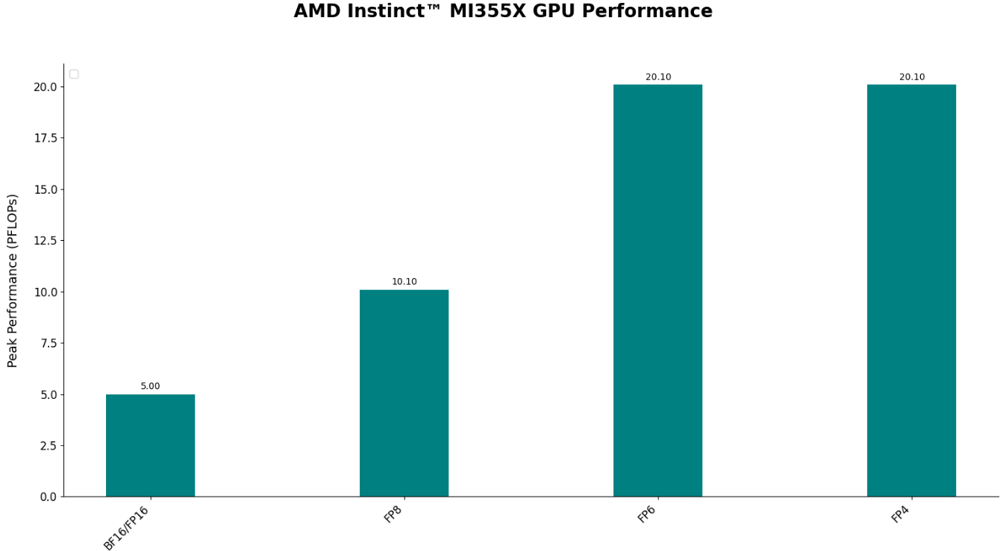
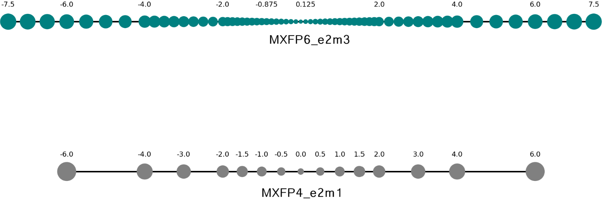
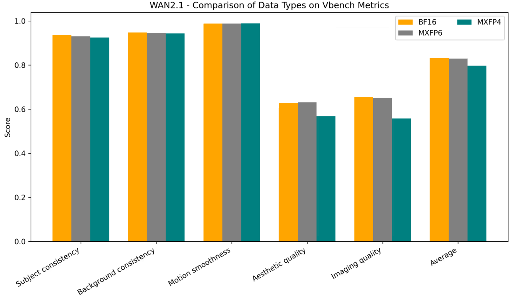

<!---
Copyright (c) 2025 Advanced Micro Devices, Inc. (AMD)

Permission is hereby granted, free of charge, to any person obtaining a copy
of this software and associated documentation files (the "Software"), to deal
in the Software without restriction, including without limitation the rights
to use, copy, modify, merge, publish, distribute, sublicense, and/or sell
copies of the Software, and to permit persons to whom the Software is
furnished to do so, subject to the following conditions:

The above copyright notice and this permission notice shall be included in all
copies or substantial portions of the Software.

THE SOFTWARE IS PROVIDED "AS IS", WITHOUT WARRANTY OF ANY KIND, EXPRESS OR
IMPLIED, INCLUDING BUT NOT LIMITED TO THE WARRANTIES OF MERCHANTABILITY,
FITNESS FOR A PARTICULAR PURPOSE AND NONINFRINGEMENT. IN NO EVENT SHALL THE
AUTHORS OR COPYRIGHT HOLDERS BE LIABLE FOR ANY CLAIM, DAMAGES OR OTHER
LIABILITY, WHETHER IN AN ACTION OF CONTRACT, TORT OR OTHERWISE, ARISING FROM,
OUT OF OR IN CONNECTION WITH THE SOFTWARE OR THE USE OR OTHER DEALINGS IN THE
SOFTWARE.
--->

# Breaking the Accuracy-Speed Barrier: How MXFP4/6 Quantization Revolutionizes Image and Video Generation
This blog introduces MXFP4 and MXFP6, the newly supported data types on AMD Instinct™ MI350 Series GPUs, and demonstrates their remarkable quality in image and video generation tasks. By reading this blog, you will discover how these low-bit formats can break the accuracy-speed tradeoff, boosting both efficiency and performance in generative AI workflows.

## What is Low-bit Computing?
With the rise of large-scale models such as GPT, LLaMA, and other billion- or trillion-parameter transformers, model quantization has become a critical technique for both research and production deployment. Low-bit quantization not only significantly reduces the memory footprint of models but also greatly improves computational efficiency when leveraged on modern hardware. The latest generation of AMD products offers powerful low-bit processing capabilities, enabling users to achieve more efficient training and inference, while reducing the cost of serving AI. The AMD Instinct™ MI350 Series GPUs support FP4 and FP6 data types, giving developers more flexibility to balance inference speed and model accuracy. Figure 1 shows the peak computational performance of AMD Instinct™ MI355X GPUs across different data types.
<!-- 
<p align="center">
  
</p> -->


<p align="center"><i>Figure 1: Performance comparison of different datatypes supported by the AMD Instinct™ MI355X GPU</i></p>


## What are MXFP4 and MXFP6?
MXFP4 and MXFP6 are data types introduced in the [OCP Microscaling Formats MX v1.0 Specification](https://www.opencompute.org/documents/ocp-microscaling-formats-mx-v1-0-spec-final-pdf). Table 1 provides a detailed description of the MXFP4 and MXFP6 formats. Figure 2 illustrates the representable numbers of MXFP4 and MXFP6_e2m3. This specification is a standardized format that is being actively adopted by multiple companies in the industry, with AMD being one of the leading contributors. Building upon the FP4 and FP6 formats, they incorporate a microscaling (MX) technique, which introduces a shared E8M0 scale factor for every 32-value block. This enhancement significantly expands the dynamic range of FP4 and FP6, thereby improving the accuracy of quantized models. The E8M0 scaling factor leverages efficient shift operations during calculations, resulting in minimal additional computation time.

<div align="center">

| Format | Element Datatype | Element Bits | Scaling Block Size | Scale Datatype | Scale Bits |
|--------|------------------|--------------|------------------|----------------|------------|
| MXFP6  | FP6 (e3m2)<br>──────────<br>FP6 (e2m3) | 6 | 32 | E8M0 | 8 |
| MXFP4  | FP4 (e2m1) | 4 | 32 | E8M0 | 8 |

</div>

<p align="center"><i>Table 1. Format names and parameters of concrete MX-compliant formats</i></p>


<p style="white-space:pre-line;">
Compared with INT datatypes, MXFP formats leverage floating-point encoding, offering a much larger dynamic range, even at low bit-widths.
    
For example:

• INT4 (signed) covers only [-8, 7]. Since the fix-points follow a uniform distribution, all its values are within a similar order of magnitude.

• The MXFP4 format includes 2 bits for the exponent and 1 bit for the mantissa with a value range from ±0.5 for subnormal numbers to ±6.0 for normal numbers. It supports shared scaling via an E8M0 exponent, allowing each block of values to be scaled across a wide dynamic range. The shared scales are from 2<sup>-127</sup> to 2<sup>127</sup>. This makes MXFP4 highly efficient for compressing data while preserving numerical flexibility.


</p>



<p align="center"><i>Figure 2. Representable numbers of MXFP4 and MXFP6_e2m3</i></p>

MXFP formats provide better suitability for non-uniform and heavy-tailed distributions.  Model activations, residuals, and attention maps in generative models often follow non-Gaussian, heavy-tailed distributions. MXFP formats, with floating-point exponent flexibility, can better model the long tail and preserve small but important values.

## How about the Quality?
For text-to-image and text-to-video generation tasks, we conducted extensive experiments based on MXFP formats. The results demonstrate that low-bit MXFP quantization can achieve generation quality comparable to BF16. Below are representative examples of our generated outputs.

### Text-to-Image Generation: [FLUX.1-schnell(step-4)](https://huggingface.co/black-forest-labs/FLUX.1-schnell)
#### Benchmark
We compared the results of BF16, MXFP6_e2m3, and MXFP4. In addition, AMD Instinct™ products also provide the option of MXFP6_e3m2, giving users more tools and possibilities to achieve superior results when tackling different tasks.
We quantized all transformer layers—except the final output and embedding layers. We used the captions from the 5,000 samples in the COCO2017 test dataset to evaluate Clip Score and HPS, where each caption serves as the text input for generation. For GenEval Accuracy and Overall Score, we follow the official GenEval benchmark and use its standard evaluation dataset. These results are presented in Table 2.

<div align="center">

| Data Type | CLIP Score ↑ | HPS ↑ | GenEval Acc. ↑ | GenEval Score(overall) ↑ |
|-----------|--------------|-------|----------------|--------------------------|
| BF16      | 0.3242       | 0.2713| 66.37%         | 0.6770                   |
| MXFP6     | 0.3241       | 0.2713| 66.37%         | 0.6768                   |
| MXFP4     | 0.3218       | 0.2692| 66.37%         | 0.6739                   |

</div>

<p align="center"><i>Table 2. Comparison of model performance across different datatypes using FLUX.1-schnell on COCO2017 and the GenEval benchmark</i></p>

**Clip Score.**
Clip Score measures the semantic alignment between generated images and their text prompts using a CLIP model. Higher values indicate better text–image correspondence. In our evaluation, we use captions from the 5,000 COCO2017 test samples as prompts.

**HPS (Human Preference Score).**
HPS is a learned scoring model trained on the Human Preference Dataset v2 (HPD v2), which contains large-scale human aesthetic judgments. It estimates how likely generated images are to be preferred by human raters. Higher scores indicate stronger alignment with human preferences. We compute HPS using the same COCO2017 captions as text prompts.

**GenEval Accuracy & Overall Score.**
GenEval is a compositional image generation benchmark designed to evaluate how well a model adheres to complex instructions involving attributes, relations, and object compositions. GenEval Accuracy reflects task-level correctness, while the Overall Score summarizes performance across all evaluation categories. Both metrics follow the official GenEval protocol and dataset (553 samples). GenEval Accuracy is computed as the number of cases judged correct divided by the total number of cases, while the Overall Score is obtained by averaging across sub-metrics such as object count, color, and spatial position.


#### Examples
We selected four sets of prompts from different sources for demonstration, using both bfloat16, MXFP6_e2m3 and MXFP4 data types for inference. All configurations and parameters are kept identical except for the data type. These generation examples are presented in Figures 3.a, 3.b, 3.c, and 3.d. The datatypes used for generating the images, from left to right, are BF16, MXFP6, and MXFP4. 
Overall, the visual quality of the outputs from all datatypes is nearly indistinguishable and well within acceptable usability. The differences between these results based on three datatypes are limited to minor details.

**Prompt 1** consists of a medium-length text example, sourced from [fal.ai](https://fal.ai/models/fal-ai/flux/schnell/examples). The images generated using three datatypes demonstrate a high degree of alignment with the prompt in terms of both semantic content and stylistic attributes. Beyond this consistency, the visual outputs exhibit strong inter-image similarity, with only minor variations observed in the structure of tree branches and the hairstyle of the central figure. This suggests that employing MXFP-based quantization can enhance model inference efficiency without introducing significant degradation in output quality.

**Prompt 2** consists of a medium-length text example. The generated images demonstrate strong consistency with the description in terms of character appearance, clothing texture, and scene composition.
The main variations are observed in the overall exposure, color saturation, and the finer facial details of the character.
Nevertheless, the visual impressions delivered by the three data types are largely comparable and of similar perceptual quality.

**Prompt 3** consists of a medium-length text example. All key elements—including the powerful waves, dark cliffs, mist are accurately represented. It is worth noting that all three data types accurately interpret the photographic term “long exposure” and convey the resulting visual effect, producing a silky water effect. The images generated across the three data types differ only slightly in the number of cliffs, which is not specified in the prompt.

**Prompt 4** consists of a short text example. The generated images are consistent with the description in terms of overall style and character appearance.
The primary differences lie in the background rendering: the BF16 and MXFP6 results appear more like outdoor settings, whereas the MXFP4 result resembles an indoor corridor.
Since such details are not specified in the prompt, these variations are considered acceptable and within the expected range.

| BF16 | MXFP6 | MXFP4 |
|:----------:|:----------:|:----------:|

<div align="center">


</div>

**Prompt 1:** stunning shot of a girl walking through a field, in the style of autumnal trees, dark yellow and azure, majestic, sweeping seascapes, photorealistic representation, graceful balance, wimmelbilder, orange.

<p align="center"><i>Figure 3.a. Prompt1 generation results across different datatypes (FLUX.1-schnell)</i></p>

| BF16 | MXFP6 | MXFP4 |
|:----------:|:----------:|:----------:|

<div align="center">


</div>

<p><strong>Prompt 2:</strong> A portrait of a wise old man with a long beard, wearing a knitted sweater, sitting in a cozy library, soft window light, shallow depth of field, style of a vintage film photograph with a subtle grain.</p>
<p align="center"><i>Figure 3.b. Prompt2 generation results across different datatypes (FLUX.1-schnell)</i></p>


| BF16 | MXFP6 | MXFP4 |
|:----------:|:----------:|:----------:|

<div align="center">


</div>
<p><strong>Prompt 3:</strong> A dynamic seascape photograph of powerful waves crashing against dark cliffs, sea spray and mist filling the air, long exposure creating a silky water effect, overcast sky, moody and dramatic, sharp details.</p>
<p align="center"><i>Figure 3.c. Prompt3 generation results across different datatypes (FLUX.1-schnell)</i></p>

| BF16 | MXFP6 | MXFP4 |
|:----------:|:----------:|:----------:|

<div align="center">


</div>
<p><strong>Prompt 4:</strong> A girl in a school uniform, anime style.</p>
<p align="center"><i>Figure 3.d. Prompt4 generation results across different datatypes (FLUX.1-schnell)</i></p>

----------
### Text-to-Video Generation: [Wan2.1-T2V-14B](https://huggingface.co/Wan-AI/Wan2.1-T2V-14B)
#### Benchmark
We quantized all transformer layers and used [VBench1.0](https://github.com/Vchitect/VBench) to evaluate multiple sets of generated videos. The key metrics we select include subject consistency, background consistency, motion smoothness, dynamic degree, aesthetic quality, and imaging quality. The detailed results for each metric are shown in Table 3 and Figure 4.

<div align="center">
    
| Data Type | Subject consistency | Background consistency | Motion smoothness | Aesthetic quality | Imaging quality | Average Score |
|----------|--------------------|-----------------------|------------------|------------------|----------------|-----|
| BF16     | 0.9366             | 0.9478                | 0.9888           | 0.6271           | 0.6556         | 0.8311 |
| MXFP6    | 0.9303           | 0.9456                | 0.9888           | 0.6303           | 0.6508         | 0.8292  |
| MXFP4    | 0.9251             | 0.9439                | 0.9892           | 0.5681           | 0.5573         | 0.7967  |

</div>

<p align="center"><i>Table 3. Comparison of VBench Score across different datatypes using the Wan2.1 model</i></p>

<div align="center">



</div>

<p align="center"><i>Figure 4. Comparison of Vbench Score across different datatypes using the Wan2.1 model</i></p>

#### Examples
We selected prompts previously used in Wan2.1 and the HunyuanVideo papers for our demo. As you can see in the video figure (Figure 5) below, the generated results are outstanding—the content aligns closely with the semantic meaning of the prompts, the video motion follows physical laws, and the system accurately distinguishes between subjects and backgrounds based on camera descriptions, while also generating videos in the correct style as specified in the prompt. One of Wan’s key strengths is its ability to generate videos that are friendly to Chinese language prompts. Remarkably, this capability remains intact even after quantization. For example, in our demo, the Chinese characters written on the balloon perfectly match the prompt description, and no common AI-related character rendering errors are observed.
<!--
<p align="center">
  <a href="./images/1700kbs_blog_demo.mp4">Figure 5</a>
</p> -->
```{video} ./images/1700kbs_blog_demo.mp4
:width: 640
:height: 360
:align: center
:controls:
:caption: "Figure 5. Wan2.1 sample generations with MXFP6 datatype. The prompts for video generation are all sourced from <a href='https://arxiv.org/pdf/2503.20314'>Wan2.1 Paper</a> and <a href='https://arxiv.org/pdf/2412.03603'>HunyuanVideo Paper</a>."
```

## Summary
In this blog, we introduced the newly supported MXFP data types on AMD Instinct™ MI350 Series GPUs and validated them on representative models for both T2I and T2V tasks. Our results demonstrate that MXFP4 and MXFP6 achieve performance comparable to BF16 in image and video generation, remarkably without relying on any additional quantization techniques. We employed only the most basic two-level scaling, without resorting to any additional sophisticated tricks, underscoring the untapped potential of these formats. Compared to BF16, the use of MXFP4 and MXFP6 significantly enhances hardware efficiency, improving both compute and memory bandwidth utilization. This opens up new opportunities to explore a more favorable balance between model speed and precision, suggesting that these low-bit formats could play a transformative role in high-quality generative modeling. We welcome you to explore the new low-precision floating-point types on the AMD platform. For more details, please refer to the [Low-Precision Floating-Point types Documentation](https://rocm.docs.amd.com/projects/HIP/en/latest/reference/low_fp_types.html).
To learn more about the detailed hardware specifications of the MI350 series, please visit [our documentation](https://www.amd.com/en/products/accelerators/instinct/mi350.html).

## Additional Resources

B. D. Rouhani, R. Zhao, A. More, M. Hall, A. Khodamoradi, S. Deng, D. Choudhary, M. Cornea, E. Dellinger, K. Denolf, et al. Microscaling data formats for deep learning. arXiv preprint arXiv:2310.10537, 2023b.

bfl.ai. bfl.ai website. https://bfl.ai/, accessed January 2026.

Hunyuan Foundation Model Team. HunyuanVideo: A systematic framework for large video generative models. arXiv preprint arXiv:2412.03603, 2024.

WanTeam, Alibaba Group. Wan2.1: Open and advanced large-scale video generative models. arXiv preprint arXiv:2503.20314, 2025.

D. Ghosh, H. Hajishirzi, L. Schmidt. GenEval: An object-focused framework for evaluating text-to-image alignment. arXiv preprint arXiv:2310.11513, 2023

J. Hessel, A. Holtzman, M. Forbes, R. Le Bras, Y. Choi. CLIPScore: A reference-free evaluation metric for image captioning. arXiv preprint arXiv:2104.08718, 2021.

X. Wu, Y. Hao, K. Sun, Y. Chen, F. Zhu, R. Zhao, H. Li. Human Preference Score v2: A solid benchmark for evaluating human preferences of text-to-image synthesis. arXiv preprint arXiv:2306.09341, 2023.

F. Zhang, S. Tian, Z. Huang, Y. Qiao, Z. Liu. Evaluation Agent: Efficient and Promptable Evaluation Framework for Visual Generative Models. arXiv preprint arXiv:2412.09645, 2024.

## Disclaimers
Third-party content is licensed to you directly by the third party that owns the content and is not licensed to you by AMD. ALL LINKED THIRD-PARTY CONTENT IS PROVIDED “AS IS” WITHOUT A WARRANTY OF ANY KIND. USE OF SUCH THIRD-PARTY CONTENT IS DONE AT YOUR SOLE DISCRETION AND UNDER NO CIRCUMSTANCES WILL AMD BE LIABLE TO YOU FOR ANY THIRD-PARTY CONTENT. YOU ASSUME ALL RISK AND ARE SOLELY RESPONSIBLE FOR ANY DAMAGES THAT MAY ARISE FROM YOUR USE OF THIRD-PARTY CONTENT.
