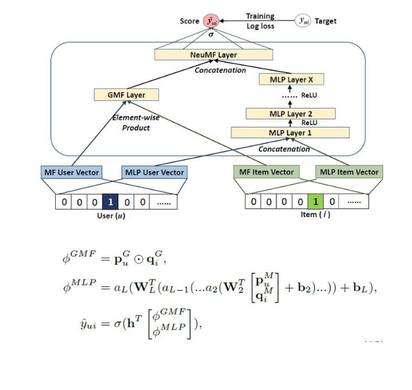

# Training a Neural Collaborative Filtering (NCF) Recommender on an AMD GPU

## Introduction

Collaborative Filtering is a type of item recommendation where new items are recommended to the user based on their past interactions. [Neural Collaborative Filtering (NCF)](https://arxiv.org/abs/1708.05031) is a recommendation system that uses neural network to model the user-item interaction function. NCF focuses on optimizing a collaborative function, which is essentially a user-item interaction model represented by a neural network and ranks the recommended items for the user.

Previous works on user-item recommendation were limited to Matrix Factorization (MF) methods, which only captured the linear nature of the data. As shown in the formula below, MF is a dot product of user, $p_u$, and item, $q_i$, embeddings, therefore, assuming that all the latent dimensions are independent and equally weighted to estimate the interaction score.

$$\hat{y_{ui}} = f(u,i|\mathbf{p_u},\mathbf{q_i})=\mathbf{p_u}^{\intercal}\mathbf{q_i} = \sum_{k=1}^{K}{p_{uk}q_{ik}},$$

NCF replaces MF with a neural network to improve the expressiveness of the model through non-linearities of a Multi-Layer Perceptron (MLP). For L layers, the computations are as follows:

$$z_1 = \phi_1(p_{u}, q_{i})$$

$$\phi_2(z_1) = a_2(W^T z_1 + b_2)$$

$$\phi_{L-1}(z_{L-2}) = a_{L-1}(W^T z_{L-2} + b_{L-1})$$

$$\hat{y_{ui}} = \sigma(h^T\phi_L(z_{L-1}))$$

In addition, it also uses a generalized version of MF called Generalized Matrix Factorization (GMF) to facilitate linear flow of data in addition to the MLP. It is called 'Generalized' because of the use of $a_{out}$ activation function and learnable $h^T$ edge weights as shown below. Intuitively, when you replace $a_{out}$ with identity function and $h^T$ with a unit vector, GMF component becomes MF.

$$\hat{y_{ui}} = a_{out}(h^T(p_u\cdot q_i))$$

Combining MLP and GMF, the architecture of NCF is as shown in the following picture:



Image source is a collage of images from [NCF](https://arxiv.org/abs/1708.05031) paper.

As shown above, user, $p^G_u$, and item, $q^G_i$, embeddings are passed to both GMF and MLP separately. Their outputs are concatenated before passing to the last collaborative filtering layer, which outputs final estimation scores for each user-item pair.

Additionally, NCF is trained on implicit data rather than explicit data. Implicit data comes from user interactions like watching videos or buying products, while explicit data includes things like user ratings and comments. Implicit data is automatically tracked and easier to collect, however, it is more difficult to interpret as there's no information on the user's satisfaction. NCF tackles this problem by converting a recommendation/ranking problem into a classification problem. It does this by estimating an interaction score (between 0 and 1) where the ground truth label 0 means *no interaction* and 1 means *interaction*.

A challenge with implicit data is lack of negative values. In other words, just because a user hasn't interacted with an item doesn't necessarily mean they dislike it. To address this issue, NCF follows a sampling strategy to include only 100 negative items (0-labelled) per user i.e., a sample of 100 items with which the user did not interact. The output interaction scores are ordered in descending order to obtain their ranks. This is how NCF solves the ranking problem through a classification approach.

## Implementation

For this experiment, we'll use the [recommenders](https://github.com/recommenders-team/recommenders/tree/main) library, an open source collaborative effort for Recommendation Systems by Microsoft and Linux Foundation.

### Requirements

The following experiment has been tested on ROCm 5.7.0 and TensorFlow 2.13. Please refer to the [documentation](https://rocm.docs.amd.com/projects/install-on-linux/en/latest/reference/system-requirements.html#supported-gpus) to see a list of supported AMD hardware and software.

- Install [ROCm tensorflow](https://rocm.docs.amd.com/projects/install-on-linux/en/latest/how-to/3rd-party/tensorflow-install.html)
- ```pip install recommenders tf-slim```

### Dataset

The example used in this blog follows the [Quick Start](https://github.com/recommenders-team/recommenders/blob/main/examples/00_quick_start/ncf_movielens.ipynb) tutorial example in the official GitHub website. The tutorial downloads the ```movielens``` dataset that comprises 6040 users, 3660 movies, and the movie ratings of each user. Since we're interested in implicit data, we consider the rating column only to see if there's been an interaction between a user and a movie.

The below piece of code fetches ```movielens``` dataset, extracts the required columns, splits it into train and test partitions and saves the dataset splits to their respective files. For convenience, the train and test splits are available in the [src](./src) folder and users can skip to the [model training](#model-training) section.  

```python
import pandas as p
from recommenders.datasets.python_splitters import python_chrono_split
from recommenders.datasets import movielens

MOVIELENS_DATA_SIZE = '100k'

df = movielens.load_pandas_df(
    size=MOVIELENS_DATA_SIZE,
    header=["userID", "itemID", "rating", "timestamp"]
)

train, test = python_chrono_split(df, 0.75)

users = train["userID"].unique()
items = train["itemID"].unique()

print(f'Total number of users: {len(users)}')
print(f'Total number of items: {len(items)}\n')

# Filter out any users or items in the test set that do not appear in the training set.
test = test[test["userID"].isin(users)]
test = test[test["itemID"].isin(items)]

print(test[:5])

train_file = "./train.csv"
test_file = "./test.csv"
train.to_csv(train_file, index=False)
test.to_csv(test_file, index=False)
```

```text
100%|██████████| 5.78k/5.78k [00:00<00:00, 20.7kKB/s]
Total number of users: 6040
Total number of items: 3660

    userID  itemID  rating  timestamp
28       1    1545     4.0  978824139
23       1     527     5.0  978824195
29       1     745     3.0  978824268
10       1     595     5.0  978824268
33       1     588     4.0  978824268
```

### Model training

The ```recommenders``` library has defined a ```NCFDataset``` class that is designed to generate positive and negative pairs for each user. It's ```Model``` class has 3 fully connected hidden layers followed by ReLU and Embedding layers for the users and items. The training is carried out for 100 epochs, optimized through binary cross entropy loss function and an SGD optimizer.

```python
data = NCFDataset(train_file=train_file, test_file=test_file, seed=SEED)

model = NCF (
    n_users=data.n_users, 
    n_items=data.n_items,
    model_type="NeuMF",
    n_factors=8,
    layer_sizes=[16,8,4],
    n_epochs=EPOCHS,
    batch_size=BATCH_SIZE,
    learning_rate=1e-3,
    verbose=1,
    seed=SEED
)

print('Started training')

with Timer() as train_time:
    model.fit(data)

print("Took {} seconds for training.".format(train_time))
model.save('.')
```

```bash
Started training
Took 2662.1163 seconds for training.
```

### Evaluation

The performance metrics used to measure the model's success are Hit-Ratio@K(HR@K) and Normalized Discounted Cumulative Gains (NDCG). HR@K calculates the number of hits (ground truth label=1) in top K predictions per user. It intuitively  measures if the positive test sample is present on the top-K list. NDCG is the most popular and holistic metric used for ranking systems. It accounts not only for the presence but also for the position of the hit by assigning higher weights to the user-item pair. Interested readers can go through this [article](https://arize.com/blog-course/ndcg/) by Arize that clearly explains the role of NDCG with an example.

The following piece of code predicts interaction score for every user-item pair and calculates the NDCG metric as explained previously.

```python
with Timer() as test_time:
    users, items, preds = [], [], []
    item = list(train.itemID.unique())
    for user in train.userID.unique():
        user = [user] * len(item) 
        users.extend(user)
        items.extend(item)
        preds.extend(list(model.predict(user, item, is_list=True)))
        # break

    all_predictions = pd.DataFrame(data={"userID": users, "itemID":items, "prediction":preds})

    #Perform outer merge of all predictions to include all columns from both tables
    merged = pd.merge(train, all_predictions, on=["userID", "itemID"], how="outer")

    # For movie recommendations, we recommend only movies that are not seen by the user. Hence, filtering all null values in the ratings column
    all_predictions = merged[merged.rating.isnull()].drop('rating', axis=1)

print("Took {} seconds for prediction.".format(test_time))

eval_ndcg = ndcg_at_k(test, all_predictions, col_prediction='prediction', k=TOP_K)
print("NDCG:\t%f" % eval_ndcg)
```

```bash
Took 7.7151 seconds for prediction.
NDCG:   0.210334
```

If you take a quick look at the ```all_predictions``` output, you can see that the top 5 recommended as well as previously unseen movies for ```userID=1``` are ```209, 100, 228, 294, 475```.

```python
print(all_predictions.loc[all_predictions['userID']==1].sort_values(by='prediction', ascending=False).head(5))
```

```bash
       userID  itemID  rating  timestamp  prediction
75106       1     209     NaN        NaN    0.956280
75025       1     100     NaN        NaN    0.942334
75087       1     228     NaN        NaN    0.933154
75020       1     294     NaN        NaN    0.925511
75163       1     475     NaN        NaN    0.900241
```

The complete source code for this example can be found [here](./src/ncf-train.py).
