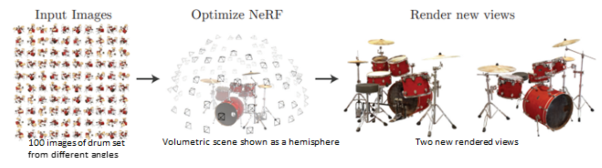
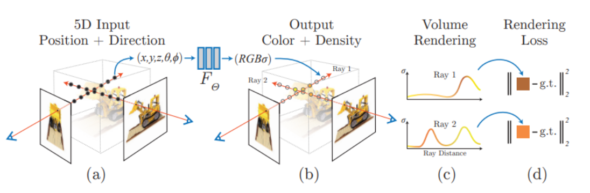
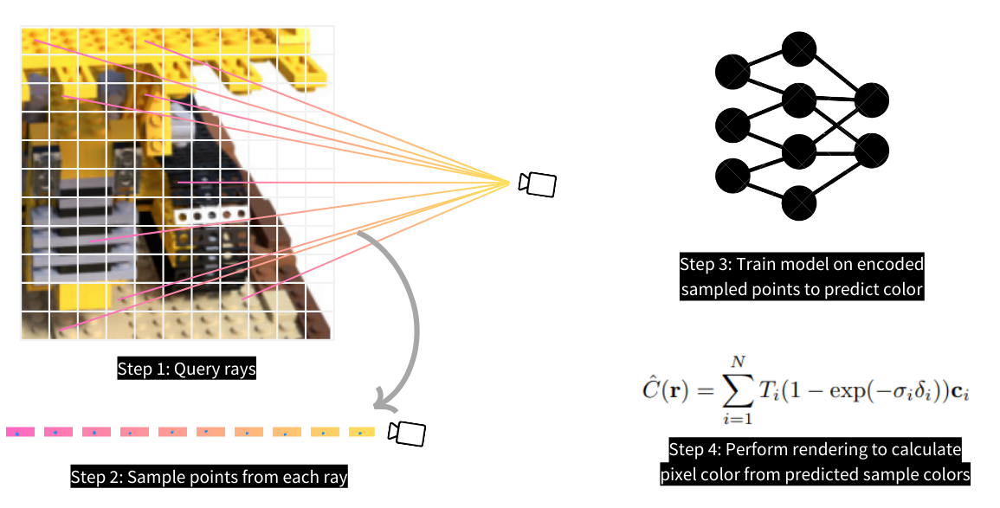
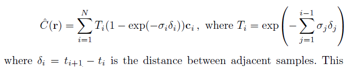
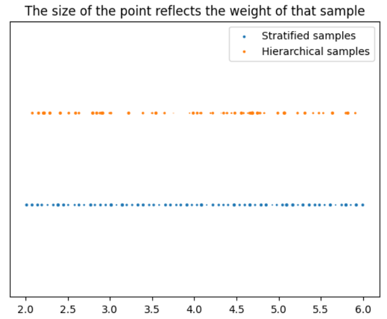
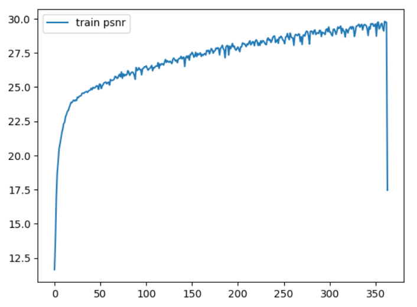
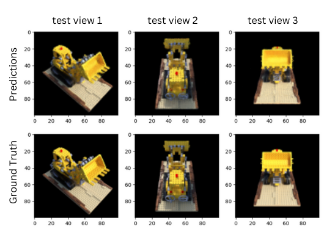

# Two-dimensional images to three-dimensional scene mapping using NeRF on an AMD GPU

This tutorial aims to explain the fundamentals of NeRF and its implementation in PyTorch. The code
used in this tutorial is inspired by
[Mason McGough’s colab notebook](https://colab.research.google.com/drive/1TppdSsLz8uKoNwqJqDGg8se8BHQcvg_K?usp=sharing)
and is implemented on an AMD GPU.

## Neural Radiance Field

[Neural Radiance Field (NeRF)](https://arxiv.org/pdf/2003.08934.pdf) is a three-dimensional (3D) scene
function generated from two-dimensional (2D) images to synthesize novel views of a given scene.
Inspired by classical volumetric rendering techniques, NeRF parametrizes the scene function using a
neural network. The neural network used in this paper is a simple multilayer perceptron (MLP) network.

Using a set of 2D images for a scene taken from different views, you can model a 3D function. To do
this, you need to map the geometry of the scene using camera parameters (θ, φ) and positions
sampled from the 2D images (x, y, z). *View synthesis* describes the new views that you can generate
from this 3D function. Volume rendering refers to projecting novel views to respective 2D images
using rendering techniques.



There are many ways to render a novel synthesized view. The two most common ways are:

* Mesh-based rendering
* Volume rendering

Training a mesh is slow and difficult due to poor landscaping of the loss function or getting stuck in a
local minimum. Whereas Volumetric rendering is easily differentiable as well as easy to render. The
authors of the NeRF paper optimized the continuous volumetric scene function parametrized using a
fully-connected network that was trained on L2 loss between predicted and actual red-green-blue
(RGB) maps. The success of their approach over existing work on volumetric scene modeling can be
attributed to:



* **5D radiance fields**: The input for the model consists of five-dimensional (5D)
  coordinates (three spatial units [x,y,z] and two camera directions [θ, φ]). Unlike previous works that
  were limited to simple shapes, resulting in oversmoothed renderings, 5D radiance field enabled
  mapping of complex scenes and synthesizing photorealistic views. Given 5D input(x, y, z, θ, φ), the
  model outputs RGB color/radiance and density for each pixel in the synthesized view.

* **Positional encoding (PE)**: The model applies sinusoidal PE to the 5D input before training starts.
  Like PE employed in transformers to induce positional information, NeRF uses PE to incorporate high
  frequency values to produce better quality images.

* **Stratified sampling & hierarchical sampling**: To increase the efficiency of volumetric rendering
  without increasing the number of samples, the points from each image are sampled twice in
  succession and trained on two different models (coarse and fine). This allows for filtering out points
  that are more relevant to the scene and less of the surroundings.

## Implementation

In the following sections we will go through end-to-end NeRF training inspired by the
[official implementation](https://github.com/bmild/nerf) and
[Mason McGough’s colab notebook](https://colab.research.google.com/drive/1TppdSsLz8uKoNwqJqDGg8se8BHQcvg_K?usp=sharing).
This experiment was carried out on ROCm 5.7.0 and PyTorch 2.0.1.

### Requirements

1. [Install ROCm on your system](https://rocm.docs.amd.com/projects/install-on-linux/en/latest/tutorial/install-overview.html)
2. [Install ROCm-compatible PyTorch](https://rocm.docs.amd.com/projects/install-on-linux/en/develop/how-to/3rd-party/pytorch-install.html) (uninstall other PyTorch versions)

### Dataset class

As the first step, prepare the training dataset for your model. Unlike other computer vision tasks, such
as classification and detection, which use convolutional neural networks (CNNs) and feed on 2D
images directly, NeRF employs multilayer perceptron (MLP) and is trained on positions sampled from
2D images. To be precise, these positions are sampled from the space between the camera and 3D scene,
as shown in the following image. Prior to sampling, you must first query rays from the 2D image. Then,
sample points from each ray using the Stratified Sampling technique.



Define your dataset class that queries rays from each image. We use the [tiny_nerf_dataset](https://cseweb.ucsd.edu//~viscomp/projects/LF/papers/ECCV20/nerf/tiny_nerf_data.npz) that has
106 images and respective camera poses of a lego model. Each camera pose is a transform function
used to transform spatial positions in the camera framework to a normalized device coordinate (NDC)
framework.

We define a ``get_rays`` function that parametrizes on image dimensions (height, width) as well as
camera pose and returns rays (origins and directions) as output. This function creates a 2D mesh grid,
which is the same size as the input image. Each pixel in this grid denotes a vector from the camera
origin to the pixel (hence -ve z direction). These resulting vectors are normalized to a unit distance
by focal length (i.e., the distance between the camera and the projected 2D image, which is usually a
camera specification and a constant value). The normalized vectors are transformed to NDC framework
through multiplication with the input camera pose. Therefore, the ``get_rays`` function returns
transformed rays (origins and directions) passing through each pixel of the input image.

```python
class NerfDataset(torch.utils.data.Dataset):
    def __init__(self, start_idx_dataset=0, end_idx_dataset=100):
        data = np.load('tiny_nerf_data.npz')
        self.images = torch.from_numpy(data['images'])[start_idx_dataset:end_idx_dataset]
        self.poses = torch.from_numpy(data['poses'])[start_idx_dataset:end_idx_dataset] # 4*4 Rotational matrix to change camera coordinates to NDC(Normalized Device Coordinates)
        self.focal = torch.from_numpy(data['focal']).item()

    def get_rays(self, pose_c2w, height=100.0, width=100.0, focal_length = 138):
        # Apply pinhole camera model to gather directions at each pixel
        i, j = torch.meshgrid(torch.arange(width),torch.arange(height),indexing='xy')
        directions = torch.stack([(i - width * .5) / focal_length,
                                -(j - height * .5) / focal_length,
                                -torch.ones_like(i) #-ve is not necessary
                               ], dim=-1)

        # Apply camera pose to directions
        product = directions[..., None, :] * pose_c2w[:3, :3] #(W, H, 3, 3)
        rays_d = torch.sum(product, dim=-1) #(W, H, 3)

        # Origin is same for all directions (the optical center)
        rays_o = pose_c2w[:3, -1].expand(rays_d.shape)
        return rays_o, rays_d

    def __getitem__(self, idx):
        image = self.images[idx]
        pose = self.poses[idx]
        rays_o, rays_d = self.get_rays(pose, focal_length=self.focal)
        return rays_o, rays_d, image
```

### Stratified sampling

Using the ``stratified_sampling`` function, ``n_samples=64`` points are sampled from each ray. Stratified
sampling divides a line into ``n_samples`` bins and collects the mid-point from each bin. When using
perturbation (a non-zero value for the ``perturb`` parameter), the collected points will be slightly off
from the mid-point of each bin by a small random distance.

```python
def stratified_sampling(rays_o, rays_d, n_samples=64, perturb=0.2):
    # rays_o, rays_d = self.get_rays(pose)
    z_vals = torch.linspace(2,6-perturb, n_samples) + torch.rand(n_samples)*perturb
    z_vals = z_vals.expand(list(rays_o.shape[:-1]) + [n_samples]).to('cuda') #(W,H,n_samples)

    # Apply scale from `rays_d` and offset from `rays_o` to samples
    pts = rays_o[..., None, :] + rays_d[..., None, :] * z_vals[..., :, None] #(W,H,n_samples,3)
    return pts.to('cuda'), z_vals.to('cuda')
```

### Positional encoding

The sampled points and directions are encoded using sinusoidal encoding, as defined in ``encode_pts``
and ``encode_dirs`` functions, respectively. These are later forwarded to the
[NeRF model](./src/model.py).

```python
def encode(pts, num_freqs):
    freq = 2.**torch.linspace(0, num_freqs - 1, num_freqs)
    encoded_pts = []
    for i in freq:
        encoded_pts.append(torch.sin(pts*i))
        encoded_pts.append(torch.cos(pts*i))
    return torch.concat(encoded_pts,dim=-1)

def encode_pts(pts, L=10):
    flattened_pts = pts.reshape(-1,3)
    return encode(flattened_pts, L)

def encode_dirs(dirs, n_samples=64, L=4):
    #normalize before encode
    dirs = dirs / torch.norm(dirs, dim=-1, keepdim=True) #(W,H,3)
    dirs = dirs[..., None, :].expand(dirs.shape[:-1]+(n_samples,dirs.shape[-1])) #(W,H,num_samples,3)
    #print(dirs.shape)
    flattened_dirs = dirs.reshape((-1, 3))
    return encode(flattened_dirs,L)
```

### Volume rendering

The NeRF model outputs raw color and density for each sampled point. These raw outputs are
rendered into a final image as a function of the weighted summation of all points for every pixel. This
formula, described in Equation 3 of the paper, is also shown here.



This equation calculates the color of pixel, *C\(r\)*, as a function of predicted colors, *c<sub>i</sub>*, of each
sampled point, *t<sub>i</sub>*, on the ray, *r*.

The ``raw2outputs`` function returns differentiable weights and final color/radiance output. The model
is trained on the L2 loss between predicted RGB output values and true RGB values.

```python
def raw2outputs(
    raw: torch.Tensor,
    z_vals: torch.Tensor,
    rays_d: torch.Tensor
    ):
    r"""
    Convert the raw NeRF output into RGB and other maps.
    """

    # δi = ti+1 − ti ---> (n_rays, n_samples)
    dists = z_vals[..., 1:] - z_vals[..., :-1]
    dists = torch.cat([dists, 1e10 * torch.ones_like(dists[..., :1])], dim=-1)

    # Normalize encoded directions of each bin
    dists = dists * torch.norm(rays_d[..., None, :], dim=-1)

    # αi = 1 − exp(−σiδi) ---> (n_rays, n_samples)
    alpha = 1.0 - torch.exp(-nn.functional.relu(raw[..., 3]) * dists)

    # Ti(1 − exp(−σiδi)) ---> (n_rays, n_samples)
    # cumprod_exclusive = a product of exponential values = exponent of sum of values
    **weights** = alpha * cumprod_exclusive(1. - alpha + 1e-10)

    # Compute weighted RGB map.
    # Equation 3 in the paper
    rgb = torch.sigmoid(raw[..., :3])  # [n_rays, n_samples, 3]
    rgb_map = torch.sum(**weights**
[..., None] * rgb, dim=-2)  # [n_rays, 3]

    return rgb_map, **weights**
```

### Hierarchical sampling

Every input image is sampled twice in succession. After the model's first forward step (the coarse
model pass) on stratified samples, hierarchical sampling is carried out on the same input. The second
sampling enables filtering out 3D points more relevant to the scene using trainable weights from the
first sampling. The model achieves this by creating a probability distribution function (PDF) of existing
weights, followed by random sampling of new weights from this distribution.

The reason we need to create a PDF distribution is so that we can mimic a continuous value set from a
discrete set. Then, when we sample a new value randomly, we find the best/closest fit of this new value
within the set of discrete points. We sample ``n_samples_hierarchical=64`` weights from the distribution
and extract respective bins from the original stratified bins using the indices of these new weights in
the discrete set. The following code snippet has comments written for all the steps involved in
hierarchical sampling.

```python
def sample_pdf(
  bins: torch.Tensor,
  weights: torch.Tensor,
  n_samples: int,
  perturb: bool = False
) -> torch.Tensor:
    r"""
    Apply inverse transform sampling to a weighted set of points.
    """

    # Normalize weights to get PDF.
    # weights ---> [n_rays, n_samples]
    pdf = (weights + 1e-5) / torch.sum(weights + 1e-5, -1, keepdims=True) # [n_rays, n_samples]

    # Convert PDF to CDF.
    cdf = torch.cumsum(pdf, dim=-1) # [n_rays, n_samples]
    cdf = torch.concat([torch.zeros_like(cdf[..., :1]), cdf], dim=-1) # [n_rays, n_samples + 1]

    # Sample random weights uniformly and find their indices in the CDF distribution
    u = torch.rand(list(cdf.shape[:-1]) + [n_samples], device=cdf.device) # [n_rays, n_samples]
    inds = torch.searchsorted(cdf, u, right=True) # [n_rays, n_samples]

    # Stack consecutive indices as pairs
    below = torch.clamp(inds - 1, min=0)
    above = torch.clamp(inds, max=cdf.shape[-1] - 1)
    inds_g = torch.stack([below, above], dim=-1) # [n_rays, n_samples, 2]

    # Collect new weights from cdf and new bins from existing bins.
    matched_shape = list(inds_g.shape[:-1]) + [cdf.shape[-1]] # [n_rays, n_samples, n_samples + 1]
    cdf_g = torch.gather(cdf.unsqueeze(-2).expand(matched_shape), dim=-1,
                       index=inds_g) # [n_rays, n_samples, 2]
    bins_g = torch.gather(bins.unsqueeze(-2).expand(matched_shape), dim=-1,
                        index=inds_g) # [n_rays, n_samples, 2]

    # Normalize new weights and generate heirarchical samples from new bins.
    denom = (cdf_g[..., 1] - cdf_g[..., 0]) # [n_rays, n_samples]
    denom = torch.where(denom < 1e-5, torch.ones_like(denom), denom)
    t = (u - cdf_g[..., 0]) / denom
    samples = bins_g[..., 0] + t * (bins_g[..., 1] - bins_g[..., 0])

    return samples # [n_rays, n_samples]


def hierarchical_sampling(
  rays_o: torch.Tensor,
  rays_d: torch.Tensor,
  z_vals: torch.Tensor,
  weights: torch.Tensor,
  n_samples_hierarchical: int,
  perturb: bool = False
) -> Tuple[torch.Tensor, torch.Tensor, torch.Tensor]:
    r"""
    Apply hierarchical sampling to the rays.
    """

    # Draw samples from PDF using z_vals as bins and weights as probabilities.
    z_vals_mid = .5 * (z_vals[..., 1:] + z_vals[..., :-1])
    new_z_samples = sample_pdf(z_vals_mid, weights[..., 1:-1], n_samples_hierarchical,
                          perturb=perturb)

    # Rescale the points using rays_o and rays_d
    z_vals_combined, _ = torch.sort(torch.cat([z_vals, new_z_samples], dim=-1), dim=-1)
    pts = rays_o[..., None, :] + rays_d[..., None, :] * z_vals_combined[..., :, None]  # [N_rays, N_samples + n_samples_hierarchical, 3]
    return pts.to('cuda'), z_vals_combined.to('cuda'), new_z_samples.to('cuda')
```

The following image shows a visualization of the positions of weighted samples on a ray (both
stratified and hierarchical), with the ray length on the x-axis.



For the second forward step (the fine model pass), both the stratified and the hierarchical samples are
passed to the [NeRF model](./src/model.py) which outputs raw color. This can be rendered later using
the ``raw2outputs`` function to obtain the final RGB map.

### Forward step

Both samplings and the training-forward steps are summarized in the following code:

```python
def nerf_forward(rays_o,rays_d,coarse_model,fine_model = None,n_samples=64):
    """
    Compute forward pass through model(s).
    """
    ################################################################################
    # Coarse model pass
    ################################################################################
    # Sample query points along each ray.
    query_points, z_vals = stratified_sampling(rays_o, rays_d, n_samples=n_samples)
    encoded_points = encode_pts(query_points) # (W*H*n_samples, 60)
    encoded_dirs = encode_dirs(rays_d) # (W*H*n_samples, 24)
    raw = coarse_model(encoded_points, viewdirs=encoded_dirs)
    raw = raw.reshape(-1,n_samples,raw.shape[-1])
    # Perform differentiable volume rendering to re-synthesize the RGB image.
    rgb_map, weights = raw2outputs(raw, z_vals, rays_d)
    outputs = {
      'z_vals_stratified': z_vals,
      'rgb_map_0': rgb_map
    }
    ################################################################################
    # Fine model pass
    ################################################################################
    # Apply hierarchical sampling for fine query points.
    query_points, z_vals_combined, z_hierarch = hierarchical_sampling(
      rays_o, rays_d, z_vals, weights, n_samples_hierarchical=n_samples)
    # Forward pass new samples through fine model.
    fine_model = fine_model if fine_model is not None else coarse_model
    encoded_points = encode_pts(query_points)
    encoded_dirs = encode_dirs(rays_d,n_samples = n_samples*2)
    raw = fine_model(encoded_points, viewdirs=encoded_dirs)
    raw = raw.reshape(-1,n_samples*2,raw.shape[-1]) #(W*H, n_samples*2, 3+1)
    # Perform differentiable volume rendering to re-synthesize the RGB image.
    rgb_map, weights = raw2outputs(raw, z_vals_combined, rays_d.reshape(-1, 3))

    # Store outputs.
    outputs['z_vals_hierarchical'] = z_hierarch
    outputs['rgb_map'] = rgb_map
    outputs['weights'] = weights
    return outputs
```

### Results

The training was carried out for 360 epochs and optimized using the Adam optimizer. The training completed in about
4 hours and the resulting training curve is shown in the following image. Epochs are on the x-axis and peak
signal-to-noise ratio (PSNR)--an image quality metric with the a high value being better--is on the y-axis.



You can replicate this training using the default parameters in the trainer file: ``python trainer.py``.

You can use the following inference code to generate predictions on a test image. We've included the
output of three such test images after the code.

```python
import torch
from dataset import stratified_sampling, encode_pts, encode_dirs, hierarchical_sampling, NerfDataset
from render import raw2outputs
from model import NeRF
from trainer import nerf_forward

def inference(ckpt='./checkpoints/360.pt',idx=1, output_img=True):
    models = torch.load(ckpt)
    coarse_model=models['coarse']
    fine_model = models['fine']

    test_dataset = NerfDataset(100,-1)
    rays_o, rays_d, target_img = test_dataset[idx] # [100, 100, 3], [100, 100, 3], [100, 100, 3]
    rays_o, rays_d = rays_o.to('cuda'), rays_d.to('cuda')
    output = nerf_forward(rays_o.reshape(-1,3), rays_d.reshape(-1,3),coarse_model,fine_model,n_samples=64)
    if not output_img:
        return output
    predicted_img = output['rgb_map'].reshape(100,100,3)
    return predicted_img.detach().cpu().numpy()
```

Predictions and respective ground truth images for three test camera angles:



The top row displays the predicted output. The bottom row displays the respective ground truths in
the same resolution where each column pertains to a particular camera angle.
