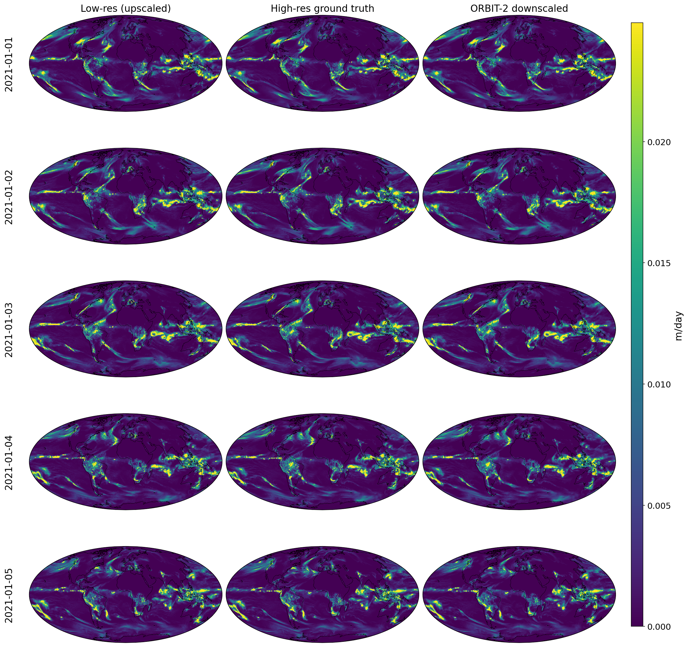
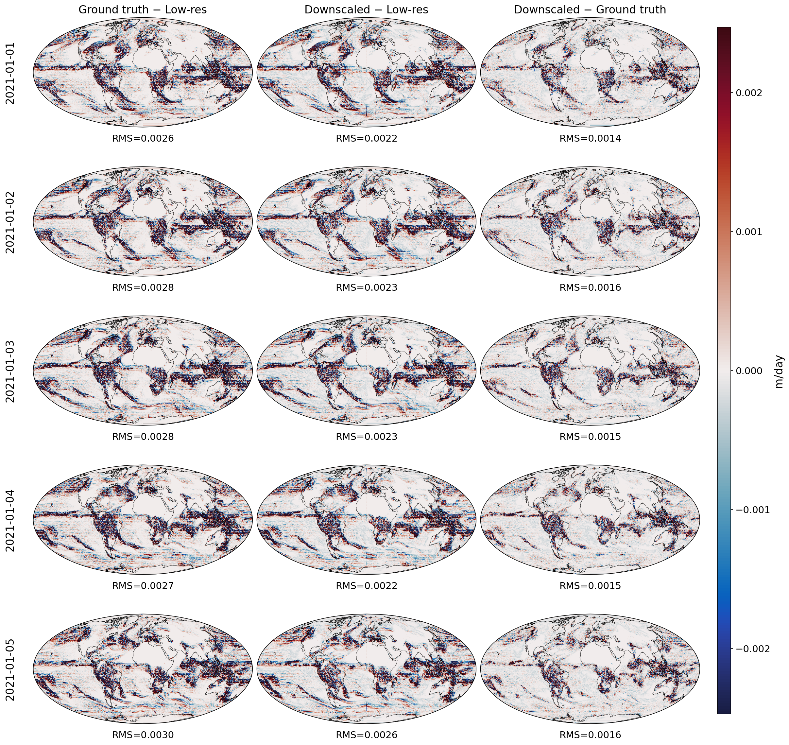
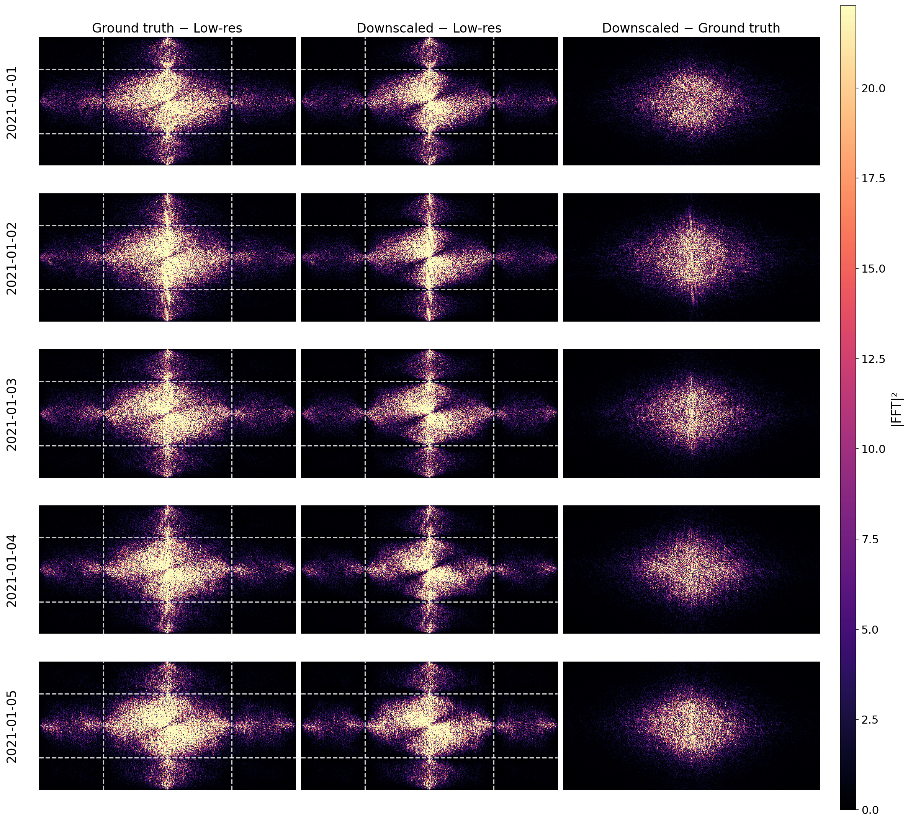
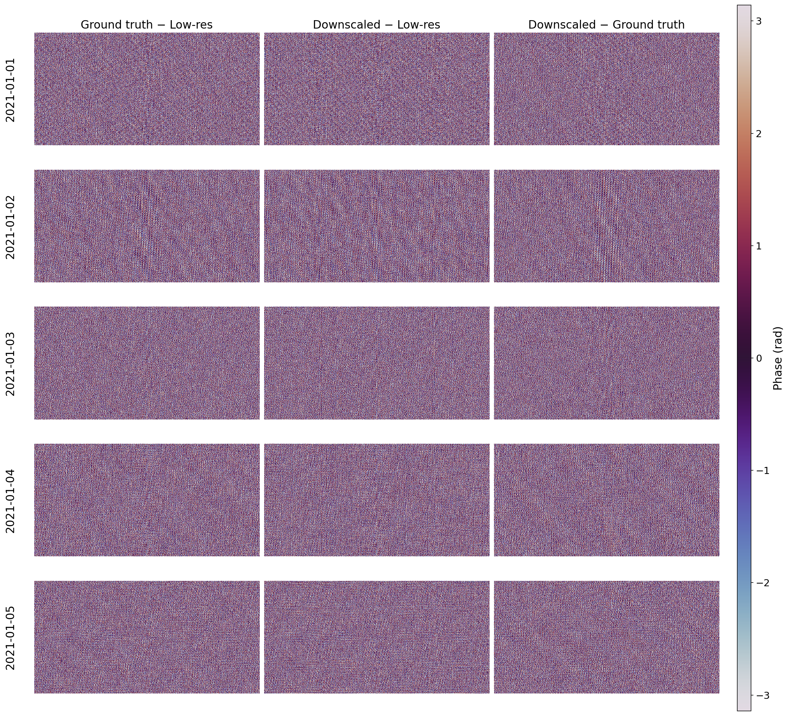
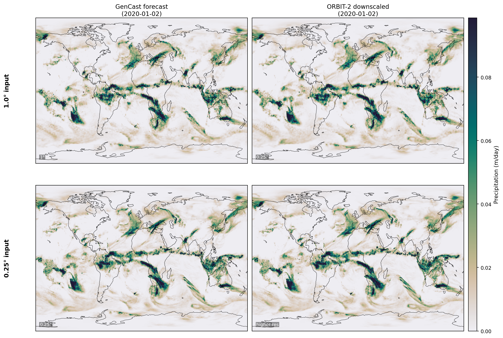

<!---
Copyright (c) 2026 Advanced Micro Devices, Inc. (AMD)

Permission is hereby granted, free of charge, to any person obtaining a copy
of this software and associated documentation files (the "Software"), to deal
in the Software without restriction, including without limitation the rights
to use, copy, modify, merge, publish, distribute, sublicense, and/or sell
copies of the Software, and to permit persons to whom the Software is
furnished to do so, subject to the following conditions:

The above copyright notice and this permission notice shall be included in all
copies or substantial portions of the Software.

THE SOFTWARE IS PROVIDED "AS IS", WITHOUT WARRANTY OF ANY KIND, EXPRESS OR
IMPLIED, INCLUDING BUT NOT LIMITED TO THE WARRANTIES OF MERCHANTABILITY,
FITNESS FOR A PARTICULAR PURPOSE AND NONINFRINGEMENT. IN NO EVENT SHALL THE
AUTHORS OR COPYRIGHT HOLDERS BE LIABLE FOR ANY CLAIM, DAMAGES OR OTHER
LIABILITY, WHETHER IN AN ACTION OF CONTRACT, TORT OR OTHERWISE, ARISING FROM,
OUT OF OR IN CONNECTION WITH THE SOFTWARE OR THE USE OR OTHER DEALINGS IN THE
SOFTWARE.
--->

# ORBIT-2 based Weather and Climate Downscaling and Downscaled Global Forecasts on AMD Instinct

Advances in complex modeling, collection of data, and computational capacity over the past several decades have resulted in accurate numerical weather prediction (NWP) models that are run every day as part of operations of large weather agencies [[1]](#NWP-review). In the past few years, data-driven AI models have emerged as an alternative to classes of NWP, making predictions at similar (or even slightly better) skill levels [[2]](#weatherbench-paper) [[3]](#weatherbench-paper-2) [[4]](#weatherbench-website), with drastically lower computational costs at inference-time, effectively democratizing access to weather forecasting. The AI models have been most successful at a class of synoptic models: global weather prediction models at resolutions of $10-30~\rm{km}$ with lead times starting from $6-12~\rm{hours}$, because such models could be trained on $\sim 40$ years of well-curated data such as the ERA5 reanalysis archives [[8]](#ERA5-paper) of the European Centre for Medium-Range Weather Forecasts (ECMWF). In previous blog posts, we have discussed [inference using SOTA synoptic AI models](https://rocm.blogs.amd.com/artificial-intelligence/ai-weather-forecasting/README.html) and [training such models](https://rocm.blogs.amd.com/artificial-intelligence/geoarches-training/README.html).

However, higher resolutions ($\sim 1-5~\rm{km}$) are crucial for forecasting severe events like storms. This has obviously important applications like disaster mitigation. Hence, despite limited availability of high-resolution data on a global scale, AI methods are being developed to address such forecasts. We have also followed such advances in blog posts discussing higher-resolution regional [ensemble](https://rocm.blogs.amd.com/artificial-intelligence/stormcast-ensembles/README.html) and [deterministic](https://rocm.blogs.amd.com/artificial-intelligence/stormcast-inference/README.html) forecasts based on simultaneous initialization with global (low-resolution) data and local high-resolution data, as well as [downscaling approaches in a local region like Taiwan](https://rocm.blogs.amd.com/artificial-intelligence/corrdiff-inference/README.html).

In this blog post, we discuss a global climate downscaling foundation model ORBIT-2 [[5]](#ORBIT2-paper) [[6]](#ORBIT2-github) built by Oak Ridge National Laboratory (ORNL) in collaboration with AMD (see [this AMD blog post](https://www.amd.com/en/blogs/2025/earth-system-modeling-with-orbit-2.html)). We will discuss running ORBIT-2 inference on AMD GPUs, then use the code associated with our previous blog post along with ORBIT-2 to make a global high-resolution forecast as a proof of concept.

## ORBIT-2

Designed for high-resolution climate and weather applications, ORBIT-2 produces a best estimate of a weather-related variable at high-resolution conditioned on multiple weather-related variables at lower resolution. ORBIT-2 works across different input scales and variables. This process is called statistical downscaling in climate literature (see [this blog](https://rocm.blogs.amd.com/artificial-intelligence/corrdiff-inference/README.html) for more information and a nice intuitive discussion of why this should be possible), and in the case of ORBIT-2, leverages super-resolution techniques from computer vision, applying them to the low-resolution image of weather variables, where each weather variable is treated as a layer. ORBIT-2 introduces technical innovations that enable better scaling and compute efficiencies in ways that can be applied beyond the currently available checkpoints. The currently available checkpoints support downscaling of global precipitation (`total_precipitation_24hr`) and regional US temperature variables (`2m_temperature_min` and `2m_temperature_max`). In this blog we focus on the global precipitation checkpoint.

More technically, it uses a novel Reslim (Residual Slim Visual Transformer) architecture to capture spatial patterns and reconstruct realistic small-scale variability.
Instead of upsampling inputs and feeding very long sequences into a standard ViT, Reslim works directly on low‑resolution, adaptively compressed inputs and then reconstructs high‑resolution outputs through a dedicated decompression module.
To ameliorate the quadratic complexity of self-attention, ORBIT‑2 uses a scalable algorithm called TILES, a tile‑wise scaling algorithm that makes self‑attention almost (broken by halo padding) linear for fixed tile sizes.
It pairs TILES with data, tensor, and fully sharded model parallelism, each handling sequence length, model size, and data distribution separately to enable long-sequence processing and massive parallelism across GPUs. The authors report [[5]](#ORBIT2-paper) that ORBIT-2 excels at computational benchmarks: enabling token sizes 4 orders of magnitude larger than previous ViTs, scaling to 10 billion parameters across 65,536 GPUs, achieving up to 4.1 exaFLOPS sustained throughput and 74–98% strong scaling efficiency. They also report high accuracy with R² scores in the range of 0.98–0.99 against observational data at 7 km resolution (downscaled from 28 km).

## Installation & Setup for ORBIT-2 inference

We will now provide a step-by-step guide for running ORBIT-2 in inference mode, but will not explore computational scaling benefits.

### Prerequisites

Docker®: For installation instructions, refer to the [Install Docker Engine](https://docs.docker.com/engine/install/) guide.

ROCm kernel-mode driver: follow the steps outlined in [Running ROCm Docker Containers](https://rocm.docs.amd.com/projects/install-on-linux/en/latest/how-to/docker.html).

MI300X (or other compatible GPU): Review the [System requirements (Linux)](https://rocm.docs.amd.com/projects/install-on-linux/en/latest/reference/system-requirements.html) for compatibility details.

AMD Container Toolkit: Visit the [Quick Start Guide](https://instinct.docs.amd.com/projects/container-toolkit/en/latest/container-runtime/quick-start-guide.html) for installation instructions and related ROCm blog resources.

### ORBIT-2 Inference

Data: The input to the ORBIT-2 inference is a "low-resolution" image describing the state of the atmosphere, which is to be downscaled to a high-resolution image. We collect such images in a directory that we will refer to as `low_res_dir` and its path as `low_res_path`. If we want to evaluate the performance of inference by comparing to the ground truth, we also need the ground truth images of data at the downscaled resolution, which will be placed in a directory referred to as `high_res_dir` and we will call its path `high_res_path`. We assume that these can both be kept in a directory called `data`, at a location `data_path`.

As an example, one can use ERA5 data at 1.0° resolution as the input, and ERA5 data at 0.25° resolution as the output, where the super-resolution magnification is 4×4. For convenience, this input data and ground truth (and some other similar examples) can be found in the ERA5-IMERG directory provided by the authors and can be accessed via the [Oak Ridge National Laboratory (ORNL) website](https://doi.ccs.ornl.gov/dataset/e4c2db1f-e88c-5ad0-bb96-59be0ef7c772). To use this, we can follow the directions provided on the website. Note that the data is stored in `.zarr` format, consistent with ERA5 archives processed by Google and widely used in the weather AI community. Each zarr file contains the input and output variables for 5 time steps.

On the provided storage platform, we can find the ERA5-IMERG dataset in the following folder:

```console

/gen101/world-shared/doi-data/OLCF/202510/10.13139_OLCF_2589526/ERA5-IMERG/

```

This folder contains two subfolders: `1.0_deg` and `0.25_deg`. The `1.0_deg` folder contains the input low-resolution data, and the `0.25_deg` folder holds the corresponding downscaled precipitation ground truth. Each folder includes train, validation, and test subsets. For inference, we only need the data in the test folder and four metadata files. Since the full test dataset can be quite large, we can run inference on a single data point. In this case, we can download the files `test/2021_0.npz` and `test/climatology.npz` and organize the test data as follows:

```console

Data
├── ERA5_IMERG_input
│   ├── test
│   │   ├── 2021_0.npz
│   │   └── climatology.npz
│   ├── lat.npy
│   ├── lon.npy
│   ├── normalize_mean.npz
│   └── normalize_std.npz
└── ERA5_IMERG_output
    ├── test
    │   ├── 2021_0.npz
    │   └── climatology.npz
    ├── lat.npy
    ├── lon.npy
    ├── normalize_mean.npz
    └── normalize_std.npz

```

### Installation & Configuration

First, get the code:

```console

git clone https://github.com/silogen/ai-samples.git
cd ai-samples/ai4sciences/orbit2-inference

```

We can build the Docker image, clone the ORBIT-2 repository, and set up the directory structure by running the `build.sh` script:

```console

bash build.sh

```

Next, we modify the following line in the `setup.sh` script:

```console

-v $(pwd)/../OLCF-data/Data/:/workspace/Data \
    orbit2 tail -f /dev/null

```

replacing the path to the data `$(pwd)/../OLCF-data/Data/` with the correct `data_path`.

We can run the `setup.sh` script, which starts the appropriate Docker container (with all required dependencies installed) and downloads the global model checkpoints and configuration files from HuggingFace:

```console

bash setup.sh

```

Next, we need to edit the configuration file for inference. Note that ORBIT-2 provides two checkpoints for global precipitation downscaling: the [9.5M model](https://huggingface.co/jychoi-hpc/ORBIT-2/blob/main/global-finetune/global_9.5m_precipitation.ckpt) and the [126M model](https://huggingface.co/jychoi-hpc/ORBIT-2/blob/main/global-finetune/global_126m_precipitation.ckpt), which have both been downloaded above.
In this experiment, we can choose either of the two checkpoints by selecting the appropriate yaml file. For the selected dataset, we need to update the data paths in the .yaml file and disable the tiling option before running the downscaling. The configuration file is downloaded into
`$(pwd)/checkpoints/global-finetune/global_9.5m_precipitation.yaml` and needs to be edited. The following variables should be changed to the values below:

```yaml

tiling:
  do_tiling: False
  div: 4
  overlap: 4

data:
  low_res_dir: {
    'ERA5-IMERG-FUSED': "/workspace/Data/ERA5_IMERG_input",
  }
  high_res_dir: {
    'ERA5-IMERG-FUSED': "/workspace/Data/ERA5_IMERG_output",
  }

```

Within this yaml file, we will also find the input weather variables and the output weather variables. The chosen ORBIT-2 model take 23 variables as input and generate a downscaled estimate for `total_precipitation_24hr`.

- Input variables: `land_sea_mask`, `orography`, `latitude`, `landcover`, `2m_temperature`, `2m_temperature_max`, `2m_temperature_min`, `temperature_200`, `temperature_500`, `temperature_850`, `10m_u_component_of_wind`, `u_component_of_wind_200`, `u_component_of_wind_500`, `u_component_of_wind_850`, `10m_v_component_of_wind`, `v_component_of_wind_200`, `v_component_of_wind_500`, `v_component_of_wind_850`, `specific_humidity_200`, `specific_humidity_500`, `specific_humidity_850`, `total_precipitation_24hr`, `volumetric_soil_water_layer_1`

- Output variable: `total_precipitation_24hr`

The full workflow to reproduce the figures below is:

1. **Download the test data** from the [ORNL website](https://doi.ccs.ornl.gov/dataset/e4c2db1f-e88c-5ad0-bb96-59be0ef7c772) and organize it as shown in the directory tree above.
2. **Clone the repository** and enter the inference directory (see above).
3. **Edit `setup.sh`** to set the correct path to your data directory.
4. **Run `bash build.sh`** to build the Docker image, clone ORBIT-2, and prepare the directory structure.
5. **Run `bash setup.sh`** to start the Docker container and download model checkpoints from HuggingFace.
6. **Edit the yaml config** to set the data paths and disable tiling, as described above.
7. **Run `bash run_infer.sh`** to execute the downscaling inference via `infer_orbit2.py` on a single GPU.
8. **Run `python plot_comparison.py`** to generate the comparison, difference, and FFT figures shown below.

To be able to compare figures of high-resolution and low-resolution together, we form a simple baseline by naively downscaling the low-resolution input image by replacing each pixel with a 4×4 block of identical pixels, thereby creating an image with the same resolution as the high-resolution data in terms of pixel counts and shape. We assign these pixels to the latitude-longitude grid of the high-resolution data. This naive baseline has well-known problems. For example, a Fourier transform will reveal aliasing artifacts from the pixel repetition and artificial step-like discontinuities at block boundaries.

Figure 1 shows, for five consecutive time steps (at midnight on the dates indicated on the left margin), the naively downscaled ERA5-IMERG input precipitation (left), the high-resolution ground truth for the same variable (middle), and the ORBIT-2 downscaled result (right). While this shows that they all represent the same atmospheric state with similar values, it is hard to discern the differences between these panels.

<div align="center">



**Figure 1:** Comparison of Precipitation for 5 time-steps based on ERA5 data: naively downscaled input precipitation map (left), high-resolution ground truth from ERA5 (middle), high-resolution map downscaled using ORBIT-2 (right). The color has been clipped at the 95th percentile on the higher end, so that about 5 percent of the pixels are saturated.

</div>

Hence, rather than look at the values, we look into the differences in Figure 2. Figure 2 shows the differences on a magnified color scale using a shared colormap. Additionally, the pixel-wise (naive, not latitude-weighted by area) RMS is shown for each panel, while the time stamps (all at midnight) for each time step are shown on the left margin. The left panels show the difference between the high-resolution ground truth (ERA5 data at a higher resolution) and the naive downscaling. The reconstruction provided by ORBIT-2 is compared to the naive downscaling in the middle panel, which shows their difference. On the right panel, we directly subtract the ground truth from the ORBIT-2 downscaled image. For each of these cases, the RMS value for the image is shown below. The RMS values for the ORBIT-2 downscaled version are significantly lower than for the naive downscaling. This confirms what can also be seen by eye, albeit with more difficulty: the reconstruction is much better using the ORBIT-2 downscaling than the naive baseline.

<div align="center">



**Figure 2:** Pixel-wise differences on a magnified shared colormap: ground truth minus naive downscaled baseline (left), ORBIT-2 downscaled minus naive baseline (middle), and ORBIT-2 downscaled minus ground truth (right). Note that the peak differences are an order of magnitude lower than the peak values in Figure 1. The pixel-wise RMS of each difference field is shown below each panel.

</div>

To understand the spatial distribution of power in the differences, we calculate the Fourier Transform of the differences. We first look at the power spectra applied to the rectangular image (neglecting the map projection) in Figure 3 showing the power for the difference between the high-resolution and the naively downscaled image (left), power for differences between the ORBIT-2 downscaled version and the naively downscaled low-resolution version (middle), and finally the power corresponding to the difference between the ORBIT-2 downscaled version and the high-resolution ground truth (right). This is presented for each time stamp shown in the left margin. First, we observe that the power is largely at low wavenumbers or large spatial scales in all three panels. However, one can also see the expected aliasing artifacts in the two plots involving the naive baseline. The structure is also well placed in the expected white-dashed rectangle we had drawn for the effect. Importantly, the ORBIT-2 downscaling and the ground truth do not show such effects and confirm that the differences between ORBIT-2 and ground truth have the highest power at low wavenumbers corresponding to larger spatial scales. However, the power could in principle be coherently shifted from locations on the ground truth image, and this would not show up in the power spectrum. To check for this, we look at the phase of the Fourier Transform in Figure 4.

<div align="center">



**Figure 3:** Power spectra of the three pairwise differences. The white dashed rectangle in the left and middle panels marks the expected aliasing frequency band from nearest-neighbor upscaling of a 4× factor. Note the symmetric nature of the power due to the original field precipitation being real-valued. The power spectrum shows that the differences of ORBIT-2 predictions from ground truth have largest power at large spatial scales.

</div>

Figure 4 shows the Fourier phase of the same three pairwise differences shown in Figure 3. All three columns look nearly identical, showing that none of the methods cause coherent spatial biases systematically changing the positions of patterns. There is a very slight hint of texture in some panels, but it appears largely unstructured and consistent across all three columns.

<div align="center">



**Figure 4:** Phase spectra of the three pairwise differences: ground truth minus naive baseline (left), ORBIT-2 downscaled minus naive baseline (middle), and ORBIT-2 downscaled minus ground truth (right). All three columns appear as uniform random noise — this is expected and indicates that the residual differences are spatially incoherent, with no major systematic phase bias introduced by ORBIT-2.

</div>

Additionally, one can call a script `evaluate_metrics.py`, which reports quantitative validation metrics by comparing the downscaled outputs with their ground-truth counterparts if all inputs have valid counterparts.
For example:

```console

Mean metrics (n=5): PSNR 32.086635, SSIM 0.882711, MAE 0.068260, sMAPE 0.206157, Spectrum Diff 64.232307, SH L2 0.028178, SH Energy Mismatch 0.027844

```

The list of metrics is:

- [Peak signal-to-noise ratio (PSNR)](https://en.wikipedia.org/wiki/Peak_signal-to-noise_ratio)

- [Structural Similarity Index Measure (SSIM)](https://en.wikipedia.org/wiki/Structural_similarity_index_measure)

- [Mean Absolute Error (MAE)](https://en.wikipedia.org/wiki/Mean_absolute_error)

- [Symmetric Mean Absolute Percentage Error (sMAPE)](https://en.wikipedia.org/wiki/Symmetric_mean_absolute_percentage_error)

- Spectrum Diff: Absolute difference between the Fourier spectra of the prediction and reference images (zero frequency centered).

- Spherical Harmonics L2 Norm: L2 distance between spherical-harmonic coefficient sets of the prediction and ground truth.

## High-Resolution Downscaling of GenCast Forecasts

While the above discussion shows the downscaling capability of ORBIT-2, we can also couple ORBIT-2 downscaling to a weather forecasting tool to obtain higher-resolution global weather forecasts. The key for such a forecast is to have outputs of forecasts that match the input of the downscaling code. Such an idea has been explored in [[9]](#superresolution-paper), where Park et al. demonstrate a super-resolution framework that chains a machine-learning weather prediction model with a downscaling step to produce 1-km regional air temperature forecasts. Here we demonstrate an analogous idea at global scale for precipitation, coupling GenCast with ORBIT-2. As we have discussed before in a [blog post](https://rocm.blogs.amd.com/artificial-intelligence/ai-weather-forecasting/README.html), synoptic-scale weather forecasting models take current and past states of the atmosphere (at a fixed resolution) and map them to a future atmospheric state (at the same resolution) based on a model trained on many years of data. We can then downscale the global forecasts using ORBIT-2 to obtain higher-resolution output. This paves the way for higher-resolution global forecasts. We note the GenCast authors do not include their forecasts of precipitation in their main results, and this process could be improved by fine-tuning the model to the outputs of GenCast rather than substituting a slowly varying field with its value at the initial time. Thus, we demonstrate this idea here as a proof of concept.

The full workflow for the GenCast downscaling is:

1. **Set up GenCast** following the installation recipes in the [previous blog](https://rocm.blogs.amd.com/artificial-intelligence/ai-weather-forecasting/README.html). While GenCast generates ensemble forecasts, here we use a single ensemble member.

2. **Obtain GenCast outputs** from the previous blog's workflow (following `code/jax_script.sh` from that blog, adapted to run `gencast-0.25` and `gencast-1.0` starting from `2020-01-01` at midnight with a lead time of 48 hours). The expected output files are:

```console

predictions/gencast-0.25.grib
predictions/gencast-1.0.grib

```

3. **Convert GRIB to ORBIT-2 input format** by running `grib_to_npz.py` in the `orbit2` container. GenCast produces nearly all variables required by ORBIT-2; the two missing fields — `landcover` (ERA5 variable `soil_type`, a static classification) and `volumetric_soil_water_layer_1` (taken from ERA5 at the forecast input time) — are fetched from ERA5 automatically by the script. Additionally, since GenCast accumulates precipitation over 12-hour windows, the script sums the last two time steps (`2020-01-01 12:00` and `2020-01-02 00:00`) to produce the 24-hour total required by ORBIT-2.

4. **Run ORBIT-2 downscaling on both resolutions**: place both the 1.0° and 0.25° `.npz` forecasts in `ERA5_IMERG_input/test` and run:

```console

bash run_infer.sh

```

This processes both resolutions in a single pass.

The resulting precipitation maps are shown in Figure 5. In principle, one could get the GenCast forecast for the 0.25° output to replace the top-right panel, but the bottom-right panel gives a 6.25° resolution global forecast that is not available from a GenCast-trained model.

<div align="center">



**Figure 5:** Precipitation forecasts for 2020-01-02 at two input resolutions. Rows show the 1.0° input (top) and 0.25° input (bottom); columns show the GenCast forecast (left) and the ORBIT-2 downscaled output (right).

</div>

## Summary

This blog post demonstrates the setup and use of ORBIT-2 [[5]](#ORBIT2-paper) [[6]](#ORBIT2-github), an open-source global downscaling model, running on AMD Instinct GPUs using model weights for precipitation. We showed that ORBIT-2 produces high-resolution precipitation maps compared to ERA5 ground truth [[8]](#ERA5-paper), and that Fourier analysis confirms it recovers fine-scale spatial structure. We also provide a list of quantitative metrics to study downscaling. It is worth noting that the analysis and quantitative metrics reported here (PSNR, SSIM, RMS, etc.) are evaluated on ERA5 test data — data from a date range not used during ORBIT-2's training or validation — but which is from the same ERA5-IMERG distribution the model was trained on.

Additionally, we demonstrated a proof-of-concept pipeline that chains GenCast [[7]](#Gencast-paper) global weather forecasts with ORBIT-2 downscaling to produce high-resolution global precipitation forecasts. In this case, the inputs to ORBIT-2 come from GenCast predictions rather than the ERA5 dataset itself. While we do not quantify any accuracy degradation due to using predictions, the precipitation maps themselves appear visually coherent and do not show any inconsistency. This proof-of-concept pipeline shows a path to high-resolution global forecasts that can be applied to other weather variables as well.

## References

<a id="NWP-review">[1]</a> Bauer, P., Thorpe, A. & Brunet, G. The quiet revolution of numerical weather prediction. Nature 525, 47–55 (2015). [https://doi.org/10.1038/nature14956](https://doi.org/10.1038/nature14956)

<a id="weatherbench-paper">[2]</a> Rasp, S., Dueben, P. D., Scher, S., Weyn, J. A., Mouatadid, S., & Thuerey, N. (2020). WeatherBench: A benchmark data set for data-driven weather forecasting. Journal of Advances in Modeling Earth Systems, 12, e2020MS002203. [https://doi.org/10.1029/2020MS002203](https://doi.org/10.1029/2020MS002203)

<a id="weatherbench-paper-2">[3]</a> Rasp, S., Hoyer, S., Merose, A., Langmore, I., Battaglia, P., Russell, T., et al. (2024). WeatherBench 2: A benchmark for the next generation of data-driven global weather models. Journal of Advances in Modeling Earth Systems, 16, e2023MS004019. [https://doi.org/10.1029/2023MS004019](https://doi.org/10.1029/2023MS004019)

<a id="weatherbench-website">[4]</a> [WeatherBench website](https://sites.research.google/gr/weatherbench/)

<a id="ORBIT2-paper">[5]</a> Wang, X. et al. ORBIT-2: Scaling Exascale Vision Foundation Models for Weather and Climate Downscaling. arXiv preprint (2025). [https://doi.org/10.48550/arXiv.2505.04802](https://doi.org/10.48550/arXiv.2505.04802)

<a id="ORBIT2-github">[6]</a> Wang, X. et al. ORBIT-2 GitHub Repository. [https://github.com/XiaoWang-Github/ORBIT-2](https://github.com/XiaoWang-Github/ORBIT-2)

<a id="Gencast-paper">[7]</a> Price, I., Sanchez-Gonzalez, A., Alet, F. et al. Probabilistic weather forecasting with machine learning. Nature 637, 84–90 (2025). [https://doi.org/10.1038/s41586-024-08252-9](https://doi.org/10.1038/s41586-024-08252-9)

<a id="ERA5-paper">[8]</a> Hersbach, H. et al. The ERA5 global reanalysis. Quarterly Journal of the Royal Meteorological Society 146, 1999–2049 (2020). [https://doi.org/10.1002/qj.3803](https://doi.org/10.1002/qj.3803)

<a id="superresolution-paper">[9]</a> Park, H., Park, S., Kang, D. et al. A super-resolution framework for downscaling machine learning weather prediction toward 1-km air temperature. npj Clim Atmos Sci 9, 56 (2026). [https://doi.org/10.1038/s41612-026-01328-5](https://doi.org/10.1038/s41612-026-01328-5)

## Trademark Attribution

Docker and the Docker logo are trademarks or registered trademarks of Docker, Inc.

Google is a registered trademark of Google LLC.

## Acknowledgments

During the writing, the authors benefited from helpful comments and discussions with [Luka Tsabadze](https://rocm.blogs.amd.com/authors/luka-tsabadze.html), [Pauli Pihajoki](https://rocm.blogs.amd.com/authors/pauli-pihajoki.html), [Sopiko Kurdadze](https://rocm.blogs.amd.com/authors/sopiko-kurdadze.html) and [Baiqiang Xia](https://rocm.blogs.amd.com/authors/baiqiang-xia.html). We also acknowledge using Claude Code for both formatting text and generating code used here.

We use software, checkpoints and data contributed by several research groups. We gratefully acknowledge the following:

- ECMWF Lab for the [ai-models framework](https://github.com/ecmwf-lab/ai-models), which provides unified interfaces for running AI-based weather models.
- GraphCast by Google® DeepMind, with resources available at [GitHub](https://github.com/deepmind/graphcast.git) and in the paper GenCast: Diffusion-based ensemble forecasting for medium-range weather.
- ERA5 dataset by the European Centre for Medium-Range Weather Forecasts (ECMWF).
- ORBIT-2 by Oak Ridge National Laboratory (ORNL), with resources available at [GitHub](https://github.com/XiaoWang-Github/ORBIT-2), [HuggingFace](https://huggingface.co/jychoi-hpc/ORBIT-2/tree/main), and [Oak Ridge National Laboratory (ORNL) website](https://doi.ccs.ornl.gov/dataset/e4c2db1f-e88c-5ad0-bb96-59be0ef7c772).

## Disclaimers

Third-party content is licensed to you directly by the third party that owns the
content and is not licensed to you by AMD. ALL LINKED THIRD-PARTY CONTENT IS
PROVIDED “AS IS” WITHOUT A WARRANTY OF ANY KIND. USE OF SUCH THIRD-PARTY CONTENT
IS DONE AT YOUR SOLE DISCRETION AND UNDER NO CIRCUMSTANCES WILL AMD BE LIABLE TO
YOU FOR ANY THIRD-PARTY CONTENT. YOU ASSUME ALL RISK AND ARE SOLELY RESPONSIBLE
FOR ANY DAMAGES THAT MAY ARISE FROM YOUR USE OF THIRD-PARTY CONTENT.

## Attribution

Certain figures (Figure 1, Figure 2, Figure 3, Figure 4, Figure 5) in this post were generated using the [ORBIT-2 checkpoint](https://huggingface.co/jychoi-hpc/ORBIT-2/tree/main), which are licensed under the [MIT](https://mit-license.org/) license.
Redistribution of these figures should follow the same [MIT](https://mit-license.org/) license criteria.

The GenCast forecast panels (left column) in Figure 5 of this post were generated using the [GenCast checkpoints](https://console.cloud.google.com/storage/browser/dm_graphcast), which are licensed under the [Creative Commons Attribution ShareAlike 4.0 International (CC BY SA 4.0)](https://creativecommons.org/licenses/by-sa/4.0/) license.
Redistribution of these figures should follow the same [CC BY SA 4.0](https://creativecommons.org/licenses/by-sa/4.0/) license criteria.
