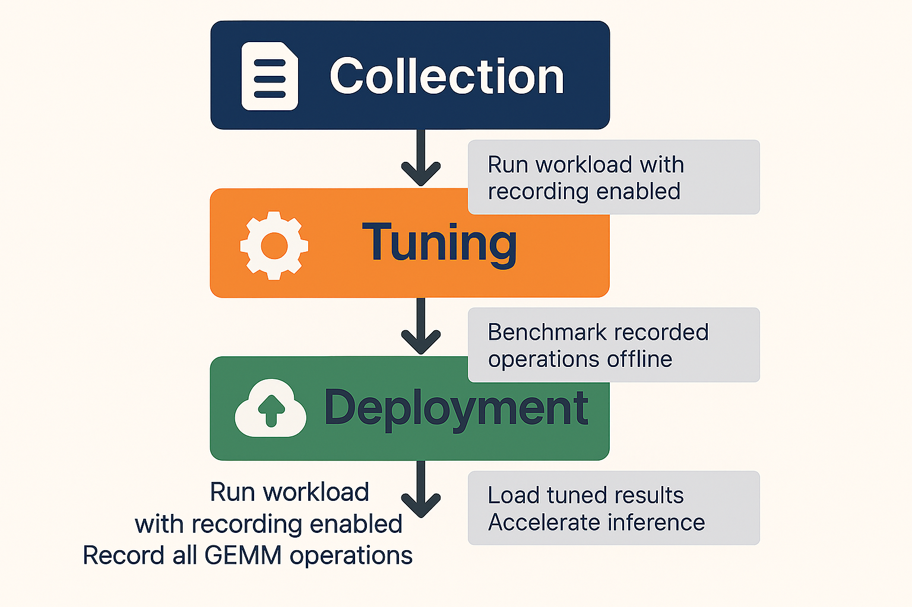

<!---
Copyright (c) 2026 Advanced Micro Devices, Inc. (AMD)

Permission is hereby granted, free of charge, to any person obtaining a copy
of this software and associated documentation files (the "Software"), to deal
in the Software without restriction, including without limitation the rights
to use, copy, modify, merge, publish, distribute, sublicense, and/or sell
copies of the Software, and to permit persons to whom the Software is
furnished to do so, subject to the following conditions:

The above copyright notice and this permission notice shall be included in all copies or substantial portions of the Software.

THE SOFTWARE IS PROVIDED "AS IS", WITHOUT WARRANTY OF ANY KIND, EXPRESS OR
IMPLIED, INCLUDING BUT NOT LIMITED TO THE WARRANTIES OF MERCHANTABILITY,
FITNESS FOR A PARTICULAR PURPOSE AND NONINFRINGEMENT. IN NO EVENT SHALL THE
AUTHORS OR COPYRIGHT HOLDERS BE LIABLE FOR ANY CLAIM, DAMAGES OR OTHER
LIABILITY, WHETHER IN AN ACTION OF CONTRACT, TORT OR OTHERWISE, ARISING FROM,
OUT OF OR IN CONNECTION WITH THE SOFTWARE OR THE USE OR OTHER DEALINGS IN THE
SOFTWARE.
--->

# PyTorch Offline Tuning with TunableOp

In an [earlier blog post,](https://rocm.blogs.amd.com/artificial-intelligence/pytorch-tunableop/README.html) we explored how PyTorch TunableOp can *potentially* accelerate models through **online tuning** - where during model execution, PyTorch benchmarks and selects optimal BLAS kernels. While online tuning is effective, it introduces overhead due to the time needed to execute the ML model from end-to-end. If this is done once, the overhead may be acceptable, but for repeated tuning it may be cost-prohibitive to keep re-running the model.

**Offline tuning** addresses this challenge by decoupling the tuning process from model execution. This approach allows you to collect operations during one run and tune them separately. In this blog, we'll explore:

- The differences between offline and online tuning
- Major updates to TunableOp since our last blog
- A practical walkthrough of offline tuning with real examples

**Note:** PyTorch TunableOp offline tuning is available in PyTorch v2.6 or later.

## Quick Start

To get started with offline tuning:

1. Identify your key inference or training workloads
2. Run the collection phase with representative inputs
3. Perform offline tuning on dedicated hardware
4. Deploy the tuned results to production
5. Monitor performance and extend tuning entries as needed

The offline tuning workflow is depicted in the figure below:


## Offline versus Online Tuning

Understanding the distinction between online and offline tuning is essential for choosing the right approach for your workload.

### Online Tuning

With **online tuning**, TunableOp performs the following steps during your workload execution:

1. **Encounter Operation**: When a GEMM operation is executed, TunableOp checks whether it has been tuned before
2. **Benchmark**: If not tuned, it queries all available implementations from the BLAS library
3. **Test Each Solution**: Benchmarks every candidate solution (potentially hundreds or thousands)
4. **Select Best**: Records the fastest solution
5. **Continue Execution**: Uses the optimal solution for subsequent calls

**Advantages:**

- Simple to use - just set a single environment variable:
  `PYTORCH_TUNABLEOP_ENABLED=1`
- No separate tuning step required.
- Practical for single-shot tuning, where additional re-tuning is not planned.

**Disadvantages:**

- May not be practical for large models or limited compute-time budgets.
- Requires having access to the ML model.

### Offline Tuning

**Offline tuning** separates the tuning process into distinct phases:

1. **Collection Phase**: Run your workload with recording enabled to capture all GEMM operations.
2. **Tuning Phase**: Separately benchmark the recorded operations without executing the full workload.

**Advantages:**

- **Flexible tuning environment** -- Ability to tune on a separate machine or separate environment. For example, the tuning phase can occur on a different number of GPUs than the collection phase.
- **More cost effective re-tuning** -- Able to re-tune with newer AMD ROCm™ software stack without re-running the original ML model.

**Disadvantages:**

- Requires a two-step process (collection + tuning).

## Major Updates to TunableOp

### Datatype Support

In addition to FP64, FP32, FP16 and BF16, TunableOp now supports TF32 and FP8 datatypes on AMD Instinct™ MI300 series GPUs. We are in the process of supporting the MX FP8 and FP4 formats on AMD Instinct™ MI350 series GPUs.

### Improved quality of tuning results

To improve tuning results, TunableOp now uses a rotating buffer to benchmark solutions under conditions which are closer to model runtime conditions. A rotating buffer is a tuning technique for simulating a cold cache. The default rotating buffer size is equal to the size of the L2 data cache (4MB on MI300 GPU). Rotating buffer sizes as large as 512 MB have been shown to improve tuning results. Additionally, we also flush the instruction cache which can be beneficial for small GEMMs.

### Real-time results

Rather than waiting until the very end of model execution to write results, TunableOp now immediately saves new tuning results to disk. This enhancement minimizes the risk of losing tuning results due to unexpected model runtime issues. (Available on PyTorch 2.10 and later).

### Numerical check

For numerically sensitive models, we have an improved numerical check that accepts both absolute and relative tolerance. (Available on PyTorch 2.10 and later). This numerical check uses the default GEMM kernel as the gold reference and verifies that the evaluated kernel is within the specified numerical tolerance. If it finds that the kernel is outside the numerical tolerance, it will reject the kernel from the list of acceptable solutions.

### New GEMM operations

In addition to tuning the standard GEMM operations, tuning of batch GEMM and GEMM with bias is now supported.

## TunableOp Offline Tuning Example

Let's walk through a complete offline tuning example using an OPT-125m language model. We'll demonstrate the three phases: collection, tuning, and deployment.

### Prerequisites

Before starting, ensure you have:

- AMD GPU with ROCm software version 7.0 or later
- PyTorch 2.7+ with ROCm support
- Transformers library (pip install transformers)

### Step 1: Recording Untuned Operations

The first step is to run your workload while recording all GEMM operations that TunableOp encounters. Create a file called llm_inference_forward.py:

```python
import os
import torch
import transformers

# Configure offline tuning - collection phase
os.environ['PYTORCH_TUNABLEOP_ENABLED'] = '1'
os.environ['PYTORCH_TUNABLEOP_TUNING'] = '0'  # Disable actual tuning
# Record all untuned operations
os.environ['PYTORCH_TUNABLEOP_RECORD_UNTUNED'] = '1'
# Optional: increase verbosity to see tuning progress
os.environ['PYTORCH_TUNABLEOP_VERBOSE'] = '2'

def run_inference():
    """Run forward pass workload with fixed shapes"""
    
    # Load model and tokenizer
    model_name = "facebook/opt-125m"
    tokenizer = transformers.AutoTokenizer.from_pretrained(model_name)
    model = transformers.AutoModelForCausalLM.from_pretrained(
        model_name,
        torch_dtype=torch.float16,
    ).to("cuda")
    
    # Prepare fixed-size batched input
    prompts = ["Hello, how are you doing today?"] * 8  # Batch of 8
    inputs = tokenizer(
        prompts, 
        return_tensors="pt", 
        padding="max_length",
        max_length=128,  # Fixed sequence length
        truncation=True
    ).to("cuda")
    
    # Run multiple forward passes to capture GEMM operations
    print("Running forward passes to collect GEMM operations...")
    model.eval()
    with torch.no_grad():
        for i in range(10):
            outputs = model(**inputs)
            if i == 0:
                print(f"Output shape: {outputs.logits.shape}")
    
    print(f"\nRecorded GEMM operations saved to tunableop_untuned0.csv")

if __name__ == "__main__":
    run_inference()
```

Run the collection phase:

```bash
python llm_inference_forward.py
```

**Output:**

```bash
Running forward passes to collect GEMM operations...
Output shape: torch.Size([8, 128, 50272])

Recorded GEMM operations saved to tunableop_untuned0.csv
```

After this step, you'll have a `tunableop_untuned0.csv` file containing
all unique GEMM operations encountered during inference. Let's
examine its contents:

```bash
cat tunableop_untuned0.csv
```

**Sample output:**

```bash
GemmAndBiasTunableOp_Half_TN,tn_768_1024_768_ld_768_768_768
GemmStridedBatchedTunableOp_float_TN,tn_128_128_64_B_96_ld_64_64_128
GemmStridedBatchedTunableOp_float_NN,nn_64_128_128_B_96_ld_64_128_64
GemmAndBiasTunableOp_Half_TN,tn_3072_1024_768_ld_768_768_3072
GemmAndBiasTunableOp_Half_TN,tn_768_1024_3072_ld_3072_3072_768
GemmTunableOp_Half_TN,tn_50272_1024_768_ld_768_768_50272
```

Each line represents a unique GEMM operation defined by:

- **Operation type**: `GemmAndBiasTunableOp_Half_TN` (with datatype + transpose configuration)
- **Problem size**: `tn_768_1024_768_ld_768_768_768` (matrix and leading
  dimensions)

### Step 2: Offline Tuning

Now we tune the recorded operations separately, without running the full model. Create `tune_offline.py`:

```python
import os
import torch

# Configure offline tuning - tuning phase
os.environ['PYTORCH_TUNABLEOP_ENABLED'] = '1'  # TunableOp Enabled
os.environ['PYTORCH_TUNABLEOP_TUNING'] = '1'  # Enable tuning
os.environ['PYTORCH_TUNABLEOP_ROTATING_BUFFER_SIZE'] = '512'  # set rotating buffer size in MBs
# Optional: increase verbosity to see tuning progress
os.environ['PYTORCH_TUNABLEOP_VERBOSE'] = '2'

def main():
    """
    The offline tuning process will:
    1. Read tunableop_untuned0.csv
    2. For each unique GEMM, benchmark all available implementations
    3. Write the fastest solution to tunableop_results0.csv
    """
    print("Starting offline tuning process...")
    print("This may take several minutes depending on the number of operations.\n")
    
    # Tune all GEMM operations from the untuned file
    # The environment variables already configure the tuning behavior
    input_file = 'tunableop_untuned0.csv'
    print(f"Reading untuned operations from {input_file}...")
    torch.cuda.tunable.tune_gemm_in_file(input_file)
    print("\nOffline tuning complete!")

if __name__ == "__main__":
    main()
```

Run the offline tuning:

```bash
python tune_offline.py
```

**Output (abbreviated):**

```bash
Starting offline tuning process...
This may take several minutes depending on the number of operations.

Reading untuned operations from tunableop_untuned0.csv...
reading tuning results from tunableop_results0.csv
could not open tunableop_results0.csv for reading tuning results
finding fastest for GemmAndBiasTunableOp_Half_TN(tn_768_1024_768_ld_768_768_768) out of 148 candidates
Rotating buffer 512 MiB. Needed Size: 4 MiB. Needed number of param copies: 125
└──found fastest for GemmAndBiasTunableOp_Half_TN(tn_768_1024_768_ld_768_768_768) Default
└──top five solutions for GemmAndBiasTunableOp_Half_TN(tn_768_1024_768_ld_768_768_768) 
   0.040352 Default
   0.040888 Gemm_Hipblaslt_1104
   0.042097 Gemm_Hipblaslt_1100
   0.048308 Gemm_Hipblaslt_1085
   0.052723 Gemm_Hipblaslt_1079
GemmAndBiasTunableOp_Half_TN(tn_768_1024_768_ld_768_768_768) -> Default,0.0403524
finding fastest for GemmStridedBatchedTunableOp_float_TN(tn_128_128_64_B_96_ld_64_64_128) out of 1074 candidates
Rotating buffer 512 MiB. Needed Size: 12 MiB. Needed number of param copies: 43
└──found fastest for GemmStridedBatchedTunableOp_float_TN(tn_128_128_64_B_96_ld_64_64_128) Gemm_Rocblas_-1140856325
└──top five solutions for GemmStridedBatchedTunableOp_float_TN(tn_128_128_64_B_96_ld_64_64_128) 
   0.033487 Gemm_Rocblas_-1140856325
   0.034511 Gemm_Rocblas_-1140856333
   0.037934 Gemm_Rocblas_-1140856334
...

Offline tuning complete!
```

The tuning process benchmarks every available implementation for each
GEMM and records the fastest. The output
file `tunableop_results0.csv` now contains the optimal solutions. An entry
called `Default` means that TunableOp was unable to identify a
solution that was better than the default implementation provided by the
preferred PyTorch BLAS library. On MI series GPUs, this will be the
hipBLASLt library.

### Step 3: Using Tuned Results

Finally, use the tuned results in production for accelerated inference.
Create `llm_inference_optimized_forward.py`:

```python
import os
import torch
import transformers

# Configure to use tuned results - no tuning, just loading existing tuned results
os.environ['PYTORCH_TUNABLEOP_ENABLED'] = '1'  # TunableOp enabled
os.environ['PYTORCH_TUNABLEOP_TUNING'] = '0'  # Disable tuning
# Optional: increase verbosity to see tuning progress
os.environ['PYTORCH_TUNABLEOP_VERBOSE'] = '2'

def benchmark_inference():
    """Benchmark forward pass inference"""
    
    # Load model
    model_name = "facebook/opt-125m"
    tokenizer = transformers.AutoTokenizer.from_pretrained(model_name)
    model = transformers.AutoModelForCausalLM.from_pretrained(
        model_name,
        torch_dtype=torch.float16,
    ).to("cuda")
    
    # Prepare fixed-size batched input
    prompts = ["Hello, how are you doing today?"] * 8  # Batch of 8
    inputs = tokenizer(
        prompts, 
        return_tensors="pt",
        padding="max_length",
        max_length=128,  # Fixed sequence length
        truncation=True
    ).to("cuda")
    
    # Warmup
    print("Warming up...")
    model.eval()
    with torch.no_grad():
        for _ in range(5):
            outputs = model(**inputs)
    
    # Benchmark
    n_iterations = 100
    
    print(f"Benchmarking {n_iterations} iterations...")
    
    start_event = torch.cuda.Event(enable_timing=True)
    end_event = torch.cuda.Event(enable_timing=True)
    
    start_event.record()
    torch.cuda.synchronize()
    
    with torch.no_grad():
        for _ in range(n_iterations):
            outputs = model(**inputs)
    
    end_event.record()
    torch.cuda.synchronize()
    
    elapsed = start_event.elapsed_time(end_event) / 1000
    throughput = n_iterations / elapsed
    
    print(f"\n{'='*60}")
    print(f"  Total time: {elapsed:.2f}s")
    print(f"  Iterations: {n_iterations}")
    print(f"  Throughput: {throughput:.2f} iterations/s")
    print(f"  Time per iteration: {elapsed/n_iterations*1000:.2f}ms")
    print(f"{'='*60}\n")
    
    return throughput

if __name__ == "__main__":
    tuned_throughput = benchmark_inference()
```

Note the use of `PYTORCH_TUNABLEOP_TUNING=0`. This is the best practice for benchmarking tuned models. This suppresses additional tuning that may occur in scenarios where GEMM sizes are dynamic and depend on runtime conditions. The PyTorch TunableOp environment variables can either be set on the command line or from inside the PyTorch script using the Python OS module.

Run the optimized inference with TunableOp:

```bash
python llm_inference_optimized_forward.py
```

**Output:**

```bash
reading tuning results from tunableop_results0.csv
Validator PT_VERSION=2.9.1
Validator HIP_VERSION=701
Validator HIPBLASLT_VERSION=100100-de5c1aebb6
Validator GCN_ARCH_NAME=gfx1100
Validator ROCBLAS_VERSION=5.1.0.de5c1aebb6
ROCBLAS_VERSION validation: expect 5.1.0.de5c1aebb6 to match 5.1.0.de5c1aebb6
GCN_ARCH_NAME validation: expect gfx1100 to match gfx1100
HIPBLASLT_VERSION validation: expect 100100-de5c1aebb6 to match 100100-de5c1aebb6
HIP_VERSION validation: expect 701 to match 701
PT_VERSION validation: expect 2.9.1 to match 2.9.1
Loading results
GemmAndBiasTunableOp_Half_TN(tn_768_1024_768_ld_768_768_768) -> Default,0.0403524
GemmAndBiasTunableOp_Half_TN(tn_3072_1024_768_ld_768_768_3072) -> Gemm_Hipblaslt_1104,0.102215
GemmAndBiasTunableOp_Half_TN(tn_768_1024_3072_ld_3072_3072_768) -> Default,0.107536
GemmStridedBatchedTunableOp_float_TN(tn_128_128_64_B_96_ld_64_64_128) -> Gemm_Rocblas_-1140856325,0.0334875
GemmStridedBatchedTunableOp_float_NN(nn_64_128_128_B_96_ld_64_128_64) -> Gemm_Rocblas_-1140854047,0.0337423
GemmTunableOp_Half_TN(tn_50272_1024_768_ld_768_768_50272) -> Gemm_Rocblas_-1140856876,0.873926

Warming up...
Benchmarking 100 iterations...

============================================================
  Total time: 0.97s
  Iterations: 100
  Throughput: 103.01 iterations/s
  Time per iteration: 9.71ms
============================================================
```

Now let's compare with baseline (TunableOp disabled). You will need to
modify the llm_inference_optimized_forward.py script by modifying this one line:

```python
os.environ['PYTORCH_TUNABLEOP_ENABLED'] = '0'  # TunableOp disabled
```

Now re-run the script to get a baseline:

```bash
python llm_inference_optimized_forward.py
```

**Output:**

```bash
Warming up...
Benchmarking 100 iterations...
============================================================
  Total time: 1.12s
  Iterations: 100
  Throughput: 89.46 iterations/s
  Time per iteration: 11.18ms
============================================================
```

As shown, using the offline tuning results yields approximately a 15% improvement in end-to-end performance.

**Note:** These results were obtained on an AMD Radeon PRO W7900 (gfx1100) using the docker image `rocm/pytorch:rocm7.1_ubuntu24.04_py3.13_pytorch_release_2.9.1`.

## Summary

In this blog you learned how to **potentially** accelerate PyTorch workloads with TunableOp offline tuning. Offline tuning splits the process into two phases: recording GEMM operations during a representative run, then benchmarking them separately. Decoupling tuning from model execution lets you tune on different hardware and re-tune with updated ROCm without re-running the full model. We covered recent TunableOp updates, including new datatype support, rotating buffer techniques, and improved numerical checks. We walked through a practical example with an OPT-125m model from collection through tuning to deployment. You saw how to record operations, run offline tuning, and load the results for inference. The example showed a clear performance gain when using the tuned results. Offline tuning offers a flexible way to improve performance while keeping tuning separate from your main workload.

## Additional Resources

- [PyTorch TunableOp Online Tuning Blog](https://rocm.blogs.amd.com/artificial-intelligence/pytorch-tunableop/README.html)

<!-- -->

- [PyTorch TunableOp GitHub Repository README](https://github.com/ROCm/pytorch/blob/develop/aten/src/ATen/cuda/tunable/README.md)

<!-- -->

- [ROCm Documentation - AMD MI300X tuning guides](https://rocm.docs.amd.com/en/latest/how-to/tuning-guides/mi300x/index.html)

## Disclaimers

Third-party content is licensed to you directly by the third party that owns the
content and is not licensed to you by AMD. ALL LINKED THIRD-PARTY CONTENT IS
PROVIDED “AS IS” WITHOUT A WARRANTY OF ANY KIND. USE OF SUCH THIRD-PARTY CONTENT
IS DONE AT YOUR SOLE DISCRETION AND UNDER NO CIRCUMSTANCES WILL AMD BE LIABLE TO
YOU FOR ANY THIRD-PARTY CONTENT. YOU ASSUME ALL RISK AND ARE SOLELY RESPONSIBLE
FOR ANY DAMAGES THAT MAY ARISE FROM YOUR USE OF THIRD-PARTY CONTENT.
