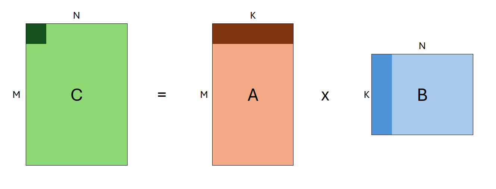
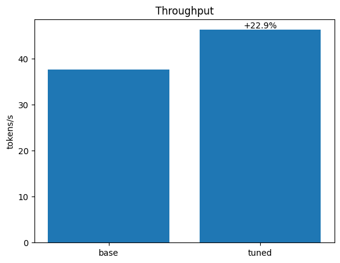

# Accelerating models on ROCm using PyTorch TunableOp

In this blog, we will show how to leverage PyTorch TunableOp to accelerate models using ROCm on AMD GPUs.
We will discuss the basics of General Matrix Multiplications (GEMMs), show an example of tuning a single GEMM, and finally, demonstrate real-world performance gains on an LLM (gemma) using TunableOp.

```{note}
PyTorch TunableOp is available in torch v2.3 or later
```

To run the code in this blog, see [running this blog](#running-this-blog) in the appendix.

## Introduction

As models grow in size and complexity, the need to run these models as efficiently as possible also grows. PyTorch TunableOp provides an easy avenue to achieve modest performance boosts to existing training and inference workloads, all by tuning the underlying GEMMs.

### General Matrix Multiplications

GEMMs are the basic building blocks for many components of neural networks, including fully-connected layers, convolutions, attention, and more. GEMMs are one of several components of [Basic Linear Algebra Subprograms (BLAS)](https://en.wikipedia.org/wiki/Basic_Linear_Algebra_Subprograms#Level_3) libraries, such as [hipBLAS](https://github.com/ROCm/hipBLAS).

A GEMM is a matrix multiplication operation which takes the form:

$C \leftarrow \alpha AB+\beta C$



Where $A$ and $B$ are input matrices (which may be transposed), $\alpha$ and $\beta$ are scalars, and $C$ is a preexisting matrix that serves as an output buffer.
The shapes of $A$, $B$ and $C$ are defined as `(M, K)`, `(K, N)`, and `(M, N)`, respectively.
As such, individual GEMMs are defined by the following input parameters: `transA, transB, M, N, K`.
Collectively, these paramters are also referred to as the **problem size**.

**Because GEMMs underlie so many components of neural networks, executing GEMMs as quickly and efficiently as possible is critical to improving the performance of ML workloads.**

For any given GEMM (as defined by the problem size), there are many different ways to solve it! There may be multiple BLAS libraries on the system.
Each BLAS library may have multiple different algorithms to solve the given GEMM, and each algorithm can have hundreds of possible unique parameter combinations.
As a result, **there may be thousands of distinct ways to solve even a single GEMM**, each with varying performance.

So that leaves the question: when PyTorch performs a matrix multiplication, how does it know which GEMM algorithm is the fastest? The answer: it doesn't.

At a very high level, when you run a matrix multiplication in PyTorch, `C = A @ B`, the following happens:

* PyTorch passes the matrices `A` and `B` down to the BLAS library through ([ATen](https://pytorch.org/cppdocs/#aten))
* The BLAS library uses built-in heuristics (often a look-up table) to choose an algorithm to solve the given GEMM
* The BLAS library computes the result, `C`
* The result is passed back up to PyTorch

However, these heuristics do not always choose the fastest algorithm, which can depend on many factors, including your specific environment, architecture, and more. This is where PyTorch TunableOp comes in.

### TunableOp and BLAS libraries

Instead of using the default GEMMs, TunableOp will _search for the best GEMMs for your specific environment_. It does so by first querying the underlying BLAS library for a list of all solutions for a given GEMM, benchmarking each of them, and then selecting the fastest. TunableOp then writes the solutions to disk, which can then be used on subsequent runs. This is powered by [hipBLAS](https://github.com/ROCm/hipBLAS) library, which supports tuning.

We enable TunableOp by setting the environment variable `PYTORCH_TUNABLEOP_ENABLED=1`, and then run our program normally. For example:

```shell
PYTORCH_TUNABLEOP_ENABLED=1 python my_model.py
```

Additionally, we turn on verbosity `PYTORCH_TUNABLEOP_VERBOSE=1` so we see what TunableOp is doing. For a full list of available options, see the [TunableOp README](https://github.com/pytorch/pytorch/tree/main/aten/src/ATen/cuda/tunable).

Let's take a deep dive into the functionality of TunableOp hrough the following examples.

## PyTorch TunableOp

## Example 1: Single matrix multiplication

In order to understand what PyTorch TunableOp is doing, we will tune a single matrix multiplication.

First, let's write a simple python program, `matmul.py`, where we:

* Construct two input matrices, `A`, and `B`, with shapes `(M, K)`, and `(K, N)` respectively
* Multiply them together 10,000 times, timing the operation
* Print the speed

Below is the contents of `src/matmul.py`:

```python
import torch


def time_matmul(M, N, K):
    n_iter = 10000  # Number of iterations to time
    n_warmup = 10  # Number of warmup iterations

    t0 = torch.cuda.Event(enable_timing=True)
    t1 = torch.cuda.Event(enable_timing=True)

    # Construct input matrices
    A = torch.rand(M, K, device="cuda")
    B = torch.rand(K, N, device="cuda")

    # Benchmark the GEMM
    for i in range(n_iter + n_warmup):
        if i == n_warmup:
            t0.record()  # Don't start recording until warmup is finished
        C = A @ B

    # Compute elapsed time
    t1.record()
    torch.cuda.synchronize()
    dt = t0.elapsed_time(t1) / 1000

    print(f"{n_iter/dt:0.2f} iter/s ({dt:0.4g}s)")


time_matmul(512, 1024, 2048)
```

Next, we can run this script:

```bash
python src/matmul.py
```

> ```bash
> 11231.81 iter/s (0.8903s)
> ```

We then run with PyTorch TunableOp enabled, by setting the environment variable `PYTORCH_TUNABLEOP_ENABLED=1`. We also turn on verbosity with `PYTORCH_TUNABLEOP_VERBOSE`, and select a specific output file with `PYTORCH_TUNABLEOP_FILENAME`.

```{note}
`PYTORCH_TUNABLEOP_FILENAME` is not required, but we use it here in order to separate results from various tuning runs. Typically, you would leave this variable unset, which would then write to the default filename, `tunableop_results.csv`
```

```bash
PYTORCH_TUNABLEOP_ENABLED=1\ 
PYTORCH_TUNABLEOP_VERBOSE=1\ 
PYTORCH_TUNABLEOP_FILENAME=src/matmul_result.csv\
python src/matmul.py
```

> ```bash
> > reading tuning results from src/matmul_result0.csv
> could not open src/matmul_result0.csv for reading tuning results
> missing op_signature, returning null ResultEntry
> finding fastest for GemmTunableOp_float_NN(nn_1024_512_2048) out of 1068 candidates
> ├──verify numerics: atol=1e-05, rtol=1e-05
> ├──tuning using warmup iters 1 [1.01208 ms] and tuning iters 29 [29.3505 ms] instance id=0, GemmTunableOp_float_NN(nn_1024_512_2048) Default
> ├──found better instance id=0. 0.280746ms. Default
> ├──unsupported id=1, GemmTunableOp_float_NN(nn_1024_512_2048) Gemm_Rocblas_1074
> ├──unsupported id=2, GemmTunableOp_float_NN(nn_1024_512_2048) Gemm_Rocblas_1075
> ...
> ...
> ...
> └──found fastest for GemmTunableOp_float_NN(nn_1024_512_2048) Gemm_Rocblas_4365
> 4.449s (2248 iter/s)
> writing file src/matmul_result0.csv
> ```

For a single GEMM, the tuning process usually takes less than a minute, but will produce thousands of lines of output. Below is a few key snippets from the tuning output:

* First, we see that TunableOp has found one GEMM to tune. With shape of (1024, 512, 2048), and there are 4454 candidate algorithms (this number may change based on your environment).

  ```bash
  ...
  finding fastest for GemmTunableOp_float_NN(nn_1024_512_2048) out of 4454 candidates
  ...
  ```

* Next, TunableOp benchmarks each algorithm in order to find the fastest. It first checks if the algorithm is numerically stable, and then times each algorithm. We see three distinct types of outputs:

  * Some algorithms are unsupported, these are skipped:

    ```bash
    ...
    ├──unsupported id=326, GemmTunableOp_float_TN(tn_1024_512_2048) Gemm_Rocblas_2702
    ...
    ```

  * In some cases, the GEMM was found to be too slow during the intiial checks, and are skipped:

    ```bash
    ...
    ├──verify numerics: atol=1e-05, rtol=1e-05
    ├──skip slow instance id=811, GemmTunableOp_float_NN(nn_512_1024_2048) Gemm_Rocblas_4381
    ...
    ```

  * The remaining algorithms are benchmarked:

    ```bash
    ...
    ├──verify numerics: atol=1e-05, rtol=1e-05
    ├──tuning using warmup iters 1 [0.566176 ms] and tuning iters 52 [29.4412 ms] instance id=525, GemmTunableOp_float_TN(tn_1024_512_2048) Gemm_Rocblas_3901
    ...
    ```

Finally, TunableOp will then determine the fastest algorithm, and write it to the result file `src/matmul_result0.csv`. We can then inspect the contents of this file:

```bash
Validator,PT_VERSION,2.4.0
Validator,ROCM_VERSION,6.0.0.0-91-08e5094
Validator,HIPBLASLT_VERSION,0.6.0-592518e7
Validator,GCN_ARCH_NAME,gfx90a:sramecc+:xnack-
Validator,ROCBLAS_VERSION,4.0.0-88df9726-dirty
GemmTunableOp_float_NN,nn_1024_512_2048,Gemm_Hipblaslt_NN_52565,0.0653662
```

* The result file will start with several `Validator` lines, which specify the environment used to produce this file. If you change any of these versions, this result will no longer be valid - TunableOp will detect these changes and will not load the tuning result. Instead, it will re-run tuning.

    ```{note}
    If tuning is re-run due to validator mismatch, the existing result file will be completely overwritten!
    ```

* The remaining lines represent the tuned solution for each GEMM encountered, and have four fields:

  1. Operator name
  1. Parameters
  1. Solution name
  1. Average execution time

  In our case, we have exactly one solution (name: `GemmTunableOp_float_NN`), with parameters `nn_1024_512_2048`. The first two letters of the parameters, `nn`, indicate that both matricies `A` and `B` were not transposed (`t` would indicate transposed), and the following three numbers are `M`, `N`, and `K`, respectively.

> But wait! In our script above, we had `M=512` and `N=1024`, but in the solution they are flipped! This is because [PyTorch can choose to transpose and commute A and B](https://github.com/pytorch/pytorch/blob/383d2d1f6c79dc69c3e88b0dc09b3e9e50cc48d4/aten/src/ATen/native/cuda/Blas.cpp#L88-L116) (because $AB=C$ is equivalent to $B^tA^t=C^t$), so our `M` and `N` are swapped before they reach the BLAS layer.

Now that we've run our tuning, we will re-run the script above. This time, it will pick up and apply the tunings.

```bash
PYTORCH_TUNABLEOP_ENABLED=1 PYTORCH_TUNABLEOP_VERBOSE=1 PYTORCH_TUNABLEOP_FILENAME=src/matmul_result.csv python src/matmul.py
```

```bash
reading tuning results from src/matmul_result0.csv
Validator,PT_VERSION,2.4.0
Validator,ROCM_VERSION,6.0.0.0-91-08e5094
Validator,HIPBLASLT_VERSION,0.6.0-592518e7
Validator,GCN_ARCH_NAME,gfx90a:sramecc+:xnack-
Validator,ROCBLAS_VERSION,4.0.0-88df9726-dirty
Loading results
GemmTunableOp_float_NN,nn_1024_512_2048,Gemm_Hipblaslt_NN_52565,0.0653662
14488.24 iter/s (0.6902s)
```

Great! With tuning, we achieved ~14500 iters/s (vs ~11900 iters/s without) **representing a 22% increase in throughput!**

### Extending Tunings

Additionally, we can build on top of our existing tunings. With tuning enabled, new GEMMs will be tuned as they are encountered, but existing GEMMs are not re-tuned, even across runs. This can be extremely useful if we are iterating on a network design, as we will only have to tune new shapes as they are encountered.

To demonstrate this, try editing and running the `src/matmul.py` script for a different GEMM size - say, `128,256,512`, and run again. You will see that TunableOp will add a single new line to the `matmul_results0.csv` file, with the solution for the new GEMM:

> ```bash
> Validator,PT_VERSION,2.4.0
> Validator,ROCM_VERSION,6.0.0.0-91-08e5094
> Validator,HIPBLASLT_VERSION,0.6.0-592518e7
> Validator,GCN_ARCH_NAME,gfx90a:sramecc+:xnack-
> Validator,ROCBLAS_VERSION,4.0.0-88df9726-dirty
> GemmTunableOp_float_NN,nn_1024_512_2048,Gemm_Hipblaslt_NN_52565,0.0653662
> GemmTunableOp_float_NN,nn_256_128_512,Gemm_Rocblas_21,0.00793602
> ```

Through this simple example, we have demonstrated how TunableOp works, how it selects and optimizes GEMMs, and directly linked our PyTorch code to the underlying GEMM calls.

Next, let's move on to something more complex.

## Example 2: Gemma

Let's test TunableOp on a real world example: [Gemma 2B](https://blog.google/technology/developers/gemma-open-models/), a lightweight, open source LLM from Google. When using TunableOp on a full model, **we should take care to minimize or even avoid dynamic shapes**! This is because TunableOp will perform an exhaustive search on _each unique GEMM encountered_. If you have hundreds or even thousands of unique shapes, that will take a very long time to tune!

When running inference with an LLM, dynamic shapes are introduced in two places:

1. **Prefill Phase** - During this phase, the model processes the input prompt and produces the first token. If we pass inputs with different lengths, different shapes will flow through the model; for each new input prompt length, we will encounter (and thus tune!) multiple new GEMMs.

   **We solve this issue by padding our input sequences.** On the extreme end, we could pad all inputs to our maximum input length. However, this isn't very efficient either, as for short prompts, we would waste a significant amount of computation on padding tokens! **A good intermediate is to Discretize the input sequence lengths, such as padding to multiples of 8** (e.g. seq. len 7 is padded to 8, 14 to 16, etc). In fact, HuggingFace's tokenizers have built-in support through the [`pad_to_multiple_of`](https://huggingface.co/docs/transformers/en/main_classes/tokenizer#transformers.PreTrainedTokenizer.__call__.pad_to_multiple_of) argument. Alternatively, discretizing to powers of 2 is another good option.

2. **Generation Phase (kv-cache)** - After generating the first token, the LLM autoregressively generates subsequent tokens by passing the output of the previous iteration back into the input. During generation, we use what is known as the **kv-cache**, which is an inference-time optimization that reduces redundant computation (for more details on the kv-cache, [see this article](https://medium.com/@joaolages/kv-caching-explained-276520203249)). **However, this kv-cache introduces more dynamic shapes!** As we generate each new token, the size of the kv-cache grows, introducing multiple new GEMMs to tune at each iteration.

   We solve this issue by using a "static" kv-cache. Essentially, we allocate a maximum size for the kv-cache up front, and then mask unused values at each step. Setting up a static kv-cache can be non-trivial if the model doesn't have built-in support. Here, we will make use of [HuggingFace's static kv-cache](https://huggingface.co/docs/transformers/main/en/llm_optims?static-kv=generation_config#static-kv-cache-and-torchcompile), which is supported for several models, including Gemma.

> Both of the above issues are faced when attempting to `torch.compile` LLMs, as discussed in [PyTorch's GPT-Fast blog post](https://pytorch.org/blog/accelerating-generative-ai-2/#step-1-reducing-cpu-overhead-through-torchcompile-and-a-static-kv-cache-1070-toks), however, they have slightly different solutions. To address the prefill phase, they compile the prefill part of the network separately using [dynamic shapes](https://pytorch.org/docs/stable/torch.compiler_dynamic_shapes.html#dynamic-shapes), while using standard compilation and a static kv-cache for the generation phase.

The contents of `src/llm.py` are shown below, which we will use to profile the latency (i.e. batch_size=1) of the model, with comments in-line to describe sections of the code.

```{note}
The `gemma` model is gated, so you will need to provide your own Huggingface token to download it and run this script.
```

```python
import os
import torch
import transformers
import click


# Use Click to parse command-line arguments
@click.command
@click.option("--tune", is_flag=True)
def main(tune):
    # Set some variables
    seq_len = 256  # Max sequence length to generate
    n_batches = 8  # Number of batches to time
    n_warmup = 2  # Number of warmup batches
    prompt = ["Hello Earthlings!"]  # Input prompt

    # We can enable tuning by setting the environment variables within the code - as long as we do so before
    # using torch. This is often less cumbersome than passing the environment variables each time
    if tune:
        print("Tuning enabled")
        os.environ["PYTORCH_TUNABLEOP_ENABLED"] = "1"  # Enable tuning
        os.environ["PYTORCH_TUNABLEOP_FILENAME"] = "src/llm_result.csv"  # Specify output file

    # Retrieve the model and tokenizer
    model = "google/gemma-2b"
    tokenizer = transformers.AutoTokenizer.from_pretrained(model)
    model = transformers.AutoModelForCausalLM.from_pretrained(model).to("cuda")

    # Set the model to use a static KV cache - see https://huggingface.co/docs/transformers/main/en/llm_optims?static-kv=generation_config#static-kv-cache-and-torchcompile
    model.generation_config.cache_implementation = "static"

    # Tokenize our input.
    # Use padding with `pad_to_multiple_of` to minimize the number of GEMMs to tune
    # Larger values => Less GEMMs to tune, but more potential overhead for shorter prompts
    inputs = tokenizer(prompt, return_tensors="pt", padding=True, pad_to_multiple_of=8).to("cuda")

    # Determine how many tokens to generate. Here, we need to subtract the number of tokens in the prompt to keep the same
    # overall sequence length
    n_tokens = seq_len - inputs["input_ids"].shape[1]  # number of tokens to generate

    t0 = torch.cuda.Event(enable_timing=True)
    t1 = torch.cuda.Event(enable_timing=True)
    for i in range(n_batches + n_warmup):
        # Don't start timing until we've finished our warmup iters
        if i == n_warmup:
            torch.cuda.synchronize()
            t0.record()

        # Generate!
        model.generate(
            **inputs,
            max_new_tokens=n_tokens,  # Force the model to generate exactly n_tokens before stopping
            min_new_tokens=n_tokens,
            use_cache=True,  # Ensure we use the kv-cache
        )

    # Complete timing, synchronize, and compute elapsed time
    t1.record()
    torch.cuda.synchronize()
    dt = t0.elapsed_time(t1) / 1000

    tokens_per_second = n_batches * n_tokens / dt
    print(f"  Tokens/second: {tokens_per_second:0.4f} ({n_tokens*n_batches} tokens, {dt:0.2f} seconds)")


if __name__ == "__main__":
    main()
```

First, let's run the script with tuning disabled:

```bash
python src/llm.py
```

> ```bash
>   Tokens/second: 37.5742 (1984 tokens, 52.80 seconds)
> ```

We achieve a throughput of 37.6 tokens/s. Next, let's enable tuning. Here, we use the command-line argument `--tune`, which our script will parse and then set relevant environment variables for us.

```note
Tuning will take some time, but will be silent, as we have not turned on verbosity! Feel free to edit the script to turn on verbosity.
```

```bash
python src/llm.py --tune
```

> ```bash
> Tuning enabled
>   Tokens/second: 46.2401 (1984 tokens, 42.91 seconds)
> ```

**Simply enabling tuning gave us a 22.9% speedup (37.6 -> 46.2 tokens/s)!**



## Conclusion

PyTorch TunableOp can be an easy and effective way to accelerate ML workloads on AMD by tuning GEMMs in your model. However, care must be taken when using TunableOp, specifically:

* The tuning process takes time - depending on the workload, it may take more time to tune than to run. However, **this is a one-time cost** since tunings can be re-used and expanded upon. This means tuning can be especially effective for longer training jobs and model serving, as well as during iterative developent.
* Dynamic shapes should be avoided or minimized, in order to reduce the number of unique GEMMS that need to be tuned.

With these considerations in mind, integrating TunableOp into your PyTorch workflow is an easy way to achieve modest performance gains on AMD GPUs without altering existing code and minimal additional effort.

## Further Reading

TunableOp is just one of several inference optimization techniques. For more, see [LLM Inference Optimizations on AMD GPUs](https://rocm.blogs.amd.com/artificial-intelligence/llm-inference-optimize/README.html#pytorch-tunableop)

## Appendix

### Running this blog

#### Prerequisites

To run the code in this blog, you will need the following:

* Hardware: AMD GPU - see the [list of compatible GPUs](https://rocm.docs.amd.com/projects/install-on-linux/en/latest/reference/system-requirements.html#supported-gpus)
* OS: Linux - see [supported Linux distributions](https://rocm.docs.amd.com/projects/install-on-linux/en/latest/reference/system-requirements.html#supported-operating-systems)
* Software: ROCm - see the [installation instructions](https://rocm.docs.amd.com/projects/install-on-linux/en/latest/tutorial/quick-start.html)

#### Installation

There are two ways to run the code in this blog. First, you can use docker (recommended), or you build your own python environment and run directly on host.

##### 1. Running in Docker

Using docker is the easiest and most reliable way to construct the required environment.

* Ensure you have Docker. If not, see the [installation instructions](https://docs.docker.com/get-docker/)

* Ensure you have `amdgpu-dkms` installed (which comes with ROCm) on the host to access GPUs from inside docker. See the [ROCm docker instructions here](https://rocm.docs.amd.com/projects/install-on-linux/en/latest/how-to/docker.html).

* Clone the repo, and `cd` into the blog directory

    ```shell
    git clone git@github.com:ROCm/rocm-blogs.git
    cd rocm-blogs/blogs/artificial-intelligence/pytorch-tunableop
    ```

* Build and start the container. For details on the build process, see the `dockerfile`. This will start a shell in the contianer.

    ```shell
    cd docker
    docker compose build
    docker compose run blog
    ```

##### 2. Running on host

If you don't want to use docker, you can also run this blog directly on your machine - although it takes a little more work.

* Prerequisites:
  * Install ROCm 6.0.x
  * Ensure you have python 3.10 installed
  * Install [PDM](https://pdm-project.org/latest/) - used here for creating reproducible python environments

* Create the python virtual environment in the root directory of this blog:
  
    ```shell
    pdm sync
    ```

* Run commands from this blog prefixed with `pdm run`, e.g.:

    ```shell
    pdm run python src/matmul.py
    ```

## Disclaimers

Third-party content is licensed to you directly by the third party that owns the content and is
not licensed to you by AMD. ALL LINKED THIRD-PARTY CONTENT IS PROVIDED “AS IS”
WITHOUT A WARRANTY OF ANY KIND. USE OF SUCH THIRD-PARTY CONTENT IS DONE AT
YOUR SOLE DISCRETION AND UNDER NO CIRCUMSTANCES WILL AMD BE LIABLE TO YOU FOR
ANY THIRD-PARTY CONTENT. YOU ASSUME ALL RISK AND ARE SOLELY RESPONSIBLE FOR ANY
DAMAGES THAT MAY ARISE FROM YOUR USE OF THIRD-PARTY CONTENT.
