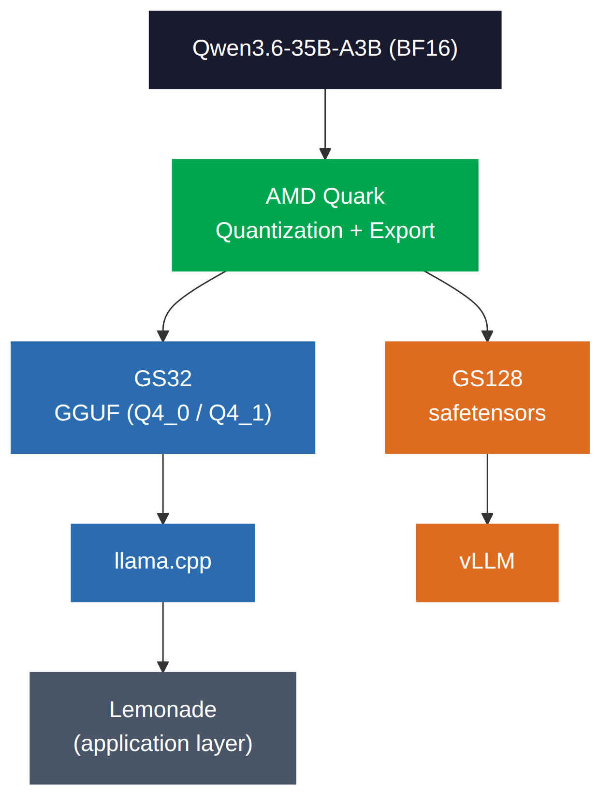
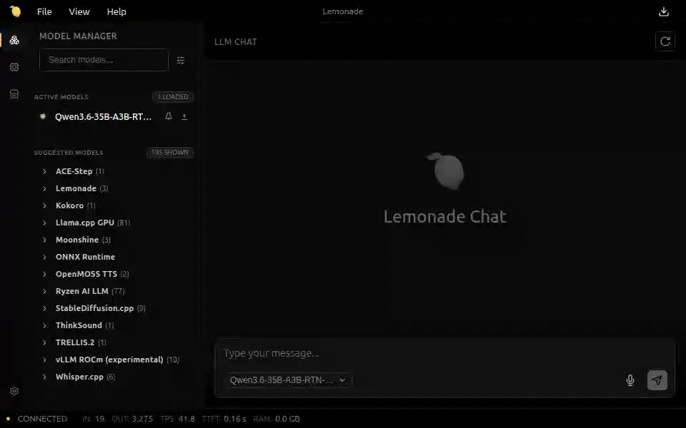

# Local Quantization and Multi-Backend Deployment with AMD Quark on Strix Halo

For local AI, running a model on the target device is only part of the deployment workflow. Model preparation, including quantization and export, is another important step. AMD [Quark](https://github.com/AMD/Quark) provides memory-efficient quantization workflows that make it possible to optimize large models directly on platforms such as AMD Strix Halo.

In this post, we quantize Qwen3.6-35B-A3B, a 35B-parameter Mixture-of-Experts model, from BF16 to W4A16 directly on a Strix Halo system with 128 GB of unified memory. Quantization reduces the model weights from roughly 70 GB to about 21 GB. We then export the quantized models into two deployment paths: GGUF for llama.cpp and safetensors for vLLM. We also validate the local application experience with Lemonade using the Quark-exported GGUF model.

Previous AMD Ryzen AI workflows demonstrated Quark quantization with [ONNX Runtime GenAI](https://www.amd.com/en/developer/resources/technical-articles/deepseek-distilled-models-on-ryzen-ai-processors.html). This post extends that deployment story into the broader open-source LLM ecosystem, covering quantization, export, backend validation, and application-level deployment on Strix Halo. Related AMD work includes [AI inference on the Ryzen AI Max processor](https://rocm.blogs.amd.com/artificial-intelligence/ryzen-uma-llm/README.html) and [Quark quantization on AMD Instinct MI350X/MI355X GPUs](https://rocm.blogs.amd.com/artificial-intelligence/eagle3-speculative-decoding/README.html).

## Prerequisites

To reproduce the workflows described in this post, you will need:

- An AMD Strix Halo system with a supported ROCm environment.
- AMD Quark and the inference runtime used for the deployment path you want to reproduce.
- Lemonade if you want to reproduce the application-level deployment demo.

## Platform

AMD Quark, llama.cpp, and vLLM can all be used on Strix Halo, enabling quantization and inference on the same target system.

For the experiments reported in this post, quantization, export, GGUF inference with llama.cpp, and the Lemonade application-level deployment check were performed directly on a single Strix Halo machine.

| Item | Value |
| --- | --- |
| Machine | ASUS ROG Flow Z13 (2025) |
| Processor | AMD Ryzen AI Max+ 395 |
| GPU | AMD Radeon 8060S |
| Memory | 128 GB unified LPDDR5X |
| OS | Ubuntu 24.04 LTS |
| ROCm | 7.2.0 |
| Quark | [amd-quark 0.12.post1](https://github.com/AMD/Quark) |
| llama.cpp | ROCm HIP build (`build-hip`) |
| vLLM | ROCm-enabled build with Quark W4A16 support |

The Strix Halo test system is a laptop-class device. Under sustained workloads, thermal and power limits can affect throughput, so performance measurements should be interpreted in the context of the specific device configuration.

## Model

We use [Qwen3.6-35B-A3B](https://huggingface.co/Qwen/Qwen3.6-35B-A3B) as the validation model. It is a Mixture-of-Experts model with 35B language-model parameters and approximately 3B activated per token. Its size and MoE architecture make it a representative workload for evaluating local quantization and deployment on Strix Halo.

## Pipeline Overview

The workflow consists of three stages:

1. **Quantize:** use AMD Quark to apply W4A16 weight-only quantization to selected model layers, producing a quantized checkpoint while keeping selected components in higher precision.
2. **Export:** export the quantized model into formats aligned with the target inference path, using GGUF for llama.cpp and safetensors with Quark quantization metadata for vLLM.
3. **Run:** load the exported model with llama.cpp or vLLM for backend-level inference and evaluation. At the application layer, Lemonade can consume the same GGUF artifact through its llama.cpp backend for local interactive use.

Conceptually, the workflow looks like this:

The key point is that deployment decisions begin during model preparation. Quantization configuration, export format, and inference-runtime support are related choices rather than completely independent stages.

## Stage 1: Quantization with AMD Quark

We apply W4A16 weight-only quantization using RTN (Round-To-Nearest), quantizing selected model linear layers to 4-bit while keeping activations and selected model components in higher precision. All variants are quantized directly on the Strix Halo system.

For this evaluation, we use four W4A16 configurations spanning two quantization schemes, symmetric INT4 and asymmetric UInt4, and two group sizes, 32 and 128.

| Model | Data Type | Group Size | Scheme |
| --- | --- | --- | --- |
| INT4-GS32 | INT4 | 32 | Symmetric |
| UInt4-GS32 | UInt4 | 32 | Asymmetric |
| INT4-GS128 | INT4 | 128 | Symmetric |
| UInt4-GS128 | UInt4 | 128 | Asymmetric |

Group size controls how many weights share the same quantization scale. Smaller groups provide finer-grained scaling and can reduce quantization error, while larger groups require less scale metadata and may be more efficient depending on the target format and runtime.

In this experiment, GS32 is used for the GGUF path and llama.cpp-based inference, while GS128 is used for the safetensors path and vLLM-based inference. Within the GGUF path, the symmetric and asymmetric configurations map to Q4_0 and Q4_1, respectively.

## Stage 2: Export

After quantization, Quark exports the model into formats aligned with the intended inference path.

- **GGUF path (GS32):** Quark exports the GS32 models to GGUF. The symmetric configuration maps to Q4_0 and the asymmetric configuration to Q4_1. These artifacts can be loaded directly by llama.cpp and can also be consumed by application layers such as Lemonade through its llama.cpp backend.
- **Safetensors path (GS128):** Quark exports the GS128 models in safetensors format and stores the corresponding quantization metadata in `config.json`. vLLM uses this metadata to load and execute the quantized model through its Quark integration.

Both export paths are generated directly from Quark without requiring an additional model-conversion step in the target inference runtime.

The quantized models used in this post are available on Hugging Face:

| Configuration | Group Size | Format | Hugging Face |
| --- | --- | --- | --- |
| INT4-GS32 | 32 | GGUF Q4_0 | [Qwen3.6-35B-A3B-Quark-INT4-G32-GGUF](https://huggingface.co/amd/Qwen3.6-35B-A3B-Quark-INT4-G32-GGUF) |
| UInt4-GS32 | 32 | GGUF Q4_1 | [Qwen3.6-35B-A3B-Quark-UINT4-G32-GGUF](https://huggingface.co/amd/Qwen3.6-35B-A3B-Quark-UINT4-G32-GGUF) |
| INT4-GS128 | 128 | safetensors | [Qwen3.6-35B-A3B-Quark-INT4-G128](https://huggingface.co/amd/Qwen3.6-35B-A3B-Quark-INT4-G128) |
| UInt4-GS128 | 128 | safetensors | [Qwen3.6-35B-A3B-Quark-UINT4-G128](https://huggingface.co/amd/Qwen3.6-35B-A3B-Quark-UINT4-G128) |

## Stage 3: Inference

The exported models are then validated with their corresponding inference runtimes.

- **llama.cpp path (GS32):** The Quark-exported GGUF files are loaded directly by a ROCm-enabled llama.cpp HIP build.
- **vLLM path (GS128):** The Quark-exported safetensors models are loaded through vLLM's Quark integration using the quantization metadata stored in `config.json`. For the vLLM build used in this evaluation, we explicitly set `VLLM_USE_TRITON_AWQ=1` to use the Triton AWQ kernel, which supports the MoE expert layer shapes exercised by this model.

At the application layer, Lemonade provides a local deployment experience on top of supported inference backends. In this post, we validate the Lemonade path using a GS32 GGUF artifact with its llama.cpp backend on Strix Halo. Lemonade also supports other inference backend configurations, including vLLM, but those paths are outside the scope of this evaluation.

## Weight Size

W4A16 quantization reduces the model artifact size from roughly 70 GB in 16-bit precision to about 21 GB, or approximately 30% of the original size. The result is larger than the theoretical 25% size of raw 4-bit weights because selected model components remain in higher precision and the quantized representation also includes per-group scales and metadata.

| Configuration | Format | Weight Size |
| --- | --- | --- |
| Original 16-bit model | 16-bit checkpoint / baseline | ~70 GB |
| GS32 | GGUF Q4_0 / Q4_1 | ~21.7 GB |
| GS128 | safetensors | 20.79 GB |

These figures describe the stored model artifacts rather than total runtime memory consumption. During inference, additional memory is required for KV cache, activations, runtime buffers, and framework overhead.

## Quantization Cost on Strix Halo

Because quantization runs directly on Strix Halo, we also report the resource cost of the quantization step itself.

| Configuration | Final Format | Peak Memory (GTT) | Quant Time | Export Time |
| --- | --- | ---: | ---: | ---: |
| INT4-GS32 | GGUF Q4_0 | 95 GB | 1.5 min | 22 min |
| UInt4-GS32 | GGUF Q4_1 | 95 GB | 0.8 min | 22 min |
| INT4-GS128 | safetensors | 73 GB | 0.8 min | 23 min |
| UInt4-GS128 | safetensors | 73 GB | 0.8 min | 18 min |

Peak memory is the peak GPU-visible unified memory (GTT) during quantization. Export time covers writing the deployable files; GS32 includes both the intermediate safetensors and the final GGUF. Peak memory stays within the system's 128 GB of unified memory in all cases, so quantizing a 35B model that starts at roughly 70 GB in BF16 fits on a single Strix Halo machine.

## Accuracy Benchmarks

This section reports how well the quantized models preserve accuracy relative to the 16-bit baseline, so you can judge whether a given W4A16 configuration is good enough for your use case. We evaluate the quantized models with [EleutherAI/lm-evaluation-harness](https://github.com/EleutherAI/lm-evaluation-harness), using the inference backend associated with each export path. The goal is to measure model quality relative to the 16-bit baseline, rather than to compare backend performance.

All results reported here were produced by AMD using the configurations described in this post as of August 2026. Results may vary with different model versions, software builds, runtime settings, and evaluation configurations.

The GS32 GGUF models are evaluated with llama.cpp on Strix Halo. For multiple-choice tasks that require log-likelihood scoring, including BBH, GPQA, MMLU-Pro, and MuSR, we use a patched `llama-server` that exposes prompt-token log probabilities to lm-evaluation-harness. The patch is used only for evaluation and is not required for normal GGUF inference.

The GS128 safetensors models are evaluated with vLLM using `tensor_parallel_size=4`, `gpu_memory_utilization=0.90`, and `max_model_len=8192`. For the vLLM build used in this evaluation, `VLLM_USE_TRITON_AWQ=1` is explicitly enabled to use the Triton AWQ kernel.

| Task | Metric | BF16 (baseline) | UInt4-GS128 (vLLM) | INT4-GS128 (vLLM) | UInt4-GS32 (llama.cpp) | INT4-GS32 (llama.cpp) |
| --- | --- | :---: | :---: | :---: | :---: | :---: |
| IFEval | prompt_level_strict | 0.3235 | 0.3383 | 0.3438 | 0.3512 | 0.3752 |
| IFEval | inst_level_strict | 0.4580 | 0.4664 | 0.4676 | 0.4808 | 0.4976 |
| MATH-hard | exact_match | 0.5287 | 0.4856 | 0.5083 | 0.5211 | 0.5234 |
| BBH | acc_norm | 0.6546 | 0.6270 | 0.6018 | 0.6449 | 0.6506 |
| GPQA | acc_norm | 0.4337 | 0.3658 | 0.3431 | 0.4018 | 0.4086 |
| MMLU-Pro | acc | 0.5968 | 0.5824 | 0.5687 | 0.5837 | 0.5825 |
| MuSR | acc_norm | 0.4339 | 0.4206 | 0.4630 | 0.4180 | 0.4471 |
| GSM8K (5-shot) | flexible-extract | 0.9158 | 0.9022 | 0.9045 | 0.9181 | 0.8954 |
| GSM8K (5-shot) | strict-match | 0.9090 | 0.8976 | 0.8961 | 0.9151 | 0.8916 |

> Testing by AMD in August 2026 using the hardware and software configuration described in this article. Results may vary based on hardware configuration, software versions, model revisions, runtime settings, workloads, and other factors.

> **Note:** The GS128 vLLM benchmark was executed on a separate data-center GPU system to reduce evaluation turnaround time. This was a benchmarking choice rather than a Strix Halo platform limitation.

Overall, the results show that the impact of 4-bit weight quantization is task dependent. Several configurations remain close to, or occasionally exceed, the 16-bit baseline on individual metrics, while other tasks show more noticeable degradation. The results do not indicate a single quantization configuration that is uniformly best across all tasks.

GS32 and GS128 also differ in export format and inference backend in this evaluation. The results therefore validate each deployment configuration as a whole rather than providing a controlled backend-independent comparison of group size alone.

On some tasks, a quantized configuration is at or slightly above the 16-bit baseline. This should not be read as quantization improving model quality; it reflects normal task-level variation and differences in evaluation backend, and the baseline and GS32 numbers were produced on different backends.

## Lemonade Deployment Check

To validate the application-level deployment experience, we load a Quark-exported GS32 GGUF model in [Lemonade](https://github.com/lemonade-sdk/lemonade) on Strix Halo.

For this experiment, Lemonade uses its llama.cpp backend to load the GGUF artifact directly and run an interactive chat session. No additional model conversion or manual llama.cpp build is required. Lemonade also supports other inference backend configurations, but those paths are outside the scope of this post.

**Lemonade Web UI demo (GS32 GGUF):** load the Quark-exported GGUF model in Lemonade, enter a prompt, and generate a response. The recording is intended to demonstrate the local application workflow rather than provide a performance benchmark.

## Summary

This work shows that AMD Quark can support a complete local model workflow on Strix Halo, from quantization and export to inference and application-level deployment, while producing artifacts that integrate with established open-source runtimes.

More broadly, the results highlight an important deployment consideration: quantization is not an isolated preprocessing step. Quantization configuration, export format, and runtime support are closely connected, and treating them as part of the same deployment design can simplify the path from an original model checkpoint to a practical local AI application.

## Additional Resources

- [AMD Quark](https://github.com/AMD/Quark)
- [Lemonade](https://github.com/lemonade-sdk/lemonade) and [Lemonade Server](https://lemonade-server.ai/)
- [AMD Lemonade Playbook](https://developer.amd.com/playbooks/lemonade-getting-started/)
- [Accelerate DeepSeek R1 Distilled Models Locally on AMD Ryzen AI NPU and iGPU](https://www.amd.com/en/developer/resources/technical-articles/deepseek-distilled-models-on-ryzen-ai-processors.html): an earlier Quark-to-ONNX Runtime GenAI client deployment path on Ryzen AI. This post extends the Quark workflow to GGUF/llama.cpp and safetensors/vLLM.
- [AI Inference on AMD Ryzen AI Max Processor](https://rocm.blogs.amd.com/artificial-intelligence/ryzen-uma-llm/README.html): large Qwen models running locally on Strix Halo using unified memory and GGUF-based inference. This post adds Quark-based quantization and export on the same platform.
- [Accelerating LLM Inference on AMD Instinct MI350X/MI355X with Eagle3 and AMD Quark](https://rocm.blogs.amd.com/artificial-intelligence/eagle3-speculative-decoding/README.html): Quark in a data-center inference workflow on AMD Instinct GPUs, complementing the local deployment path shown here.
- [ROCm 7.14: TheRock Goes Production](https://rocm.blogs.amd.com/ecosystems-and-partners/rocm-7.14-blog/README.html): broader ROCm platform context for the Ryzen AI MAX+ family.

## Disclaimers

The information presented in this document is for informational purposes only and may contain technical inaccuracies, omissions, and typographical errors. The information contained herein is subject to change and may be rendered inaccurate for many reasons, including but not limited to product and roadmap changes, component and motherboard version changes, new model and/or product releases, product differences between differing manufacturers, software changes, BIOS flashes, firmware upgrades, or the like. Any computer system has risks of security vulnerabilities that cannot be completely prevented or mitigated. AMD assumes no obligation to update or otherwise correct or revise this information. However, AMD reserves the right to revise this information and to make changes from time to time to the content hereof without obligation of AMD to notify any person of such revisions or changes. THIS INFORMATION IS PROVIDED "AS IS." AMD MAKES NO REPRESENTATIONS OR WARRANTIES WITH RESPECT TO THE CONTENTS HEREOF AND ASSUMES NO RESPONSIBILITY FOR ANY INACCURACIES, ERRORS, OR OMISSIONS THAT MAY APPEAR IN THIS INFORMATION. AMD SPECIFICALLY DISCLAIMS ANY IMPLIED WARRANTIES OF NON-INFRINGEMENT, MERCHANTABILITY, OR FITNESS FOR ANY PARTICULAR PURPOSE. IN NO EVENT WILL AMD BE LIABLE TO ANY PERSON FOR ANY RELIANCE, DIRECT, INDIRECT, SPECIAL, OR OTHER CONSEQUENTIAL DAMAGES ARISING FROM THE USE OF ANY INFORMATION CONTAINED HEREIN, EVEN IF AMD IS EXPRESSLY ADVISED OF THE POSSIBILITY OF SUCH DAMAGES. AMD, the AMD Arrow logo, and combinations thereof are trademarks of Advanced Micro Devices, Inc. Other product names used in this publication are for identification purposes only and may be trademarks of their respective companies. © 2026 Advanced Micro Devices, Inc. All rights reserved.
