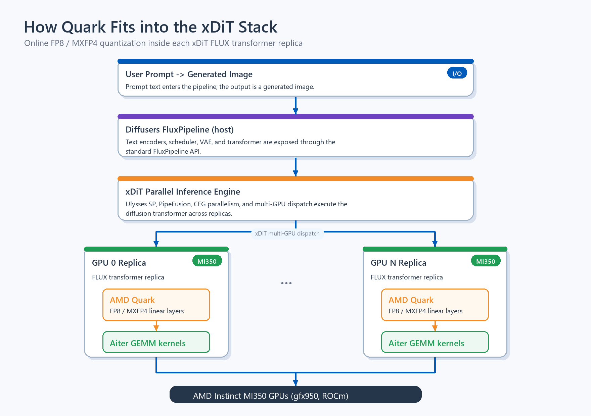

<!---
Copyright (c) 2026 Advanced Micro Devices, Inc. (AMD)

Permission is hereby granted, free of charge, to any person obtaining a copy
of this software and associated documentation files (the "Software"), to deal
in the Software without restriction, including without limitation the rights
to use, copy, modify, merge, publish, distribute, sublicense, and/or sell
copies of the Software, and to permit persons to whom the Software is
furnished to do so, subject to the following conditions:

The above copyright notice and this permission notice shall be included in all
copies or substantial portions of the Software.

THE SOFTWARE IS PROVIDED "AS IS", WITHOUT WARRANTY OF ANY KIND, EXPRESS OR
IMPLIED, INCLUDING BUT NOT LIMITED TO THE WARRANTIES OF MERCHANTABILITY,
FITNESS FOR A PARTICULAR PURPOSE AND NONINFRINGEMENT. IN NO EVENT SHALL THE
AUTHORS OR COPYRIGHT HOLDERS BE LIABLE FOR ANY CLAIM, DAMAGES OR OTHER
LIABILITY, WHETHER IN AN ACTION OF CONTRACT, TORT OR OTHERWISE, ARISING FROM,
OUT OF OR IN CONNECTION WITH THE SOFTWARE OR THE USE OR OTHER DEALINGS IN THE
SOFTWARE.
--->

# Accelerating Diffusers and xDiT Image Generation with MXFP4 using AMD Quark on AMD Instinct™ MI350 GPUs

Diffusion models such as Black Forest Labs' FLUX.1-dev [[1]](#references) deliver stunning image quality but demand significant compute and memory bandwidth at inference time. To reduce inference cost without sacrificing image quality, precision-aware quantization techniques have become a critical optimization strategy.

In this blog, we demonstrate how **AMD Quark** [[2]](#references), a high-performance quantization library optimized for AMD Instinct™ MI350 GPUs, enables **MXFP4** quantization for Diffusers [[5]](#references) and xDiT [[3]](#references) FLUX.1-dev image generation. Starting from BF16 eager and `torch.compile` baselines, we apply Quark native inference with AITER [[4]](#references) GEMM kernels and show that MXFP4 ASM with `torch.compile` reaches **1.92× speedup** over BF16 eager and **1.41× speedup** over BF16 `torch.compile`, while preserving CLIP quality.

---

## Quantization with Quark

AMD Quark is a comprehensive cross-platform deep learning toolkit designed to simplify and enhance the quantization of deep learning models. For diffusion model quantization, Quark is tightly integrated with ROCm™ and optimized for matrix-core acceleration. It provides:

- **Multiple numeric formats** — MXFP4, MXFP6, FP8, INT8, INT4, and more
- **Modular quantization flows** — Post-Training Quantization (PTQ), Quantization-Aware Training (QAT), and others
- **Support for diffusion models** — FLUX, Stable Diffusion, and large decoder-only LLMs
- **Native inference acceleration** — via AMD AITER GEMM kernels on MI300/MI350 GPUs
- **Seamless integration** — with inference pipelines such as Diffusers [[5]](#references), vLLM, and SGLang

With Quark, users can configure per-layer quantization schemes based on layer sensitivity, enabling both uniform and mixed-precision flows. By combining this flexibility with the native FP4/FP8 matrix-core capabilities of MI350 GPUs, Quark achieves near-lossless image quality while significantly improving inference efficiency.

Quark provides online quantization for xDiT to make inference more efficient. xDiT is a parallel inference engine for diffusion transformers — it shards and executes a model like FLUX.1-dev across one or more GPUs. Quark plugs into that pipeline at load time: it converts the BF16 transformer's linear layers into FP8 or MXFP4 in-memory and routes the resulting GEMMs to native AITER matrix-core kernels on MI300 / MI350 GPUs — with no offline checkpoint conversion required.

### How Quark Fits into the xDiT Stack

The diagram below shows where Quark sits inside the xDiT inference stack:



Diffusers exposes the standard `FluxPipeline` API, xDiT parallelizes the transformer across GPUs, and Quark online-quantizes each replica's linear layers to FP8 / MXFP4 so they execute on AITER's matrix-core GEMM kernels. The benchmarks in the rest of this blog measure the impact of this innermost swap — Quark-quantized linear layers — with the xDiT and Diffusers layers unchanged.

---

## Preparation

### Environment

| Component | Version / Image |
| :--- | :--- |
| Hardware | AMD Instinct™ MI350 (gfx950) |
| Docker | `rocm/pytorch-xdit:v26.5` |
| Quark Release | 0.12 |
| PyTorch | `2.9.1+git20a8ad0` (ROCm) |
| AITER | `0.1.10` |
| Model | `black-forest-labs/FLUX.1-dev` |
| Resolution | 1024 × 768, 20 inference steps, `guidance_scale=3.5` |

### Docker Setup

```bash
docker run -it \
    --cap-add=SYS_PTRACE \
    --security-opt seccomp=unconfined \
    --user root \
    --device=/dev/kfd --device=/dev/dri --device=/dev/mem \
    --group-add video \
    --ipc=host --network host --privileged \
    --shm-size 128G \
    --name flux_benchmark \
    -e HSA_NO_SCRATCH_RECLAIM=1 \
    -e CUDA_VISIBLE_DEVICES=0 \
    -v /shareddata/:/data \
    -v /home/$USER:/workspace \
    -w /workspace \
    rocm/pytorch-xdit:v26.5
```

### Install Dependencies (inside container)

```bash
apt-get update && apt-get install -y nano python3-tk

pip install torchmetrics transformers hpsv2 open_clip_torch pycocotools

# Install Quark from source (main branch)
cd /workspace
git clone https://github.com/amd/quark.git Quark && cd Quark
pip install -e .

# Verify GPU & AITER
rocm-smi --showproductname
python3 -c "import torch; print(torch.cuda.get_device_name(0))"
python3 -c "import aiter; print('AITER OK')"
```

---

## BF16 Baseline

BF16 (bfloat16) serves as the unquantized baseline configuration. It loads and runs the FLUX.1-dev model as-is in 16-bit floating point. No quantization is applied.

### Benchmark Script

```python
import torch
from diffusers import FluxPipeline

pipe = FluxPipeline.from_pretrained(
    "/data/black-forest-labs/FLUX.1-dev",
    torch_dtype=torch.bfloat16,
).to("cuda")

prompt = "A photo of a cat sitting on a windowsill at sunset"
for _ in range(3):  # warmup
    pipe(prompt, height=768, width=1024, num_inference_steps=20, guidance_scale=3.5)

import time
latencies = []
for _ in range(10):
    t0 = time.time()
    pipe(prompt, height=768, width=1024, num_inference_steps=20, guidance_scale=3.5)
    latencies.append(time.time() - t0)
print(f"BF16 Mean latency: {sum(latencies)/len(latencies):.3f} s/img")
```

---

## MXFP4 Quantization

MXFP4, defined as part of the OCP Microscaling (MX) specification [[6]](#references), groups 32 elements of 4-bit floating-point values to share a common E8M0 scaling exponent. Because it uses block-level scaling with FP4 elements, MXFP4 enables substantial model compression while retaining sufficient dynamic range for diffusion-model inference.

Supported natively on AMD Instinct™ MI350 and newer GPUs, MXFP4 delivers the strongest efficiency gains among all supported formats tested in this blog, achieving **up to 1.92× speedup** over the BF16 eager baseline and **1.41× speedup** over BF16 `torch.compile` when combined with the in-tree `torch.compile` fix that landed on Quark `main`.

### MXFP4 Quantization & Benchmark Script

```python
import torch
from diffusers import FluxPipeline
from quark.torch.quantization.api import ModelQuantizer, RuntimeOptions
from quark.torch.quantization.config.config import (
    QConfig, QLayerConfig, OCP_MXFP4Spec,
)

pipe = FluxPipeline.from_pretrained(
    "/data/black-forest-labs/FLUX.1-dev",
    torch_dtype=torch.bfloat16,
).to("cuda")

# Configure MXFP4 quantization with 32-element block scaling
weight_spec = OCP_MXFP4Spec(ch_axis=-1, is_dynamic=False).to_quantization_spec()
input_spec  = OCP_MXFP4Spec(ch_axis=-1, is_dynamic=True).to_quantization_spec()
layer_config = QLayerConfig(weight=weight_spec, input_tensors=input_spec)

quantizer = ModelQuantizer(QConfig(global_quant_config=layer_config))
pipe.transformer = quantizer.quantize_model(pipe.transformer)

# Freeze model with MXFP4 native inference (AITER FP4 GEMM kernels)
runtime_opts = RuntimeOptions(native_linear_mode="mxfp4")
pipe.transformer = ModelQuantizer.freeze(
    pipe.transformer, runtime_options=runtime_opts,
)

# Benchmark
prompt = "A photo of a cat sitting on a windowsill at sunset"
for _ in range(3):
    pipe(prompt, height=768, width=1024, num_inference_steps=20, guidance_scale=3.5)

import time
latencies = []
for _ in range(10):
    t0 = time.time()
    pipe(prompt, height=768, width=1024, num_inference_steps=20, guidance_scale=3.5)
    latencies.append(time.time() - t0)
print(f"MXFP4 Mean latency: {sum(latencies)/len(latencies):.3f} s/img")
```

### MXFP4 Kernel  

On Quark `main`, the MXFP4 native linear uses AITER's **ASM GEMM path by default**: `per_1x32_f4_quant_hip` for activation quantization plus `gemm_a4w4` with `bpreshuffle=True`, with a dequantization and matrix-multiply fallback for small-K layers. No user flag is needed. Instantiating `RuntimeOptions(native_linear_mode="mxfp4")` selects ASM automatically.

| Path | Activation Quantization | GEMM Kernel | Eager Latency | `torch.compile(mode=reduce overhead)` |
| :--- | :--- | :--- | :---: | :---: |
| **ASM** (default) | `per_1x32_f4_quant_hip` | `gemm_a4w4` | **1.779 s** | **1.069 s** |

---

## Quality Evaluation

Image quality is evaluated with **CLIP Score** [[7]](#references), a text-image alignment metric where higher is better, on 100 COCO 2017 [[8]](#references) caption prompts. We report results with `openai/clip-vit-base-patch16`, where FLUX scores land in the 30-32 range typical of FLUX papers.

### Evaluation Script

The CLIP evaluation helper is available as [`eval_clip.py`](src/eval_clip.py).

```bash
python3 eval_clip.py \
    --image_dir <OUTPUT_DIR>/images \
    --output_dir <OUTPUT_DIR>/clip \
    --coco_annotations /data/coco/annotations/captions_val2017.json \
    --num_prompts 100 \
    --model_name openai/clip-vit-base-patch16
```

Switch backbones via `--model_name`, for example `openai/clip-vit-large-patch14`. Any Hugging Face CLIP ID is accepted.

### Quality Results

| Configuration | CLIP (ViT-B/16) ↑ |
| :--- | :---: |
| **BF16 Eager (Baseline)** | 30.98 |
| **BF16** `torch.compile` | 31.38 |
| **MXFP4 ASM Eager** | 31.69 |
| **MXFP4 ASM** `torch.compile` | **31.84** |

> ↑ = indicates higher is better

All quantized configurations preserve CLIP quality within the per-configuration noise floor of ±0.5 absolute points on 100 samples. MXFP4 ASM matches or slightly exceeds BF16, and `torch.compile` does not regress quality on any path.

### Sample Images

The samples below compare BF16 against MXFP4 ASM for the same prompt and seed. Prompt 1 is "A black Honda motorcycle parked in front of a garage." Prompt 2 is "Two women waiting at a bench next to a street."

| **Prompt** | **BF16** | **MXFP4 ASM** |
|:---:|:----------:|:----------:|
| 1 |  |  |
| 2 |  |  |

---

## Performance Uplift

All latency measurements were collected on a single AMD Instinct™ MI350 (gfx950) GPU running FLUX.1-dev at 1024×768, 20 inference steps, averaged over 100 COCO captions.

### Latency Comparison

| Configuration | Latency (s/img) ↓ | Speedup vs BF16 eager ↑ |
| :--- | :---: | :---: |
| BF16 Eager (Baseline) | 2.054 | 1.00× |
| **MXFP4 ASM Eager** | 1.779 | **1.15×** |
| **BF16** `torch.compile` | 1.506 | **1.36×** |
| **MXFP4 ASM** `torch.compile` (in-tree fix) | **1.069** | **1.92×** |

> ↓ = indicates lower is better, ↑ = indicates higher is better

### Eager Performance Chart

```text
Speedup vs BF16 eager (higher is better)
━━━━━━━━━━━━━━━━━━━━━━━━━━━━━━━━━━━━━━━━━━━━━━━━━━━━━━━━━━━━━━━━━━━━━━━
BF16 Eager (baseline)   ████████████████████                  1.00× (2.054s)
MXFP4 ASM Eager         ███████████████████████               1.15× (1.779s)
```

### `torch.compile` Performance Chart

```text
Speedup vs BF16 torch.compile (higher is better)
━━━━━━━━━━━━━━━━━━━━━━━━━━━━━━━━━━━━━━━━━━━━━━━━━━━━━━━━━━━━━━━━━━━━━━━
BF16 torch.compile      ████████████████████                  1.00× (1.506s)
MXFP4 ASM Compiled      ████████████████████████████          1.41× (1.069s)
```

### Key Takeaways

1. **In eager mode, MXFP4 ASM is faster than BF16 eager**, reaching **1.15×** speedup at **1.779 s/img**.
2. **In `torch.compile` mode, MXFP4 ASM is 1.41× faster than BF16 `torch.compile`**, reducing latency from **1.506 s/img** to **1.069 s/img**. This is the clean same-mode comparison enabled by the in-tree opaque-op fix on Quark `main`.
3. **MXFP4 ASM with `torch.compile` is still 1.92× faster than BF16 eager overall**, making it the fastest configuration tested. This end-to-end view combines the benefits of low-precision GEMMs with compiler fusion around the BF16 operations.

---

## xFuser Multi-GPU Benchmarks

We also tested Quark MXFP4 with xFuser's Ulysses parallelism on multiple AMD Instinct™ MI350 GPUs. This path is useful when a model or workload requires multiple GPUs. At 1024×768 with 20 inference steps, the latest 2-GPU batch sweep shows that MXFP4 improves throughput by about **1.21× to 1.23×** over BF16 with `torch.compile(mode="reduce-overhead")`.

### 2-GPU Ulysses Benchmark

#### 2-GPU Benchmark Script

The 2-GPU benchmark uses xFuser's runner directly under `torchrun`. The core flow is shown below; rank 0 reports the average per-image latency after warmup.

Save the benchmark as a local Python script, then launch it with two visible GPUs:

```bash
SCRIPT=/path/to/your_2gpu_xdit_benchmark.py

CUDA_VISIBLE_DEVICES=0,1 HIP_VISIBLE_DEVICES=0,1 \
PRECISION=mxfp4 \
BATCH_SIZE=16 \
torchrun --nproc_per_node 2 --master_port 29541 "$SCRIPT"
```

Use `PRECISION=bf16` for the BF16 baseline and `PRECISION=mxfp4` for the Quark MXFP4 run. Set `BATCH_SIZE=4`, `8`, or `16` to reproduce the table rows.

```python
import os
import time

import torch
from xfuser.runner import xFuserModelRunner

from quark.torch.quantization.api import ModelQuantizer
from quark.torch.quantization.config.config import QConfig, QLayerConfig, OCP_MXFP4Spec
from quark.torch.quantization.utils import RuntimeOptions


PROMPTS = [
    "A photo of a city skyline at sunset with vivid orange and purple clouds",
    "A close-up portrait of a tabby cat sitting on a wooden windowsill",
    "An astronaut riding a horse through a snowy mountain pass at dawn",
]


def apply_mxfp4(transformer):
    spec = OCP_MXFP4Spec(ch_axis=-1, is_dynamic=True).to_quantization_spec()
    layer_config = QLayerConfig(weight=spec, input_tensors=spec)
    quantizer = ModelQuantizer(QConfig(global_quant_config=layer_config))
    transformer = quantizer.quantize_model(transformer)
    return quantizer.freeze(
        transformer,
        runtime_options=RuntimeOptions(native_linear_mode="mxfp4"),
    )


def compile_transformer_blocks(transformer):
    for i, block in enumerate(transformer.transformer_blocks):
        transformer.transformer_blocks[i] = torch.compile(block, mode="reduce-overhead", fullgraph=False)
    for i, block in enumerate(transformer.single_transformer_blocks):
        transformer.single_transformer_blocks[i] = torch.compile(block, mode="reduce-overhead", fullgraph=False)


def make_prompt_batch(batch_size, offset=0):
    return [PROMPTS[(offset + i) % len(PROMPTS)] for i in range(batch_size)]


def run_benchmark(precision="mxfp4", batch_size=16, warmup=2, num_iterations=6):
    config = {
        "model": "black-forest-labs/FLUX.1-dev",
        "height": 768,
        "width": 1024,
        "num_inference_steps": 20,
        "guidance_scale": 3.5,
        "max_sequence_length": 512,
        "ulysses_degree": 2,
        "ring_degree": 1,
        "output_directory": f"/tmp/flux_2gpu_{precision}",
        "warmup_calls": 0,
        "num_iterations": 1,
        "use_torch_compile": False,
        "seed": 42,
    }

    runner = xFuserModelRunner(config)
    input_args = runner.preprocess_args(config)
    runner.initialize(input_args)
    pipe = runner.model.pipe

    if precision == "mxfp4":
        pipe.transformer = apply_mxfp4(pipe.transformer)

    torch._inductor.config.reorder_for_compute_comm_overlap = True
    compile_transformer_blocks(pipe.transformer)

    for i in range(warmup):
        torch.compiler.cudagraph_mark_step_begin()
        runner.model._run_pipe({**input_args, "prompt": make_prompt_batch(batch_size, i)})
        torch.cuda.synchronize()

    timings = []
    for i in range(num_iterations):
        torch.cuda.synchronize()
        torch.compiler.cudagraph_mark_step_begin()
        start = time.perf_counter()
        runner.model._run_pipe({**input_args, "prompt": make_prompt_batch(batch_size, i)})
        torch.cuda.synchronize()
        timings.append(time.perf_counter() - start)

    if int(os.environ.get("RANK", 0)) == 0:
        time_per_iteration = sum(timings) / len(timings)
        print(f"{precision} batch {batch_size}: {time_per_iteration:.3f} s/iteration, {time_per_iteration / batch_size:.3f} s/img")

    runner.cleanup()


if __name__ == "__main__":
    run_benchmark(
        precision=os.environ.get("PRECISION", "mxfp4"),
        batch_size=int(os.environ.get("BATCH_SIZE", "16")),
    )
```

The `blocks_only` compile scope compiles the 19 dual transformer blocks and 38 single transformer blocks while leaving xFuser's top-level wrappers in eager mode. This avoids tracing xFuser's collective communication wrappers into the compiled graph.

#### 2-GPU Performance Comparison

The table below reports a 2-GPU Ulysses batch sweep on dual MI350 GPUs using `blocks_only` `torch.compile(mode="reduce-overhead")`, 6 timed iterations after 2 warmup iterations, and the same FLUX.1-dev settings used above.

| Precision | Batch | time(s) / iteration ↓ | time(s) / img ↓ | vs BF16 |
| :--- | ---: | ---: | ---: | ---: |
| BF16 | 4 | 4.488 | 1.122 | 1.00× |
| BF16 | 8 | 8.502 | 1.063 | 1.00× |
| BF16 | 16 | 16.826 | 1.052 | 1.00× |
| **MXFP4** | **4** | **3.666** | **0.916** | **1.22×** |
| **MXFP4** | **8** | **7.004** | **0.876** | **1.21×** |
| **MXFP4** | **16** | **13.682** | **0.855** | **1.23×** |

MXFP4 reaches the best 2-GPU result at batch 16: **0.855 s/img**, a **1.23×** throughput uplift over BF16 at the same batch size.

## Summary

This blog provides a practical, step-by-step guide to quantizing and accelerating FLUX.1-dev image generation using AMD Quark on AMD Instinct™ MI350 GPUs. On a single GPU, **MXFP4 ASM with `torch.compile`** delivers up to **1.92× speedup** over BF16 eager (1.069 s/img), and is also **1.41× faster** than BF16 `torch.compile`, with CLIP quality matching or exceeding BF16 on both ViT-L/14 and ViT-B/16 backbones. On the 2-GPU xFuser Ulysses path, MXFP4 with `torch.compile(mode="reduce-overhead")` reaches **0.855 s/img** at batch 16, a **1.23×** uplift over the BF16 2-GPU baseline.

By combining Quark's flexible quantization workflows with the native FP4 matrix-core capabilities of MI350-class GPUs and the `torch.compile`-compatible MXFP4 ASM path on Quark `main`, developers can efficiently deploy diffusion models with significantly lower latency and reduced memory footprint while maintaining near-lossless image quality.

## Acknowledgements

The authors wish to thank the AMD Quark and AITER teams for their invaluable guidance and support in enabling MXFP4 GEMM kernels on AMD Instinct™ MI350 GPUs.

## References

[1] [FLUX.1-dev](https://huggingface.co/black-forest-labs/FLUX.1-dev) — Black Forest Labs' open-weights diffusion transformer for text-to-image generation

[2] [AMD Quark](https://github.com/amd/quark) — A cross-platform deep learning quantization toolkit

[3] [xDiT](https://github.com/xdit-project/xDiT) — Inference engine for diffusion transformers with parallelism support

[4] [AITER](https://github.com/ROCm/aiter) — AI Tensor Engine for ROCm

[5] [Diffusers](https://github.com/huggingface/diffusers) — Hugging Face library for state-of-the-art diffusion models

[6] [OCP Microscaling Formats (MX) Specification](https://www.opencompute.org/documents/ocp-microscaling-formats-mx-v1-0-spec-final-pdf) — Open Compute Project standard for block-scaled low-precision formats

[7] [CLIP Score](https://github.com/openai/CLIP) — Text-image alignment metric based on OpenAI's CLIP model

[8] [COCO 2017](https://cocodataset.org/) — Common Objects in Context image-caption dataset

## Disclaimers

Third-party content is licensed to you directly by the third party that owns the
content and is not licensed to you by AMD. ALL LINKED THIRD-PARTY CONTENT IS
PROVIDED "AS IS" WITHOUT A WARRANTY OF ANY KIND. USE OF SUCH THIRD-PARTY CONTENT
IS DONE AT YOUR SOLE DISCRETION AND UNDER NO CIRCUMSTANCES WILL AMD BE LIABLE TO
YOU FOR ANY THIRD-PARTY CONTENT. YOU ASSUME ALL RISK AND ARE SOLELY RESPONSIBLE
FOR ANY DAMAGES THAT MAY ARISE FROM YOUR USE OF THIRD-PARTY CONTENT.

The information presented in this document is for informational purposes only and may
contain technical inaccuracies, omissions, and typographical errors. The information
contained herein is subject to change and may be rendered inaccurate for many reasons,
including but not limited to product and roadmap changes, component and motherboard
version changes, new model and/or product releases, product differences between
differing manufacturers, software changes, BIOS flashes, firmware upgrades, or the
like. Any computer system has risks of security vulnerabilities that cannot be completely
prevented or mitigated. AMD assumes no obligation to update or otherwise correct or
revise this information.

However, AMD reserves the right to revise this information and to make changes from
time to time to the content hereof without obligation of AMD to notify any person of
such revisions or changes.

THIS INFORMATION IS PROVIDED "AS IS." AMD MAKES NO REPRESENTATIONS OR WARRANTIES
WITH RESPECT TO THE CONTENTS HEREOF AND ASSUMES NO RESPONSIBILITY FOR ANY
INACCURACIES, ERRORS, OR OMISSIONS THAT MAY APPEAR IN THIS INFORMATION. AMD
SPECIFICALLY DISCLAIMS ANY IMPLIED WARRANTIES OF NON-INFRINGEMENT, MERCHANTABILITY,
OR FITNESS FOR ANY PARTICULAR PURPOSE. IN NO EVENT WILL AMD BE LIABLE TO ANY PERSON
FOR ANY RELIANCE, DIRECT, INDIRECT, SPECIAL, OR OTHER CONSEQUENTIAL DAMAGES ARISING
FROM THE USE OF ANY INFORMATION CONTAINED HEREIN, EVEN IF AMD IS EXPRESSLY ADVISED
OF THE POSSIBILITY OF SUCH DAMAGES.

AMD, the AMD Arrow logo, ROCm, Instinct, and combinations thereof are trademarks of
Advanced Micro Devices, Inc. Other product names used in this publication are for
identification purposes only and may be trademarks of their respective companies.
© 2026 Advanced Micro Devices, Inc. All rights reserved.
