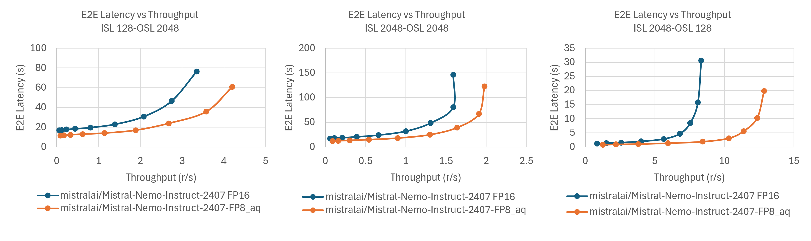
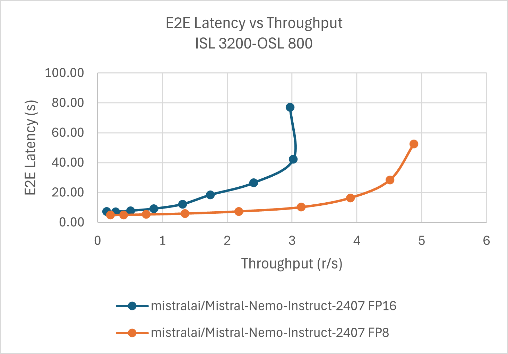

<!---
Copyright (c) 2025 Advanced Micro Devices, Inc. (AMD)

Permission is hereby granted, free of charge, to any person obtaining a copy
of this software and associated documentation files (the "Software"), to deal
in the Software without restriction, including without limitation the rights
to use, copy, modify, merge, publish, distribute, sublicense, and/or sell
copies of the Software, and to permit persons to whom the Software is
furnished to do so, subject to the following conditions:

The above copyright notice and this permission notice shall be included in all
copies or substantial portions of the Software.

THE SOFTWARE IS PROVIDED "AS IS", WITHOUT WARRANTY OF ANY KIND, EXPRESS OR
IMPLIED, INCLUDING BUT NOT LIMITED TO THE WARRANTIES OF MERCHANTABILITY,
FITNESS FOR A PARTICULAR PURPOSE AND NONINFRINGEMENT. IN NO EVENT SHALL THE
AUTHORS OR COPYRIGHT HOLDERS BE LIABLE FOR ANY CLAIM, DAMAGES OR OTHER
LIABILITY, WHETHER IN AN ACTION OF CONTRACT, TORT OR OTHERWISE, ARISING FROM,
OUT OF OR IN CONNECTION WITH THE SOFTWARE OR THE USE OR OTHER DEALINGS IN THE
SOFTWARE.
--->

# LLM Quantization with Quark on AMD GPUs: Accuracy and Performance Evaluation

As large language models (LLMs) grow in size and complexity, efficient inference becomes increasingly important. Quantization is a widely adopted technique to reduce memory usage and improve performance by representing weights and activations with lower-precision formats (e.g., FP16 to INT8 or FP8). This blog demonstrates how to use AMD’s [Quark](https://quark.docs.amd.com/latest/) to quantize large language models (LLMs) on AMD GPUs, and evaluates the resulting accuracy and performance. Additionally, the runtime performance of the quantized model is benchmarked across two widely used inference frameworks: [vLLM](https://github.com/vllm-project/vllm) and [SGLang](https://github.com/sgl-project/sglang).

## Why Quantization?

Quantization enables:

* Reduced memory footprint, which allows larger models to fit on limited GPU memory.

* Faster inference, thanks to reduced computational complexity and better memory bandwidth utilization.

* Lower power consumption, which is especially important for deployment in production environments.

However, these advantages come with trade-offs. Poorly executed quantization can lead to significant accuracy loss, making careful calibration and thorough post-quantization evaluation critical to maintaining model performance.

## Quantization with Quark

AMD Quark is a versatile, cross-platform deep learning toolkit that streamlines and enhances the quantization process for both PyTorch and ONNX models. It enables developers to efficiently optimize models for a broad range of hardware backends, delivering substantial performance improvements with minimal impact on accuracy.

This blog covers the following steps:

* Quantize [mistralai/Mistral-Nemo-Instruct-2407](https://huggingface.co/mistralai/Mistral-Nemo-Instruct-2407) LLM using Quark from FP16 to FP8.
* Run accuracy tests using standard evaluation scripts.
* Benchmark inference performance using vLLM and SGLang on AMD GPUs.

## Evaluation Setup

* Model: [mistralai/Mistral-Nemo-Instruct-2407](https://huggingface.co/mistralai/Mistral-Nemo-Instruct-2407)

* Hardware: [AMD Instinct GPU](https://www.amd.com/en/products/accelerators/instinct.html)

* Software & Frameworks:
  * [ROCm 6.3+](https://rocm.docs.amd.com/projects/install-on-linux/en/develop/how-to/amdgpu-install.html)
  * [PyTorch 2.3+ for ROCm](https://rocm.docs.amd.com/projects/install-on-linux/en/latest/how-to/3rd-party/pytorch-install.html)
  * [vLLM](https://github.com/vllm-project/vllm)
  * [SGLang](https://github.com/sgl-project/sglang)
  * [Quark](https://quark.docs.amd.com/latest/)

Specifically, the [Mistral-Nemo-Instruct-2407](https://huggingface.co/mistralai/Mistral-Nemo-Instruct-2407) model is used, which is a 12B parameter LLM based on the Mistral architecture. We apply different quantization methods to this model on AMD [MI300x](https://www.amd.com/en/products/accelerators/instinct/mi300/mi300x.html) GPU and evaluate the accuracy and performance of the model on vLLM and SGLang.

## Getting Started

This section applies different quantization methods to the [mistralai/Mistral-Nemo-Instruct-2407](https://huggingface.co/mistralai/Mistral-Nemo-Instruct-2407) model and evaluates its accuracy and performance using vLLM and SGLang.

### Quantize LLM with Quark on MI300x GPU

Follow the steps below to set up the environment used to quantize the model.

```bash
# Launch the container
docker run -it --name quark --rm  --device=/dev/kfd \
--device=/dev/dri/renderD128 --group-add=video --shm-size 8G -v "$PWD":/root  \
rocm/pytorch:rocm6.3.2_ubuntu22.04_py3.10_pytorch_release_2.4.0
```

Install Quark and other dependencies.

```bash
# Install Quark
    
wget -O amd_quark-0.8.zip "https://www.xilinx.com/bin/public/openDownload?filename=amd_quark-0.8.zip"
unzip amd_quark-0.8.zip
cd amd_quark-0.8
pip install amd_quark*.whl
cd ..
pip install transformers==4.50.3 accelerate==1.7.0 zstandard==0.23.0 evaluate==0.4.3 datasets==3.6.0
```

Verify the installation by running the following command. If no error is reported, the installation is successful.

```bash
python -c "import quark.torch.kernel"
```

Quantize the model. Assume the model has been downloaded to `~/workspace/mistralai/Mistral-Nemo-Instruct-2407` inside of the Docker container by following the steps below. Otherwise change the path to the model directory accordingly.

```bash
export HF_TOKEN= $your_huggingface_token 
pip install -U "huggingface_hub[cli]"
huggingface-cli download mistralai/Mistral-Nemo-Instruct-2407 --local-dir ~/workspace/mistralai/Mistral-Nemo-Instruct-2407
```

```bash
cd ~/amd_quark-0.8/examples/torch/language_modeling/llm_ptq/

python3 ./quantize_quark.py  \
--model_dir ~/workspace/mistralai/Mistral-Nemo-Instruct-2407 \
--output_dir ~/workspace/mistralai/Mistral-Nemo-Instruct-2407-FP8 \
--quant_scheme w_fp8_a_fp8 \
--kv_cache_dtype fp8 \
--num_calib_data 128 \
--multi_gpu \
--model_export hf_format \
```

The above command will quantize the model to FP8 format, and reports `[INFO] Perplexity:6.1672282218933105` with the measured [perplexity](https://huggingface.co/docs/transformers/en/perplexity) when successful. The `--kv_cache_dtype` option specifies the data type for the key-value cache, which is set to FP8 in this case. The `--num_calib_data` option specifies the number of calibration data points used for quantization.The `--model_export` option specifies the format of the exported model, which is set to Hugging Face format in this case. The `--fp8_attention_quant` option enables quantization for attention layers. The quantization process may take some time, depending on the size of the model and the number of calibration data points. After the quantization process is complete (around 10 minutes on MI300X), you will find the quantized model in the specified output directory and you can use it for inference with vLLM.

Different quantization algorithms can be used to quantize the model. The following shows the command to quantize the model using the [Activation-aware Weight Quantization (AWQ)](https://arxiv.org/abs/2306.00978) algorithm. The `--quant_algo` option specifies the quantization algorithm to be used, which is set to AWQ in this case. Please refer to the [Quark documentation](https://quark.docs.amd.com/latest/pytorch/quark_torch_best_practices.html) for more details on the available quantization algorithms and their trade-offs.

```bash
python3 ./quantize_quark.py  \
--model_dir ~/workspace/mistralai/Mistral-Nemo-Instruct-2407 \
--output_dir ~/workspace/mistralai/Mistral-Nemo-Instruct-2407-FP8-awq \
--quant_scheme w_fp8_a_fp8 \
--kv_cache_dtype fp8 \
--num_calib_data 128 \
--model_export hf_format \
--multi_gpu \
--quant_algo awq
```

At the time of writing, quantizing the model for use with SGLang requires the Quark script to run with `--custom_mode awq` option, which exports the model in a legacy FP8 format.

```bash
python3 ./quantize_quark.py  \
--model_dir ~/workspace/mistralai/Mistral-Nemo-Instruct-2407 \
--output_dir ~/workspace/mistralai/Mistral-Nemo-Instruct-2407-FP8_awq_sglang \
--quant_scheme w_fp8_a_fp8 \
--kv_cache_dtype fp8 \
--num_calib_data 128 \
--multi_gpu \
--custom_mode awq
```

### Accuracy Evaluation

After quantization, the accuracy of the quantized model is evaluated using the [Language Model Evaluation Harness](https://github.com/EleutherAI/lm-evaluation-harness). This library provides a standardized way to evaluate language models on various tasks and datasets. The evaluation script will compare the accuracy of the original and quantized models on a set of benchmark tasks.

Install the evaluation library and run the evaluation script. The evaluation takes time and it's recommended to use vLLM to accelerate this process. Please use the following steps to launch the vLLM docker container and make sure the model path is correctly set.

```bash
## Launch vLLM container
docker pull rocm/vllm-dev:main

docker run --name vllm -it --ipc=host --network=host --privileged \
--cap-add=CAP_SYS_ADMIN --device=/dev/kfd --device=/dev/dri/  --device=/dev/mem  \
--group-add render --cap-add=SYS_PTRACE --security-opt seccomp=unconfined \
-v "$PWD":/root  rocm/vllm-dev:main

# Install the evaluate library
git clone --depth 1 https://github.com/EleutherAI/lm-evaluation-harness
cd lm-evaluation-harness
pip install -e .
```

Inside the Docker container, navigate to the directory containing the `mistralai` folder, which holds both the original and quantized models. In this example, the `mistralai` folder is located in `~/workspace`.

```bash
# Change to the directory containing the models
cd ~/workspace

# Evaluate the original model
lm_eval \
    --model vllm \
    --model_args pretrained="./mistralai/Mistral-Nemo-Instruct-2407",dtype=auto,gpu_memory_utilization=0.4,max_model_len=4096 \
    --tasks openllm \
    --batch_size auto

# Evaluate the quantized model
lm_eval \
    --model vllm \
    --model_args pretrained="./mistralai/Mistral-Nemo-Instruct-2407-FP8",dtype=auto,gpu_memory_utilization=0.4,max_model_len=4096 \
    --tasks openllm \
    --batch_size auto

# Evaluate the quantized model with AWQ
lm_eval \
    --model vllm \
    --model_args pretrained="./mistralai/Mistral-Nemo-Instruct-2407-FP8-awq",dtype=auto,gpu_memory_utilization=0.4,max_model_len=4096 \
    --tasks openllm \
    --batch_size auto
```

After each evaluation, the results will be printed and it's something like the following:

```text
vllm (pretrained=./mistralai/Mistral-Nemo-Instruct-2407-FP8_aq,dtype=auto,gpu_memory_utilization=0.4,max_model_len=4096), gen_kwargs: (None), limit: None, num_fewshot: None, batch_size: auto
|                 Tasks                  |Version|     Filter     |n-shot|  Metric   |   | Value |   |Stderr|
|----------------------------------------|-------|----------------|-----:|-----------|---|------:|---|-----:|
|Open LLM Leaderboard                    |    N/A|                |      |           |   |       |   |      |
| - hellaswag                            |      1|none            |    10|acc        |↑  | 0.6454|±  |0.0048|
| - mmlu                                 |      2|none            |      |acc        |↑  | 0.6570|±  |0.0038|
...
|      Groups       |Version|Filter|n-shot|Metric|   |Value |   |Stderr|
|-------------------|------:|------|------|------|---|-----:|---|-----:|
| - mmlu            |      2|none  |      |acc   |↑  |0.6570|±  |0.0038|
|  - humanities     |      2|none  |      |acc   |↑  |0.6028|±  |0.0067|
|  - other          |      2|none  |      |acc   |↑  |0.7341|±  |0.0076|
|  - social sciences|      2|none  |      |acc   |↑  |0.7650|±  |0.0074|
|  - stem           |      2|none  |      |acc   |↑  |0.5563|±  |0.0084|
```

After running all the evaluations, you will see the results for both the original and quantized models. You can compare these metrics to assess the impact of quantization on model performance.

| Benchmark        |  FP16   | Base Q   | AWQ Q   |
|------------------|---------|----------|---------|
| [HellaSwag](https://huggingface.co/datasets/Rowan/hellaswag)        |  84.29% | 83.79%   | 83.82%  |
| [MMLU](https://huggingface.co/datasets/cais/mmlu)             |  68.22% | 65.70%   | 66.59%  |
| [Winogrande](https://huggingface.co/datasets/allenai/winogrande)       |  81.93% | 79.79%   | 79.95%  |
| [truthfulqa_mc1](https://github.com/sylinrl/TruthfulQA)   | 39.29%  | 40.15%   | 39.29%  |
| [truthfulqa_mc2](https://github.com/sylinrl/TruthfulQA)   | 54.82%  | 56.35%   | 55.79%  |

From the results show that `Mistral-Nemo-Instruct-2407-FP8` which is quantized using base quantization method has a slight accuracy drop compared to the original model. However, the AWQ quantization method shows a smaller drop in accuracy (<1%), indicating that it may be a better choice for maintaining performance while still benefiting from the advantages of quantization. Quark offers a range of quantization methods—including `GPTQ`, `SmoothQuant`, `AutoSmoothQuant`, `QuaRot`, and `Rotation`—each of which can significantly influence the final model’s performance. Please refer to the [Best Practices for Post-Training Quantization (PTQ)](https://quark.docs.amd.com/latest/pytorch/quark_torch_best_practices.html) for more details on the available quantization methods and their trade-offs.

### Performance Benchmarking

To benchmark the performance of the quantized model, both vLLM and SGLang are used. The following sections provide instructions for running inference with each framework.

#### vLLM

[vLLM](https://docs.vllm.ai/) is a high-performance inference engine for LLMs. To run inference with vLLM, follow these steps:

Set up the environment for vLLM by using the provided Docker image. This image includes all necessary dependencies and configurations for running vLLM on AMD GPUs. It assumes you have already installed the ROCm stack and have a compatible AMD GPU, and that the command is executed in the same directory as the quantized model.

```bash
## Launch container
docker pull rocm/vllm-dev:main

docker run --name vllm -it --ipc=host --network=host --privileged \
--cap-add=CAP_SYS_ADMIN --device=/dev/kfd --device=/dev/dri/  --device=/dev/mem  \
--group-add render --cap-add=SYS_PTRACE --security-opt seccomp=unconfined \
-v "$PWD":/root  rocm/vllm-dev:main
```

* Run the vLLM server with the FP16 model:

    On the server side, navigate to the directory containing the `mistralai` folder, which includes both the original and quantized models. In this example, `mistralai` is located under `~/workspace`. Run the following command to launch the vLLM server using the original FP16 model:

    ```bash
    # Change to the directory containing the models
    cd ~/workspace

    export VLLM_USE_TRITON_FLASH_ATTN=0
    export HIP_FORCE_DEV_KERNARG=1
    export VLLM_USE_ROCM_CUSTOM_PAGED_ATTN=1
    export VLLM_TEST_DYNAMO_FULLGRAPH_CAPTURE=1
    export TORCH_BLAS_PREFER_HIPBLASLT=1
    vllm serve ./mistralai/Mistral-Nemo-Instruct-2407  \
        --swap-space 16 \
        --disable-log-requests \
        --num-scheduler-steps 10 \
        --gpu_memory_utilization=0.9 \
        --max-num-seqs 1024
    ```

* On the client side, run the following command to send requests to the server. Please ensure you run the following command from the directory that contains the `mistralai` folder. The `client.sh` script can be found in [quark/src](https://github.com/ROCm/rocm-blogs/tree/release/blogs/artificial-intelligence/quark/src).

    ```bash
    # Change to the directory containing the models
    cd ~/workspace

    cd src/vllm
    bash client.sh ./mistralai/Mistral-Nemo-Instruct-2407
    ```

    The client will send requests to the server and display the results. The requests will be sent in batches, and the server will process them concurrently. Batch size, input sequence length(ISL) and output sequence length(OSL) can be adjusted in the client script. For our example which covers a variety of batch sizes and sequence lengths, the test may take around 1 hour to complete.

* Run the vLLM server with the FP8 model:

    On the server side, navigate to the directory containing the `mistralai` folder. Run the following command to launch the vLLM server using the original FP8 model:

    ```bash
    # Change to the directory containing the models
    cd ~/workspace

    export VLLM_USE_TRITON_FLASH_ATTN=0
    export HIP_FORCE_DEV_KERNARG=1
    export VLLM_USE_ROCM_CUSTOM_PAGED_ATTN=1
    export VLLM_TEST_DYNAMO_FULLGRAPH_CAPTURE=1
    export TORCH_BLAS_PREFER_HIPBLASLT=1
    vllm serve ./mistralai/Mistral-Nemo-Instruct-2407-F8_awq  \
        --swap-space 16 \
        --disable-log-requests \
        --num-scheduler-steps 10 \
        --gpu_memory_utilization=0.9 \
        --max-num-seqs 1024
    ```

* On the client side, run the following command to send requests to the server. Please ensure you run the following command from the directory that contains the `mistralai` folder.

    ```bash
    cd src/vllm
    bash client.sh ./mistralai/Mistral-Nemo-Instruct-2407-F8_awq
    ```

    The following charts show the performance of the original and quantized models on vLLM with different batch sizes and sequence lengths.

    

    The results show that the quantized FP8 model achieves significant performance improvements over the original FP16 model, with up to ~1.6× speedup in the best requests-per-second (r/s) case. This gain primarily stems from the reduced memory footprint and enhanced computational efficiency of the quantized model

#### SGLang

[SGLang](https://docs.sglang.ai/) is another high-performance inference engine for LLMs. To run inference with SGLang, follow these steps:

```bash
## Launch container
docker pull lmsysorg/sglang:v0.4.6.post3-rocm630-srt
docker run -it \
    --name chai_sglang \
    --ipc=host \
    --network=host \
    --privileged \
    --shm-size 32G \
    --cap-add=CAP_SYS_ADMIN \
    --device=/dev/kfd \
    --device=/dev/dri \
    --group-add video \
    --group-add render \
    --cap-add=SYS_PTRACE \
    --security-opt seccomp=unconfined \
    --security-opt apparmor=unconfined \
    -v "$PWD":/root \
    lmsysorg/sglang:v0.4.6.post3-rocm630-srt
```

* On the server side, navigate to the directory containing the `mistralai` folder, and run the following command to start the SGLang server with the original FP16 model or the quantized FP8 model.

    ```bash
    Path_to_your_model=./mistralai/Mistral-Nemo-Instruct-2407   #Fp16 model
    # Path_to_your_model=./mistralai/Mistral-Nemo-Instruct-2407-FP8_awq_sglang #Fp8 model
    python -m sglang.launch_server \
        --model-path "$Path_to_your_model" \
        --enable-torch-compile \
        --torch-compile-max-bs 256 \
        --trust-remote-code 
    ```

* On the client side, run the following command to send requests to the server:

    ```bash
    cd src/sglang
    bash client.sh 
    ```

    Similar to the vLLM use case, the client script sends batched requests to the server and displays the results. The server processes these requests concurrently. Batch size, input sequence length(ISL) and output sequence length(OSL) can be adjusted in the client script. After running the client script, you will see the results for both the original and quantized models. You can compare these metrics to assess the impact of quantization on model performance.
    The following chart shows the performance of the original and quantized models on SGLang with different batch sizes.

    

    As shown in the results, the quantized FP8 model delivers significant performance gains over the original FP16 model—achieving up to ~1.6× improvement in best tokens/sec. Notably, the FP16 model's throughput saturates at smaller batch sizes, while the FP8 model continues to scale, leaving ample headroom for further gains as the batch size increases. Similar to VLLM, this speedup is primarily attributed to the reduced memory footprint and enhanced computational efficiency enabled by quantization.

## Summary

This blog demonstrates how to apply quantization to large language models (LLMs) using the Quark toolkit on AMD GPUs. Specifically, the [mistralai/Mistral-Nemo-Instruct-2407](https://huggingface.co/mistralai/Mistral-Nemo-Instruct-2407) model is quantized from FP16 to FP8 and are evaluated its accuracy and inference performance using vLLM and SGLang.

With Quark, the quantized model delivered up to 1.6× speedup in inference throughput compared to its FP16 counterpart, while maintaining negligible accuracy degradation. These results demonstrate the effectiveness of quantization for optimizing LLMs for efficient deployment on AMD hardware.

## Disclaimers

Third-party content is licensed to you directly by the third party that owns the
content and is not licensed to you by AMD. ALL LINKED THIRD-PARTY CONTENT IS
PROVIDED “AS IS” WITHOUT A WARRANTY OF ANY KIND. USE OF SUCH THIRD-PARTY CONTENT
IS DONE AT YOUR SOLE DISCRETION AND UNDER NO CIRCUMSTANCES WILL AMD BE LIABLE TO
YOU FOR ANY THIRD-PARTY CONTENT. YOU ASSUME ALL RISK AND ARE SOLELY RESPONSIBLE
FOR ANY DAMAGES THAT MAY ARISE FROM YOUR USE OF THIRD-PARTY CONTENT.
