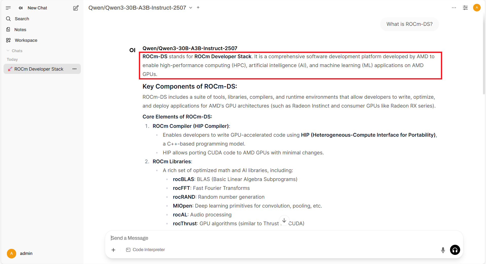
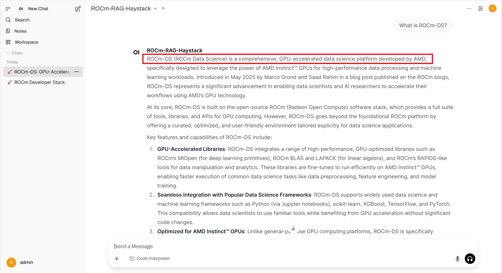
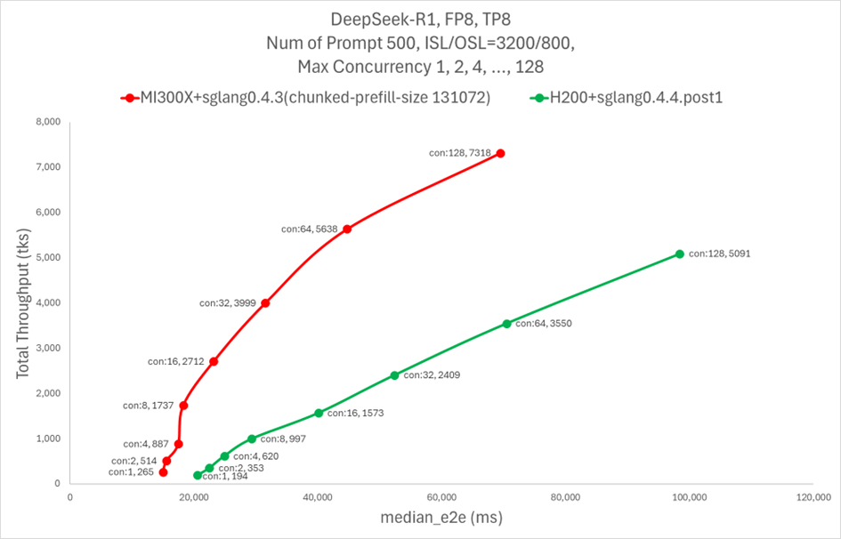
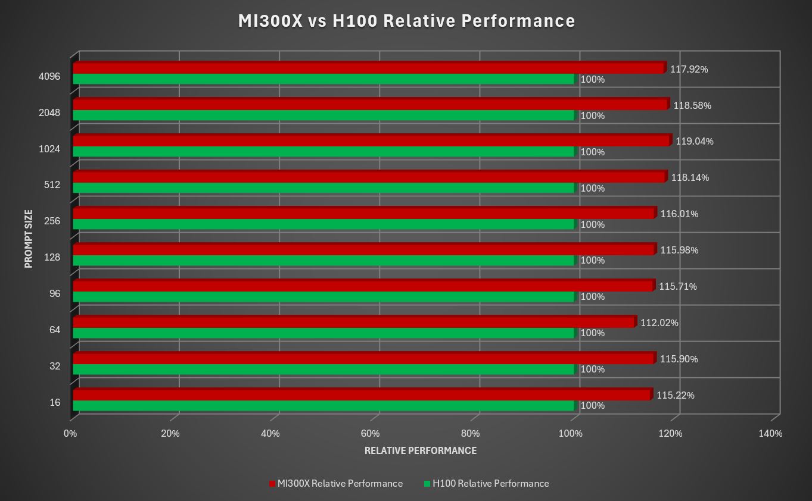

<!---
Copyright (c) 2025 Advanced Micro Devices, Inc. (AMD)

Permission is hereby granted, free of charge, to any person obtaining a copy
of this software and associated documentation files (the "Software"), to deal
in the Software without restriction, including without limitation the rights
to use, copy, modify, merge, publish, distribute, sublicense, and/or sell
copies of the Software, and to permit persons to whom the Software is
furnished to do so, subject to the following conditions:

The above copyright notice and this permission notice shall be included in all
copies or substantial portions of the Software.

THE SOFTWARE IS PROVIDED "AS IS", WITHOUT WARRANTY OF ANY KIND, EXPRESS OR
IMPLIED, INCLUDING BUT NOT LIMITED TO THE WARRANTIES OF MERCHANTABILITY,
FITNESS FOR A PARTICULAR PURPOSE AND NONINFRINGEMENT. IN NO EVENT SHALL THE
AUTHORS OR COPYRIGHT HOLDERS BE LIABLE FOR ANY CLAIM, DAMAGES OR OTHER
LIABILITY, WHETHER IN AN ACTION OF CONTRACT, TORT OR OTHERWISE, ARISING FROM,
OUT OF OR IN CONNECTION WITH THE SOFTWARE OR THE USE OR OTHER DEALINGS IN THE
SOFTWARE.
--->

# From Ingestion to Inference: RAG Pipelines on AMD GPUs

Retrieval-Augmented Generation (RAG) is a machine learning architecture that enhances Large Language Models (LLMs) by combining generation with information retrieval from external sources. It was introduced to address the limitations of traditional LLMs by allowing them to access and utilize up-to-date information from internal and/or external knowledge bases. When a query is received, RAG first retrieves relevant documents or information from its knowledge bases, then uses this retrieved context alongside the query to generate more accurate and informed responses. This approach helps reduce hallucinations (making up information) common in standard LLMs, while also enabling the model to access current information not present in its original training data. RAG has become particularly valuable in enterprise applications, such as customer support systems, research assistants, and documentation tools, where accuracy and verifiable information are crucial.

To implement RAG effectively, organizations rely on RAG pipelines (end-to-end systems) that process and manage information from raw data to final response generation. These pipelines operate in two main phases: the extraction phase and the retrieval phase. During extraction, documents are processed, split into chunks, converted into vector embeddings (numerical representations of text), and stored in a vector database. In the retrieval phase, when a user asks a question, the pipeline retrieves relevant information about the context, uses that to augment the question, and generates a response using an LLM. This ensures that the theoretical benefits of RAG are translated into practical, reliable results.

This guide explains how to build Retrieval-Augmented Generation systems optimized for AMD GPUs. It provides step-by-step instructions to help you develop efficient RAG applications on AMD hardware. The current implementation offers options to use [Haystack](https://haystack.deepset.ai/) or [LangGraph](https://www.langchain.com/langgraph) as RAG frameworks, and [SGLang](https://github.com/sgl-project/sglang.git), [vLLM](https://github.com/vllm-project/vllm.git), or [llama.cpp](https://github.com/ggml-org/llama.cpp.git) as inference frameworks.

All the files required to follow this blog are available in the [ROCm Blogs GitHub folder](https://github.com/ROCm/rocm-blogs/tree/release/blogs/artificial-intelligence/rag-agent). For more information on RAG workflows on AMD GPUs visit the official GitHub repository [rocm-rag](https://github.com/ROCm/rocm-rag).

## ROCm RAG Agent

* [Installation](https://rocm.docs.amd.com/projects/rocm-rag/en/latest/install/configure-framework.html)

* [Docker image](https://hub.docker.com/r/rocm/rocm-rag/tags)

* [GitHub](https://github.com/ROCm/rocm-rag)

## Requirements

* AMD GPU: See the [ROCm documentation page](https://rocm.docs.amd.com/projects/install-on-linux/en/latest/reference/system-requirements.html) for supported hardware and operating systems.

* ROCm 6.4: See the [ROCm installation for Linux](https://rocm.docs.amd.com/projects/install-on-linux/en/latest/index.html) for installation instructions.

* Docker: See [Install Docker Engine on Ubuntu](https://docs.docker.com/engine/install/ubuntu/#install-using-the-repository) for installation instructions.

## Build and start the Docker container

You can run the ROCm RAG container in two ways, depending on whether you want an interactive session or to execute the pipelines directly (the results are the same in both cases). This blog uses the interactive mode, which allows you to explore and debug the container manually. For more details about the direct execution mode please visit [rag pipeline direct-execution](https://github.com/ROCm/rocm-rag?tab=readme-ov-file#2-direct-execution).

1. Clone the `rocm-rag` repo and `cd` into the `rocm-rag` directory:

    ```bash
    git clone https://github.com/ROCm/rocm-rag.git --recursive
    cd rocm-rag
    ```

2. Build the `rocm-rag` Docker image:

    ```bash
    docker build -t rocm-rag -f docker/rocm.Dockerfile . 
    ```

3. Start the Docker container in interactive mode:

    ```bash
    docker run --cap-add=SYS_PTRACE \
        --rm \
        --ipc=host \
        --privileged=true \
        --shm-size=128GB \
        --network=host \
        --device=/dev/kfd \
        --device=/dev/dri \
        --group-add video -it \
        rocm-rag:latest
    ```

## Run extraction pipeline

An extraction pipeline consists of the process of identifying, retrieving, and preparing the most relevant information from a large knowledge base to be used as context for an LLM query. Its main purpose is to prepare a focused set of passages from the raw data that the model uses when generating the answer to the user query. The current implementation leverages widely adopted RAG frameworks including:

* Haystack: An open-source framework designed for building search systems, QA pipelines, and RAG workflows.
* LangGraph: A modular framework tailored for developing applications powered by language models. It integrates closely with LangChain.

Both frameworks are actively maintained and widely used in the field of LLM-based application development. By default, Haystack is used, though you can configure which framework to use by setting the relevant environment variables when running the Docker container as follows:

```bash
# Options: haystack, langgraph
ROCM_RAG_EXTRACTION_FRAMEWORK=haystack
ROCM_RAG_RETRIEVAL_FRAMEWORK=haystack
```

In this RAG pipeline example, a web scraper is used to scrape all blog pages starting from the site [ROCm Blogs Home](https://rocm.blogs.amd.com/). You can limit the scope of scraping by setting the following environment variables: `ROCM_RAG_START_URLS`, `ROCM_RAG_SET_MAX_NUM_PAGES` and `ROCM_RAG_MAX_NUM_PAGES`.

To limit the scraping process to a specific blog page such as [Introducing ROCm-DS](https://rocm.blogs.amd.com/software-tools-optimization/introducing-rocm-ds-revolutionizing-data-processing-with-amd-instinct-gpus/README.html) under [ROCm Blogs Home](https://rocm.blogs.amd.com/), you need to set the environment variables to the following values:

```bash
export ROCM_RAG_START_URLS="https://rocm.blogs.amd.com/software-tools-optimization/introducing-rocm-ds-revolutionizing-data-processing-with-amd-instinct-gpus/README.html"

export ROCM_RAG_SET_MAX_NUM_PAGES=True

export ROCM_RAG_MAX_NUM_PAGES=1
```

```{note}
In this example, ROCM_RAG_START_URLS points to the blog post "Introducing ROCm-DS: GPU-Accelerated Data Science for AMD Instinct GPUs", which introduces ROCm-DS (ROCm Data Science), a new toolkit designed to accelerate data processing workloads on AMD Instinct™ GPUs.
```

With these configurations, you can start the extraction process by running:

```bash
cd /rag-workspace/rocm-rag/scripts
bash run-extraction.sh
```

The extraction script will crawl, scrape, recursively chunk, index, and persist content to a Weaviate database for future use. [Weaviate](https://weaviate.io/) is an open‑source vector search engine and knowledge graph that stores embeddings with metadata to power semantic, nearest‑neighbor, and hybrid searches. The chunking step uses recursive, semantics‑aware splitting to produce context‑rich, semantically tight segments. Since chunk size is critical for retrieval-performance, accuracy degrades if chunks are too large (diluting the signal) or too small (losing context). The indexing process uses continuous indexing: incrementally updating the index with new documents as they come in, or update existing documents if there are changes, without interrupting the system or fully rebuilding the index every time.

 By default, embeddings are generated with `e5‑mistral‑7b‑instruct`. You can select a different embedding model by setting the `ROCM_RAG_EMBEDDER_MODEL` environment variable to the appropriate value.

During the extraction process, the output on your terminal will look like:

```bash
{"build_git_commit":"","build_go_version":"go1.24.5","build_image_tag":"","build_wv_version":"1.32.0-rc.1","level":"warning","log_level_env":"","msg":"log level not recognized, defaulting to info","time":"2025-09-03T18:48:06Z"}
{"action":"startup","build_git_commit":"","build_go_version":"go1.24.5","build_image_tag":"","build_wv_version":"1.32.0-rc.1","level":"info","msg":"Feature flag LD integration disabled: could not locate WEAVIATE_LD_API_KEY env variable","time":"2025-09-03T18:48:06Z"}
...
All background processes have been closed.
Shutting down services...
 → Background service (PID 16) already stopped
 → Background service (PID 17) already stopped
 → Background service (PID 18) already stopped
All background processes have been closed.
```

The previous output indicates the process was completed correctly. To confirm that all URLs were processed, check the logs folder: `/rag-workspace/rocm-rag/logs`. In particular, review these files for extraction progress: `haystack_extraction.log` and `visited_urls.txt`.

## Run retrieval pipeline

The rocm-rag pipeline can use any LLM including DeepSeek-V3.1, DeepSeek-V3-0324, DeepSeek-V3-0324-Q4_K_M, the Llama model family, and others, as the generator. Once the extraction pipeline is completed, you can proceed to start the retrieval pipeline. By default, the rocm-rag pipeline launches `Qwen/Qwen3-30B-A3B-Instruct-2507` served by vLLM inside the Docker container. Additionally, vLLM is set to use GPU 1 and GPU 2 for serving the LLM. For more details about using a different LLM serving engine see [Inferencing Framework Options](https://github.com/ROCm/rocm-rag?tab=readme-ov-file#rag-framework-options).

Execute the retrieval process by running:

```bash
cd /rag-workspace/rocm-rag/scripts
bash run-retrieval.sh
```

This may take a few minutes while the model `Qwen/Qwen3-30B-A3B-Instruct-2507` is downloaded and served. During this time the terminal will display the download and startup progress.

```bash
INFO:     Will watch for changes in these directories: ['/rag-workspace/rocm-rag/external/open-webui/backend']
INFO:     Uvicorn running on http://0.0.0.0:8080 (Press CTRL+C to quit)
INFO:     Started reloader process [19734] using WatchFiles
{"build_git_commit":"","build_go_version":"go1.24.5","build_image_tag":"","build_wv_version":"1.32.0-rc.1","level":"warning","log_level_env":"","msg":"log level not recognized, defaulting to info","time":"2025-09-03T19:07:27Z"}
...
(VllmWorker TP1 pid=21407) [aiter] [fused_moe] using 2stage default for (1, 2048, 384, 128, 8, 'ActivationType.Silu', 'torch.bfloat16', 'torch.bfloat16', 'torch.bfloat16', 'QuantType.No', True, False) 
Capturing CUDA graph shapes: 100%|████████████████████████████████████████████████████████████████████████████████████████████████████████████████████████████████████████████████████████████████████████████████████| 67/67 [00:07<00:00,  8.43it/s]
(APIServer pid=20370) INFO:     Started server process [20370]
(APIServer pid=20370) INFO:     Waiting for application startup.
(APIServer pid=20370) INFO:     Application startup complete.
```

With all the components in place, you can experiment with the pipeline using the ROCm-RAG agent web interface.

## Experimenting with the RAG pipeline

This workflow uses [Open-WebUI](https://openwebui.com/) as the frontend that allows you to interact with the LLMs. Open WebUI is a self-hosted AI interface supporting LLM runners and OpenAI-compatible APIs.

Once the retrieval pipeline is running, open the frontend at `http://<your deploy machine IP>:8080` and create a new Open-WebUI admin account by providing your name, email, and a password.

To test the RAG pipeline, set the connection endpoints (API URLs) for both the RAG server and the LLM server as follows:

* Navigate to `http://<your deploy machine IP>:8080/admin/settings/connections` and create a new `OpenAI API` (for the RAG server) connection.
* In the URL field, set `API base URL` to `http:<your deploy machine IP>:1416`.
  * `Haystack` runs on port 1416.
  * `langgraph` runs on port 20000 if `ROCM_RAG_EXTRACTION_FRAMEWORK` and `ROCM_RAG_RETRIEVAL_FRAMEWORK` are set to use it.
* In the Key field, set the `API key` value to any value of your choice.
* Save the connection.
* Create another `OpenAI API` (for the LLM server) and set the `API base URL` to `http://<your deploy machine IP>:30000/v1`, set the `API key` value to the value of your choice and save.
* Save the changes by clicking on the `save` button located in the bottom-right corner.
* Click on the `New Chat` button located in the top-left corner.
* Optionally, you can also add support for text to speech. rocm-rag supports Fast Whisper models for Speech-to-Text. See [rocm-rag TTS](https://github.com/ROCm/rocm-rag#:~:text=Select%20which%20fast%20whisper%20model%20(List%20of%20models%20provided%20by%20fast%2Dwhisper)%20and%20which%20TTS%20voice%20to%20use) and [faster-whisper](https://github.com/SYSTRAN/faster-whisper/blob/d3bfd0a305eb9d97c08047c82149c1998cc90fcb/faster_whisper/utils.py#L12).

With the connection endpoints ready, test the RAG pipeline with a simple prompt by first selecting the appropriate model. Choose the `Qwen/Qwen3-30B-A3B-Instruct-2507` model from the dropdown menu and then enter your prompt in the input field.

```text
What is ROCm DS?
```

The output will be similar to:

```text
ROCm DS stands for ROCm Developer Stack.

It is a comprehensive, open-source software stack developed by AMD to enable high-performance computing (HPC) and artificial intelligence (AI)
...
```

The output (see extract and full conversation below) will look similar to this:  



This behavior is expected (as a made up response). The model `Qwen/Qwen3-30B-A3B-Instruct-2507` was not trained on up-to-date information about ROCm DS, which was not available until the ROCm DS blog was published in May 2025. Hence the LLM cannot reliably answer questions about the AMD toolkit and produced fabricated responses instead.

Now switch to the [`ROCm-RAG-Haystack`](http://localhost:8080/?model=ROCm-RAG-Haystack) model in the dropdown menu and type the same prompt:

```text
What is ROCm DS?
```

This time the output will be:

```text
ROCm-DS (ROCm Data Science) is a comprehensive, GPU-accelerated data science platform developed by AMD
...
```

The output (see extract and full conversation below) will look similar to this:



This is the correct output as this time the model grounded its answers in real data, reducing hallucinations, and handling domain-specific or recent information that the base model may not have been trained on.  

## Inference Workload Performance Analysis

Currently, the `rocm-rag` pipeline supports three main inference frameworks, each with different strengths. `SGLang` is an LLM serving engine that uses radix tree caching and speculative decoding for fast inference. `vLLM` is an efficient inference library built around PagedAttention for fast, memory-optimized serving. `llama.cpp` is a lightweight C/C++ framework for running GGUF-quantized LLMs on CPUs and GPUs.

The following plot compares the performance of AMD MI300X and NVIDIA H200 on SGLang using the DeepSeek-R1 model



 The following chart compares the performance of AMD MI300X and NVIDIA H100 on llama.cpp using the DeepSeek-V3 Q4 model



## Summary

Retrieval Augmented Generation (RAG) enhances Large Language Models by combining generation with retrieval from external knowledge sources, allowing models to use up-to-date, verifiable information and reducing hallucinations. This response generation is well suited for enterprise scenarios like customer support, research assistants, and documentation tools where accuracy is critical. This blog shows how to build RAG systems optimized for AMD GPUs, offering step-by-step instructions and support for RAG frameworks such as HayStack or LangGraph and inference backends including SGLang, vLLM, and llama.cpp to help you deploy efficient, reliable RAG applications on AMD hardware.

For other recommended blogs that touch on similar ideas you can explore: [Enabling Real-Time Context for LLMs: Model Context Protocol (MCP) on AMD GPUs](https://rocm.blogs.amd.com/artificial-intelligence/mcp-model-context-protocol/README.html) and [Introducing ROCm-DS: GPU-Accelerated Data Science for AMD Instinct GPUs](https://rocm.blogs.amd.com/software-tools-optimization/introducing-rocm-ds-revolutionizing-data-processing-with-amd-instinct-gpus/README.html). To learn more about inference on AMD GPUs see: [Supercharge DeepSeek-R1 Inference on AMD Instinct MI300X](https://rocm.blogs.amd.com/artificial-intelligence/DeepSeekR1-Part2/README.html) and [Llama.cpp Meets Instinct: A New Era of Open-Source AI Acceleration](https://rocm.blogs.amd.com/ecosystems-and-partners/llama-cpp/README.html).

## Acknowledgements

The authors would also like to acknowledge the broader AMD team whose contributions were instrumental in enabling rocm-rag: Raj Krishnamurthy, Aditya Bhattacharji, Marco Grond, Matthew Steggink, Jodie Su, Ritesh Hiremath, Radha Srimanthula, Kiran Thumma, Aakash Sudhanwa, Pranav Tamakuwala, Jayshree Soni, Amit Kumar, Ram Seenivasan, Matt William, Ehud Sharlin, Saad Rahim, Lindsey Brown, Cindy Lee, Stevanus Riantono.

## Disclaimers

Third-party content is licensed to you directly by the third party that owns the
content and is not licensed to you by AMD. ALL LINKED THIRD-PARTY CONTENT IS
PROVIDED “AS IS” WITHOUT A WARRANTY OF ANY KIND. USE OF SUCH THIRD-PARTY CONTENT
IS DONE AT YOUR SOLE DISCRETION AND UNDER NO CIRCUMSTANCES WILL AMD BE LIABLE TO
YOU FOR ANY THIRD-PARTY CONTENT. YOU ASSUME ALL RISK AND ARE SOLELY RESPONSIBLE
FOR ANY DAMAGES THAT MAY ARISE FROM YOUR USE OF THIRD-PARTY CONTENT.
