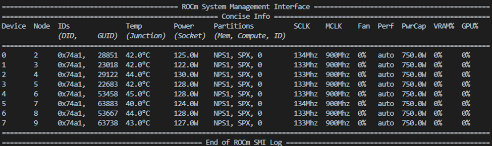

<!---
Copyright (c) 2025 Advanced Micro Devices, Inc. (AMD)

Permission is hereby granted, free of charge, to any person obtaining a copy
of this software and associated documentation files (the "Software"), to deal
in the Software without restriction, including without limitation the rights
to use, copy, modify, merge, publish, distribute, sublicense, and/or sell
copies of the Software, and to permit persons to whom the Software is
furnished to do so, subject to the following conditions:

The above copyright notice and this permission notice shall be included in all
copies or substantial portions of the Software.

THE SOFTWARE IS PROVIDED "AS IS", WITHOUT WARRANTY OF ANY KIND, EXPRESS OR
IMPLIED, INCLUDING BUT NOT LIMITED TO THE WARRANTIES OF MERCHANTABILITY,
FITNESS FOR A PARTICULAR PURPOSE AND NONINFRINGEMENT. IN NO EVENT SHALL THE
AUTHORS OR COPYRIGHT HOLDERS BE LIABLE FOR ANY CLAIM, DAMAGES OR OTHER
LIABILITY, WHETHER IN AN ACTION OF CONTRACT, TORT OR OTHERWISE, ARISING FROM,
OUT OF OR IN CONNECTION WITH THE SOFTWARE OR THE USE OR OTHER DEALINGS IN THE
SOFTWARE.
--->

# Reproducing the AMD Instinct<sup>TM</sup> GPUs MLPerf Inference v5.0 Submission

Building upon the success of our [MLPerf Inference v4.1 submission](https://rocm.blogs.amd.com/artificial-intelligence/mlperf-inf-4-1/README.html), AMD has submitted results for two popular models -- Llama 2 70B and Stable Diffusion XL (SDXL) -- in the MLPerf Inference v5.0 round.  This blog post provides a comprehensive, step-by-step guide on reproducing the results of AMD’s MLPerf submission using [ROCm](https://rocm.docs.amd.com/en/latest/index.html) and the AMD Instinct™ MI325X GPUs. Please follow along to independently verify these results and gain hands-on experience with the benchmarking process.  If you are interested in learning more about the advanced optimization strategies behind our Llama 2 70B and SDXL inference, from quantization and General Matrix Multiplication (GEMM) tuning to cutting-edge vLLM scheduling and platform enhancements, check out our blog on [MLPerf Inference v5.0 optimization strategies](https://rocm.blogs.amd.com/artificial-intelligence/mi325x-accelerates-mlperf-inference/README.html).

## AMD MLPerf inference v5.0 submissions

To fairly and accurately gauge performance in the advancing field of machine learning (ML), MLPerf was established by MLCommons on May 2, 2018. It quickly became an important standard for measuring the accuracy, speed, and efficiency of popular AI workloads, including training, HPC, and inference execution. Companies across the industry use MLPerf submission results to evaluate the relative performance of various competitive hardware and software platforms.

Recently, AMD’s Instinct™ MI325X platform was featured in two competitive MLPerf submission -- Llama 2 70B and Stable Diffusion XL (SDXL). You can find the official results on [MLCommons](https://mlcommons.org/benchmarks/inference-datacenter/) while code and other artifacts can be found in the [submission repository](https://github.com/mlcommons/inference_results_v5.0). In this blog post we will show you, step-by-step, how to reproduce the results of AMD’s MLPerf v5.0 submissions with your own AMD Instinct™ MI325x platform. In an effort to improve usability we have released pre-built docker images along with quantized models, which are used in this blog for easy reproducibility.

The AMD MLPerf Inference v5.0 submission includes results that were generated on a system with 8 x MI325X GPUs and 2 x AMD EPYC 9655 CPUs. These results are submitted in the Available category, showcasing AMD hardware and software that are already available to customers.

### Prerequisites

To follow along with this blog, these components are required:

- Eight AMD Instinct MI325X GPUs
- ROCm 6.3.3 or later
- Any Linux distribution supported by the selected ROCm version
- Docker

See the [ROCm Quick start installation guide](https://rocm.docs.amd.com/projects/install-on-linux/en/latest/install/quick-start.html) for information on how to install ROCm.

## Llama 2 70B submission

This section describes the procedure to reproduce the MLPerf Inference v5.0 result for Llama 2 70B submitted by AMD.

### Setup procedure for Llama 2 70B benchmark

First, pull the Docker image containing the required scripts and codes, and start the container for the benchmark.

```bash
docker pull rocm/amd-mlperf:llama2_70b_inference_5.0

docker run -it \
--ipc=host --network=host --privileged --cap-add=CAP_SYS_ADMIN \
--device=/dev/kfd --device=/dev/dri --device=/dev/mem \
--group-add render --cap-add=SYS_PTRACE --security-opt seccomp=unconfined \
rocm/amd-mlperf:llama2_70b_inference_5.0
```

#### Model and dataset

Inside the Docker container, download the quantized model using this command: \
(**Note**: This step might take a while because the quantized model is around 70Gb.)

```bash
git clone https://huggingface.co/amd/Llama-2-70b-chat-hf_FP8_MLPerf_V2 /model/llama2-70b-chat-hf/fp8_quantized/
```

Inside the Docker container, download and process the dataset:

```bash
bash /lab-mlperf-inference/setup/download_dataset.sh
```

### Running the Llama 2 70B benchmark

For the language area in [MLPerf Inference: Datacenter](https://mlcommons.org/benchmarks/inference-datacenter/) that Llama 2 70B falls under, two scenarios are required in the submission:

- Offline - LoadGen sends all queries to the system under test (SUT) at the start.  The performance metric is simply the measured throughput.
- Server - LoadGen sends new queries to the SUT according to a Poisson distribution.  The performance metric is the maximum Poisson throughput parameter that the SUT supports.

We will provide instructions for benchmarking both scenarios below. Note that they are almost identical except the script names and config values. So be careful to enter the correct command when running the benchmarks.

The steps required to run the inference benchmark will be detailed below.

#### Runtime tunables

(Optional) To boost the machine's performance, execute the following script before any performance test (should be run once after a reboot):

```bash
bash /lab-mlperf-inference/setup/runtime_tunables.sh
```

#### Offline scenario performance benchmark

(Optional) Use a lower maximum GPU frequency to prevent power throttling:

```bash
### MI325x Offline Power Setup
sudo rocm-smi --setperfdeterminism 1700
sudo amd-smi set --soc-pstate 0 -g all
```

Run the offline scenario performance test:

```bash
## Performance
python /lab-mlperf-inference/code/main.py \
   --config-path /lab-mlperf-inference/code/harness_llm/models/llama2-70b/ \
   --config-name offline_mi325x \
   test_mode=performance \
   harness_config.data_parallel_size=8 \
   harness_config.user_conf_path=/lab-mlperf-inference/code/user_mi325x.conf \
   harness_config.output_log_dir=/lab-mlperf-inference/results/llama2-70b/Offline/performance/run_1
```

The output should resemble the following:

```text
================================================
MLPerf Results Summary
================================================
SUT name : PySUT
Scenario : Offline
Mode     : PerformanceOnly
Samples per second: 112.646
Tokens per second: 33396.9
Result is : VALID
  Min duration satisfied : Yes
  Min queries satisfied : Yes
  Early stopping satisfied: Yes

================================================
Additional Stats
================================================
Min latency (ns)                : 639038848461
Max latency (ns)                : 654513120873
Mean latency (ns)               : 647369722083
50.00 percentile latency (ns)   : 647179964510
90.00 percentile latency (ns)   : 654461331553
95.00 percentile latency (ns)   : 654487020839
97.00 percentile latency (ns)   : 654497498762
99.00 percentile latency (ns)   : 654507818266
99.90 percentile latency (ns)   : 654512575583


================================================
Test Parameters Used
================================================
samples_per_query : 73260
target_qps : 111
ttft_latency (ns): 2000000000
tpot_latency (ns): 200000000
max_async_queries : 1
min_duration (ms): 600000
max_duration (ms): 0
min_query_count : 1
max_query_count : 0
qsl_rng_seed : 6023615788873153749
sample_index_rng_seed : 15036839855038426416
schedule_rng_seed : 9933818062894767841
accuracy_log_rng_seed : 0
accuracy_log_probability : 0
accuracy_log_sampling_target : 0
print_timestamps : 0
performance_issue_unique : 0
performance_issue_same : 0
performance_issue_same_index : 0
performance_sample_count : 24576
WARNING: sample_concatenate_permutation was set to true. 
Generated samples per query might be different as the one in the setting.
Check the generated_samples_per_query line in the detailed log for the real
samples_per_query value

2 warnings encountered. See detailed log.

No errors encountered during test.
```

#### Server scenario performance benchmark

(Optional) Use a lower maximum GPU frequency to prevent power throttling:

```bash
### MI325x Server Power Setup
sudo rocm-smi --setperfdeterminism 1600
sudo amd-smi set --soc-pstate 0 -g all
```

Run the server scenario performance test:

```bash
## Performance
python /lab-mlperf-inference/code/main.py \
   --config-path /lab-mlperf-inference/code/harness_llm/models/llama2-70b/ \
   --config-name server_mi325x \
   test_mode=performance \
   harness_config.data_parallel_size=8 \
   harness_config.user_conf_path=/lab-mlperf-inference/code/user_mi325x.conf \
   harness_config.output_log_dir=/lab-mlperf-inference/results/llama2-70b/Server/performance/run_1
```

The output should resemble the following:

```text
================================================
MLPerf Results Summary
================================================
SUT name : PySUT
Scenario : Server
Mode     : PerformanceOnly
Completed samples per second    : 99.86
Completed tokens per second: 29522.56
Result is : VALID
  Performance constraints satisfied : Yes
  Min duration satisfied : Yes
  Min queries satisfied : Yes
  Early stopping satisfied: Yes
TTFT Early Stopping Result:
 * Run successful.
TPOT Early Stopping Result:
 * Run successful.

================================================
Additional Stats
================================================
Scheduled samples per second : 104.15
Min latency (ns)                : 756127764
Max latency (ns)                : 150606473583
Mean latency (ns)               : 37756807070
50.00 percentile latency (ns)   : 32917446649
90.00 percentile latency (ns)   : 68033586908
95.00 percentile latency (ns)   : 83431757630
97.00 percentile latency (ns)   : 94924737771
99.00 percentile latency (ns)   : 121801757289
99.90 percentile latency (ns)   : 145708791529

Completed tokens per second                 : 29522.56
Min First Token latency (ns)                : 46040396
Max First Token latency (ns)                : 2522969250
Mean First Token latency (ns)               : 963332124
50.00 percentile first token latency (ns)   : 950532291
90.00 percentile first token latency (ns)   : 1445779609
95.00 percentile first token latency (ns)   : 1553932052
97.00 percentile first token latency (ns)   : 1623620561
99.00 percentile first token latency (ns)   : 1760966679
99.90 percentile first token latency (ns)   : 2226588311

Min Time to Output Token (ns)                : 32461425
Max Time to Output Token (ns)                : 1358427611
Mean Time to Output Token (ns)               : 126269215
50.00 percentile time to output token (ns)   : 132613828
90.00 percentile time to output token (ns)   : 146707048
95.00 percentile time to output token (ns)   : 150751846
97.00 percentile time to output token (ns)   : 154075958
99.00 percentile time to output token (ns)   : 164964162
99.90 percentile time to output token (ns)   : 227870358

================================================
Test Parameters Used
================================================
samples_per_query : 1
target_qps : 104
ttft_latency (ns): 2000000000
tpot_latency (ns): 200000000
max_async_queries : 0
min_duration (ms): 600000
max_duration (ms): 0
min_query_count : 100
max_query_count : 0
qsl_rng_seed : 6023615788873153749
sample_index_rng_seed : 15036839855038426416
schedule_rng_seed : 9933818062894767841
accuracy_log_rng_seed : 0
accuracy_log_probability : 0
accuracy_log_sampling_target : 0
print_timestamps : 0
performance_issue_unique : 0
performance_issue_same : 0
performance_issue_same_index : 0
performance_sample_count : 24576
WARNING: sample_concatenate_permutation was set to true. 
Generated samples per query might be different as the one in the setting.
Check the generated_samples_per_query line in the detailed log for the real
samples_per_query value

No warnings encountered during test.

No errors encountered during test.
```

#### Offline scenario accuracy benchmark

Run the offline scenario accuracy test:

```bash
## Accuracy
python /lab-mlperf-inference/code/main.py \
   --config-path /lab-mlperf-inference/code/harness_llm/models/llama2-70b/ \
   --config-name offline_mi325x \
   test_mode=accuracy \
   harness_config.data_parallel_size=8 \
   harness_config.user_conf_path=/lab-mlperf-inference/code/user_mi325x.conf \
   harness_config.output_log_dir=/lab-mlperf-inference/results/llama2-70b/Offline/accuracy
```

The above step will generate the `mlperf_log_accuracy.json`, which can then be processed to verify the offline scenario accuracy:

```bash
### Evaluate accuracy
bash /lab-mlperf-inference/code/scripts/check_llama2_accuracy_scores.sh \
   /lab-mlperf-inference/results/llama2-70b/Offline/accuracy/mlperf_log_accuracy.json
```

The output of accuracy evaluation resemble the following:

```bash
{'rouge1': 44.6193, 'rouge2': 22.0555, 'rougeL': 28.6893, 'rougeLsum': 42.1721, 'gen_len': 27604421, 'gen_num': 24576, 'gen_tok_len': 7002333, 'tokens_per_sample': 284.9}
```

#### Server scenario accuracy benchmark

Run the server scenario accuracy test:

```bash
## Accuracy
python /lab-mlperf-inference/code/main.py \
   --config-path /lab-mlperf-inference/code/harness_llm/models/llama2-70b/ \
   --config-name server_mi325x \
   test_mode=accuracy \
   harness_config.data_parallel_size=8 \
   harness_config.user_conf_path=/lab-mlperf-inference/code/user_mi325x.conf \
   harness_config.output_log_dir=/lab-mlperf-inference/results/llama2-70b/Server/accuracy
```

The above step will generate the `mlperf_log_accuracy.json`, which can then be processed to verify the offline scenario accuracy:

```bash
### Evaluate accuracy
bash /lab-mlperf-inference/code/scripts/check_llama2_accuracy_scores.sh \
   /lab-mlperf-inference/results/llama2-70b/Server/accuracy/mlperf_log_accuracy.json
```

Simialar to offline scenario, the output of accuracy evaluation resemble the following:

```bash
{'rouge1': 44.4171, 'rouge2': 22.0283, 'rougeL': 28.6339, 'rougeLsum': 41.9902, 'gen_len': 28626896, 'gen_num': 24576, 'gen_tok_len': 7267469, 'tokens_per_sample': 295.7}
```

### Tweaking and troubleshooting the Llama 2 70B benchmark

We provided a list of tweaking and troubleshooting tips at `/lab-mlperf-inference/README_troubleshoot.md`. Here are a few common tweaking tips.

#### Modifying the QPS for the Server Scenario

The `target_qps` parameter in the server scenario controls the incoming prompt frequency. If performance logs indicate that TTFT (Time to First Token) or TPOT (Time Per Output Token) are significantly lower than benchmark requirements, increasing the QPS parameter can help improve overall throughput.

```yml
# Example value
llama2-70b.Server.target_qps = 104
```

#### Latency requirements fail in the Llama 2 70B Server Scenario

If you see the following lines in your performance results, it indicates that your system is unable to process the number of prompts sent within the constraints of TTFT, TPOT, or both.

```bash
Result is : INVALID
  Performance constraints satisfied : No
  Min duration satisfied : Yes
  Min queries satisfied : Yes
  Early stopping satisfied: No
```

Try lowering the `target_qps` and refer to the [Modifying the QPS for the Server Scenario](###-Modifying-the-QPS-for-the-Server-Scenario) section for detailed steps.

#### Extended runs for the Offline Scenario

During an offline scenario run, the GPUs remain saturated for most of the time, except toward the end when their load gradually decreases. As the run nears completion, fewer prompts require processing, resulting in underutilized GPUs and a decrease in overall throughput. To mitigate this, we can extend the total runtime, so the underutilized final phase has less impact. This can be done by increasing the `min_duration`.

```yml
# Example value for 30 minutes run
llama2-70b.Offline.min_duration = 1800000
```

## SDXL submission

The software used in this submission is fully open source, leveraging [IREE](https://iree.dev/) (a MLIR-based compiler and runtime) and the shark-ai shortfin serving platform and SHARK Tank model implementation.

### Setup procedure for SDXL benchmark

There are several steps in the process of setting up a workspace for reproducing the MLPerf SDXL results. We use Docker to set up a suitable environment for ease of reproducibility. Detailed instructions for running each step of the process are provided below.

#### System preparation

The SDXL MLPerf submission we will reproduce uses the following non-default compute and memory partitioning available for Instinct GPUs:

- [CPX compute partitioning](https://rocm.blogs.amd.com/software-tools-optimization/compute-memory-modes/README.html): Each MI325X GPU has its compute power divided into 8 partitions, meaning we have 64 CPX partitions (devices) to work with.
- [NPS1 memory partitioning](https://rocm.blogs.amd.com/software-tools-optimization/compute-memory-modes/README.html).

To achieve this partitioning, first verify the current system configuration by running `rocm-smi`, a utility provided with your ROCm installation. You should see output containing information about the system memory and compute partitioning:



If rocm-smi does not work, see the official [ROCM documentation for troubleshooting install issues](https://rocm.docs.amd.com/projects/install-on-linux/en/docs-6.3.1/reference/install-faq.html).

To set the partitions correctly, ensure you set memory partitioning first (if the machine is not already in NPS1 mode), using the following command:

```bash
sudo rocm-smi --setmemorypartition NPS1
```

This resets any compute partitioning to default, so you must set the compute partitioning afterwards:

```bash
sudo rocm-smi --setcomputepartition CPX 
```

After configuration is complete, these partitions should be reflected in the rocm-smi output, showing 64 available devices in NPS1 mode.

### Running the SDXL benchmark

To run the submission scenarios, we need the model weights, validation dataset, and source files for both the mlcommons/inference repository and the AMD SHARK team's harness.
The harness is a server which interfaces the shortfin serving platform SDXL API with the MLPerf loadgen library.

First, clone the repository containing the Dockerfile and submission-related source files:

```bash
git clone https://github.com/nod-ai/SHARK-MLPERF -b v5.0
cd SHARK-MLPERF/code/stable-diffusion-xl
```

#### Setup the inference Docker container

> **_Note:_** By default, the `docker run` command that follows will link your machine's local filesystem directories -- `/data/mlperf_sdxl/data` and `/data/mlperf_sdxl/models/` to volumes in your docker container. You may change these links if desired, or remove them if you are not running quantization from scratch and understand that the files will not persist outside of your docker container.

From `code/stable-diffusion-xl/`:

```bash
# Pull the container
docker pull rocm/amd-mlperf:sdxl_inference_5.0

# Run the container
docker run -it --network=host --device=/dev/kfd --device=/dev/dri \
  --group-add video --cap-add=SYS_PTRACE --security-opt seccomp=unconfined \
  -v /data/mlperf_sdxl/data:/data \
  -v /data/mlperf_sdxl/models:/models \
  -v `pwd`/SDXL_inference/:/mlperf/harness \
  -e ROCR_VISIBLE_DEVICES=0,1,2,3,4,5,6,7,8,9,10,11,12,13,14,15,16,17,18,19,20,21,22,23,24,25,26,27,28,29,30,31,32,33,34,35,36,37,38,39,40,41,42,43,44,45,46,47,48,49,50,51,52,53,54,55,56,57,58,59,60,61,62,63 \
  -e HIP_VISIBLE_DEVICES=0,1,2,3,4,5,6,7,8,9,10,11,12,13,14,15,16,17,18,19,20,21,22,23,24,25,26,27,28,29,30,31,32,33,34,35,36,37,38,39,40,41,42,43,44,45,46,47,48,49,50,51,52,53,54,55,56,57,58,59,60,61,62,63 \
  -w /mlperf/harness \
   rocm/amd-mlperf:sdxl_inference_5.0

# Download data and base weights
./download_data.sh
./download_model.sh
```

Preprocess the data and prepare for run execution:

```bash
python3.11 preprocess_data.py
```

#### Reproduce the submission results

Each submission run command is preceded by a specific precompilation command. If you encounter issues with the precompilation step, file an issue at [shark-ai/issues](https://github.com/nod-ai/shark-ai/issues). The commands will execute performance, accuracy, and compliance tests for the Offline and Server scenarios.

```bash
# Compile the SHARK engines (Offline)
IREE_BUILD_MP_CONTEXT="fork" ./precompile_model_shortfin.sh --td_spec attention_and_matmul_spec_gfx942_MI325.mlir --model_json sdxl_config_fp8_sched_unet_bs16.json
# Run the offline scenario.
./run_scenario_offline_MI325x_cpx.sh

# Compile the SHARK engines (Server)
IREE_BUILD_MP_CONTEXT="fork" ./precompile_model_shortfin.sh --td_spec attention_and_matmul_spec_gfx942_MI325.mlir --model_json sdxl_config_fp8_sched_unet_bs2.json
# Run the server scenario.
./run_scenario_server_MI325x_cpx.sh
```

#### Expected results

While running the scenario runner scripts, you will see loadgen output after each run in the scenario. The first run is the performance run which gives an accurate throughput performance calculation. The other runs are for testing accuracy and compliance with submission constraints.

To verify that the results are within acceptable accuracy, you may view the `accuracy.txt` generated by the accuracy validation test. This file is saved by default in the harness working directory under the following directories:

- Offline mode - `Submission/closed/AMD/results/8xMI325x_2xEPYC-9655/stable-diffusion-xl/Offline/accuracy/accuracy.txt`.
- Server mode -  `Submission/closed/AMD/results/8xMI325x_2xEPYC-9655/stable-diffusion-xl/Server/accuracy/accuracy.txt` .

In the `accuracy.txt` file, you will see accuracy scores, e.g. `Accuracy Results: {'FID_SCORE': '23.813210898858188', 'CLIP_SCORE': '31.749402277171612'}`. These scores must be within the submission constraints: `FID_SCORE ∈ (23.0108, 23.9501), CLIP_SCORE ∈ (31.686, 31.813)` for the results to be considered valid.

The performance run output for Offline mode should look like this:

```bash
================================================
MLPerf Results Summary
================================================
SUT name : PySUT
Scenario : Offline
Mode     : PerformanceOnly
Samples per second: 17.0963
Result is : VALID
  Min duration satisfied : Yes
  Min queries satisfied : Yes
  Early stopping satisfied: Yes

================================================
Additional Stats
================================================
Min latency (ns)                : 58373794360
Max latency (ns)                : 2994801193381
Mean latency (ns)               : 1524715283639
50.00 percentile latency (ns)   : 1521937719685
90.00 percentile latency (ns)   : 2711633826354
95.00 percentile latency (ns)   : 2861194410706
97.00 percentile latency (ns)   : 2919630515187
99.00 percentile latency (ns)   : 2973402630365
99.90 percentile latency (ns)   : 2990130556532

================================================
Test Parameters Used
================================================
samples_per_query : 51200
target_qps : 17
target_latency (ns): 0
max_async_queries : 1
min_duration (ms): 600000
max_duration (ms): 0
min_query_count : 1
max_query_count : 51200
qsl_rng_seed : 6023615788873153749
sample_index_rng_seed : 15036839855038426416
schedule_rng_seed : 9933818062894767841
accuracy_log_rng_seed : 0
accuracy_log_probability : 0
accuracy_log_sampling_target : 0
print_timestamps : 0
performance_issue_unique : 0
performance_issue_same : 0
performance_issue_same_index : 0
performance_sample_count : 5000

No warnings encountered during test.

No errors encountered during test.
```

The server mode output should resemble the following:

```bash
================================================
MLPerf Results Summary
================================================
SUT name : PySUT
Scenario : Server
Mode     : PerformanceOnly
Completed samples per second    : 16.18
Result is : VALID
  Performance constraints satisfied : Yes
  Min duration satisfied : Yes
  Min queries satisfied : Yes
  Early stopping satisfied: Yes
Early Stopping Result:
 * Run successful.

================================================
Additional Stats
================================================
Scheduled samples per second : 16.45
Min latency (ns)                : 83101949
Max latency (ns)                : 31930328867
Mean latency (ns)               : 11605932201
50.00 percentile latency (ns)   : 11237477937
90.00 percentile latency (ns)   : 15206321294
95.00 percentile latency (ns)   : 16555227933
97.00 percentile latency (ns)   : 17328900956
99.00 percentile latency (ns)   : 18316648956
99.90 percentile latency (ns)   : 23766184072

================================================
Test Parameters Used
================================================
samples_per_query : 1
target_qps : 16.5
target_latency (ns): 20000000000
max_async_queries : 0
min_duration (ms): 600000
max_duration (ms): 0
min_query_count : 100
max_query_count : 0
qsl_rng_seed : 6023615788873153749
sample_index_rng_seed : 15036839855038426416
schedule_rng_seed : 9933818062894767841
accuracy_log_rng_seed : 0
accuracy_log_probability : 0
accuracy_log_sampling_target : 0
print_timestamps : 0
performance_issue_unique : 0
performance_issue_same : 0
performance_issue_same_index : 0
performance_sample_count : 5000

No warnings encountered during test.

No errors encountered during test.
```

### Tweaking and troubleshooting the SDXL benchmark

Here are a few tips if you run into problems running the benchmark or having difficulty getting an acceptable result:

#### Latency requirements fail in the SDXL Server Scenario

If you see the following lines in your performance results, it indicates that your system is unable to process the number of prompts fast enough to satisfy the latency constraints.

```bash
Result is : INVALID
  Performance constraints satisfied : No
  Min duration satisfied : Yes
  Min queries satisfied : Yes
```

Try lowering the `QPS` specified in `SHARK-MLPERF/code/stable-diffusion-xl/SDXL_inference/run_scenario_server_MI325_cpx.sh` ([link](https://github.com/nod-ai/SHARK-MLPERF/blob/v5.0/code/stable-diffusion-xl/SDXL_inference/run_scenario_offline_MI325x_cpx.sh#L7)) to 16.2, just above the expected throughput. Rerun the benchmark. The result should meet the latency constraint with this change.

#### Troubleshooting / FAQ

- If you don't see 64 devices when you run `rocm-smi`, it is either due to a ROCm driver version mismatch or you might need to run the last blacklisting step in system setup and then reboot the system.
- If you have issues with the precompilation step, file an issue at https://github.com/nod-ai/shark-ai/issues.
- If quantization takes more than 2 hours, ensure you are in CPX mode or skip quantization and use the public Hugging Face pre-quantized weights (the precompile script will handle this for you).

## Summary

In this blog post, we provided a step-by-step guide that allows you to independently reproduce and validate the results of the AMD MLPerf Inference v5.0 submission using the Llama-2-70B model and SDXL. The official MLPerf results can be accessed on [MLCommons](https://mlcommons.org/benchmarks/inference-datacenter/). Note that due to variations in hardware configuration and operating conditions across different runs, individual results might differ from the submitted benchmarks. We encourage you to build upon our efforts and further optimize your workloads using the MI325X GPU and ROCm.  To deep dive into the advanced techniques we used to achieve our submitted results, visit our blog on [MLPerf Inference v5.0 optimization strategies](https://rocm.blogs.amd.com/artificial-intelligence/mi325x-accelerates-mlperf-inference/README.html).

## Disclaimers

Third-party content is licensed to you directly by the third party that owns the
content and is not licensed to you by AMD. ALL LINKED THIRD-PARTY CONTENT IS
PROVIDED “AS IS” WITHOUT A WARRANTY OF ANY KIND. USE OF SUCH THIRD-PARTY CONTENT
IS DONE AT YOUR SOLE DISCRETION AND UNDER NO CIRCUMSTANCES WILL AMD BE LIABLE TO
YOU FOR ANY THIRD-PARTY CONTENT. YOU ASSUME ALL RISK AND ARE SOLELY RESPONSIBLE
FOR ANY DAMAGES THAT MAY ARISE FROM YOUR USE OF THIRD-PARTY CONTENT.
