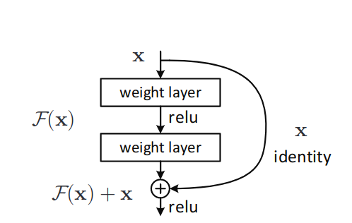
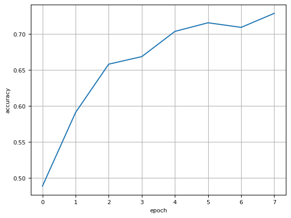
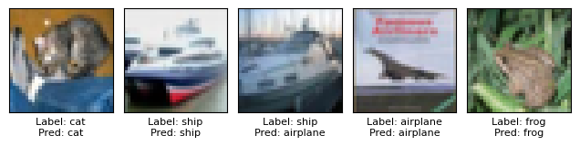

# ResNet for image classification using AMD GPUs

In this blog, we demonstrate training a simple ResNet model for image classification on AMD GPUs using ROCm on the CIFAR10 dataset. Training a ResNet model on AMD GPUs is simple, requiring no additional work beyond installing ROCm and appropriate PyTorch libraries.

## Introduction

The ResNet model was originally proposed in [Deep Residual Learning for Image Recognition](https://arxiv.org/abs/1512.03385) by Kaiming He, et al in 2015, for image classification. The key contribution of this paper was to add residual connections, which allow for training networks that are substantially deeper than previous networks (see figure below). ResNet models are used in a variety of contexts, such as image classification, object detection, etc.



> Diagram of a residual connection, from the original paper. The residual connection (right) flows around computational blocks.

## Prerequisites

To follow along with this blog, you will need the following:

* Hardware
  * AMD GPU - see the [list of compatible GPUs](https://rocm.docs.amd.com/projects/install-on-linux/en/latest/reference/system-requirements.html#supported-gpus)
* OS
  * Linux - see [supported Linux distributions](https://rocm.docs.amd.com/projects/install-on-linux/en/latest/reference/system-requirements.html#supported-operating-systems)
* Software
  * ROCm - see the [installation instructions](https://rocm.docs.amd.com/projects/install-on-linux/en/latest/tutorial/quick-start.html)

## Running this blog

There are two ways to run the code in this blog. First, you can use docker (recommended), or you can build your own python environment (see [running on host](#running-on-host) in the appendix).

### Running in Docker

Using docker is the easiest and most reliable way to construct the required environment.

* Ensure you have Docker. If not, see the [installation instructions](https://docs.docker.com/get-docker/)

* Ensure you have `amdgpu-dkms` installed (which comes with ROCm) on the host to access GPUs from inside docker. See the [ROCm docker instructions here](https://rocm.docs.amd.com/projects/install-on-linux/en/latest/how-to/docker.html).

* Clone the repo, and `cd` into the blog directory

    ```shell
    git clone git@github.com:ROCm/rocm-blogs.git
    cd rocm-blogs/blogs/artificial-intelligence/resnet
    ```

* Build and start the container. For details on the build process, see the `dockerfile`. This will start a jupyter lab serer.

    ```shell
    cd docker
    docker compose build
    docker compose up
    ```
  
* Navigate to http://localhost:8888 in your browser, and open the file `resnet_blog.py` in notebook format (right click -> open with -> notebook)

   ```{note}
   Note: This notebook is a [JupyText paired notebook](https://jupytext.readthedocs.io/en/latest/paired-notebooks.html), in py-percent format
   ```

## Training ResNet 18 on the CIFAR10 dataset

Below, we will walk through the training code, step by step.

### Imports

First, import required packages

```python
import random
import datetime

import torch
import torchvision
from torchvision.transforms import v2 as transforms
from datasets import load_dataset
import matplotlib.pyplot as plt
```

### Dataset

For this task, we will use the [CIFAR10 dataset](https://www.cs.toronto.edu/~kriz/cifar.html), which is available on [huggingface](https://huggingface.co/datasets/cifar10). The CIFAR10 dataset consists of 60,000 32x32 images, in 10 classes.

Let's define a function to retrieve train and test dataloaders. In this function, we (1) download the dataset, (2) set the format to torch, and (3) construct train and test data loaders.

```python
def get_dataloaders(batch_size=256):
    """
    Return test/train dataloaders for the cifar10 dataset
    """
    # Download the dataset, and set format to `torch`
    dataset = load_dataset("cifar10")
    dataset.set_format("torch")

    # Construct train/test loaders
    train_loader = torch.utils.data.DataLoader(dataset["train"], shuffle=True, batch_size=batch_size)
    test_loader = torch.utils.data.DataLoader(dataset["test"], batch_size=batch_size)

    return train_loader, test_loader
```

### Transforms

The pixels in the images of this dataset are encoded in `uint8` format, as such, we need to convert them to `float32`, and normalize them. The function below constructs a single composed transform to prepare the data for training.

In the function below, we construct a single composed `torchvision transform`, which does the following:

* Permute the channel dimension so that our batch of images is "channel first", as required by `pytorch`
* Convert to `float32`
* Scale values to be in range [0,1]
* Normalize values to be mean 0, std 1

```python
def get_transform():
    """
    Construct and return a  transform chain which will convert the loaded images into the correct format/dtype,
    with normalization
    """
    # The mean/std of the CIFAR10 dataset
    stats = ((0.4914, 0.4822, 0.4465), (0.2023, 0.1994, 0.2010))

    transform = transforms.Compose(
        [
            # This dataset is channels last (B,H,W,C), need to permute to channels first (B,C,H,W)
            transforms.Lambda(lambda x: x.permute(0, 3, 1, 2)),
            # Convert to float
            transforms.ToDtype(torch.float32),
            # Divide out uint8
            transforms.Lambda(lambda x: x / 255),
            # Normalize
            transforms.Normalize(*stats, inplace=True),
        ]
    )
    return transform
```

### Construct model, loss, and optimizer

Next, we must construct the model, loss function, and optimizer we wish to use during training.

* **Model:** We will use the [`torchvision` ResNet18](https://pytorch.org/vision/main/models/generated/torchvision.models.resnet18.html), set with `num_classes=10` to match the cifar10 dataset. `ResNet18` is one of the smaller ResNet models (consisting of 18 convolutional layers), and so is suited for a simpler task, such as CIFAR10 classification.
* **Loss function:** [Cross entropy loss](https://pytorch.org/docs/stable/generated/torch.nn.CrossEntropyLoss.html#torch.nn.CrossEntropyLoss), standard for classification problems
* **Optimizer:** [Adam optimizer](https://pytorch.org/docs/stable/generated/torch.optim.Adam.html)

```python
def build_model():
    """
    Construct model, loss function, and optimizer
    """
    # ResNet18, with 10 classes
    model = torchvision.models.resnet18(num_classes=10)

    # Standard crossentropy loss
    loss_fn = torch.nn.CrossEntropyLoss()

    # Adam optimizer
    optimizer = torch.optim.Adam(model.parameters(), lr=0.01, weight_decay=1e-4)

    return model, loss_fn, optimizer
```

### Training Loop

Lastly, we build a simple training loop in PyTorch. Here, we will train the model for a pre-specified number of epochs. During each epoch, we make a complete
pass over the train dataset, and compute the training loss. We then make a complete pass over the test dataset, and compute test loss and accuracy.

```python
def train_model(model, loss_fn, optimizer, train_loader, test_loader, transform, num_epochs):
    """
    Perform model training, given the specified number of epochs
    """
    # Declare device to train on
    print(f"Number of GPUs: {torch.cuda.device_count()}")
    print([torch.cuda.get_device_name(i) for i in range(torch.cuda.device_count())])
    device = torch.device("cuda" if torch.cuda.is_available() else "cpu")

    t0 = datetime.datetime.now()
    model.to(device)
    model.train()

    accuracy = []
    # Main training loop
    for epoch in range(num_epochs):
        print(f"Epoch {epoch+1}/{num_epochs}")
        t0_epoch_train = datetime.datetime.now()

        # Iterate over training dataset
        train_losses, n_examples = [], 0
        for batch in train_loader:
            batch = {k: v.to(device) for k, v in batch.items()}

            optimizer.zero_grad()

            preds = model(transform(batch["img"]))

            loss = loss_fn(preds, batch["label"])
            loss.backward()
            optimizer.step()

            train_losses.append(loss)
            n_examples += batch["label"].shape[0]
        train_loss = torch.stack(train_losses).mean().item()
        t_epoch_train = datetime.datetime.now() - t0_epoch_train

        # Perform evaluation
        with torch.no_grad():
            t0_epoch_test = datetime.datetime.now()
            test_losses, n_test_examples, n_test_correct = [], 0, 0
            for batch in test_loader:
                batch = {k: v.to(device) for k, v in batch.items()}

                preds = model(transform(batch["img"]))

                loss = loss_fn(preds, batch["label"])

                test_losses.append(loss)
                n_test_examples += batch["img"].shape[0]
                n_test_correct += (batch["label"] == preds.argmax(axis=1)).sum()

            test_loss = torch.stack(test_losses).mean().item()
            test_accuracy = n_test_correct / n_test_examples
            t_epoch_test = datetime.datetime.now() - t0_epoch_test
            accuracy.append(test_accuracy.cpu())

        # Print metrics
        print(f"  Epoch time: {t_epoch_train+t_epoch_test}")
        print(f"  Examples/second (train): {n_examples/t_epoch_train.total_seconds():0.4g}")
        print(f"  Examples/second (test): {n_test_examples/t_epoch_test.total_seconds():0.4g}")

        print(f"  Train loss: {train_loss:0.4g}")
        print(f"  Test loss: {test_loss:0.4g}")
        print(f"  Test accuracy: {test_accuracy*100:0.4g}%")

    total_time = datetime.datetime.now() - t0
    print(f"Total training time: {total_time}")
    return accuracy
```

### Train the Model

Finally, we can put it all together in our main method. Here, we:

* Set the random seed for reproducibility
* Construct all components (model, data loaders, etc)
* Call our training method

```python
seed = 0
random.seed(seed)
torch.manual_seed(seed)

model, loss, optimizer = build_model()
train_loader, test_loader = get_dataloaders()
transform = get_transform()

test_accuracy = train_model(model, loss, optimizer, train_loader, test_loader, transform, num_epochs=8)
```

``` shell
    Epoch 1/8
      Epoch time: 0:00:15.129099
      Examples/second (train): 3639
      Examples/second (test): 7204
      Train loss: 1.796
      Test loss: 1.409
      Test accuracy: 48.88%
    ...
    Epoch 8/8
      Epoch time: 0:00:07.136725
      Examples/second (train): 8182
      Examples/second (test): 9748
      Train loss: 0.6939
      Test loss: 0.7904
      Test accuracy: 72.87%
    Total training time: 0:00:57.931011

```

Let's plot the accuracy over the course of training.

```python
fig,ax = plt.subplots()
ax.plot(test_accuracy)
ax.set_xlabel("epoch")
ax.set_ylabel("accuracy")
plt.show()
```



Finally, we can plot some predictions to see how we did.

```python
label_dict = {0: 'airplane',1: 'automobile',2: 'bird',3: 'cat',4: 'deer',5: 'dog',6: 'frog',7: 'horse',8: 'ship',9: 'truck'}

# Plot the first 5 images
N = 5
device='cuda'
for batch in test_loader:
    batch = {k: v.to(device) for k, v in batch.items()}
    preds = model(transform(batch["img"])).argmax(axis=1)
    labels = batch['label'].cpu()

    fig,ax = plt.subplots(1,N,tight_layout=True)
    for i in range(N):
        ax[i].imshow(batch['img'][i].cpu())
        ax[i].set_xticks([])
        ax[i].set_yticks([])
        ax[i].set_xlabel(f"Label: {label_dict[labels[i].item()]}\nPred: {label_dict[preds[i].item()]}")
    
    break
```



## Summary

In this blog, we showed how to use AMD GPU to train a ResNet image classifier on the CIFAR10 dataset, achieving 73% accuracy in less than a minute! All of this runs seamlessly on AMD GPUs with ROCm. We can further improve performance by employing several techniques, such as LR schedulers, data augmentation, and more training epochs, which we will leave as an exercise to the reader.

## References

* [Deep Residual Learning for Image Recognition](https://arxiv.org/abs/1512.03385)
* [huggingface cifar10 dataset](https://huggingface.co/datasets/cifar10)
* [CIFAR10](https://www.cs.toronto.edu/~kriz/cifar.html) - [Learning Multiple Layers of Features from Tiny Images, Alex Krizhevsky, 2009](https://www.cs.toronto.edu/~kriz/learning-features-2009-TR.pdf)

## Appendix

### Running on host

If you don't want to use docker, you can also run this blog directly on your machine - although it takes a little more work.

* Prerequisites:
  * Install ROCm 5.7.x
  * Ensure you have python 3.10 installed
  * Install [PDM](https://pdm-project.org/latest/) - used here for creating reproducible python environments

* Create the python virtual environment in the root directory of this blog:
  
    ```shell
    pdm sync
    ```

* Start the notebook

    ```shell
    pdm run jupyter-lab
    ```

Navigate to https://localhost:8888 and run the blog

## Disclaimers

Third-party content is licensed to you directly by the third party that owns the content and is
not licensed to you by AMD. ALL LINKED THIRD-PARTY CONTENT IS PROVIDED “AS IS”
WITHOUT A WARRANTY OF ANY KIND. USE OF SUCH THIRD-PARTY CONTENT IS DONE AT
YOUR SOLE DISCRETION AND UNDER NO CIRCUMSTANCES WILL AMD BE LIABLE TO YOU FOR
ANY THIRD-PARTY CONTENT. YOU ASSUME ALL RISK AND ARE SOLELY RESPONSIBLE FOR ANY
DAMAGES THAT MAY ARISE FROM YOUR USE OF THIRD-PARTY CONTENT.
