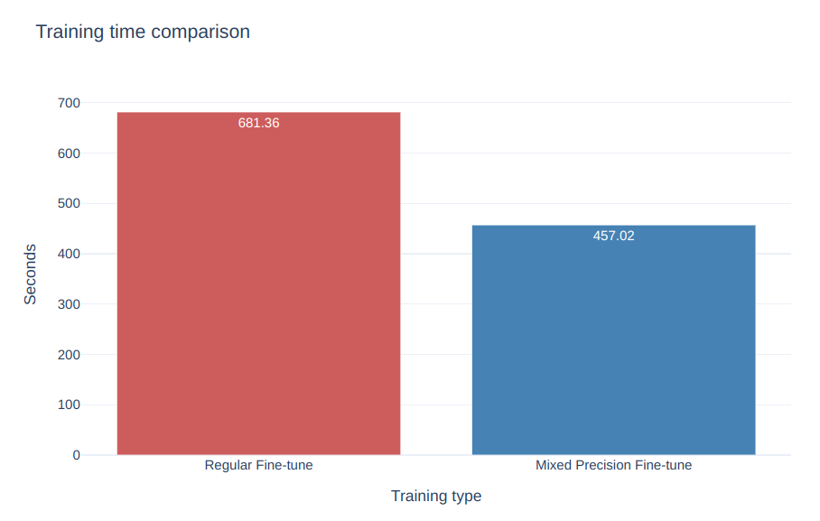

# Optimizing RoBERTa: Fine-Tuning with Mixed Precision on AMD

## Introduction

In this blog we explore how to fine-tune the Robustly Optimized BERT Pretraining Approach ([RoBERTa](https://arxiv.org/abs/1907.11692)) large language model, with emphasis on PyTorch's mixed precision capabilities. Specifically, we explore using AMD GPUs for mixed precision fine-tuning to achieve faster model training without any major impacts on accuracy.

RoBERTa, is an advanced variant of the Bidirectional Encoder Representations from Transformers ([BERT](https://arxiv.org/abs/1810.04805)) model, developed by Facebook AI. It enhances BERT by modifying key hyperparameters in its pre-training such as removing the next-sentence prediction mechanism and training with a larger mini-batch size. This model has shown superior performance on a wide range of natural language processing (NLP) tasks. For more information about RoBERTa, see [RoBERTa: A Robustly Optimized BERT Pretraining Approach](https://arxiv.org/abs/1907.11692).

Mixed Precision training is a technique used to accelerate the training stage of deep learning models by utilizing both 16-bit and 32-bit floating-point operations. PyTorch supports automatic mixed precision (AMP) training through the `torch.cuda.amp module`. Operations that involve matrix multiplications are performed in lower (float 16) precision when using AMP. Lower precision computations are faster and use less memory than full precision computations. The model accuracy is maintained by preserving a full precision copy of model weights during training.

For more information on mixed precision training, see [Automatic Mixed Precision package - torch.amp](https://pytorch.org/docs/stable/amp.html) and [Automatic mixed precision in PyTorch using AMD GPUs](https://rocm.blogs.amd.com/artificial-intelligence/automatic-mixed-precision/README.html).

You can find files related to this blog post in the
[GitHub folder](https://github.com/ROCm/rocm-blogs/tree/release/blogs/artificial-intelligence/roberta_amp).

## Requirements: Operating system and Hardware tested

* AMD GPU: See the [ROCm documentation page](https://rocm.docs.amd.com/projects/install-on-linux/en/latest/reference/system-requirements.html) for supported hardware and operating systems.

* ROCm 6.1: See the [ROCm installation for Linux](https://rocm.docs.amd.com/projects/install-on-linux/en/latest/index.html) for installation instructions.

* Docker: See [Install Docker Engine on Ubuntu](https://docs.docker.com/engine/install/ubuntu/#install-using-the-repository) for installation instructions.

* PyTorch 2.1.2: Use the official ROCm Docker image found at: [rocm/pytorch:rocm6.1_ubuntu22.04_py3.10_pytorch_2.1.2h](https://hub.docker.com/layers/rocm/pytorch/rocm6.1_ubuntu22.04_py3.10_pytorch_2.1.2/images/sha256-f6ea7cee8aae299c7f6368187df7beed29928850c3929c81e6f24b34271d652b?context=explore).

## Running this blog

* Clone the repo and `cd` into the blog directory:

    ```shell
    git clone https://github.com/ROCm/rocm-blogs.git
    cd rocm-blogs/blogs/artificial-intelligence/roberta_amp
    ```

* Build and start the container. For details on the build process, see the `roberta_amp/docker/Dockerfile`.

    ```shell
    cd docker
    docker compose build
    docker compose up
    ```
  
* Open http://localhost:8888/lab/tree/src/roberta_amp.ipynb in your browser and open the `roberta_amp.ipynb` notebook.

You can follow along with this blog using the `roberta_amp.ipynb` notebook.

## Fine-tune RoBERTa for a sentiment classification task

We are using the [dair-ai/emotion](https://huggingface.co/datasets/dair-ai/emotion) dataset found at [Hugging Face website](https://huggingface.co). This dataset is designed for emotion classification tasks. It consists of a collection of English Twitter messages labeled with six basic emotions: anger, fear, joy, love, sadness, and surprise. This dataset includes configurations for both split and unsplit versions. The split configuration consists of 16,000 training examples, and 2,000 examples for each validation and testing split. We are using this dataset to fine-tune a custom RoBERTa language model for emotion classification. We will evaluate the performance of RoBERTa at predicting emotional expression in text both with and without mixed precision training.

There are two alternatives when fine-tuning a model using PyTorch: **PyTorch Hugging Face Trainer API** or **native Python**. We will use **native Python** fine-tuning since it gives users more control over the training process. This approach requires users to set up the training loop manually, handle the backward pass, and explicitly manage data loading and model updates. Mixed precision can be implemented in native PyTorch by manually setting up and using the `torch.cuda.amp` module.

Let's begin by importing the following modules:

```python
import torch
from torch.utils.data import DataLoader
from torch.optim import AdamW
from tqdm.notebook import tqdm

from transformers import RobertaTokenizer, RobertaForSequenceClassification, set_seed
import datasets
import time

set_seed(42)
from IPython.display import display, clear_output
```

and exploring the data by loading the `dair-ai/emotion` dataset as follows:

```python
# Dataset description can be found at https://huggingface.co/datasets/dair-ai/emotion

# Load train validation and test splits
train_data = datasets.load_dataset("dair-ai/emotion", split="train",trust_remote_code=True)
validation_data = datasets.load_dataset("dair-ai/emotion", split="validation",trust_remote_code=True)
test_data = datasets.load_dataset("dair-ai/emotion", split="test",trust_remote_code=True)

# Show dataset number of examples and column names
print(train_data)
print(validation_data)
print(test_data,'\n')

# Print the first instance and label on the train split
print('Text:',train_data['text'][0], '| Label:', train_data['label'][0])
```

 Each data split consist of the following:

```text
Dataset({
    features: ['text', 'label'],
    num_rows: 16000
})
Dataset({
    features: ['text', 'label'],
    num_rows: 2000
})
Dataset({
    features: ['text', 'label'],
    num_rows: 2000
}) 

Text: i didnt feel humiliated | Label: 0
```

In the output above, we printed the first training example on the `train` split, with its corresponding label `0:sadness`.

### Fine-tune using Native PyTorch

Let's begin fine-tuning our custom RoBERTa model using the native PyTorch training approach. We will fine-tune two versions of the same model: one version with regular fine-tune and the other version using mixed precision. We are interested in comparing the training time and performance metrics in each of the two versions.

#### Regular fine-tune and Performance Metrics

Let's start by tokenizing our data and creating the corresponding dataloaders:

```python
# Get the device
device = torch.device('cuda' if torch.cuda.is_available() else 'cpu')

# Load train validation and test splits
# Dataset description can be found at https://huggingface.co/datasets/dair-ai/emotion

train_data = datasets.load_dataset("dair-ai/emotion", split="train",trust_remote_code=True)
validation_data = datasets.load_dataset("dair-ai/emotion", split="validation",trust_remote_code=True)
test_data = datasets.load_dataset("dair-ai/emotion", split="test",trust_remote_code=True)

# Load the tokenizer
tokenizer = RobertaTokenizer.from_pretrained('roberta-base')

# Tokenize the dataset
def tokenize_function(examples):

    return tokenizer(examples['text'], padding = 'max_length',return_tensors="pt")

# Apply tokenization to each split
tokenized_train_data = train_data.map(tokenize_function, batched = True)
tokenized_validation_data = validation_data.map(tokenize_function, batched = True)
tokenized_test_data = test_data.map(tokenize_function, batched = True)

# Set type to PyTorch tensors
tokenized_train_data.set_format(type="torch")
tokenized_validation_data.set_format(type="torch")
tokenized_test_data.set_format(type="torch")

# Transform tokenized datasets to PyTorch dataloder
train_loader = DataLoader(tokenized_train_data, batch_size = 32)
validation_loader = DataLoader(tokenized_validation_data, batch_size = 32)
test_loader = DataLoader(tokenized_test_data, batch_size = 32)
```

Let's now define the rest of the components and execute the following code to start training:

```python
# Load Roberta model for sequence classification
num_labels = 6 # The dair-ai/emotion contains 6 labels
epochs = 3
model = RobertaForSequenceClassification.from_pretrained('roberta-base', num_labels = num_labels)
model.to(device)

# Instantiate the optimizer with the given learning rate
optimizer = AdamW(model.parameters(), lr = 5e-5)

# Training Loop
model.train()

# Train the model
torch.cuda.synchronize() # Wait for all kernels to finish
start_time = time.time()    

for epoch in range(epochs):
    
    for batch in train_loader:
        inputs = {'input_ids':batch['input_ids'].to(model.device),
                  'attention_mask':batch['attention_mask'].to(model.device),
                  'labels':batch['label'].to(model.device)
                 }
        
        outputs = model(**inputs)
        loss = outputs.loss
        loss.backward()
        
        optimizer.step()
        optimizer.zero_grad()
        
        clear_output(wait=True)            
        display(f'Epoch: {epoch+1}/{epochs}. Training Loss: {loss.item()}')

    # Validation Loop
    model.eval()
    total_eval_loss = 0
    for batch in validation_loader:
        with torch.no_grad():
            inputs = {'input_ids':batch['input_ids'].to(model.device),
                      'attention_mask':batch['attention_mask'].to(model.device),
                      'labels':batch['label'].to(model.device)
                     }
            outputs = model(**inputs)
            loss = outputs.loss
            total_eval_loss += loss.item()

    avg_val_loss = total_eval_loss / len(validation_loader)
    
    display(f'Validation Loss: {avg_val_loss}')

torch.cuda.synchronize() # Wait for all kernels to finish
training_time_regular = time.time() - start_time
print(f'Mixed Precision False. Training time (s):{training_time_regular:.3f}')

# Save the model
model.save_pretrained(f'./native_finetuned_roberta_mixed_precision_false')
```

The code above displays the training loss for each batch and the average validation loss. Once the training is complete you will get an output similar to this:

```text
'Epoch: 3/3. Training Loss: 0.10250010341405869'
'Validation Loss: 0.18223475706246164'
Mixed Precision False. Training time (s):681.362
```

Where the output above shows the Training Loss at the last batch after the third epoch, the average validation loss, and the total training time for regular training (around 680 seconds in this case).

How does this model perform? Let's compute its Precision, Recall and F1 performance metrics:

```python
from sklearn.metrics import accuracy_score, precision_recall_fscore_support

def roberta_finetuned_performance_metrics(saved_model_path, tokenizer):

    is_mixed_precision = saved_model_path.split('_')[-1]
    model = RobertaForSequenceClassification.from_pretrained(saved_model_path)
    model.to(device)

    # return predictions
    def inference(batch):        
        inputs = {k: v.to(device) for k, v in batch.items() if k in tokenizer.model_input_names}
        
        with torch.no_grad():
            outputs = model(**inputs)
            
        predictions = torch.argmax(outputs.logits,dim = -1).cpu().numpy()
    
        return {'predictions': predictions}


    # Perform inference on test set
    results = tokenized_test_data.map(inference, batched=True, batch_size = 32)
    
    # Extract predictions and true labels
    predictions = results['predictions'].tolist()
    true_labels = tokenized_test_data['label'].tolist()
    
    # Compute evaluation metrics
    accuracy = accuracy_score(true_labels,predictions)
    precision, recall, f1, _ = precision_recall_fscore_support(true_labels, predictions, average = 'weighted')
    
    print(f'Model mixed precision: {is_mixed_precision}.\nPrecision: {precision:.3f} | Recall: {recall:.3f}  | F1: {f1:.3f}')
```

```python
saved_model_path = './native_finetuned_roberta_mixed_precision_false'    
roberta_finetuned_performance_metrics(saved_model_path, tokenizer)
```

Where the output is:

```text
Model mixed precision: False.
Precision: 0.930 | Recall: 0.925  | F1: 0.919
```

#### Mixed Precision fine-tune

Let's now make use of mixed precision when training using native PyTorch. Run the following to begin the training process:

```python
# Load Roberta model for sequence classification
num_labels = 6 # The dair-ai/emotion contains 6 labels
model = RobertaForSequenceClassification.from_pretrained('roberta-base', num_labels = num_labels)
model.to(device)

# Define the optimizer
optimizer = AdamW(model.parameters(), lr = 5e-5)

# Instantiate gradient scaler
scaler = torch.cuda.amp.GradScaler()

# Train the model
torch.cuda.synchronize() # Wait for all kernels to finish
model.train()

start_time = time.time()  
for epoch in range(epochs):
    for batch in tqdm(train_loader):

        optimizer.zero_grad()        

        inputs = {'input_ids':batch['input_ids'].to(model.device),
                  'attention_mask':batch['attention_mask'].to(model.device),
                  'labels':batch['label'].to(model.device)
                 }
        
        # Use Automatic Mixed Precision
        with torch.cuda.amp.autocast():        
            outputs = model(**inputs)
            loss = outputs.loss
            
        scaler.scale(loss).backward()
        scaler.step(optimizer)
        scaler.update()

        clear_output(wait=True)             
        display(f'Epoch: {epoch+1}/{epochs}. Training Loss: {loss.item()}')        

    # Validation loop
    model.eval()
    total_eval_loss = 0

    for batch in validation_loader:
        with torch.no_grad(), torch.cuda.amp.autocast():
            inputs = {'input_ids':batch['input_ids'].to(model.device),
                      'attention_mask':batch['attention_mask'].to(model.device),
                      'labels':batch['label'].to(model.device)
                     }
            outputs = model(**inputs)
            loss = outputs.loss
            total_eval_loss +=loss.item()

    avg_val_loss = total_eval_loss / len(validation_loader)
    
    display(f'Validation Loss: {avg_val_loss}')

torch.cuda.synchronize() # Wait for all kernels to finish
training_time_amp = time.time() - start_time
print(f'Mixed Precision True. Training time (s):{training_time_amp:.3f}')


# Save the model
model.save_pretrained(f'./native_finetuned_roberta_mixed_precision_true')    
```

In the code above we have explicitly make use of the `torch.cuda.amp.GradScaler` and `torch.cuda.amp.autocast` to enable automatic mixed precision as part of the training loop. When training ends we will have the following output:

```text
'Epoch: 3/3. Training Loss: 0.1367110311985016'
'Validation Loss: 0.1395080569717619'
Mixed Precision True. Training time (s):457.022
```

We have achieved a shorter training time (around 450 seconds) using PyTorch automatic mixed precision vs using regular fine-tuning.



Finally, the corresponding performance metrics are:

```python
saved_model_path = './native_finetuned_roberta_mixed_precision_true'    
roberta_finetuned_performance_metrics(saved_model_path, tokenizer)
```

```text
Model mixed precision: True.
Precision: 0.927 | Recall: 0.928  | F1: 0.927
```

We achieved better training times with minimal impact on the overall model's performance.

## Summary

In this blog we explored fine-tuning the RoBERTa LLM model using mixed precision training, highlighting the use of AMD GPUs. We leveraged PyTorch's automatic mixed precision (AMP) and observed that AMD hardware is well-suited at accelerating training processes while ensuring minimal loss in the model performance. The integration of AMD hardware with PyTorch AMP showcases an effective solution that enhances computational efficiency and reduces training times, making it ideal for deep learning workflows.

## Disclaimers

Third-party content is licensed to you directly by the third party that owns the content and is not licensed to you by AMD. ALL LINKED THIRD-PARTY CONTENT IS PROVIDED “AS IS” WITHOUT A WARRANTY OF ANY KIND. USE OF SUCH THIRD-PARTY CONTENT IS DONE AT YOUR SOLE DISCRETION AND UNDER NO CIRCUMSTANCES WILL AMD BE LIABLE TO YOU FOR
ANY THIRD-PARTY CONTENT. YOU ASSUME ALL RISK AND ARE SOLELY RESPONSIBLE FOR ANY
DAMAGES THAT MAY ARISE FROM YOUR USE OF THIRD-PARTY CONTENT.
