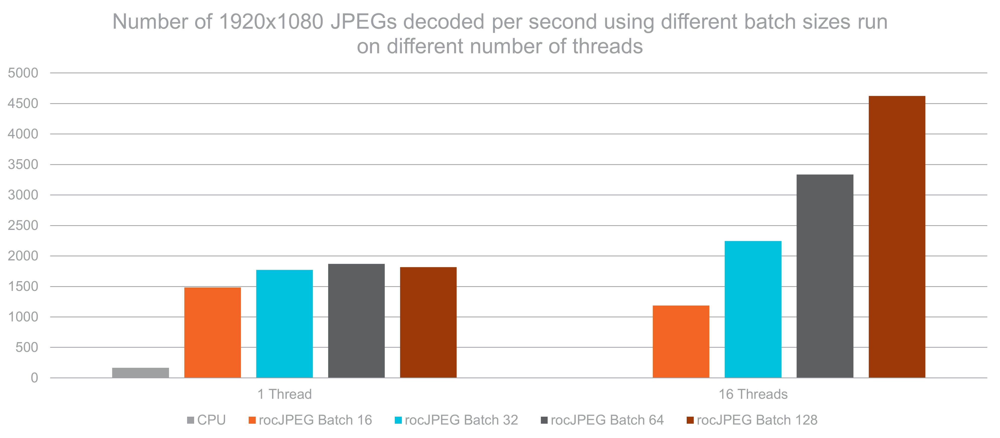
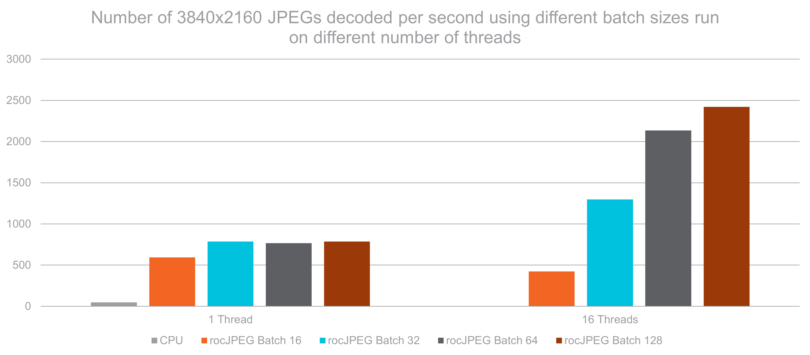

<!---
Copyright (c) 2025 Advanced Micro Devices, Inc. (AMD)

Permission is hereby granted, free of charge, to any person obtaining a copy
of this software and associated documentation files (the "Software"), to deal
in the Software without restriction, including without limitation the rights
to use, copy, modify, merge, publish, distribute, sublicense, and/or sell
copies of the Software, and to permit persons to whom the Software is
furnished to do so, subject to the following conditions:

The above copyright notice and this permission notice shall be included in all
copies or substantial portions of the Software.

THE SOFTWARE IS PROVIDED "AS IS", WITHOUT WARRANTY OF ANY KIND, EXPRESS OR
IMPLIED, INCLUDING BUT NOT LIMITED TO THE WARRANTIES OF MERCHANTABILITY,
FITNESS FOR A PARTICULAR PURPOSE AND NONINFRINGEMENT. IN NO EVENT SHALL THE
AUTHORS OR COPYRIGHT HOLDERS BE LIABLE FOR ANY CLAIM, DAMAGES OR OTHER
LIABILITY, WHETHER IN AN ACTION OF CONTRACT, TORT OR OTHERWISE, ARISING FROM,
OUT OF OR IN CONNECTION WITH THE SOFTWARE OR THE USE OR OTHER DEALINGS IN THE
SOFTWARE.
--->

# Accelerated JPEG decoding on AMD Instinct™ GPUs with rocJPEG

With the increased growth in dataset sizes, the improvement of image capturing technology, the capacity
to extract more information from visual data, and the move towards large language models including image
data as input, efficient image processing and preparation has become a necessity to run these workloads
in a timely manner. Although much attention is often focused on the computational aspects of these
workloads, the fundamental tasks of data loading and preparation have become significant bottlenecks,
limiting the throughput of the entire pipeline. Accelerated JPEG decoding is an essential step in
optimizing workloads that rely on image data. Dive into this blog post to learn how to install and benchmark
rocJPEG, as well as how the ROCm™ platform and AMD Instinct GPUs can help you achieve up to 50x faster decoding
performance in 4k<sup>[1](#endnote)</sup>.

## Understanding JPEG decoding

JPEG is a popular, widely used lossy compression format that provides users with the flexibility to
finetune the amount of compression used. This results in a tunable image format where tradeoffs can be
made between image quality and size. When properly utilized, the JPEG format allows a user to find the
optimal balance between image quality and file size to fit their needs.

JPEG decoding transforms compressed image data back into a viewable image through five steps. Many of
these steps are independent of one another, allowing AMD rocJPEG to parallelize and accelerate the
decoding process on AMD GPUs. Here's how the entire process works:

1. **Entropy Decoding**: This initial step decompresses the JPEG bitstream using Huffman decoding. This step converts the variable-length encoded data back into the fixed-length values needed to reconstruct the initial sequence of image coefficients. Since this is a sequential step required before performing any of the following steps, it is challenging to optimize and cannot be run in parallel with the other steps. Nonetheless, it is foundational for all subsequent processing steps in the decoding pipeline.
2. **Dequantization**: This stage reverses the lossy quantization that was applied during compression. This of course means that the extracted values will not be the exact same as before compression, but should be close depending on the tradeoffs made in quality vs size during compression. To dequantize, each coefficient is multiplied by its corresponding quantization value, using different values for the brightness (luminance) and color (chrominance) components. This step is highly parallelizable since each element can be processed independently, lending itself well to GPU acceleration.
3. **Inverse DCT (Discrete Cosine Transform)**: The Inverse DCT transforms data from the frequency domain to the spatial domain, allowing distinct pixel values to be extracted. Since this is done in 8x8 pixel blocks across the image, this step is well suited to be optimized on AMD GPUs. By processing these blocks in parallel, significant performance increases may be obtained.
4. **Color Space Conversion**: This stage converts the image from the YCbCr (the native JPEG format) to the well known RGB color space. The Y luminance component (brightness) along with the Cr (red-difference chroma) and Cb (blue-difference chroma) components are converted into Red, Green, and Blue (RGB) color components by applying standard color transformation matrices. These matrices are applied on a per-pixel basis, making this yet another highly parallelizable operation that can be optimized on AMD GPUs.
5. **Final Assembly**: The last step in the process is to combine all of the processed blocks into the final assembled image. This step requires proper handling during image boundary reconstruction. The decoder manages color channel organization and ensures proper pixel alignment and ordering throughout the process. After completion of this stage, the data has been transformed from its compressed state to an image that is ready for efficient display or further processing.

```{figure} ./images/Decoding.png
:align center
:alt JPEG Decoding Visualization
The JPEG decoding process.
```

The full potential of GPUs comes to the forefront when processes are parallelizable, as is the case
for many of the JPEG decoding steps. Modern GPUs like the MI300X can process thousands of pixels
and image blocks simultaneously, dramatically accelerating decoding speeds when compared to
traditional CPU processing.

## Real-world use cases for accelerated decoding

Efficient parallelization of the JPEG decoding process is particularly valuable in applications
such as AI/ML training and high-throughput image processing, where bottlenecks are often caused by
the decoding step. By leveraging the power of AMD GPUs along with rocJPEG, more time can be spent
focused on image processing and model training instead of waiting for data to be loaded.

### AI/ML training pipelines

Accelerated JPEG decoding has a noticeable impact on training AI/ML models on image data:

- **Reduced data loading bottlenecks**: Faster image decoding leads to faster image preprocessing tasks needed to prepare data for training.
- **Improved GPU utilization**: Since images are preprocessed faster and the GPU is utilized during the decoding step, less time is spent idly waiting for data.
- **Higher training throughput**: Lower waiting times for data preparation means that more images can be processed and training times reduced.

### Content delivery networks

Streaming and content delivery applications and services also benefit from faster JPEG decoding:

- **Lower latency**: Faster JPEG decoding means that content providers are able to serve their customers faster.
- **Higher concurrency**: The parallelization advantages of GPUs allow for more JPEGs to be decoded simultaneously.
- **Reduced infrastructure costs**: Fully utilizing AMD GPUs in every step of a workload, reduces total operational costs.

## Installing and running rocJPEG

For detailed documentation, installation instructions, how to guides, and reference material,
please refer to the [rocJPEG documentation](https://rocm.docs.amd.com/projects/rocJPEG/en/latest/).

### Installing ROCm and rocJPEG

#### Prerequisites

Ensure that your system meets the following prerequisites before attempting to install and run
rocJPEG:

- Ubuntu 24.04, Ubuntu 22.04, RHEL 9.5/9.4, RHEL 8.10, SLES 15 SP6/SP5, Oracle Linux 8.10, Debian 12, Azure Linux 3.0
- ROCm 6.3 or higher
- Contains a supported AMD GPU

For the purposes of this blog, we are using an AMD MI300X GPU with ROCm 6.4 running on an Ubuntu 22.04 system.

### Installation steps

The following steps will guide you through the installation process.

#### Install ROCm

First, ensure that you have the latest ROCm build installed on your system. For full installation instructions,
please see the [ROCm Installation Guide](https://rocm.docs.amd.com/projects/install-on-linux/en/latest/).

#### Install rocJPEG to your system

Next, install the required rocJPEG packages to your system. rocJPEG offers a convenient installation process
using the package installer, as well as the ability to install it directly from source code. Run the following
command to install rocJPEG using the package installer:

```bash
sudo apt install rocjpeg rocjpeg-dev rocjpeg-test
```

If you prefer to install rocJPEG from source, you can specify which branch from the
[GitHub repo](https://github.com/ROCm/rocJPEG.git) you would like to install. To do that, run the following
commands:

```bash
git clone -b <branch_name> https://github.com/ROCm/rocJPEG.git
cd rocJPEG/
mkdir build && cd build
cmake ../
make -j8
sudo make install
```

```{note}
The optional `-b` flag can be used to specify the branch of rocJPEG that you would like to install. If no branch is
specified, the default branch is used.
```

#### Verify installation

Finally, verify that rocJPEG was correctly installed and is working as expected:

```bash
mkdir rocjpeg-test && cd rocjpeg-test
cmake /opt/rocm/share/rocjpeg/test/
ctest -VV
```

If rocJPEG was correctly installed, all tests should pass and you will see the following output:

```bash
100% tests passed, 0 tests failed out of 13
```

```{note}
The most recent branches of rocJPEG contain more tests. If you installed from source and specified a newer
branch, you might see slightly different output.
```

## Benchmarking performance gains with rocJPEG

### Running benchmarks

rocJPEG includes a useful benchmarking tool to help you evaluate the performance you could achieve.
`jpegDecodeBatched` runs performance benchmarking when decoding images in batches. To run it, use
the following commands:

```bash
cd jpegDecodeBatched
./jpegdecodebatched -i <path_to_image_folder> -b <batch_size>
```

Additionally, `jpegDecodePerf` provides a similar benchmarking tool with the added option of using
multithreading to decode your images. To use `jpegDecodePerf`, run the following commands:

```bash
cd jpegDecodePerf
./jpegdecodeperf -i <path_to_image_folder> -b <batch_size> -t <number_of_threads>
```

The key parameters for both `jpegDecodeBatched` and `jpegDecodePerf` are as follows:

- `-i`: The input directory containing JPEG images
- `-b`: The batch size for decoding (e.g. 32, 64, 128)
- `-t`: The number of threads to use when decoding (e.g. 1, 4, 16)

```{note}
While multithreading enhances performance, it also introduces overhead. Testing multiple configurations is
recommended.
```

### Performance results

For our purposes, we compare the performance when using different batch sizes on an Instinct MI300X GPU with the
performance obtained when decoding JPEGs on the CPU. For CPU decoding, we use the
[TurboJPEG library](https://libjpeg-turbo.org/). Additionally, we test the time it takes to decode both 1080p
and 4k JPEG images.

We test rocJPEG with 1 and 16 threads, for batch sizes of 16, 32, 64, and 128 to decode 1000 images. To get
an idea of the performance improvement, we compare these results against TurboJPEG for the same dataset:





These results clearly show the performance benefits of not only running JPEG decoding on Instinct GPUs but
also show additional benefits when using multithreading. The AMD Instinct MI300X GPU offers up to a 27x performance boost
versus CPU decoding on full-HD images, and up to a 50x performance boost when decoding 4k images!<sup>[1](#endnote)</sup>.

## Summary

rocJPEG is a GPU accelerated JPEG decoding library which fully utilizes the advantages offered by AMD Instinct GPUs,
enabling up to 50x performance gains over CPU-based methods on 4K images. This blog takes you through the necessary
steps to setup your system to run rocJPEG and provides benchmarking results which clearly show the performance increases
you can expect over traditional CPU decoding. Use rocJPEG along with the power of AMD Instinct GPUs to remove the JPEG
decoding bottlenecks for your image and video processing applications, computer vision networks, and content delivery
systems to spend more time performing the operations that really matter, and less time on data loading!

## Endnote

[1]: Based on testing by AMD in April 2025, on the AMD Instinct MI300X GPU using a rocJPEG benchmark with a batch
size of 128 and 16 threads to measure the number of images processed per second for a dataset of 1000 images vs. a
traditional CPU, measured with the TurboJPEG library. Each solution tested at 1080p and 4k, respectively. Hardware
manufacturers may vary configurations, yielding different results. Performance may vary based on the use of the latest
drivers and optimizations (MI300-078).

## Disclaimers

Third-party content is licensed to you directly by the third party that owns the
content and is not licensed to you by AMD. ALL LINKED THIRD-PARTY CONTENT IS
PROVIDED “AS IS” WITHOUT A WARRANTY OF ANY KIND. USE OF SUCH THIRD-PARTY CONTENT
IS DONE AT YOUR SOLE DISCRETION AND UNDER NO CIRCUMSTANCES WILL AMD BE LIABLE TO
YOU FOR ANY THIRD-PARTY CONTENT. YOU ASSUME ALL RISK AND ARE SOLELY RESPONSIBLE
FOR ANY DAMAGES THAT MAY ARISE FROM YOUR USE OF THIRD-PARTY CONTENT.
