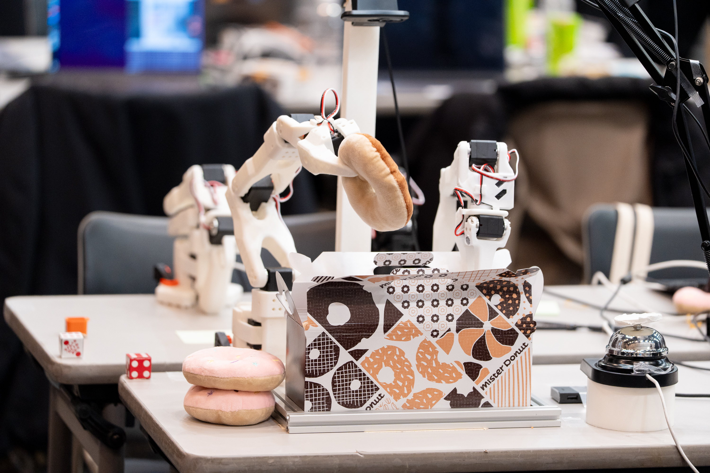
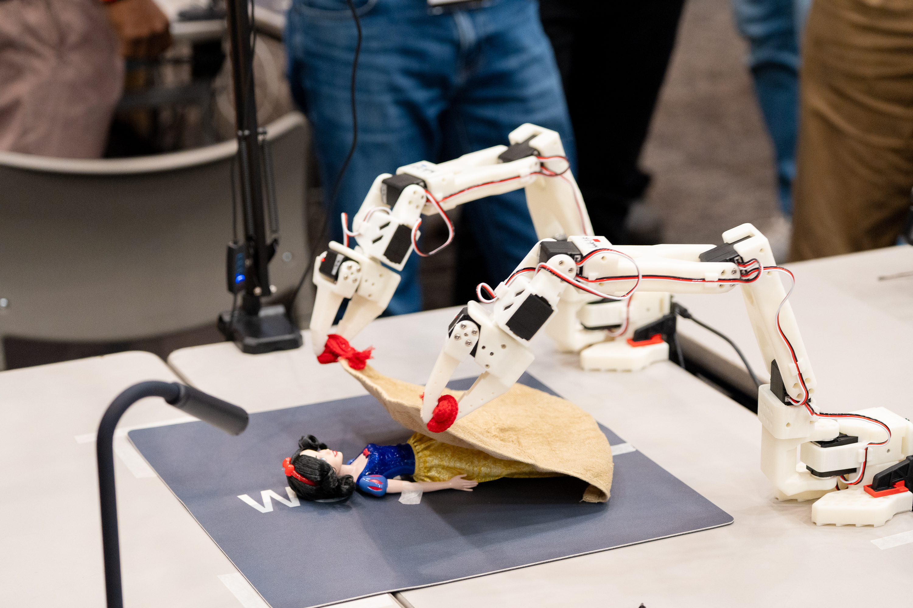
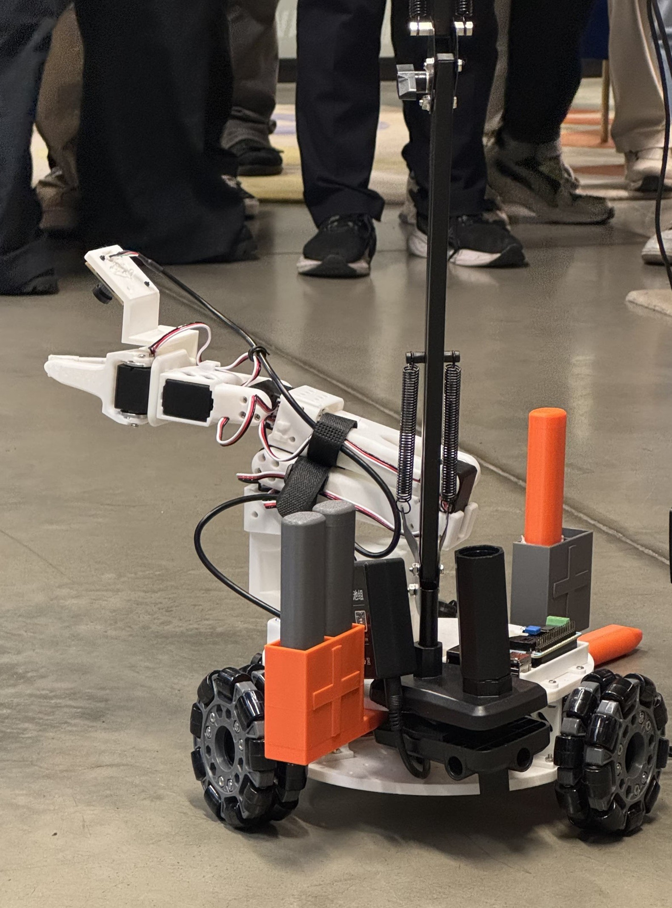
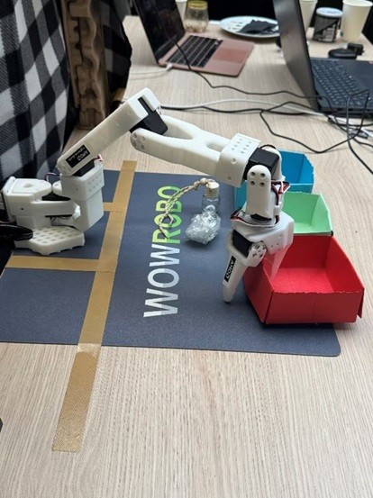

<!---
Copyright (c) 2026 Advanced Micro Devices, Inc. (AMD)

Permission is hereby granted, free of charge, to any person obtaining a copy
of this software and associated documentation files (the "Software"), to deal
in the Software without restriction, including without limitation the rights
to use, copy, modify, merge, publish, distribute, sublicense, and/or sell
copies of the Software, and to permit persons to whom the Software is
furnished to do so, subject to the following conditions:

The above copyright notice and this permission notice shall be included in all
copies or substantial portions of the Software.

THE SOFTWARE IS PROVIDED "AS IS", WITHOUT WARRANTY OF ANY KIND, EXPRESS OR
IMPLIED, INCLUDING BUT NOT LIMITED TO THE WARRANTIES OF MERCHANTABILITY,
FITNESS FOR A PARTICULAR PURPOSE AND NONINFRINGEMENT. IN NO EVENT SHALL THE
AUTHORS OR COPYRIGHT HOLDERS BE LIABLE FOR ANY CLAIM, DAMAGES OR OTHER
LIABILITY, WHETHER IN AN ACTION OF CONTRACT, TORT OR OTHERWISE, ARISING FROM,
OUT OF OR IN CONNECTION WITH THE SOFTWARE OR THE USE OR OTHER DEALINGS IN THE
SOFTWARE.
--->

# Edge-to-Cloud Robotics with AMD ROCm: From Data Collection to Real-Time Inference

This blog walks through a full edge-to-cloud robotics AI solution, built entirely on the AMD ecosystem and the [Hugging Face LeRobot framework](https://github.com/huggingface/lerobot). In case you are not familiar, LeRobot is an open source platform from Hugging Face that provides pre-trained models, datasets, and tools for real-world robotics using PyTorch.

At the core of this edge-to-cloud implementation is **Imitation Learning (IL)** (also known as Learning from Demonstration or Apprenticeship Learning). Instead of hard-coding behaviors or hand-crafting reward functions, IL relies on using an expert to show the robot how to perform a task. This is similar to how humans can learn new skills: rather than following explicit instructions, we can watch an expert, like watching a cooking video instead of just reading a recipe. This approach becomes especially powerful when paired with **Vision-Language-Action (VLA)** models which translate visual observations and language instructions into executable robot actions. VLAs give robots a rich understanding of what they see, while IL provides a fast, efficient way to teach them how to act using just a handful of demonstrations. Together, they dramatically shorten the journey from research to robots doing work in the real world.

We gather data using IL on AMD Ryzen™ GPU-based PCs and then fine-tune state-of-the-art VLA models such as [Pi0.5](https://huggingface.co/docs/lerobot/pi05), [Pi0](https://huggingface.co/docs/lerobot/pi0), and [smolVLA](https://huggingface.co/docs/lerobot/smolvla), , as well as policies like [ACT](https://huggingface.co/docs/lerobot/act), on high-performance AMD Instinct™ MI300X servers with the AMD ROCm software stack in the cloud. We then deploy these trained models for real-time inference back onto AMD Ryzen™ GPU-based PCs at the edge. The result is an end-to-end pipeline where robotic arms can learn and execute new complex, multi-step actions.

This workflow has been showcased at [AMD's 2025 Open Robotics Hackathons](https://amdroboticshackathon.datamonsters.com/) around the world, including events in Tokyo, Paris, and San Jose. Participants applied the same edge-to-cloud solution to diverse real-world scenarios—food packaging, childcare, allergy aid, and waste classification—as illustrated in **Figures 1–4** below. Together, AMD hardware and ROCm deliver a scalable, performant foundation for robotics AI and machine learning from desktop data collection to data center training to desktop inference, and enable a fast transition from core ideas to robots solving real problems.

|  |  |
|---|---|
|  |  |
| *Figure 1. Food packaging demo* | *Figure 2. Childcare demo* |
|  |  |
| *Figure 3. Allergy aid demo* | *Figure 4. Waste classification demo* |

*Figure 1* shows a food-packaging demo; *Figure 2*, a childcare application; *Figure 3*, an allergy-aid use case; and *Figure 4*, waste classification—all built by hackathon teams on this pipeline.

A companion blog, [*Fine-tuning Robotics Vision Language Action Models with AMD ROCm and LeRobot*](../rocm-lerobot/README.md), describes the same LeRobot e2e solution from a system and workflow perspective. In this blog, we provide updated reflections on the broader ecosystem impact: our Open Robotics Hackathon brought together 240 developers and 83 teams in Tokyo, Paris, and San Jose, co-hosted with [Hack Club](https://hackclub.com/) in a special session on Education and Physical AI. The hackathon guided participants from first touch to building real solutions with LeRobot and AMD AI—and was highlighted by AMD Chair and CEO Dr. Lisa Su at CES 2026.

In this blog, we walk you through the pipeline we used at the hackathon: setting up the edge environment on an AMD Ryzen™ AI PC with [SO-101 robotic arms](https://github.com/TheRobotStudio/SO-ARM100), collecting datasets, training Pi0 models on [AMD Dev Cloud](https://www.amd.com/en/developer/resources/technical-articles/2025/amd-ai-developer-program.html), and deploying the trained model back to the PC for real-time inference—a full-stack AMD robotics solution.

## Demonstrating Our Edge-to-Cloud Robotics Solution with a Pick-and-Place Task

Our setup captures the dataset on an AMD Ryzen™ AI PC, fine tunes the pre-trained Pi0 model using the LeRobot framework on AMD Instinct™ MI300X GPUs and then deploys it for real-time inference on the PC. The data collection and inference rely on two SO-101 robotic arms in leader and follower configuration. **Figure 5** below shows this hardware setup: the two arms, the cameras for visual feedback, and the AMD Ryzen AI PC.

```{figure} ./images/robot.jpg
:align: center
:alt: Scaling performance
Figure 5. End-to-end demo hardware: two SO-101 arms, two cameras for visual feedback, and an AMD Ryzen AI PC running real-time inference and dataset collection
```

### Dataset Collection

Our demo demonstrates a simple pick-and-place task: stacking one block on top of another. During data collection, the leader arm performs this task while the two cameras capture visual trajectories synchronized with the arm's joint positions. We collected at least 50 demonstration episodes for training, the exact number depending on the complexity of the target policy.

### Fine-Tuning

By leveraging only 50 episodes, we were able to quickly specialize the large pre‑trained model for our pick‑and‑place task. It highlights how data‑efficient these modern foundation models have become: even a modest set of examples is enough to teach them new behaviors. Moreover, the adapted policy now serves as a strong starting point for learning more complex manipulation tasks, such as training downstream models that perform multi‑step skills like stacking two blocks.

## Step-by-Step Guide

This section provides a step-by-step tutorial for setting up the LeRobot development environment on both the edge device and the Cloud using the AMD ROCm™ platform. **Figure 6** below summarizes the full development and deployment workflow.

```{figure} ./images/workflow.jpg
:align: center
:alt: Scaling performance
Figure 6. LeRobot development and deployment workflow on AMD ROCm platform
```

### 1. Hardware Assembly

Here are some key steps and example commands for using the SO-101.

These examples are based on [the LeRobot Tutorial](https://huggingface.co/docs/lerobot/so101) and LeRobot v0.4.1 with some modifications and comments for our setup. **You may need to modify these steps to suit your environment.**

#### Connect the SO-101 arms

1. First, connect the leader arm to the PC via USB-UART and it will appear as `/dev/ttyACM0` on Ubuntu
2. Connect the follower arm with USB UART to the PC and it will appear as `/dev/ttyACM1` on Ubuntu

The order in which the leader and follower arms are connected will result in different device node names. The following steps assume the following names:

- Leader arm: `/dev/ttyACM0`
- Follower arm: `/dev/ttyACM1`

LeRobot provides the command `lerobot-find-port` to help find the UART device node of the SO-101 arms.

#### Connect the Cameras

Suppose you have two cameras, one named `top` and another named `side`. The `top` camera may be set up to give a bird's eye view of the arm's workspace. The `side` camera may be set up to give a side view.

The order in which the cameras are connected will result in different device node names. The following steps assume the following names:

- Top camera: `/dev/video0`
- Side camera: `/dev/video2`

Use the lerobot-find-cameras CLI tool to detect available cameras:

``` bash
lerobot-find-cameras opencv      # Find OpenCV cameras  
```

You can also use `ffplay` to check the camera angles and which port each camera is connected to:

``` bash
ffplay /dev/video*    # Fill in with the camera's index/port
```

### 2. Setup the Edge Development Environment

The edge platform is based on an AMD Ryzen™ AI PC, which is used to drive the SO-101 arm for dataset creation and inference. The integrated GPU (iGPU) of the Ryzen AI processor accelerates model inference using ROCm™.

#### Target Environment

```text
AMD Ryzen AI 9 HX370 PC
OS: Ubuntu 24.04
ROCm v6.3+
PyTorch v2.7.x
LeRobot: v0.4.1
```

#### Pre-requisites

#### Install Ubuntu 24.04 LTS on the AMD Ryzen™ AI PC

``` bash
alex@SER9:~$ lsb_release -a
No LSB modules are available.
Distributor ID: Ubuntu
Description:    Ubuntu 24.04.3 LTS
Release:        24.04
Codename:       noble
alex@SER9:~$ uname -r
6.14.0-27-generic
alex@SER9:~$
alex@SER9:~$ lsmod | grep amdgpu
amdgpu              19714048  1
amdxcp                 12288  1 amdgpu
drm_panel_backlight_quirks    12288  1 amdgpu
drm_buddy              24576  1 amdgpu
drm_ttm_helper         16384  1 amdgpu
ttm                   118784  2 amdgpu,drm_ttm_helper
drm_exec               12288  1 amdgpu
drm_suballoc_helper    20480  1 amdgpu
drm_display_helper    278528  1 amdgpu
cec                    94208  2 drm_display_helper,amdgpu
i2c_algo_bit           16384  1 amdgpu
gpu_sched              61440  2 amdxdna,amdgpu
video                  77824  1 amdgpu
```

#### Setup the ROCm Development Environment for the LeRobot

As of now (2025/11), LeRobot depends on PyTorch version >=2.2.1, <2.8.0 (see `pyproject.toml`).

We recommend using ROCm 6.3 and PyTorch 2.7 to ensure compatibility with LeRobot.

#### Install ROCm 6.3.x

``` bash
sudo apt update
sudo apt install "linux-headers-$(uname -r)"
sudo apt install python3-setuptools python3-wheel
sudo usermod -a -G render,video $LOGNAME # Add the current user to the render and video groups


wget https://repo.radeon.com/amdgpu-install/6.3.4/ubuntu/noble/amdgpu-install_6.3.60304-1_all.deb
sudo apt install ./amdgpu-install_6.3.60304-1_all.deb
amdgpu-install -y --usecase=rocm --no-dkms

sudo reboot
```

**NOTE**: Ensure `--no-dkms` is set so the built-in kernel driver is used.

For more details, refer to the official documentation: https://rocm.docs.amd.com/projects/radeon-ryzen/en/docs-6.3.4/docs/install/native_linux/install-radeon.html.

#### Install PyTorch with ROCm

Since LeRobot depends on PyTorch version >=2.2.1, <2.8.0 (see `pyproject.toml`) and the latest PyTorch-ROCm version is v2.8.0+, we must install an older ROCm-compatible PyTorch release.

The LeRobot GitHub repository uses Miniconda for environment management. We can use the same approach with minor modifications for PyTorch-ROCm.

Set the iGPU on Ryzen AI 300 series to run at gfx1100 compatible mode:

``` bash
echo "export HSA_OVERRIDE_GFX_VERSION=11.0.0" >> ~/.bashrc
source ~/.bashrc
```

Install Miniconda following the official documentation: https://www.anaconda.com/docs/getting-started/miniconda/install.

Then, you can create a conda environment and install the compatible PyTorch versions.

``` bash
conda create -n lerobot python=3.10
conda activate lerobot

pip install torch==2.7.1 torchvision==0.22.1 torchaudio==2.7.1 --index-url https://download.pytorch.org/whl/rocm6.3

# Check the installation
pip list | grep rocm
pytorch-triton-rocm    3.3.1
torch                  2.7.1+rocm6.3
torchaudio             2.7.1+rocm6.3
torchvision            0.22.1+rocm6.3
```

Now, the Ryzen AI iGPU will appear as a CUDA-compatible device in PyTorch.

``` bash
python3 -c 'import torch; print(torch.cuda.is_available())'
```

This should return `True`.

``` bash
python3 -c "import torch; print(f'device name [0]:', torch.cuda.get_device_name(0))"
```

This should output: `device name [0]: AMD Radeon Graphics`.

#### Setup LeRobot Development Environment

More installation info can be found at https://github.com/huggingface/lerobot/blob/main/README.md.

``` bash
conda install ffmpeg=7.1.1 -c conda-forge
```

``` bash
git clone https://github.com/huggingface/lerobot.git
cd lerobot

# let’s synchronize using this version
git checkout -b v0.4.1 v0.4.1
pip install -e .
```

Check the Installation

``` bash
pip list | grep lerobot
lerobot                0.4.1          /home/alex/lerobot
```

Install the feetech-servo-sdk for SO-101 arms.

``` bash
pip install 'lerobot[feetech]'      # Feetech motor support
```

The edge development environment is ready.

### 3. Calibrate the SO-101 arms

Detailed instructions can be found at https://huggingface.co/docs/lerobot/so101 (you should NOT do the motor ID setup).

Give USB port permissions:

``` bash
sudo chmod 666 /dev/ttyACM0
sudo chmod 666 /dev/ttyACM1
```

Calibrate the follower:
>`robot.port` is the port of your follower arm, `robot.id` is a unique name for the follower

``` bash
lerobot-calibrate \
    --robot.type=so101_follower \
    --robot.port=/dev/ttyACM1 \
    --robot.id=my_awesome_follower_arm
```

> If you see a `Lock` error, you may need to unplug and replug the power to the arm.

Calibrate the leader:
>`teleop.port` is port of your leader arm, `teleop.id` is a unique name for the leader

``` bash
lerobot-calibrate \
    --teleop.type=so101_leader \
    --teleop.port=/dev/ttyACM0 \
    --teleop.id=my_awesome_leader_arm
```

Then you can use the SO-101!

### 4. Teleoperate

``` bash
lerobot-teleoperate \
    --robot.type=so101_follower \
    --robot.port=/dev/ttyACM1 \
    --robot.id=my_awesome_follower_arm \
    --teleop.type=so101_leader \
    --teleop.port=/dev/ttyACM0 \
    --teleop.id=my_awesome_leader_arm
```

Teleoperate with cameras

``` bash
lerobot-teleoperate \
    --robot.type=so101_follower \
    --robot.port=/dev/ttyACM1 \
    --robot.id=my_awesome_follower_arm \
    --robot.cameras="{top: {type: opencv, index_or_path: 0, width: 640, height: 480, fps: 30}, side: {type: opencv, index_or_path: 2, width: 640, height: 480, fps: 30}}" \
    --teleop.type=so101_leader \
    --teleop.port=/dev/ttyACM0 \
    --teleop.id=my_awesome_leader_arm \
    --display_data=true
```

`top` camera with index_or_path 0 (/dev/video0)
`side` camera with index_or_path 2 (/dev/video2)

### 5. Record the dataset

We will use the leader arm to teleoperate the follower arm to perform the actions we want to record into the dataset.

We use the Hugging Face hub features for uploading your dataset. If you haven’t previously used the Hub, make sure you can log in via the CLI using a write-access token, this token can be generated from the Hugging Face settings.

Add your token to the CLI, and login to Hugging Face by running this command:

```bash
hf auth login
```

Then store your Hugging Face repository name in a variable:

``` bash
HF_USER=$(hf auth whoami | cut -c 16-)
echo $HF_USER
```

Now you can record a dataset.

Here's an example command once you have setup your Hugging Face credentials:

``` bash
lerobot-record \
    --robot.type=so101_follower \
    --robot.port=/dev/ttyACM1 \
    --robot.id=my_awesome_follower_arm \
    --robot.cameras="{top: {type: opencv, index_or_path: 0, width: 640, height: 480, fps: 30}, side: {type: opencv, index_or_path: 2, width: 640, height: 480, fps: 30}}" \
    --teleop.type=so101_leader \
    --teleop.port=/dev/ttyACM0 \
    --teleop.id=my_awesome_leader_arm \
    --display_data=true \
    --dataset.repo_id=${HF_USER}/record-test \
    --dataset.num_episodes=60 \
    --dataset.episode_time_s=20 \
    --dataset.reset_time_s=10 \
    --dataset.single_task="pickup the cube and place it to the bin" \
    --dataset.root=${HOME}/so101_dataset/
```

- `--dataset.num_episodes=60` means we will record 60 teleoperation sessions.
- `--dataset.episode_time_s=20` means each episode has 20 seconds; this depends on whether this provides enough time for the actions.
- `--dataset.reset_time_s=10` means the reset time between episodes. You may use this time slot to reset your environment, like recovering the position of the cube to the source by hand and waiting to start the next episode recording.
- `--dataset.root=${HOME}/stack2cube_dataset` specifies where your dataset will be saved.

The terminal has logs to notify you when new episodes start, reset, and when the dataset is recorded.

You can use `Ctrl+C` to stop the recording. Use `--resume=true` in the command to continue the dataset recording with the num_episodes added.

For more details on recording datasets, see:  `https://huggingface.co/docs/lerobot/il_robots#record-a-dataset`

After the recording is done, you can use the dataset for training.

### 6. Training

Refer to the [training-models-on-rocm.ipynb](https://github.com/ROCm/AMD_Hackathon/blob/main/robotics/robotics_2025/training-models-on-rocm.ipynb) to do the training with MI300X on AMD Development Cloud and the Hugging Face + LeRobot instructions here: https://huggingface.co/docs/lerobot/il_robots#train-a-policy.

The checkpoints are generated in `./outputs/train/pi0_so101_test/checkpoints/` and the last one is `./outputs/train/pi0_so101_test/checkpoints/last/pretrained_model/`

The save_freq parameter specifies the number of training iterations between checkpoint saves. A checkpoint is saved every save_freq training iterations and after the last training step.

e.g.

```shell
lerobot-train \
  --dataset.repo_id=ichbinblau/so101_stack2cubes_dataset \
  --policy.type=pi0 \
  --output_dir=./outputs/train/pi0_so101_test \
  --job_name=pi0_training \
  --policy.pretrained_path=lerobot/pi0_base \
  --policy.repo_id=${HF_USER}/so101_pi0_stack2cubes \
  --policy.compile_model=true \
  --policy.gradient_checkpointing=true \
  --policy.dtype=bfloat16 \
  --policy.freeze_vision_encoder=false \
  --policy.train_expert_only=false \
  --steps=3000 \
  --policy.device=cuda \
  --batch_size=32 \
  --wandb.enable=true
```

### 7. Inference Evaluation

Copy the `pretrained_model` under `./outputs/train/pi0_so101_test/` from the cloud back to the Edge platform (PC) for inference evaluation.

``` bash
lerobot-record \
  --robot.type=so101_follower \
  --robot.port=/dev/ttyACM1 \
  --robot.id=my_awesome_follower_arm \
  --robot.cameras="{top: {type: opencv, index_or_path: 0, width: 640, height: 480, fps: 30}, side: {type: opencv, index_or_path: 2, width: 640, height: 480, fps: 30}}" \
  --dataset.single_task="Pick cube from source position and stack it on the fixed cube at target position" \
  --dataset.repo_id=${HF_USER}/eval_pi0_base \
  --dataset.root=${PWD}/eval_lerobot_dataset/ \
  --dataset.episode_time_s=20 \
  --dataset.num_episodes=1 \
  --policy.path=${PWD}/outputs/train/pi0_so101_test/checkpoints/last/pretrained_model/ \ # path to the pretrained_model
  --dataset.push_to_hub=false
```

Now you have finished the full workflow cycle and can continue the next round from `record dataset` => `training` => `inference evaluation`

The robot will now autonomously perform the stacking task using your trained policy!

## Summary

This blog has demonstrated a comprehensive **Edge-to-Cloud** robotics solution, bridging the gap between high-performance data center training and real-time edge execution. By leveraging the synergy between **Vision-Language-Action (VLA)** models like Pi0 and **Imitation Learning**, we showed how advanced robotic behaviors—such as stacking blocks—can be learned from as few as 50 demonstration episodes.

The integration of **Hugging Face’s LeRobot** with the **AMD ROCm™** platform provides a seamless pipeline: capturing rich datasets on **AMD Ryzen™ AI PCs**, fine-tuning 3-billion-parameter models on **AMD Instinct™ MI300X** accelerators, and deploying them back to the edge for low-latency inference. This workflow not only powers the diverse real-world scenarios showcased at our global hackathons—from childcare to industrial classification—but also democratizes access to state-of-the-art robotics AI for researchers and developers alike.

We encourage you to explore the [LeRobot GitHub](https://github.com/huggingface/lerobot) and start building your own scalable, intelligent robotics systems on the AMD ecosystem today. You may want to subscribe to [the AMD developer program](https://www.amd.com/en/developer/resources/technical-articles/2025/amd-ai-developer-program.html) to get free Cloud credit.

## Additional Resources

1. Hugging Face Lerobot: [https://huggingface.co/docs/lerobot/index](https://huggingface.co/docs/lerobot/index)
2. AMD Developer Program: [https://www.amd.com/en/developer/resources/technical-articles/2025/amd-ai-developer-program.html](https://www.amd.com/en/developer/resources/technical-articles/2025/amd-ai-developer-program.html)
3. AMD Lerobot Hackathon: [https://github.com/ROCm/AMD_Hackathon/blob/main/README.md](https://github.com/ROCm/AMD_Hackathon/blob/main/README.md)

## Disclaimers

Third-party content is licensed to you directly by the third party that owns the
content and is not licensed to you by AMD. ALL LINKED THIRD-PARTY CONTENT IS
PROVIDED “AS IS” WITHOUT A WARRANTY OF ANY KIND. USE OF SUCH THIRD-PARTY CONTENT
IS DONE AT YOUR SOLE DISCRETION AND UNDER NO CIRCUMSTANCES WILL AMD BE LIABLE TO
YOU FOR ANY THIRD-PARTY CONTENT. YOU ASSUME ALL RISK AND ARE SOLELY RESPONSIBLE
FOR ANY DAMAGES THAT MAY ARISE FROM YOUR USE OF THIRD-PARTY CONTENT.
