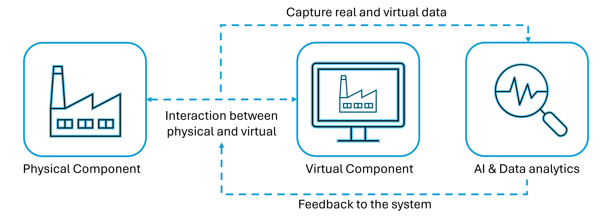
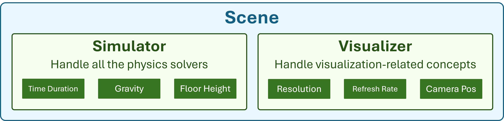
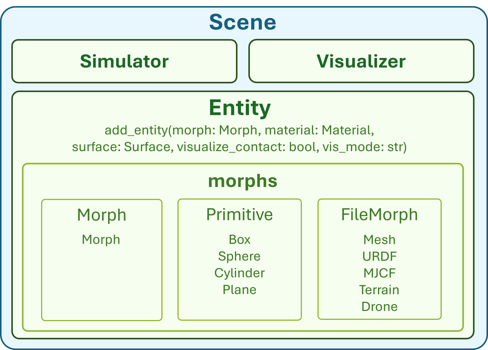
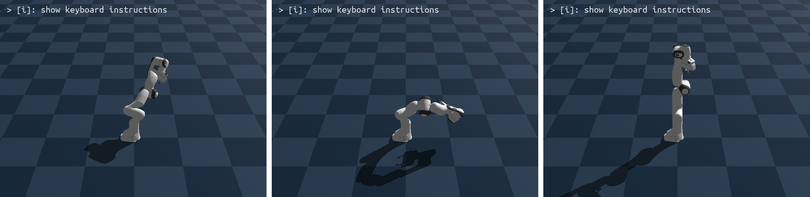
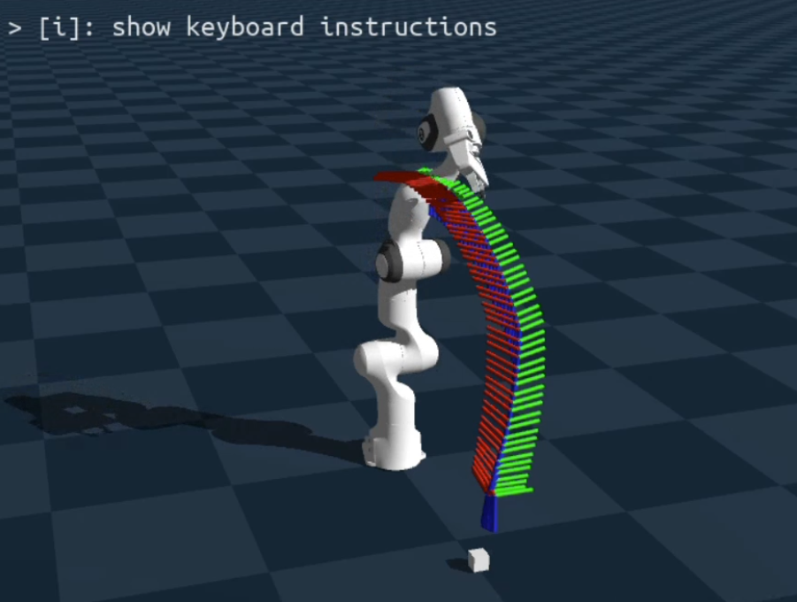
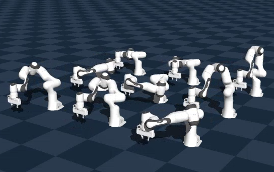

<!---
Copyright (c) 2026 Advanced Micro Devices, Inc. (AMD)

Permission is hereby granted, free of charge, to any person obtaining a copy
of this software and associated documentation files (the "Software"), to deal
in the Software without restriction, including without limitation the rights
to use, copy, modify, merge, publish, distribute, sublicense, and/or sell
copies of the Software, and to permit persons to whom the Software is
furnished to do so, subject to the following conditions:

The above copyright notice and this permission notice shall be included in all
copies or substantial portions of the Software.

THE SOFTWARE IS PROVIDED "AS IS", WITHOUT WARRANTY OF ANY KIND, EXPRESS OR
IMPLIED, INCLUDING BUT NOT LIMITED TO THE WARRANTIES OF MERCHANTABILITY,
FITNESS FOR A PARTICULAR PURPOSE AND NONINFRINGEMENT. IN NO EVENT SHALL THE
AUTHORS OR COPYRIGHT HOLDERS BE LIABLE FOR ANY CLAIM, DAMAGES OR OTHER
LIABILITY, WHETHER IN AN ACTION OF CONTRACT, TORT OR OTHERWISE, ARISING FROM,
OUT OF OR IN CONNECTION WITH THE SOFTWARE OR THE USE OR OTHER DEALINGS IN THE
SOFTWARE.
--->

# Digital Twins on AMD: Building Robotic Simulations Using Edge AI PCs

Digital twins are becoming a core tool in robotics, automation, and intelligent systems. They provide a virtual representation of a physical system, allowing developers to validate robot behaviors, test motion strategies, and generate datasets before deploying anything in the real world.

With AMD hardware, such as Ryzen AI MAX, it is now possible to run high-fidelity physics simulations and parallel environments directly on an edge device.

This blog first explores what a digital twin is and the essential components of a robust digital-twin platform. It then provides a hands-on tutorial using the Genesis robotic simulation platform, covering topics such as initializing the backend, creating a scene, loading a robot, controlling its joints, executing basic motion planning, and scaling the simulation to multiple environments.

## What Is a Digital Twin?

A digital twin is a dynamic, simulation-backed representation of a physical system. It is useful for robotics, instead of testing everything on hardware, many iterations can happen safely in simulation.

It consists of two main components: the physical system and its virtual counterpart. The general workflow of a digital twin is illustrated below:



Here are some advantages of using digital twins:

* **Managing Complexity** \
Real systems involve many interacting components that are difficult to reason about analytically. A digital twin combines physics models and data streams to approximate how the system behaves under different conditions, making it easier to plan and optimize.

* **Moving from Reactive to Proactive** \
When a digital twin continuously monitors a system, it can highlight anomalies and trends early. This supports proactive maintenance instead of waiting for failures, which reduces downtime and cost.

* **Low-Cost Experimentation** \
New control policies, software updates, or mechanical changes can be evaluated in the twin before they affect the real system. This lowers risk and speeds up development cycles.

## Key Components for a Digital Twin Simulation Platform

To support realistic and scalable digital twins, the underlying simulation platform needs several key capabilities:

* **General-Purpose Physics Engine** \
The engine should handle rigid bodies, articulated mechanisms, contacts, and potentially soft materials or fluids. The more accurately it reflects physical behavior, the more reliable the twin becomes.

* **High-Speed Parallelization**\
Many workflows involve running the same scenario under different conditions—classic in reinforcement learning or parameter sweeps. GPU-accelerated parallel simulation is critical for this.

* **Material Rendering and Visualization** \
Good visualization is not just cosmetic. It makes debugging easier and helps teams reason about what the robot or system is doing inside the simulated world.

* **Data Integration and Data Generation** \
A digital twin both consumes and produces data. The platform must be able to ingest sensor or log data and generate synthetic data for analytics or machine learning.

In this blog, we use [Genesis](https://github.com/Genesis-Embodied-AI/Genesis) as the simulation backend. It is an open-source, GPU-accelerated physics engine designed for robotics and embodied AI, and it can be integrated with AMD hardware through the Vulkan backend.

## Tutorial: Controlling a Robot in Genesis Using AMD Ryzen AI MAX

The following tutorial will guide you on how to use Ryzen AI MAX to control a robot arm on the Genesis platform. Ryzen AI MAX features a unified memory architecture and can allocate up to 96GB of dedicated memory to the GPU, making it an excellent platform for running LLM inference and edge simulations. All content in this tutorial can be executed on Ryzen AI MAX, and complete code samples have been publicly provided.

### 1. Prerequisites and Initial Setup

Before working directly with Genesis, it is helpful to have a convenient way to build and run the environment.

The [**AUP Learning Cloud**](https://github.com/AMDResearch/aup-learning-cloud) repository provides a series of pre-configured courses for AMD hardware, using the latest ROCm version to ensure all content runs correctly.

Hardware: AMD Ryzen™ AI Halo device (e.g., AI Max+ 395, AI Max 390) \
Environment: Ubuntu 24.04

To get started, clone the repository and install the required dependencies:

```bash
git clone https://github.com/AMDResearch/aup-learning-cloud.git
cd aup-learning-cloud/deploy/
sudo ./single-node.sh install
```

After installation completes, open `http://localhost:30890` in your browser. The "Physical Simulation" course in the browser will fully cover the tutorial content presented in this blog.

For users who prefer to install Genesis directly, the official Genesis repository provides detailed instructions. For more information and from-scratch installation instructions, please go to the [Genesis](https://github.com/Genesis-Embodied-AI/Genesis) repository.

After the installation is ready, you can start a Python session (or Jupyter notebook) and begin building scenes with Genesis.

### 2. Initialize Genesis Backend

Genesis needs to be initialized exactly once per process. During this step, it prepares data structures and selects the compute backend. On AMD hardware, the Vulkan backend is recommended to leverage the integrated GPU for rendering.

```python
import genesis as gs
gs.init(backend=gs.vulkan)
```

### 3. Create a Simulation Scene

A scene is the container for the entire simulated world. It holds global physics parameters, camera settings, and the list of entities that will be simulated.

Inside the scene, there are two main components: the simulator and the visualizer, as shown in the figure below.



In the example below, the timestep and gravity are specified, and a camera pose is defined. The viewer can be turned off for headless runs.

```python
scene = gs.Scene(
    sim_options=gs.options.SimOptions(
        dt=0.01,
        gravity=(0, 0, -10.0),
    ),
    viewer_options=gs.options.ViewerOptions(
        camera_pos=(3.5, 0.0, 2.5),
        camera_lookat=(0.0, 0.0, 0.5),
        camera_fov=40,
    ),
    show_viewer=False,
)
```

### 4. Add Entities: Ground and Robot

Every physical object in Genesis is represented as an entity. You can add different entities to the scene, such as adding a plane, as shown in the figure below.



For a simple robotic setup, a ground plane and a robot arm are enough to get started.

In this tutorial, a Franka Panda arm is loaded from its MJCF file, which encodes its kinematic structure, geometry, and physical properties.

```python
plane = scene.add_entity(gs.morphs.Plane())

franka = scene.add_entity(
    gs.morphs.MJCF(file="xml/franka_emika_panda/panda.xml"),
)
```

### 5. Build the Scene

Before stepping the simulation, Genesis needs to “build” the scene. This is where it inspects the entities, generates optimized GPU kernels, and allocates memory for internal state: positions, velocities, contact data, and controller buffers. After this step, the high-level structure of the scene is fixed.

```python
scene.build()
```

### 6. Control Joints and DOFs

Robot motion is controlled at the DOF (degree of freedom) level. The Franka Panda has 7 arm joints and 2 gripper joints, giving 9 DOFs in total. Genesis stores DOFs in flat arrays on the device, so we first collect their indices to control them efficiently.

```python
jnt_names = [
    'joint1','joint2','joint3','joint4','joint5','joint6','joint7',
    'finger_joint1','finger_joint2'
]

dofs_idx_temp = [franka.get_joint(name).dofs_idx_local for name in jnt_names]
dofs_idx = [idx for sublist in dofs_idx_temp for idx in sublist]
```

### 7. Configure PD Controllers

To produce physically realistic motion, the robot uses PD (Proportional–Derivative) controllers. Each DOF has a stiffness term (Kp), a damping term (Kv), and a torque limit. These values influence how aggressively the joint tries to track its target and how stable the motion feels.

Here, we take the Franka arm as an example:

```python
import numpy as np

franka.set_dofs_kp(
    kp=np.array([4500, 4500, 3500, 3500, 2000, 2000, 2000, 100, 100]),
    dofs_idx_local=dofs_idx,
)

franka.set_dofs_kv(
    kv=np.array([450, 450, 350, 350, 200, 200, 200, 10, 10]),
    dofs_idx_local=dofs_idx,
)

franka.set_dofs_force_range(
    lower=np.array([-87, -87, -87, -87, -12, -12, -12, -100, -100]),
    upper=np.array([ 87,  87,  87,  87,  12,  12,  12,  100,  100]),
    dofs_idx_local=dofs_idx,
)
```

### 8. Control Joint Position

We have two ways to control joint positions: one is direct joint position assignment, and the other is sending control commands through PD.

* Direct Joint Position Assignment

When initializing or resetting a scene, it is often convenient to place the robot in a specific configuration immediately. This can be done by directly setting the DOF positions, which overwrites the internal state without going through the physics solver.

```python
franka.set_dofs_position(
    np.array([1, 1, 0, 0, 0, 0, 0, 0.04, 0.04]),
    dofs_idx
)
```

* Sending Control Commands Through PD

For actual motion, commands should go through the PD controllers. This preserves dynamics, respects limits, and results in more realistic behavior. In the example below, the first DOF is driven with a velocity target, while the remaining DOFs are given position targets.

```python
# Position targets for DOFs 1–8
franka.control_dofs_position(
    np.array([0, 0, 0, 0, 0, 0, 0, 0])[0:],  # 8 elements for joints 2–9
    dofs_idx[1:],
)

# Velocity target for the first DOF
franka.control_dofs_velocity(
    np.array([1.0]),   # only for joint1
    dofs_idx[:1],
)
```

### 9. Start the Simulation

The core simulation loop repeatedly advances the scene by one timestep. On each step, Genesis computes controller torques, resolves constraints and contacts, integrates motion, and updates transforms.

```python
for i in range(120):
    scene.step()
```

If everything goes smoothly, you will see a robotic arm appear on the screen. A portion of the scene is shown below:



### 10. Motion Planning With IK

For tasks like reaching and grasping, it is often easier to specify a target end-effector pose rather than joint angles. Genesis provides inverse kinematics utilities to compute joint configurations that realize a given pose, and these can be turned into trajectories and tracked by the same PD control mechanism.

A typical pipeline looks like this:

1. Define a target pose for the end-effector.
2. Use inverse kinematics (IK) to solve for joint angles.
3. Interpolate between the current and target configurations.
4. Send the joint targets over time using `control_dofs_position`.

The full implementation depends on the specific task and is usually best placed in a separate notebook or script. When you visualize the motion planning trajectory, you might see a scene like the one below:



### 11. Parallel Simulation

Many digital twin and RL workloads benefit from running multiple environments in parallel. Genesis can replicate the scene into a batch of environments during the build stage. Each environment has its own robot state but shares the same GPU kernels and scene structure.

To enable this, the number of environments and the spacing between them are specified when building the scene:

```python
n_envs = 9
scene.build(n_envs=n_envs, env_spacing=(1.0, 1.0))
```

After this, every state array gains an environment dimension. Control commands and observations can then be handled in a batched way, which is ideal for reinforcement learning or large-scale evaluation.

The following figure demonstrates a setup where nine robotic arms are simulated simultaneously:



## Summary

This blog introduced the concept of digital twins, outlined what a capable digital-twin platform needs, and showed how AMD hardware can support this workflow at the edge. Using Genesis on Ryzen AI MAX, we walked through a complete pipeline: initialization, scene creation, robot loading, controller setup, simulation stepping, motion control, and parallel environments.

These pieces form a solid foundation for building more advanced applications such as reinforcement learning, sim-to-real transfer, and large-scale synthetic data generation—all running on AMD hardware with a high-performance, GPU-accelerated simulation stack.

## Additional Resources

* AUP Learning Cloud: https://github.com/AMDResearch/aup-learning-cloud

* AMD Ryzers Repository: https://github.com/AMDResearch/Ryzers

* Genesis Simulation Engine: https://github.com/Genesis-Embodied-AI/Genesis

* MJCF Franka Model: https://github.com/facebookresearch/fairo/tree/main/fairo/robots

## Acknowledgements

Thanks to the [AMD University Program](https://www.amd.com/en/corporate/university-program.html), [AMD Research & Advanced Development](https://www.amd.com/en/corporate/research.html) teams, and the Genesis Embodied AI community for contributing to open digital-twin research infrastructure.

## Disclaimers

Third-party content is licensed to you directly by the third party that owns the
content and is not licensed to you by AMD. ALL LINKED THIRD-PARTY CONTENT IS
PROVIDED “AS IS” WITHOUT A WARRANTY OF ANY KIND. USE OF SUCH THIRD-PARTY CONTENT
IS DONE AT YOUR SOLE DISCRETION AND UNDER NO CIRCUMSTANCES WILL AMD BE LIABLE TO
YOU FOR ANY THIRD-PARTY CONTENT. YOU ASSUME ALL RISK AND ARE SOLELY RESPONSIBLE
FOR ANY DAMAGES THAT MAY ARISE FROM YOUR USE OF THIRD-PARTY CONTENT.
