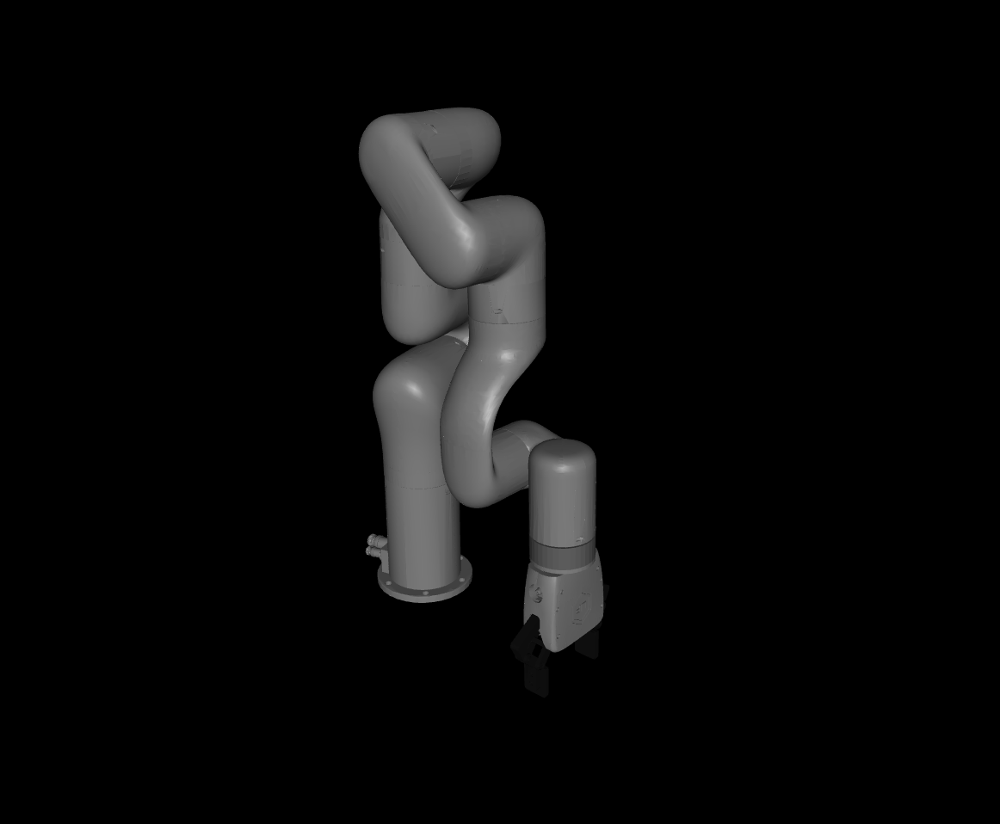
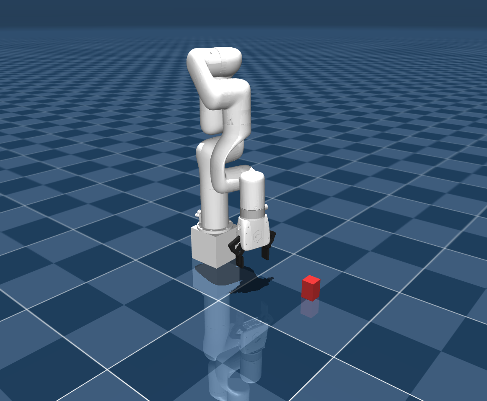
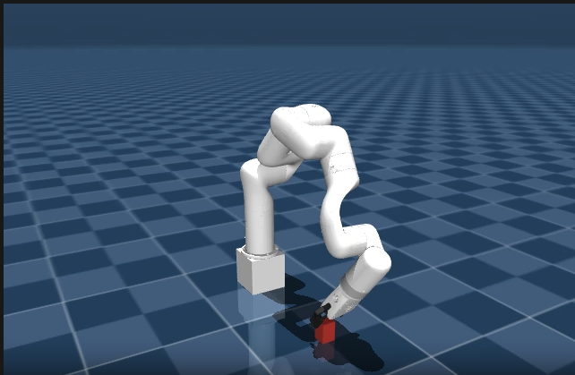

<!---
Copyright (c) 2026 Advanced Micro Devices, Inc. (AMD)

Permission is hereby granted, free of charge, to any person obtaining a copy
of this software and associated documentation files (the "Software"), to deal
in the Software without restriction, including without limitation the rights
to use, copy, modify, merge, publish, distribute, sublicense, and/or sell
copies of the Software, and to permit persons to whom the Software is
furnished to do so, subject to the following conditions:

The above copyright notice and this permission notice shall be included in all
copies or substantial portions of the Software.

THE SOFTWARE IS PROVIDED "AS IS", WITHOUT WARRANTY OF ANY KIND, EXPRESS OR
IMPLIED, INCLUDING BUT NOT LIMITED TO THE WARRANTIES OF MERCHANTABILITY,
FITNESS FOR A PARTICULAR PURPOSE AND NONINFRINGEMENT. IN NO EVENT SHALL THE
AUTHORS OR COPYRIGHT HOLDERS BE LIABLE FOR ANY CLAIM, DAMAGES OR OTHER
LIABILITY, WHETHER IN AN ACTION OF CONTRACT, TORT OR OTHERWISE, ARISING FROM,
OUT OF OR IN CONNECTION WITH THE SOFTWARE OR THE USE OR OTHER DEALINGS IN THE
SOFTWARE.
--->

# Training a Robotic Arm Using MuJoCo and JAX on AMD Hardware with ROCm™

Training a robotic arm to pick up an object and place it somewhere else may sound straightforward, but teaching a robot to do this reliably in the real world is one of the harder problems in robotics. Traditional approaches rely on hand-tuned motion planning and carefully scripted control logic, which is brittle and time-consuming to maintain as environments change.

Reinforcement Learning (RL) offers a compelling alternative. Rather than programming explicit behaviors, an RL agent learns through trial and error inside a simulated environment, discovering control policies that generalize across varying conditions. The result is a controller that adapts to new situations without being re-engineered from scratch.

The practical challenge is compute. RL algorithms require millions of simulated interactions to converge, and running those interactions at scale demands significant GPU throughput. Robotics simulators bridge this gap by providing physically accurate environments that run orders of magnitude faster than real time. [MuJoCo](https://mujoco.org/) is one of the most widely adopted simulators in this space. Its optimized contact dynamics engine and tight integration with hardware-accelerated frameworks like [JAX](https://github.com/jax-ml/jax) make it well suited for large-scale RL training.

In this blog post, we walk through training a [UFactory X-Arm 7](https://www.ufactory.cc/xarm-collaborative-robot/) to perform a pick-and-place task using [MuJoCo Playground](https://github.com/google-deepmind/mujoco_playground), [MuJoCo Menagerie](https://github.com/google-deepmind/mujoco_menagerie), and JAX, all running on AMD GPUs with [ROCm 7.2](https://rocm.docs.amd.com/). We cover the full pipeline, from environment setup and reward shaping to domain randomization, providing a reproducible starting point for anyone looking to train an RL-based robotic manipulator on AMD hardware.

## Installation

### Prerequisites

*Note: At the time of writing, this tutorial only applies to Linux distributions, as JAX on ROCm is not available on Windows. We verified these steps using Ubuntu 24.04.*

Ensure your system meets the [ROCm 7.2.0 system requirements](https://rocm.docs.amd.com/projects/install-on-linux/en/docs-7.2.0/reference/system-requirements.html), including a [supported GPU](https://rocm.docs.amd.com/projects/install-on-linux/en/docs-7.2.0/reference/system-requirements.html#supported-gpus).

Next, we need to install several components to fully set up MuJoCo for AMD hardware.

### Installing MuJoCo Playground, JAX, and Menagerie Assets

Follow the instructions on the [MuJoCo Playground GitHub repository](https://github.com/google-deepmind/mujoco_playground) up to step 5.
Instead of the CUDA-based instructions, follow the Docker container workflow in the [JAX on ROCm installation](https://rocm.docs.amd.com/projects/install-on-linux/en/latest/install/3rd-party/jax-install.html) tutorial.

### ROCm Environment Variables

Depending on your GPU, you may need to set several environment variables inside the Docker container for ROCm and JAX to function correctly. We tested with an AMD Radeon RX 7900 XTX and found the following additions to `~/.bashrc` necessary:

```bash
export LLVM_PATH=/opt/rocm/llvm
export HIP_DEVICE_LIB_PATH=/opt/rocm-7.2.0/lib/llvm/lib/clang/22/lib/amdgcn/bitcode
export MUJOCO_GL=osmesa
export XLA_FLAGS="--xla_gpu_enable_command_buffer="
```

- **`LLVM_PATH`** and **`HIP_DEVICE_LIB_PATH`**: Point to the ROCm LLVM toolchain and device bitcode libraries. Without these, HIP kernel compilation may fail to locate the device libraries. Adjust the ROCm version in the path (e.g., `rocm-7.2.0`) to match your installation.
- **`MUJOCO_GL=osmesa`**: Uses software rendering for MuJoCo visualization. This avoids EGL/GPU display issues on headless systems or when the GPU does not expose an EGL display.
- **`XLA_FLAGS="--xla_gpu_enable_command_buffer="`**: Disables XLA command buffers.

After adding these, run `source ~/.bashrc` or open a new terminal before proceeding.

Be sure to test your installation with the following commands:

```bash
python3 -c "import jax; print(jax.devices())"
python3 -c "import jax.numpy as jnp; x = jnp.arange(5); print(x)"
```

For example, you might see output similar to the following (the number of devices depends on your system):

```text
[RocmDevice(id=0), RocmDevice(id=1), RocmDevice(id=2), RocmDevice(id=3)]
[0 1 2 3 4]
```

Additionally, the following command should print "gpu":

```bash
python3 -c "import jax; print(jax.default_backend())"
```

Follow the remaining steps in the repository to complete the playground installation.

Run the following command to load the remaining Menagerie assets, including the X-Arm 7:

```bash
uv pip install robot_descriptions
```

*Note: Omit "uv" if you chose not to use the uv package manager during the playground installation.*

## Environment & Asset Creation

First, we need to create a new folder structure within the playground repository to house our custom X-Arm 7 environment. Navigate to your MuJoCo Playground installation and create the following directories and files under `<mujoco_path>/mujoco_playground/_src/manipulation/`:

```text
xarm7_training/
├── __init__.py
├── xarm7.py
├── pickplace.py
└── xmls/
    ├── assets/          # Decimated STL meshes (see below)
    ├── xarm7.xml
    └── mjx_single_cube.xml
```

Inside the `__init__.py` file, you should import your environment class:

```python
from mujoco_playground._src.manipulation.xarm7_training.pickplace import XArm7PickPlace
```

The `xarm7.xml` file declares `meshdir="assets"`, so you need an `assets/` folder inside `xmls/` containing the X-Arm 7 mesh files (`.stl`). The source meshes are in MuJoCo Menagerie's `ufactory_xarm7/assets/` directory (if you followed the Playground installation, Menagerie is auto-cloned to `mujoco_playground/_src/external_deps/mujoco_menagerie/`).

However, the raw Menagerie meshes have high polygon counts that cause coplanar face warnings in MJX and slow down collision detection. We recommend decimating them before use. The following Python script uses [Open3D](http://www.open3d.org/) to reduce each mesh to a target face count:

<details>
<summary>decimate_meshes.py</summary>

```python
import pathlib
import open3d as o3d

src = pathlib.Path("<menagerie_path>/ufactory_xarm7/assets")
dst = pathlib.Path(
    "<mujoco_path>/mujoco_playground/_src/manipulation"
    "/xarm7_training/xmls/assets"
)
dst.mkdir(parents=True, exist_ok=True)

target_faces = 500  # Adjust as needed; lower = faster collision

for stl in src.glob("*.stl"):
    mesh = o3d.io.read_triangle_mesh(str(stl))
    decimated = mesh.simplify_quadric_decimation(target_faces)
    o3d.io.write_triangle_mesh(str(dst / stl.name), decimated)
    print(f"{stl.name}: {len(mesh.triangles)} -> {len(decimated.triangles)} faces")
```

</details>

```bash
pip install open3d
python decimate_meshes.py
```

If you prefer to skip decimation, you can copy the raw meshes directly (`cp -r <menagerie_path>/ufactory_xarm7/assets <dst>`). Training will still work, but you may see coplanar face warnings and slightly slower MJX compilation. Our `xarm7.xml` also sets `maxhullvert="20"` on each mesh asset, which limits convex hull complexity on the MuJoCo side regardless of the input mesh resolution.

### Create the X-Arm7 Base Module

The base class `xarm7.py` handles asset loading from MuJoCo Menagerie and provides the shared initialization logic (joint mappings, gripper site IDs, keyframe loading) that `pickplace.py` builds on. This separation keeps the training-specific reward and observation logic cleanly separated from the robot hardware abstraction.

<details>
<summary>xarm7.py</summary>

```python
"""UFactory X-Arm7 base class."""

from typing import Any, Dict, Optional, Union

import jax
from etils import epath
import jax.numpy as jp
from ml_collections import config_dict
import mujoco
from mujoco import mjx
import numpy as np

from mujoco_playground._src import mjx_env

_ARM_JOINTS = [
    "joint1", "joint2", "joint3", "joint4",
    "joint5", "joint6", "joint7",
]
_GRIPPER_JOINTS = ["left_driver_joint", "right_driver_joint"]
_MENAGERIE_XARM7_DIR = "ufactory_xarm7"


def get_assets() -> Dict[str, bytes]:
  """Collect assets from menagerie and xarm7_training xmls."""
  assets = {}
  path = mjx_env.MENAGERIE_PATH / _MENAGERIE_XARM7_DIR
  mjx_env.update_assets(assets, path, "*.xml")
  mjx_env.update_assets(assets, path / "assets")
  # Load xarm7_training xmls last so our xarm7.xml overrides menagerie's
  path = mjx_env.ROOT_PATH / "manipulation" / "xarm7_training" / "xmls"
  mjx_env.update_assets(assets, path, "*.xml")
  mjx_env.update_assets(assets, path / "assets")
  return assets


class XArm7Base(mjx_env.MjxEnv):
  """Base environment for UFactory X-Arm7 with gripper."""

  def __init__(self, xml_path: epath.Path, config: config_dict.ConfigDict,
               config_overrides: Optional[Dict[str, Union[str, int, list[Any]]]] = None):
    super().__init__(config, config_overrides)
    self._xml_path = xml_path.as_posix()
    xml = xml_path.read_text()
    self._model_assets = get_assets()
    mj_model = mujoco.MjModel.from_xml_string(xml, assets=self._model_assets)
    mj_model.opt.timestep = self.sim_dt
    self._mj_model = mj_model
    self._mjx_model = mjx.put_model(mj_model, impl=self._config.impl)
    self._action_scale = config.action_scale

  def _post_init(self, obj_name: str, keyframe: str):
    all_joints = _ARM_JOINTS + _GRIPPER_JOINTS
    self._robot_arm_qposadr = np.array([
        self._mj_model.jnt_qposadr[self._mj_model.joint(j).id]
        for j in _ARM_JOINTS
    ])
    self._robot_qposadr = np.array([
        self._mj_model.jnt_qposadr[self._mj_model.joint(j).id]
        for j in all_joints
    ])
    self._robot_dofadr = np.array([
        self._mj_model.jnt_dofadr[self._mj_model.joint(j).id]
        for j in all_joints
    ])
    self._gripper_site = self._mj_model.site("link_tcp").id
    self._obj_body = self._mj_model.body(obj_name).id
    self._obj_qposadr = self._mj_model.jnt_qposadr[
        self._mj_model.body(obj_name).jntadr[0]
    ]
    self._floor_geom = self._mj_model.geom("floor").id
    self._init_q = self._mj_model.keyframe(keyframe).qpos.copy()
    obj_slice = slice(self._obj_qposadr, self._obj_qposadr + 7)
    self._init_q[obj_slice] = self._mj_model.qpos0[obj_slice]
    self._init_ctrl = self._mj_model.keyframe(keyframe).ctrl.copy()
    self._lowers, self._uppers = self._mj_model.actuator_ctrlrange.T
    self._init_obj_pos = jp.array(
        self._init_q[self._obj_qposadr : self._obj_qposadr + 3],
        dtype=jp.float32,
    )

  def get_arm_joint_angles(self, data: mjx.Data) -> jax.Array:
    return data.qpos[self._robot_arm_qposadr]

  @property
  def xml_path(self) -> str:
    return self._xml_path

  @property
  def action_size(self) -> int:
    return self.mjx_model.nu

  @property
  def mj_model(self) -> mujoco.MjModel:
    return self._mj_model

  @property
  def mjx_model(self) -> mjx.Model:
    return self._mjx_model
```

</details>

Key details:

- **Asset loading order matters**: `get_assets()` first loads all XMLs and mesh STLs from the Menagerie `ufactory_xarm7/` directory, then loads our custom `xmls/` folder (including `xmls/assets/` for decimated meshes) so our files override Menagerie. Because our `xarm7.xml` is loaded last, it overrides the Menagerie's version. This is how we inject `maxhullvert` attributes and custom collision geometries without modifying the upstream Menagerie files.
- **`assets/` folder required**: Our `xarm7.xml` declares `meshdir="assets"`, so the `xmls/assets/` directory must contain the (decimated) X-Arm 7 mesh STL files as described above.
- **`_post_init()`** maps joint names to their address indices in `qpos` and `qvel`, looks up the gripper tool center point (`link_tcp`), and loads the initial pose from a keyframe.
- **`link_tcp`** is the tool center point (TCP) site, located between the gripper fingertips where a grasped object would be centered, not at the arm-to-gripper mount. Some other robot models use names like `"gripper"` or `"ee_mount"` for a similar purpose.

### Create the X-Arm7 Robot Description

Our custom `xmls/xarm7.xml` defines the full X-Arm 7 robot model based on the [MuJoCo Menagerie X-Arm 7](https://github.com/google-deepmind/mujoco_menagerie/tree/main/ufactory_xarm7), with several modifications for MJX training: `maxhullvert` attributes on mesh assets to limit convex hull vertices and reduce coplanar face warnings, finger pad collision geometries for reliable grasp contact detection, and keyframes for the robot's initial poses:

<details>
<summary>xarm7.xml (Abbreviated)</summary>

```xml
<!-- In xarm7.xml (abbreviated - key additions shown) -->
<asset>
  <!-- maxhullvert limits convex hull vertices to reduce MJX warnings -->
  <mesh file="link_base.stl" maxhullvert="20"/>
  <mesh file="link1.stl" maxhullvert="20"/>
  <!-- ... same for link2 through link6 and end_tool ... -->
</asset>

<!-- Finger pad collision geometries for grasp detection -->
<default class="pad_box1">
  <geom type="box" condim="4" friction="1 0.1 0.01"
    solimp="0.95 0.99 0.001" solref="0.006 1"
    mass="0" priority="1" size="0.015 0.004 0.011"/>
</default>

<!-- Two keyframes: default home and pre-grasp position -->
<keyframe>
  <key name="home" qpos="0 -.247 0 .909 0 1.15644 0 ..."
    ctrl="0 -.247 0 .909 0 1.15644 0 0"/>
  <key name="pick_home" qpos="0.3 0.33684 -0.1 0.91053 0 1.15644 0 ..."
    ctrl="0.3 0.33684 -0.1 0.91053 0 1.15644 0 0"/>
</keyframe>
```

</details>

The `pick_home` keyframe positions the arm closer to the cube's starting location, giving the policy a head start on learning the approach phase.

You can preview the robot model by opening `xarm7.xml` in the MuJoCo interactive viewer. This requires a standalone MuJoCo installation (outside your training virtual environment):

```bash
pip install mujoco
python -m mujoco.viewer --mjcf=<mujoco_path>/mujoco_playground/_src/manipulation/xarm7_training/xmls/xarm7.xml
```

*Note: On Wayland-based Linux desktops, the viewer may fail to open with a GLFW error. If so, point `PYGLFW_LIBRARY` at the X11 GLFW shared library bundled with your Python `glfw` package:*

```bash
PYGLFW_LIBRARY=$(python -c "import glfw, pathlib; print(next(pathlib.Path(glfw.__file__).parent.glob('x11/libglfw.so')))")
PYGLFW_LIBRARY=$PYGLFW_LIBRARY python -m mujoco.viewer --mjcf=xarm7.xml
```

If everything is set up correctly, you should see the robot model in the viewer:



### Create the MJCF Scene with Block

This MJCF file (`xmls/mjx_single_cube.xml`) defines the training environment, including the placement of the robot arm, the target block, floor texture, cameras, and contact sensors:

<details>
<summary>mjx_single_cube.xml</summary>

```xml
<mujoco model="xarm7_scene">
  <include file="xarm7.xml"/>

  <statistic center="0.2 0 0.3" extent="1.0"/>

  <option timestep="0.005" iterations="5" ls_iterations="8" integrator="implicitfast">
    <flag eulerdamp="disable"/>
  </option>

  <custom>
    <numeric data="12" name="max_contact_points"/>
  </custom>

  <visual>
    <headlight diffuse="0.6 0.6 0.6" ambient="0.3 0.3 0.3" specular="0 0 0"/>
    <rgba haze="0.15 0.25 0.35 1"/>
    <global azimuth="150" elevation="-20"/>
    <map force="0.01"/>
    <quality shadowsize="8192"/>
    <scale contactwidth="0.075" contactheight="0.025" forcewidth="0.05"
      com="0.05" framewidth="0.01" framelength="0.2"/>
  </visual>

  <asset>
    <texture type="skybox" builtin="gradient" rgb1="0.3 0.5 0.7"
      rgb2="0 0 0" width="512" height="3072"/>
    <texture type="2d" name="groundplane" builtin="checker" mark="edge"
      rgb1="0.2 0.3 0.4" rgb2="0.1 0.2 0.3"
      markrgb="0.8 0.8 0.8" width="300" height="300"/>
    <material name="groundplane" texture="groundplane" texuniform="true"
      texrepeat="5 5" reflectance="0.2"/>
  </asset>

  <worldbody>
    <light pos="0 0 1.5" dir="0 0 -1" directional="true"/>
    <geom name="floor" size="0 0 0.05" type="plane" material="groundplane"
      contype="1"/>
    <geom name="stand" type="box" size=".06 .06 .06" pos="0 0 .06"
      rgba="1 1 1 1"/>

    <body name="box" pos="0.4 0 0.03">
      <freejoint/>
      <geom name="box" type="box" size="0.02 0.02 0.03" rgba="0.8 0.2 0.2 1"
        mass="0.096" condim="3" friction="1 0.03 0.003" solref="0.01 1"/>
      <site name="box_left_finger_found" size="0.01" pos="0 -0.02 0"
        rgba="1 0 0 0"/>
      <site name="box_right_finger_found" size="0.01" pos="0 0.02 0"
        rgba="1 0 0 0"/>
    </body>

    <!-- External cameras for training/visualization -->
    <camera name="front" pos="0.8 0 0.4" xyaxes="0 -1 0 0.3 0 0.95"
      fovy="45"/>
    <camera name="side" pos="0.4 0.8 0.4" xyaxes="-1 0.5 0 0 0 1"
      fovy="45"/>
    <camera name="top" pos="0.4 0 1.0" xyaxes="0 -1 0 -1 0 0" fovy="60"/>
  </worldbody>

  <sensor>
    <contact name="left_finger_pad_1_floor_found" geom1="left_finger_pad_1"
      geom2="floor" reduce="mindist" num="1" data="found"/>
    <contact name="right_finger_pad_1_floor_found" geom1="right_finger_pad_1"
      geom2="floor" reduce="mindist" num="1" data="found"/>
    <contact name="box_left_finger_found" geom1="box"
      geom2="left_finger_pad_1" reduce="mindist" num="1" data="found"/>
    <contact name="box_right_finger_found" geom1="box"
      geom2="right_finger_pad_1" reduce="mindist" num="1" data="found"/>
  </sensor>
</mujoco>
```

</details>

The `<sensor>` block is critical for reward computation. The four contact sensors detect:

- Whether each finger pad is touching the floor (penalized to prevent floor collisions)
- Whether each finger pad is touching the cube (used to detect bilateral grasps)

You can preview the full scene the same way:

```bash
python -m mujoco.viewer --mjcf=<mujoco_path>/mujoco_playground/_src/manipulation/xarm7_training/xmls/mjx_single_cube.xml
```

You should see the full training scene, including the robot, the red cube, and the checkered floor:



## Training Code

Using JAX NumPy, we will create the necessary training scripts to provide the RL model with observations and rewards, and in turn, apply its actions. Note that the X-Arm 7 utilizes an 8-dimensional action space (7 for the arm joints, 1 for the gripper). The reward functions, observation spaces, and hyperparameters shown here are what we found to work, but they can be adjusted to suit your training runs or separate tasks.

### pickplace.py

The `pickplace.py` file contains the core environment class, configuration, and reward logic. We'll walk through the key components.

#### Imports and Configuration

<details>
<summary>Imports and Configuration</summary>

```python
from typing import Any, Dict, Optional, Union

import jax
import jax.numpy as jp
from ml_collections import config_dict
import mujoco
from mujoco import mjx
from mujoco_playground._src import mjx_env
from mujoco_playground._src.manipulation.xarm7_training import xarm7
from mujoco_playground._src.mjx_env import State
import numpy as np

_ARM_JOINTS = [
    "joint1", "joint2", "joint3", "joint4",
    "joint5", "joint6", "joint7",
]
_GRIPPER_JOINTS = ["left_driver_joint", "right_driver_joint"]


def default_config() -> config_dict.ConfigDict:
  """Returns the grasp-lift curriculum config for X-Arm7."""
  return config_dict.create(
      ctrl_dt=0.02,
      sim_dt=0.005,
      episode_length=250,
      action_repeat=1,
      action_scale=0.04,
      gripper_close_delta=0.12,
      gripper_open_delta=-0.085,
      reward_config=config_dict.create(
          reward_scales=config_dict.create(
              tcp_cube=3.0,
              approach_open=1.0,
              touch=0.5,
              grasp_incentive=4.0,
              post_grasp_raise=4.0,
              lift_pose=6.0,
              lift=20.0,
              hold=6.0,
              self_collision=-1.0,
              floor_collision=-0.25,
          ),
          reached_cube_threshold=0.04,
          lift_target_height=0.18,
          lift_success_height=0.18,
          post_grasp_raise_height=0.12,
          grasp_close_threshold=0.1,
          action_rate=-0.0005,
          no_soln_reward=-0.01,
          success_reward=2.0,
      ),
      exploration_reset_prob=0.0,
      randomize_box=False,
      box_range=config_dict.create(
          low=[-0.015, -0.015, 0.0],
          high=[0.015, 0.015, 0.0],
      ),
      box_range_easy=config_dict.create(
          low=[-0.015, -0.015, 0.0],
          high=[0.015, 0.015, 0.0],
      ),
      box_range_hard_prob=1.0,
      vision=False,
      reset_keyframe="pick_home",
      pregrasp_box_offset=[-0.005, 0.0, 0.028],
      lift_box_offset=[0.02, 0.0, 0.028],
      impl="jax",
      nconmax=4096,
      njmax=1024,
  )


def default_pick_place_config() -> config_dict.ConfigDict:
  return default_config()
```

</details>

The configuration defines several important parameters:

- **`gripper_close_delta`** / **`gripper_open_delta`**: Asymmetric gripper speeds. Closing faster than opening helps maintain grasp during lifting.
- **`reward_scales`**: Each reward component has its own weight. The `lift` term is weighted highest (20.0) since it represents the primary objective.
- **`reset_keyframe`**: Uses `"pick_home"` which starts the arm closer to the cube than the default `"home"` keyframe.
- **`pregrasp_box_offset` / `lift_box_offset`**: Cartesian offsets from the cube position that define where the gripper should be for the pregrasp and lift poses. At environment construction time (not during training), an IK solver uses these to compute the corresponding arm joint angles and cache Jacobian matrices. During training, only the cached Jacobians are used to adjust the arm pose when the cube position is randomized.
- **`box_range`**: When `randomize_box` is enabled, the cube's starting position is perturbed within this range to improve generalization.
- **`box_range_easy`** / **`box_range_hard_prob`**: Support a curriculum that mixes easy and hard randomization ranges. By default both ranges are identical, but you can widen `box_range` while keeping `box_range_easy` narrow and use `box_range_hard_prob` to control the mix ratio.
- **`exploration_reset_prob`**: Probability of resetting to a random exploration pose instead of the keyframe pose. Defaults to 0.0 (disabled).

<details>
<summary>Configuration Reference Table</summary>

| Parameter | Default | Description |
|-----------|---------|-------------|
| `ctrl_dt` | 0.02 | Control timestep (seconds) |
| `sim_dt` | 0.005 | Simulation timestep (seconds) |
| `episode_length` | 250 | Max steps per episode |
| `action_repeat` | 1 | Actions repeated per control step |
| `action_scale` | 0.04 | Per-step joint position delta scale |
| `gripper_close_delta` | 0.12 | Gripper closing speed (asymmetric, faster than open) |
| `gripper_open_delta` | -0.085 | Gripper opening speed |
| `reset_keyframe` | `"pick_home"` | Initial arm keyframe at episode start |
| `pregrasp_box_offset` | [-0.005, 0.0, 0.028] | Cartesian offset from cube for pregrasp pose (IK solved once at init) |
| `lift_box_offset` | [0.02, 0.0, 0.028] | Cartesian offset from cube for lift pose (IK solved once at init) |
| `randomize_box` | False | Enable cube position randomization at reset |
| `box_range` | +/-0.015 m | Cube randomization bounds when enabled |
| `box_range_easy` | +/-0.015 m | Narrow range for curriculum mixing |
| `box_range_hard_prob` | 1.0 | Probability of sampling from `box_range` vs `box_range_easy` |
| `exploration_reset_prob` | 0.0 | Probability of resetting to a random pose instead of keyframe |
| `nconmax` | 4096 | Maximum number of contacts |
| `njmax` | 1024 | Maximum number of constraint rows |
| `vision` | False | Use vision-based observations |
| `impl` | `"jax"` | Backend implementation |

</details>

#### Environment Class and Reset

<details>
<summary>XArm7PickPlace Class</summary>

```python
class XArm7PickPlace(xarm7.XArm7Base):
  """X-Arm7 grasp-lift task: approach, grasp, and lift a cube."""

  def __init__(
      self,
      config: Optional[config_dict.ConfigDict] = None,
      config_overrides: Optional[Dict[str, Union[str, int, list[Any]]]] = None,
  ):
    config = config or default_config()
    xml_path = (
        mjx_env.ROOT_PATH
        / "manipulation"
        / "xarm7_training"
        / "xmls"
        / "mjx_single_cube.xml"
    )
    super().__init__(xml_path, config, config_overrides)
    self._vision = self._config.vision
    self._init_task(
        keyframe=str(self._config.get("reset_keyframe", "home"))
    )

  @property
  def action_size(self) -> int:
    # 7D joint deltas + discrete gripper command
    return 8
```

</details>

The `_init_task()` method (called during construction, full implementation omitted for brevity) performs several important setup steps beyond what the base class provides:

1. Registers the contact sensors for cube and floor detection
2. Identifies all robot collision geometries for self-collision detection
3. Uses an IK solver to compute the arm joint angles that place the gripper at the pregrasp and lift target positions relative to the cube
4. Computes Jacobian matrices at those poses, enabling fast linear corrections when the cube position is randomized during `reset()`

The `reset()` method initializes each episode:

<details>
<summary>reset() Method</summary>

```python
  def reset(self, rng: jax.Array) -> State:
    rng, rng_box = jax.random.split(rng, 2)

    # Sample cube position with configurable randomization (box_range only)
    hard_offset = jax.random.uniform(
        rng_box, (3,),
        minval=jp.array(self._config.box_range.low),
        maxval=jp.array(self._config.box_range.high),
    )
    box_pos = jp.where(
        self._config.randomize_box,
        self._default_box_pos + hard_offset,
        self._default_box_pos,
    )

    # Adjust arm pose via precomputed Jacobian for the new cube position
    box_translation = box_pos - self._default_box_pos
    init_arm_q = jp.clip(
        self._pregrasp_arm_q
        + self._pregrasp_shift_qmat @ box_translation,
        self._lowers[:7], self._uppers[:7],
    )

    init_q = jp.array(self._init_q).at[
        self._obj_qposadr : self._obj_qposadr + 3
    ].set(box_pos)
    init_q = init_q.at[self._robot_arm_qposadr].set(init_arm_q)
    init_ctrl = jp.array(self._init_ctrl).at[:7].set(init_arm_q)

    data = mjx_env.make_data(
        self._mj_model,
        qpos=init_q,
        qvel=jp.zeros(self._mjx_model.nv, dtype=float),
        ctrl=init_ctrl,
        impl=self._mjx_model.impl.value,
        nconmax=self._config.get("nconmax", None),
        naconmax=self._config.get("naconmax", None),
        njmax=self._config.njmax,
    )
    data = mjx.forward(self._mjx_model, data)
    gripper_pos = data.site_xpos[self._gripper_site]
    gripper_rot = data.site_xmat[self._gripper_site].ravel()
    hard_sample = jp.where(self._config.randomize_box, jp.array(1.0), jp.array(0.0))

    metrics = {
        "out_of_bounds": jp.array(0.0),
        **{
            f"reward/{k}": 0.0
            for k in self._config.reward_config.reward_scales.keys()
        },
        "reward/success": jp.array(0.0),
        "floor_collision": jp.array(0.0),
        "dist_to_cube": jp.array(0.0),
        "ik_no_solution": jp.array(0.0),
        "exploration_reset": jp.array(0.0),
        "reached_cube": jp.array(0.0),
        "touching_cube": jp.array(0.0),
        "both_contact": jp.array(0.0),
        "grasped": jp.array(0.0),
        "lifted": jp.array(0.0),
        "self_collision": jp.array(0.0),
        "curriculum_hard_spawn": jp.array(hard_sample),
    }
    info = {
        "rng": rng,
        "prev_reward": jp.array(0.0, dtype=float),
        "current_pos": gripper_pos,
        "current_rot": gripper_rot,
        "newly_reset": jp.array(False, dtype=bool),
        "prev_action": jp.zeros(8),
        "reached_cube": jp.array(0.0, dtype=float),
        "touching_cube": jp.array(0.0, dtype=float),
        "grasped": jp.array(0.0, dtype=float),
        "grasp_site_z": jp.array(0.0, dtype=float),
        "lifted": jp.array(0.0, dtype=float),
        "lift_target_arm_q": lift_target_arm_q,
        "lift_pose_reward_offset": lift_pose_reward_offset,
        "curriculum_hard_spawn": jp.array(hard_sample, dtype=float),
        "_steps": jp.array(0, dtype=int),
    }
    obs = self._get_obs(data, info)
    reward, done = jp.zeros(2)
    return State(data, obs, reward, done, metrics, info)
```

</details>

The Jacobian-based arm adjustment (`self._pregrasp_shift_qmat @ box_translation`) avoids running IK during training. The IK solver and Jacobian computation happen once at environment construction (in `_init_task()`, using NumPy). During training, `reset()` only multiplies the cached Jacobian by the small cube position offset to get arm joint corrections, which is a single matrix-vector product that is computationally inexpensive inside `jax.jit` and accurate for the small perturbations used in box randomization.

#### Step Function

<details>
<summary>step() Method</summary>

```python
  def step(self, state: State, action: jax.Array) -> State:
    action = jp.clip(action, -1.0, 1.0)
    # [Reset-boundary bookkeeping omitted for brevity]

    q_current = self.get_arm_joint_angles(data_in)
    q_target = q_current + action[:7] * self._action_scale

    ctrl = jp.array(data_in.ctrl).at[:7].set(q_target)

    # Asymmetric gripper: close faster for reliable grasps
    close_gripper = action[7] < 0
    gripper_delta = jp.where(
        close_gripper,
        self._config.gripper_close_delta,
        self._config.gripper_open_delta,
    )
    ctrl = ctrl.at[7].set(ctrl[7] + gripper_delta)
    ctrl = jp.clip(ctrl, self._lowers, self._uppers)

    data = mjx_env.step(self._mjx_model, data_in, ctrl, self.n_substeps)

    (raw_rewards, dist_to_cube, success, floor_collision,
     self_collision, reached_cube, touching_cube, grasped,
     grasp_site_z, lifted, both_contact,
    ) = self._get_reward(data, reached_cube, grasped,
                         grasp_site_z, lifted, lift_target_arm_q,
                         lift_pose_reward_offset)

    rewards = {
        k: v * self._config.reward_config.reward_scales[k]
        for k, v in raw_rewards.items()
    }
    total_reward = jp.clip(sum(rewards.values()), -1e4, 1e4)
    total_reward += success * self._config.reward_config.success_reward

    # [State update and return omitted for brevity]
    return State(data, obs, reward, done, state.metrics, info)
```

</details>

#### Observations

The observation vector provides the policy with everything it needs to decide the next action. Notably, it includes explicit task-phase flags (`touching_cube`, `grasped`, `lifted`) so the policy can distinguish between the approach, grasp, and lift phases without needing recurrence:

<details>
<summary>_get_obs() Method</summary>

```python
  def _get_obs(self, data: mjx.Data, info: Dict[str, Any]
  ) -> Union[jax.Array, Dict[str, Any]]:
    box_pos = data.xpos[self._obj_body]
    gripper_pos = data.site_xpos[self._gripper_site]
    gripper_mat = data.site_xmat[self._gripper_site].ravel()
    gripper_openness = 1.0 - data.ctrl[7] / 0.85

    obs = jp.concatenate([
        data.qpos[self._robot_qposadr],      # 9D: arm + gripper joint pos
        data.qvel[self._robot_dofadr],        # 9D: arm + gripper joint vel
        gripper_pos,                          # 3D: TCP position
        gripper_mat[3:],                      # 6D: TCP orientation
        info["current_pos"],                  # 3D: previous TCP position
        box_pos - gripper_pos,                # 3D: cube-to-gripper vector
        jp.array([
            info["touching_cube"],            # Phase flags
            info["grasped"],
            info["lifted"],
        ]),
        jp.array([
            box_pos[2],                       # Cube height
            self._config.reward_config.lift_target_height - box_pos[2],
            gripper_openness,
        ]),
        data.ctrl[:7] - data.qpos[self._robot_arm_qposadr],  # Control error
    ])
    return jp.where(jp.isnan(obs), 0.0, obs)
```

</details>

<details>
<summary>Observation Vector Reference</summary>

| Indices | Dim | Content |
|---------|-----|---------|
| 0–8 | 9 | Arm + gripper joint positions (`qpos`) |
| 9–17 | 9 | Arm + gripper joint velocities (`qvel`) |
| 18–20 | 3 | TCP (gripper site) position |
| 21–26 | 6 | TCP orientation (rotation matrix, rows 2–3) |
| 27–29 | 3 | Previous TCP position |
| 30–32 | 3 | Cube-to-gripper vector |
| 33–35 | 3 | Phase flags: touching cube, grasped, lifted |
| 36–38 | 3 | Cube height, height error to target, gripper openness |
| 39–45 | 7 | Control error (target − actual arm joint positions) |

</details>

#### Reward Function

The reward function implements a multi-phase curriculum that guides the policy through approach, grasp, and lift:

<details>
<summary>_get_reward() Method</summary>

```python
  def _get_reward(self, data, reached_cube, grasped, grasp_site_z,
                  lifted, lift_target_arm_q, lift_pose_reward_offset):
    box_pos = data.xpos[self._obj_body]
    gripper_pos = data.site_xpos[self._gripper_site]
    dist_to_cube = jp.linalg.norm(box_pos - gripper_pos)

    pre_grasp = 1.0 - grasped
    pre_lift = 1.0 - lifted

    # Phase 1: Approach the cube (active before grasp)
    tcp_cube = jp.maximum(
        0.0, 1.0 - jp.tanh(5.0 * dist_to_cube)
        - self._tcp_cube_reward_offset
    ) * pre_grasp

    # Phase 2: Grasp detection via bilateral contact sensors
    cube_contacts = jp.array([
        data.sensordata[self._mj_model.sensor_adr[sid]] > 0
        for sid in self._cube_contact_sensors
    ])
    both_cube_contact = jp.all(cube_contacts).astype(float)
    close_amount = data.ctrl[7] / 0.85

    close_thresh = self._config.reward_config.grasp_close_threshold
    grasp_now = both_cube_contact * (close_amount > close_thresh).astype(float)
    grasped = jp.maximum(grasped, grasp_now)

    near_cube = (dist_to_cube < reached_cube_thresh).astype(float)
    grasp_incentive = (
        close_amount * jp.maximum(
            0.5 * cube_contacts.astype(float).sum(), 0.25 * near_cube
        ) * pre_grasp
    )

    # Phase 3: Lift the cube
    z0 = self._default_box_pos[2]
    z_target = self._config.reward_config.lift_target_height
    lift_progress = jp.clip(
        (box_pos[2] - z0) / (z_target - z0 + 1e-6), 0.0, 1.0
    )
    lift = jp.maximum(lift_progress * grasped, lifted)

    # [Remaining reward terms (approach_open, touch, post_grasp_raise,
    #  lift_pose, hold) and self-collision penalty omitted for brevity]

    return (
        {"tcp_cube": tcp_cube, "grasp_incentive": grasp_incentive,
         "approach_open": approach_open, "touch": touch,
         "post_grasp_raise": post_grasp_raise, "lift_pose": lift_pose,
         "lift": lift, "hold": hold,
         "self_collision": self_collision_penalty,
         "floor_collision": floor_collision},
        dist_to_cube, success, floor_collision, self_collision,
        reached_cube, touching_cube, grasped, grasp_site_z,
        lifted, both_cube_contact,
    )
```

</details>

<details>
<summary>Reward Components Reference</summary>

| Term | Weight | Phase | Description |
|------|--------|-------|-------------|
| `tcp_cube` | 3.0 | Pre-grasp | Proximity of gripper to cube (`1 − tanh(5d)`) |
| `approach_open` | 1.0 | Pre-grasp | Reward for keeping gripper open during approach |
| `touch` | 0.5 | Pre-grasp | Binary contact with cube |
| `grasp_incentive` | 4.0 | Pre-grasp | Gripper closure scaled by contact signal |
| `post_grasp_raise` | 4.0 | Post-grasp | Reward for initial upward motion after grasping |
| `lift_pose` | 6.0 | Post-grasp | Arm pose similarity to cached lift target |
| `lift` | 20.0 | Post-grasp | Normalized lift progress toward target height |
| `hold` | 6.0 | Post-lift | Sustained hold at target height |
| `self_collision` | -1.0 | Any | Depth-proportional self-intersection penalty |
| `floor_collision` | -0.25 | Any | Cube-floor contact penalty |

</details>

#### Why multi-phase reward gating?

A flat, single-term reward (e.g., pure lift height) creates a sparse signal. The policy receives almost no gradient until it accidentally lifts the cube, which may never happen within a reasonable number of training steps. Phase-gated rewards decompose the task into sub-goals the optimizer can reach incrementally. The `pre_grasp` and `pre_lift` multipliers ensure that once a phase is completed, its associated rewards deactivate so the policy is not incentivised to remain in an easy phase instead of progressing. Latching phase flags with `jp.maximum()` prevents reward oscillation if contact is briefly lost mid-grasp, giving the optimizer a stable learning signal. The self-collision penalty is depth-proportional rather than binary so that the gradient points smoothly away from self-intersection instead of introducing a discontinuity at the collision boundary.

Key reward design decisions:

- **Phase gating**: The `pre_grasp` and `pre_lift` multipliers ensure approach rewards deactivate once a grasp is established, preventing the policy from "gaming" easy early rewards instead of progressing.
- **Bilateral grasp detection**: A grasp is only registered when *both* finger pads have contact with the cube and the gripper is sufficiently closed. This prevents false positives from single-finger touches.
- **Latching**: Once `grasped` or `lifted` flags are set, they remain set for the rest of the episode via `jp.maximum()`. This gives stable reward signals.
- **Self-collision penalty**: Depth-proportional rather than binary, providing smooth gradients that discourage arm self-intersection without creating discontinuities.

The class is named `XArm7PickPlace` directly, matching the registry name used by the training script.

### Register the Environment

Add the new environment to the registry so the training script can find it. Edit `mujoco_playground/_src/manipulation/__init__.py`:

<details>
<summary>Environment Registration Code</summary>

```python
from mujoco_playground._src.manipulation.xarm7_training import pickplace as xarm7_pick_place

# Add to the _envs dictionary
_envs = {
    # ... other environments ...
    "XArm7PickPlace": xarm7_pick_place.XArm7PickPlace,
}

# Add to the _cfgs dictionary
_cfgs = {
    # ... other configs ...
    "XArm7PickPlace": xarm7_pick_place.default_pick_place_config,
}

# Add to the _randomizer dictionary
_randomizer = {
    # ... other randomizers ...
    "XArm7PickPlace": xarm7_pick_place.domain_randomize,
}
```

</details>

### Add PPO Hyperparameters

The training script loads environment-specific PPO hyperparameters from `mujoco_playground/config/manipulation_params.py`. Add an entry for `XArm7PickPlace`:

<details>
<summary>PPO Hyperparameters</summary>

```python
elif env_name == "XArm7PickPlace":
  rl_config.num_timesteps = 75_000_000
  rl_config.num_evals = 10
  rl_config.unroll_length = 10
  rl_config.num_minibatches = 8
  rl_config.num_updates_per_batch = 4
  rl_config.discounting = 0.98
  rl_config.learning_rate = 3e-4
  rl_config.entropy_cost = 5e-3
  rl_config.num_envs = 512
  rl_config.batch_size = 512
  rl_config.network_factory = config_dict.create(
      policy_hidden_layer_sizes=(256, 256),
      value_hidden_layer_sizes=(256, 256, 256, 256, 256),
      policy_obs_key="state",
      value_obs_key="state",
  )
```

</details>

The value network is intentionally deeper than the policy network (5 layers vs 2). The value function needs to estimate expected future reward across all task phases, while the policy only needs to map the current observation to an action.

### Training Script Modifications for ROCm

The training script at `learning/train_jax_ppo.py` has several modifications. Apply the following changes to that file:

**1. Runtime environment configuration** - Add this function near the top of the file, *before* any JAX imports, and call it immediately:

<details>
<summary>Runtime Configuration</summary>

```python
import os

def _configure_runtime_environment() -> None:
  """Sets JAX/XLA environment variables before importing JAX."""
  xla_flags = os.environ.get("XLA_FLAGS", "")
  # Triton GEMM can destabilize ROCm runs; keep it opt-in
  triton_flag = "--xla_gpu_triton_gemm_any=True"
  if (os.environ.get("MJP_ENABLE_TRITON_GEMM") == "1"
      and triton_flag not in xla_flags):
    xla_flags = f"{xla_flags} {triton_flag}".strip()
    os.environ["XLA_FLAGS"] = xla_flags
  os.environ.setdefault("XLA_PYTHON_CLIENT_PREALLOCATE", "false")
  os.environ.setdefault("MUJOCO_GL", "egl")

_configure_runtime_environment()

# ... existing imports (from absl import app, etc.) follow here ...
```

</details>

**2. JIT compilation caching** - Add these lines after the JAX imports (e.g., after `import jax`) to enable a persistent compilation cache that avoids costly recompilation on subsequent runs:

<details>
<summary>JIT Compilation Caching</summary>

```python
jax.config.update("jax_compilation_cache_dir",
    os.path.expanduser("~/.cache/jax_compilation_cache"))
jax.config.update("jax_persistent_cache_min_entry_size_bytes", -1)
jax.config.update("jax_persistent_cache_min_compile_time_secs", 0)
```

</details>

**3. Adaptive KL learning rate** - Add these lines inside the `main()` function, after `ppo_params` is loaded but before the training call, to use an adaptive KL divergence schedule that automatically adjusts the learning rate for stable policy updates:

```python
ppo_params.learning_rate_schedule = "ADAPTIVE_KL"
ppo_params.desired_kl = 0.02
```

You can override the target KL with `--desired_kl` on the command line for finer control over learning stability.

We are now ready to begin training the model.

## Launching Training

Before launching training, we recommend installing [ffmpeg](https://ffmpeg.org/) to allow for video creation post-training.

Since we added the XArm7PickPlace hyperparameters to `manipulation_params.py`, the training command only needs a few overrides:

```bash
train-jax-ppo \
  --env_name XArm7PickPlace \
  --impl jax \
  --use_tb=true \
  --num_timesteps 50000000 \
  --num_evals 10 \
  --learning_rate 5e-5 \
  --desired_kl 0.005
```

This will train for 50M timesteps with TensorBoard logging enabled, and logs will be saved to `logs/XArm7PickPlace-<timestamp>/`.

You can override any default parameter from the command line. For example, to run a shorter training with more environments and a custom experiment name:

```bash
train-jax-ppo \
  --env_name XArm7PickPlace \
  --impl jax \
  --use_tb=true \
  --suffix short-25M \
  --num_timesteps 25000000 \
  --num_envs 1024
```

To enable box position randomization from the command line (overriding the environment config), use the `--playground_config_overrides` flag:

```bash
train-jax-ppo \
  --env_name XArm7PickPlace \
  --impl jax \
  --use_tb=true \
  --num_timesteps 50000000 \
  --learning_rate 5e-5 \
  --desired_kl 0.005 \
  --playground_config_overrides='{"randomize_box": true, "box_range": {"low": [-0.015, -0.015, 0.0], "high": [0.015, 0.015, 0.0]}}'
```

A video titled `rollout0.mp4` will be output once training finishes, showing the model in action. Rename this file to keep it, as future runs will overwrite it. Below is an example of what training looks like, with the X-Arm reaching to the cube:



## Domain Randomization

The real world is highly variable, while our simulators are not, at least by default. A model trained in a single, fixed simulation environment is unlikely to transfer well to real hardware without additional techniques. Many factors such as friction inside joints, block mass, gripper speed, etc. will all affect real performance.

To account for this, we use a technique known as Domain Randomization (DR) to perturb many physics and environment parameters, with the goal of making the model more robust to these changes.

We apply randomization multiplicatively using a uniform distribution. Multiplicative noise scales each parameter relative to its nominal value, which naturally preserves physical plausibility. A 0.7x–1.3x friction multiplier keeps friction positive and proportional to the original, whereas additive noise could push a small friction coefficient negative or have an outsized effect on a large one.

Add the following code to `pickplace.py`:

<details>
<summary>domain_randomize() — Full Source</summary>

```python
def domain_randomize(model: mjx.Model, rng: jax.Array):
  """Domain randomization for X-Arm7 grasp-lift task."""
  env = XArm7PickPlace(config=default_config())
  mj_model = env.mj_model

  box_body_id = mj_model.body("box").id
  box_geom_id = mj_model.geom("box").id

  arm_joint_names = [
      "joint1", "joint2", "joint3", "joint4",
      "joint5", "joint6", "joint7",
  ]
  arm_dof_ids = np.array([
      mj_model.jnt_dofadr[mj_model.joint(j).id]
      for j in arm_joint_names
  ])

  all_gripper_joint_names = [
      "left_driver_joint", "left_finger_joint",
      "left_inner_knuckle_joint", "right_driver_joint",
      "right_finger_joint", "right_inner_knuckle_joint",
  ]
  gripper_dof_ids = []
  for j in all_gripper_joint_names:
    try:
      gripper_dof_ids.append(mj_model.jnt_dofadr[mj_model.joint(j).id])
    except KeyError:
      pass
  all_dof_ids = (
      np.concatenate([arm_dof_ids, np.array(gripper_dof_ids)])
      if gripper_dof_ids else arm_dof_ids
  )

  arm_body_names = [
      "link_base", "link1", "link2", "link3", "link4",
      "link5", "link6", "link7", "xarm_gripper_base_link",
  ]
  arm_body_ids = []
  for n in arm_body_names:
    try:
      arm_body_ids.append(mj_model.body(n).id)
    except KeyError:
      pass
  arm_body_ids = (
      np.array(arm_body_ids) if arm_body_ids
      else np.array([], dtype=np.int32)
  )

  @jax.vmap
  def rand(rng):
    # Contact Friction (multiplicative, 0.7x-1.3x)
    rng, key = jax.random.split(rng)
    geom_friction = model.geom_friction.at[box_geom_id, 0].set(
        model.geom_friction[box_geom_id, 0]
        * jax.random.uniform(key, minval=0.7, maxval=1.3)
    )

    # Cube Dynamics: mass and inertia (multiplicative, 0.5x-1.5x)
    rng, key = jax.random.split(rng)
    cube_mass_scale = jax.random.uniform(key, minval=0.5, maxval=1.5)
    body_mass = model.body_mass.at[box_body_id].set(
        model.body_mass[box_body_id] * cube_mass_scale
    )
    body_inertia = model.body_inertia.at[box_body_id].set(
        model.body_inertia[box_body_id] * cube_mass_scale
    )

    # Joint Friction (multiplicative, 0.5x-2.0x)
    rng, key = jax.random.split(rng)
    dof_frictionloss = model.dof_frictionloss.at[all_dof_ids].set(
        model.dof_frictionloss[all_dof_ids]
        * jax.random.uniform(
            key, shape=(len(all_dof_ids),), minval=0.5, maxval=2.0
        )
    )

    # Link Masses (multiplicative, 0.9x-1.1x)
    rng, key = jax.random.split(rng)
    if len(arm_body_ids) > 0:
      body_mass = body_mass.at[arm_body_ids].set(
          body_mass[arm_body_ids]
          * jax.random.uniform(
              key, shape=(len(arm_body_ids),), minval=0.9, maxval=1.1
          )
      )

    return geom_friction, body_mass, body_inertia, dof_frictionloss

  geom_friction, body_mass, body_inertia, dof_frictionloss = rand(rng)

  return model.tree_replace({
      "geom_friction": geom_friction,
      "body_mass": body_mass,
      "body_inertia": body_inertia,
      "dof_frictionloss": dof_frictionloss,
  })
```

</details>

The `try`/`except KeyError` blocks around gripper and body name lookups make the randomizer robust to variations in the Menagerie model. If a joint or body name changes between versions, training still proceeds rather than crashing.

Now run the following command to continue training with domain randomization enabled, loading from your previous checkpoint:

```bash
train-jax-ppo --env_name XArm7PickPlace --impl jax --use_tb=true --suffix grasp-lift-DR --domain_randomization --load_checkpoint_path '<mujoco_path>/logs/<previous-run>/checkpoints'
```

Once done, a rollout video will be created.

## Next Steps

Once your model has a solid foundation, you can start making the environment more difficult to ensure the policy generalizes well. In our `default_config()` definition in `pickplace.py`, we defined `randomize_box` and `box_range` variables. As in **Launching Training**, you can enable randomization and adjust the ranges from the command line using `--playground_config_overrides`.

You can provide custom ranges directly using the `--playground_config_overrides` flag during training or inference. Here is how you can train the model with wider randomized box starting positions:

```bash
train-jax-ppo --env_name XArm7PickPlace --impl jax --use_tb=true --suffix grasp-lift-widebox --load_checkpoint_path '<mujoco_path>/logs/<previous-run>/checkpoints' --domain_randomization --playground_config_overrides='{"box_range": {"low": [-0.04, -0.04, 0.0], "high": [0.04, 0.04, 0.0]}}'
```

You can also fine-tune a trained checkpoint with a reduced learning rate and tighter KL target for stability:

```bash
train-jax-ppo --env_name XArm7PickPlace --impl jax --use_tb=true --suffix grasp-lift-finetune --num_timesteps 50000000 --learning_rate 5e-5 --desired_kl 0.005 --load_checkpoint_path '<mujoco_path>/logs/<previous-run>/checkpoints'
```

If you wish to test your trained model's performance without committing to further training steps, you can simply append the `--play_only` flag. This will load the checkpoint and run a single inference pass, generating a rollout video to see how the model behaves under your new parameters.

## Summary

We have demonstrated how to train an RL-based robotic arm in simulation using MuJoCo and JAX on AMD hardware with ROCm. From here, you can experiment with more complex manipulation tasks, extend the curriculum with additional training stages, or fine-tune the reward shaping and domain randomization parameters to improve policy performance within the simulator.

## Additional Resources

- **JAX**: Bradbury, J., Frostig, R., Hawkins, P., Johnson, M. J., Leary, C., Maclaurin, D., Necula, G., Paszke, A., VanderPlas, J., Wanderman-Milne, S., & Zhang, Q. (2018). *JAX: composable transformations of Python+NumPy programs*. [http://github.com/jax-ml/jax](http://github.com/jax-ml/jax)

- **MuJoCo Menagerie**: Zakka, K., Tassa, Y., & MuJoCo Menagerie Contributors. (2022). *MuJoCo Menagerie: A collection of high-quality simulation models for MuJoCo*. [http://github.com/google-deepmind/mujoco_menagerie](http://github.com/google-deepmind/mujoco_menagerie)

- **MuJoCo Playground**: Zakka, K., Tabanpour, B., Liao, Q., Haiderbhai, M., Holt, S., Luo, J. Y., Allshire, A., Frey, E., Sreenath, K., Kahrs, L. A., Sferrazza, C., Tassa, Y., & Abbeel, P. (2025). *MuJoCo Playground: An open-source framework for GPU-accelerated robot learning and sim-to-real transfer*. [https://github.com/google-deepmind/mujoco_playground](https://github.com/google-deepmind/mujoco_playground)

- **MuJoCo**: Todorov, E., Erez, T., & Tassa, Y. (2012). *MuJoCo: A physics engine for model-based control*. In 2012 IEEE/RSJ International Conference on Intelligent Robots and Systems (pp. 5026–5033). IEEE. [doi:10.1109/IROS.2012.6386109](https://doi.org/10.1109/IROS.2012.6386109)

## Disclaimers

Third-party content is licensed to you directly by the third party that owns the content and is
not licensed to you by AMD. ALL LINKED THIRD-PARTY CONTENT IS PROVIDED “AS IS”
WITHOUT A WARRANTY OF ANY KIND. USE OF SUCH THIRD-PARTY CONTENT IS DONE AT
YOUR SOLE DISCRETION AND UNDER NO CIRCUMSTANCES WILL AMD BE LIABLE TO YOU FOR
ANY THIRD-PARTY CONTENT. YOU ASSUME ALL RISK AND ARE SOLELY RESPONSIBLE FOR ANY
DAMAGES THAT MAY ARISE FROM YOUR USE OF THIRD-PARTY CONTENT.
