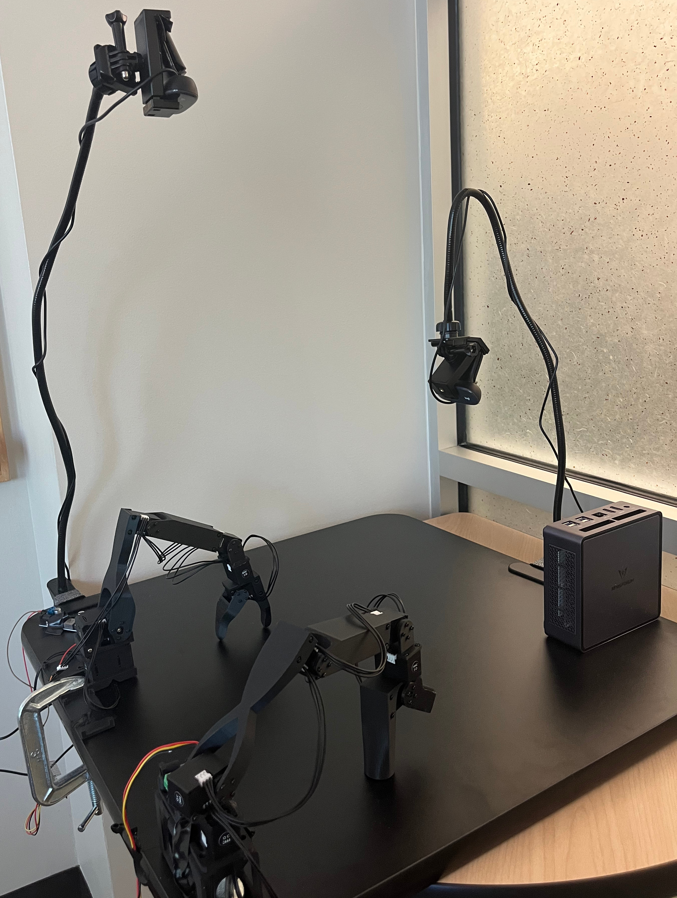

<!---
Copyright (c) 2025 Advanced Micro Devices, Inc. (AMD)

Permission is hereby granted, free of charge, to any person obtaining a copy
of this software and associated documentation files (the "Software"), to deal
in the Software without restriction, including without limitation the rights
to use, copy, modify, merge, publish, distribute, sublicense, and/or sell
copies of the Software, and to permit persons to whom the Software is
furnished to do so, subject to the following conditions:

The above copyright notice and this permission notice shall be included in all
copies or substantial portions of the Software.

THE SOFTWARE IS PROVIDED "AS IS", WITHOUT WARRANTY OF ANY KIND, EXPRESS OR
IMPLIED, INCLUDING BUT NOT LIMITED TO THE WARRANTIES OF MERCHANTABILITY,
FITNESS FOR A PARTICULAR PURPOSE AND NONINFRINGEMENT. IN NO EVENT SHALL THE
AUTHORS OR COPYRIGHT HOLDERS BE LIABLE FOR ANY CLAIM, DAMAGES OR OTHER
LIABILITY, WHETHER IN AN ACTION OF CONTRACT, TORT OR OTHERWISE, ARISING FROM,
OUT OF OR IN CONNECTION WITH THE SOFTWARE OR THE USE OR OTHER DEALINGS IN THE
SOFTWARE.
--->

# Fine-tuning Robotics Vision Language Action Models with AMD ROCm and LeRobot

This blog showcases training and deploying robotics policy models on AMD Instinct™ GPUs using ROCm with Hugging Face's [LeRobot framework](https://github.com/huggingface/lerobot). Recent advancements in Vision Language Action Models (VLAs) represent a breakthrough in robotics AI, combining computer vision, language understanding, and robotic control into unified architectures that can process visual observations, understand task descriptions, and generate precise motor commands.

LeRobot is Hugging Face's open-source robotics platform that provides state-of-the-art pre-trained models, datasets, and training pipelines for robotics research and development. With a rapidly growing community of developers, LeRobot democratizes access to advanced robotics AI by offering standardized tools for policy learning, making it easier to train robots on complex manipulation tasks.

Here, we provide a walkthrough of training a 3-billion-parameter [Pi0 policy](https://www.physicalintelligence.company/blog/pi0) model using AMD's ROCm platform, then deploying it for real-time robotic inference using open-source 3D printed [Koch robot arms](https://github.com/jess-moss/koch-v1-1) shown in Figure 1. We demonstrate how AMD's hardware ecosystem enables seamless scaling from data center training on AMD Instinct™ GPUs to edge deployment on Ryzen AI PCs, making advanced robotics AI accessible for both research and production environments.

## Our Robotics AI Pipeline: From Data Center to Desktop

Our setup trains a 3-billion-parameter Pi0 policy model on AMD Instinct GPUs, then deploys it for real-time inference on an AMD Phoenix AI PC. The demonstration uses dual Koch robotic arms in a leader-follower configuration with a dual camera system for visual observation.



Figure 1. Our robotics setup features dual Koch robotic arms with leader-follower configuration, dual camera system for visual observation, and AMD Phoenix AI PC for real-time inference

The pipeline leverages AMD's MI200 GPUs for model fine-tuning and the Phoenix AI PC's integrated GPU for deployment. We collect robotic trajectory data and fine-tune the Pi0 model using LeRobot's training framework.

### Teaching Robots to See and Act

Our demonstration centers around a simple yet illustrative task: pick up a block and place it inside a mug. Training data comes from two Logitech cameras capturing visual trajectories paired with the robotic joint positions. We vary the positions of both the mug and block during data collection to prevent overfitting to specific locations and improve policy generalization.

### Fine-Tuning vs. Training from Scratch

Training a large policy model from scratch requires large datasets to achieve reliable generalization. Instead, we fine-tune Pi0, a pre-trained foundational model that uses the Paligemma vision-language backbone. This architecture processes both visual observations and natural language task descriptions.

With just 50 trajectories of approximately 20 seconds each, we successfully adapt the large foundational model to our specific pick-and-place task. This approach demonstrates how pre-trained models can rapidly acquire new behaviors with minimal task-specific data.

### Training and Deployment Architecture

**Training Phase**: Model fine-tuning runs on [AMD AI & HPC Cluster](https://www.amd.com/en/corporate/university-program/ai-hpc-cluster.html) using MI200 GPUs with ROCm software stack.

**Deployment Phase**: The trained model runs on the Phoenix AI PC, providing real-time inference suitable for dynamic robotic applications.

This approach highlights a key advantage of AMD's ecosystem -- seamless scaling from powerful data center training to efficient edge deployment, enabling robotics applications that can train in the cloud and run anywhere.

# Tutorial: LeRobot Docker Setup and Execution

This section provides everything you need to set up and run LeRobot in a ROCm Docker container. We'll use the Ryzers framework to simplify building and running dockerfiles on Ryzen AI platforms.

## Prerequisites and Initial Setup

### 1. Install Ryzers Framework

First, clone and install the ryzers package:

```bash
git clone https://github.com/amdresearch/ryzers
pip install ryzers/
```

### 2. Configure Your Environment

Edit the lerobot package `config.yaml` with your specific setup details. For example:

```yaml
environment_variables:
- "HF_TOKEN=<your token here>"
- "MODEL_CKPT_PATH=<path to pretrained model>"
...
```

**Reference Guide:** [HuggingFace Imitation Learning on Real-World Robots](https://huggingface.co/docs/lerobot/il_robots)

To ensure consistent device recognition across Docker container restarts:

## Hardware Setup: USB-Serial Device Mapping

### Step 1: Identify Your Device Serial Numbers

```bash
ls -l /dev/serial/by-id/
```

Alternatively, you can automatically extract the serial numbers using this bash one-liner:

```bash
bash -c 'for tty in /dev/ttyACM*; do serial=$(udevadm info --name=$tty --query=property | grep ID_SERIAL_SHORT | cut -d= -f2); echo "$serial: $tty"; done'
```

### Step 2: Create Device Mapping Rules

Create `99-usb-serial.rules` with your specific serial numbers:

```ini
SUBSYSTEM=="tty", ATTRS{idVendor}=="2f5d", ATTRS{idProduct}=="2202", ATTRS{serial}=="<your-leader-serial>", SYMLINK+="ttyACM_kochleader"
SUBSYSTEM=="tty", ATTRS{idVendor}=="2f5d", ATTRS{idProduct}=="2202", ATTRS{serial}=="<your-follower-serial>", SYMLINK+="ttyACM_kochfollower"
```

Replace `<your-leader-serial>` and `<your-follower-serial>` with the actual values from Step 1.

### Step 3: Apply the Rules

```bash
sudo cp 99-usb-serial.rules /etc/udev/rules.d/
sudo udevadm control --reload-rules
sudo udevadm trigger
```

Verify the mapping worked:

```bash
ls -l /dev/ttyACM_*
```

## Docker Container Setup

Build and launch the ROCm-enabled Docker container:

```bash
ryzers build lerobot
ryzers run bash
```

Inside the container, all your configured cameras, model files, and USB-serial ports will be mounted as specified in your `config.yaml`.

## LeRobot Workflow

### Phase 1: Data Collection

Record demonstration trajectories for your robot to learn from:

```bash
python -m lerobot.record \
    --robot.type=koch_follower \
    --robot.port=/dev/ttyACM_kochfollower \
    --robot.id=my_awesome_follower_arm \
    --robot.cameras="{ top: {type: opencv, index_or_path: ${VIDEO_PATH_1}, width: 640, height: 480, fps: 15}, side: {type: opencv, index_or_path: ${VIDEO_PATH_2}, width: 640, height: 480, fps: 15}}" \
    --teleop.type=koch_leader \
    --teleop.port=/dev/ttyACM_kochleader \
    --teleop.id=my_awesome_leader_arm \
    --display_data=false \
    --dataset.repo_id=${HF_USER}/name_of_dataset \
    --dataset.num_episodes=50 \
    --dataset.single_task="Pick up the green block and place it in the mug" \
    --dataset.reset_time_s=5 \
    --dataset.episode_time_s=20 \
    --dataset.fps=15
```

**Key Parameters:**

- `num_episodes=50`: Collect 50 demonstration trajectories (adjust based on task complexity)
- `episode_time_s=20`: Each demonstration lasts 20 seconds
- `reset_time_s=5`: Time between episodes to reset the environment

### Phase 2: Policy Training

Train your robot's policy using the collected data:

```bash
python lerobot/scripts/train.py \
    --dataset.repo_id=${HF_USER}/name_of_dataset \
    --policy.path=lerobot/pi0 \
    --output_dir=outputs/train/pi0_policy \
    --job_name=pi0_policy \
    --policy.device=cuda \
    --wandb.enable=false
```

**Training Notes:**

- We run the training scripts on the [AMD AI & HPC Cluster](https://www.amd.com/en/corporate/university-program/ai-hpc-cluster.html).
- A helper script to set up your LeRobot environment on the cluster can be found on the [Ryzers github repository](https://github.com/AMDResearch/Ryzers/blob/main/packages/robotics/lerobot/hpc_cluster_setup.sh).
- Model checkpoints are saved to `outputs/train/pi0_policy/`

### Phase 3: Deployment and Inference

Deploy your trained policy for real-time robot control:

```bash
python -m lerobot.record \
    --robot.type=koch_follower \
    --robot.port=/dev/ttyACM_kochfollower \
    --robot.id=my_awesome_follower_arm \
    --robot.cameras="{ top: {type: opencv, index_or_path: ${VIDEO_PATH_1}, width: 640, height: 480, fps: 15}, side: {type: opencv, index_or_path: ${VIDEO_PATH_2}, width: 640, height: 480, fps: 15}}" \
    --teleop.type=koch_leader \
    --teleop.port=/dev/ttyACM_kochleader \
    --teleop.id=my_awesome_leader_arm \
    --dataset.repo_id=${HF_USER}/pick_and_place_dataset \
    --dataset.single_task="${DEPLOYMENT_TASK}" \
    --policy.path=${MODEL_CHECKPOINT_PATH} \
    --play_sounds=false
```

The robot will now autonomously perform the pick-and-place task using your trained policy! Figure 2 below shows a rollout of the fine-tuned Pi0 policy deployed on the AI PC.

```{video} videos/pick_and_place.mp4
:width: 852
:height: 480
:controls:
```

Figure 2. The policy autonomously identifies the cube, picks it up and places it into the cup.

## Summary

This tutorial demonstrated the complete workflow of training and deploying VLAs for robotics using AMD's ROCm software and Hugging Face's LeRobot framework. We successfully fine-tuned a 3-billion-parameter Pi0 policy model on AMD Instinct™ GPUs, then deployed it for real-time robotic inference on an AMD Ryzen AI PC. The demonstration showcased how just 50 trajectories can effectively adapt a pre-trained foundational model to perform pick-and-place tasks with dual Koch robotic arms.

The integration of LeRobot's standardized tools with AMD's ROCm software creates a robust foundation for robotics research and development. By leveraging the Ryzers framework and ROCm Docker containers, this approach enables seamless scaling from powerful data center training to efficient edge deployment, democratizing access to advanced robotics AI across research and production environments.

We encourage you to get started with LeRobot and AMD ROCm today - building smarter, scalable, real-time robotics AI systems. Explore the examples on the [LeRobot GitHub](https://github.com/huggingface/lerobot/tree/main/examples), take a look into [Ryzers](https://github.com/AMDResearch/Ryzers) on how to enable it all with ROCm and check this space for future blogs and updates!

## Disclaimers

Third-party content is licensed to you directly by the third party that owns the
content and is not licensed to you by AMD. ALL LINKED THIRD-PARTY CONTENT IS
PROVIDED “AS IS” WITHOUT A WARRANTY OF ANY KIND. USE OF SUCH THIRD-PARTY CONTENT
IS DONE AT YOUR SOLE DISCRETION AND UNDER NO CIRCUMSTANCES WILL AMD BE LIABLE TO
YOU FOR ANY THIRD-PARTY CONTENT. YOU ASSUME ALL RISK AND ARE SOLELY RESPONSIBLE
FOR ANY DAMAGES THAT MAY ARISE FROM YOUR USE OF THIRD-PARTY CONTENT.
