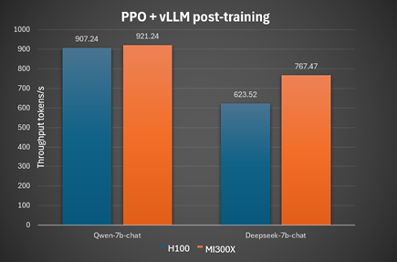
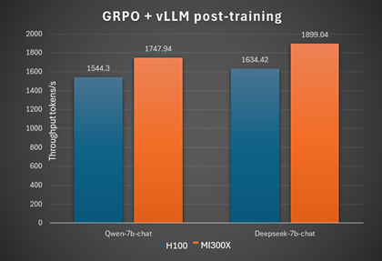

<!---
Copyright (c) 2025 Advanced Micro Devices, Inc. (AMD)

Permission is hereby granted, free of charge, to any person obtaining a copy
of this software and associated documentation files (the "Software"), to deal
in the Software without restriction, including without limitation the rights
to use, copy, modify, merge, publish, distribute, sublicense, and/or sell
copies of the Software, and to permit persons to whom the Software is
furnished to do so, subject to the following conditions:

The above copyright notice and this permission notice shall be included in all
copies or substantial portions of the Software.

THE SOFTWARE IS PROVIDED "AS IS", WITHOUT WARRANTY OF ANY KIND, EXPRESS OR
IMPLIED, INCLUDING BUT NOT LIMITED TO THE WARRANTIES OF MERCHANTABILITY,
FITNESS FOR A PARTICULAR PURPOSE AND NONINFRINGEMENT. IN NO EVENT SHALL THE
AUTHORS OR COPYRIGHT HOLDERS BE LIABLE FOR ANY CLAIM, DAMAGES OR OTHER
LIABILITY, WHETHER IN AN ACTION OF CONTRACT, TORT OR OTHERWISE, ARISING FROM,
OUT OF OR IN CONNECTION WITH THE SOFTWARE OR THE USE OR OTHER DEALINGS IN THE
SOFTWARE.
--->

# Exploring Use Cases for Scalable AI: Implementing Ray with ROCm Support for Efficient ML Workflows

In this blog, you will learn how to use Ray to easily scale your AI applications from your laptop to multiple AMD GPUs.

[Ray](https://github.com/ray-project/ray/) on ROCm provides a powerful platform for scaling AI applications, particularly for training and inference workloads. Ray handles the distributed computing aspects, while ROCm optimizes performance on AMD GPUs. This combination is used in various scenarios, including large language model (LLM) training and inference, distributed training of other models, and model serving.

## Ray Overview

### Ray Core

Ray implements a general purpose, universal framework for distributed computing. This framework provides low-level primitives such as tasks and actors with which you can build your pipelines for specific workloads. The idea is to abstract away the complexity of distributed computing through these primitives.

### ML Library Ecosystem

Because Ray is a general-purpose framework, the community has built many libraries and frameworks on top of it to accomplish different tasks.

* `RayTune` - a Python library for experiment execution and hyperparameter tuning at any scale
* `RayData` - a scalable data processing library for ML and AI workloads built on Ray
* `RayTrain` - a scalable machine learning library for distributed training and fine-tuning
* `RayServe` - a library for easy-to-use scalable model serving
* `RLlib` - a library for reinforcement learning that offers both high scalability and a unified API for a variety of applications

## Use Cases

Ray can be applied to many use cases for scaling ML applications, such as:

* LLMs and Generative AI​
* Batch inference​
* Model serving​
* Hyperparameter tuning​
* Distributed training​
* Reinforcement learning​
* ML platform​
* End-to-end ML workflows​
* Large-scale workload orchestration​

Refer to the [Ray documentation](https://docs.ray.io/en/latest/ray-overview/use-cases.html) for
detailed tutorials on these use cases using AMD GPUs and ROCm.

## Installing Ray with ROCm Support

You can install Ray with ROCm support on a single node.

### Prerequisites

* A node with [ROCm-supported]( https://rocm.docs.amd.com/projects/install-on-linux/en/latest/reference/system-requirements.html) AMD GPUs
* A supported [Linux distribution](https://rocm.docs.amd.com/projects/install-on-linux/en/latest/reference/system-requirements.html#supported-operating-systems)
* A ROCm [installation](https://rocm.docs.amd.com/projects/install-on-linux/en/latest/tutorial/quick-start.html)

### Setup

The ROCm Ray team provides prebuilt Docker images, which are the simplest way to use Ray on ROCm.
See the [ROCm installation guide](https://rocm.docs.amd.com/projects/install-on-linux/en/latest/install/3rd-party/ray-install.html) to install Ray.

### ROCm Ray

* [Installation](https://rocm.docs.amd.com/projects/install-on-linux/en/latest/install/3rd-party/ray-install.html)

* [Docker image](https://hub.docker.com/r/rocm/ray/tags)

* [GitHub](https://github.com/ROCm/ray)

## Examples

Basic use cases:

* [Use Ray Train to fine-tune a transformer model](#use-ray-train-to-fine-tune-a-transformer-model)
* [Convert an LLM model into a Ray Serve application](#convert-an-llm-model-into-a-ray-serve-application)
* [Use Ray Serve to serve a Stable Diffusion model](#use-ray-serve-to-serve-a-stable-diffusion-model)
* [Use Ray Tune to tune an XGBoost classifier](#use-ray-tune-to-tune-an-xgboost-classifier)

Advanced use cases:

* [Running vLLM Inference Server locally on a single node using Ray backend](#running-vllm-inference-server-locally-on-a-single-node-using-ray-backend)
* [Reinforcement Learning with Human Feedback with verl](#reinforcement-learning-with-human-feedback-with-verl)

### Use Ray Train to Fine-Tune a Transformer Model

Ray Train is a library within the broader Ray ecosystem that simplifies distributed machine learning model training and fine-tuning. It builds upon Ray's core functionalities to enable scaling of training workloads across multiple machines and GPUs with minimal code changes.

The following example demonstrates how to control the degree of parallelism in your distributed training process using ScalingConfig in the RayTrain API.

1. Install dependencies:

```bash
pip install evaluate==0.4.3 \
    transformers==4.39.3 \
    accelerate==0.28.0

```

2. Download the script
[```transformers_torch_trainer_basic.py```](https://github.com/ROCm/ray/blob/005c372262e050d5745f475e22e64305fa07f8b8/python/ray/train/examples/transformers/transformers_torch_trainer_basic.py), which uses the Ray Train library to scale the fine-tuning of a
[BERT base model](https://huggingface.co/google-bert/bert-base-cased) using the
[Yelp review dataset](https://huggingface.co/datasets/yelp_review_full) on Hugging Face.

**Tip:**
You can quickly download this script using `curl`:

```bash
curl https://raw.githubusercontent.com/ROCm/ray/005c372262e050d5745f475e22e64305fa07f8b8/python/ray/train/examples/transformers/transformers_torch_trainer_basic.py > transformers_torch_trainer_basic.py

```

3. Use two GPUs to tune the model by setting `num_workers=2` in the last part of the
`transformers_torch_trainer_basic.py` script:

```python
# [4] Build a Ray TorchTrainer to launch `train_func` on all workers
# ==================================================================
trainer = TorchTrainer(
    train_func, scaling_config=ScalingConfig(num_workers=2, use_gpu=True)
)

trainer.fit()
```

4. Run the script:

```bash
python transformers_torch_trainer_basic.py
```

5. Check the output. It should look like the following:

```bash
Usage stats collection is enabled by default for nightly wheels. To disable this, run the following command: `ray disable-usage-stats` before starting Ray. See https://docs.ray.io/en/master/cluster/usage-stats.html for more details.
2025-07-23 22:04:48,594 INFO worker.py:1918 -- Started a local Ray instance. View the dashboard at http://127.0.0.1:8265
2025-07-23 22:04:50,127 INFO tune.py:253 -- Initializing Ray automatically. For cluster usage or custom Ray initialization, call `ray.init(...)` before `<FrameworkTrainer>(...)`.

View detailed results here: /root/ray_results/TorchTrainer_2025-07-23_22-04-45
To visualize your results with TensorBoard, run: `tensorboard --logdir /tmp/ray/session_2025-07-23_22-04-45_555158_46/artifacts/2025-07-23_22-04-50/TorchTrainer_2025-07-23_22-04-45/driver_artifacts`
(TrainTrainable pid=8532) /opt/conda/envs/py_3.12/lib/python3.12/site-packages/redis/connection.py:77: UserWarning: redis-py works best with hiredis. Please consider installing
(TrainTrainable pid=8532)   warnings.warn(msg)

Training started without custom configuration.
(TorchTrainer pid=8532) Started distributed worker processes:
(TorchTrainer pid=8532) - (node_id=d742c37225bb169804d405f3e2cb3911769597865fb1a40ceb565e13, ip=10.216.56.85, pid=8809) world_rank=0, local_rank=0, node_rank=0
(TorchTrainer pid=8532) - (node_id=d742c37225bb169804d405f3e2cb3911769597865fb1a40ceb565e13, ip=10.216.56.85, pid=8808) world_rank=1, local_rank=1, node_rank=0
(RayTrainWorker pid=8809) Setting up process group for: env:// [rank=0, world_size=2]
(RayTrainWorker pid=8808) /opt/conda/envs/py_3.12/lib/python3.12/site-packages/redis/connection.py:77: UserWarning: redis-py works best with hiredis. Please consider installing
(RayTrainWorker pid=8808)   warnings.warn(msg)
Generating train split:   0%|          | 0/650000 [00:00<?, ? examples/s]
(RayTrainWorker pid=8809) /opt/conda/envs/py_3.12/lib/python3.12/site-packages/redis/connection.py:77: UserWarning: redis-py works best with hiredis. Please consider installing
(RayTrainWorker pid=8809)   warnings.warn(msg)
Generating train split:   6%|▋         | 41000/650000 [00:00<00:01, 403001.69 examples/s]
Generating train split:  15%|█▌        | 99000/650000 [00:00<00:01, 500081.49 examples/s]
Generating train split:  24%|██▍       | 156000/650000 [00:00<00:00, 525934.39 examples/s]
Generating train split:  33%|███▎      | 213000/650000 [00:00<00:00, 541390.16 examples/s]
Generating train split:  41%|████      | 268000/650000 [00:00<00:00, 542596.41 examples/s]
Generating train split:  54%|█████▍    | 353000/650000 [00:00<00:00, 545532.80 examples/s]
Generating train split:  67%|██████▋   | 436000/650000 [00:00<00:00, 535642.57 examples/s]
Generating train split:  76%|███████▋  | 496000/650000 [00:00<00:00, 550452.94 examples/s]
Generating train split:  89%|████████▉ | 580000/650000 [00:01<00:00, 540641.17 examples/s]
Generating train split: 100%|██████████| 650000/650000 [00:01<00:00, 539740.46 examples/s]
Generating test split:   0%|          | 0/50000 [00:00<?, ? examples/s]
(RayTrainWorker pid=8808) /opt/conda/envs/py_3.12/lib/python3.12/site-packages/huggingface_hub/file_download.py:943: FutureWarning: `resume_download` is deprecated and will be removed in version 1.0.0. Downloads always resume when possible. If you want to force a new download, use `force_download=True`.
(RayTrainWorker pid=8808)   warnings.warn(
Generating test split: 100%|██████████| 50000/50000 [00:00<00:00, 517120.71 examples/s]
Map:   0%|          | 0/650000 [00:00<?, ? examples/s]
Map:   0%|          | 1000/650000 [00:00<03:43, 2897.80 examples/s]

...
...
...

(RayTrainWorker pid=8809) :02<00:00, 22.74it/s]
(RayTrainWorker pid=8809) :02<00:00, 22.76it/s]
(RayTrainWorker pid=8809) :02<00:00, 22.85it/s]
(RayTrainWorker pid=8809) {'eval_loss': 0.9650349020957947, 'eval_accuracy': 0.607, 'eval_runtime': 2.9824, 'eval_samples_per_second': 335.297, 'eval_steps_per_second': 21.124, 'epoch': 3.0}
(RayTrainWorker pid=8809) {'train_runtime': 37.1186, 'train_samples_per_second': 80.822, 'train_steps_per_second': 5.092, 'train_loss': 1.0406386763961226, 'epoch': 3.0}
100%|██████████| 189/189 [00:37<00:00,  5.09it/s]

Training completed after 0 iterations at 2025-07-23 22:09:10. Total running time: 4min 20s
2025-07-23 22:09:10,360 INFO tune.py:1009 -- Wrote the latest version of all result files and experiment state to '/root/ray_results/TorchTrainer_2025-07-23_22-04-45' in 0.0069s.

```

**Result:** With two GPUs, `training_runtime` took 37.12s and `eval_runtime` took 2.98s.

6. Run the same job with four GPUs (assuming you have at least four GPUs in your system). Do this by changing `num_workers`
from `2` to `4`:

```python
# [4] Build a Ray TorchTrainer to launch `train_func` on all workers
# ==================================================================
trainer = TorchTrainer(
    train_func, scaling_config=ScalingConfig(num_workers=4, use_gpu=True)
)

trainer.fit()
```

7. Running the script again should produce the following output:

```text
Usage stats collection is enabled by default for nightly wheels. To disable this, run the following command: `ray disable-usage-stats` before starting Ray. See https://docs.ray.io/en/master/cluster/usage-stats.html for more details.
2025-07-23 22:27:59,708 INFO worker.py:1918 -- Started a local Ray instance. View the dashboard at http://127.0.0.1:8265
2025-07-23 22:28:01,278 INFO tune.py:253 -- Initializing Ray automatically. For cluster usage or custom Ray initialization, call `ray.init(...)` before `<FrameworkTrainer>(...)`.

View detailed results here: /root/ray_results/TorchTrainer_2025-07-23_22-27-56
To visualize your results with TensorBoard, run: `tensorboard --logdir /tmp/ray/session_2025-07-23_22-27-56_756496_26903/artifacts/2025-07-23_22-28-01/TorchTrainer_2025-07-23_22-27-56/driver_artifacts`
(TrainTrainable pid=35389) /opt/conda/envs/py_3.12/lib/python3.12/site-packages/redis/connection.py:77: UserWarning: redis-py works best with hiredis. Please consider installing
(TrainTrainable pid=35389)   warnings.warn(msg)

Training started without custom configuration.
(RayTrainWorker pid=35667) Setting up process group for: env:// [rank=0, world_size=4]
(TorchTrainer pid=35389) Started distributed worker processes:
(TorchTrainer pid=35389) - (node_id=867e63f55d7ca965bb1f63e999182d669b0e2b4f78bf17ca524620d2, ip=10.216.56.85, pid=35667) world_rank=0, local_rank=0, node_rank=0
(TorchTrainer pid=35389) - (node_id=867e63f55d7ca965bb1f63e999182d669b0e2b4f78bf17ca524620d2, ip=10.216.56.85, pid=35665) world_rank=1, local_rank=1, node_rank=0
(TorchTrainer pid=35389) - (node_id=867e63f55d7ca965bb1f63e999182d669b0e2b4f78bf17ca524620d2, ip=10.216.56.85, pid=35668) world_rank=2, local_rank=2, node_rank=0
(TorchTrainer pid=35389) - (node_id=867e63f55d7ca965bb1f63e999182d669b0e2b4f78bf17ca524620d2, ip=10.216.56.85, pid=35666) world_rank=3, local_rank=3, node_rank=0
(RayTrainWorker pid=35666) /opt/conda/envs/py_3.12/lib/python3.12/site-packages/redis/connection.py:77: UserWarning: redis-py works best with hiredis. Please consider installing
(RayTrainWorker pid=35666)   warnings.warn(msg)
(RayTrainWorker pid=35666) /opt/conda/envs/py_3.12/lib/python3.12/site-packages/huggingface_hub/file_download.py:943: FutureWarning: `resume_download` is deprecated and will be removed in version 1.0.0. Downloads always resume when possible. If you want to force a new download, use `force_download=True`.
(RayTrainWorker pid=35666)   warnings.warn(
(RayTrainWorker pid=35666) Some weights of BertForSequenceClassification were not initialized from the model checkpoint at bert-base-cased and are newly initialized: ['classifier.bias', 'classifier.weight']
(RayTrainWorker pid=35666) You should probably TRAIN this model on a down-stream task to be able to use it for predictions and inference.
(RayTrainWorker pid=35666) /opt/conda/envs/py_3.12/lib/python3.12/site-packages/accelerate/accelerator.py:432: FutureWarning: Passing the following arguments to `Accelerator` is deprecated and will be removed in version 1.0 of Accelerate: dict_keys(['dispatch_batches', 'split_batches', 'even_batches', 'use_seedable_sampler']). Please pass an `accelerate.DataLoaderConfiguration` instead:
(RayTrainWorker pid=35666) dataloader_config = DataLoaderConfiguration(dispatch_batches=None, split_batches=False, even_batches=True, use_seedable_sampler=True)
  0%|          | 0/96 [00:00<?, ?it/s]
(RayTrainWorker pid=35667) /opt/conda/envs/py_3.12/lib/python3.12/site-packages/redis/connection.py:77: UserWarning: redis-py works best with hiredis. Please consider installing [repeated 3x across cluster] (Ray deduplicates logs by default. Set RAY_DEDUP_LOGS=0 to disable log deduplication, or see https://docs.ray.io/en/master/ray-observability/user-guides/configure-logging.html#log-deduplication for more options.)
(RayTrainWorker pid=35667)   warnings.warn(msg) [repeated 3x across cluster]
(RayTrainWorker pid=35666) [rank3]:[W723 22:28:28.456078994 reducer.cpp:1400] Warning: find_unused_parameters=True was specified in DDP constructor, but did not find any unused parameters in the forward pass. This flag results in an extra traversal of the autograd graph every iteration,  which can adversely affect performance. If your model indeed never has any unused parameters in the forward pass, consider turning this flag off. Note that this warning may be a false positive if your model has flow control causing later iterations to have unused parameters. (function operator())
  1%|          | 1/96 [00:01<02:18,  1.46s/it]
  2%|▏         | 2/96 [00:01<01:03,  1.47it/s]
  3%|▎         | 3/96 [00:01<00:40,  2.30it/s]
...
...
...

(RayTrainWorker pid=35667) 01<00:00, 22.24it/s]
(RayTrainWorker pid=35667) {'eval_loss': 0.9487817287445068, 'eval_accuracy': 0.604, 'eval_runtime': 1.6314, 'eval_samples_per_second': 612.975, 'eval_steps_per_second': 19.615, 'epoch': 3.0}
100%|██████████| 96/96 [00:20<00:00,  7.01it/s]
(RayTrainWorker pid=35667) {'train_runtime': 20.471, 'train_samples_per_second': 146.549, 'train_steps_per_second': 4.69, 'train_loss': 1.1036946773529053, 'epoch': 3.0}
100%|██████████| 96/96 [00:20<00:00,  4.64it/s]

Training completed after 0 iterations at 2025-07-23 22:28:49. Total running time: 48s
2025-07-23 22:28:49,469 INFO tune.py:1009 -- Wrote the latest version of all result files and experiment state to '/root/ray_results/TorchTrainer_2025-07-23_22-27-56' in 0.0037s.

```

**Result:** With the two additional GPUs, `training_runtime` took 20.47s and `eval_runtime` took 1.6s. Using Ray, scaling a job with
additional resources is as simple as changing one parameter in your code.

**Note:** The total running time includes overhead such as downloading data. As you increase the number of epochs, the proportion of time spent on this overhead should decrease significantly. You can increase the number of epochs by setting the `num_train_epochs` argument for the transformers TrainingArguments in the
`transformers_torch_trainer_basic.py` script:

```python
    # Hugging Face Trainer
    training_args = TrainingArguments(
        output_dir="test_trainer", evaluation_strategy="epoch", report_to="none", num_train_epochs=10
    )

```

### Convert an LLM into a Ray Serve Application

You can develop a Ray Serve application locally and deploy it in production on a cluster of AMD GPUs
using just a few lines of code. Find detailed instructions on the official
[Ray documentation page](https://docs.ray.io/en/latest/serve/develop-and-deploy.html).

1. English-to-French translation is an example for deploying an ML application. First, create
the Python script, `RayServe_En2Fr_translation_local.py`, based on the script `model.py` from the
[Ray documentation page](https://docs.ray.io/en/latest/serve/develop-and-deploy.html), which can be used to translate English text to French.

```python
# File name: RayServe_En2Fr_translation_local.py
from transformers import pipeline

class Translator:
    def __init__(self):
        # Load model
        self.model = pipeline("translation_en_to_fr", model="t5-small")

    def translate(self, text: str) -> str:
        # Run inference
        model_output = self.model(text)

        # Post-process output to return only the translation text
        translation = model_output[0]["translation_text"]

        return translation

translator = Translator()

translation = translator.translate("Hello world!")
print(translation)
```

2. Test this script by running it locally:

```bash
python RayServe_En2Fr_translation_local.py
```

3. The output can be expected as follows:

```bash
config.json: 100%|███████████████████████████████████████████████████████████████████████████████████████████████████████████████████████████████████| 1.21k/1.21k [00:00<00:00, 612kB/s]
model.safetensors: 100%|███████████████████████████████████████████████████████████████████████████████████████████████████████████████████████████████| 242M/242M [00:02<00:00, 115MB/s]
generation_config.json: 100%|███████████████████████████████████████████████████████████████████████████████████████████████████████████████████████████| 147/147 [00:00<00:00, 93.6kB/s]
tokenizer_config.json: 100%|████████████████████████████████████████████████████████████████████████████████████████████████████████████████████████| 2.32k/2.32k [00:00<00:00, 2.76MB/s]
spiece.model: 100%|███████████████████████████████████████████████████████████████████████████████████████████████████████████████████████████████████| 792k/792k [00:00<00:00, 11.7MB/s]
tokenizer.json: 100%|███████████████████████████████████████████████████████████████████████████████████████████████████████████████████████████████| 1.39M/1.39M [00:00<00:00, 5.76MB/s]
Bonjour monde!
```

4. Next, convert this script into `RayServe_En2Fr_translation.py`, which supports a Ray Serve
application with [FastAPI](https://docs.ray.io/en/latest/serve/http-guide.html#serve-set-up-fastapi-http) based on the instructions on the [Ray documentation page](https://docs.ray.io/en/latest/serve/develop-and-deploy.html).

```python
# File name: RayServe_En2Fr_translation.py
import ray
from ray import serve
from fastapi import FastAPI

from transformers import pipeline

app = FastAPI()


@serve.deployment(num_replicas=2, ray_actor_options={"num_cpus": 0.2, "num_gpus": 0})
@serve.ingress(app)
class Translator:
    def __init__(self):
        # Load model
        self.model = pipeline("translation_en_to_fr", model="t5-small")

    @app.post("/")
    def translate(self, text: str) -> str:
        # Run inference
        model_output = self.model(text)

        # Post-process output to return only the translation text
        translation = model_output[0]["translation_text"]

        return translation


translator_app = Translator.bind()
#from ray.serve.config import HTTPOptions
#serve.start(http_options=HTTPOptions(host="0.0.0.0", port=8123))
```

5. Set the `translator_app` application in the background to serve an LLM model that translates
English to French. Run the script with the `serve run` CLI command, which takes in an import path
formatted as `<module>:<application>`.

**Notes:** By default, Ray Serve deployments' HTTP proxies listen on port 8000. You can customize these ports
using the http_options by uncommenting the last two lines in the code block above and modifying the
port number.

6. Run the command from a directory that contains a local copy of the `RayServe_En2Fr_translation.py`,
script so it can import the application:

```bash
serve run RayServe_En2Fr_translation:translator_app &
```

7. The expected output is as follows:

```text
2025-07-23 22:56:32,064 INFO scripts.py:507 -- Running import path: 'RayServe_En2Fr_translation:translator_app'.
/opt/conda/envs/py_3.12/lib/python3.12/site-packages/redis/connection.py:77: UserWarning: redis-py works best with hiredis. Please consider installing
  warnings.warn(msg)
Usage stats collection is enabled by default for nightly wheels. To disable this, run the following command: `ray disable-usage-stats` before starting Ray. See https://docs.ray.io/en/master/cluster/usage-stats.html for more details.
2025-07-23 22:56:46,983 INFO worker.py:1918 -- Started a local Ray instance. View the dashboard at http://127.0.0.1:8265
(ProxyActor pid=63141) INFO 2025-07-23 22:56:50,091 proxy 10.216.56.85 -- Proxy starting on node c0d9d67b21c1b69a416133d073921bcdbc235c5f3e2ae8e400f2b4d4 (HTTP port: 8123).
INFO 2025-07-23 22:56:50,162 serve 62151 -- Started Serve in namespace "serve".
INFO 2025-07-23 22:56:50,164 serve 62151 -- Connecting to existing Serve app in namespace "serve". New http options will not be applied.
WARNING 2025-07-23 22:56:50,164 serve 62151 -- The new client HTTP config differs from the existing one in the following fields: ['host', 'port', 'location']. The new HTTP config is ignored.
INFO 2025-07-23 22:56:50,178 serve 62151 -- Connecting to existing Serve app in namespace "serve". New http options will not be applied.
WARNING 2025-07-23 22:56:50,178 serve 62151 -- The new client HTTP config differs from the existing one in the following fields: ['host', 'port', 'location']. The new HTTP config is ignored.
(ProxyActor pid=63141) INFO 2025-07-23 22:56:50,142 proxy 10.216.56.85 -- Got updated endpoints: {}.
(ServeController pid=63134) /opt/conda/envs/py_3.12/lib/python3.12/site-packages/redis/connection.py:77: UserWarning: redis-py works best with hiredis. Please consider installing
(ServeController pid=63134)   warnings.warn(msg)
(ServeController pid=63134) INFO 2025-07-23 22:56:54,014 controller 63134 -- Deploying new version of Deployment(name='Translator', app='default') (initial target replicas: 2).
(ProxyActor pid=63141) INFO 2025-07-23 22:56:54,028 proxy 10.216.56.85 -- Got updated endpoints: {Deployment(name='Translator', app='default'): EndpointInfo(route='/', app_is_cross_language=False)}.
(ProxyActor pid=63141) INFO 2025-07-23 22:56:54,039 proxy 10.216.56.85 -- Started <ray.serve._private.router.SharedRouterLongPollClient object at 0x7fcf15bc6960>.
(ServeController pid=63134) INFO 2025-07-23 22:56:54,129 controller 63134 -- Adding 2 replicas to Deployment(name='Translator', app='default').
(ServeReplica:default:Translator pid=63160) /opt/conda/envs/py_3.12/lib/python3.12/site-packages/huggingface_hub/file_download.py:943: FutureWarning: `resume_download` is deprecated and will be removed in version 1.0.0. Downloads always resume when possible. If you want to force a new download, use `force_download=True`.
(ServeReplica:default:Translator pid=63160)   warnings.warn(
(ServeReplica:default:Translator pid=63137) /opt/conda/envs/py_3.12/lib/python3.12/site-packages/redis/connection.py:77: UserWarning: redis-py works best with hiredis. Please consider installing [repeated 2x across cluster] (Ray deduplicates logs by default. Set RAY_DEDUP_LOGS=0 to disable log deduplication, or see https://docs.ray.io/en/master/ray-observability/user-guides/configure-logging.html#log-deduplication for more options.)
(ServeReplica:default:Translator pid=63137)   warnings.warn(msg) [repeated 2x across cluster]
INFO 2025-07-23 22:57:00,063 serve 62151 -- Application 'default' is ready at http://0.0.0.0:8000/.

```

8. After the server is set up in the cluster, test the application locally using the `model_client.py`
script from the
[Ray documentation page](https://docs.ray.io/en/latest/serve/develop-and-deploy.html), which is
renamed to `RayServe_En2Fr_tranlation_client.py`. It sends a `POST` request (in JSON) containing the
English text.

```python
# File name: RayServe_En2Fr_tranlation_client.py
import requests

response = requests.post("http://127.0.0.1:8000/", params={"text": "Hello world!"})
french_text = response.json()

print(french_text)
```

9. This client script requests a translation for the phrase “*Hello world!*”:

```bash
python RayServe_En2Fr_tranlation_client.py
```

10. The expected output is as follows:

```text
Bonjour monde!
(ServeReplica:default:Translator pid=50256) INFO 2025-07-23 22:51:55,908 default_Translator 3mbytkxd 539e6a57-3609-4178-b3c2-61fb5cc669f8 -- POST / 200 239.1ms

```

### Use Ray Serve to serve a Stable Diffusion model

Stable Diffusion is one of the most popular image generation models. It takes a text prompt and
generates an image according to the meaning of the prompt.

In this example, you can use Ray to stand up a server for a
[stabilityai/stable-diffusion-2-1-base](https://huggingface.co/stabilityai/stable-diffusion-2-1-base)
model with an API powered by [FastAPI](https://fastapi.tiangolo.com/).

1. To run this example, install the following:

```bash
pip install requests diffusers==0.25.0 transformers
```

2. Create a Python script with the `Serve` code per the
[Ray documentation](https://docs.ray.io/en/latest/serve/tutorials/stable-diffusion.html) and save it as
`RayServe_StableDiffusion.py`.

```python
# File name: RayServe_StableDiffusion.py
from io import BytesIO
from fastapi import FastAPI
from fastapi.responses import Response
import torch

from ray import serve
from ray.serve.handle import DeploymentHandle

app = FastAPI()

@serve.deployment(num_replicas=1)
@serve.ingress(app)
class APIIngress:
    def __init__(self, diffusion_model_handle: DeploymentHandle) -> None:
        self.handle = diffusion_model_handle

    @app.get(
        "/imagine",
        responses={200: {"content": {"image/png": {}}}},
        response_class=Response,
    )
    async def generate(self, prompt: str, img_size: int = 512):
        assert len(prompt), "prompt parameter cannot be empty"

        image = await self.handle.generate.remote(prompt, img_size=img_size)
        file_stream = BytesIO()
        image.save(file_stream, "PNG")
        return Response(content=file_stream.getvalue(), media_type="image/png")

@serve.deployment(
    ray_actor_options={"num_gpus": 1},
    autoscaling_config={"min_replicas": 0, "max_replicas": 2},
)
class StableDiffusionV2:
    def __init__(self):
        from diffusers import EulerDiscreteScheduler, StableDiffusionPipeline

        model_id = "stabilityai/stable-diffusion-2"

        scheduler = EulerDiscreteScheduler.from_pretrained(
            model_id, subfolder="scheduler"
        )
        self.pipe = StableDiffusionPipeline.from_pretrained(
            model_id, scheduler=scheduler, revision="fp16", torch_dtype=torch.float16
        )
        self.pipe = self.pipe.to("cuda")

    def generate(self, prompt: str, img_size: int = 512):
        assert len(prompt), "prompt parameter cannot be empty"

        with torch.autocast("cuda"):
            image = self.pipe(prompt, height=img_size, width=img_size).images[0]
            return image

entrypoint = APIIngress.bind(StableDiffusionV2.bind())
#from ray.serve.config import HTTPOptions
#serve.start(http_options=HTTPOptions(host="0.0.0.1", port=8123))

```

**Note:** By default, Ray Serve deployments' HTTP proxies listen on port 8000. You can customize
these ports using the http_options by uncommenting the last two lines in the code block
above and modifying the port number.

3. Start the Serve application with the following command:

```bash
serve run RayServe_StableDiffusion:entrypoint &
```

4. The expected output is as follows:

```text
2025-07-23 23:11:02,846  INFO scripts.py:507 -- Running import path: 'RayServe_StableDiffusion:entrypoint'.
Usage stats collection is enabled by default for nightly wheels. To disable this, run the following command: `ray disable-usage-stats` before starting Ray. See https://docs.ray.io/en/master/cluster/usage-stats.html for more details.
2025-07-23 23:11:15,549 INFO worker.py:1918 -- Started a local Ray instance. View the dashboard at http://127.0.0.1:8266
(ProxyActor pid=84596) INFO 2025-07-23 23:11:18,557 proxy 10.216.56.85 -- Proxy starting on node 30d5e0fc9352c6f7f02f45104c644af1b6ad68807f8ac39ba226511f (HTTP port: 8123).
(ProxyActor pid=84596) INFO 2025-07-23 23:11:18,603 proxy 10.216.56.85 -- Got updated endpoints: {}.
INFO 2025-07-23 23:11:18,624 serve 83678 -- Started Serve in namespace "serve".
INFO 2025-07-23 23:11:18,626 serve 83678 -- Connecting to existing Serve app in namespace "serve". New http options will not be applied.
WARNING 2025-07-23 23:11:18,626 serve 83678 -- The new client HTTP config differs from the existing one in the following fields: ['host', 'port', 'location']. The new HTTP config is ignored.
INFO 2025-07-23 23:11:18,637 serve 83678 -- Connecting to existing Serve app in namespace "serve". New http options will not be applied.
WARNING 2025-07-23 23:11:18,637 serve 83678 -- The new client HTTP config differs from the existing one in the following fields: ['host', 'port', 'location']. The new HTTP config is ignored.
(ServeController pid=84604) INFO 2025-07-23 23:11:20,675 controller 84604 -- Deploying new version of Deployment(name='StableDiffusionV2', app='default') (initial target replicas: 0).
(ServeController pid=84604) INFO 2025-07-23 23:11:20,678 controller 84604 -- Deploying new version of Deployment(name='APIIngress', app='default') (initial target replicas: 1).
(ProxyActor pid=84596) INFO 2025-07-23 23:11:20,698 proxy 10.216.56.85 -- Got updated endpoints: {Deployment(name='APIIngress', app='default'): EndpointInfo(route='/', app_is_cross_language=False)}.
(ProxyActor pid=84596) INFO 2025-07-23 23:11:20,710 proxy 10.216.56.85 -- Started <ray.serve._private.router.SharedRouterLongPollClient object at 0x7f4d3cb7e8d0>.
(ServeController pid=84604) INFO 2025-07-23 23:11:20,797 controller 84604 -- Adding 1 replica to Deployment(name='APIIngress', app='default').
INFO 2025-07-23 23:11:21,731 serve 83678 -- Application 'default' is ready at http://0.0.0.0:8000/.
```

5. Now, send requests to the server through the API. Create the script
`RayServe_StableDiffusion_client.py` using the client code from the
[Ray documentation](https://docs.ray.io/en/latest/serve/tutorials/stable-diffusion.html).

Remember to make sure the client is using an http proxy that matches the server.

```python
# File name: RayServe_StableDiffusion_client.py
import requests

prompt = "a cute cat is dancing on the grass."
input = "%20".join(prompt.split(" "))
resp = requests.get(f"http://127.0.0.0:8000/imagine?prompt={input}")
with open("output.png", 'wb') as f:
    f.write(resp.content)
```

6. Running the `RayServe_StableDiffusion_client.py` script sends a request to this application with prompt
"*a cute cat is dancing on the grass.*".

```bash
python RayServe_StableDiffusion_client.py
```

7. The generated image is saved locally as `output.png`. The expected output is as follows:

```text
(ServeController pid=170028) INFO 2025-07-23 23:38:18,570 controller 170028 -- Upscaling Deployment(name='StableDiffusionV2', app='default') from 0 to 1 replicas. Current ongoing requests: 1.00, current running replicas: 0.
(ServeController pid=170028) INFO 2025-07-23 23:38:18,571 controller 170028 -- Adding 1 replica to Deployment(name='StableDiffusionV2', app='default').
(ServeReplica:default:APIIngress pid=170025) INFO 2025-07-23 23:38:18,479 default_APIIngress urznrksp 38a5c649-c0e7-4d02-8d32-30520e19a37f -- Started <ray.serve._private.router.SharedRouterLongPollClient object at 0x7f5e304177a0>.
Fetching 11 files:   0%|          | 0/11 [00:00<?, ?it/s]
Fetching 11 files:  18%|█▊        | 2/11 [00:00<00:01,  7.89it/s]
(ServeController pid=170028) This may be caused by a slow __init__ or reconfigure method.
Fetching 11 files:  27%|██▋       | 3/11 [00:22<01:13,  9.17s/it]
(ServeController pid=170028) This may be caused by a slow __init__ or reconfigure method.
Fetching 11 files: 100%|██████████| 11/11 [00:51<00:00,  4.66s/it]
Loading pipeline components...:   0%|          | 0/5 [00:00<?, ?it/s]
Loading pipeline components...:  40%|████      | 2/5 [00:00<00:00,  6.69it/s]
Loading pipeline components...:  60%|██████    | 3/5 [00:00<00:00,  7.32it/s]
Loading pipeline components...: 100%|██████████| 5/5 [00:01<00:00,  4.71it/s]
  2%|▏         | 1/50 [00:12<09:59, 12.24s/it]0045)
  8%|▊         | 4/50 [00:12<01:48,  2.35s/it]0045)
 14%|█▍        | 7/50 [00:12<00:47,  1.12s/it]0045)
 20%|██        | 10/50 [00:12<00:26,  1.53it/s]045)
 26%|██▌       | 13/50 [00:12<00:15,  2.37it/s]045)
 32%|███▏      | 16/50 [00:12<00:09,  3.46it/s]045)
 38%|███▊      | 19/50 [00:13<00:06,  4.78it/s]045)
 44%|████▍     | 22/50 [00:13<00:04,  6.35it/s]045)
 50%|█████     | 25/50 [00:13<00:03,  8.07it/s]045)
 56%|█████▌    | 28/50 [00:13<00:02,  9.98it/s]045)
 62%|██████▏   | 31/50 [00:13<00:01, 12.02it/s]045)
 68%|██████▊   | 34/50 [00:13<00:01, 13.77it/s]045)
 74%|███████▍  | 37/50 [00:13<00:00, 15.54it/s]045)
 80%|████████  | 40/50 [00:14<00:00, 17.06it/s]045)
 86%|████████▌ | 43/50 [00:14<00:00, 18.39it/s]045)
 92%|█████████▏| 46/50 [00:14<00:00, 19.43it/s]045)
 98%|█████████▊| 49/50 [00:14<00:00, 19.94it/s]045)
100%|██████████| 50/50 [00:14<00:00,  3.43it/s]045)
(ServeReplica:default:StableDiffusionV2 pid=170045) INFO 2025-07-23 23:40:12,162 default_StableDiffusionV2 1n6rmhpg 38a5c649-c0e7-4d02-8d32-30520e19a37f -- CALL /imagine OK 47044.7ms
(py_3.12) root@hpe-hq-08:/app# (ServeReplica:default:APIIngress pid=170025) INFO 2025-07-23 23:40:12,286 default_APIIngress urznrksp 38a5c649-c0e7-4d02-8d32-30520e19a37f -- GET /imagine 200 113865.2ms

```

8. The generated image result:


### Use Ray Tune to tune an XGBoost classifier

In this section, you can use XGBoost to train an image classifier on Ray. XGBoost is an optimized library for
distributed gradient boosting. It has become the leading ML library for solving regression and
classification problems. For a deeper dive into how gradient boosting works, see
[Introduction to Boosted Trees](https://xgboost.readthedocs.io/en/stable/tutorials/model.html).

In the following example, the script,
[`xgboost_example.py`](https://github.com/ROCm/ray/blob/005c372262e050d5745f475e22e64305fa07f8b8/python/ray/tune/examples/xgboost_example.py),
trains an XGBoost image classifier to detect breast cancer. RayTune samples 10 different
hyperparameter settings and trains an XGBoost classifier on all of them. The `TrialScheduler` can stop
the low-performing trials early to reduce training time, thereby focusing all resources on the
high-performing trials. Refer to the official [Ray documentation](https://docs.ray.io/en/latest/tune/examples/tune-xgboost.html#tune-xgboost-ref) for details.

**Tip:**
You can quickly download this script using `curl`:

```bash
curl https://raw.githubusercontent.com/ROCm/ray/005c372262e050d5745f475e22e64305fa07f8b8/python/ray/tune/examples/xgboost_example.py > xgboost_example.py
```

1. Install `scikit-learn` and `xgboost`.  Then run the script.

```bash
pip install scikit-learn
pip install xgboost
python xgboost_example.py
```

```text
Usage stats collection is enabled by default for nightly wheels. To disable this, run the following command: `ray disable-usage-stats` before starting Ray. See https://docs.ray.io/en/master/cluster/usage-stats.html for more details.
2025-07-24 16:31:06,410 INFO worker.py:1918 -- Started a local Ray instance. View the dashboard at http://127.0.0.1:8265
2025-07-24 16:31:07,909 INFO tune.py:253 -- Initializing Ray automatically. For cluster usage or custom Ray initialization, call `ray.init(...)` before `Tuner(...)`.
(raylet) [2025-07-24 16:31:15,298 E 211570 211609] (raylet) file_system_monitor.cc:116: /tmp/ray/session_2025-07-24_16-31-02_581650_210716 is over 95% full, available space: 147.493 GB; capacity: 3519.75 GB. Object creation will fail if spilling is required.
╭────────────────────────────────────────────────────────────────────────────╮
│ Configuration for experiment     train_breast_cancer_2025-07-24_16-31-02   │
├────────────────────────────────────────────────────────────────────────────┤
│ Search algorithm                 BasicVariantGenerator                     │
│ Scheduler                        AsyncHyperBandScheduler                   │
│ Number of trials                 10                                        │
╰────────────────────────────────────────────────────────────────────────────╯

View detailed results here: /root/ray_results/train_breast_cancer_2025-07-24_16-31-02
To visualize your results with TensorBoard, run: `tensorboard --logdir /tmp/ray/session_2025-07-24_16-31-02_581650_210716/artifacts/2025-07-24_16-31-07/train_breast_cancer_2025-07-24_16-31-02/driver_artifacts`

Trial status: 10 PENDING
Current time: 2025-07-24 16:31:17. Total running time: 0s
Logical resource usage: 0/128 CPUs, 0/8 GPUs (0.0/1.0 accelerator_type:AMD-Instinct-MI210)
╭───────────────────────────────────────────────────────────────────────────────────────────────────────────╮
│ Trial name                        status       max_depth     min_child_weight     subsample           eta │
├───────────────────────────────────────────────────────────────────────────────────────────────────────────┤
│ train_breast_cancer_99e67_00000   PENDING              6                    3      0.530671   0.000480198 │
│ train_breast_cancer_99e67_00001   PENDING              1                    2      0.571782   0.0301512   │
│ train_breast_cancer_99e67_00002   PENDING              5                    2      0.682213   0.0305274   │
│ train_breast_cancer_99e67_00003   PENDING              8                    1      0.570001   0.000695486 │
│ train_breast_cancer_99e67_00004   PENDING              3                    2      0.543567   0.00283987  │
│ train_breast_cancer_99e67_00005   PENDING              2                    1      0.685371   0.000855609 │
│ train_breast_cancer_99e67_00006   PENDING              3                    3      0.525379   0.00036954  │
│ train_breast_cancer_99e67_00007   PENDING              6                    1      0.80657    0.00291612  │
│ train_breast_cancer_99e67_00008   PENDING              3                    2      0.849987   0.000423294 │
│ train_breast_cancer_99e67_00009   PENDING              3                    2      0.610417   0.000163777 │
╰───────────────────────────────────────────────────────────────────────────────────────────────────────────╯

Trial train_breast_cancer_99e67_00003 started with configuration:
╭───────────────────────────────────────────────────────────────────────╮
│ Trial train_breast_cancer_99e67_00003 config                          │
├───────────────────────────────────────────────────────────────────────┤
│ eta                                                            0.0007 │
│ eval_metric                                      ['logloss', 'error'] │
│ max_depth                                                           8 │
│ min_child_weight                                                    1 │
│ objective                                             binary:logistic │
│ subsample                                                        0.57 │
╰───────────────────────────────────────────────────────────────────────╯

...
...
...

Trial train_breast_cancer_99e67_00002 completed after 10 iterations at 2025-07-24 16:31:20. Total running time: 2s
╭────────────────────────────────────────────────────────────────────╮
│ Trial train_breast_cancer_99e67_00002 result                       │
├────────────────────────────────────────────────────────────────────┤
│ checkpoint_dir_name                              checkpoint_000009 │
│ time_this_iter_s                                            0.0032 │
│ time_total_s                                               0.05634 │
│ training_iteration                                              10 │
│ test-error                                                 0.15385 │
│ test-logloss                                               0.49217 │
╰────────────────────────────────────────────────────────────────────╯
2025-07-24 16:31:20,182 INFO tune.py:1009 -- Wrote the latest version of all result files and experiment state to '/root/ray_results/train_breast_cancer_2025-07-24_16-31-02' in 0.0174s.

Trial status: 10 TERMINATED
Current time: 2025-07-24 16:31:20. Total running time: 2s
Logical resource usage: 1.0/128 CPUs, 0/8 GPUs (0.0/1.0 accelerator_type:AMD-Instinct-MI210)
Current best trial: 99e67_00002 with test-logloss=0.4921707729776422 and params={'objective': 'binary:logistic', 'eval_metric': ['logloss', 'error'], 'max_depth': 5, 'min_child_weight': 2, 'subsample': 0.6822130444186709, 'eta': 0.03052738132685342}
╭─────────────────────────────────────────────────────────────────────────────────────────────────────────────────────────────────────────────────────────────────────────╮
│ Trial name                        status         max_depth     min_child_weight     subsample           eta     iter     total time (s)     test-logloss     test-error │
├─────────────────────────────────────────────────────────────────────────────────────────────────────────────────────────────────────────────────────────────────────────┤
│ train_breast_cancer_99e67_00000   TERMINATED             6                    3      0.530671   0.000480198        1          0.0274966         0.655429      0.363636  │
│ train_breast_cancer_99e67_00001   TERMINATED             1                    2      0.571782   0.0301512         10          0.0434215         0.503239      0.0979021 │
│ train_breast_cancer_99e67_00002   TERMINATED             5                    2      0.682213   0.0305274         10          0.0563407         0.492171      0.153846  │
│ train_breast_cancer_99e67_00003   TERMINATED             8                    1      0.570001   0.000695486        2          0.0268509         0.658373      0.370629  │
│ train_breast_cancer_99e67_00004   TERMINATED             3                    2      0.543567   0.00283987         1          0.0258057         0.657068      0.370629  │
│ train_breast_cancer_99e67_00005   TERMINATED             2                    1      0.685371   0.000855609        1          0.0207179         0.651812      0.356643  │
│ train_breast_cancer_99e67_00006   TERMINATED             3                    3      0.525379   0.00036954         1          0.0192504         0.670571      0.391608  │
│ train_breast_cancer_99e67_00007   TERMINATED             6                    1      0.80657    0.00291612         4          0.037945          0.629262      0.321678  │
│ train_breast_cancer_99e67_00008   TERMINATED             3                    2      0.849987   0.000423294        2          0.030371          0.635063      0.314685  │
│ train_breast_cancer_99e67_00009   TERMINATED             3                    2      0.610417   0.000163777        2          0.0267315         0.640411      0.328671  │
╰─────────────────────────────────────────────────────────────────────────────────────────────────────────────────────────────────────────────────────────────────────────╯

Best model parameters: {'objective': 'binary:logistic', 'eval_metric': ['logloss', 'error'], 'max_depth': 5, 'min_child_weight': 2, 'subsample': 0.6822130444186709, 'eta': 0.03052738132685342}
Best model total accuracy: 0.8462
(train_breast_cancer pid=219622) /opt/conda/envs/py_3.12/lib/python3.12/site-packages/ray/train/context.py:131: RayDeprecationWarning: `ray.train.get_context()` should be switched to `ray.tune.get_context()` when running in a function passed to Ray Tune. This will be an error in the future. See this issue for more context and migration options: https://github.com/ray-project/ray/issues/49454. Disable these warnings by setting the environment variable: RAY_TRAIN_ENABLE_V2_MIGRATION_WARNINGS=0 [repeated 9x across cluster] (Ray deduplicates logs by default. Set RAY_DEDUP_LOGS=0 to disable log deduplication, or see https://docs.ray.io/en/master/ray-observability/user-guides/configure-logging.html#log-deduplication for more options.)
(train_breast_cancer pid=219622)   _log_deprecation_warning( [repeated 27x across cluster]
(train_breast_cancer pid=219622) /opt/conda/envs/py_3.12/lib/python3.12/site-packages/ray/train/xgboost/_xgboost_utils.py:170: RayDeprecationWarning: This API is deprecated and may be removed in future Ray releases. You could suppress this warning by setting env variable PYTHONWARNINGS="ignore::DeprecationWarning" [repeated 9x across cluster]
(train_breast_cancer pid=219622) `get_world_rank` is deprecated for Ray Tune because there is no concept of worker ranks for Ray Tune, so these methods only make sense to use in the context of a Ray Train worker. See this issue for more context and migration options: https://github.com/ray-project/ray/issues/49454. Disable these warnings by setting the environment variable: RAY_TRAIN_ENABLE_V2_MIGRATION_WARNINGS=0 [repeated 9x across cluster]
(train_breast_cancer pid=219622)   if ray.train.get_context().get_world_rank() in (0, None): [repeated 9x across cluster]
(train_breast_cancer pid=219622) /opt/conda/envs/py_3.12/lib/python3.12/site-packages/ray/train/_internal/session.py:772: RayDeprecationWarning: `ray.train.report` should be switched to `ray.tune.report` when running in a function passed to Ray Tune. This will be an error in the future. See this issue for more context: https://github.com/ray-project/ray/issues/49454 [repeated 9x across cluster]
(train_breast_cancer pid=219622) /opt/conda/envs/py_3.12/lib/python3.12/site-packages/ray/tune/trainable/trainable_fn_utils.py:41: RayDeprecationWarning: The `Checkpoint` class should be imported from `ray.tune` when passing it to `ray.tune.report` in a Tune function. Please update your imports. See this issue for more context and migration options: https://github.com/ray-project/ray/issues/49454. Disable these warnings by setting the environment variable: RAY_TRAIN_ENABLE_V2_MIGRATION_WARNINGS=0 [repeated 9x across cluster]
(train_breast_cancer pid=219624) Checkpoint successfully created at: Checkpoint(filesystem=local, path=/root/ray_results/train_breast_cancer_2025-07-24_16-31-02/train_breast_cancer_99e67_00002_2_eta=0.0305,max_depth=5,min_child_weight=2,subsample=0.6822_2025-07-24_16-31-17/checkpoint_000009) [repeated 33x across cluster]
```

**Result:** Eight of the trials stopped after less than 5 iterations instead of finishing the 10
iterations. Only the two best performing ones completed the full 10 iterations.

### Running vLLM Inference Server locally on a single node using Ray backend (Advanced)

vLLM can leverage Ray for distributed tensor-parallel and pipeline-parallel inference across multiple GPUs and nodes, managed by Ray's distributed runtime.

For vLLM inference serving with Ray on ROCm, pre-built Docker images for vLLM optimized for AMD GPUs from Docker Hub under the `rocm/vllm` repository are recommended. To run a local vLLM server and make requests to `deepseek-ai/DeepSeek-R1-Distill-Qwen-14B`, follow these steps:

1. Run the `rocm/vllm` docker container

```bash

docker run -it --privileged --network=host --device=/dev/kfd --device=/dev/dri --group-add video --cap-add=SYS_PTRACE --security-opt seccomp=unconfined --ipc=host --shm-size 16G -v ~/:/dockerx -v ~/:/dockerx --name ray-blog-vllm rocm/vllm:rocm6.4.1_vllm_0.9.1_20250715

```

2. Install dependencies

```bash

pip install ray[serve]==2.44.1 huggingface_hub

```

3. Download the `deepseek-ai/DeepSeek-R1-Distill-Qwen-14B` model from Hugging Face with the script `hf_download.py`:

```python

# hf_download.py

# Set up vllm custom cache folder. vllm default cache root is ~/.cache
#export VLLM_CACHE_ROOT=/path/to/your/custom/cache

from huggingface_hub import snapshot_download

model_path = snapshot_download(repo_id="deepseek-ai/DeepSeek-R1-Distill-Qwen-14B")
print(f"Model downloaded to: {model_path}")

```

4. Use the snapshot_download function in the Hugging Face API to download all files from our model.

```bash

python hf_download.py

```

5. The expected output is as follows:

```bash

.gitattributes: 1.52kB [00:00, 5.15MB/s]                                                                                                                          | 0/13 [00:00<?, ?it/s]
config.json: 100%|██████████████████████████████████████████████████████████████████████████████████████████████████████████████████████████████████████| 664/664 [00:00<00:00, 4.07MB/s]
README.md: 16.0kB [00:00, 30.8MB/s]
generation_config.json: 100%|███████████████████████████████████████████████████████████████████████████████████████████████████████████████████████████| 181/181 [00:00<00:00, 1.20MB/s]
LICENSE: 1.06kB [00:00, 4.27MB/s]
model.safetensors.index.json: 48.0kB [00:00, 47.3MB/s]                                                                                                       | 0.00/8.71G [00:00<?, ?B/s]
tokenizer_config.json: 3.07kB [00:00, 9.86MB/s]                                                                                                                | 0.00/181 [00:00<?, ?B/s]
benchmark.jpg: 100%|██████████████████████████████████████████████████████████████████████████████████████████████████████████████████████████████████| 777k/777k [00:00<00:00, 1.88MB/s]
tokenizer.json: 7.03MB [00:00, 13.4MB/s]██████████████████████████████████                                                                                | 5/13 [00:01<00:01,  5.33it/s]
model-00003-of-000004.safetensors: 100%|█████████████████████████████████████████████████████████████████████████████████████████████████████████████| 8.67G/8.67G [00:48<00:00, 177MB/s]
model-00001-of-000004.safetensors: 100%|█████████████████████████████████████████████████████████████████████████████████████████████████████████████| 8.71G/8.71G [00:49<00:00, 174MB/s]
model-00004-of-000004.safetensors: 100%|████████████████████████████████████████████████████████████████████████████████████████████████████████████| 3.49G/3.49G [00:50<00:00, 69.1MB/s]
model-00002-of-000004.safetensors: 100%|█████████████████████████████████████████████████████████████████████████████████████████████████████████████| 8.67G/8.67G [00:51<00:00, 169MB/s]
Fetching 13 files: 100%|█████████████████████████████████████████████████████████████████████████████████████████████████████████████████████████████████| 13/13 [00:51<00:00,  3.99s/it]
Model downloaded to: /root/.cache/huggingface/hub/models--deepseek-ai--DeepSeek-R1-Distill-Qwen-14B/snapshots/1df8507178afcc1bef68cd8c393f61a8863237613.42G/3.49G [00:46<00:01, 63.3MB/s]

```

6. Deploy the inference server by using the `vllm serve` command.

In the following example, the vllm argument, `--max_model` sets the maximum sequence length the model can process. This value may be adjusted based on the available GPU memory and desired performance. `--distributed-executor-backend ray` ensures that Ray handles the distributed aspects, and `--tensor-parallel-size 2` indicates that the model should be parallelized across 2 GPUs. The `--port` argument is used to customize our server at http://localhost:8080.

```bash

vllm serve "deepseek-ai/DeepSeek-R1-Distill-Qwen-14B" --max_model 4096 --distributed-executor-backend ray --tensor-parallel-size 2 --port 8080 &

```

7. The expected output is as follows:

```bash

INFO 07-25 02:38:37 [__init__.py:244] Automatically detected platform rocm.
INFO 07-25 02:38:47 [api_server.py:1388] vLLM API server version 0.9.2.dev364+gb432b7a28
INFO 07-25 02:38:47 [cli_args.py:314] non-default args: {'port': 8080, 'model': 'deepseek-ai/DeepSeek-R1-Distill-Qwen-14B', 'max_model_len': 4096, 'distributed_executor_backend': 'ray', 'tensor_parallel_size': 2}
INFO 07-25 02:39:02 [config.py:853] This model supports multiple tasks: {'classify', 'generate', 'embed', 'reward', 'score'}. Defaulting to 'generate'.
INFO 07-25 02:39:03 [config.py:1467] Using max model len 4096
INFO 07-25 02:39:03 [config.py:2267] Chunked prefill is enabled with max_num_batched_tokens=8192.
INFO 07-25 02:39:03 [config.py:4566] full_cuda_graph is not supported with cascade attention. Disabling cascade attention.
INFO 07-25 02:39:07 [__init__.py:244] Automatically detected platform rocm.
INFO 07-25 02:39:16 [core.py:459] Waiting for init message from front-end.
INFO 07-25 02:39:16 [core.py:69] Initializing a V1 LLM engine (v0.9.2.dev364+gb432b7a28) with config: model='deepseek-ai/DeepSeek-R1-Distill-Qwen-14B', speculative_config=None, tokenizer='deepseek-ai/DeepSeek-R1-Distill-Qwen-14B', skip_tokenizer_init=False, tokenizer_mode=auto, revision=None, override_neuron_config={}, tokenizer_revision=None, trust_remote_code=False, dtype=torch.bfloat16, max_seq_len=4096, download_dir=None, load_format=LoadFormat.AUTO, tensor_parallel_size=2, pipeline_parallel_size=1, disable_custom_all_reduce=False, quantization=None, enforce_eager=False, kv_cache_dtype=auto,  device_config=cuda, decoding_config=DecodingConfig(backend='auto', disable_fallback=False, disable_any_whitespace=False, disable_additional_properties=False, reasoning_backend=''), observability_config=ObservabilityConfig(show_hidden_metrics_for_version=None, otlp_traces_endpoint=None, collect_detailed_traces=None), seed=0, served_model_name=deepseek-ai/DeepSeek-R1-Distill-Qwen-14B, num_scheduler_steps=1, multi_step_stream_outputs=True, enable_prefix_caching=True, chunked_prefill_enabled=True, use_async_output_proc=True, pooler_config=None, compilation_config={"level":3,"debug_dump_path":"","cache_dir":"","backend":"","custom_ops":["+rms_norm","+silu_and_mul"],"splitting_ops":[],"use_inductor":true,"compile_sizes":[],"inductor_compile_config":{"enable_auto_functionalized_v2":false},"inductor_passes":{},"use_cudagraph":true,"cudagraph_num_of_warmups":1,"cudagraph_capture_sizes":[512,504,496,488,480,472,464,456,448,440,432,424,416,408,400,392,384,376,368,360,352,344,336,328,320,312,304,296,288,280,272,264,256,248,240,232,224,216,208,200,192,184,176,168,160,152,144,136,128,120,112,104,96,88,80,72,64,56,48,40,32,24,16,8,4,2,1],"cudagraph_copy_inputs":false,"full_cuda_graph":true,"max_capture_size":512,"local_cache_dir":null}
WARNING 07-25 02:39:16 [ray_utils.py:293] No existing RAY instance detected. A new instance will be launched with current node resources.
2025-07-25 02:39:18,099 INFO worker.py:1843 -- Started a local Ray instance. View the dashboard at http://127.0.0.1:8265
INFO 07-25 02:39:22 [ray_utils.py:334] No current placement group found. Creating a new placement group.
INFO 07-25 02:39:22 [ray_distributed_executor.py:177] use_ray_spmd_worker: True
(pid=304431) INFO 07-25 02:39:25 [__init__.py:244] Automatically detected platform rocm.
INFO 07-25 02:39:26 [ray_distributed_executor.py:353] non_carry_over_env_vars from config: set()
INFO 07-25 02:39:26 [ray_distributed_executor.py:355] Copying the following environment variables to workers: ['LD_LIBRARY_PATH', 'VLLM_USE_RAY_SPMD_WORKER', 'VLLM_USE_RAY_COMPILED_DAG', 'VLLM_WORKER_MULTIPROC_METHOD', 'VLLM_USE_V1']
INFO 07-25 02:39:26 [ray_distributed_executor.py:358] If certain env vars should NOT be copied to workers, add them to /root/.config/vllm/ray_non_carry_over_env_vars.json file
(RayWorkerWrapper pid=304442) WARNING 07-25 02:39:33 [utils.py:2753] Methods determine_num_available_blocks,device_config,get_cache_block_size_bytes not implemented in <vllm.v1.worker.gpu_worker.Worker object at 0x780048b09d00>
(pid=304442) INFO 07-25 02:39:25 [__init__.py:244] Automatically detected platform rocm.
(RayWorkerWrapper pid=304431) INFO 07-25 02:39:33 [utils.py:1133] Found nccl from library librccl.so.1
(RayWorkerWrapper pid=304431) INFO 07-25 02:39:33 [pynccl.py:70] vLLM is using nccl==2.22.3
(RayWorkerWrapper pid=304431) INFO 07-25 02:39:34 [shm_broadcast.py:289] vLLM message queue communication handle: Handle(local_reader_ranks=[1], buffer_handle=(1, 4194304, 6, 'psm_835e4049'), local_subscribe_addr='ipc:///tmp/33c02356-78f0-41a8-9731-07dd772eb426', remote_subscribe_addr=None, remote_addr_ipv6=False)
(RayWorkerWrapper pid=304431) INFO 07-25 02:39:34 [parallel_state.py:1076] rank 0 in world size 2 is assigned as DP rank 0, PP rank 0, TP rank 0, EP rank 0
(RayWorkerWrapper pid=304431) WARNING 07-25 02:39:34 [rocm.py:338] Model architecture 'Qwen2ForCausalLM' is partially supported by ROCm: Sliding window attention (SWA) is not yet supported in Triton flash attention. For half-precision SWA support, please use CK flash attention by setting `VLLM_USE_TRITON_FLASH_ATTN=0`
(RayWorkerWrapper pid=304431) INFO 07-25 02:39:34 [gpu_model_runner.py:1751] Starting to load model deepseek-ai/DeepSeek-R1-Distill-Qwen-14B...
(RayWorkerWrapper pid=304442) INFO 07-25 02:39:35 [gpu_model_runner.py:1756] Loading model from scratch...
(RayWorkerWrapper pid=304442) INFO 07-25 02:39:35 [rocm.py:224] Using Triton Attention backend on V1 engine.
(RayWorkerWrapper pid=304442) INFO 07-25 02:39:35 [weight_utils.py:292] Using model weights format ['*.safetensors']
Loading safetensors checkpoint shards:   0% Completed | 0/4 [00:00<?, ?it/s]
Loading safetensors checkpoint shards:  25% Completed | 1/4 [00:01<00:03,  1.17s/it]
Loading safetensors checkpoint shards:  50% Completed | 2/4 [00:01<00:01,  1.20it/s]
Loading safetensors checkpoint shards:  75% Completed | 3/4 [00:03<00:01,  1.02s/it]
(RayWorkerWrapper pid=304442) INFO 07-25 02:39:40 [default_loader.py:272] Loading weights took 3.77 seconds
(RayWorkerWrapper pid=304431) WARNING 07-25 02:39:33 [utils.py:2753] Methods determine_num_available_blocks,device_config,get_cache_block_size_bytes not implemented in <vllm.v1.worker.gpu_worker.Worker object at 0x7de9fab374a0>
(RayWorkerWrapper pid=304442) INFO 07-25 02:39:33 [utils.py:1133] Found nccl from library librccl.so.1
(RayWorkerWrapper pid=304442) INFO 07-25 02:39:33 [pynccl.py:70] vLLM is using nccl==2.22.3
(RayWorkerWrapper pid=304442) INFO 07-25 02:39:34 [parallel_state.py:1076] rank 1 in world size 2 is assigned as DP rank 0, PP rank 0, TP rank 1, EP rank 1
(RayWorkerWrapper pid=304442) WARNING 07-25 02:39:35 [rocm.py:338] Model architecture 'Qwen2ForCausalLM' is partially supported by ROCm: Sliding window attention (SWA) is not yet supported in Triton flash attention. For half-precision SWA support, please use CK flash attention by setting `VLLM_USE_TRITON_FLASH_ATTN=0`
(RayWorkerWrapper pid=304442) INFO 07-25 02:39:34 [gpu_model_runner.py:1751] Starting to load model deepseek-ai/DeepSeek-R1-Distill-Qwen-14B...
(RayWorkerWrapper pid=304442) INFO 07-25 02:39:40 [gpu_model_runner.py:1782] Model loading took 13.9902 GiB and 4.858638 seconds
(RayWorkerWrapper pid=304431) INFO 07-25 02:39:35 [gpu_model_runner.py:1756] Loading model from scratch...
(RayWorkerWrapper pid=304431) INFO 07-25 02:39:35 [rocm.py:224] Using Triton Attention backend on V1 engine.
Loading safetensors checkpoint shards: 100% Completed | 4/4 [00:04<00:00,  1.14s/it]
Loading safetensors checkpoint shards: 100% Completed | 4/4 [00:04<00:00,  1.08s/it]
(RayWorkerWrapper pid=304431)
(RayWorkerWrapper pid=304431) INFO 07-25 02:39:36 [weight_utils.py:292] Using model weights format ['*.safetensors']
(RayWorkerWrapper pid=304442) INFO 07-25 02:39:48 [backends.py:509] Using cache directory: /root/.cache/vllm/torch_compile_cache/63c76fcdc9/rank_1_0/backbone for vLLM's torch.compile
(RayWorkerWrapper pid=304442) INFO 07-25 02:39:48 [backends.py:520] Dynamo bytecode transform time: 6.89 s
(RayWorkerWrapper pid=304431) INFO 07-25 02:39:41 [default_loader.py:272] Loading weights took 4.48 seconds
(RayWorkerWrapper pid=304431) INFO 07-25 02:39:41 [gpu_model_runner.py:1782] Model loading took 13.9902 GiB and 5.940045 seconds
(RayWorkerWrapper pid=304442) INFO 07-25 02:39:52 [backends.py:155] Directly load the compiled graph(s) for shape None from the cache, took 0.501 s
(RayWorkerWrapper pid=304442) INFO 07-25 02:39:53 [monitor.py:34] torch.compile takes 6.89 s in total
(RayWorkerWrapper pid=304431) INFO 07-25 02:40:06 [gpu_worker.py:232] Available KV cache memory: 151.25 GiB
(RayWorkerWrapper pid=304431) INFO 07-25 02:39:48 [backends.py:509] Using cache directory: /root/.cache/vllm/torch_compile_cache/63c76fcdc9/rank_0_0/backbone for vLLM's torch.compile
(RayWorkerWrapper pid=304431) INFO 07-25 02:39:48 [backends.py:520] Dynamo bytecode transform time: 6.99 s
(RayWorkerWrapper pid=304431) INFO 07-25 02:39:52 [backends.py:155] Directly load the compiled graph(s) for shape None from the cache, took 0.495 s
(RayWorkerWrapper pid=304431) INFO 07-25 02:39:53 [monitor.py:34] torch.compile takes 6.99 s in total
INFO 07-25 02:40:06 [kv_cache_utils.py:716] GPU KV cache size: 1,652,080 tokens
INFO 07-25 02:40:06 [kv_cache_utils.py:720] Maximum concurrency for 4,096 tokens per request: 403.34x
INFO 07-25 02:40:06 [kv_cache_utils.py:716] GPU KV cache size: 1,652,080 tokens
INFO 07-25 02:40:06 [kv_cache_utils.py:720] Maximum concurrency for 4,096 tokens per request: 403.34x
Capturing CUDA graphs:   0%|          | 0/67 [00:00<?, ?it/s]
(RayWorkerWrapper pid=304431) INFO 07-25 02:40:06 [rocm.py:224] Using Triton Attention backend on V1 engine.
Capturing CUDA graphs:   1%|▏         | 1/67 [00:00<00:28,  2.36it/s]
Capturing CUDA graphs:   0%|          | 0/67 [00:00<?, ?it/s]
Capturing CUDA graphs:  25%|██▌       | 17/67 [00:05<00:15,  3.23it/s] [repeated 33x across cluster] (Ray deduplicates logs by default. Set RAY_DEDUP_LOGS=0 to disable log deduplication, or see https://docs.ray.io/en/master/ray-observability/user-guides/configure-logging.html#log-deduplication for more options.)
Capturing CUDA graphs:  51%|█████     | 34/67 [00:10<00:09,  3.34it/s] [repeated 34x across cluster]
Capturing CUDA graphs:  76%|███████▌  | 51/67 [00:15<00:04,  3.34it/s] [repeated 34x across cluster]
Capturing CUDA graphs:  93%|█████████▎| 62/67 [00:18<00:01,  3.31it/s]
Capturing CUDA graphs: 100%|██████████| 67/67 [00:20<00:00,  3.27it/s]
(RayWorkerWrapper pid=304442) INFO 07-25 02:40:27 [custom_all_reduce.py:196] Registering 6499 cuda graph addresses
(RayWorkerWrapper pid=304442) INFO 07-25 02:40:06 [gpu_worker.py:232] Available KV cache memory: 151.25 GiB
(RayWorkerWrapper pid=304442) INFO 07-25 02:40:06 [rocm.py:224] Using Triton Attention backend on V1 engine.
Capturing CUDA graphs:  91%|█████████ | 61/67 [00:18<00:01,  3.35it/s] [repeated 20x across cluster]
(RayWorkerWrapper pid=304431) INFO 07-25 02:40:27 [gpu_model_runner.py:2306] Graph capturing finished in 21 secs, took 0.28 GiB
INFO 07-25 02:40:27 [core.py:172] init engine (profile, create kv cache, warmup model) took 45.64 seconds
INFO 07-25 02:40:28 [loggers.py:137] Engine 000: vllm cache_config_info with initialization after num_gpu_blocks is: 103255
WARNING 07-25 02:40:28 [config.py:1394] Default sampling parameters have been overridden by the model's Hugging Face generation config recommended from the model creator. If this is not intended, please relaunch vLLM instance with `--generation-config vllm`.
INFO 07-25 02:40:28 [serving_chat.py:121] Using default chat sampling params from model: {'temperature': 0.6, 'top_p': 0.95}
INFO 07-25 02:40:29 [serving_completion.py:68] Using default completion sampling params from model: {'temperature': 0.6, 'top_p': 0.95}
INFO 07-25 02:40:29 [api_server.py:1450] Starting vLLM API server 0 on http://0.0.0.0:8080
INFO 07-25 02:40:29 [launcher.py:29] Available routes are:
INFO 07-25 02:40:29 [launcher.py:37] Route: /openapi.json, Methods: HEAD, GET
INFO 07-25 02:40:29 [launcher.py:37] Route: /docs, Methods: HEAD, GET
INFO 07-25 02:40:29 [launcher.py:37] Route: /docs/oauth2-redirect, Methods: HEAD, GET
INFO 07-25 02:40:29 [launcher.py:37] Route: /redoc, Methods: HEAD, GET
INFO 07-25 02:40:29 [launcher.py:37] Route: /health, Methods: GET
INFO 07-25 02:40:29 [launcher.py:37] Route: /load, Methods: GET
INFO 07-25 02:40:29 [launcher.py:37] Route: /ping, Methods: POST
INFO 07-25 02:40:29 [launcher.py:37] Route: /ping, Methods: GET
INFO 07-25 02:40:29 [launcher.py:37] Route: /tokenize, Methods: POST
INFO 07-25 02:40:29 [launcher.py:37] Route: /detokenize, Methods: POST
INFO 07-25 02:40:29 [launcher.py:37] Route: /v1/models, Methods: GET
INFO 07-25 02:40:29 [launcher.py:37] Route: /version, Methods: GET
INFO 07-25 02:40:29 [launcher.py:37] Route: /v1/chat/completions, Methods: POST
INFO 07-25 02:40:29 [launcher.py:37] Route: /v1/completions, Methods: POST
INFO 07-25 02:40:29 [launcher.py:37] Route: /v1/embeddings, Methods: POST
INFO 07-25 02:40:29 [launcher.py:37] Route: /pooling, Methods: POST
INFO 07-25 02:40:29 [launcher.py:37] Route: /classify, Methods: POST
INFO 07-25 02:40:29 [launcher.py:37] Route: /score, Methods: POST
INFO 07-25 02:40:29 [launcher.py:37] Route: /v1/score, Methods: POST
INFO 07-25 02:40:29 [launcher.py:37] Route: /v1/audio/transcriptions, Methods: POST
INFO 07-25 02:40:29 [launcher.py:37] Route: /v1/audio/translations, Methods: POST
INFO 07-25 02:40:29 [launcher.py:37] Route: /rerank, Methods: POST
INFO 07-25 02:40:29 [launcher.py:37] Route: /v1/rerank, Methods: POST
INFO 07-25 02:40:29 [launcher.py:37] Route: /v2/rerank, Methods: POST
INFO 07-25 02:40:29 [launcher.py:37] Route: /invocations, Methods: POST
INFO 07-25 02:40:29 [launcher.py:37] Route: /metrics, Methods: GET
INFO:     Started server process [303356]
INFO:     Waiting for application startup.
INFO:     Application startup complete.

```

8. To send a request to the server, create the script `request_deepseekr1.py`

```python

# request_deepseekr1.py
from openai import OpenAI

client = OpenAI(
    base_url="http://localhost:8080/v1",
    api_key="sk-no-key-required" # API key not needed for local server
)

completion = client.chat.completions.create(
    model="deepseek-ai/DeepSeek-R1-Distill-Qwen-14B",
    messages=[
        {"role": "system", "content": "You are a helpful assistant."},
        {"role": "user", "content": "What is the capital of France?"}
    ],
    max_tokens=50
)

print(completion.choices[0].message.content)

```

```bash

python request_deepseekr1.py

```

9. The expected output is as follows:

```bash

INFO 07-25 02:41:21 [chat_utils.py:421] Detected the chat template content format to be 'string'. You can set `--chat-template-content-format` to override this.
INFO 07-25 02:41:21 [logger.py:43] Received request chatcmpl-566212176fbd4e899f782530da41b51a: prompt: '<｜begin▁of▁sentence｜>You are a helpful AI assistant.<｜User｜>What is the capital of France?<｜Assistant｜><think>\n', params: SamplingParams(n=1, presence_penalty=0.0, frequency_penalty=0.0, repetition_penalty=1.0, temperature=0.7, top_p=0.95, top_k=0, min_p=0.0, seed=None, stop=[], stop_token_ids=[], bad_words=[], include_stop_str_in_output=False, ignore_eos=False, max_tokens=100, min_tokens=0, logprobs=None, prompt_logprobs=None, skip_special_tokens=True, spaces_between_special_tokens=True, truncate_prompt_tokens=None, guided_decoding=None, extra_args=None), prompt_token_ids: None, prompt_embeds shape: None, lora_request: None, prompt_adapter_request: None.
INFO 07-25 02:41:21 [async_llm.py:270] Added request chatcmpl-566212176fbd4e899f782530da41b51a.
INFO 07-25 02:41:21 [ray_distributed_executor.py:569] RAY_CGRAPH_get_timeout is set to 300
INFO 07-25 02:41:21 [ray_distributed_executor.py:571] VLLM_USE_RAY_COMPILED_DAG_CHANNEL_TYPE = auto
INFO 07-25 02:41:21 [ray_distributed_executor.py:573] VLLM_USE_RAY_COMPILED_DAG_OVERLAP_COMM = False
INFO:     127.0.0.1:34060 - "POST /v1/chat/completions HTTP/1.1" 200 OK
Okay, so I need to figure out what the capital of France is. Hmm, I'm not entirely sure, but I think it's Paris. Let me think about why that might be the case. France is a country in Europe, right? And Paris is one of the most famous cities there. I remember hearing about Paris being called the "City of Light," which makes me think it's an important place. Also, a lot of historical events and landmarks are associated with Paris, like the

```

### Reinforcement Learning with Human Feedback with verl (Advanced)

[verl](https://verl.readthedocs.io/en/latest/index.html), an open-source framework that provides a flexible, efficient, and production-ready RL training library for large language models (LLMs), leverages Ray for its distributed computing capabilities.
Read the [Reinforcement Learning from Human Feedback on AMD GPUs with verl and ROCm Integration blog post](https://rocm.blogs.amd.com/artificial-intelligence/verl-large-scale/README.html) to get started with verl on AMD Instinct GPUs and accelerate your RLHF training with ROCm-optimized performance.
Using the data from this blog, the throughput and convergence accuracy results on H100 and MI300x are presented, respectively, using the same hyperparameter settings.

#### verl Performance Benchmarks: Throughput and Convergence on MI300X vs. H100

##### PPO fine-tuning

Model: Qwen-7b-Instruct
TP value: 2
Inference batch size: 32
gpu memory utilization: 0.4
Convergence accuracy: 87

Model: Deepseek-7b-chat
TP value: 4
Inference batch size: 32
gpu memory utilization: 0.4
Convergence accuracy: 70



##### GRPO fine-tuning

Model: Qwen-7b-Instruct
TP value: 2
Inference batch size: 40
gpu memory utilization: 0.6
Convergence accuracy: 90

Model: Deepseek-7b-chat
TP value: 2
Inference batch size: 110
gpu memory utilization: 0.6
Convergence accuracy: 71



## Summary

In this blog, you learned how to use Ray to easily scale your AI applications from your laptop to multiple AMD GPUs. Ray, in conjunction with ROCm, is an effective platform for scaling AI applications, particularly for training and inference tasks on AMD GPUs. The integration of Ray facilitates distributed computing while ROCm enhances performance. AMD is committed to enabling deeper integration with Ray to facilitate orchestration of large-scale workloads in the broader ML ecosystem. Explore more advanced use cases for scalable AI applications with Ray in a future blog post.

## Acknowledgements

The authors wish to acknowledge the AMD teams that supported this work, whose contributions were instrumental in enabling Ray: Logan Grado, Ritesh Hiremath, Amit Kumar, Ram Seenivasan, Eliot Li, Radha Srimanthula, Yusheng Su, Aakash Sudhanwa, Aditya Bhattacharji, Ehud Sharlin, Saad Rahim.

## Disclaimers

Third-party content is licensed to you directly by the third party that owns the
content and is not licensed to you by AMD. ALL LINKED THIRD-PARTY CONTENT IS
PROVIDED “AS IS” WITHOUT A WARRANTY OF ANY KIND. USE OF SUCH THIRD-PARTY CONTENT
IS DONE AT YOUR SOLE DISCRETION AND UNDER NO CIRCUMSTANCES WILL AMD BE LIABLE TO
YOU FOR ANY THIRD-PARTY CONTENT. YOU ASSUME ALL RISK AND ARE SOLELY RESPONSIBLE
FOR ANY DAMAGES THAT MAY ARISE FROM YOUR USE OF THIRD-PARTY CONTENT.
