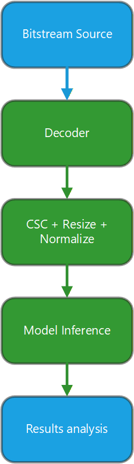

<!---
Copyright (c) 2026 Advanced Micro Devices, Inc. (AMD)

Permission is hereby granted, free of charge, to any person obtaining a copy
of this software and associated documentation files (the "Software"), to deal
in the Software without restriction, including without limitation the rights
to use, copy, modify, merge, publish, distribute, sublicense, and/or sell
copies of the Software, and to permit persons to whom the Software is
furnished to do so, subject to the following conditions:

The above copyright notice and this permission notice shall be included in all
copies or substantial portions of the Software.

THE SOFTWARE IS PROVIDED "AS IS", WITHOUT WARRANTY OF ANY KIND, EXPRESS OR
IMPLIED, INCLUDING BUT NOT LIMITED TO THE WARRANTIES OF MERCHANTABILITY,
FITNESS FOR A PARTICULAR PURPOSE AND NONINFRINGEMENT. IN NO EVENT SHALL THE
AUTHORS OR COPYRIGHT HOLDERS BE LIABLE FOR ANY CLAIM, DAMAGES OR OTHER
LIABILITY, WHETHER IN AN ACTION OF CONTRACT, TORT OR OTHERWISE, ARISING FROM,
OUT OF OR IN CONNECTION WITH THE SOFTWARE OR THE USE OR OTHER DEALINGS IN THE
SOFTWARE.
--->

# Building a High-Performance Video Inference Pipeline with ROCm Libraries Using C/C++

[AMD ROCm™ software](https://rocm.docs.amd.com/en/latest/what-is-rocm.html) is an
open-source software stack designed for programming AMD GPUs, spanning
everything from low-level kernel development to high-level applications.
It provides developers with direct access to the full capabilities of
AMD hardware, enabling high-performance and power-efficient computing.

To fully benefit from ROCm, it is important to design
applications that take advantage of GPU acceleration wherever possible.
Offloading compute-intensive tasks to the GPU is often essential for
achieving optimal performance and energy efficiency, especially given
ROCm's support for AMD RDNA™ and CDNA™ architectures, including RDNA 3.5
integrated graphics found in desktop and laptop systems.

In this tutorial, we will show how to build a pipeline which includes
three different ROCm libraries:

1. rocDecode for hardware-accelerated video decoding

2. HIP for custom kernels

3. MIGraphX for efficient model inference.

We will walk through the process of ingesting a HEVC stream,
decoding it, performing the necessary manipulations on the decoded frames, and
running inference on each frame.

## Environment

### Hardware Requirements

As mentioned earlier, you will need an AMD GPU in your system to use ROCm libraries. While the latest RDNA 4 or CDNA 4 GPUs provide the best experience,
RDNA 3.5 integrated graphics in a desktop or laptop system are also sufficient for following this tutorial. It is also important to develop and validate your application on the hardware available to you and scale it later to more powerful devices, such as a dedicated GPU or even datacenter Instinct accelerators.

You can consult the [GPU hardware
specifications](https://rocm.docs.amd.com/en/latest/reference/gpu-arch-specs.html)
to determine which hardware is available to you or identify a better alternative.

### Software Requirements

This tutorial focuses on Ubuntu 24.04. Historically, ROCm
was developed primarily for Linux, so you will generally get the best experience by using Linux for both development and deployment.
You may check the [list of supported operating
systems](https://rocm.docs.amd.com/projects/install-on-linux/en/latest/reference/system-requirements.html)
on the corresponding page.

Next, install the following components:

1. Install AMD GPU drivers  
Follow the [ROCm documentation](https://rocm.docs.amd.com/projects/install-on-linux/en/latest/install/quick-start.html)
rather than standalone driver instructions. Be cautious if Secure Boot
is enabled, as it may complicate installation.

2. Install ROCm (version 7.2.1 is used in this tutorial)  
Newer versions should also work, but consistency helps avoid
compatibility issues.

3. Use Docker (recommended)  
Docker simplifies setup and allows multiple ROCm versions to coexist on the same system. If
you prefer a bare-metal setup, you'll need to manually replicate the
environment referenced in the [Dockerfile](./src/Dockerfile).

## Problem Statement

In this tutorial, we will show how to build an efficient pipeline for
decoding a HEVC stream, performing the necessary conversions on the GPU, and
running inference using ResNet-18 on each frame.

We will review the following components of the implementation:



- The decoder component will be implemented using the rocDecode library which
  enables hardware-accelerated video decoding on the GPU. Learn more about
  rocDecode
  (<https://rocm.docs.amd.com/projects/rocDecode/en/latest/what-is-rocDecode.html>).
  You can also find information about [supported hardware and available
  codecs](https://rocm.docs.amd.com/projects/rocDecode/en/latest/reference/rocDecode-formats-and-architectures.html) in the documentation. Information about consumer GPUs is available on the specification pages for each product.
  For example, see the page for the [RX 9070
  XT](https://www.amd.com/en/products/graphics/desktops/radeon/9000-series/amd-radeon-rx-9070xt.html)
  (section: Supported Rendering Format).

- Color Space Conversion (CSC), resizing, and normalization will be
  implemented as a separate kernel in the application which uses HIP.

- Learn more about HIP
  (<https://rocm.docs.amd.com/projects/HIP/en/latest/what_is_hip.html>).
  Understanding HIP also helps explain why ROCm-based applications require a customized LLVM toolchain.
  ROCm applications use specialized kernel declarations in the source code.
  These declarations are not supported by standard compilers.

- Finally, the most important part is running inference on each frame.
  To do that, we will use a ROCm library named MIGraphX which provides
  efficient inference for ONNX models on AMD GPUs. Learn more
  about MIGraphX
  (<https://rocm.docs.amd.com/projects/AMDMIGraphX/en/latest/index.html>).

This tutorial demonstrates how applications can combine multiple ROCm
libraries to build an effective pipeline which does most manipulations
on the GPU without offloading data to system memory until the end.

## Building and Running the Pipeline

This tutorial uses the following Docker image as its build environment:
rocm7.2.1_ubuntu24.04_py3.12_pytorch_release_2.7.1 which you can pull
using the following command:

```bash
docker pull rocm/pytorch:rocm7.2.1_ubuntu24.04_py3.12_pytorch_release_2.7.1
```

Docker also allows multiple ROCm versions to coexist on the same system.

Next, you need to set up a specific build environment for building the example [code](./src/main.cpp). This
tutorial is based on the usage of a custom LLVM version by AMD, which is
available inside the Docker image mentioned above, but you will also need to
compile the rocDecode and MIGraphX libraries used in the tutorial. It is
important to build them on the target system to avoid compatibility issues that may arise
when using packages from standard Linux repositories.

The [Dockerfile](./src/Dockerfile) used to build the image is included in the source files.

Let's highlight a few non-obvious details.\
The MIGraphX build configuration includes an important parameter
-DGPU_TARGETS=\$GPU_TARGETS. You may adjust this argument according to the GPU architecture available
on your system (available in [the GPU
specifications](https://rocm.docs.amd.com/en/latest/reference/gpu-arch-specs.html)).
It also requires providing paths to LLVM compilers explicitly.\
MIGraphX also requires a custom build system that can be installed using:

```bash
pip install https://github.com/RadeonOpenCompute/rbuild/archive/master.tar.gz
```

rocDecode also uses a Python-based script to set up the build
environment:

```bash
python3 rocDecode-setup.py --developer=ON
```

One final workaround appears at the end of the [Dockerfile](./src/Dockerfile): It rebuilds
MIGraphX a second time. This is not strictly required, but it works around
an issue when your application cannot run due to conflicts between multiple LLVM instances inside
your application.

You can download [Dockerfile](./src/Dockerfile) and build it using the following command:

```bash
sudo docker image build . -t videopipe
```

This command creates a new Docker image tagged as videopipe\[:latest\].

Put the source files in a directory of your choice (for example, \~/tutorial).

You can then run the container using the following command:

```bash
sudo docker container run -it --device=/dev/kfd --device=/dev/dri --mount type=bind,src=.,dst=/workspace/videopipe --rm videopipe
```

It will run a Docker container in interactive mode (\--it) and will
remove it after exit (\--rm). It also mounts the current directory as
/workspace/videopipe inside the container.

Important arguments are "\--device=/dev/kfd \--device=/dev/dri",
which expose the GPU inside the container. Without these options, the GPU will not be available
inside the container. More information about accessing a GPU in a container
can be found in the "[Running ROCm Docker
containers](https://rocm.docs.amd.com/projects/install-on-linux/en/latest/how-to/docker.html)" documentation.
Especially, if you are planning to run it on Instinct GPUs.

The [CMakeLists.txt](./src/CMakeLists.txt) is relatively simple and just configures the use of a
custom compiler (allows HIP blocks to be compiled) and locates the required
libraries (HIP, rocDecode, MIGraphX).

At this point, the videopipe directory should contain [CMakeLists.txt](./src/CMakeLists.txt) and
[main.cpp](./src/main.cpp). To build the application, run the following
commands in the running container:

```bash
cd /workspace/videopipe
mkdir build
cd build
cmake ..
cmake --build .
```

After that, you should have a binary executable in
/workspace/videopipe/build named "videopipe".

To use it, you need to place a prepared video.h265 with resolution
1920x1080 in 420 format.

You must also provide a model.onnx file based on a ResNet-18 implementation. This
can be done by converting a [PyTorch
model](https://huggingface.co/microsoft/resnet-18).

For example:

```python
import torch
import torchvision.models as models
import onnx
import onnxruntime as ort
import numpy as np

# 1. Load the pre-trained ResNet-18 model and switch it to evaluation mode
model = models.resnet18(pretrained=True)
model.eval()

# 2. Create a dummy input tensor [1, 3, 224, 224]
dummy_input = torch.randn(1, 3, 224, 224)

# 3. Export to ONNX
torch.onnx.export(
  model,
  dummy_input,
  "model.onnx",
  export_params=True,
  opset_version=19,
  do_constant_folding=True,
  input_names=['input'],
  output_names=['output'],
  external_data=False
)

# 4. Verify with ONNX Runtime
ort_session = ort.InferenceSession("model.onnx")
ort_inputs = {ort_session.get_inputs()[0].name: dummy_input.numpy()}
ort_outs = ort_session.run(None, ort_inputs)
```

You can now place all required files (videopipe, video.h265,
model.onnx\[, model.onnx.data\]) in one folder and just execute
./videopipe to process the video and display classification results for each frame.

After running the application you should see lines like:

```bash
Frame detected class: 975 confidence: 9.05893
Frame detected class: 975 confidence: 9.05893
Frame detected class: 975 confidence: 9.05893
Frame detected class: 975 confidence: 9.05893
```

The exact number of output lines depends on how quickly the scene changes
in the source video stream. In the example above, the video contains a
frame showing a shoreline, so the detected class is 975, which corresponds to
\"lakeside, lakeshore\". A mapping between class IDs and labels can be found in
[config.json](https://huggingface.co/microsoft/resnet-18/blob/main/config.json)
of the original ResNet-18 model.

## Summary

This tutorial demonstrates how to build a fully GPU-accelerated video
processing pipeline using ROCm. By combining rocDecode,
HIP, and MIGraphX, you can efficiently decode video, preprocess frames,
and run deep learning inference, all while keeping the data resident on the GPU.

This approach minimizes data movement, improves performance, and reduces
power consumption. From here, you can extend the pipeline by:

1. Replacing classification models with object detection or segmentation models

2. Streaming video from a camera or network source

3. Scaling to more powerful AMD GPUs or datacenter accelerators

ROCm provides the flexibility and performance needed to
build production-grade, GPU-first applications. The pipeline provides a
strong foundation for further development.

## Example Source

- [Dockerfile](./src/Dockerfile)
- [CMakeLists.txt](./src/CMakeLists.txt)
- [main.cpp](./src/main.cpp)

## Disclaimers

Third-party content is licensed to you directly by the third party that owns the content and is not licensed to you by AMD. ALL LINKED THIRD-PARTY CONTENT IS PROVIDED “AS IS” WITHOUT A WARRANTY OF ANY KIND. USE OF SUCH THIRD-PARTY CONTENT IS DONE AT YOUR SOLE DISCRETION AND UNDER NO CIRCUMSTANCES WILL AMD BE LIABLE TO YOU FOR ANY THIRD-PARTY CONTENT. YOU ASSUME ALL RISK AND ARE SOLELY RESPONSIBLE FOR ANY DAMAGES THAT MAY ARISE FROM YOUR USE OF THIRD-PARTY CONTENT.
