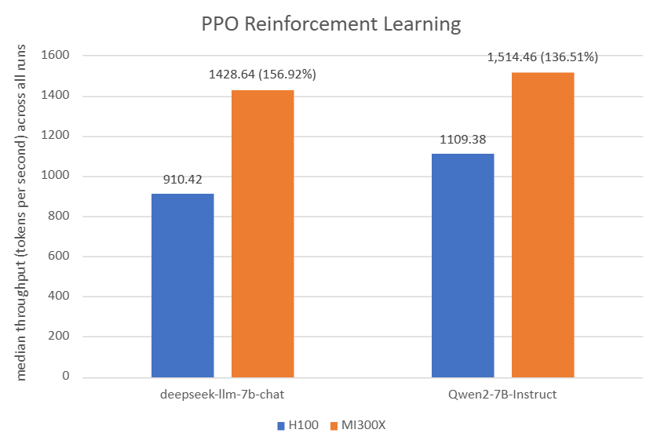

<!---
Copyright (c) 2025 Advanced Micro Devices, Inc. (AMD)

Permission is hereby granted, free of charge, to any person obtaining a copy
of this software and associated documentation files (the "Software"), to deal
in the Software without restriction, including without limitation the rights
to use, copy, modify, merge, publish, distribute, sublicense, and/or sell
copies of the Software, and to permit persons to whom the Software is
furnished to do so, subject to the following conditions:

The above copyright notice and this permission notice shall be included in all
copies or substantial portions of the Software.

THE SOFTWARE IS PROVIDED "AS IS", WITHOUT WARRANTY OF ANY KIND, EXPRESS OR
IMPLIED, INCLUDING BUT NOT LIMITED TO THE WARRANTIES OF MERCHANTABILITY,
FITNESS FOR A PARTICULAR PURPOSE AND NONINFRINGEMENT. IN NO EVENT SHALL THE
AUTHORS OR COPYRIGHT HOLDERS BE LIABLE FOR ANY CLAIM, DAMAGES OR OTHER
LIABILITY, WHETHER IN AN ACTION OF CONTRACT, TORT OR OTHERWISE, ARISING FROM,
OUT OF OR IN CONNECTION WITH THE SOFTWARE OR THE USE OR OTHER DEALINGS IN THE
SOFTWARE.
--->

# Exploring Use Cases for Scalable AI: Implementing Ray with ROCm 7 Support for Efficient ML Workflows

This blog builds on insights from our [previous blog post](https://rocm.blogs.amd.com/artificial-intelligence/rocm-ray/README.html), which introduced Ray 2.48.0.post0 running on ROCm 6.2 and demonstrated Reinforcement Learning from Human Feedback (RLHF) with verl 0.3.0.post0 and vLLM 0.6.4 on AMD GPUs. In this follow‑up, we introduce Ray 2.51.1 with ROCm 7.0.0, verl 0.6.0, and vLLM 0.11.0.dev, highlighting the new performance benefits and capabilities for large‑scale RLHF workloads.

While we provide an overview of [Ray](https://github.com/ray-project/ray/) and its role in distributed AI/ML pipelines, the central focus of this blog is hands‑on, example‑driven workflows. Most of the content is dedicated to concrete, runnable examples demonstrating how to use Ray with ROCm across real training, inference, and serving scenarios. These include distributed RLHF training with verl, autoscaling inference with SkyPilot, Ray Serve applications, vLLM‑backed inference, hyperparameter tuning, Stable Diffusion image generation, and multi‑GPU fine‑tuning with Ray Train.

By walking through these step‑by‑step examples, you’ll see exactly how Ray abstracts distributed complexity, how ROCm accelerates workloads on AMD GPUs, and how to apply these capabilities directly to your own ML pipelines. This post is designed as a practical guide—giving you ready‑to‑use workflows you can run from a single GPU to multi‑node clusters.

## Ray Overview

### Ray Core

Ray implements a general purpose, universal framework for distributed computing. This framework provides low-level primitives such as tasks and actors with which you can build your pipelines for specific workloads. The idea is to abstract away the complexity of distributed computing through these primitives.

### ML Library Ecosystem

Because Ray is a general-purpose framework, the community has built many libraries and frameworks on top of it to accomplish different tasks.

* `RayTune` - a Python library for experiment execution and hyperparameter tuning at any scale
* `RayData` - a scalable data processing library for ML and AI workloads built on Ray
* `RayTrain` - a scalable machine learning library for distributed training and fine-tuning
* `RayServe` - a library for easy-to-use scalable model serving
* `RLlib` - a library for reinforcement learning that offers both high scalability and a unified API for a variety of applications

### Use Cases

Ray can be applied to many use cases for scaling ML applications, such as:

* LLMs and Generative AI​
* Batch inference​
* Model serving​
* Hyperparameter tuning​
* Distributed training​
* Reinforcement learning​
* ML platform​
* End-to-end ML workflows​
* Large-scale workload orchestration​

Refer to the [upstream Ray use cases documentation](https://docs.ray.io/en/latest/ray-overview/use-cases.html) for
detailed tutorials using AMD GPUs and ROCm.

## Installing Ray with ROCm Support

You can install Ray with ROCm support on a single node.

### Prerequisites

* A node with [ROCm-supported]( https://rocm.docs.amd.com/projects/install-on-linux/en/latest/reference/system-requirements.html) AMD GPUs
* A supported [Linux distribution](https://rocm.docs.amd.com/projects/install-on-linux/en/latest/reference/system-requirements.html#supported-operating-systems)
* A ROCm [installation](https://rocm.docs.amd.com/projects/install-on-linux/en/latest/tutorial/quick-start.html)

### ROCm Ray

* [Installation](https://rocm.docs.amd.com/projects/install-on-linux/en/latest/install/3rd-party/ray-install.html)

* [Docker image](https://hub.docker.com/r/rocm/ray/tags)

* [GitHub](https://github.com/ROCm/ray)

### Setup

Download the prebuilt Docker image mentioned above using `docker pull` command and run the following `docker run` command to start a container.

```bash

docker run -it --privileged --network=host --device=/dev/kfd --device=/dev/dri --group-add video --cap-add=SYS_PTRACE --security-opt seccomp=unconfined --ipc=host --shm-size 16G -v ~/:/dockerx -v ~/:/dockerx --name ray-blog-vllm rocm/ray:ray-2.51.1_rocm7.0.0_ubuntu22.04_py3.12_pytorch2.9.0

```

## Examples

### Overview

Before diving into the detailed examples, this section provides an overview of the practical workflows and use cases we cover throughout the following subsections. These examples were selected to highlight how Ray and ROCm integrate across a broad range of AI workloads—from reinforcement learning, autoscaling, LLM serving, and distributed inference, to classical machine learning, image generation, and large‑scale transformer fine‑tuning. By exploring these scenarios, readers gain hands‑on guidance for building, scaling, and deploying AI applications efficiently on AMD Instinct GPUs using Ray and its ecosystem of tools. Each example is designed to demonstrate real-world applicability, best practices, and performance considerations, enabling developers to accelerate development and productionization of AI systems.

### Reinforcement Learning with Human Feedback with verl

[verl](https://verl.readthedocs.io/en/latest/index.html), an open-source framework that provides a flexible, efficient, and production-ready RL training library for large language models (LLMs), leverages Ray for its distributed computing capabilities.
Read the [Reinforcement Learning from Human Feedback on AMD GPUs with verl and ROCm Integration blog post](https://rocm.blogs.amd.com/artificial-intelligence/verl-large-scale-rocm7/README.html) to get started with verl on AMD Instinct GPUs and accelerate your RLHF training with ROCm-optimized performance.

As you can see in the figure below, for PPO Reinforcement Learning: The AMD Instinct MI300X 8x GPU also offers up to 56% higher PPO training throughput vs. NVIDIA H100 on deepseek-llm-7b-chat with TP_VALUE of 4, INFERENCE_BATCH_SIZE of 32, and GPU_MEMORY_UTILIZATION of 0.4. The AMD Instinct MI300X 8x GPU offers up to 36% higher PPO training throughput vs. NVIDIA H100 on Qwen2-7B-Instruct with TP_VALUE of 2, INFERENCE_BATCH_SIZE of 32, and GPU_MEMORY_UTILIZATION of 0.4.



As you can see in the figure below, for GRPO Reinforcement Learning: The AMD Instinct MI300X 8x GPU also offers up to 12% higher GRPO training throughput vs. NVIDIA H100 on deepseek-llm-7b-chat with TP_VALUE of 2, INFERENCE_BATCH_SIZE of 110, and GPU_MEMORY_UTILIZATION of 0.4. The AMD Instinct MI300X 8x GPU offers up to 11% higher GRPO training throughput vs. NVIDIA H100 on Qwen2-7B-Instruct with TP_VALUE of 2, INFERENCE_BATCH_SIZE of 40, and GPU_MEMORY_UTILIZATION of 0.6.


### Autoscaling with SkyPilot

[SkyPilot](https://docs.skypilot.co/en/latest/docs/index.html) is an open-source AI infrastructure orchestration framework that enables deployment across multiple clouds and Kubernetes clusters.
Read the [Elevate Your LLM Inference: Autoscaling with Ray, ROCm 7.0.0, and SkyPilot](https://rocm.blogs.amd.com/ecosystems-and-partners/ray-rocm7/README.html) to get started with SkyPilot on AMD Instinct GPUs and explore autoscaling of inference workloads in Ray Serve with a vLLM backend.

### Convert LLM into Ray Serve application

You can develop a Ray Serve application locally and deploy it in production on a cluster of AMD GPUs
using just a few lines of code. Find detailed instructions on the official
[Ray documentation Develop and Deploy page](https://docs.ray.io/en/latest/serve/develop-and-deploy.html).

1. English-to-French translation is an example of deploying an ML application. First, create
the Python script, `RayServe_En2Fr_translation_local.py`, based on the script `model.py` from the
[upstream Ray documentation page](https://docs.ray.io/en/latest/serve/develop-and-deploy.html), which can be used to translate English text to French.

```python
# File name: RayServe_En2Fr_translation_local.py
from transformers import pipeline

class Translator:
    def __init__(self):
        # Load model
        self.model = pipeline("translation_en_to_fr", model="t5-small",
        device=0)

    def translate(self, text: str) -> str:
        # Run inference
        model_output = self.model(text)

        # Post-process output to return only the translation text
        translation = model_output[0]["translation_text"]

        return translation

translator = Translator()

translation = translator.translate("Hello world!")
print(translation)
```

2. Test this script by running it locally:

```bash
python RayServe_En2Fr_translation_local.py
```

3. The output can be expected as follows:

```text
config.json: 100%|█████████████████████████████████████████████████████████████████████████████████████████████████████| 1.21k/1.21k [00:00<00:00, 7.12MB/s]
model.safetensors: 100%|██████████████████████████████████████████████████████████████████████████████████████████████████| 242M/242M [00:02<00:00, 110MB/s]
generation_config.json: 100%|██████████████████████████████████████████████████████████████████████████████████████████████| 147/147 [00:00<00:00, 1.31MB/s]
tokenizer_config.json: 100%|███████████████████████████████████████████████████████████████████████████████████████████| 2.32k/2.32k [00:00<00:00, 17.1MB/s]
spiece.model: 100%|██████████████████████████████████████████████████████████████████████████████████████████████████████| 792k/792k [00:00<00:00, 2.41MB/s]
tokenizer.json: 100%|██████████████████████████████████████████████████████████████████████████████████████████████████| 1.39M/1.39M [00:00<00:00, 4.76MB/s]
Device set to use cuda:0
Bonjour monde!
```

4. Next, convert this script into `RayServe_En2Fr_translation.py`, which supports a Ray Serve
application with [FastAPI](https://docs.ray.io/en/latest/serve/http-guide.html#serve-set-up-fastapi-http) based on the instructions from the [upstream Ray develop and deploy documentation page](https://docs.ray.io/en/latest/serve/develop-and-deploy.html).

```python
# File name: RayServe_En2Fr_translation.py
import ray
from ray import serve
from fastapi import FastAPI

from transformers import pipeline

app = FastAPI()


@serve.deployment(num_replicas=2, ray_actor_options={"num_cpus": 0.2, "num_gpus": 0})
@serve.ingress(app)
class Translator:
    def __init__(self):
        # Load model
        self.model = pipeline("translation_en_to_fr", model="t5-small",
        device=0)

    @app.post("/")
    def translate(self, text: str) -> str:
        # Run inference
        model_output = self.model(text)

        # Post-process output to return only the translation text
        translation = model_output[0]["translation_text"]

        return translation


translator_app = Translator.bind()
#from ray.serve.config import HTTPOptions
#serve.start(http_options=HTTPOptions(host="0.0.0.0", port=8123))
```

5. Set the `translator_app` application in the background to serve an LLM model that translates
English to French. Run the script with the `serve run` CLI command, which takes in an import path
formatted as `<module>:<application>`.

**Note:** By default, Ray Serve deployments' HTTP proxies listen on port 8000. You can customize these ports
using the http_options by uncommenting the last two lines in the code block above and modifying the
port number.

6. Run the command from a directory that contains a local copy of the `RayServe_En2Fr_translation.py`
script so it can import the application:

```bash
serve run RayServe_En2Fr_translation:translator_app &
```

7. The expected output is as follows:

```text
2025-12-18 05:30:20,461      INFO scripts.py:507 -- Running import path: 'RayServe_En2Fr_translation:translator_app'.
2025-12-18 05:30:28,461 INFO worker.py:2003 -- Started a local Ray instance. View the dashboard at http://127.0.0.1:8265
/usr/local/lib/python3.12/dist-packages/ray/_private/worker.py:2051: FutureWarning: Tip: In future versions of Ray, Ray will no longer override accelerator visible devices env var if num_gpus=0 or num_gpus=None (default). To enable this behavior and turn off this error message, set RAY_ACCEL_ENV_VAR_OVERRIDE_ON_ZERO=0
  warnings.warn(
(ProxyActor pid=126446) INFO 2025-12-18 05:30:31,888 proxy 10.7.37.122 -- Proxy starting on node 36189c7a450bbc7d7c23bba6bd5d9ac64930209baba980e0f8c5f18c (HTTP port: 8000).
INFO 2025-12-18 05:30:31,943 serve 125125 -- Started Serve in namespace "serve".
INFO 2025-12-18 05:30:31,948 serve 125125 -- Connecting to existing Serve app in namespace "serve". New http options will not be applied.
(ServeController pid=126444) INFO 2025-12-18 05:30:31,967 controller 126444 -- Deploying new version of Deployment(name='Translator', app='default') (initial target replicas: 2).
(ProxyActor pid=126446) INFO 2025-12-18 05:30:31,940 proxy 10.7.37.122 -- Got updated endpoints: {}.
(ProxyActor pid=126446) INFO 2025-12-18 05:30:31,971 proxy 10.7.37.122 -- Got updated endpoints: {Deployment(name='Translator', app='default'): EndpointInfo(route='/', app_is_cross_language=False)}.
(ProxyActor pid=126446) INFO 2025-12-18 05:30:32,000 proxy 10.7.37.122 -- Started <ray.serve._private.router.SharedRouterLongPollClient object at 0x723917f42150>.
(ServeController pid=126444) INFO 2025-12-18 05:30:32,072 controller 126444 -- Adding 2 replicas to Deployment(name='Translator', app='default').
(ServeReplica:default:Translator pid=126441) Device set to use cuda:0
INFO 2025-12-18 05:30:38,072 serve 125125 -- Application 'default' is ready at http://127.0.0.1:8000/.
```

8. After the server is set up in the cluster, test the application locally using the `model_client.py`
script from the
[Ray documentation page](https://docs.ray.io/en/latest/serve/develop-and-deploy.html), which is
renamed to `RayServe_En2Fr_translation_client.py`. It sends a `POST` request (in JSON) containing the
English text.

```python
# File name: RayServe_En2Fr_translation_client.py
import requests

response = requests.post("http://127.0.0.1:8000/", params={"text": "Hello world!"})
french_text = response.json()

print(french_text)
```

9. This client script requests a translation for the phrase “*Hello world!*”:

```bash
python RayServe_En2Fr_translation_client.py
```

10. The expected output is as follows:

```text
Bonjour monde!
(ServeReplica:default:Translator pid=71826) INFO 2025-12-11 05:37:01,301 default_Translator 5ql9dmix 35087cfa-7ed6-4720-8ccd-3736ea6bb077 -- POST / 200 64.0ms
```

### Run vLLM Inference Server with Ray

vLLM can leverage Ray for distributed tensor-parallel and pipeline-parallel inference across multiple GPUs and nodes, managed by Ray's distributed runtime.

For vLLM inference serving with Ray on ROCm, pre-built Docker images for vLLM optimized for AMD GPUs from Docker Hub under the `rocm/vllm` repository are recommended. To run a local vLLM server and make requests to `deepseek-ai/DeepSeek-R1-Distill-Qwen-14B`, follow these steps:

1. Run the `rocm/ray` Docker container as specified in the setup section at the beginning of this blog.

2. Download the `deepseek-ai/DeepSeek-R1-Distill-Qwen-14B` model from Hugging Face with the script `hf_download.py`:

```python

# hf_download.py

# Set up vllm custom cache folder. vllm default cache root is ~/.cache
#export VLLM_CACHE_ROOT=/path/to/your/custom/cache

from huggingface_hub import snapshot_download

model_path = snapshot_download(repo_id="deepseek-ai/DeepSeek-R1-Distill-Qwen-14B")
print(f"Model downloaded to: {model_path}")

```

3. Use the `snapshot_download` function in the Hugging Face API to download all files from the model.

```bash

python hf_download.py

```

4. The expected output is as follows:

```text
config.json: 100%|█████████████████████████████████████████████████████████████████████████████████████████████████████████| 664/664 [00:00<00:00, 3.55MB/s]
README.md: 16.0kB [00:00, 10.7MB/s]                                                                                               | 0.00/664 [00:00<?, ?B/s]
generation_config.json: 100%|██████████████████████████████████████████████████████████████████████████████████████████████| 181/181 [00:00<00:00, 1.30MB/s]
.gitattributes: 1.52kB [00:00, 5.41MB/s]                                                                                          | 0.00/181 [00:00<?, ?B/s]
LICENSE: 1.06kB [00:00, 5.52MB/s]                                                                                            | 1/13 [00:00<00:10,  1.16it/s]
model.safetensors.index.json: 48.0kB [00:00, 83.6MB/s]                                                                          | 0.00/8.67G [00:00<?, ?B/s]
benchmark.jpg: 100%|█████████████████████████████████████████████████████████████████████████████████████████████████████| 777k/777k [00:00<00:00, 2.11MB/s]
tokenizer_config.json: 3.07kB [00:00, 12.6MB/s]███████████████▊                                                              | 5/13 [00:01<00:01,  5.23it/s]
tokenizer.json: 7.03MB [00:00, 14.0MB/s]s]
tokenizer.json: 5.02MB [00:00, 14.0MB/s]                                                                                        | 0.00/3.49G [00:00<?, ?B/s(ServeController pid=372169) INFO 2025-12-18 05:53:05,306 controller 372169 -- Downscaling Deployment(name='StableDiffusionV15', app='default') from 1 to 0 replicas. Current ongoing requests: 0.00, current running replicas: 1.                                                   | 1.14G/8.67G [00:05<00:17, 428MB/s]
model-00004-of-000004.safetensors: 100%|████████████████████████████████████████████████████████████████████████████████| 3.49G/3.49G [00:19<00:00, 182MB/s]
model-00001-of-000004.safetensors: 100%|████████████████████████████████████████████████████████████████████████████████| 8.71G/8.71G [00:31<00:00, 281MB/s]
model-00002-of-000004.safetensors: 100%|████████████████████████████████████████████████████████████████████████████████| 8.67G/8.67G [00:31<00:00, 279MB/s]
model-00003-of-000004.safetensors: 100%|████████████████████████████████████████████████████████████████████████████████| 8.67G/8.67G [00:33<00:00, 263MB/s]
Fetching 13 files: 100%|████████████████████████████████████████████████████████████████████████████████████████████████████| 13/13 [00:34<00:00,  2.63s/it]
Model downloaded to: /root/.cache/huggingface/hub/models--deepseek-ai--DeepSeek-R1-Distill-Qwen-14B/snapshots/1df8507178afcc1bef68cd8c393f61a8863237619MB/s]
```

5. Deploy the inference server by using the `vllm serve` command.

In the following example, the vllm argument, `--max-model-len` sets the maximum sequence length the model can process. This value may be adjusted based on the available GPU memory and desired performance. `--distributed-executor-backend ray` ensures that Ray handles the distributed aspects, and `--tensor-parallel-size 2` indicates that the model should be parallelized across 2 GPUs. The `--port` argument is used to customize our server at http://localhost:8080.

```bash
vllm serve "deepseek-ai/DeepSeek-R1-Distill-Qwen-14B" --max-model-len 4096 --distributed-executor-backend ray --tensor-parallel-size 2 --port 8080 &

```

6. The expected output is as follows:

```text
INFO 12-18 05:59:39 [__init__.py:225] Automatically detected platform rocm.
(APIServer pid=460954) INFO 12-18 05:59:43 [api_server.py:1876] vLLM API server version 0.11.1rc2.dev141+g38f225c2a
(APIServer pid=460954) INFO 12-18 05:59:43 [utils.py:243] non-default args: {'model_tag': 'deepseek-ai/DeepSeek-R1-Distill-Qwen-14B', 'port': 8080, 'model': 'deepseek-ai/DeepSeek-R1-Distill-Qwen-14B', 'max_model_len': 4096, 'distributed_executor_backend': 'ray', 'tensor_parallel_size': 2}
(APIServer pid=460954) INFO 12-18 05:59:44 [model.py:658] Resolved architecture: Qwen2ForCausalLM
(APIServer pid=460954) INFO 12-18 05:59:44 [model.py:1745] Using max model len 4096
(APIServer pid=460954) INFO 12-18 05:59:45 [scheduler.py:225] Chunked prefill is enabled with max_num_batched_tokens=8192.
(APIServer pid=460954) WARNING 12-18 05:59:45 [vllm.py:498] No piecewise cudagraph for executing cascade attention. Will fall back to eager execution if a batch runs into cascade attentions
INFO 12-18 05:59:48 [__init__.py:225] Automatically detected platform rocm.
(EngineCore_DP0 pid=461101) INFO 12-18 05:59:52 [core.py:730] Waiting for init message from front-end.
(EngineCore_DP0 pid=461101) INFO 12-18 05:59:52 [core.py:97] Initializing a V1 LLM engine (v0.11.1rc2.dev141+g38f225c2a) with config: model='deepseek-ai/DeepSeek-R1-Distill-Qwen-14B', speculative_config=None, tokenizer='deepseek-ai/DeepSeek-R1-Distill-Qwen-14B', skip_tokenizer_init=False, tokenizer_mode=auto, revision=None, tokenizer_revision=None, trust_remote_code=False, dtype=torch.bfloat16, max_seq_len=4096, download_dir=None, load_format=auto, tensor_parallel_size=2, pipeline_parallel_size=1, data_parallel_size=1, disable_custom_all_reduce=False, quantization=None, enforce_eager=False, kv_cache_dtype=auto, device_config=cuda, structured_outputs_config=StructuredOutputsConfig(backend='auto', disable_fallback=False, disable_any_whitespace=False, disable_additional_properties=False, reasoning_parser=''), observability_config=ObservabilityConfig(show_hidden_metrics_for_version=None, otlp_traces_endpoint=None, collect_detailed_traces=None), seed=0, served_model_name=deepseek-ai/DeepSeek-R1-Distill-Qwen-14B, enable_prefix_caching=True, chunked_prefill_enabled=True, pooler_config=None, compilation_config={'level': None, 'mode': 3, 'debug_dump_path': None, 'cache_dir': '', 'backend': 'inductor', 'custom_ops': ['+rms_norm', '+silu_and_mul', '+quant_fp8', 'none', '+rms_norm'], 'splitting_ops': [], 'use_inductor': None, 'compile_sizes': [], 'inductor_compile_config': {'enable_auto_functionalized_v2': False, 'combo_kernels': True, 'benchmark_combo_kernel': True}, 'inductor_passes': {}, 'cudagraph_mode': <CUDAGraphMode.FULL: 2>, 'use_cudagraph': True, 'cudagraph_num_of_warmups': 1, 'cudagraph_capture_sizes': [512, 504, 496, 488, 480, 472, 464, 456, 448, 440, 432, 424, 416, 408, 400, 392, 384, 376, 368, 360, 352, 344, 336, 328, 320, 312, 304, 296, 288, 280, 272, 264, 256, 248, 240, 232, 224, 216, 208, 200, 192, 184, 176, 168, 160, 152, 144, 136, 128, 120, 112, 104, 96, 88, 80, 72, 64, 56, 48, 40, 32, 24, 16, 8, 4, 2, 1], 'cudagraph_copy_inputs': False, 'full_cuda_graph': True, 'use_inductor_graph_partition': False, 'pass_config': {}, 'max_capture_size': 512, 'local_cache_dir': None}
(EngineCore_DP0 pid=461101) 2025-12-18 05:59:52,482     INFO worker.py:1832 -- Connecting to existing Ray cluster at address: 10.7.37.122:57100...
(EngineCore_DP0 pid=461101) 2025-12-18 05:59:52,492     INFO worker.py:2003 -- Connected to Ray cluster. View the dashboard at http://127.0.0.1:8265
(EngineCore_DP0 pid=461101) /usr/local/lib/python3.12/dist-packages/ray/_private/worker.py:2051: FutureWarning: Tip: In future versions of Ray, Ray will no longer override accelerator visible devices env var if num_gpus=0 or num_gpus=None (default). To enable this behavior and turn off this error message, set RAY_ACCEL_ENV_VAR_OVERRIDE_ON_ZERO=0
(EngineCore_DP0 pid=461101)   warnings.warn(
(EngineCore_DP0 pid=461101) INFO 12-18 05:59:52 [ray_utils.py:378] No current placement group found. Creating a new placement group.
(EngineCore_DP0 pid=461101) INFO 12-18 05:59:52 [ray_distributed_executor.py:179] use_ray_spmd_worker: True
(pid=372171) INFO 12-18 05:59:54 [__init__.py:225] Automatically detected platform rocm.
(EngineCore_DP0 pid=461101) (pid=372171) INFO 12-18 05:59:54 [__init__.py:225] Automatically detected platform rocm.
(EngineCore_DP0 pid=461101) INFO 12-18 05:59:56 [ray_env.py:66] RAY_NON_CARRY_OVER_ENV_VARS from config: set()
(EngineCore_DP0 pid=461101) INFO 12-18 05:59:56 [ray_env.py:69] Copying the following environment variables to workers: ['LD_LIBRARY_PATH', 'VLLM_WORKER_MULTIPROC_METHOD', 'VLLM_USE_V1', 'VLLM_USE_RAY_SPMD_WORKER', 'VLLM_USE_RAY_COMPILED_DAG']
(EngineCore_DP0 pid=461101) INFO 12-18 05:59:56 [ray_env.py:74] If certain env vars should NOT be copied, add them to /root/.config/vllm/ray_non_carry_over_env_vars.json file
(RayWorkerWrapper pid=372171) WARNING 12-18 06:00:00 [worker_base.py:309] Missing `shared_worker_lock` argument from executor. This argument is needed for mm_processor_cache_type='shm'.
(EngineCore_DP0 pid=461101) (RayWorkerWrapper pid=372171) WARNING 12-18 06:00:00 [worker_base.py:309] Missing `shared_worker_lock` argument from executor. This argument is needed for mm_processor_cache_type='shm'.
(pid=372170) INFO 12-18 05:59:54 [__init__.py:225] Automatically detected platform rocm.
(EngineCore_DP0 pid=461101) (pid=372170) INFO 12-18 05:59:54 [__init__.py:225] Automatically detected platform rocm.
(RayWorkerWrapper pid=372171) [Gloo] Rank 1 is connected to 1 peer ranks. Expected number of connected peer ranks is : 1
(EngineCore_DP0 pid=461101) (RayWorkerWrapper pid=372171) [Gloo] Rank 1 is connected to 1 peer ranks. Expected number of connected peer ranks is : 1
(RayWorkerWrapper pid=372170) INFO 12-18 06:00:00 [pynccl.py:111] vLLM is using nccl==2.26.6
(EngineCore_DP0 pid=461101) (RayWorkerWrapper pid=372170) INFO 12-18 06:00:00 [pynccl.py:111] vLLM is using nccl==2.26.6
(RayWorkerWrapper pid=372170) INFO 12-18 06:00:02 [shm_broadcast.py:313] vLLM message queue communication handle: Handle(local_reader_ranks=[1], buffer_handle=(1, 4194304, 6, 'psm_5ab77c02'), local_subscribe_addr='ipc:///tmp/56de04ff-3094-4e9a-999c-d5fd4cd6730e', remote_subscribe_addr=None, remote_addr_ipv6=False)
(EngineCore_DP0 pid=461101) (RayWorkerWrapper pid=372170) INFO 12-18 06:00:02 [shm_broadcast.py:313] vLLM message queue communication handle: Handle(local_reader_ranks=[1], buffer_handle=(1, 4194304, 6, 'psm_5ab77c02'), local_subscribe_addr='ipc:///tmp/56de04ff-3094-4e9a-999c-d5fd4cd6730e', remote_subscribe_addr=None, remote_addr_ipv6=False)
(RayWorkerWrapper pid=372170) INFO 12-18 06:00:03 [pynccl.py:111] vLLM is using nccl==2.26.6
(EngineCore_DP0 pid=461101) (RayWorkerWrapper pid=372170) INFO 12-18 06:00:03 [pynccl.py:111] vLLM is using nccl==2.26.6
(RayWorkerWrapper pid=372171) INFO 12-18 06:00:03 [parallel_state.py:1325] rank 1 in world size 2 is assigned as DP rank 0, PP rank 0, TP rank 1, EP rank 1
(EngineCore_DP0 pid=461101) (RayWorkerWrapper pid=372171) INFO 12-18 06:00:03 [parallel_state.py:1325] rank 1 in world size 2 is assigned as DP rank 0, PP rank 0, TP rank 1, EP rank 1
(RayWorkerWrapper pid=372171) INFO 12-18 06:00:04 [gpu_model_runner.py:2843] Starting to load model deepseek-ai/DeepSeek-R1-Distill-Qwen-14B...
(EngineCore_DP0 pid=461101) (RayWorkerWrapper pid=372171) INFO 12-18 06:00:04 [gpu_model_runner.py:2843] Starting to load model deepseek-ai/DeepSeek-R1-Distill-Qwen-14B...
(RayWorkerWrapper pid=372170) WARNING 12-18 06:00:04 [rocm.py:395] Model architecture 'Qwen2ForCausalLM' is partially supported by ROCm: Sliding window attention (SWA) is not yet supported in Triton flash attention. For half-precision SWA support, please use CK flash attention by setting `VLLM_USE_TRITON_FLASH_ATTN=0`
(EngineCore_DP0 pid=461101) (RayWorkerWrapper pid=372170) WARNING 12-18 06:00:04 [rocm.py:395] Model architecture 'Qwen2ForCausalLM' is partially supported by ROCm: Sliding window attention (SWA) is not yet supported in Triton flash attention. For half-precision SWA support, please use CK flash attention by setting `VLLM_USE_TRITON_FLASH_ATTN=0`
(RayWorkerWrapper pid=372171) INFO 12-18 06:00:04 [rocm.py:298] Using Rocm Attention backend on V1 engine.
(EngineCore_DP0 pid=461101) (RayWorkerWrapper pid=372171) INFO 12-18 06:00:04 [rocm.py:298] Using Rocm Attention backend on V1 engine.
(RayWorkerWrapper pid=372171) WARNING 12-18 06:00:04 [compilation.py:874] Op 'quant_fp8' not present in model, enabling with '+quant_fp8' has no effect
(EngineCore_DP0 pid=461101) (RayWorkerWrapper pid=372171) WARNING 12-18 06:00:04 [compilation.py:874] Op 'quant_fp8' not present in model, enabling with '+quant_fp8' has no effect
(RayWorkerWrapper pid=372171) INFO 12-18 06:00:05 [weight_utils.py:419] Using model weights format ['*.safetensors']
(EngineCore_DP0 pid=461101) (RayWorkerWrapper pid=372171) INFO 12-18 06:00:05 [weight_utils.py:419] Using model weights format ['*.safetensors']
Loading safetensors checkpoint shards:   0% Completed | 0/4 [00:00<?, ?it/s]
Loading safetensors checkpoint shards:   0% Completed | 0/4 [00:00<?, ?it/s]
Loading safetensors checkpoint shards:  25% Completed | 1/4 [00:01<00:03,  1.21s/it](EngineCore_DP0 pid=461101) (RayWorkerWrapper pid=372170)

Loading safetensors checkpoint shards:  50% Completed | 2/4 [00:02<00:02,  1.25s/it](RayWorkerWrapper pid=372170)

Loading safetensors checkpoint shards:  75% Completed | 3/4 [00:03<00:00,  1.03it/s]
Loading safetensors checkpoint shards:  75% Completed | 3/4 [00:03<00:00,  1.03it/s]
(RayWorkerWrapper pid=372171) INFO 12-18 06:00:09 [default_loader.py:314] Loading weights took 4.20 seconds
(EngineCore_DP0 pid=461101) (RayWorkerWrapper pid=372171) INFO 12-18 06:00:09 [default_loader.py:314] Loading weights took 4.20 seconds
(RayWorkerWrapper pid=372170) WARNING 12-18 06:00:00 [worker_base.py:309] Missing `shared_worker_lock` argument from executor. This argument is needed for mm_processor_cache_type='shm'.
(EngineCore_DP0 pid=461101) (RayWorkerWrapper pid=372170) WARNING 12-18 06:00:00 [worker_base.py:309] Missing `shared_worker_lock` argument from executor. This argument is needed for mm_processor_cache_type='shm'.
(RayWorkerWrapper pid=372170) [Gloo] Rank 0 is connected to 1 peer ranks. Expected number of connected peer ranks is : 1 [repeated 11x across cluster] (Ray deduplicates logs by default. Set RAY_DEDUP_LOGS=0 to disable log deduplication, or see https://docs.ray.io/en/master/ray-observability/user-guides/configure-logging.html#log-deduplication for more options.)
(EngineCore_DP0 pid=461101) (RayWorkerWrapper pid=372170) [Gloo] Rank 0 is connected to 1 peer ranks. Expected number of connected peer ranks is : 1 [repeated 11x across cluster] (Ray deduplicates logs by default. Set RAY_DEDUP_LOGS=0 to disable log deduplication, or see https://docs.ray.io/en/master/ray-observability/user-guides/configure-logging.html#log-deduplication for more options.)
(RayWorkerWrapper pid=372170) INFO 12-18 06:00:03 [parallel_state.py:1325] rank 0 in world size 2 is assigned as DP rank 0, PP rank 0, TP rank 0, EP rank 0
(EngineCore_DP0 pid=461101) (RayWorkerWrapper pid=372170) INFO 12-18 06:00:03 [parallel_state.py:1325] rank 0 in world size 2 is assigned as DP rank 0, PP rank 0, TP rank 0, EP rank 0
(RayWorkerWrapper pid=372170) INFO 12-18 06:00:04 [gpu_model_runner.py:2843] Starting to load model deepseek-ai/DeepSeek-R1-Distill-Qwen-14B...
(EngineCore_DP0 pid=461101) (RayWorkerWrapper pid=372170) INFO 12-18 06:00:04 [gpu_model_runner.py:2843] Starting to load model deepseek-ai/DeepSeek-R1-Distill-Qwen-14B...
(RayWorkerWrapper pid=372171) WARNING 12-18 06:00:04 [rocm.py:395] Model architecture 'Qwen2ForCausalLM' is partially supported by ROCm: Sliding window attention (SWA) is not yet supported in Triton flash attention. For half-precision SWA support, please use CK flash attention by setting `VLLM_USE_TRITON_FLASH_ATTN=0`
(EngineCore_DP0 pid=461101) (RayWorkerWrapper pid=372171) WARNING 12-18 06:00:04 [rocm.py:395] Model architecture 'Qwen2ForCausalLM' is partially supported by ROCm: Sliding window attention (SWA) is not yet supported in Triton flash attention. For half-precision SWA support, please use CK flash attention by setting `VLLM_USE_TRITON_FLASH_ATTN=0`
(RayWorkerWrapper pid=372170) INFO 12-18 06:00:04 [rocm.py:298] Using Rocm Attention backend on V1 engine.
(EngineCore_DP0 pid=461101) (RayWorkerWrapper pid=372170) INFO 12-18 06:00:04 [rocm.py:298] Using Rocm Attention backend on V1 engine.
(RayWorkerWrapper pid=372170) WARNING 12-18 06:00:04 [compilation.py:874] Op 'quant_fp8' not present in model, enabling with '+quant_fp8' has no effect
(EngineCore_DP0 pid=461101) (RayWorkerWrapper pid=372170) WARNING 12-18 06:00:04 [compilation.py:874] Op 'quant_fp8' not present in model, enabling with '+quant_fp8' has no effect
(RayWorkerWrapper pid=372171) INFO 12-18 06:00:10 [gpu_model_runner.py:2904] Model loading took 14.0020 GiB and 5.323000 seconds
(EngineCore_DP0 pid=461101) (RayWorkerWrapper pid=372171) INFO 12-18 06:00:10 [gpu_model_runner.py:2904] Model loading took 14.0020 GiB and 5.323000 seconds
(RayWorkerWrapper pid=372170) INFO 12-18 06:00:05 [weight_utils.py:419] Using model weights format ['*.safetensors']
(EngineCore_DP0 pid=461101) (RayWorkerWrapper pid=372170) INFO 12-18 06:00:05 [weight_utils.py:419] Using model weights format ['*.safetensors']
Loading safetensors checkpoint shards: 100% Completed | 4/4 [00:04<00:00,  1.05s/it]
Loading safetensors checkpoint shards: 100% Completed | 4/4 [00:04<00:00,  1.07s/it]
(RayWorkerWrapper pid=372170)
Loading safetensors checkpoint shards: 100% Completed | 4/4 [00:04<00:00,  1.05s/it]
Loading safetensors checkpoint shards: 100% Completed | 4/4 [00:04<00:00,  1.07s/it]
(EngineCore_DP0 pid=461101) (RayWorkerWrapper pid=372170)
(RayWorkerWrapper pid=372171) INFO 12-18 06:00:15 [backends.py:609] Using cache directory: /root/.cache/vllm/torch_compile_cache/879fda0faa/rank_1_0/backbone for vLLM's torch.compile
(EngineCore_DP0 pid=461101) (RayWorkerWrapper pid=372171) INFO 12-18 06:00:15 [backends.py:609] Using cache directory: /root/.cache/vllm/torch_compile_cache/879fda0faa/rank_1_0/backbone for vLLM's torch.compile
(RayWorkerWrapper pid=372171) INFO 12-18 06:00:15 [backends.py:623] Dynamo bytecode transform time: 4.39 s
(EngineCore_DP0 pid=461101) (RayWorkerWrapper pid=372171) INFO 12-18 06:00:15 [backends.py:623] Dynamo bytecode transform time: 4.39 s
(RayWorkerWrapper pid=372170) INFO 12-18 06:00:10 [default_loader.py:314] Loading weights took 4.45 seconds
(RayWorkerWrapper pid=372170) INFO 12-18 06:00:10 [gpu_model_runner.py:2904] Model loading took 14.0020 GiB and 5.929397 seconds
(EngineCore_DP0 pid=461101) (RayWorkerWrapper pid=372170) INFO 12-18 06:00:10 [default_loader.py:314] Loading weights took 4.45 seconds
(EngineCore_DP0 pid=461101) (RayWorkerWrapper pid=372170) INFO 12-18 06:00:10 [gpu_model_runner.py:2904] Model loading took 14.0020 GiB and 5.929397 seconds
(EngineCore_DP0 pid=461101) (RayWorkerWrapper pid=372171) INFO 12-18 06:00:38 [backends.py:248] Cache the graph for dynamic shape for later use
(RayWorkerWrapper pid=372171) INFO 12-18 06:00:38 [backends.py:248] Cache the graph for dynamic shape for later use
(EngineCore_DP0 pid=461101) (RayWorkerWrapper pid=372171) INFO 12-18 06:00:38 [backends.py:275] Compiling a graph for dynamic shape takes 21.34 s
(RayWorkerWrapper pid=372171) INFO 12-18 06:00:38 [backends.py:275] Compiling a graph for dynamic shape takes 21.34 s
(EngineCore_DP0 pid=461101) (RayWorkerWrapper pid=372170) INFO 12-18 06:00:15 [backends.py:609] Using cache directory: /root/.cache/vllm/torch_compile_cache/879fda0faa/rank_0_0/backbone for vLLM's torch.compile
(RayWorkerWrapper pid=372170) INFO 12-18 06:00:15 [backends.py:609] Using cache directory: /root/.cache/vllm/torch_compile_cache/879fda0faa/rank_0_0/backbone for vLLM's torch.compile
(EngineCore_DP0 pid=461101) (RayWorkerWrapper pid=372170) INFO 12-18 06:00:15 [backends.py:623] Dynamo bytecode transform time: 4.46 s
(RayWorkerWrapper pid=372170) INFO 12-18 06:00:15 [backends.py:623] Dynamo bytecode transform time: 4.46 s
(RayWorkerWrapper pid=372171) INFO 12-18 06:00:39 [monitor.py:34] torch.compile takes 25.73 s in total
(EngineCore_DP0 pid=461101) (RayWorkerWrapper pid=372171) INFO 12-18 06:00:39 [monitor.py:34] torch.compile takes 25.73 s in total
(RayWorkerWrapper pid=372171) [aiter] type hints mismatch, override to --> rmsnorm2d_fwd(input: torch.Tensor, weight: torch.Tensor, epsilon: float, use_model_sensitive_rmsnorm: int = 0) -> torch.Tensor
(RayWorkerWrapper pid=372171) [2025-12-18 06:00:39] WARNING core.py:622: type hints mismatch, override to --> rmsnorm2d_fwd(input: torch.Tensor, weight: torch.Tensor, epsilon: float, use_model_sensitive_rmsnorm: int = 0) -> torch.Tensor
(EngineCore_DP0 pid=461101) (RayWorkerWrapper pid=372171) [aiter] type hints mismatch, override to --> rmsnorm2d_fwd(input: torch.Tensor, weight: torch.Tensor, epsilon: float, use_model_sensitive_rmsnorm: int = 0) -> torch.Tensor
(EngineCore_DP0 pid=461101) (RayWorkerWrapper pid=372171) [2025-12-18 06:00:39] WARNING core.py:622: type hints mismatch, override to --> rmsnorm2d_fwd(input: torch.Tensor, weight: torch.Tensor, epsilon: float, use_model_sensitive_rmsnorm: int = 0) -> torch.Tensor
(EngineCore_DP0 pid=461101) (RayWorkerWrapper pid=372171) INFO 12-18 06:00:55 [gpu_worker.py:315] Available KV cache memory: 152.07 GiB
(RayWorkerWrapper pid=372171) INFO 12-18 06:00:55 [gpu_worker.py:315] Available KV cache memory: 152.07 GiB
(EngineCore_DP0 pid=461101) (RayWorkerWrapper pid=372170) INFO 12-18 06:00:38 [backends.py:248] Cache the graph for dynamic shape for later use
(RayWorkerWrapper pid=372170) INFO 12-18 06:00:38 [backends.py:248] Cache the graph for dynamic shape for later use
(RayWorkerWrapper pid=372170) INFO 12-18 06:00:38 [backends.py:275] Compiling a graph for dynamic shape takes 21.57 s
(RayWorkerWrapper pid=372170) INFO 12-18 06:00:39 [monitor.py:34] torch.compile takes 26.03 s in total
(EngineCore_DP0 pid=461101) (RayWorkerWrapper pid=372170) INFO 12-18 06:00:38 [backends.py:275] Compiling a graph for dynamic shape takes 21.57 s
(EngineCore_DP0 pid=461101) (RayWorkerWrapper pid=372170) INFO 12-18 06:00:39 [monitor.py:34] torch.compile takes 26.03 s in total
(EngineCore_DP0 pid=461101) INFO 12-18 06:00:55 [kv_cache_utils.py:1199] GPU KV cache size: 1,661,008 tokens
(EngineCore_DP0 pid=461101) INFO 12-18 06:00:55 [kv_cache_utils.py:1204] Maximum concurrency for 4,096 tokens per request: 405.52x
(EngineCore_DP0 pid=461101) INFO 12-18 06:00:55 [kv_cache_utils.py:1199] GPU KV cache size: 1,661,008 tokens
(EngineCore_DP0 pid=461101) INFO 12-18 06:00:55 [kv_cache_utils.py:1204] Maximum concurrency for 4,096 tokens per request: 405.52x
Capturing CUDA graphs (mixed prefill-decode, FULL):   0%|          | 0/67 [00:00<?, ?it/s]
(EngineCore_DP0 pid=461101) (RayWorkerWrapper pid=372170) [aiter] type hints mismatch, override to --> rmsnorm2d_fwd(input: torch.Tensor, weight: torch.Tensor, epsilon: float, use_model_sensitive_rmsnorm: int = 0) -> torch.Tensor
(EngineCore_DP0 pid=461101) (RayWorkerWrapper pid=372170) [2025-12-18 06:00:39] WARNING core.py:622: type hints mismatch, override to --> rmsnorm2d_fwd(input: torch.Tensor, weight: torch.Tensor, epsilon: float, use_model_sensitive_rmsnorm: int = 0) -> torch.Tensor
Capturing CUDA graphs (mixed prefill-decode, FULL):   0%|          | 0/67 [00:00<?, ?it/s]
(RayWorkerWrapper pid=372170) [aiter] type hints mismatch, override to --> rmsnorm2d_fwd(input: torch.Tensor, weight: torch.Tensor, epsilon: float, use_model_sensitive_rmsnorm: int = 0) -> torch.Tensor
(RayWorkerWrapper pid=372170) [2025-12-18 06:00:39] WARNING core.py:622: type hints mismatch, override to --> rmsnorm2d_fwd(input: torch.Tensor, weight: torch.Tensor, epsilon: float, use_model_sensitive_rmsnorm: int = 0) -> torch.Tensor
Capturing CUDA graphs (mixed prefill-decode, FULL):   1%|▏         | 1/67 [00:01<01:45,  1.60s/it]
Capturing CUDA graphs (mixed prefill-decode, FULL):   1%|▏         | 1/67 [00:01<01:45,  1.60s/it]
Capturing CUDA graphs (mixed prefill-decode, FULL):   4%|▍         | 3/67 [00:01<00:29,  2.16it/s]
Capturing CUDA graphs (mixed prefill-decode, FULL):   4%|▍         | 3/67 [00:01<00:29,  2.16it/s]
Capturing CUDA graphs (mixed prefill-decode, FULL):   7%|▋         | 5/67 [00:01<00:16,  3.87it/s](RayWorkerWrapper pid=372170)

Capturing CUDA graphs (mixed prefill-decode, FULL):  10%|█         | 7/67 [00:01<00:10,  5.66it/s]
Capturing CUDA graphs (mixed prefill-decode, FULL):  10%|█         | 7/67 [00:01<00:10,  5.66it/s]
Capturing CUDA graphs (mixed prefill-decode, FULL):  13%|█▎        | 9/67 [00:02<00:07,  7.42it/s](RayWorkerWrapper pid=372170)

Capturing CUDA graphs (mixed prefill-decode, FULL):  16%|█▋        | 11/67 [00:02<00:06,  9.05it/s](EngineCore_DP0 pid=461101) (RayWorkerWrapper pid=372170)Capturing CUDA graphs (mixed prefill-decode, FULL):  16%|█▋        | 11/67 [00:02<00:06,  9.05it/s]

Capturing CUDA graphs (mixed prefill-decode, FULL):  19%|█▉        | 13/67 [00:02<00:05, 10.48it/s](EngineCore_DP0 pid=461101) (RayWorkerWrapper pid=372170)Capturing CUDA graphs (mixed prefill-decode, FULL):  19%|█▉        | 13/67 [00:02<00:05, 10.48it/s]

Capturing CUDA graphs (mixed prefill-decode, FULL):  22%|██▏       | 15/67 [00:02<00:04, 11.67it/s]
Capturing CUDA graphs (mixed prefill-decode, FULL):  22%|██▏       | 15/67 [00:02<00:04, 11.67it/s]
Capturing CUDA graphs (mixed prefill-decode, FULL):  25%|██▌       | 17/67 [00:02<00:03, 12.67it/s]
Capturing CUDA graphs (mixed prefill-decode, FULL):  25%|██▌       | 17/67 [00:02<00:03, 12.67it/s]
Capturing CUDA graphs (mixed prefill-decode, FULL):  28%|██▊       | 19/67 [00:02<00:03, 13.41it/s]
Capturing CUDA graphs (mixed prefill-decode, FULL):  28%|██▊       | 19/67 [00:02<00:03, 13.41it/s]
Capturing CUDA graphs (mixed prefill-decode, FULL):  31%|███▏      | 21/67 [00:02<00:03, 13.99it/s]
Capturing CUDA graphs (mixed prefill-decode, FULL):  31%|███▏      | 21/67 [00:02<00:03, 13.99it/s]
Capturing CUDA graphs (mixed prefill-decode, FULL):  34%|███▍      | 23/67 [00:03<00:03, 14.43it/s]
Capturing CUDA graphs (mixed prefill-decode, FULL):  34%|███▍      | 23/67 [00:03<00:03, 14.43it/s]
Capturing CUDA graphs (mixed prefill-decode, FULL):  37%|███▋      | 25/67 [00:03<00:02, 14.61it/s]
Capturing CUDA graphs (mixed prefill-decode, FULL):  37%|███▋      | 25/67 [00:03<00:02, 14.61it/s]
Capturing CUDA graphs (mixed prefill-decode, FULL):  40%|████      | 27/67 [00:03<00:02, 14.91it/s]
Capturing CUDA graphs (mixed prefill-decode, FULL):  40%|████      | 27/67 [00:03<00:02, 14.91it/s]
Capturing CUDA graphs (mixed prefill-decode, FULL):  43%|████▎     | 29/67 [00:03<00:02, 15.05it/s]
Capturing CUDA graphs (mixed prefill-decode, FULL):  43%|████▎     | 29/67 [00:03<00:02, 15.05it/s]
Capturing CUDA graphs (mixed prefill-decode, FULL):  46%|████▋     | 31/67 [00:03<00:02, 15.12it/s]
Capturing CUDA graphs (mixed prefill-decode, FULL):  46%|████▋     | 31/67 [00:03<00:02, 15.12it/s]
Capturing CUDA graphs (mixed prefill-decode, FULL):  49%|████▉     | 33/67 [00:03<00:02, 15.13it/s]
Capturing CUDA graphs (mixed prefill-decode, FULL):  49%|████▉     | 33/67 [00:03<00:02, 15.13it/s]
Capturing CUDA graphs (mixed prefill-decode, FULL):  52%|█████▏    | 35/67 [00:03<00:02, 15.21it/s]
Capturing CUDA graphs (mixed prefill-decode, FULL):  52%|█████▏    | 35/67 [00:03<00:02, 15.21it/s]
Capturing CUDA graphs (mixed prefill-decode, FULL):  55%|█████▌    | 37/67 [00:03<00:01, 15.26it/s]
Capturing CUDA graphs (mixed prefill-decode, FULL):  55%|█████▌    | 37/67 [00:03<00:01, 15.26it/s]
Capturing CUDA graphs (mixed prefill-decode, FULL):  58%|█████▊    | 39/67 [00:04<00:01, 15.30it/s]
Capturing CUDA graphs (mixed prefill-decode, FULL):  58%|█████▊    | 39/67 [00:04<00:01, 15.30it/s]
Capturing CUDA graphs (mixed prefill-decode, FULL):  61%|██████    | 41/67 [00:04<00:01, 15.30it/s]
Capturing CUDA graphs (mixed prefill-decode, FULL):  61%|██████    | 41/67 [00:04<00:01, 15.30it/s]
Capturing CUDA graphs (mixed prefill-decode, FULL):  64%|██████▍   | 43/67 [00:04<00:01, 15.32it/s]
Capturing CUDA graphs (mixed prefill-decode, FULL):  64%|██████▍   | 43/67 [00:04<00:01, 15.32it/s]
Capturing CUDA graphs (mixed prefill-decode, FULL):  67%|██████▋   | 45/67 [00:04<00:01, 15.09it/s]
Capturing CUDA graphs (mixed prefill-decode, FULL):  67%|██████▋   | 45/67 [00:04<00:01, 15.09it/s]
Capturing CUDA graphs (mixed prefill-decode, FULL):  70%|███████   | 47/67 [00:04<00:01, 15.06it/s](EngineCore_DP0 pid=461101) (RayWorkerWrapper pid=372170)Capturing CUDA graphs (mixed prefill-decode, FULL):  70%|███████   | 47/67 [00:04<00:01, 15.06it/s]

Capturing CUDA graphs (mixed prefill-decode, FULL):  73%|███████▎  | 49/67 [00:04<00:01, 15.06it/s](EngineCore_DP0 pid=461101) (RayWorkerWrapper pid=372170)Capturing CUDA graphs (mixed prefill-decode, FULL):  73%|███████▎  | 49/67 [00:04<00:01, 15.06it/s]

Capturing CUDA graphs (mixed prefill-decode, FULL):  76%|███████▌  | 51/67 [00:04<00:01, 15.09it/s]
Capturing CUDA graphs (mixed prefill-decode, FULL):  76%|███████▌  | 51/67 [00:04<00:01, 15.09it/s]
Capturing CUDA graphs (mixed prefill-decode, FULL):  79%|███████▉  | 53/67 [00:05<00:00, 15.07it/s](EngineCore_DP0 pid=461101) (RayWorkerWrapper pid=372170)Capturing CUDA graphs (mixed prefill-decode, FULL):  79%|███████▉  | 53/67 [00:05<00:00, 15.07it/s]

Capturing CUDA graphs (mixed prefill-decode, FULL):  82%|████████▏ | 55/67 [00:05<00:00, 15.02it/s](EngineCore_DP0 pid=461101) (RayWorkerWrapper pid=372170)Capturing CUDA graphs (mixed prefill-decode, FULL):  82%|████████▏ | 55/67 [00:05<00:00, 15.02it/s]

Capturing CUDA graphs (mixed prefill-decode, FULL):  85%|████████▌ | 57/67 [00:05<00:00, 14.73it/s]
Capturing CUDA graphs (mixed prefill-decode, FULL):  85%|████████▌ | 57/67 [00:05<00:00, 14.73it/s]
Capturing CUDA graphs (mixed prefill-decode, FULL):  88%|████████▊ | 59/67 [00:05<00:00, 14.76it/s]
Capturing CUDA graphs (mixed prefill-decode, FULL):  88%|████████▊ | 59/67 [00:05<00:00, 14.76it/s]
Capturing CUDA graphs (mixed prefill-decode, FULL):  91%|█████████ | 61/67 [00:05<00:00, 14.89it/s](RayWorkerWrapper pid=372170)

Capturing CUDA graphs (mixed prefill-decode, FULL):  94%|█████████▍| 63/67 [00:05<00:00, 14.81it/s]
Capturing CUDA graphs (mixed prefill-decode, FULL):  94%|█████████▍| 63/67 [00:05<00:00, 14.81it/s]
Capturing CUDA graphs (mixed prefill-decode, FULL):  97%|█████████▋| 65/67 [00:05<00:00, 15.58it/s]
Capturing CUDA graphs (mixed prefill-decode, FULL):  97%|█████████▋| 65/67 [00:05<00:00, 15.58it/s]
(RayWorkerWrapper pid=372171) INFO 12-18 06:01:02 [custom_all_reduce.py:216] Registering 6499 cuda graph addresses
(RayWorkerWrapper pid=372170) INFO 12-18 06:00:55 [gpu_worker.py:315] Available KV cache memory: 152.07 GiB
(EngineCore_DP0 pid=461101) (RayWorkerWrapper pid=372171) INFO 12-18 06:01:02 [custom_all_reduce.py:216] Registering 6499 cuda graph addresses
(EngineCore_DP0 pid=461101) (RayWorkerWrapper pid=372170) INFO 12-18 06:00:55 [gpu_worker.py:315] Available KV cache memory: 152.07 GiB
Capturing CUDA graphs (mixed prefill-decode, FULL): 100%|██████████| 67/67 [00:05<00:00, 11.40it/s]
Capturing CUDA graphs (mixed prefill-decode, FULL): 100%|██████████| 67/67 [00:05<00:00, 11.40it/s]
(RayWorkerWrapper pid=372171) INFO 12-18 06:01:02 [gpu_model_runner.py:3815] Graph capturing finished in 7 secs, took 0.32 GiB
(EngineCore_DP0 pid=461101) (RayWorkerWrapper pid=372171) INFO 12-18 06:01:02 [gpu_model_runner.py:3815] Graph capturing finished in 7 secs, took 0.32 GiB
(EngineCore_DP0 pid=461101) INFO 12-18 06:01:03 [core.py:243] init engine (profile, create kv cache, warmup model) took 52.14 seconds
(EngineCore_DP0 pid=461101) WARNING 12-18 06:01:04 [compilation.py:764] Using piecewise compilation with empty splitting_ops
(EngineCore_DP0 pid=461101) WARNING 12-18 06:01:04 [vllm.py:498] No piecewise cudagraph for executing cascade attention. Will fall back to eager execution if a batch runs into cascade attentions
(APIServer pid=460954) INFO 12-18 06:01:05 [loggers.py:191] Engine 000: vllm cache_config_info with initialization after num_gpu_blocks is: 103813
(EngineCore_DP0 pid=461101) INFO 12-18 06:01:05 [gc_utils.py:40] GC Debug Config. enabled:False,top_objects:-1
(APIServer pid=460954) INFO 12-18 06:01:05 [api_server.py:1629] Supported tasks: ['generate']
(APIServer pid=460954) WARNING 12-18 06:01:05 [model.py:1602] Default sampling parameters have been overridden by the model's Hugging Face generation config recommended from the model creator. If this is not intended, please relaunch vLLM instance with `--generation-config vllm`.
(APIServer pid=460954) INFO 12-18 06:01:05 [serving_responses.py:148] Using default chat sampling params from model: {'temperature': 0.6, 'top_p': 0.95}
(APIServer pid=460954) INFO 12-18 06:01:05 [serving_chat.py:130] Using default chat sampling params from model: {'temperature': 0.6, 'top_p': 0.95}
(APIServer pid=460954) INFO 12-18 06:01:05 [serving_completion.py:68] Using default completion sampling params from model: {'temperature': 0.6, 'top_p': 0.95}
(APIServer pid=460954) INFO 12-18 06:01:05 [api_server.py:1945] Starting vLLM API server 0 on http://0.0.0.0:8080
(APIServer pid=460954) INFO 12-18 06:01:05 [launcher.py:38] Available routes are:
(APIServer pid=460954) INFO 12-18 06:01:05 [launcher.py:46] Route: /openapi.json, Methods: GET, HEAD
(APIServer pid=460954) INFO 12-18 06:01:05 [launcher.py:46] Route: /docs, Methods: GET, HEAD
(APIServer pid=460954) INFO 12-18 06:01:05 [launcher.py:46] Route: /docs/oauth2-redirect, Methods: GET, HEAD
(APIServer pid=460954) INFO 12-18 06:01:05 [launcher.py:46] Route: /redoc, Methods: GET, HEAD
(APIServer pid=460954) INFO 12-18 06:01:05 [launcher.py:46] Route: /health, Methods: GET
(APIServer pid=460954) INFO 12-18 06:01:05 [launcher.py:46] Route: /load, Methods: GET
(APIServer pid=460954) INFO 12-18 06:01:05 [launcher.py:46] Route: /ping, Methods: POST
(APIServer pid=460954) INFO 12-18 06:01:05 [launcher.py:46] Route: /ping, Methods: GET
(APIServer pid=460954) INFO 12-18 06:01:05 [launcher.py:46] Route: /tokenize, Methods: POST
(APIServer pid=460954) INFO 12-18 06:01:05 [launcher.py:46] Route: /detokenize, Methods: POST
(APIServer pid=460954) INFO 12-18 06:01:05 [launcher.py:46] Route: /v1/models, Methods: GET
(APIServer pid=460954) INFO 12-18 06:01:05 [launcher.py:46] Route: /version, Methods: GET
(APIServer pid=460954) INFO 12-18 06:01:05 [launcher.py:46] Route: /v1/responses, Methods: POST
(APIServer pid=460954) INFO 12-18 06:01:05 [launcher.py:46] Route: /v1/responses/{response_id}, Methods: GET
(APIServer pid=460954) INFO 12-18 06:01:05 [launcher.py:46] Route: /v1/responses/{response_id}/cancel, Methods: POST
(APIServer pid=460954) INFO 12-18 06:01:05 [launcher.py:46] Route: /v1/chat/completions, Methods: POST
(APIServer pid=460954) INFO 12-18 06:01:05 [launcher.py:46] Route: /v1/completions, Methods: POST
(APIServer pid=460954) INFO 12-18 06:01:05 [launcher.py:46] Route: /v1/embeddings, Methods: POST
(APIServer pid=460954) INFO 12-18 06:01:05 [launcher.py:46] Route: /pooling, Methods: POST
(APIServer pid=460954) INFO 12-18 06:01:05 [launcher.py:46] Route: /classify, Methods: POST
(APIServer pid=460954) INFO 12-18 06:01:05 [launcher.py:46] Route: /score, Methods: POST
(APIServer pid=460954) INFO 12-18 06:01:05 [launcher.py:46] Route: /v1/score, Methods: POST
(APIServer pid=460954) INFO 12-18 06:01:05 [launcher.py:46] Route: /v1/audio/transcriptions, Methods: POST
(APIServer pid=460954) INFO 12-18 06:01:05 [launcher.py:46] Route: /v1/audio/translations, Methods: POST
(APIServer pid=460954) INFO 12-18 06:01:05 [launcher.py:46] Route: /rerank, Methods: POST
(APIServer pid=460954) INFO 12-18 06:01:05 [launcher.py:46] Route: /v1/rerank, Methods: POST
(APIServer pid=460954) INFO 12-18 06:01:05 [launcher.py:46] Route: /v2/rerank, Methods: POST
(APIServer pid=460954) INFO 12-18 06:01:05 [launcher.py:46] Route: /scale_elastic_ep, Methods: POST
(APIServer pid=460954) INFO 12-18 06:01:05 [launcher.py:46] Route: /is_scaling_elastic_ep, Methods: POST
(APIServer pid=460954) INFO 12-18 06:01:05 [launcher.py:46] Route: /invocations, Methods: POST
(APIServer pid=460954) INFO 12-18 06:01:05 [launcher.py:46] Route: /metrics, Methods: GET
(APIServer pid=460954) INFO:     Started server process [460954]
(APIServer pid=460954) INFO:     Waiting for application startup.
(APIServer pid=460954) INFO:     Application startup complete.


```

7. To send a request to the server, create the script `request_deepseekr1.py`

```python

# request_deepseekr1.py
# Note: vLLM provides an OpenAI-compatible API, so we use the openai library
# to interact with our local vLLM server
from openai import OpenAI

client = OpenAI(
    base_url="http://localhost:8080/v1",
    api_key="sk-no-key-required" # API key not needed for local server
)

completion = client.chat.completions.create(
    model="deepseek-ai/DeepSeek-R1-Distill-Qwen-14B",
    messages=[
        {"role": "system", "content": "You are a helpful assistant."},
        {"role": "user", "content": "What is the capital of France?"}
    ],
    max_tokens=50
)

print(completion.choices[0].message.content)

```

```bash
python request_deepseekr1.py
```

8. The expected output is as follows:

```text
(APIServer pid=460954) INFO 12-18 06:05:01 [chat_utils.py:546] Detected the chat template content format to be 'string'. You can set `--chat-template-content-format` to override this.
(EngineCore_DP0 pid=461101) INFO 12-18 06:05:01 [ray_distributed_executor.py:575] RAY_CGRAPH_get_timeout is set to 300
(EngineCore_DP0 pid=461101) INFO 12-18 06:05:01 [ray_distributed_executor.py:579] VLLM_USE_RAY_COMPILED_DAG_CHANNEL_TYPE = auto
(EngineCore_DP0 pid=461101) INFO 12-18 06:05:01 [ray_distributed_executor.py:583] VLLM_USE_RAY_COMPILED_DAG_OVERLAP_COMM = False
(EngineCore_DP0 pid=461101) INFO 12-18 06:05:01 [ray_distributed_executor.py:659] Using RayPPCommunicator (which wraps vLLM _PP GroupCoordinator) for Ray Compiled Graph communication.
(APIServer pid=460954) INFO:     127.0.0.1:38196 - "POST /v1/chat/completions HTTP/1.1" 200 OK
Okay, so I need to figure out what the capital of France is. Hmm, I'm not entirely sure, but I think it's Paris. I remember hearing that Paris is a major city in France, known for places like the Eiffel
```

### Ray Tune for XGBoost

In this section, you can use XGBoost to train an image classifier on Ray. XGBoost is an optimized library for
distributed gradient boosting. It has become the leading ML library for solving regression and
classification problems. For a deeper dive into how gradient boosting works, see
[Introduction to Boosted Trees](https://xgboost.readthedocs.io/en/stable/tutorials/model.html).

In the following example, the script,
[`xgboost_example.py`](https://raw.githubusercontent.com/ROCm/ray/refs/heads/release/2.51.1/python/ray/tune/examples/xgboost_example.py),
trains an XGBoost image classifier to detect breast cancer. Ray Tune samples 10 different
hyperparameter settings and trains an XGBoost classifier on all of them. The `TrialScheduler` can stop
the low-performing trials early to reduce training time, thereby focusing all resources on the
high-performing trials. Refer to the official [Ray documentation](https://docs.ray.io/en/latest/tune/examples/tune-xgboost.html#tune-xgboost-ref) for details.

**Tip:**
You can quickly download this script using `curl`:

```bash
curl https://raw.githubusercontent.com/ROCm/ray/refs/heads/release/2.51.1/python/ray/tune/examples/xgboost_example.py > xgboost_example.py
```

1. Install `scikit-learn` and `xgboost`.  Then run the script.

```bash
pip install scikit-learn
pip install xgboost
python xgboost_example.py
```

```text
2025-12-18 05:48:21,844 INFO worker.py:2003 -- Started a local Ray instance. View the dashboard at http://127.0.0.1:8266
/usr/local/lib/python3.12/dist-packages/ray/_private/worker.py:2051: FutureWarning: Tip: In future versions of Ray, Ray will no longer override accelerator visible devices env var if num_gpus=0 or num_gpus=None (default). To enable this behavior and turn off this error message, set RAY_ACCEL_ENV_VAR_OVERRIDE_ON_ZERO=0
  warnings.warn(
2025-12-18 05:48:24,209 INFO tune.py:253 -- Initializing Ray automatically. For cluster usage or custom Ray initialization, call `ray.init(...)` before `Tuner(...)`.
2025-12-18 05:48:25,396 WARNING tune_controller.py:2135 -- The maximum number of pending trials has been automatically set to the number of available cluster CPUs, which is high (422 CPUs/pending trials). If you're running an experiment with a large number of trials, this could lead to scheduling overhead. In this case, consider setting the `TUNE_MAX_PENDING_TRIALS_PG` environment variable to the desired maximum number of concurrent pending trials.
2025-12-18 05:48:25,397 WARNING tune_controller.py:2135 -- The maximum number of pending trials has been automatically set to the number of available cluster CPUs, which is high (422 CPUs/pending trials). If you're running an experiment with a large number of trials, this could lead to scheduling overhead. In this case, consider setting the `TUNE_MAX_PENDING_TRIALS_PG` environment variable to the desired maximum number of concurrent pending trials.
╭────────────────────────────────────────────────────────────────────────────╮
│ Configuration for experiment     train_breast_cancer_2025-12-18_05-48-17   │
├────────────────────────────────────────────────────────────────────────────┤
│ Search algorithm                 BasicVariantGenerator                     │
│ Scheduler                        AsyncHyperBandScheduler                   │
│ Number of trials                 10                                        │
╰────────────────────────────────────────────────────────────────────────────╯

View detailed results here: /root/ray_results/train_breast_cancer_2025-12-18_05-48-17
To visualize your results with TensorBoard, run: `tensorboard --logdir /tmp/ray/session_2025-12-18_05-48-17_231780_432486/artifacts/2025-12-18_05-48-24/train_breast_cancer_2025-12-18_05-48-17/driver_artifacts`

Trial status: 10 PENDING
Current time: 2025-12-18 05:48:25. Total running time: 0s
Logical resource usage: 0/384 CPUs, 0/8 GPUs (0.0/1.0 accelerator_type:AMD-Instinct-MI300X-OAM)
╭──────────────────────────────────────────────────────────────────────────────────────────────────────────╮
│ Trial name                        status       max_depth     min_child_weight     subsample          eta │
├──────────────────────────────────────────────────────────────────────────────────────────────────────────┤
│ train_breast_cancer_2add4_00000   PENDING              1                    2      0.96029    0.0605865  │
│ train_breast_cancer_2add4_00001   PENDING              1                    2      0.766036   0.0837028  │
│ train_breast_cancer_2add4_00002   PENDING              7                    1      0.660886   0.00496707 │
│ train_breast_cancer_2add4_00003   PENDING              2                    2      0.592444   0.0740034  │
│ train_breast_cancer_2add4_00004   PENDING              4                    2      0.629612   0.00833329 │
│ train_breast_cancer_2add4_00005   PENDING              6                    1      0.79525    0.019056   │
│ train_breast_cancer_2add4_00006   PENDING              7                    3      0.564437   0.00397972 │
│ train_breast_cancer_2add4_00007   PENDING              3                    1      0.593208   0.0157155  │
│ train_breast_cancer_2add4_00008   PENDING              3                    3      0.920228   0.00309257 │
│ train_breast_cancer_2add4_00009   PENDING              2                    3      0.559493   0.0136064  │
╰──────────────────────────────────────────────────────────────────────────────────────────────────────────╯

Trial train_breast_cancer_2add4_00008 started with configuration:
╭───────────────────────────────────────────────────────────────────────╮
│ Trial train_breast_cancer_2add4_00008 config                          │
├───────────────────────────────────────────────────────────────────────┤
│ eta                                                           0.00309 │
│ eval_metric                                      ['logloss', 'error'] │
│ max_depth                                                           3 │
│ min_child_weight                                                    3 │
│ objective                                             binary:logistic │
│ subsample                                                     0.92023 │
╰───────────────────────────────────────────────────────────────────────╯

Trial train_breast_cancer_2add4_00002 started with configuration:
╭───────────────────────────────────────────────────────────────────────╮
│ Trial train_breast_cancer_2add4_00002 config                          │
├───────────────────────────────────────────────────────────────────────┤
│ eta                                                           0.00497 │
│ eval_metric                                      ['logloss', 'error'] │
│ max_depth                                                           7 │
│ min_child_weight                                                    1 │
│ objective                                             binary:logistic │
│ subsample                                                     0.66089 │
╰───────────────────────────────────────────────────────────────────────╯

...
...
...

Trial train_breast_cancer_2add4_00008 completed after 10 iterations at 2025-12-18 05:48:27. Total running time: 2s
╭────────────────────────────────────────────────────────────────────╮
│ Trial train_breast_cancer_2add4_00008 result                       │
├────────────────────────────────────────────────────────────────────┤
│ checkpoint_dir_name                              checkpoint_000009 │
│ time_this_iter_s                                           0.00164 │
│ time_total_s                                               0.02395 │
│ training_iteration                                              10 │
│ test-error                                                 0.34965 │
│ test-logloss                                               0.62781 │
╰────────────────────────────────────────────────────────────────────╯
2025-12-18 05:48:27,705 INFO tune.py:1009 -- Wrote the latest version of all result files and experiment state to '/root/ray_results/train_breast_cancer_2025-12-18_05-48-17' in 0.0088s.

Trial status: 10 TERMINATED
Current time: 2025-12-18 05:48:27. Total running time: 2s
Logical resource usage: 1.0/384 CPUs, 0/8 GPUs (0.0/1.0 accelerator_type:AMD-Instinct-MI300X-OAM)
Current best trial: 2add4_00001 with test-logloss=0.35881108816687046 and params={'objective': 'binary:logistic', 'eval_metric': ['logloss', 'error'], 'max_depth': 1, 'min_child_weight': 2, 'subsample': 0.7660364364646479, 'eta': 0.08370283803659384}
╭────────────────────────────────────────────────────────────────────────────────────────────────────────────────────────────────────────────────────────────────────────╮
│ Trial name                        status         max_depth     min_child_weight     subsample          eta     iter     total time (s)     test-logloss     test-error │
├────────────────────────────────────────────────────────────────────────────────────────────────────────────────────────────────────────────────────────────────────────┤
│ train_breast_cancer_2add4_00000   TERMINATED             1                    2      0.96029    0.0605865         2         0.0109012          0.601058      0.398601  │
│ train_breast_cancer_2add4_00001   TERMINATED             1                    2      0.766036   0.0837028        10         0.0191684          0.358811      0.0909091 │
│ train_breast_cancer_2add4_00002   TERMINATED             7                    1      0.660886   0.00496707        1         0.0114334          0.642358      0.342657  │
│ train_breast_cancer_2add4_00003   TERMINATED             2                    2      0.592444   0.0740034        10         0.0221815          0.366766      0.118881  │
│ train_breast_cancer_2add4_00004   TERMINATED             4                    2      0.629612   0.00833329        1         0.0107992          0.701876      0.447552  │
│ train_breast_cancer_2add4_00005   TERMINATED             6                    1      0.79525    0.019056          2         0.0162375          0.618257      0.342657  │
│ train_breast_cancer_2add4_00006   TERMINATED             7                    3      0.564437   0.00397972        1         0.0220206          0.705529      0.447552  │
│ train_breast_cancer_2add4_00007   TERMINATED             3                    1      0.593208   0.0157155         2         0.0129437          0.630475      0.356643  │
│ train_breast_cancer_2add4_00008   TERMINATED             3                    3      0.920228   0.00309257       10         0.0239508          0.627814      0.34965   │
│ train_breast_cancer_2add4_00009   TERMINATED             2                    3      0.559493   0.0136064         1         0.00961518         0.646452      0.363636  │
╰────────────────────────────────────────────────────────────────────────────────────────────────────────────────────────────────────────────────────────────────────────╯

Best model parameters: {'objective': 'binary:logistic', 'eval_metric': ['logloss', 'error'], 'max_depth': 1, 'min_child_weight': 2, 'subsample': 0.7660364364646479, 'eta': 0.08370283803659384}
Best model total accuracy: 0.9091
(train_breast_cancer pid=457267) Checkpoint successfully created at: Checkpoint(filesystem=local, path=/root/ray_results/train_breast_cancer_2025-12-18_05-48-17/train_breast_cancer_2add4_00007_7_eta=0.0157,max_depth=3,min_child_weight=1,subsample=0.5932_2025-12-18_05-48-25/checkpoint_000001) [repeated 32x across cluster] (Ray deduplicates logs by default. Set RAY_DEDUP_LOGS=0 to disable log deduplication, or see https://docs.ray.io/en/master/ray-observability/user-guides/configure-logging.html#log-deduplication for more options.)
```

**Result:** Seven of the trials stopped after less than 5 iterations instead of finishing the 10
iterations. Only the three best performing ones completed the full 10 iterations.

### Ray Serve for Stable Diffusion

Stable Diffusion is one of the most popular image generation models. It takes a text prompt and
generates an image according to the meaning of the prompt.

In this example, you can use Ray to stand up a server for a
[stabilityai/stable-diffusion-2-1-base](https://huggingface.co/stabilityai/stable-diffusion-2-1-base)
model with an API powered by [FastAPI](https://fastapi.tiangolo.com/).

1. To run this example, install the following:

```bash
pip install requests diffusers==0.35.2 transformers
```

2. Create a Python script using the Serve code below, which is based on the
[Ray documentation](https://docs.ray.io/en/latest/serve/tutorials/stable-diffusion.html), and save it as `RayServe_StableDiffusion.py`.

**Note:** The following script uses `runwayml/stable-diffusion-v1-5` instead of `stabilityai/stable-diffusion-xl-base-1.0`, because the latter may produce a blank image.

```python
# File name: RayServe_StableDiffusion.py
from io import BytesIO
from fastapi import FastAPI
from fastapi.responses import Response
import torch

from ray import serve
from ray.serve.handle import DeploymentHandle

app = FastAPI()

@serve.deployment(num_replicas=1)
@serve.ingress(app)
class APIIngress:
    def __init__(self, diffusion_model_handle: DeploymentHandle) -> None:
        self.handle = diffusion_model_handle

    @app.get(
        "/imagine",
        responses={200: {"content": {"image/png": {}}}},
        response_class=Response,
    )
    async def generate(self, prompt: str, img_size: int = 512):
        assert len(prompt), "prompt parameter cannot be empty"

        image = await self.handle.generate.remote(prompt, img_size=img_size)
        file_stream = BytesIO()
        image.save(file_stream, "PNG")
        return Response(content=file_stream.getvalue(), media_type="image/png")

@serve.deployment(
    ray_actor_options={"num_gpus": 1},
    autoscaling_config={"min_replicas": 0, "max_replicas": 2},
)
class StableDiffusionV15:
    def __init__(self):
        from diffusers import StableDiffusionPipeline

        model_id = "runwayml/stable-diffusion-v1-5"

        self.pipe = StableDiffusionPipeline.from_pretrained(
            model_id, torch_dtype=torch.float16
        )
        self.pipe = self.pipe.to("cuda")

    def generate(self, prompt: str, img_size: int = 512):
        assert len(prompt), "prompt parameter cannot be empty"

        with torch.autocast("cuda"):
            image = self.pipe(prompt, height=img_size, width=img_size).images[0]
            return image

entrypoint = APIIngress.bind(StableDiffusionV15.bind())

```

**Note:** By default, Ray Serve deployments' HTTP proxies listen on port 8000. You can customize
these ports using the http_options by uncommenting the last two lines in the code block
above and modifying the port number.

3. Start the Serve application with the following command:

```bash
serve run RayServe_StableDiffusion:entrypoint &
```

4. The expected output is as follows:

```text
2025-12-18 06:25:06,165      INFO scripts.py:507 -- Running import path: 'RayServe_StableDiffusion:entrypoint'.
2025-12-18 06:25:11,596 INFO worker.py:2003 -- Started a local Ray instance. View the dashboard at http://127.0.0.1:8265
/usr/local/lib/python3.12/dist-packages/ray/_private/worker.py:2051: FutureWarning: Tip: In future versions of Ray, Ray will no longer override accelerator visible devices env var if num_gpus=0 or num_gpus=None (default). To enable this behavior and turn off this error message, set RAY_ACCEL_ENV_VAR_OVERRIDE_ON_ZERO=0
  warnings.warn(
(ProxyActor pid=464032) INFO 2025-12-18 06:25:15,034 proxy 10.7.37.122 -- Proxy starting on node 4f0d0c2fbead3498828df1e9ae6f0bc2e66aee97c5ef3d166fca1d5b (HTTP port: 8000).
INFO 2025-12-18 06:25:15,087 serve 462776 -- Started Serve in namespace "serve".
INFO 2025-12-18 06:25:15,099 serve 462776 -- Connecting to existing Serve app in namespace "serve". New http options will not be applied.
(ServeController pid=464036) INFO 2025-12-18 06:25:15,119 controller 464036 -- Registering autoscaling state for deployment Deployment(name='StableDiffusionV15', app='default')
(ServeController pid=464036) INFO 2025-12-18 06:25:15,119 controller 464036 -- Deploying new version of Deployment(name='StableDiffusionV15', app='default') (initial target replicas: 0).
(ServeController pid=464036) INFO 2025-12-18 06:25:15,121 controller 464036 -- Deregistering autoscaling state for deployment Deployment(name='APIIngress', app='default')
(ServeController pid=464036) WARNING 2025-12-18 06:25:15,121 controller 464036 -- Cannot deregister autoscaling state for deployment Deployment(name='APIIngress', app='default') because it is not registered
(ServeController pid=464036) INFO 2025-12-18 06:25:15,121 controller 464036 -- Deploying new version of Deployment(name='APIIngress', app='default') (initial target replicas: 1).
(ProxyActor pid=464032) INFO 2025-12-18 06:25:15,084 proxy 10.7.37.122 -- Got updated endpoints: {}.
(ProxyActor pid=464032) INFO 2025-12-18 06:25:15,125 proxy 10.7.37.122 -- Got updated endpoints: {Deployment(name='APIIngress', app='default'): EndpointInfo(route='/', app_is_cross_language=False)}.
(ProxyActor pid=464032) INFO 2025-12-18 06:25:15,157 proxy 10.7.37.122 -- Started <ray.serve._private.router.SharedRouterLongPollClient object at 0x7a1c6b56a180>.
(ServeController pid=464036) INFO 2025-12-18 06:25:15,226 controller 464036 -- Adding 1 replica to Deployment(name='APIIngress', app='default').
INFO 2025-12-18 06:25:16,213 serve 462776 -- Application 'default' is ready at http://127.0.0.1:8000/.
```

5. Now, send requests to the server through the API. Create the script
`RayServe_StableDiffusion_client.py` using the client code from the
[Ray documentation](https://docs.ray.io/en/latest/serve/tutorials/stable-diffusion.html).

Ensure the client uses an HTTP proxy that matches the server.

```python
# File name: RayServe_StableDiffusion_client.py
import requests

prompt = "a cute cat is dancing on the grass."
input = "%20".join(prompt.split(" "))
resp = requests.get(f"http://127.0.0.1:8000/imagine?prompt={input}")
with open("output.png", 'wb') as f:
    f.write(resp.content)
```

6. Running the `RayServe_StableDiffusion_client.py` script sends a request to this application with prompt
"*a cute cat is dancing on the grass.*".

```bash
python RayServe_StableDiffusion_client.py
```

7. The generated image is saved locally as `output.png`. The expected output is as follows:

```text
2025-12-18 06:25:06,165      INFO scripts.py:507 -- Running import path: 'RayServe_StableDiffusion:entrypoint'.
2025-12-18 06:25:11,596 INFO worker.py:2003 -- Started a local Ray instance. View the dashboard at http://127.0.0.1:8265
/usr/local/lib/python3.12/dist-packages/ray/_private/worker.py:2051: FutureWarning: Tip: In future versions of Ray, Ray will no longer override accelerator visible devices env var if num_gpus=0 or num_gpus=None (default). To enable this behavior and turn off this error message, set RAY_ACCEL_ENV_VAR_OVERRIDE_ON_ZERO=0
  warnings.warn(
(ProxyActor pid=464032) INFO 2025-12-18 06:25:15,034 proxy 10.7.37.122 -- Proxy starting on node 4f0d0c2fbead3498828df1e9ae6f0bc2e66aee97c5ef3d166fca1d5b (HTTP port: 8000).
INFO 2025-12-18 06:25:15,087 serve 462776 -- Started Serve in namespace "serve".
INFO 2025-12-18 06:25:15,099 serve 462776 -- Connecting to existing Serve app in namespace "serve". New http options will not be applied.
(ServeController pid=464036) INFO 2025-12-18 06:25:15,119 controller 464036 -- Registering autoscaling state for deployment Deployment(name='StableDiffusionV15', app='default')
(ServeController pid=464036) INFO 2025-12-18 06:25:15,119 controller 464036 -- Deploying new version of Deployment(name='StableDiffusionV15', app='default') (initial target replicas: 0).
(ServeController pid=464036) INFO 2025-12-18 06:25:15,121 controller 464036 -- Deregistering autoscaling state for deployment Deployment(name='APIIngress', app='default')
(ServeController pid=464036) WARNING 2025-12-18 06:25:15,121 controller 464036 -- Cannot deregister autoscaling state for deployment Deployment(name='APIIngress', app='default') because it is not registered
(ServeController pid=464036) INFO 2025-12-18 06:25:15,121 controller 464036 -- Deploying new version of Deployment(name='APIIngress', app='default') (initial target replicas: 1).
(ProxyActor pid=464032) INFO 2025-12-18 06:25:15,084 proxy 10.7.37.122 -- Got updated endpoints: {}.
(ProxyActor pid=464032) INFO 2025-12-18 06:25:15,125 proxy 10.7.37.122 -- Got updated endpoints: {Deployment(name='APIIngress', app='default'): EndpointInfo(route='/', app_is_cross_language=False)}.
(ProxyActor pid=464032) INFO 2025-12-18 06:25:15,157 proxy 10.7.37.122 -- Started <ray.serve._private.router.SharedRouterLongPollClient object at 0x7a1c6b56a180>.
(ServeController pid=464036) INFO 2025-12-18 06:25:15,226 controller 464036 -- Adding 1 replica to Deployment(name='APIIngress', app='default').
INFO 2025-12-18 06:25:16,213 serve 462776 -- Application 'default' is ready at http://127.0.0.1:8000/.

root@ctr-cx71-mi300x-01:/dockerx/ray_blog# python RayServe_StableDiffusion_client.py
🎨 Generating image with prompt: 'a cute cat is dancing on the grass.'
⏳ Sending request to Stable Diffusion server...
(ServeReplica:default:APIIngress pid=464040) INFO 2025-12-18 06:26:45,185 default_APIIngress ywz4k7gs 2d7297ac-64d3-49a0-9c36-d4f1b58586eb -- Started <ray.serve._private.router.SharedRouterLongPollClient object at 0x78d290ddb2c0>.
(ServeController pid=464036) INFO 2025-12-18 06:26:45,253 controller 464036 -- Upscaling Deployment(name='StableDiffusionV15', app='default') from 0 to 1 replicas. Current ongoing requests: 1.00, current running replicas: 0.
(ServeController pid=464036) INFO 2025-12-18 06:26:45,360 controller 464036 -- Adding 1 replica to Deployment(name='StableDiffusionV15', app='default').
Fetching 15 files:   0%|          | 0/15 [00:00<?, ?it/s]
Fetching 15 files:   7%|▋         | 1/15 [00:00<00:13,  1.05it/s]
Fetching 15 files:  27%|██▋       | 4/15 [00:05<00:14,  1.32s/it]
Fetching 15 files:  47%|████▋     | 7/15 [00:05<00:05,  1.45it/s]
Fetching 15 files: 100%|██████████| 15/15 [00:08<00:00,  1.82it/s]
Loading pipeline components...:   0%|          | 0/7 [00:00<?, ?it/s]
Loading pipeline components...:  43%|████▎     | 3/7 [00:00<00:00, 17.64it/s]`torch_dtype` is deprecated! Use `dtype` instead!
Loading pipeline components...:  71%|███████▏  | 5/7 [00:00<00:00,  5.85it/s]
Loading pipeline components...: 100%|██████████| 7/7 [00:01<00:00,  4.40it/s]
(ServeReplica:default:StableDiffusionV15 pid=464049) /usr/local/lib/python3.12/dist-packages/ray/serve/_private/replica.py:1587: UserWarning: Calling sync method 'generate' directly on the asyncio loop. In a future version, sync methods will be run in a threadpool by default. Ensure your sync methods are thread safe or keep the existing behavior by making them `async def`. Opt into the new behavior by setting RAY_SERVE_RUN_SYNC_IN_THREADPOOL=1.
(ServeReplica:default:StableDiffusionV15 pid=464049)   warnings.warn(
  0%|          | 0/50 [00:00<?, ?it/s]15 pid=464049)
  2%|▏         | 1/50 [00:00<00:48,  1.01it/s]64049)
 10%|█         | 5/50 [00:01<00:07,  5.75it/s]64049)
 18%|█▊        | 9/50 [00:01<00:03, 10.44it/s]64049)
 26%|██▌       | 13/50 [00:01<00:02, 14.83it/s]4049)
 34%|███▍      | 17/50 [00:01<00:01, 18.69it/s]4049)
 42%|████▏     | 21/50 [00:01<00:01, 21.91it/s]4049)
 50%|█████     | 25/50 [00:01<00:01, 24.48it/s]4049)
 58%|█████▊    | 29/50 [00:01<00:00, 26.45it/s]4049)
 66%|██████▌   | 33/50 [00:01<00:00, 27.90it/s]4049)
 74%|███████▍  | 37/50 [00:02<00:00, 29.00it/s]4049)
 82%|████████▏ | 41/50 [00:02<00:00, 29.63it/s]4049)
 90%|█████████ | 45/50 [00:02<00:00, 30.22it/s]4049)
100%|██████████| 50/50 [00:02<00:00, 19.75it/s]4049)
(ServeReplica:default:StableDiffusionV15 pid=464049) INFO 2025-12-18 06:27:16,894 default_StableDiffusionV15 e3cj9ktm 2d7297ac-64d3-49a0-9c36-d4f1b58586eb -- CALL generate OK 15532.6ms
✅ Success! Image generated in 31.90 seconds
📁 Saved to: output.png (342.29 KB)
🖼️  You can now open output.png to view your generated image!
(ServeReplica:default:APIIngress pid=464040) INFO 2025-12-18 06:27:17,042 default_APIIngress ywz4k7gs 2d7297ac-64d3-49a0-9c36-d4f1b58586eb -- GET /imagine 200 31889.4ms
```

8. The generated image result:


### Fine-Tune Transformer with Ray Train

Ray Train is a library within the broader Ray ecosystem that simplifies distributed machine learning model training and fine-tuning. It builds upon Ray's core functionalities to enable scaling of training workloads across multiple machines and GPUs with minimal code changes.

The following example demonstrates how to control the degree of parallelism in your distributed training process using ScalingConfig in the Ray Train API.

1. Install dependencies:

```bash
pip install evaluate==0.4.6 \
    transformers==4.57.3 \
    accelerate==1.12.0 \
    scikit-learn==1.8.0
```

2. Download the script
[```transformers_torch_trainer_basic.py```](https://github.com/ROCm/ray/blob/005c372262e050d5745f475e22e64305fa07f8b8/python/ray/train/examples/transformers/transformers_torch_trainer_basic.py), which uses the Ray Train library to scale the fine-tuning of a
[BERT base model](https://huggingface.co/google-bert/bert-base-cased) using the
[Yelp review dataset](https://huggingface.co/datasets/yelp_review_full) on Hugging Face.

**Tip:**
You can quickly download this script using `curl`:

```bash
curl https://raw.githubusercontent.com/ROCm/ray/refs/heads/release/2.51.1/python/ray/train/examples/transformers/transformers_torch_trainer_basic.py > transformers_torch_trainer_basic.py

```

3. Use two GPUs to tune the model by setting `num_workers=2` in the last part of the
`transformers_torch_trainer_basic.py` script:

```python
# [4] Build a Ray TorchTrainer to launch `train_func` on all workers
# ==================================================================
trainer = TorchTrainer(
    train_func, scaling_config=ScalingConfig(num_workers=2, use_gpu=True)
)

trainer.fit()
```

4. Update the Python script using sed to replace the keyword `evaluation_strategy` with `eval_strategy`, because the Transformers library changed this keyword starting with version 4.40.x.

```bash
sed -i -e 's/output_dir="test_trainer", evaluation_strategy="epoch", report_to="none"/output_dir="test_trainer", eval_strategy="epoch", report_to="none"/' transformers_torch_trainer_basic.py
```

5. Run the script:

Run the following command to run the python script.

```bash
python transformers_torch_trainer_basic.py
```

6. Check the output. It should look like the following:

```bash
2025-12-18 05:10:53,672 INFO worker.py:2003 -- Started a local Ray instance. View the dashboard at http://127.0.0.1:8265
/usr/local/lib/python3.12/dist-packages/ray/_private/worker.py:2051: FutureWarning: Tip: In future versions of Ray, Ray will no longer override accelerator visible devices env var if num_gpus=0 or num_gpus=None (default). To enable this behavior and turn off this error message, set RAY_ACCEL_ENV_VAR_OVERRIDE_ON_ZERO=0
  warnings.warn(
(TrainController pid=23988) Attempting to start training worker group of size 2 with the following resources: [{'GPU': 1}] * 2
(RayTrainWorker pid=24334) Setting up process group for: env:// [rank=0, world_size=2]
(TrainController pid=23988) Started training worker group of size 2:
(TrainController pid=23988) - (ip=10.7.37.122, pid=24334) world_rank=0, local_rank=0, node_rank=0
(TrainController pid=23988) - (ip=10.7.37.122, pid=24335) world_rank=1, local_rank=1, node_rank=0
Generating train split:   0%|          | 0/650000 [00:00<?, ? examples/s]
Generating train split:   8%|▊         | 50000/650000 [00:00<00:01, 486956.68 examples/s]
Generating train split:  17%|█▋        | 110000/650000 [00:00<00:00, 543621.99 examples/s]
Generating train split:  29%|██▉       | 189000/650000 [00:00<00:00, 528481.18 examples/s]
Generating train split:  38%|███▊      | 250000/650000 [00:00<00:00, 529492.68 examples/s]
Generating train split:  51%|█████     | 333000/650000 [00:00<00:00, 533222.81 examples/s]
Generating train split:  61%|██████    | 395000/650000 [00:00<00:00, 528081.93 examples/s]
Generating train split:  73%|███████▎  | 476000/650000 [00:00<00:00, 530764.16 examples/s]
Generating train split:  86%|████████▌ | 557000/650000 [00:01<00:00, 529893.82 examples/s]
Generating train split: 100%|██████████| 650000/650000 [00:01<00:00, 525951.63 examples/s]
Generating test split:   0%|          | 0/50000 [00:00<?, ? examples/s]
Generating test split: 100%|██████████| 50000/50000 [00:00<00:00, 556092.31 examples/s]
Map:   0%|          | 0/650000 [00:00<?, ? examples/s]
(RayTrainWorker pid=24334)
(RayTrainWorker pid=24334)
Map:   0%|          | 0/650000 [00:00<?, ? examples/s]
...
...
...

100%|██████████| 189/189 [00:38<00:00, 19.13it/s]
(RayTrainWorker pid=24335) Checkpoint successfully created at: Checkpoint(filesystem=local, path=/root/ray_results/ray_train_run-2025-12-18_05-10-49/checkpoint_2025-12-18_05-17-02.623432)
(RayTrainWorker pid=24335) Reporting training result 1: TrainingReport(checkpoint=Checkpoint(filesystem=local, path=/root/ray_results/ray_train_run-2025-12-18_05-10-49/checkpoint_2025-12-18_05-17-02.623432), metrics={'eval_loss': 0.9849488139152527, 'eval_accuracy': 0.57, 'eval_runtime': 1.0991, 'eval_samples_per_second': 909.807, 'eval_steps_per_second': 57.318, 'epoch': 2.0, 'step': 126}, validation_spec=None)
(RayTrainWorker pid=24334)
(RayTrainWorker pid=24334) 0<?, ?it/s]
(RayTrainWorker pid=24334) 0<00:00, 66.65it/s]
(RayTrainWorker pid=24334) 00<00:00, 60.87it/s]
(RayTrainWorker pid=24334) 00<00:00, 59.12it/s]
(RayTrainWorker pid=24334) 00<00:00, 58.62it/s]
(RayTrainWorker pid=24334) 00<00:00, 58.11it/s]
(RayTrainWorker pid=24334) 00<00:00, 57.92it/s]
(RayTrainWorker pid=24334) 00<00:00, 57.83it/s]
(RayTrainWorker pid=24334) 00<00:00, 57.82it/s]
100%|██████████| 189/189 [00:41<00:00,  4.56it/s]
(RayTrainWorker pid=24334) {'eval_loss': 0.985607385635376, 'eval_accuracy': 0.603, 'eval_runtime': 1.1688, 'eval_samples_per_second': 855.591, 'eval_steps_per_second': 53.902, 'epoch': 3.0}
(RayTrainWorker pid=24334) {'train_runtime': 41.4304, 'train_samples_per_second': 72.411, 'train_steps_per_second': 4.562, 'train_loss': 0.9852950484664352, 'epoch': 3.0}
(RayTrainWorker pid=24334) Checkpoint successfully created at: Checkpoint(filesystem=local, path=/root/ray_results/ray_train_run-2025-12-18_05-10-49/checkpoint_2025-12-18_05-17-02.623432)
(RayTrainWorker pid=24334) Reporting training result 1: TrainingReport(checkpoint=Checkpoint(filesystem=local, path=/root/ray_results/ray_train_run-2025-12-18_05-10-49/checkpoint_2025-12-18_05-17-02.623432), metrics={'eval_loss': 0.9849488139152527, 'eval_accuracy': 0.57, 'eval_runtime': 1.1499, 'eval_samples_per_second': 869.611, 'eval_steps_per_second': 54.786, 'epoch': 2.0, 'step': 126}, validation_spec=None)
```

**Result:** With two GPUs, `train_runtime` took 41:43s and `eval_runtime` took 1.1499s.

7. Run the same job with four GPUs (assuming you have at least four GPUs in your system). Do this by changing `num_workers`
from `2` to `4`:

```python
# [4] Build a Ray TorchTrainer to launch `train_func` on all workers
# ==================================================================
trainer = TorchTrainer(
    train_func, scaling_config=ScalingConfig(num_workers=4, use_gpu=True)
)

trainer.fit()
```

8. Running the script again should produce the following output:

```text
025-12-18 05:22:04,095 INFO worker.py:2003 -- Started a local Ray instance. View the dashboard at http://127.0.0.1:8265
/usr/local/lib/python3.12/dist-packages/ray/_private/worker.py:2051: FutureWarning: Tip: In future versions of Ray, Ray will no longer override accelerator visible devices env var if num_gpus=0 or num_gpus=None (default). To enable this behavior and turn off this error message, set RAY_ACCEL_ENV_VAR_OVERRIDE_ON_ZERO=0
  warnings.warn(
(TrainController pid=86367) Attempting to start training worker group of size 4 with the following resources: [{'GPU': 1}] * 4
(RayTrainWorker pid=86716) Setting up process group for: env:// [rank=0, world_size=4]
(TrainController pid=86367) Started training worker group of size 4:
(TrainController pid=86367) - (ip=10.7.37.122, pid=86716) world_rank=0, local_rank=0, node_rank=0
(TrainController pid=86367) - (ip=10.7.37.122, pid=86715) world_rank=1, local_rank=1, node_rank=0
(TrainController pid=86367) - (ip=10.7.37.122, pid=86714) world_rank=2, local_rank=2, node_rank=0
(TrainController pid=86367) - (ip=10.7.37.122, pid=86717) world_rank=3, local_rank=3, node_rank=0
...
...
...
(RayTrainWorker pid=86714) Some weights of BertForSequenceClassification were not initialized from the model checkpoint at bert-base-cased and are newly initialized: ['classifier.bias', 'classifier.weight']
(RayTrainWorker pid=86714) You should probably TRAIN this model on a down-stream task to be able to use it for predictions and inference.
Map:  90%|█████████ | 45000/50000 [00:18<00:01, 2620.30 examples/s] [repeated 29x across cluster]
  0%|          | 0/96 [00:00<?, ?it/s]
Map: 100%|██████████| 50000/50000 [00:19<00:00, 2555.37 examples/s] [repeated 16x across cluster]
Map: 100%|██████████| 50000/50000 [00:20<00:00, 2446.25 examples/s] [repeated 2x across cluster]
(RayTrainWorker pid=86716) [rank0]:[W1218 05:22:56.626081599 reducer.cpp:1431] Warning: find_unused_parameters=True was specified in DDP constructor, but did not find any unused parameters in the forward pass. This flag results in an extra traversal of the autograd graph every iteration,  which can adversely affect performance. If your model indeed never has any unused parameters in the forward pass, consider turning this flag off. Note that this warning may be a false positive if your model has flow control causing later iterations to have unused parameters. (function operator())
(RayTrainWorker pid=86717) Some weights of BertForSequenceClassification were not initialized from the model checkpoint at bert-base-cased and are newly initialized: ['classifier.bias', 'classifier.weight'] [repeated 3x across cluster]
(RayTrainWorker pid=86717) You should probably TRAIN this model on a down-stream task to be able to use it for predictions and inference. [repeated 3x across cluster]
  1%|          | 1/96 [00:25<40:10, 25.38s/it]
...
...
...
(RayTrainWorker pid=86716) {'train_runtime': 34.0076, 'train_samples_per_second': 88.216, 'train_steps_per_second': 2.823, 'train_loss': 1.057819922765096, 'epoch': 3.0}
100%|██████████| 96/96 [00:34<00:00,  2.82it/s]
(RayTrainWorker pid=86716) Checkpoint successfully created at: Checkpoint(filesystem=local, path=/root/ray_results/ray_train_run-2025-12-18_05-21-59/checkpoint_2025-12-18_05-23-17.031185) [repeated 3x across cluster]
(RayTrainWorker pid=86716) Reporting training result 1: TrainingReport(checkpoint=Checkpoint(filesystem=local, path=/root/ray_results/ray_train_run-2025-12-18_05-21-59/checkpoint_2025-12-18_05-23-17.031185), metrics={'eval_loss': 0.9881555438041687, 'eval_accuracy': 0.585, 'eval_runtime': 0.5712, 'eval_samples_per_second': 1750.764, 'eval_steps_per_second': 56.024, 'epoch': 2.0, 'step': 64}, validation_spec=None) [repeated 3x across cluster]
```

**Result:** With the two additional GPUs, `train_runtime` took 34.00s and `eval_runtime` took 0.5712s. Using Ray, scaling a job with
additional resources is as simple as changing one parameter in your code.

**Note:** The total running time includes overhead such as downloading data. As you increase the number of epochs, the proportion of time spent on this overhead should decrease significantly. You can increase the number of epochs by setting the `num_train_epochs` argument for the transformers TrainingArguments in the
`transformers_torch_trainer_basic.py` script:

```python
    # Hugging Face Trainer
    training_args = TrainingArguments(
        output_dir="test_trainer", eval_strategy="epoch", report_to="none", num_train_epochs=10
    )

```

## Summary

In this blog, you learned how to use Ray to easily scale your AI applications from your laptop to multiple AMD GPUs. Ray, in conjunction with ROCm, is an effective platform for scaling AI applications, particularly for training and inference tasks on AMD GPUs. The integration of Ray facilitates distributed computing while ROCm enhances performance. AMD is committed to enabling deeper integration with Ray to facilitate orchestration of large-scale workloads in the broader ML ecosystem. We look forward to more advanced use cases for scalable AI applications on ROCm with Ray and other deep learning frameworks in future blog posts.

## Acknowledgements

The authors would also like to acknowledge the broader AMD team whose contributions were instrumental in enabling verl on ROCm 7.0.0: *Yusheng Su, Xiaodong Yu, Gowtham Ramesh, Jiang Liu, Zhenyu Gu, Zicheng Liu, Emad Barsoum, Arhat Kobawala, Marco Grond, Lillian Zheng, Ramesh Mantha, Wenbo Shao, Mukhil Azhagan Mallaiyan Sathiaseelan, Pei Zhang, Logan Grado, Ritesh Hiremath, Mohit Deopujari, Pratik Mishra, Eliot Li, Matthew Steggink, Gazi Rashid, Bhavesh Lad, Pankaj Gupta, Aakash Sudhanwa, Joseph Macaranas, Kiran Thumma, Ian Dass, Ram Seenivasan, Amit Kumar, Anisha Sankar, Saad Rahim, Ehud Sharlin, Liam Berry, Cindy Lee, Lindsey Brown, Catherine Ortega, Ashley Cowart, Joyce Zhang, Keith Anderson, Lorelei Misajlovich, Jennifer Barry*.

## Disclaimers

Third-party content is licensed to you directly by the third party that owns the
content and is not licensed to you by AMD. All linked third-party content is
provided “as is,” without any warranty of any kind. Use of such third-party content
is done at your sole discretion, and under no circumstances will AMD be liable to
you for any third-party content. You assume all risk and are solely responsible
for any damages that may arise from your use of third-party content.
