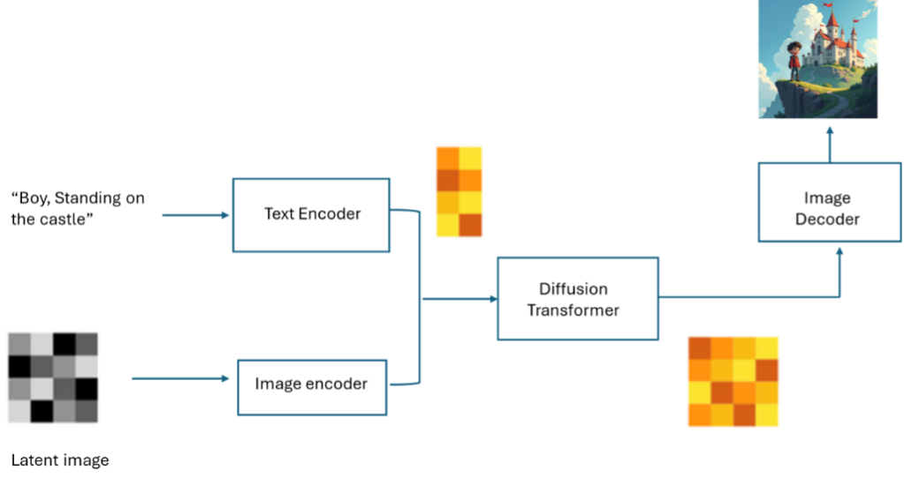
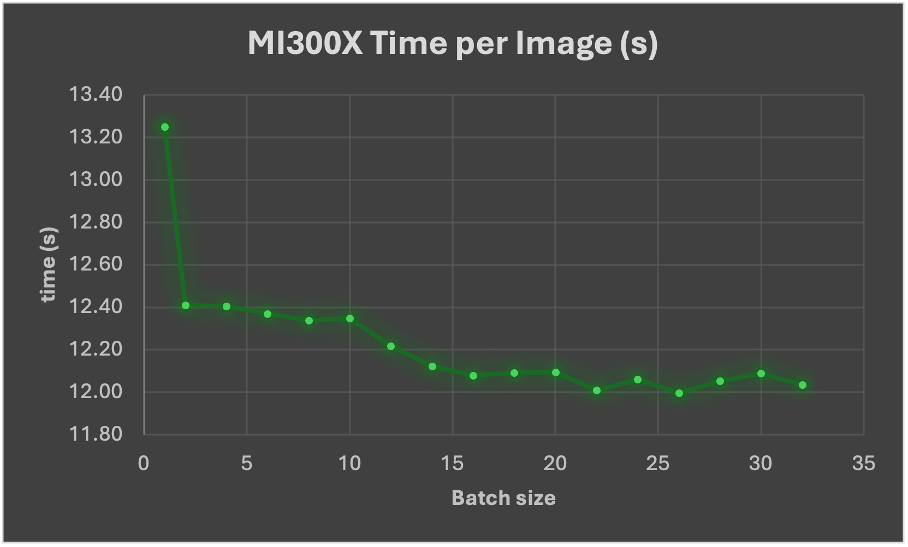

<!---
Copyright (c) 2025 Advanced Micro Devices, Inc. (AMD)

Permission is hereby granted, free of charge, to any person obtaining a copy
of this software and associated documentation files (the "Software"), to deal
in the Software without restriction, including without limitation the rights
to use, copy, modify, merge, publish, distribute, sublicense, and/or sell
copies of the Software, and to permit persons to whom the Software is
furnished to do so, subject to the following conditions:

The above copyright notice and this permission notice shall be included in all
copies or substantial portions of the Software.

THE SOFTWARE IS PROVIDED "AS IS", WITHOUT WARRANTY OF ANY KIND, EXPRESS OR
IMPLIED, INCLUDING BUT NOT LIMITED TO THE WARRANTIES OF MERCHANTABILITY,
FITNESS FOR A PARTICULAR PURPOSE AND NONINFRINGEMENT. IN NO EVENT SHALL THE
AUTHORS OR COPYRIGHT HOLDERS BE LIABLE FOR ANY CLAIM, DAMAGES OR OTHER
LIABILITY, WHETHER IN AN ACTION OF CONTRACT, TORT OR OTHERWISE, ARISING FROM,
OUT OF OR IN CONNECTION WITH THE SOFTWARE OR THE USE OR OTHER DEALINGS IN THE
SOFTWARE.
--->

# Bring FLUX to Life on MI300X: Run and Optimize with Hugging Face Diffusers

AI based text-to-image generation is pushing the boundaries of creative and visual storytelling, enabling the critical mass to draw like an artist.
[Stability AI](https://stability.ai) introduced stable diffusion models which was a breakthrough in text to image generation. However, FLUX - a new state-of-the-art open-source model released by [Black Forest Labs](https://blackforestlabs.ai/),
is gaining popularity for its flexibility and controllability.

This blog walks you through running FLUX with Hugging Face’s Diffusers library on AMD’s Instinct<sup>TM</sup>MI300X GPU. Whether you’re a researcher, developer, or AI artist, let us show you, step-by-step, how to unleash high-performance image generation using AMD hardware with minimal setup.

## Model Architecure

There are 3 FLUX models available, **FLUX.1-Pro**, **FLUX.1-Dev**, **FLUX.1-Schnell**. FLUX.1-Dev is the most popular FLUX model to run locally, scaling up to 12B parameters.
It utilizes a hybrid architecture that combines multimodal and parallel diffusion transformer blocks,
and leverages advanced features like flow matching, rotary positional embeddings and parallel attention layers.

| | |
|:---:|:---:|
|  |  |
| Figure 1. Cat, standing on the castle | Figure 2. Boy, standing on the castle |

Similar to stable diffusion models, FLUX also uses text and image encoders to encode text and image inputs into latent vectors, a denoising loop, and an image decoder.
FLUX a DiT (Diffusion Transformer) model for denoising which replaces the U-Net in the original Diffusion model with Transformer.


<div align=center>
Figure 3. FLUX Model Diagram
</div>

FLUX.1-Schnell and FLUX.1-dev are integrated with Hugging Face diffusers library, which is the go-to library for state-of-the-art pretrained diffusion models for generating images, audio, and 3D objects.
Below is the explanation on how to call the FLUX Pipeline in diffusers.

```bash
import torch
from diffusers import FLUXPipeline
-
 model_id = "black-forest-labs/FLUX.1-schnell" #you can also use black-forest-labs/FLUX.1-dev
-
 pipe = FLUXPipeline.from_pretrained("black-forest-labs/FLUX.1-schnell", torch_dtype=torch.bfloat16)

pipe.enable_model_cpu_offload() #save some VRAM by offloading the model to CPU. Remove this if you have enough GPU power

prompt = "A cat holding a sign that says hello world"
seed = 42 image = pipe(
Prompt, 
output_type="pil",
num_inference_steps=4, #use a larger number if you are using [dev]
generator=torch.Generator("cpu").manual_seed(seed) 
).images[0] 
image.save("FLUX-schnell.png")
```

## Steps to Run FLUX on MI300X

Let's walk through how to run FLUX on Instinct MI300x with the Hugging Face diffuser.

- Step 1: Docker pull `rocm/pytorch:latest`

- Step 2: Docker run:

  ```bash
  docker run -it -d --cap-add=SYS_PTRACE --security-opt seccomp=unconfined --device=/dev/kfd --device=/dev/dri --group-add video --ipc=host --network=host --shm-size 
  8G --name FLUX -v $CACHE_DIR:/root/.cache rocm/pytorch:latest
  ```

- Step 3: Clone diffuser repo: git clone https://github.com/huggingface/diffusers.git

- Step 4: Install packages:

  `pip install --upgrade diffusers[torch] transformers sentencepiece`

- Step 5: Modify scripts in /diffusers/benchmarks folder:

  ```bash
  base_classes.py
  add FluxPipeline in 
  
  from diffusers import (
      AutoPipelineForImage2Image,
      AutoPipelineForInpainting,
      AutoPipelineForText2Image,
      ControlNetModel,
      LCMScheduler,
      StableDiffusionAdapterPipeline,
      StableDiffusionControlNetPipeline,
      StableDiffusionXLAdapterPipeline,
      StableDiffusionXLControlNetPipeline,
      T2IAdapter,
      WuerstchenCombinedPipeline,
      FluxPipeline,
  )
  ```

  Add Flux model
  
  ```bash
  RESOLUTION_MAPPING = {
      "runwayml/stable-diffusion-v1-5": (512, 512),
      "lllyasviel/sd-controlnet-canny": (512, 512),
      "diffusers/controlnet-canny-sdxl-1.0": (1024, 1024),
      "TencentARC/t2iadapter_canny_sd14v1": (512, 512),
      "TencentARC/t2i-adapter-canny-sdxl-1.0": (1024, 1024),
      "stabilityai/stable-diffusion-2-1": (768, 768),
      "stabilityai/stable-diffusion-xl-base-1.0": (1024, 1024),
      "stabilityai/stable-diffusion-xl-refiner-1.0": (1024, 1024),
      "stabilityai/sdxl-turbo": (512, 512),
      "etri-vilab/koala-1b": (1024, 1024),
      "**black-forest-labs/FLUX.1-dev**": (1024,1024),
  }
  ```
  
  benchmark_text_to_image.py
  add Flux model
  
  ```bash
  ALL_T2I_CKPTS = [
      "runwayml/stable-diffusion-v1-5",
      "segmind/SSD-1B",
      "stabilityai/stable-diffusion-xl-base-1.0",
      "kandinsky-community/kandinsky-2-2-decoder",
      "warp-ai/wuerstchen",
      "stabilityai/sdxl-turbo",
      "etri-vilab/koala-1b",
      "**black-forest-labs/FLUX.1-dev**",
  ]
  ```

- Step 6: Run command:

  ```bash
  python benchmarks/benchmark_text_to_image.py --ckpt "black-forest-labs/FLUX.1-dev" --dtype BF16 --batch_size 1
  ```

**Result**: Figure 4 below shows that with higher batch size, image generation time is reduced, specially from batch 1 to batch 2.


<div align=center>
Figure 4. MI300X results per image generation time w.r.t batch size
</div>

## Summary

As diffusion models are getting more and more popular in many applications for text to image generation,
efficiently running these models are critical on AMD hardware. FLUX is state-of-the-art text-to-image generation model,
and its performance / quality surpass other diffusion models, it runs efficiently and smoothly on AMD Instinct MI300X GPUs with minimal modification in Hugging Face diffusers.
This blog covers FLUX’s architecture, installation steps, pipeline setup, and performance tuning tips, including benchmark data showing the impact of batch size on image generation time. We are committed to support future releases of text to image models, and accelerate new features including multi-framework support
(Jax, pytorch, etc.), multi-GPU support, etc.  

## Acknowledgements

Thanks to the following colleagues for their participation and contributions, bringing better Gen-AI applications to the community:
Clint Greene, Venkateswara Rao Cherukuri and Shekhar Pandey.

## Resources

[Accelerate inference of text-to-image diffusion models](https://huggingface.co/docs/diffusers/main/en/tutorials/fast_diffusion).

[black-forest-labs/FLUX: Official inference repo for FLUX.1 models](https://github.com/black-forest-labs/flux).

[huggingface/diffusers: 🤗 Diffusers: State-of-the-art diffusion models for image, video, and audio generation in PyTorch and FLAX.](https://github.com/huggingface/diffusers).

## Disclaimers

Third-party content is licensed to you directly by the third party that owns the
content and is not licensed to you by AMD. ALL LINKED THIRD-PARTY CONTENT IS
PROVIDED “AS IS” WITHOUT A WARRANTY OF ANY KIND. USE OF SUCH THIRD-PARTY CONTENT
IS DONE AT YOUR SOLE DISCRETION AND UNDER NO CIRCUMSTANCES WILL AMD BE LIABLE TO
YOU FOR ANY THIRD-PARTY CONTENT. YOU ASSUME ALL RISK AND ARE SOLELY RESPONSIBLE
FOR ANY DAMAGES THAT MAY ARISE FROM YOUR USE OF THIRD-PARTY CONTENT.
