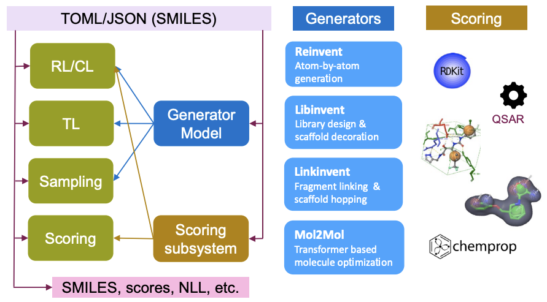

<!---
Copyright (c) 2025 Advanced Micro Devices, Inc. (AMD)

Permission is hereby granted, free of charge, to any person obtaining a copy
of this software and associated documentation files (the "Software"), to deal
in the Software without restriction, including without limitation the rights
to use, copy, modify, merge, publish, distribute, sublicense, and/or sell
copies of the Software, and to permit persons to whom the Software is
furnished to do so, subject to the following conditions:

The above copyright notice and this permission notice shall be included in all
copies or substantial portions of the Software.

THE SOFTWARE IS PROVIDED "AS IS", WITHOUT WARRANTY OF ANY KIND, EXPRESS OR
IMPLIED, INCLUDING BUT NOT LIMITED TO THE WARRANTIES OF MERCHANTABILITY,
FITNESS FOR A PARTICULAR PURPOSE AND NONINFRINGEMENT. IN NO EVENT SHALL THE
AUTHORS OR COPYRIGHT HOLDERS BE LIABLE FOR ANY CLAIM, DAMAGES OR OTHER
LIABILITY, WHETHER IN AN ACTION OF CONTRACT, TORT OR OTHERWISE, ARISING FROM,
OUT OF OR IN CONNECTION WITH THE SOFTWARE OR THE USE OR OTHER DEALINGS IN THE
SOFTWARE.
--->

# Optimizing Drug Discovery Tools on AMD MI300X Part 1: Molecular Design with REINVENT

This blog is part of a series of walkthroughs of Life Science AI models, stemming from [this article](https://www.amd.com/en/blogs/2025/astrazeneca-improved-life-sciences-model-training-time.html) which was a collaborative effort between AstraZeneca and AMD. The series delves into what was required in order to run drug discovery related AI workloads on AMD MI300X. This blog, in particular, looks at REINVENT4, a powerful molecular design tool that leverages advanced algorithms for de novo design, scaffold hopping, R-group replacement, linker design, and molecule optimization.

We show how minimal code changes can get you started, and we outline key steps to optimize such workloads on AMD hardware. The environment used was a TensorWave node with 8 MI300Xs.

REINVENT4 uses a Reinforcement Learning (RL) algorithm to generate
optimized molecules according to a user-defined property profile
expressed as a multi-component score. REINVENT4 supports multiple run modes (see [Figure 1](#fig1)). In this blog, we focus on Transfer Learning (TL). TL can be used
to create or pre-train a model that generates molecules closer to a set
of input molecules.

<a id="fig1"></a>


*Figure 1. Information flow in REINVENT4 for all run modes (green boxes) depicted in the left column.*

Next, we will cover the steps required to create a Dockerfile to run REINVENT4 in a containerized environment and detail some optimizations that improve the performance on MI300X GPUs.

## REINVENT4 Code

REINVENT4 is developed on Linux, written in Python and uses PyTorch for
neural network implementations. With PyTorch being supported by ROCm, REINVENT4 should be easy to run on AMD GPUs. REINVENT4 runs are defined in configuration files. Here,
parameters such as run mode, hyperparameters, input files, etc. REINVENT4
also allows multiple run modes to be chained together and can be
defined in a single configuration file.

### Installation

After looking at the repository installation steps, it seems to already
be supported on AMD hardware. There are even instructions for installing REINVENT4
on Windows and Mac. The installation seems straightforward enough. One
simply needs to clone the repository, create a Conda environment, and run
the `install.py` script which installs required packages using pip. This
method of installation allows the user to simply use the version of ROCm that
you have installed on your system (e.g. rocm6.2.4), and the installation
will install the specific PyTorch version compatible with ROCm. This set
of steps will allow you to quickly get started on a bare-metal machine.

To work on a Kubernetes cluster, we need a dockerizable recipe. The rest of the blog assumes working in such a cloud environment, so let's get started.

### Dockerizing REINVENT4

The simplest way to work with ROCm and PyTorch installations is to use a
base image with these packages already installed. There are many
different versions that can be found [here](<https://hub.docker.com/r/rocm/pytorch>). The base image used was `rocm/pytorch:rocm6.3.3_ubuntu22.04_py3.10_pytorch_release_2.2.1`.

The authors propose in the README to run `python install.py`. This forces the installation of `PyTorch`, which would not work. The first approach to circumvent this was to source the required packages needed from the `pyproject.toml` file. They are found in that file under "dependencies" and were put in a `requirements.txt` file. This solution has the drawback of needing manual updates as the package list in the original repo is updated, which is undesirable. What was done instead was to add two lines in the Dockerfile to remove the `torch` and `torchvision` entries in the `pyproject.toml`. This then allowed for a REINVENT4 install as the authors intended:

```Dockerfile
# Remove torch and torchvision from pyproject.toml
RUN sed -i.bak '/torch==/d' pyproject.toml && \
    sed -i.bak '/torchvision /d' pyproject.toml
```

One last thing before the Docker image is complete is to add some way for it to
know what to run. This was done using an entrypoint-script:

```sh
#!/bin/bash
CONFIG_FILE="$1"
OUTPUT_FILE="$2"
# Check if OUTPUT ends with ".log" and append it if not  
if [[ ! "$OUTPUT_FILE" =~ .log$ ]]; then  
    OUTPUT_FILE="${OUTPUT_FILE}.log"  
fi  
if [ -n "$CONFIG_FILE" ] && [ -n "$OUTPUT_FILE" ]; then  
    echo "Config file provided: $CONFIG_FILE"  
    echo "Output file provided: $OUTPUT_FILE"  
    echo "Running software in automated mode..."  
    # Set the correct permissions for the config file  
    chmod +r "$CONFIG_FILE"        
    exec reinvent -l "$OUTPUT_FILE" "$CONFIG_FILE"  
    echo "Processing complete. Results saved in $(dirname "$OUTPUT_FILE")."  
else  
    echo "No config file or output file provided. Starting interactive mode..."  
    exec /bin/bash  
fi 
```

It allows for two parameters to be provided to the container: the config
file and output file. If you need to debug the container or the code, no
arguments can be provided and the container will spin up normally.

Finally, this is the Dockerfile:

```Dockerfile
FROM rocm/pytorch:rocm6.3.3_ubuntu22.04_py3.10_pytorch_release_2.2.1

# Use bash to support string substitution.
SHELL ["/bin/bash", "-o", "pipefail", "-c"]

RUN git clone https://github.com/MolecularAI/REINVENT4
WORKDIR REINVENT4

# Remove torch and torchvision from pyproject.toml
RUN sed -i.bak '/torch==/d' pyproject.toml && \
    sed -i.bak '/torchvision /d' pyproject.toml

# Now run the install script as usual
RUN python install.py cpu

# Copy entrypoint script
COPY entrypoint.sh /
RUN chmod +x /entrypoint.sh

# Set the entrypoint script as default and allow passing parameters
ENTRYPOINT ["/entrypoint.sh"]
CMD ["", ""]
```

After the image is built, it can simply be run by:

```sh
docker run -d \
  --device=/dev/kfd \
  --device=/dev/dri/renderD<GPU_ID> \
  -v $CONFIG_PATH:/data \
  -v $OUTPUT_PATH:/output \
  --name <container_name> \
  <image name> \
  <config_path\> \
  <output_path\>
```

In the docker run command above, 2 volumes are mounted - one for the config path and one for outputs. You can also see that the last two arguments pass the config file and output path to REINVENT4.

Further simplifications to the docker run command can be made by preferring the Docker Compose tool. The main usage of Docker Compose is defining and running multi-container applications (such as a separate
database and a UI for a web app), but it is also quite useful for
managing single-container applications, especially when testing
many different configurations to find the best solution. Here is the docker-compose file that was used:

```yml
services:
  reinvent-benchmark:
    build:
      context: .
      dockerfile: Dockerfile
    network_mode: host
    devices:
      - /dev/kfd
      - /dev/dri/renderD<GPU_ID>
    group_add:
      - video
    security_opt:
      - seccomp=unconfined
    cap_add:
      - SYS_PTRACE
    tty: true
    volumes:
      - <config_dir>:/data
      - <output_dir>:/output
    command: ["/bin/bash",  "-c", "reinvent -l <output_file> <config_file>"]
```

It can be run by:

```sh
docker compose -f docker-compose.yml up --build
```

## Optimization

The dataset used was [ChEMBL35](<https://ftp.ebi.ac.uk/pub/databases/chembl/ChEMBLdb/releases/chembl_35/>), which is an open source dataset of bioactive molecules with drug-like properties. As mentioned previously, the run mode primarily tested was TL (Transfer Learning), which can be seen as fine-tuning an existing model in the drug discovery space. The existing model (or prior model) was LSTM-based models of varying sizes. To further improve training performance on AMD GPUs, several optimization strategies were explored using the ChEMBL35 dataset in Transfer Learning (TL) mode with LSTM-based models. The goal was to identify changes that could accelerate training without compromising model quality.

### PyTorch Automatic Mixed Precision (AMP)

PyTorch's Automatic Mixed Precision (AMP) package is a popular technique that automatically scales operations to use lower
precision formats (such as float16) while preserving accuracy. This
enables faster computations and decreases memory usage during training.
It simplifies the workflow by offering context managers and decorators,
such as `autocast` and `GradScaler`.

More practically, the [`_train_epoch_common`](https://github.com/MolecularAI/REINVENT4/blob/3266e54bbe148831796477577d977de8cfbdeb05/reinvent/runmodes/TL/learning.py#L220) function in `REINVENT4/reinvent/runmodes/TL/learning.py` was modified using PyTorch `GradScaler` as follows:

```Python
def _train_epoch_common(self) -> float:
  """Run one epoch of training

  :returns: mean negative log likelihood over all SMILES
  """

  scaler = torch.GradScaler()
  mean_epoch_nlls = np.zeros(len(self.dataloader))

  for step, batch in enumerate(self.dataloader):
    with torch.autocast(
        "cuda:0", enabled=os.environ.get("__AUTOCAST", "0") == "1"):
        nll = self.compute_nll(batch)
        loss = nll.mean()
        mean_epoch_nlls[step] = loss.item()

    self._optimizer.zero_grad(set_to_none=True)
    scaler.scale(loss).backward()

    if self.clip_gradient_norm > 0:
      scaler.unscale_(self._optimizer)
      clip_grad_norm_(
          self.model.network.parameters(), self.clip_gradient_norm
      )
    scaler.step(self._optimizer)
  
  scaler.update()

  self._lr_scheduler.step()  # Mol2Mol does this once per batch

  return mean_epoch_nlls.mean()
```

This AMP implementation worked out-of-the-box, with observed training time reductions of 10–60%.

### Explored but Unproductive Optimizations

MIOpen, AMD’s deep learning library, offers auto-tuning via `MIOPEN_FIND_MODE` and `MIOPEN_FIND_ENFORCE`. Enabling these did not improve speed, likely because auto-tuning mainly benefits convolutional layers, which are not the primary component of the models.

PyTorch’s `torch.compile` and `TunableOp` features also showed no speedup beyond what Automatic Mixed Precision (AMP) provided. For this workload, AMP delivered the main performance gains, while further optimizations had minimal impact.

## Summary

The Transfer Learning (TL) run mode of the REINVENT4 package ran seamlessly
out-of-the-box on an AMD MI300X with no code change or engineering effort required.
Further improvements can be achieved by enabling Automatic Mixed Precision.
This change reduced training time by 10-60%. Significant gains in speed were also observed when increasing the batch size.

For more information about Life Science AI models on AMD hardware, check out the original [article](https://www.amd.com/en/blogs/2025/astrazeneca-improved-life-sciences-model-training-time.html) and stay tuned for the second blog in this series, which discusses SemlaFlow, another molecular generation model used in drug discovery workflows.

## Additional Resources

The official REINVENT4 repo can be found
[here](https://github.com/MolecularAI/REINVENT4/tree/main).

The official REINVENT4 paper can be found
[here](https://jcheminf.biomedcentral.com/articles/10.1186/s13321-024-00812-5).

## Disclaimers

Third-party content is licensed to you directly by the third party that owns the
content and is not licensed to you by AMD. ALL LINKED THIRD-PARTY CONTENT IS
PROVIDED “AS IS” WITHOUT A WARRANTY OF ANY KIND. USE OF SUCH THIRD-PARTY CONTENT
IS DONE AT YOUR SOLE DISCRETION AND UNDER NO CIRCUMSTANCES WILL AMD BE LIABLE TO
YOU FOR ANY THIRD-PARTY CONTENT. YOU ASSUME ALL RISK AND ARE SOLELY RESPONSIBLE
FOR ANY DAMAGES THAT MAY ARISE FROM YOUR USE OF THIRD-PARTY CONTENT.
