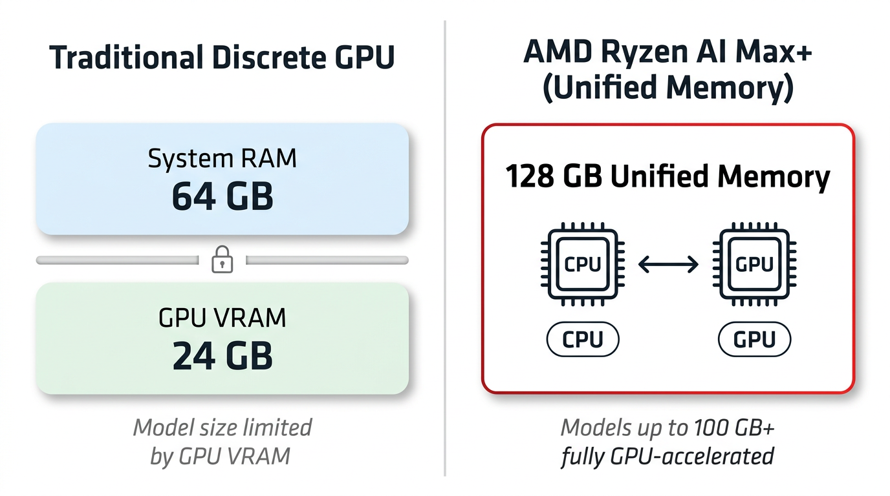
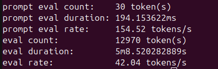
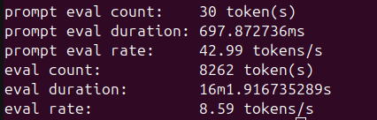

<!---
Copyright (c) 2026 Advanced Micro Devices, Inc. (AMD)

Permission is hereby granted, free of charge, to any person obtaining a copy
of this software and associated documentation files (the "Software"), to deal
in the Software without restriction, including without limitation the rights
to use, copy, modify, merge, publish, distribute, sublicense, and/or sell
copies of the Software, and to permit persons to whom the Software is
furnished to do so, subject to the following conditions:

The above copyright notice and this permission notice shall be included in all
copies or substantial portions of the Software.

THE SOFTWARE IS PROVIDED "AS IS", WITHOUT WARRANTY OF ANY KIND, EXPRESS OR
IMPLIED, INCLUDING BUT NOT LIMITED TO THE WARRANTIES OF MERCHANTABILITY,
FITNESS FOR A PARTICULAR PURPOSE AND NONINFRINGEMENT. IN NO EVENT SHALL THE
AUTHORS OR COPYRIGHT HOLDERS BE LIABLE FOR ANY CLAIM, DAMAGES OR OTHER
LIABILITY, WHETHER IN AN ACTION OF CONTRACT, TORT OR OTHERWISE, ARISING FROM,
OUT OF OR IN CONNECTION WITH THE SOFTWARE OR THE USE OR OTHER DEALINGS IN THE
SOFTWARE.
--->

# AI Inference on AMD Ryzen™ AI Max Processor

Local large language model (LLM) inference has rapidly evolved, but a persistent limitation remains: model size is constrained by available GPU memory. Discrete GPUs typically offer 8–24 GB of dedicated VRAM, which can limit the size of models that can run without incurring significant quality loss from aggressive quantization. As frontier open-weight models grow past 70B and 100B parameters, this gap is forcing more developers toward multi-GPU rigs or paid cloud endpoints just to evaluate a single checkpoint.

AMD Ryzen™ AI Max+ processors with AMD Radeon™ 8060S integrated graphics change that equation. With up to 128 GB of unified memory shared between CPU and GPU, the entire memory pool is accessible for AI workloads — enabling models with 100 billion or more parameters to run on a single system, with no second card and no cloud bill.

If you build, evaluate, or self-host LLMs on AMD hardware, this blog gives you a concrete, reproducible path to take advantage of that. By the end you will know how to:

- Set up Ollama on Ubuntu with AMD ROCm™ technology on an AMD Ryzen™ AI Max+ processor-based system;
- Configure and reason about Unified Memory Architecture (UMA), including the GPU-accessible memory slice;
- Run Qwen3.5 across three size tiers — 9B (dense), 35B-A3B (MoE), and 122B-A10B (MoE) — and interpret Ollama’s `--verbose` performance output;
- Decide which model size best fits your latency, quality, and capacity targets on a single Ryzen™ AI Max+ processor-based system.

The **122B tier** is the headline *capacity* story (weights + runtime on one machine); all generation benchmarks shown later were collected with **Ollama** on the same AMD Ryzen™ AI Max+ processor-based system.

## System Requirements

| Component | Specification |
|-----------|--------------|
| Processor | AMD Ryzen™ AI Max+ 395 |
| Integrated GPU | AMD Radeon™ 8060S Graphics (RDNA 3.5) |
| Total System Memory | 128 GB LPDDR5X (Unified) |
| GPU-Accessible memory | 64 GB (configurable) |
| Operating System | Ubuntu 24.04 LTS |
| AMD ROCm™ Version | 7.2.1 (HSA Runtime 1.18) |
| Ollama Version | 0.20.x |

## Understanding Unified Memory Architecture

Traditional discrete GPUs have dedicated VRAM separate from system RAM. A GPU with 24 GB of VRAM can only hold models that fit within that 24 GB, regardless of how much system RAM is available.

AMD Ryzen™ AI Max+ processors use a Unified Memory Architecture (UMA), where the CPU and GPU share the same physical memory pool. On a 128 GB system, the GPU-accessible portion can be configured to 64 GB or more through BIOS settings, with the remainder available for the operating system and applications.

This means models that would require multiple discrete GPUs — or cloud-hosted instances — can often run on a single AMD Ryzen™ AI Max+ processor-based system; smaller models can use 100% GPU offloading, while the largest models use CPU/GPU mixed loading when they exceed the GPU-accessible slice.

Figure 1 below contrasts unified memory with a typical discrete-VRAM model.



*Figure 1: Unified Memory Architecture — CPU and GPU share the same 128 GB memory pool, enabling large model inference without dedicated VRAM limitations.*

## Installation Guide

### Recommended Method: Ollama

Ollama provides a streamlined installation and model management experience. On Ubuntu 24.04 with AMD ROCm™ software already installed:

```bash
curl -fsSL https://ollama.com/install.sh | sh
```

Download and run the model:

```bash
ollama pull qwen3.5:35b
ollama run qwen3.5:35b
```

Verify GPU acceleration is active:

```bash
ollama ps
```

The output should show `100% GPU`, confirming all model layers are offloaded to the AMD Radeon™ 8060S integrated GPU.

## Performance Benchmarks

We tested three Qwen3.5 models at Q4_K_M quantization, representing different points on the size–performance spectrum. The **headline result** is that **122B-class** weights can run locally on AMD Ryzen™ AI Max+ CPU with 128 GB UMA; most of the **hard numbers** below therefore cover 9B / 35B / 122B **end-to-end generation** (Ollama). The 9B and 35B models ran with 100% GPU offloading. The 122B model, at 76 GB, exceeds the 64 GB GPU-accessible memory allocation and uses a CPU/GPU mixed loading configuration (61% GPU, 39% CPU), which is automatically managed by Ollama.

### Token Generation Speed

| Model | Total Parameters | Active Parameters | Model Size | Generation Speed |
|-------|-----------------|-------------------|------------|-----------------|
| Qwen3.5 9B | 9B (dense) | 9B | 6.2 GB | 29.84 tok/s |
| Qwen3.5 35B-A3B | 35B (MoE) | 3B | 20.5 GB | 42.04 tok/s |
| Qwen3.5 122B-A10B | 122B (MoE) | 10B | 76 GB | 8.59 tok/s (61% GPU / 39% CPU) |

The 35B model achieves a higher generation speed than the 9B model due to its Mixture-of-Experts (MoE) architecture: despite having 35 billion total parameters, only 3 billion are active per token, resulting in faster inference.

The 122B model — at 76 GB — runs with CPU/GPU mixed loading. With a higher GPU memory allocation in the BIOS (depending on system vendor and BIOS support), more layers can be offloaded to the GPU for additional performance.

Figure 2 shows verbose generation statistics for the 35B MoE model; Figure 3 shows the 122B MoE model under mixed CPU/GPU loading.



*Figure 2: `ollama run qwen3.5:35b --verbose` generation statistics on AMD Ryzen™ AI Max+ CPU. The 35B MoE model achieves 42.04 tok/s generation throughput and 154.52 tok/s prompt processing with 100% GPU offloading.*



*Figure 3: `ollama run qwen3.5:122b --verbose` generation statistics on AMD Ryzen™ AI Max+ CPU. The 122B MoE model achieves 8.59 tok/s generation throughput with CPU/GPU mixed loading (61% GPU / 39% CPU).*

The exact hardware and software configuration used for these results is listed under the **Test environment disclosure** section at the end of this post.

## Recommended Configurations

| Use Case | Model | Expected Generation Speed | Notes |
|----------|-------|--------------------------|-------|
| Fast interactive chat | Qwen3.5 35B-A3B | ~42 tok/s | Strong speed-to-quality balance among the three checkpoints tested |
| Large-capacity workloads | Qwen3.5 122B-A10B | ~8.6 tok/s | Largest checkpoint covered in this post |
| Lightweight tasks | Qwen3.5 9B | ~30 tok/s | Smallest memory footprint of the three checkpoints tested |

### Memory Management Best Practices

With unified memory, the GPU and operating system share the same physical memory pool. For practical performance:

- **Monitor memory usage** with `rocm-smi` to verify GPU memory allocation during inference
- **Adjust context length** based on model size — larger models with long context windows consume more memory from the shared pool
- **Close memory-intensive desktop applications** when running the largest models to ensure sufficient memory is available for inference

## Additional Resources

- [AMD ROCm Installation Guide](https://rocm.docs.amd.com/projects/install-on-linux/en/latest/)
- [Ollama](https://ollama.com)
- [AMD ROCm Developer Hub](https://www.amd.com/en/developer/resources/rocm-hub.html)

## Summary

In this blog you explored what a 128 GB Unified Memory Architecture changes for local LLM inference on AMD Ryzen™ AI Max+ processor. You set up Ollama on Ubuntu with AMD ROCm™ software, then ran Qwen3.5 across 9B, 35B-A3B (MoE), and 122B-A10B (MoE) on a single system — fully GPU-offloaded for the smaller checkpoints, and CPU/GPU mixed for the 76 GB 122B-class model that Ollama transparently splits across the unified memory pool.

Key takeaways:

1. **128 GB unified memory enables 100B+ parameter models on a single system.** The Qwen3.5 122B model, at 76 GB, runs on AMD Ryzen™ AI Max+ processor with CPU/GPU mixed loading.

2. **Setup is straightforward.** Ollama provides a single-command installation; smaller checkpoints offload fully to the GPU, while the largest may use CPU/GPU mixed loading when they exceed the GPU-accessible memory slice.

3. **Performance is practical for interactive use.** The 35B model delivers ~42 tok/s generation speed, and the 122B model maintains ~8.6 tok/s for conversational workloads.

We are continuing to explore on-device AI on AMD Ryzen™ AI Max+ processors — including memory and BIOS tuning for longer context windows, throughput comparisons across additional model families, and end-to-end developer workflows on the AMD ROCm™ software platform. Stay tuned for upcoming posts from our team. In the meantime, download [Ollama](https://ollama.com) and try these Qwen3.5 checkpoints on your own AMD Ryzen™ AI Max+ processor-based system.

## Test environment disclosure

All benchmarks were collected on AMD Ryzen™ AI Max+ 395 with 128 GB unified memory, 64 GB allocated to GPU, running Ubuntu 24.04 LTS, ROCm 7.2.1, and Ollama 0.20.x. Performance may vary based on system configuration, memory allocation, operating system, and software versions.

## Disclaimers

Third-party content is licensed to you directly by the third party that owns the
content and is not licensed to you by AMD. ALL LINKED THIRD-PARTY CONTENT IS
PROVIDED “AS IS” WITHOUT A WARRANTY OF ANY KIND. USE OF SUCH THIRD-PARTY CONTENT
IS DONE AT YOUR SOLE DISCRETION AND UNDER NO CIRCUMSTANCES WILL AMD BE LIABLE TO
YOU FOR ANY THIRD-PARTY CONTENT. YOU ASSUME ALL RISK AND ARE SOLELY RESPONSIBLE
FOR ANY DAMAGES THAT MAY ARISE FROM YOUR USE OF THIRD-PARTY CONTENT.

Ollama is a product of Ollama, Inc. Qwen is a model series by Alibaba Cloud. Ubuntu is a trademark of Canonical Ltd. All other product names, logos, and brands are property of their respective owners.

The information contained herein is for informational purposes only and is subject to change without notice. While every precaution has been taken in the preparation of this document, it may contain technical inaccuracies, omissions and typographical errors, and AMD is under no obligation to update or otherwise correct this information. Advanced Micro Devices, Inc. makes no representations or warranties with respect to the accuracy or completeness of the contents of this document, and assumes no liability of any kind, including the implied warranties of noninfringement, merchantability or fitness for particular purposes, with respect to the operation or use of AMD hardware, software or other products described herein. No license, including implied or arising by estoppel, to any intellectual property rights is granted by this document. Terms and limitations applicable to the purchase or use of AMD products are set forth in a signed agreement between the parties or in AMD's Standard Terms and Conditions of Sale. GD-18u.

© 2026 Advanced Micro Devices, Inc. All rights reserved. AMD, the AMD Arrow logo, Radeon, ROCm, Ryzen, and combinations thereof are trademarks of Advanced Micro Devices, Inc. Other product names used in this publication are for identification purposes only and may be trademarks of their respective owners. Certain AMD technologies may require third-party enablement or activation. Supported features may vary by operating system. Please confirm with the system manufacturer for specific features. No technology or product can be completely secure.
