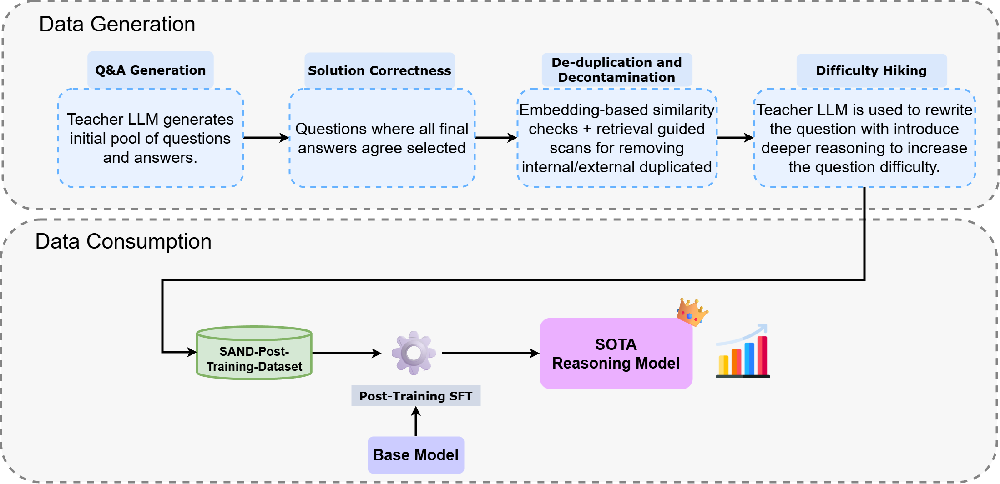

# Building a State-of-the-Art 32 Billion Reasoning Model with Only Synthetic Data on AMD GPUs

Building a state-of-the-art reasoning model is often viewed as a resource-heavy marathon requiring massive compute, months of training, and proprietary datasets. In this blog, we demonstrate how we built a large reasoning model on AMD Instinct™ MI325 GPUs that surpasses the accuracy of the top 32 Billion sized open models on mathematics and science benchmarks, using only synthetic data and with standard Supervised Fine-Tuning (SFT) on top of older-generation models. In line with AMD’s commitment to open source, we are releasing the model weights, detailed training configurations, datasets, and code, enabling the AI community to collaborate, replicate, and innovate, thereby accelerating progress.

## Key Takeaways

*   **Scalable Synthetic Data Pipeline:** We present a fully automated pipeline running on the AMD ROCm™ software and AMD Instinct™ MI325X GPUs that generate difficult, novel math and science problems. 
*   **Complete Open-Source Release:** We are releasing all the artifacts to the community, including:
      - High-quality [reasoning datasets](https://huggingface.co/datasets/amd/SAND-Post-Training-Dataset)
      - Data generation [pipeline code](https://github.com/AMD-AGI/sand-pipeline)
      - Fine-tuned model checkpoints:  [SAND-Math-Qwen2.5-32B](https://huggingface.co/amd/SAND-Math-Qwen2.5-32B) based on [Qwen2.5-32B-Instruct](https://huggingface.co/Qwen/Qwen2.5-32B-Instruct), and [SAND-MathScience-DeepSeek-Qwen32B](https://huggingface.co/amd/SAND-MathScience-DeepSeek-Qwen32B) based on [DeepSeek-R1-Distill-Qwen-32B](https://huggingface.co/deepseek-ai/DeepSeek-R1-Distill-Qwen-32B).
*   **Data Efficient post-training:** we demonstrate how we outperforms some of the other data distillation and SFT approaches using a significantly smaller but high-quality dataset.
*   **Generational Leap:** Our SAND-MathScience-DeepSeek-Qwen32B, fine-tuned from older DeepSeek-R1-Distill-Qwen-32B model, achieves a generational leap by surpassing the the performance of relatively newer and better Qwen3-32B on key math and science benchmarks—for example 76.41% on AIME25 vs. Qwen3’s 72.9%.
  
Developing mathematical reasoning models requires datasets that are difficult, diverse, and logically rich. Recent works [^1][^2] have highlighted a critical insight: the strongest improvements do not come from simply adding more data randomly, but from exposing models to challenging problems that force multi-step reasoning.
* High-quality human-curated data is labor-intensive to produce and limited in supply. Popular datasets [^3][^4][^5][^6] often rely heavily on historical Olympiad problems. Crucially, many of these datasets trace their lineage back to common origins like NuminaMath-1.5 [^7]. Because the original dataset relies on scraping finite online forums and examination PDFs, the datasets are limited to the same pool of questions.
* On the other side of the spectrum, open-source synthetic datasets [^8][^9][^10] depend on "seed" samples from sources like GSM8K, MATH or NuminaMath. While valuable, these datasets are constrained by the difficulty level as well as diversity of their seeds. This creates a ceiling for reasoning model improvement.

To solve this, we have proposed a synthetic data generation pipeline running on the AMD ROCm™ software, as shown in Figure 1. This pipeline leverages the meta-cognitive capabilities of large "Teacher" models to generate novel, high-difficulty data. Crucially, our approach is not dependent on seed questions. By removing the reliance on existing datasets and expert level human intervention, we eliminate the bias and difficulty constraints of previous methods, creating a truly scalable stream of complex reasoning data designed to unlock the full potential of smaller "Student" models. 


*Figure 1: Overview of the end-to-end synthetic data generation, curation, and data consumption pipeline. The workflow illustrates the multi-stage process used to create high-quality synthetic datasets for Supervised Fine-Tuning (SFT).*

## Step 1: Synthetic Data Generation

Our data generation pipeline is designed to produce difficult, novel, and logically consistent problems in a fully automated manner efficiently on AMD hardware using any strong LLM as a teacher model. The process is organized into three stages:
### Stage 1: QA Generation & Solution Correctness
The teacher model produces problems from scratch. To ensure correctness, the model generates multiple independent solutions to the same question. Only items where all final answers agree proceed to the next stage. 
### Stage 2: De-duplication and Decontamination
We employ embedding-based similarity checks to eliminate internal duplicates and retrieval-guided scans to screen against known test datasets. Any item with structural or semantic overlap is strictly removed, ensuring the integrity of evaluation benchmarks. 
### Stage 3: Difficulty Hiking
Moderately challenging questions are rewritten by the teacher model to introduce deeper reasoning chains, added constraints, or cross-domain logic, systematically elevating complexity. This step is configurable and is primarily used when the initial generation yields an insufficient volume of high-difficulty samples. 

Together, these stages create a fast, scalable, and fully automated data pipeline capable of producing high-quality training data on AMD hardware. The pipeline is highly configurable, allowing users to optionally employ the Difficulty Filtering step to prune easy questions and Novelty Filtering step to eliminate non-unique items overlapping with already existing data. For a comprehensive breakdown of the generation methodology, ablation studies, and other details, we invite you to read [our paper](https://arxiv.org/pdf/2507.20527). Utilizing this pipeline with GPT-OSS-120B as teacher model, we created a final dataset comprising 14,000 math problems, 12,000 science samples, and 1,000 difficulty-hiked math problems. These datasets were subsequently used to fine-tune the models. 

## Step 2: Data Consumption through Post-Training

To validate the efficacy of our pipeline, we utilized our generated, decontaminated dataset to fine-tune two powerful base models: Qwen2.5-32B-Instruct [^11] and DeepSeek-R1-Distill-Qwen-32B [^12]. We benchmarked our results against leading post-training and distillation approaches—such as OpenThinker [^4] and Light-R1 [^13]—which similarly rely on curated and synthesized reasoning data to enhance these specific base models. We demonstrate that the superior quality of our data enables state-of-the-art performance among 32B-scale models using only standard Supervised Fine-Tuning (SFT). Our results show that this approach is outperforming other synthetic data based post-training approaches. We also show how this process can be powerful enough to bridge the generational gap, i.e., start from an older checkpoint based on Qwen2.5-32B and produce a model rivaling the performance of current-generation models such as Qwen3-32B. 

### Result 1: Surpassing Existing SFT Reasoning Models & Distillation Methods

Our first experiment aimed to answer: How much can highly difficult synthetic data help improve the performance of current open-source reasoning models? 

We fine-tuned Qwen2.5-32B-Instruct on just 14k synthetic math problems generated by our pipeline. As shown in Table 1, the results show dramatic gains across all benchmarks. These results place the resulting model, SAND-Math-Qwen2.5-32B, well within the range of established distillation and post-training approaches (that also rely on significantly larger curated corpora), like the ones used for creating models such as Light-R1-32B, DeepSeek-R1-Distill-Qwen-32B and OpenThinker-32B.  

**Table 1: Performance comparison of Qwen2.5-32B post-training approaches across mathematical and reasoning benchmarks.**

| Model | Data Size | AIME24 | AIME25 | MATH500 | GPQA |
| :--- | :--- | :--- | :--- | :--- | :--- |
| **Qwen2.5-32B-Instruct (Baseline)** | - | 16.7 | 13.3 | 83.4 | 53.5 |
| LIMO | 800 | 63.3 | - | **95.6** | **70.7** |
| Light-R1-32B | 79k | 73 | 64.3 | 93.3 | 60.6 |
| OpenThinker-32B | 114k | 66 | 53.3 | 89.4 | 57.6 |
| DeepSeek-R1-Distill-Qwen-32B | 800k | 72.6 | 54.9 | 94.3 | 62.1 |
| **SAND-Math-Qwen2.5-32B (Ours)** | **14k** | **74.01** | **68.18** | 92.05 | 60.8 |

### Result 2: Bridging the Generational Gap

Our second objective was to determine if synthetic SFT could elevate older generation models to match the capabilities of more recent and advanced models through data efficient post-training only. We started with DeepSeek-R1-Distill-Qwen-32B, a model was obtained by fine-tuning Qwen2.5 32B with 800k samples of undisclosed data generated using the much larger DeepSeek R1 model. However, this model still lags behind newer ones like Qwen3-32B across various benchmarks. We fine-tuned the DeepSeek-R1-Distill-Qwen-32B model using 14k synthetic math, additional 12k synthetic science (spanning physics, chemistry, and biology) and another 1k difficulty hiked data created using our pipeline resulting in a high performing model (as shown in Table 2), [SAND-MathScience-DeepSeek-Qwen32B](https://huggingface.co/amd/SAND-MathScience-DeepSeek-Qwen32B). 

**Key findings are:**

1.  AIME24 increased from 72.6% for the original model to 83.85%.
2.  The resulting model beats Qwen3-32B (Thinking Mode) and EXAONE Deep 32B on challenging math benchmarks AIME24 and AIME25.
3.  GPQA (a graduate level science benchmark) performance rose from 62.1% to 68.72% and surpassing the SOTA model Qwen3-32B.

Models that originally trailed newer architectures can now reach competitive performance faster by just post-training on synthetically generated difficult data.

**Table 2: Bridging the Generational Gap.**
*Comparison showing how our SAND-MathScience-DeepSeek-Qwen32B outperforms its base and rivals recent SOTA models like Qwen3-32B on key reasoning benchmarks.*

| Model | AIME24 | AIME25 | MATH500 | GPQA |
| :--- | :--- | :--- | :--- | :--- |
| DeepSeek-Distilled-Qwen32B | 72.6 | 54.9 | 94.3 | 62.1 |
| Light-R1-32B-DS | 78.1 | 65.9 | 95.05 | 68.0 |
| EXAONE Deep 32B | 72.1 | 65.8 | 95.8 | 66.1 |
| Qwen3-32B (Thinking mode) | 81.4 | 72.9 | **97** | 68.4 |
| **SAND-MathScience-DeepSeek-Qwen32B (Ours)** | **83.85** | **78.33** | 93.85 | **68.72** |

## Summary 

In this blog, we demonstrate that high-difficulty synthetic reasoning data, generated entirely through an automated pipeline and trained efficiently on AMD hardware, can significantly elevate the performance of LLMs on reasoning tasks. With only supervised fine-tuning on relatively small synthetic datasets, models such as Qwen2.5-32B and DeepSeek-R1-Distill-Qwen-32B (which was derived from Qwen2.5-32B) reach performance levels comparable to newer proprietary systems like Qwen3-32B. The pipeline is scalable and generalizable to different domains, offering a practical path to rapidly upgrading open-source models. In future, we intend to leverage reinforcement learning on such synthetic datasets and also explore the application of the dataset generation pipeline accross multiple model types and reasoning domains.

In the spirit of reproducablity, we fully open source the complete pipeline, including model weights, codebase, and datasets, to foster innovation and collaboration within the AI community. We invite developers, researchers, and AI enthusiasts to explore our pipeline, datasets and models, contribute to its ongoing development, and join us in pushing the boundaries of using synthetic dataset for building next-generation reasoning models.


## Additional Resources

*   [NeurIPS’25 Math-AI Workshop Paper](https://arxiv.org/abs/2507.20527)
*   [Datasets](https://huggingface.co/datasets/amd/SAND-Post-Training-Dataset)
*   [Code](https://github.com/AMD-AGI/sand-pipeline)
*   [Models on HuggingFace](https://huggingface.co/collections/amd/sand)

## Bias, Risks, and Limitations
*    The models are not intended for use cases that require high levels of factuality, safety critical situations, health, or medical applications, generating false information, facilitating toxic conversations.

*    Model checkpoints are made accessible without any safety promises. It is crucial for users to conduct comprehensive evaluations and implement safety filtering mechanisms as per their respective use cases.

*    It may be possible to prompt the model to generate content that may be factually inaccurate, harmful, violent, toxic, biased, or otherwise objectionable. Such content may also get generated by prompts that did not intend to produce output as such. Users are thus requested to be aware of this and exercise caution and responsible thinking when using the model.

*    Multi-lingual abilities of the models have not been tested and thus may misunderstand and generate erroneous responses across different languages.

## License          
[Open RAIL-MSD](https://github.com/AMD-AGI/sand-pipeline/blob/main/LICENSE)

## Acknowledgements 

We would like to thank the following for their continued support throughout various means during the course of this project: Jiang Liu, Zheng Xiaofei, Hou Chaojun, Wei Lei, Zhenyu Gu, Yao Fu, Andy Luo, Shekhar Pandey, and Mahdi Ghodsi. 

## Citation

```bibtex
@misc{manem025sandmathusingllmsgenerate,
      title={SAND-Math: Using LLMs to Generate Novel, Difficult and Useful Mathematics Questions and Answers},
      author={Chaitanya Manem and Pratik Prabhanjan Brahma and Prakamya Mishra and Zicheng Liu and Emad Barsoum},
      year={2025},
      eprint={2507.20527},
      archivePrefix={arXiv},
      primaryClass={cs.CL},
      url={https://arxiv.org/abs/2507.20527},
}
```

[^1]: Yixin Ye, Zhen Huang, Yang Xiao, Ethan Chern, Shijie Xia, and Pengfei Liu. Limo: Less is more for reasoning, 2025. 

[^2]: Niklas Muennighoff, Zitong Yang, Weijia Shi, Xiang Lisa Li, Li Fei-Fei, Hannaneh Hajishirzi, Luke Zettlemoyer, Percy Liang, Emmanuel Candès, and Tatsunori Hashimoto. s1: Simple test-time scaling, 2025. 

[^3]: Hugging Face. Open r1: A fully open reproduction of deepseek-r1, January2025. 

[^4]: Etash Guha, Ryan Marten, Sedrick Keh, Negin Raoof, Georgios Smyrnis, Hritik Bansal, Marianna Nezhurina, Jean Mercat, Trung Vu, Zayne Sprague, Ashima Suvarna, Benjamin Feuer, Liangyu Chen, Zaid Khan, Eric Frankel, Sachin Grover, Caroline Choi, Niklas Muennighoff, Shiye Su, Wanjia Zhao, John Yang, Shreyas Pimpalgaonkar, Kartik Sharma, Charlie Cheng-Jie Ji, Yichuan Deng, Sarah Pratt, Vivek Ramanujan, Jon Saad-Falcon, Jeffrey Li, Achal Dave, Alon Albalak, Kushal Arora, Blake Wulfe, Chinmay Hegde, Greg Durrett, Sewoong Oh, Mohit Bansal, Saadia Gabriel, Aditya Grover, Kai-Wei Chang, Vaishaal Shankar, Aaron Gokaslan, Mike A. Merrill, Tatsunori Hashimoto, Yejin Choi, Jenia Jitsev, Reinhard Heckel, Maheswaran Sathiamoorthy, Alexandros G. Dimakis, and Ludwig Schmidt. Openthoughts: Data recipes for reasoning models, 2025. 

[^5]: Liang Wen, Yunke Cai, Fenrui Xiao, Xin He, Qi An, Zhenyu Duan, Yimin Du, Junchen Liu, Lifu Tang, Xiaowei Lv, Haosheng Zou, Yongchao Deng, Shousheng Jia, Xiangzheng Zhang. Light-r1: Curriculum sft, dpo and rl for long cot from scratch and beyond, 2025. 

[^6]: Michael Luo, Sijun Tan, Justin Wong, Xiaoxiang Shi, William Tang, Manan Roongta, Colin Cai, Jeffrey Luo, Tianjun Zhang, Erran Li, Raluca Ada Popa, and Ion Stoica. Deepscaler: Surpassing o1-preview with a 1.5b model by scaling rl. https://pretty-radio-b75.notion.site/DeepScaleR-Surpassing-O1-Preview-with-a-1-5B-Model-by-Scaling-RL-19681902c1468005bed8ca303013a4e2, 2025. Notion Blog. 

[^7]: Jia LI, Edward Beeching, Lewis Tunstall, Ben Lipkin, Roman Soletskyi, Shengyi Costa Huang, Kashif Rasul, Longhui Yu, Albert Jiang, Ziju Shen, Zihan Qin, Bin Dong, Li Zhou, Yann Fleureau, Guillaume Lample, and Stanislas Polu. Numinamath. [https://huggingface.co/AI-MO/NuminaMath-1.5](https://github.com/project-numina/aimo-progress-prize/blob/main/report/numinadataset.pdf ), 2024. 

[^8]: Yiming Huang, Xiao Liu, Yeyun Gong, Zhibin Gou, Yelong Shen, Nan Duan, and Weizhu Chen. Key-point-driven data synthesis with its enhancement on mathematical reasoning, 2024. 

[^9]: Longhui Yu, Weisen Jiang, Han Shi, Jincheng Yu, Zhengying Liu, Yu Zhang, James T. Kwok, Zhenguo Li, Adrian Weller, and Weiyang Liu. Metamath: Bootstrap your own mathematical questions for large language models, 2024. 

[^10]: Shubham Toshniwal, Wei Du, Ivan Moshkov, Branislav Kisacanin, Alexan Ayrapetyan, and Igor Gitman. Openmathinstruct-2: Accelerating ai for math with massive open-source instruction data, 2024. 

[^11]: Qwen Team. Qwen2.5: A party of foundation models, September 2024. 

[^12]: DeepSeek-AI. Deepseek-r1: Incentivizing reasoning capability in llms via reinforcement learning, 2025. 

[^13]: Liang Wen, Yunke Cai, Fenrui Xiao, Xin He, Qi An, Zhenyu Duan, Yimin Du, Junchen Liu, Lifu Tang, Xiaowei Lv, Haosheng Zou, Yongchao Deng, Shousheng Jia, and Xiangzheng  Zhang. Light-r1: Curriculum sft, dpo and rl for long cot from scratch and beyond, 2025. 

## Disclaimers

Third-party content is licensed to you directly by the third party that owns the
content and is not licensed to you by AMD. ALL LINKED THIRD-PARTY CONTENT IS
PROVIDED “AS IS” WITHOUT A WARRANTY OF ANY KIND. USE OF SUCH THIRD-PARTY CONTENT
IS DONE AT YOUR SOLE DISCRETION AND UNDER NO CIRCUMSTANCES WILL AMD BE LIABLE TO
YOU FOR ANY THIRD-PARTY CONTENT. YOU ASSUME ALL RISK AND ARE SOLELY RESPONSIBLE
FOR ANY DAMAGES THAT MAY ARISE FROM YOUR USE OF THIRD-PARTY CONTENT.
