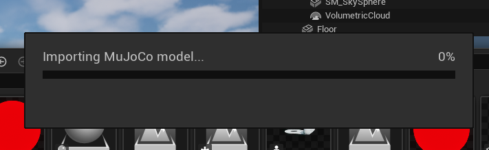
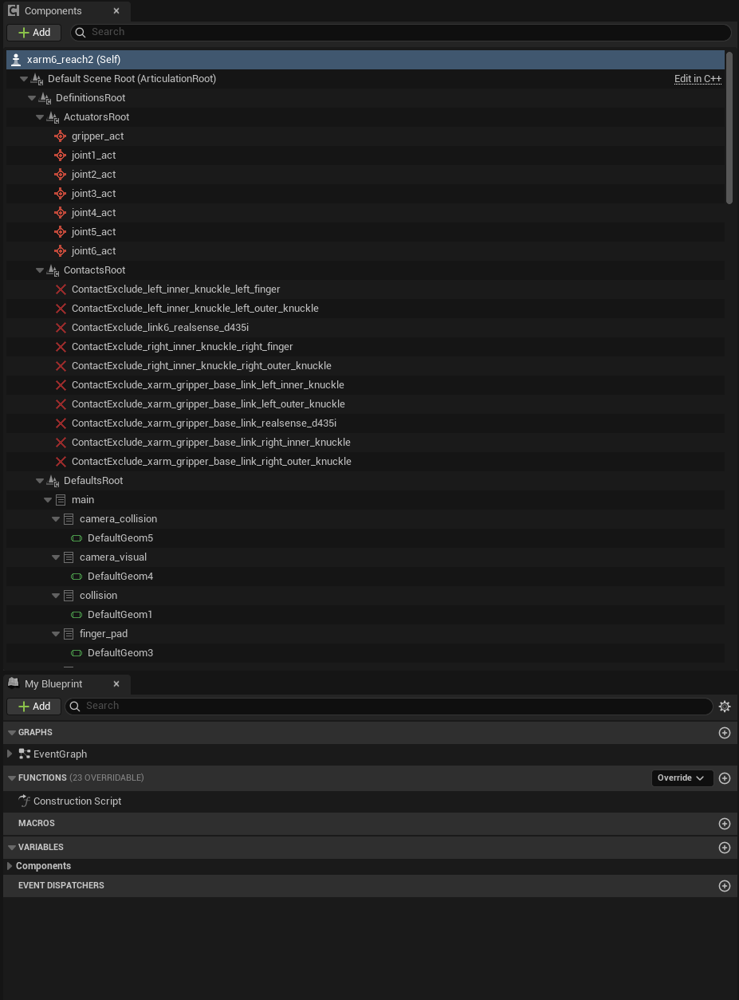
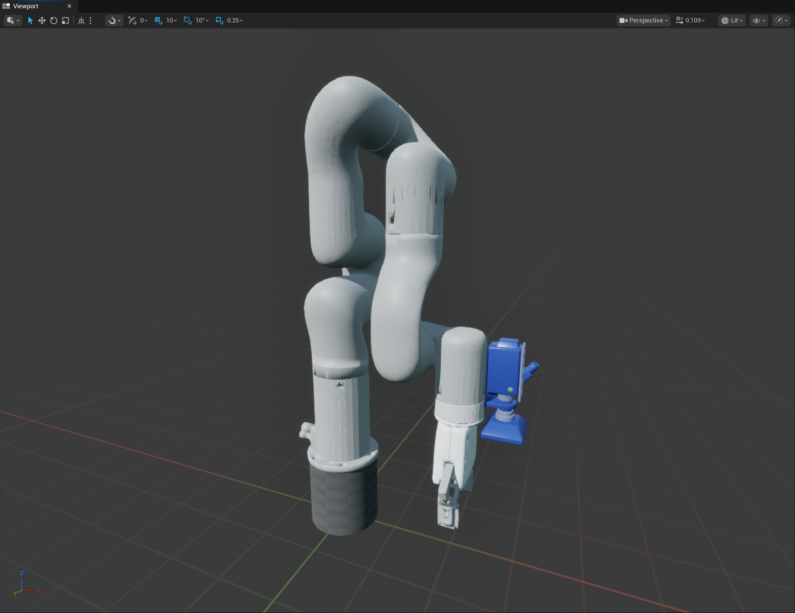
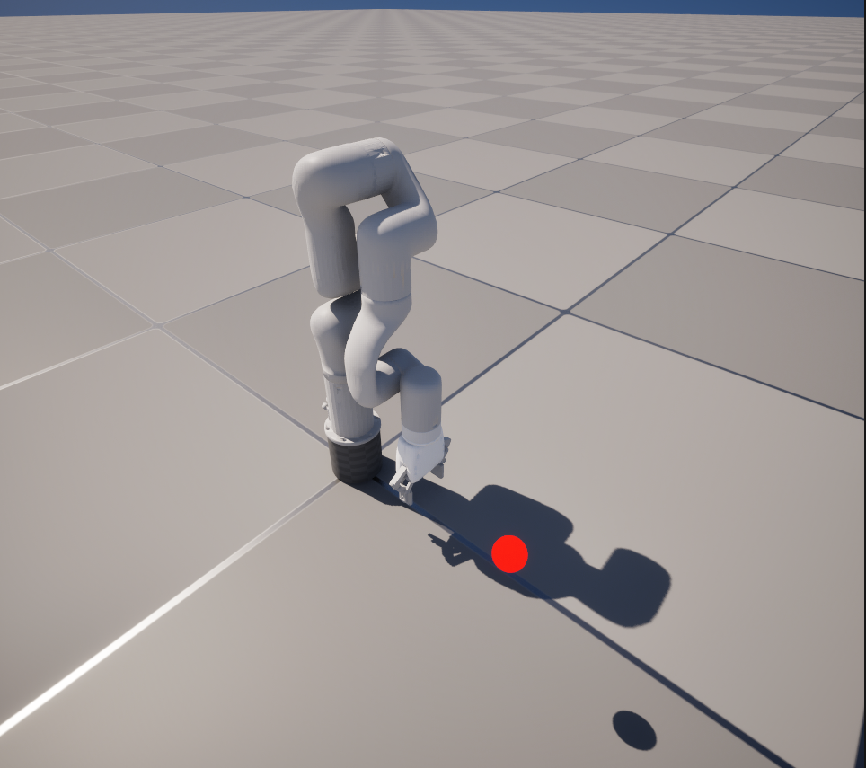
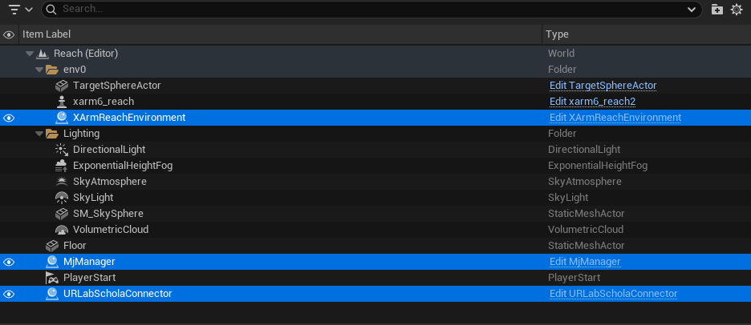
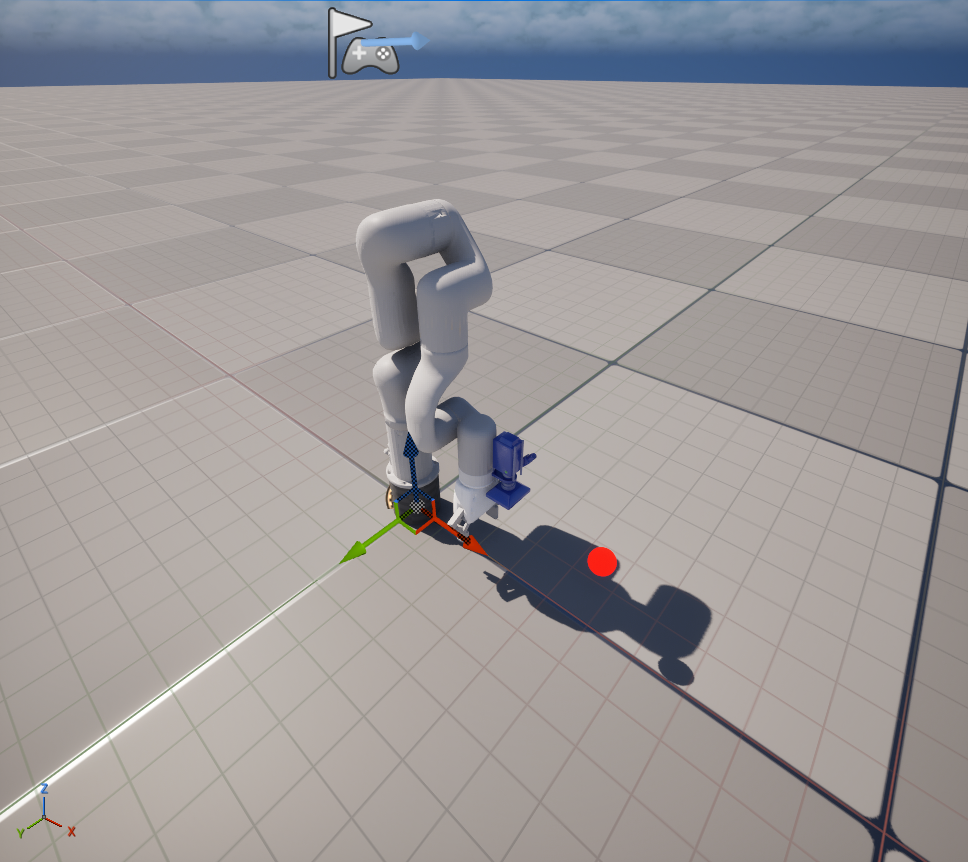
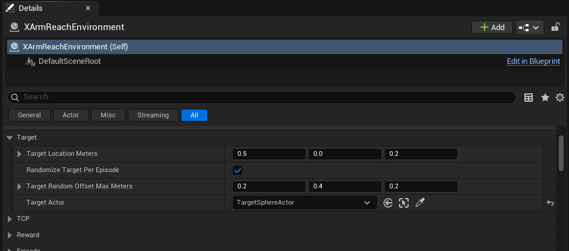
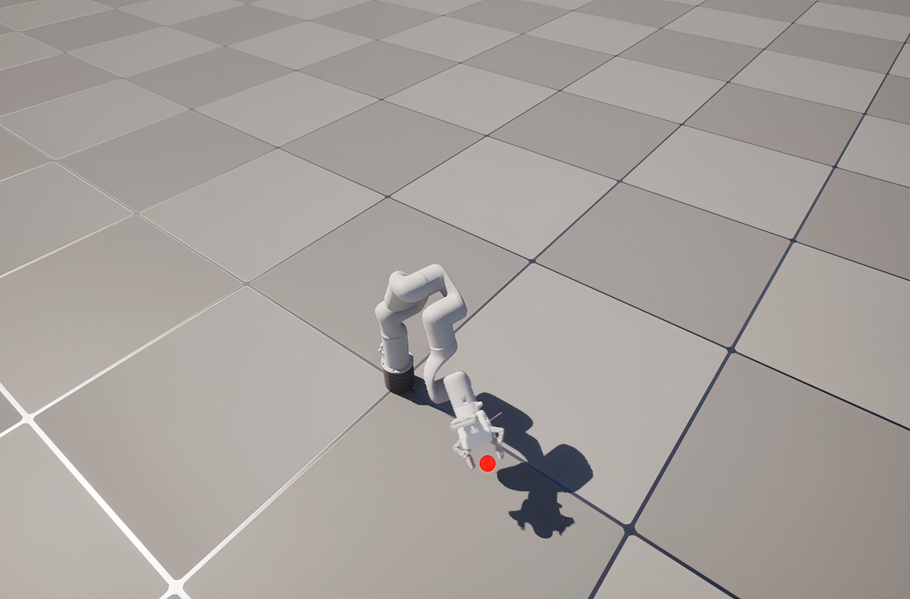
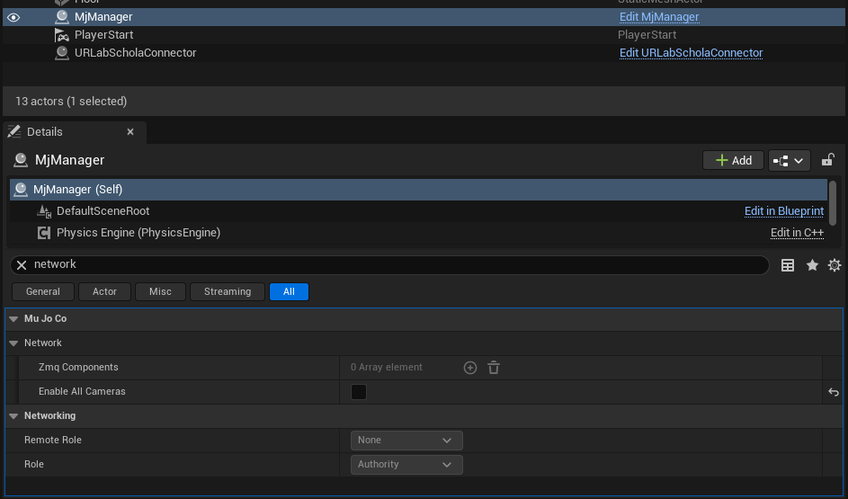

<!---
Copyright (c) 2026 Advanced Micro Devices, Inc. (AMD)

Permission is hereby granted, free of charge, to any person obtaining a copy
of this software and associated documentation files (the "Software"), to deal
in the Software without restriction, including without limitation the rights
to use, copy, modify, merge, publish, distribute, sublicense, and/or sell
copies of the Software, and to permit persons to whom the Software is
furnished to do so, subject to the following conditions:

The above copyright notice and this permission notice shall be included in all
copies or substantial portions of the Software.

THE SOFTWARE IS PROVIDED "AS IS", WITHOUT WARRANTY OF ANY KIND, EXPRESS OR
IMPLIED, INCLUDING BUT NOT LIMITED TO THE WARRANTIES OF MERCHANTABILITY,
FITNESS FOR A PARTICULAR PURPOSE AND NONINFRINGEMENT. IN NO EVENT SHALL THE
AUTHORS OR COPYRIGHT HOLDERS BE LIABLE FOR ANY CLAIM, DAMAGES OR OTHER
LIABILITY, WHETHER IN AN ACTION OF CONTRACT, TORT OR OTHERWISE, ARISING FROM,
OUT OF OR IN CONNECTION WITH THE SOFTWARE OR THE USE OR OTHER DEALINGS IN THE
SOFTWARE.
--->

# Utilizing AMD Schola and UnrealRoboticsLab with AMD ROCm™ Software to Train a Robotic Arm

A great reinforcement learning (RL) training environment excels along many axes. [Unreal® Engine](https://www.unrealengine.com/) brings a powerful combination of capabilities, including physically based rendering, high-fidelity visual environments, and a mature toolset for building rich interactive scenes. These strengths make it an excellent fit for training tasks that involve complex lighting or rich vision-based observations.

[AMD Schola](https://github.com/GPUOpen-LibrariesAndSDKs/Schola) is an open-source Unreal Engine plugin that brings standard Gymnasium-compatible RL training directly into the Unreal Editor, connecting to Python training frameworks over [gRPC](https://grpc.io/).  
[Unreal Robotics Lab (URLab)](https://github.com/URLab-Sim/UnrealRoboticsLab) is a plugin that embeds [MuJoCo](https://mujoco.org/) inside Unreal, letting you define robots in the MuJoCo XML format (MJCF) and drive them with fast, accurate contact physics.  
The bundled C++ source under [`source/`](https://github.com/ROCm/rocm-blogs/tree/release/blogs/artificial-intelligence/schola-urlab/source) connects those two plugins in your game module, and together they form a pipeline that takes MuJoCo's physics through Unreal's rendering and tooling, with Schola exposing the result to a Python training loop on AMD hardware.
This post walks through how that pipeline is structured and how to implement a reach task for a 6 degrees-of-freedom (DOF) robot arm from scratch.

## Prerequisites

Before continuing, make sure you have the following installed and configured:

- **Unreal® Engine 5.7** with the **Schola** [version 2.1.1](https://github.com/GPUOpen-LibrariesAndSDKs/Schola/releases/tag/v2.1.1) and **UnrealRoboticsLab** [commit `352a9ea`](https://github.com/URLab-Sim/UnrealRoboticsLab/commit/352a9ea7bdce0eaa9e1bd365454f3b7ea421d44c) plugins enabled in your project. Copy the bundled C++ glue from [`source/`](https://github.com/ROCm/rocm-blogs/tree/release/blogs/artificial-intelligence/schola-urlab/source) into your game module (see [Step 2](#step-2-copy-the-bundled-source)); that is the only integration code required beyond those two plugins.
- **Python 3.10-3.12** with the requirements of the **Schola** plugin installed.
- Familiarity with MJCF robot descriptions. The [MuJoCo documentation](https://mujoco.readthedocs.io/) is a useful reference if you are new to the format.
- A basic understanding of reinforcement learning concepts (observations, actions, reward, and episode termination).
- Familiarity with Unreal Engine and how to navigate the editor.

## The URLab + Schola Pipeline

Before writing any code, it helps to see how the layers of the pipeline fit together:

| Layer | What it provides |
|---|---|
| **MJCF XML** | Robot kinematics, actuators, sensors, and keyframe poses |
| **URLab** | Imports MJCF into Unreal as a live `AMjArticulation` actor; drives MuJoCo physics each tick |
| **XArm environment** | Bundled `AXArmEnvironment` actor: reads URLab sensors/joints, builds Schola `FDictSpace` I/O, and implements the reach task |
| **URLab gym connector manager** | Bundled `AURLabScholaGymConnectorManager` actor: defers Schola's gym connector init until URLab finishes compiling MuJoCo |
| **Schola** | RL loop over gRPC. Exposes the environment to Python as a standard `gymnasium.Env` |

URLab and Schola do not need to know about each other directly, and you do not install a third bridge plugin to connect them. The bundled `AXArmEnvironment` and `AURLabScholaGymConnectorManager` read the robot's joints, sensors, and actuators from URLab, re-package them in the `FDictSpace` format that Schola expects, and start gRPC only after MuJoCo is ready.

Deeper configuration notes live in the [Configuration Notes](#configuration-notes) section.

## Step 1: Define Your Robot in MJCF

Everything in the pipeline starts with an MJCF file. URLab imports this XML and instantiates the robot as a standard Unreal Engine actor. The reach task uses an xArm6 description with six hinge joints, six position actuators with `ctrlrange` bounds, and a single `framepos` sensor at the tool-center point (TCP).

The bundled MJCF also includes a gripper so the arm looks complete in the viewport. This reach task does not observe or control it as the environment exposes only the six arm joints, the TCP sensor, and six arm actuators. The gripper is still simulated with the model; we simply do not use it here.

The MJCF references stereolithography (STL) mesh files for visual geometry and collision. **This post includes the MJCF only.** Mesh files are not bundled. Download them from the [xArm Robot Operating System (ROS) repository](https://github.com/xArm-Developer/xarm_ros):

- **Arm links**: download `link_base.stl` through `link6.stl` from [`xarm_description/meshes/xarm6/visual/`](https://github.com/xArm-Developer/xarm_ros/tree/master/xarm_description/meshes/xarm6/visual)

Place the XML and downloaded meshes so the relative paths in the `<asset>` block resolve. In your Unreal project, create a folder called **`MuJoCo/`** under **`Content/`** (for example, `YourProject/Content/MuJoCo/`). Create subfolders for the MJCF XML files (`mjcf/`) and meshes (`meshes/`) inside it. Since the bundled MJCF uses `meshdir="../meshes"`, mesh files resolve relative to the XML folder in that adjacent **`Content/MuJoCo/meshes/`** subdirectory:

```text
Content/
  MuJoCo/
    mjcf/
      xarm6_reach.xml        ← bundled with this post
    meshes/
      xarm6/visual/          ← arm link STLs from xarm_ros
      ...                    ← other mesh paths as listed in the MJCF <asset> block
```

Copy [`source/xarm6_reach.xml`](https://github.com/ROCm/rocm-blogs/tree/release/blogs/artificial-intelligence/schola-urlab/source/xarm6_reach.xml) into `Content/MuJoCo/mjcf/`, download the meshes referenced in its `<asset>` block from [`xarm_description/meshes/`](https://github.com/xArm-Developer/xarm_ros/tree/master/xarm_description/meshes) (starting with [`xarm6/visual/`](https://github.com/xArm-Developer/xarm_ros/tree/master/xarm_description/meshes/xarm6/visual)), and mirror that directory layout before importing. The MJCF is derived from UFACTORY's xArm Unified Robot Description Format (URDF); see [Acknowledgements](#acknowledgements) for license terms.

### Import the MJCF into Unreal

With your MJCF and mesh assets ready, import them through URLab's MuJoCo import action (for example, **Import MuJoCo XML** from the Content Browser or URLab menu, depending on your project setup). URLab compiles the model and creates an articulation Blueprint under your Content folder, typically an `AMjArticulation`-based asset you can drag into the level.

*All screenshots in this post were captured in Unreal Engine 5.7.*



Once import completes, URLab converts every `<joint>`, `<actuator>`, and `<sensor>` element into an Unreal Engine (UE) component (`UMjJoint`, `UMjActuator`, `UMjSensor`) attached to that articulation Blueprint. Open the Blueprint to inspect the component tree: you should see six arm actuators (`joint1_act`–`joint6_act`), the `tcp_pos` sensor, and any other elements your MJCF declares.

 

Drop an instance of the articulation into your level and you have a physically simulated robot you can inspect in the viewport before writing any RL code.

See [Sensor Naming](#sensor-naming) under [Configuration Notes](#configuration-notes) when you clone articulations for parallel training.

## Step 2: Copy the Bundled Source

This post ships four C++ files under [`source/`](https://github.com/ROCm/rocm-blogs/tree/release/blogs/artificial-intelligence/schola-urlab/source) that handle connecting the MuJoCo components on your xArm6 to Schola. Copy them into your game module:

1. Copy [`source/XArmEnvironment/XArmEnvironment.h`](https://github.com/ROCm/rocm-blogs/tree/release/blogs/artificial-intelligence/schola-urlab/source/XArmEnvironment/XArmEnvironment.h) and [`source/XArmEnvironment/XArmEnvironment.cpp`](https://github.com/ROCm/rocm-blogs/tree/release/blogs/artificial-intelligence/schola-urlab/source/XArmEnvironment/XArmEnvironment.cpp) into your game module's `Public/` and `Private/` folders.
2. Copy [`source/GymConnector/URLabScholaGymConnectorManager.h`](https://github.com/ROCm/rocm-blogs/tree/release/blogs/artificial-intelligence/schola-urlab/source/GymConnector/URLabScholaGymConnectorManager.h) and [`source/GymConnector/URLabScholaGymConnectorManager.cpp`](https://github.com/ROCm/rocm-blogs/tree/release/blogs/artificial-intelligence/schola-urlab/source/GymConnector/URLabScholaGymConnectorManager.cpp) into the same module.
3. Replace `YOURPROJECT_API` with your module's API macro in all four files. You can find it on any existing class in your game module's `Public/` headers. It follows the pattern `{MODULENAME}_API` (for example, a module folder `Source/MyGame/` uses `MYGAME_API`; `Source/UnrealRoboticsLab/` uses `UNREALROBOTICSLAB_API`).
4. Add `URLab`, `Schola`, and `ScholaTraining` to your game module's `Build.cs` dependencies, then rebuild.

`AXArmEnvironment` handles observation and action spaces, physics stepping, reset, reward shaping, and observation normalization. `AURLabScholaGymConnectorManager` defers Schola's gym connector init until URLab finishes compiling MuJoCo. After rebuilding, place both actors in your level (see [Step 3](#step-3-set-up-the-level)).

Schola requires every parallel environment instance to report identical observation and action space definitions. Rather than auto-discovering every joint and sensor on the articulation (which would silently expand the space if the MJCF changes), the bundled environment pins the reach-task I/O lists in code:

<details>
<summary>Pinned observation, action, and reset keyframe names</summary>

```cpp
	const TArray<FString> ReachObservationSensorNames = { TEXT("tcp_pos") };

	const TArray<FString> ReachObservationJointNames = {
		TEXT("joint1"),
		TEXT("joint2"),
		TEXT("joint3"),
		TEXT("joint4"),
		TEXT("joint5"),
		TEXT("joint6"),
	};

	const TArray<FString> ReachActionActuatorNames = {
		TEXT("joint1_act"),
		TEXT("joint2_act"),
		TEXT("joint3_act"),
		TEXT("joint4_act"),
		TEXT("joint5_act"),
		TEXT("joint6_act"),
	};

	const FString ReachResetKeyframeName = TEXT("home");
```

</details>

Gripper joints and actuators from the MJCF are omitted from these lists; only the six arm joints, the TCP sensor, six arm actuators, and the `home` keyframe participate in the Schola interface.

Unreal does not guarantee actor `BeginPlay` order. Schola's stock gym connector manager calls `Init()` immediately, which can cache empty component maps if URLab has not finished compiling MuJoCo yet. The bundled connector manager polls until `AAMjManager::IsInitialized()` returns true:

<details>
<summary>AURLabScholaGymConnectorManager::TryInitNow</summary>

```cpp
bool AURLabScholaGymConnectorManager::TryInitNow()
{
	if (bInitDone)
	{
		return true;
	}

	AAMjManager* Mgr = AAMjManager::GetManager();
	const bool bManagerReady = Mgr && Mgr->IsInitialized();

	if (!bManagerReady)
	{
		if (MaxWaitForManagerCompileSeconds > 0.f)
		{
			const double Elapsed = FPlatformTime::Seconds() - WaitStartTimeSeconds;
			if (Elapsed >= MaxWaitForManagerCompileSeconds)
			{
				UE_LOG(LogURLabScholaGymMgr, Error,
					TEXT("Timed out after %.1fs waiting for the URLab manager to compile. Initializing the gym connector anyway — env spaces will likely be empty."),
					Elapsed);
			}
			else
			{
				return false;
			}
		}
		else
		{
			return false;
		}
	}

	if (Connector)
	{
		if (Mgr)
		{
			Mgr->SetPaused(true);
		}

		Connector->bRunEnvironmentsInParallel = false;

		TArray<TScriptInterface<IBaseScholaEnvironment>> Environments;
		Connector->CollectEnvironments(Environments);
		Connector->Init(Environments);

		UE_LOG(LogURLabScholaGymMgr, Log,
			TEXT("Gym connector initialized after %.3fs (URLab manager %s)."),
			FPlatformTime::Seconds() - WaitStartTimeSeconds,
			bManagerReady ? TEXT("ready") : TEXT("NOT ready — timed out"));
	}

	bInitDone = true;
	return true;
}
```

</details>

## Step 3: Set Up the Level

With the articulation in the level and the bundled source compiled, add the actors the reach task needs:

1. **`AMjArticulation`**: your imported xArm6 instance (one per training environment; clone the actor for parallel envs).
2. **`AAMjManager`**: the URLab simulation manager that compiles and steps the shared MuJoCo world. Place **one** instance in the level.
3. **`AXArmEnvironment`** (or a Blueprint subclass): the reach task environment. Wire `RobotArticulation` and `RobotManager` to the actors above.
4. **`AURLabScholaGymConnectorManager`**: drop-in replacement for Schola's stock gym connector manager (from [Step 2](#step-2-copy-the-bundled-source)). It waits for URLab to compile before Schola initializes; without this actor Python may connect before the model is ready.
5. **A visual target marker**: any static mesh actor for the goal indicator. The environment teleports it to the episode target on each reset.

Once those actors are placed and wired, the viewport shows the simulated arm, goal marker, and the visible actors of the reach task:

  
*Only the articulation and target marker have visible meshes. The URLab manager, Schola connector, and environment actor are present in the level but do not render in the view.*

The Outliner lists every actor you need to wire together:


  
*Use the Outliner when dragging references into the environment Details panel (`RobotArticulation`, `RobotManager`, `TargetActor`).*

The provided MJCF, which includes onboard cameras, disable streaming before training. See [Disable Onboard Camera Streaming (Recommended for Training)](#disable-onboard-camera-streaming-recommended-for-training) under [Configuration Notes](#configuration-notes).

Select the environment actor and wire **`RobotArticulation`**, **`RobotManager`**, and **`TargetActor`** in the Details panel, then set **`TargetLocationMeters`** to position the reach target. The visual marker updates live in the editor as you edit target properties.



## Step 4: Configure the RL Environment

With the level wired up, the reach task is defined entirely in `AXArmEnvironment`: how observations are normalized for the policy, how reward and termination are computed each step, and how episodes reset with randomized targets. Most of these knobs are exposed as editor properties on the environment actor; the subsections below explain what each piece does and why the defaults are shaped the way they are. Expand a dropdown when you want to read the exact implementation from the bundled source.

### Reward Shaping

`ComputeReward_Implementation` builds a scalar reward from TCP distance to the episode target, optional close-region shaping, success and out-of-bounds bonuses, and penalties on action rate and joint velocity. Distance thresholds are in meters; TCP positions arrive in Unreal world centimeters from URLab.

<details>
<summary>ComputeReward_Implementation</summary>

```cpp
float AXArmEnvironment::ComputeReward_Implementation(const FURLabScholaAgentSnapshot& Snapshot) const
{
	FReachMetrics Metrics;
	if (!BuildReachMetrics(Snapshot, TcpSensorName, TargetWorldCm, Metrics))
	{
		UE_LOG(LogXArmEnv, Warning, TEXT("ComputeReward: TCP sensor '%s' missing from observations."), *TcpSensorName);
		return StepPenalty;
	}

	float Reward = StepPenalty - (DistanceScale * Metrics.DistanceMeters);

	if (CloseRegionBonusScale > 0.f && CloseRegionMeters > 0.f && Metrics.DistanceMeters < CloseRegionMeters)
	{
		const float Ramp = 1.f - (Metrics.DistanceMeters / CloseRegionMeters);
		Reward += CloseRegionBonusScale * Ramp;
	}

	if (IsSuccessReached(Metrics.DistanceMeters, Metrics.JointVelocitySquaredSum))
	{
		Reward += SuccessBonus;
	}
	else if (bUseOutOfBounds && Metrics.DistanceMeters > OutOfBoundsDistance)
	{
		Reward += OutOfBoundsPenalty;
	}

	if (ActionRatePenaltyScale > 0.f)
	{
		TArray<float> CurrentAction;
		CurrentAction.Reserve(ReachActionActuatorNames.Num());
		for (const FString& ActuatorName : ReachActionActuatorNames)
		{
			float Value = 0.f;
			for (const FURLabScholaNamedActuatorCommand& Cmd : Snapshot.ActionsApplied)
			{
				if (Cmd.ActuatorName == ActuatorName)
				{
					Value = Cmd.Value;
					break;
				}
			}
			CurrentAction.Add(Value);
		}

		if (PreviousActionVector.Num() == CurrentAction.Num())
		{
			float SquaredDelta = 0.f;
			for (int32 i = 0; i < CurrentAction.Num(); ++i)
			{
				const float D = CurrentAction[i] - PreviousActionVector[i];
				SquaredDelta += D * D;
			}
			Reward -= ActionRatePenaltyScale * SquaredDelta;
		}

		PreviousActionVector = MoveTemp(CurrentAction);
	}

	if (JointVelocityPenaltyScale > 0.f)
	{
		Reward -= JointVelocityPenaltyScale * Metrics.JointVelocitySquaredSum;
	}

	return Reward;
}
```

</details>

The full reward at each step is:

```text
R = StepPenalty
  − DistanceScale × ‖tcp − target‖
  + CloseRegionBonusScale × max(0, 1 − ‖tcp − target‖ / CloseRegionMeters)
  + SuccessBonus          (on success, also terminates)
  + OutOfBoundsPenalty    (when ‖tcp − target‖ > OutOfBoundsDistance)
  − ActionRatePenaltyScale × ‖aₜ − aₜ₋₁‖²
  − JointVelocityPenaltyScale × Σᵢ q̇ᵢ²
```

**Success** requires the TCP within `SuccessThreshold` *and* (optionally) arm joint velocities below `SuccessMaxJointVelocity`, so the episode does not terminate while the arm is still moving quickly through the goal. **The action-rate penalty** discourages the rapid full-range joint commands that are common in early training. **The joint-velocity penalty** encourages the arm to settle at the target rather than passing through it.

### Termination

`ComputeTermination_Implementation` mirrors the reward geometry: success terminates the episode, out-of-bounds can terminate when enabled, and a step limit truncates long episodes.

<details>
<summary>ComputeTermination_Implementation</summary>

```cpp
FURLabScholaTermination AXArmEnvironment::ComputeTermination_Implementation(const FURLabScholaAgentSnapshot& Snapshot) const
{
	FURLabScholaTermination Term;

	FReachMetrics Metrics;
	if (!BuildReachMetrics(Snapshot, TcpSensorName, TargetWorldCm, Metrics))
	{
		return Term;
	}

	if (IsSuccessReached(Metrics.DistanceMeters, Metrics.JointVelocitySquaredSum))
	{
		Term.bTerminated = true;
		return Term;
	}

	if (bUseOutOfBounds && bTerminateOnOutOfBounds && Metrics.DistanceMeters > OutOfBoundsDistance)
	{
		Term.bTerminated = true;
		return Term;
	}

	if (Snapshot.EpisodeStepIndex >= EpisodeStepLimit)
	{
		Term.bTruncated = true;
	}

	return Term;
}
```

</details>

### Observation Normalization

MuJoCo sensor values span very different physical scales: joint positions in radians, velocities in rad/s, accelerations in rad/s², and TCP positions in centimeters. Before observations reach the policy, `NormalizePolicyObservations` divides each channel by a physically meaningful scale and clips to a symmetric range. Reward and termination use the raw UE-cm TCP readings from the snapshot, so you can tune normalization without changing reward geometry.

<details>
<summary>NormalizePolicyObservations</summary>

```cpp
void AXArmEnvironment::NormalizePolicyObservations(TInstancedStruct<FPoint>& Observations) const
{
	if (!bNormalizeObservations)
	{
		return;
	}

	FDictPoint* Dict = Observations.GetMutablePtr<FDictPoint>();
	if (!Dict)
	{
		return;
	}

	if (TInstancedStruct<FPoint>* TcpPoint = Dict->Points.Find(TcpSensorName))
	{
		if (FBoxPoint* TcpValues = TcpPoint->GetMutablePtr<FBoxPoint>())
		{
			if (TcpValues->Values.Num() >= 3)
			{
				const FVector TcpWorldCm(TcpValues->Values[0], TcpValues->Values[1], TcpValues->Values[2]);
				SetScaledVector(TcpValues->Values, TcpWorldCm - TargetWorldCm, ObsTcpScale * 100.f, ObsClip);
			}
		}
	}

	for (const FString& JointName : ReachObservationJointNames)
	{
		TInstancedStruct<FPoint>* JointPoint = Dict->Points.Find(JointName);
		if (!JointPoint)
		{
			continue;
		}

		FBoxPoint* JointValues = JointPoint->GetMutablePtr<FBoxPoint>();
		if (!JointValues || JointValues->Values.Num() < 3)
		{
			continue;
		}

		JointValues->Values[0] = ScaleAndClip(JointValues->Values[0], ObsJointPosScale, ObsClip);
		JointValues->Values[1] = ScaleAndClip(JointValues->Values[1], ObsJointVelScale, ObsClip);
		JointValues->Values[2] = ScaleAndClip(JointValues->Values[2], ObsJointAccScale, ObsClip);
	}
}
```

</details>

### Coordinate Convention

URLab reports TCP positions in **Unreal world centimeters** (MuJoCo meters × 100, Y-negated). Editor-facing target properties stay in env-local MuJoCo meters and convert once per episode via `LocalMetersToUeCm`:

<details>
<summary>LocalMetersToUeCm</summary>

```cpp
	FVector LocalMetersToUeCm(const FVector& Meters)
	{
		return FVector(Meters.X * 100.0, Meters.Y * -100.0, Meters.Z * 100.0);
	}
```

</details>

Reward thresholds (`SuccessThreshold`, `CloseRegionMeters`, etc.) remain in **meters** for readability. Keeping the meter-to-UE-cm conversion in one place prevents silent sign-error bugs when the arm moves in the wrong direction.

### Episode Management and Target Randomization

At the start of each episode, `Reset()` clears the action-rate history, samples a new target location, resets the articulation to the `home` keyframe, and teleports the visual marker. `SampleEpisodeTargetLocation()` draws a uniform offset from the configured spawn center, symmetric in X and Y and upward-only in Z to keep the target above the table surface.

<details>
<summary>SampleEpisodeTargetLocation</summary>

```cpp
void AXArmEnvironment::SampleEpisodeTargetLocation()
{
	EpisodeTargetLocationMeters = TargetLocationMeters;
	if (!bRandomizeTargetPerEpisode)
	{
		UpdateTargetWorldCm();
		return;
	}

	const int32 StreamSeed = TargetRandomSeed != 0
		? TargetRandomSeed + TargetRandomEpisodeCounter++
		: GetTypeHash(GetUniqueID()) + TargetRandomEpisodeCounter++;
	TargetRandomStream.Initialize(StreamSeed);

	auto SampleSymmetricOffset = [this](float MaxOffset) -> float
	{
		if (MaxOffset <= 0.f)
		{
			return 0.f;
		}
		return TargetRandomStream.FRandRange(-MaxOffset, MaxOffset);
	};

	auto SamplePositiveOffset = [this](float MaxOffset) -> float
	{
		if (MaxOffset <= 0.f)
		{
			return 0.f;
		}
		return TargetRandomStream.FRandRange(0.f, MaxOffset);
	};

	EpisodeTargetLocationMeters += FVector(
		SampleSymmetricOffset(TargetRandomOffsetMaxMeters.X),
		SampleSymmetricOffset(TargetRandomOffsetMaxMeters.Y),
		SamplePositiveOffset(TargetRandomOffsetMaxMeters.Z));

	UpdateTargetWorldCm();
}
```

</details>

<details>
<summary>Reset</summary>

```cpp
void AXArmEnvironment::Reset(TMap<FString, FInitialAgentState>& OutAgentState)
{
	OutAgentState.Empty();

	if (!bDefinitionsInitialized)
	{
		UE_LOG(LogXArmEnv, Warning, TEXT("Reset called before successful InitializeEnvironment on '%s'."), *GetName());
		return;
	}

	PreviousActionVector.Reset();
	SampleEpisodeTargetLocation();
	SyncTargetActorToLocation();

	ApplyControlSourceIfNeeded();

	if (!RobotArticulation)
	{
		return;
	}

	ZeroActuatorControls();

	if (RobotManager && RobotManager->PhysicsEngine)
	{
		RobotManager->PhysicsEngine->InvalidateStepGate();
	}

	if (!ReachResetKeyframeName.IsEmpty())
	{
		if (RobotManager && RobotManager->PhysicsEngine)
		{
			FScopeLock Lock(&RobotManager->PhysicsEngine->CallbackMutex);
			RobotArticulation->ResetToKeyframe(ReachResetKeyframeName);
		}
		else
		{
			RobotArticulation->ResetToKeyframe(ReachResetKeyframeName);
		}
	}

	EpisodeStepIndex = 0;

	TInstancedStruct<FPoint> Observations;
	TMap<FString, FString> Info;
	const TMap<FString, float> NoActions;
	BuildPolicyState(NoActions, Observations, Info);

	FInitialAgentState Initial;
	Initial.Observations = MoveTemp(Observations);
	Initial.Info = MoveTemp(Info);
	OutAgentState.Add(AgentId, Initial);
}
```

</details>

All target positions are stored in **env-local MuJoCo coordinates** (meters, local to the environment actor's transform). You can clone the environment actor to multiple world positions for parallel training and each clone's target will resolve correctly in world space at runtime without any additional configuration.

`BuildInfo_Implementation` returns an empty map by default; override it when you want to log diagnostics or curriculum metadata to Python.

## Step 5: Train

With the environment implemented, there are two ways to launch training.

**Editor workflow:** open your level, confirm **`AURLabScholaGymConnectorManager`** and **`AXArmEnvironment`** are placed, then press **Play In Editor (PIE)**. Wait for the log line indicating the gym connector initialized and gRPC is listening (port **8002** by default). Only then run the Schola CLI from a separate terminal as Python connects to the already-running Unreal process.

**Python Managed workflow:** package the level into an executable and let Schola launch it (preferred when you do not need the editor viewport). Using the `project` launch option will also note the location of the compiled executable, which can be used in following training runs.

Schola ships with a command-line interface (CLI) for both paths:

```console
schola sb3 train ppo --url 127.0.0.1 --port 8002 --timesteps 3000000 --save-final-policy --pbar
```

```console
schola sb3 train ppo project --uproject-path "<path-to-your-uproject>" --headless --num-simulators 1 --timesteps 3000000 --save-final-policy --pbar
```

While training can be run with or without the `--headless` parameter, we recommend including it to maximize throughput when rendering visual observations is not required (such as for this reach task).

Schola transmits the `FDictSpace` observation and action dicts to Python over gRPC on every step. Physics runs entirely inside Unreal at the configured MuJoCo timestep; Python sees only the high-level reset, step, and reward interface.

### Utilizing the GPU with PyTorch on ROCm

To increase training speed further, we can enable utilization of the GPU.
Visit the [installing PyTorch Python packages](https://github.com/ROCm/TheRock/blob/main/RELEASES.md#installing-pytorch-python-packages) documentation on *TheRock* and navigate to the section for your GPU model.

Be sure to install this PyTorch inside the same virtual environment used for Schola.

Once PyTorch is installed in your Schola virtual environment, increase `--num-simulators` to launch multiple Unreal environment processes in parallel (Python Managed workflow). The GPU accelerates policy forward passes, observation batching, and PPO gradient updates on the Python side while the simulators gather experience concurrently.

## Step 6: Evaluate

Once training is complete, evaluate the trained policy against the live Unreal environment using Schola's CLI eval entry point.

To evaluate in the editor:

```console
schola sb3 eval ppo --url 127.0.0.1 --port 8002 --checkpoint "<path-to-your-checkpoint.zip>" --n-eval-episodes 10 --no-deterministic
```

To evaluate from the executable:

```console
schola sb3 eval ppo executable --executable-path "<path-to-your-executable>" --checkpoint "<path-to-your-checkpoint.zip>" --n-eval-episodes 10 --no-deterministic
```

Omit the `--headless` parameter to visually inspect the trained policy's behavior when launching from the executable. If you want to gather bulk performance statistics across a large number of evaluation episodes, you can re-enable `--headless` to maximize inference throughput.



## Summary

This post covered the URLab + Schola pipeline for training a robot arm policy in Unreal Engine. Starting from an MJCF robot description, you imported the xArm6 into Unreal using URLab, connected it to Schola's RL loop through the bundled C++ code under [`source/`](https://github.com/ROCm/rocm-blogs/tree/release/blogs/artificial-intelligence/schola-urlab/source) (`AXArmEnvironment` plus `AURLabScholaGymConnectorManager`), and implemented a reach task covering reward shaping, observation normalization, and per-episode target randomization. On the Python side, Schola exposes the Unreal environment as a standard Gymnasium interface, making it immediately compatible with [Stable Baselines 3](https://stable-baselines3.readthedocs.io/en/master/) and exportable to the Open Neural Network Exchange ([ONNX](https://onnx.ai/)) format for inference.

The combination of MuJoCo's accurate contact physics, Unreal's rendering and editor tooling, and Schola's gRPC-based training loop creates a pipeline that is practical to develop against: iterate on the reward in the editor, visualize the policy live in the scene, and deploy the trained ONNX model without framework changes. The xArm6 reach task in this post is a foundation for more complex manipulation scenarios that build on the same architecture.

We recommend designing your own tasks for the robot and building upon the reach task, such as enabling the gripper, using the camera, or defining a new objective for the robot to achieve.  
If you're interested in Schola, or you've spotted a potential bug in the code, we welcome issues and pull requests at our [GitHub repository](https://github.com/GPUOpen-LibrariesAndSDKs/Schola).

## Configuration Notes

### Sensor Naming

URLab assigns each sensor an instance-prefixed name in MuJoCo (for example, `xarm6_reach_C_0_tcp_pos`). This prefix changes when you clone the articulation for parallel training environments. Always reference sensors by their **UE component name** (for example, `tcp_pos`) in your environment code. The bundled environment resolves these correctly across all instances.

### Disable Onboard Camera Streaming (Recommended for Training)

If your MJCF includes RealSense-style onboard cameras (`d435i_rgb`, `d435i_depth`), URLab creates `UMjCamera` components that can stream 640×480 captures every frame. The camera is necessary for some environments, but it is computationally expensive and unneeded for the reach task. Turning off the per-camera **Enable Zmq Broadcast** alone is not enough: `AAMjManager`'s **Network Manager** forces **Enable All Cameras** on every camera at registration unless you turn it off.

On your **`AAMjManager`** actor, open **Network Manager → Enable All Cameras** and uncheck it. Also set **`bAutoCreateSimulateWidget = false`** on the manager if you do not need the MjSimulate dashboard during training (the widget re-enables camera streaming for its preview feeds).



If you still see camera meshes in the viewport, deactivate the `d435i_rgb` / `d435i_depth` components on the articulation Blueprint, or hide group-3 auxiliary geoms via the articulation's **Show Group 3** toggle.

## Additional Resources

[Schola](https://github.com/GPUOpen-LibrariesAndSDKs/Schola)  
[MuJoCo](https://github.com/mujoco)  
[Unreal Robotics Lab (URLab)](https://github.com/URLab-Sim/UnrealRoboticsLab)  
[Unreal Engine](https://www.unrealengine.com/)  
[gRPC](https://grpc.io/)  
[Stable Baselines 3](https://stable-baselines3.readthedocs.io/en/master/)  
[Gymnasium](https://gymnasium.farama.org/index.html)  
[Open Neural Network Exchange (ONNX)](https://onnx.ai/)  
[ROCm Documentation](https://rocm.docs.amd.com/)

## Acknowledgements

This tutorial uses [Unreal Robotics Lab (URLab)](https://github.com/URLab-Sim/UnrealRoboticsLab) (Embley-Riches et al., ICRA 2026; [arXiv:2504.14135](https://arxiv.org/abs/2504.14135)). URLab is distributed under the Apache License 2.0.

The xArm6 MJCF bundled with this post ([`source/xarm6_reach.xml`](https://github.com/ROCm/rocm-blogs/tree/release/blogs/artificial-intelligence/schola-urlab/source/xarm6_reach.xml)) was created from the xArm Unified Robot Description Format (URDF) in the [xArm Robot Operating System (ROS) repository](https://github.com/xArm-Developer/xarm_ros), specifically [`xarm_description/urdf/xarm`](https://github.com/xArm-Developer/xarm_ros/tree/master/xarm_description/urdf/xarm). Mesh files are **not** included with this post; download them separately from [`xarm_description/meshes/`](https://github.com/xArm-Developer/xarm_ros/tree/master/xarm_description/meshes) as referenced in the MJCF.

That upstream project is Copyright (c) 2018, UFACTORY Inc., and is distributed under the BSD-3-Clause license:

```text
Copyright (c) 2018, UFACTORY Inc.

All rights reserved.

Redistribution and use in source and binary forms, with or without modification,
are permitted provided that the following conditions are met:

    * Redistributions of source code must retain the above copyright notice,
      this list of conditions and the following disclaimer.
    * Redistributions in binary form must reproduce the above copyright notice,
      this list of conditions and the following disclaimer in the documentation
      and/or other materials provided with the distribution.
    * Neither the name of the copyright holder nor the names of its contributors
      may be used to endorse or promote products derived from this software
      without specific prior written permission.

THIS SOFTWARE IS PROVIDED BY THE COPYRIGHT HOLDERS AND CONTRIBUTORS
"AS IS" AND ANY EXPRESS OR IMPLIED WARRANTIES, INCLUDING, BUT NOT
LIMITED TO, THE IMPLIED WARRANTIES OF MERCHANTABILITY AND FITNESS FOR
A PARTICULAR PURPOSE ARE DISCLAIMED. IN NO EVENT SHALL THE COPYRIGHT HOLDER OR
CONTRIBUTORS BE LIABLE FOR ANY DIRECT, INDIRECT, INCIDENTAL, SPECIAL,
EXEMPLARY, OR CONSEQUENTIAL DAMAGES (INCLUDING, BUT NOT LIMITED TO,
PROCUREMENT OF SUBSTITUTE GOODS OR SERVICES; LOSS OF USE, DATA, OR
PROFITS; OR BUSINESS INTERRUPTION) HOWEVER CAUSED AND ON ANY THEORY OF
LIABILITY, WHETHER IN CONTRACT, STRICT LIABILITY, OR TORT (INCLUDING
NEGLIGENCE OR OTHERWISE) ARISING IN ANY WAY OUT OF THE USE OF THIS
SOFTWARE, EVEN IF ADVISED OF THE POSSIBILITY OF SUCH DAMAGE.
```

## Disclaimers

Unreal® is a trademark or registered trademark of Epic Games, Inc. in the United States of America and elsewhere.

The information contained herein is for informational purposes only and is subject to change without notice. While every precaution has been taken in the preparation of this document, it may contain technical inaccuracies, omissions and typographical errors, and AMD is under no obligation to update or otherwise correct this information. Advanced Micro Devices, Inc. makes no representations or warranties with respect to the accuracy or completeness of the contents of this document, and assumes no liability of any kind, including the implied warranties of noninfringement, merchantability or fitness for particular purposes, with respect to the operation or use of AMD hardware, software or other products described herein. No license, including implied or arising by estoppel, to any intellectual property rights is granted by this document. Terms and limitations applicable to the purchase or use of AMD products are set forth in a signed agreement between the parties or in AMD's Standard Terms and Conditions of Sale. GD-18u.

© 2026 Advanced Micro Devices, Inc. All rights reserved. AMD, the AMD Arrow logo, ROCm, and combinations thereof are trademarks of Advanced Micro Devices, Inc. Other product names used in this publication are for identification purposes only and may be trademarks of their respective owners. Certain AMD technologies may require third-party enablement or activation. Supported features may vary by operating system. Please confirm with the system manufacturer for specific features. No technology or product can be completely secure.
