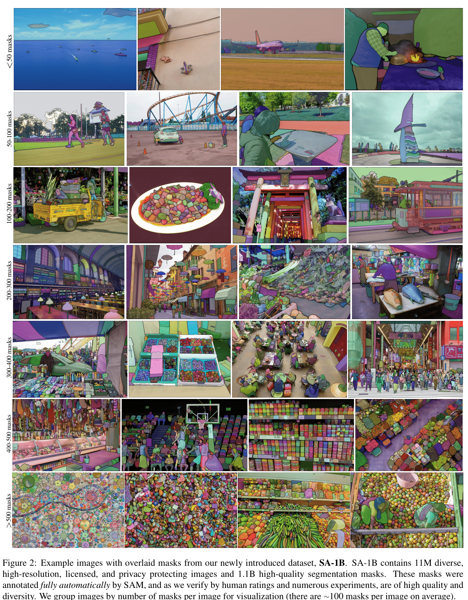
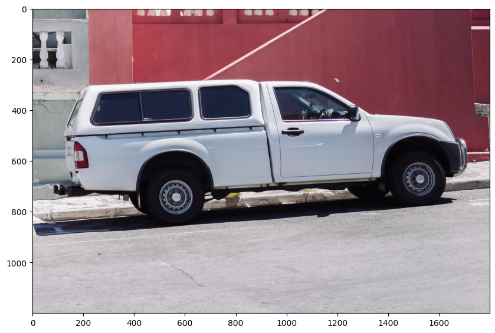
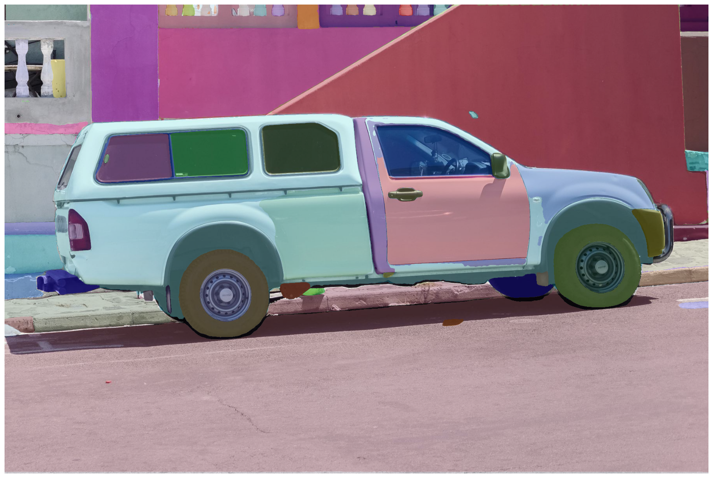
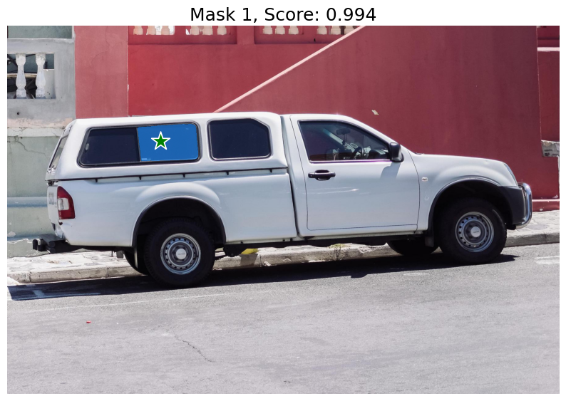
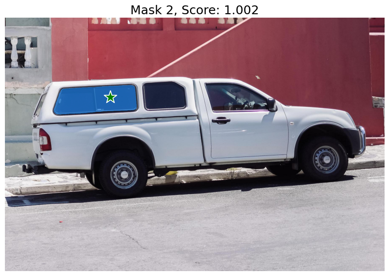
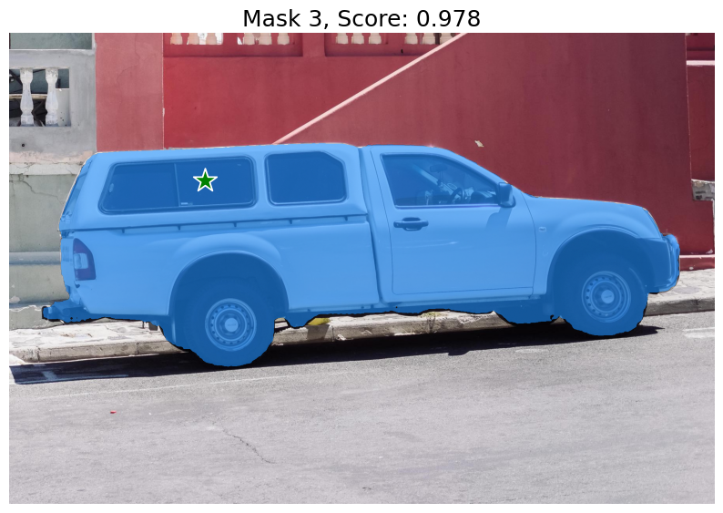

# Segment Anything with AMD GPUs

## Introduction

Segmentation — identifying which image pixels belong to an object — is a fundamental task in computer vision with widespread applications from scientific image analysis to photo editing. The [Segment Anything Model (SAM)](https://arxiv.org/abs/2304.02643) is a cutting-edge image segmentation model that democratizes promptable segmentation, allowing unparalleled versatility in image analysis tasks. SAM can be used to help power applications in domains that require finding and segmenting any object in any image. For the AI research community and others, SAM holds promise as a pivotal component within larger AI systems, enabling a comprehensive understanding of the world in multimodal contexts.

In this blog, we'll demonstrate how to run the Segment Anything model on an AMD GPU with ROCm.

### SAM

SAM is trained to return valid _segmentation masks_ in response to various prompts encompassing foreground and background _points_, approximate _boxes_ or _masks_, unstructured _text_, or any other indication of what to segment within an image. The requirement of a valid mask simply means that even when a prompt is ambiguous and could refer to multiple objects (for example, a point on a shirt may indicate either the shirt or the person wearing it), the output should be a reasonable mask for one of those objects.

SAM's advanced design allows it to adapt to new image distributions and tasks without prior knowledge — a feature known as zero-shot transfer. Trained on the expansive [SA-1B dataset](https://ai.meta.com/datasets/segment-anything/), which contains more than 1 billion masks spread over 11 million carefully curated images (see examples from the SAM paper below), SAM has displayed impressive zero-shot performance, surpassing previous fully supervised results in many cases.



Image source: [Segment Anything](https://arxiv.org/abs/2304.02643) (Kirillov et al.).


Image source: [Introducing Segment Anything](https://ai.meta.com/blog/segment-anything-foundation-model-image-segmentation/) (Meta Research).

The SAM model is made up of 3 key modules:

* **Image encoder**: Motivated by scalability and powerful pretraining methods, SAM uses a [Masked AutoEncoder (MAE)](https://arxiv.org/abs/2111.06377) pre-trained [Vision Transformer (ViT)](https://arxiv.org/abs/2010.11929) minimally adapted to process inputs. The image encoder runs once per image and can be applied prior to prompting the model.
* **Prompt encoder**: SAM considered two sets of prompts: sparse (points, boxes, text) and dense (masks). It represents points and boxes by positional encodings summed with learned embeddings for each prompt type and free-form text with an off-the-shelf text encoder from [CLIP](https://arxiv.org/abs/2103.00020). Dense prompts (i.e., masks) are embedded using convolutions and summed element-wise with the image embedding.
* **Mask decoder**: The mask decoder efficiently maps the image embedding, prompt embeddings, and an output token to a mask. This design employs a modified transformer decoder block followed by a dynamic mask prediction head. The modified decoder block uses prompt self-attention and cross-attention in two directions (prompt-to-image embedding and vice-versa) to update all embeddings. After that, the model upsamples the image embedding and a Multilayer Perceptron (MLP) maps the output token to a dynamic linear classifier, which then computes the mask foreground probability at each image location.

Next, we'll showcase the smooth execution of the Segment Anything model on an AMD GPU with ROCm over three sections:

* **Automatic mask generation for all objects**
* **Mask generation with points as prompts**
* **Mask generation with boxes as prompts**

>Note:
>At the time of writing this blog, although text prompts have been explored in the SAM paper, this capability is not yet fully released. This blog does not cover text prompts.

We reference SAM's GitHub repo in this blog post. Find the source code for the model in [facebookresearch/segment-anything](https://github.com/facebookresearch/segment-anything).

## Setup

This demo uses the following hardware and software environment. For comprehensive support details, refer to the [ROCm documentation](https://rocm.docs.amd.com/projects/install-on-linux/en/latest/).

* Hardware & OS:
  * [AMD Instinct GPU](https://rocm.docs.amd.com/projects/install-on-linux/en/latest/reference/system-requirements.html#supported-gpus)
  * Ubuntu 22.04.3 LTS
* Software:
  * [ROCm 5.7.0+](https://rocm.docs.amd.com/en/latest/)
  * [PyTorch 2.0+](https://pytorch.org/)

## Preparation

First let's install the required packages.

```bash
pip install git+https://github.com/facebookresearch/segment-anything.git
pip install matplotlib opencv-python
```

Add the necessary imports

```python
import numpy as np
import torch
import matplotlib.pyplot as plt
import cv2
```

## Check the test image

```python
image = cv2.imread('./images/truck.jpg')
image = cv2.cvtColor(image, cv2.COLOR_BGR2RGB)
plt.figure(figsize=(10,10))
plt.imshow(image)
plt.axis('on')
plt.show()
```



## Download checkpoints

Meta provides three pretrained models, with `vit_h` featuring the most expansive vision encoder among them. Click links below to download the checkpoint for the corresponding model type.

* `vit_h` (default): [ViT-H SAM model](https://dl.fbaipublicfiles.com/segment_anything/sam_vit_h_4b8939.pth).
* `vit_l`: [ViT-L SAM model](https://dl.fbaipublicfiles.com/segment_anything/sam_vit_l_0b3195.pth).
* `vit_b`: [ViT-B SAM model](https://dl.fbaipublicfiles.com/segment_anything/sam_vit_b_01ec64.pth).

In this demo, we use the `vit_h` model, which is the largest among these three options.

```bash
wget https://dl.fbaipublicfiles.com/segment_anything/sam_vit_h_4b8939.pth
```

## Automatic mask generation

To run automatic mask generation, provide a SAM model to the `SamAutomaticMaskGenerator` class.  Set the path below to the SAM checkpoint.

```python
from segment_anything import sam_model_registry, SamAutomaticMaskGenerator, SamPredictor

sam_checkpoint = "sam_vit_h_4b8939.pth"
model_type = "vit_h"

sam = sam_model_registry[model_type](checkpoint=sam_checkpoint)
sam.to(device="cuda")
mask_generator = SamAutomaticMaskGenerator(sam)
```

Check the sam model.

```python
print(sam)
```

Output:

```text
    Sam(
      (image_encoder): ImageEncoderViT(
        (patch_embed): PatchEmbed(
          (proj): Conv2d(3, 1280, kernel_size=(16, 16), stride=(16, 16))
        )
        (blocks): ModuleList(
          (0-31): 32 x Block(
            (norm1): LayerNorm((1280,), eps=1e-06, elementwise_affine=True)
            (attn): Attention(
              (qkv): Linear(in_features=1280, out_features=3840, bias=True)
              (proj): Linear(in_features=1280, out_features=1280, bias=True)
            )
            (norm2): LayerNorm((1280,), eps=1e-06, elementwise_affine=True)
            (mlp): MLPBlock(
              (lin1): Linear(in_features=1280, out_features=5120, bias=True)
              (lin2): Linear(in_features=5120, out_features=1280, bias=True)
              (act): GELU(approximate='none')
            )
          )
        )
        (neck): Sequential(
          (0): Conv2d(1280, 256, kernel_size=(1, 1), stride=(1, 1), bias=False)
          (1): LayerNorm2d()
          (2): Conv2d(256, 256, kernel_size=(3, 3), stride=(1, 1), padding=(1, 1), bias=False)
          (3): LayerNorm2d()
        )
      )
      (prompt_encoder): PromptEncoder(
        (pe_layer): PositionEmbeddingRandom()
        (point_embeddings): ModuleList(
          (0-3): 4 x Embedding(1, 256)
        )
        (not_a_point_embed): Embedding(1, 256)
        (mask_downscaling): Sequential(
          (0): Conv2d(1, 4, kernel_size=(2, 2), stride=(2, 2))
          (1): LayerNorm2d()
          (2): GELU(approximate='none')
          (3): Conv2d(4, 16, kernel_size=(2, 2), stride=(2, 2))
          (4): LayerNorm2d()
          (5): GELU(approximate='none')
          (6): Conv2d(16, 256, kernel_size=(1, 1), stride=(1, 1))
        )
        (no_mask_embed): Embedding(1, 256)
      )
      (mask_decoder): MaskDecoder(
        (transformer): TwoWayTransformer(
          (layers): ModuleList(
            (0-1): 2 x TwoWayAttentionBlock(
              (self_attn): Attention(
                (q_proj): Linear(in_features=256, out_features=256, bias=True)
                (k_proj): Linear(in_features=256, out_features=256, bias=True)
                (v_proj): Linear(in_features=256, out_features=256, bias=True)
                (out_proj): Linear(in_features=256, out_features=256, bias=True)
              )
              (norm1): LayerNorm((256,), eps=1e-05, elementwise_affine=True)
              (cross_attn_token_to_image): Attention(
                (q_proj): Linear(in_features=256, out_features=128, bias=True)
                (k_proj): Linear(in_features=256, out_features=128, bias=True)
                (v_proj): Linear(in_features=256, out_features=128, bias=True)
                (out_proj): Linear(in_features=128, out_features=256, bias=True)
              )
              (norm2): LayerNorm((256,), eps=1e-05, elementwise_affine=True)
              (mlp): MLPBlock(
                (lin1): Linear(in_features=256, out_features=2048, bias=True)
                (lin2): Linear(in_features=2048, out_features=256, bias=True)
                (act): ReLU()
              )
              (norm3): LayerNorm((256,), eps=1e-05, elementwise_affine=True)
              (norm4): LayerNorm((256,), eps=1e-05, elementwise_affine=True)
              (cross_attn_image_to_token): Attention(
                (q_proj): Linear(in_features=256, out_features=128, bias=True)
                (k_proj): Linear(in_features=256, out_features=128, bias=True)
                (v_proj): Linear(in_features=256, out_features=128, bias=True)
                (out_proj): Linear(in_features=128, out_features=256, bias=True)
              )
            )
          )
          (final_attn_token_to_image): Attention(
            (q_proj): Linear(in_features=256, out_features=128, bias=True)
            (k_proj): Linear(in_features=256, out_features=128, bias=True)
            (v_proj): Linear(in_features=256, out_features=128, bias=True)
            (out_proj): Linear(in_features=128, out_features=256, bias=True)
          )
          (norm_final_attn): LayerNorm((256,), eps=1e-05, elementwise_affine=True)
        )
        (iou_token): Embedding(1, 256)
        (mask_tokens): Embedding(4, 256)
        (output_upscaling): Sequential(
          (0): ConvTranspose2d(256, 64, kernel_size=(2, 2), stride=(2, 2))
          (1): LayerNorm2d()
          (2): GELU(approximate='none')
          (3): ConvTranspose2d(64, 32, kernel_size=(2, 2), stride=(2, 2))
          (4): GELU(approximate='none')
        )
        (output_hypernetworks_mlps): ModuleList(
          (0-3): 4 x MLP(
            (layers): ModuleList(
              (0-1): 2 x Linear(in_features=256, out_features=256, bias=True)
              (2): Linear(in_features=256, out_features=32, bias=True)
            )
          )
        )
        (iou_prediction_head): MLP(
          (layers): ModuleList(
            (0-1): 2 x Linear(in_features=256, out_features=256, bias=True)
            (2): Linear(in_features=256, out_features=4, bias=True)
          )
        )
      )
    )
```

To generate masks, run `generate` on an image.

```python
masks = mask_generator.generate(image)
print(masks[0])
```

Output:

```text
{'segmentation': array([[False, False, False, ..., False, False, False],
       [False, False, False, ..., False, False, False],
       [False, False, False, ..., False, False, False],
       ...,
       [False, False, False, ..., False, False, False],
       [False, False, False, ..., False, False, False],
       [False, False, False, ..., False, False, False]]), 'area': 632681, 'bbox': [86, 282, 1621, 566], 'predicted_iou': 1.0396634340286255, 'point_coords': [[1378.125, 581.25]], 'stability_score': 0.9835065603256226, 'crop_box': [0, 0, 1800, 1200]}
```

Mask generation returns a list over masks, where each mask is a dictionary containing various data about the mask. The keys are:

* `segmentation` : the binary mask representing the region of interest.
* `area` : the area of the mask in the image.
* `bbox` : The rectangular boundary of the mask described by its top-left corner coordinates (X, Y) and its width (W) and height (H) in the format (X, Y, W, H).
* `predicted_iou` : the model's predicted intersection over union value, indicating the quality of the mask.
* `point_coords` : the input point that generated this mask.
* `stability_score` : an additional metric or score used to assess the mask quality.
* `crop_box` : the crop of the original image used to generate this mask in XYWH format.

Show all the masks overlayed on the image.

```python
def process_annotations(annotations):
    if len(annotations) == 0:
        return
    sorted_annotations = sorted(annotations, key=(lambda x: x['area']), reverse=True)
    ax = plt.gca()
    ax.set_autoscale_on(False)

    img = np.ones((sorted_annotations[0]['segmentation'].shape[0], sorted_annotations[0]['segmentation'].shape[1], 4))
    img[:,:,3] = 0
    for annotations in sorted_annotations:
        m = annotations['segmentation']
        img[m] = np.concatenate([np.random.random(3), [0.35]])
    ax.imshow(img)

plt.figure(figsize=(20,20))
plt.imshow(image)
plt.axis('off')
process_annotations(masks)
plt.show() 
```



There are several tunable parameters in automatic mask generation that control how densely points are sampled and what the thresholds are for removing low quality or duplicate masks. You can find more details for setting parameters in the [documentation](https://github.com/facebookresearch/segment-anything/blob/6fdee8f2727f4506cfbbe553e23b895e27956588/segment_anything/automatic_mask_generator.py#L35).

## Masks Generation with points as prompt

Process the image to produce an image embedding by calling `SamPredictor.set_image`. `SamPredictor` remembers this embedding and will use it for subsequent mask prediction.

```python
predictor = SamPredictor(sam)
predictor.set_image(image)
```

To select the truck, choose a point on it. Points are input to the model in (x,y) format and come with labels 1 (foreground point) or 0 (background point). Multiple points can be provided, although we only use one here. The provided point will be shown as a star on the image.

```python
input_point = np.array([[500, 375]])
input_label = np.array([1]) # A length N array of labels for the point prompts. 1 indicates a foreground point and 0 indicates a background point.
```

Predict with `SamPredictor.predict`. The model returns masks, quality predictions for those masks, and low resolution mask logits that can be passed to the next iteration of prediction.

```python
masks, scores, logits = predictor.predict(
    point_coords=input_point,
    point_labels=input_label,
    multimask_output=True,
)
```

With `multimask_output=True` (the default setting), SAM outputs 3 masks, where scores gives the model's own estimation of the quality of these masks. This setting is intended for ambiguous input prompts, and helps the model disambiguate different objects consistent with the prompt. When `False`, it will return a single mask. For ambiguous prompts such as a single point, it is recommended to use `multimask_output=True` even if only a single mask is desired; the best single mask can be chosen by picking the one with the highest score returned in scores. This will often result in a better mask.

```python
def display_points(coords, labels, ax, marker_size=375):
    pos_points = coords[labels==1]
    neg_points = coords[labels==0]
    ax.scatter(pos_points[:, 0], pos_points[:, 1], color='green', marker='*', s=marker_size, edgecolor='white', linewidth=1.25)
    ax.scatter(neg_points[:, 0], neg_points[:, 1], color='red', marker='*', s=marker_size, edgecolor='white', linewidth=1.25)

def display_mask(mask, ax, random_color=False):
    if random_color:
        color = np.concatenate([np.random.random(3), np.array([0.6])], axis=0)
    else:
        color = np.array([30/255, 144/255, 255/255, 0.6])
    h, w = mask.shape[-2:]
    mask_image = mask.reshape(h, w, 1) * color.reshape(1, 1, -1)
    ax.imshow(mask_image)

for i, (mask, score) in enumerate(zip(masks, scores)):
    plt.figure(figsize=(10,10))
    plt.imshow(image)
    display_mask(mask, plt.gca())
    display_points(input_point, input_label, plt.gca())
    plt.title(f"Mask {i+1}, Score: {score:.3f}", fontsize=18)
    plt.axis('off')
    plt.show()  
```







The single input point is ambiguous, and the model has returned multiple objects consistent with it. To obtain a single object, multiple points can be provided. For more advanced usage, please refer to [facebookresearch/segment-anything](https://github.com/facebookresearch/segment-anything/tree/main).

## Masks Generation with boxes

`SamPredictor` can process multiple bounding boxes as input, specified in the format (x_min, y_min, x_max, y_max), for a given image. This method assumes that input points are already represented as torch tensors and have been transformed to match the input frame.

```python
import torch
input_boxes = torch.tensor([
    [75, 275, 1725, 850],
    [425, 600, 700, 875],
    [1375, 550, 1650, 800],
    [1240, 675, 1400, 750],
], device=predictor.device)
```

Transform the boxes to the input frame, then predict the masks.

```python
masks, _, _ = predictor.predict_torch(
    point_coords=None,
    point_labels=None,
    boxes=predictor.transform.apply_boxes_torch(input_boxes, image.shape[:2]),
    multimask_output=False,
)
```

```python
def display_box(box, ax):
    x0, y0 = box[0], box[1]
    w, h = box[2] - box[0], box[3] - box[1]
    ax.add_patch(plt.Rectangle((x0, y0), w, h, edgecolor='green', facecolor=(0,0,0,0), lw=2))  
    
plt.figure(figsize=(10, 10))
plt.imshow(image)
for mask in masks:
    display_mask(mask.cpu().numpy(), plt.gca(), random_color=True)
for box in input_boxes:
    display_box(box.cpu().numpy(), plt.gca())
plt.axis('off')
plt.show()
```


In the image above, we find that the three boxes have been appropriately utilized to segment different areas of the car.

## Disclaimers

Third-party content is licensed to you directly by the third party that owns the content and is
not licensed to you by AMD. ALL LINKED THIRD-PARTY CONTENT IS PROVIDED “AS IS”
WITHOUT A WARRANTY OF ANY KIND. USE OF SUCH THIRD-PARTY CONTENT IS DONE AT
YOUR SOLE DISCRETION AND UNDER NO CIRCUMSTANCES WILL AMD BE LIABLE TO YOU FOR
ANY THIRD-PARTY CONTENT. YOU ASSUME ALL RISK AND ARE SOLELY RESPONSIBLE FOR ANY
DAMAGES THAT MAY ARISE FROM YOUR USE OF THIRD-PARTY CONTENT.
