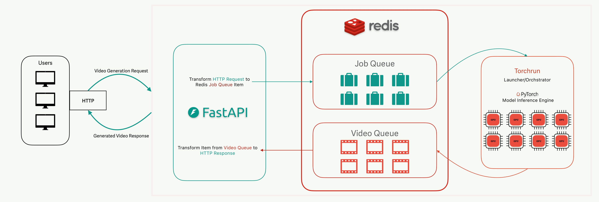

<!---
Copyright (c) 2025 Advanced Micro Devices, Inc. (AMD)

Permission is hereby granted, free of charge, to any person obtaining a copy
of this software and associated documentation files (the "Software"), to deal
in the Software without restriction, including without limitation the rights
to use, copy, modify, merge, publish, distribute, sublicense, and/or sell
copies of the Software, and to permit persons to whom the Software is
furnished to do so, subject to the following conditions:

The above copyright notice and this permission notice shall be included in all
copies or substantial portions of the Software.

THE SOFTWARE IS PROVIDED "AS IS", WITHOUT WARRANTY OF ANY KIND, EXPRESS OR
IMPLIED, INCLUDING BUT NOT LIMITED TO THE WARRANTIES OF MERCHANTABILITY,
FITNESS FOR A PARTICULAR PURPOSE AND NONINFRINGEMENT. IN NO EVENT SHALL THE
AUTHORS OR COPYRIGHT HOLDERS BE LIABLE FOR ANY CLAIM, DAMAGES OR OTHER
LIABILITY, WHETHER IN AN ACTION OF CONTRACT, TORT OR OTHERWISE, ARISING FROM,
OUT OF OR IN CONNECTION WITH THE SOFTWARE OR THE USE OR OTHER DEALINGS IN THE
SOFTWARE.
--->

# A Simple Design for Serving Video Generation Models with Distributed Inference

Video generation is entering a new era, powered by diffusion models that deliver photorealistic and temporally consistent results from text prompts. Models like Wan2.2 push the boundaries of what's possible in AI-generated content, but to make them practical, inference performance needs to scale in real-world terms: handling more simultaneous users, keeping response times reasonable, and efficiently using multiple GPUs or compute nodes.

In this blog, we’ll show you how to set up a simple but powerful serving baseline that does exactly that. With just three components - FastAPI, Redis, and Torchrun - you’ll be able to send a text prompt via a standard HTTP request and receive a generated video back, even when running across multiple GPUs. The design is minimal and easy to deploy, yet flexible enough to run virtually any PyTorch model under Torchrun. It’s accessible, fast to get started with, and ideal for prototyping, research, or small-scale deployments - while serving as a natural stepping stone before scaling up with more complex systems.

---

## Building Blocks

The serving stack is deliberately minimal: just three components - **FastAPI**, **Redis**, and **Torchrun**. Each plays a distinct role, and together they form a clean, practical baseline for distributed video generation inference.

### FastAPI – The API Gateway

FastAPI provides the public interface for clients. It exposes a simple `/generate/` endpoint where users send requests with a text prompt (and optional parameters).

**In practice, FastAPI:**

- Accepts JSON payloads via the `Item` model.
- Assigns a `job_id` and pushes the request into Redis (`push_job`).
- Waits asynchronously for a worker to return results (`wait_for_video`).
- Streams the generated video back to the client as `video/mp4`.

This keeps the API stateless: the server never holds generated data in memory beyond request handling.

### Redis – The Job Queue

Redis is the glue between the API layer and distributed inference workers. It ensures clean separation between **request handling** and **GPU-heavy computation**.

**Job flow with Redis:**

- FastAPI pushes jobs into the `jobs` queue (`RPUSH`).
- Torchrun workers pull jobs (`BLPOP`) from the queue.
- Workers generate results and push them into a per-job response queue (`job_resp:<job_id>`).
- FastAPI listens for the response, cleans up, and streams it back.

Redis acts as a **lightweight broker**: robust, scalable, and easy to extend with more workers by simply running additional Torchrun processes.

### Torchrun – The Distributed Runtime

Torchrun is where the model executes. It manages distributed workers across GPUs and ensures jobs from Redis are executed efficiently.

**Torchrun in action:**

- Each worker process initializes with `torch.distributed`.
- Rank 0 fetches jobs from Redis (`_fetch_job`) and broadcasts them to all ranks.
- Workers update arguments (`_update_args_from_payload`) and execute the model (`wan_t2v.generate`).
- Rank 0 collects results, encodes tensor to MP4 bytes (`encode_video_bytes`), and pushes bytes back to Redis (`_respond_with_bytes`).

Torchrun’s abstraction allows you to scale from **a single GPU to many GPUs across multiple nodes** without rewriting orchestration logic.

### System Architecture



The visualization above illustrates how the architecture of the solution is configured.
At a high level, the system works by cleanly separating user interaction, job scheduling, and GPU-intensive computation. Users send their video generation requests to the FastAPI server, seen to the left in the picture above, which acts as a lightweight entry point. Instead of processing requests directly - which would block the server and tie up resources - FastAPI packages each request with a unique identifier and hands it off to Redis, where it enters a Job Queue. This design keeps the API layer stateless and responsive, no matter how many clients connect at the same time. Torchrun workers, running on one or more GPUs, pull jobs from Redis in the order they arrive, distribute the work across ranks, and generate the requested video. Once complete, the results are returned to Redis through a separate Video Queue, keyed by the original job ID. FastAPI listens for that response and streams the video back to the user who submitted the request.

This queue-based approach offers several advantages. It decouples request handling from computation, meaning the system doesn’t collapse under bursts of traffic - extra requests can safely accumulate in Redis until GPUs are free. It also makes scaling straightforward: adding more GPUs or workers simply means launching additional Torchrun processes, without changing the API or orchestration logic. By using Redis as a lightweight broker, the design avoids the overhead of heavier message systems while still ensuring fairness (FIFO processing) and reliability.

Of course, this isn’t the only way such a system could be built. One alternative would be a fully synchronous API, where FastAPI holds the connection open while directly invoking the model. This would reduce complexity but severely limit throughput, since the API server would block until inference finished. At the other extreme, one could introduce a full-featured task broker like Celery or Kafka, or even deploy the model behind a specialized inference serving platform. Those approaches provide richer scheduling and monitoring features but at the cost of higher operational complexity. The FastAPI + Redis + Torchrun baseline strikes a pragmatic balance: minimal moving parts, easy to deploy, and good enough performance for small production deployments.

With the architecture in mind, let’s roll up our sleeves and build this step by step.

---

## Platform and Hardware Prerequisites

To get started, you’ll need a system that satisfies the following:

- **GPU**: AMD Instinct™ MI300X or other ROCm-compatible GPU
- **Host Requirements**: See [ROCm system requirements](https://rocm.docs.amd.com/projects/install-on-linux/en/latest/reference/system-requirements.html)

This tutorial assumes ROCm 6.3+ and Docker are available on your system. We run experiments on 4 and 8 GPUs.

## Step-by-Step Setup

For starters let's clone [rocm blogs](https://github.com/ROCm/rocm-blogs/tree/release/blogs/artificial-intelligence/serving-videogen-v1) GitHub repo and navigate to the directory where you can find supplementary code for this blog.

```bash
git clone git@github.com:ROCm/rocm-blogs.git
cd rocm-blogs/blogs/artificial-intelligence/serving-videogen-v1/src
```

The directory should contain the corresponding files:

```bash
|--- app.py
|--- docker-compose.yaml
|--- Dockerfile
|--- fastapi-requirements.txt
|--- mountpoint/
|    |--- wan21-generate-t2v.py
|    |--- wan22-generate-t2v.py
|    |--- wan21-requirements.txt
|    |--- wan22-requirements.txt
```

In this tutorial we showcase two contrasting Wan models to demonstrate the serving setup:

- **Wan2.1-1.3B**: one of the smallest Wan models, easy to run on fewer GPUs and a good choice if you just want to validate the pipeline quickly or work with limited hardware. (Note: Wan2.1 also has a 14B version, but we use the smaller 1.3B here to keep things lightweight.)
  - `wan21-generate-t2v.py` is a modified [generate.py](https://github.com/Wan-Video/Wan2.1/blob/main/generate.py) script from Wan2.1 repo
- **Wan2.2-A14B**: the latest large-scale Wan model, requiring significantly more compute but capable of producing state-of-the-art, higher-fidelity video outputs. (Note: Wan2.2 also has intermediate sizes like 5B, but A14B represents the high end of current quality.)
  - `wan22-generate-t2v.py` is a modified [generate.py](https://github.com/Wan-Video/Wan2.2/blob/main/generate.py) script from Wan2.2 repo

Together, they illustrate the full spectrum: from a minimal entry point to a cutting-edge heavy model. You can choose based on your hardware and goals - quick prototyping or maximum quality.

Here are some steps to start with:

1. Start the services with Docker Compose

   ```bash
   docker compose up -d
   ```

   This command launches three containers defined in `docker-compose.yaml`:

   - `web`: builds and runs the FastAPI server, exposing port 8000 so you can send requests from your host machine. By default, FastAPI in this setup runs on your local network (reachable at `http://127.0.0.1:8000`). This is convenient for development and testing. *Note: If you want to expose it publicly, run FastAPI behind a reverse proxy (e.g., Nginx, Traefik) with TLS and authentication instead of opening port 8000 directly.*
   - `redis`: runs a lightweight Redis instance (using the `alpine` image) to act as the job queue between FastAPI and Torchrun workers.
   - `videogen`: starts a PyTorch training container (rocm/pytorch-training:v25.6) with AMD GPU devices mounted in (`/dev/dri` and `/dev/kfd`) and a local mountpoint directory mapped to `/workspace/mountpoint`. This is where model scripts, configs, and downloaded checkpoints will live. The container is created with `tty: true` so you can attach and run commands interactively later.

   With this setup, the web and redis services run continuously in the background, while you’ll jump into the videogen container `videogen-torchrun` (created by Docker Compose) in the next step to install models and launch Torchrun.

2. Enter Torchrun container

   ```bash
   docker exec -it videogen-torchrun bash
   ```

### Serving Wan2.1-1.3B

1. Clone Wan2.1 repo

   ```bash
   cd /workspace/
   git clone https://github.com/Wan-Video/Wan2.1.git
   ```

2. Install requirements

   ```bash
   pip install -r /workspace/mountpoint/wan21-requirements.txt
   ```

3. Download the model

   ```bash
   pip install "huggingface_hub[cli]"
   huggingface-cli download Wan-AI/Wan2.1-T2V-1.3B --local-dir /workspace/mountpoint/Wan2.1-T2V-1.3B
   ```

4. Copy generation script to Wan2.1 directory

   ```bash
   cp /workspace/mountpoint/wan21-generate-t2v.py /workspace/Wan2.1/wan21-generate-t2v.py
   ```

5. Update yunchang/ring/ring_flashinfer_attn.py

    - Edit the file:

    ```bash
    vim /opt/conda/envs/py_3.10/lib/python3.10/site-packages/yunchang/ring/ring_flashinfer_attn.py
    ```

   - Comment line 9: `esc` + `i` (enter Insert mode at the current cursor position),  `# torch_cpp_ext._get_cuda_arch_flags()`
   - Save file: `esc` + `:wq` (Write and quit)

   The redundant code has already been [removed](https://github.com/feifeibear/long-context-attention/commit/b192e97a0fff361dd395032d9daea2cb1259ab02) in the latest version of the repo, but not yet released.

6. Start the Torchrun

   ```bash
   cd /workspace/Wan2.1/
   torchrun --nproc_per_node=4 wan21-generate-t2v.py --task t2v-1.3B --size 832*480 --ckpt_dir /workspace/mountpoint/Wan2.1-T2V-1.3B --ulysses_size 4 --dit_fsdp --t5_fsdp
   ```

   Expected output once model is loaded: `Initialization done. Ready to receive jobs.`

   ```bash
   Expected number of connected peer ranks is : 0[Gloo] Rank 0 is connected to 0 peer ranks. [Gloo] Rank Expected number of connected peer ranks is : 00
   is connected to 0 peer ranks. Expected number of connected peer ranks is : 0
   Initialization done. Ready to receive jobs.
   ```

### Serving Wan2.2-A14B

1. Clone Wan2.2 repo

   ```bash
   cd /workspace/
   git clone https://github.com/Wan-Video/Wan2.2.git
   ```

2. Install requirements

   ```bash
   pip install -r /workspace/mountpoint/wan22-requirements.txt
   ```

3. Download the model

   ```bash
   pip install "huggingface_hub[cli]"
   huggingface-cli download Wan-AI/Wan2.2-T2V-A14B --local-dir /workspace/mountpoint/Wan2.2-T2V-A14B
   ```

4. Copy generation script to Wan2.2 directory

   ```bash
   cp /workspace/mountpoint/wan22-generate-t2v.py /workspace/Wan2.2/wan22-generate-t2v.py
   ```

5. Start the Torchrun

   ```bash
   cd /workspace/Wan2.2/
   torchrun --nproc_per_node=8 wan22-generate-t2v.py --task t2v-A14B --size 1280*720 --ckpt_dir /workspace/mountpoint/Wan2.2-T2V-A14B --ulysses_size 8 --dit_fsdp --t5_fsdp
   ```

   Start-up might take some time, but once all checkpoint shards are loaded we are good to go:

   ```bash
   Loading checkpoint shards: 100%|█████████████████████████████████████████████████████████████████████████████████████████████████| 6/6 [00:08<00:00,  1.34s/it]
   Initialization done. Ready to receive jobs.
   ```

### Send a request

Send a request to the FastAPI server:

```bash
curl -X 'POST' \
'http://127.0.0.1:8000/generate/' \
-H 'accept: application/json' \
-H 'Content-Type: application/json' \
-d '{
"name": "string",
"message": "string",
"prompt": "Adorable cat with a hat"
}' -o test.mp4
```

This saves the generated video as `test.mp4`, which you can open locally to confirm everything is working.

```bash
  % Total    % Received % Xferd  Average Speed   Time    Time     Time  Current
                                 Dload  Upload   Total   Spent    Left  Speed
100 1860k    0 1860k    0    78   8117      0 --:--:--  0:00:54 --:--:--  436k
```

---

## Summary

This setup demonstrates a clean, minimal baseline for serving large video generation models with distributed inference:

- FastAPI handles request orchestration.
- Redis decouples API traffic from GPU workloads with job queues.
- Torchrun executes inference across one or many GPUs efficiently.

In short: this is your on-ramp to serving state-of-the-art video generation models without drowning in infrastructure complexity. Once you’re comfortable with this baseline, the next natural step is to integrate monitoring, logging, and scaling policies to take it from lab demo to production service.

This blog is a part of our team's ongoing efforts to deliver ease-of-use and maximum performance in the video generation domain. You may also be interested in learning how to fine-tune Wan2.2 on a single AMD Instinct MI300X GPU from [this blog](https://rocm.blogs.amd.com/artificial-intelligence/finetuning-wan-part1/README.html). For key optimization techniques, check out [FastVideo and TeaCache](https://rocm.blogs.amd.com/artificial-intelligence/fastvideo-v1/README.html), or add [video editing](https://rocm.blogs.amd.com/artificial-intelligence/video-editing-models/README.html) into your toolbox. For a graphical, node-based approach to building video generation pipelines, see [ComfyUI for Video Generation](https://rocm.blogs.amd.com/software-tools-optimization/comfyui-on-amd/README.html).

## Additional Resources

- [Wan2.2](https://github.com/Wan-Video/Wan2.2)
- [Wan2.1](https://github.com/Wan-Video/Wan2.1)
- [FastAPI](https://fastapi.tiangolo.com/)
- [Redis](https://redis.io/)
- [Torchrun](https://docs.pytorch.org/docs/stable/elastic/run.html)

## Disclaimers

Third-party content is licensed to you directly by the third party that owns the
content and is not licensed to you by AMD. ALL LINKED THIRD-PARTY CONTENT IS
PROVIDED “AS IS” WITHOUT A WARRANTY OF ANY KIND. USE OF SUCH THIRD-PARTY CONTENT
IS DONE AT YOUR SOLE DISCRETION AND UNDER NO CIRCUMSTANCES WILL AMD BE LIABLE TO
YOU FOR ANY THIRD-PARTY CONTENT. YOU ASSUME ALL RISK AND ARE SOLELY RESPONSIBLE
FOR ANY DAMAGES THAT MAY ARISE FROM YOUR USE OF THIRD-PARTY CONTENT.
