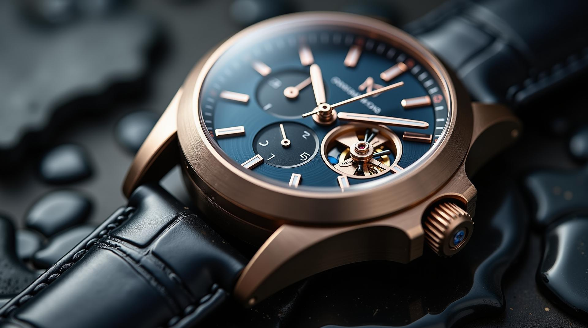
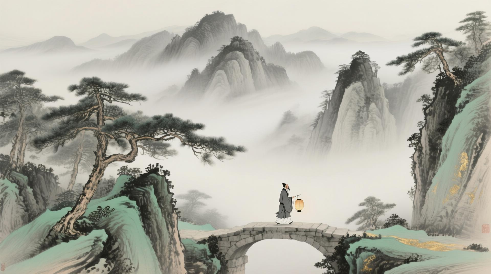
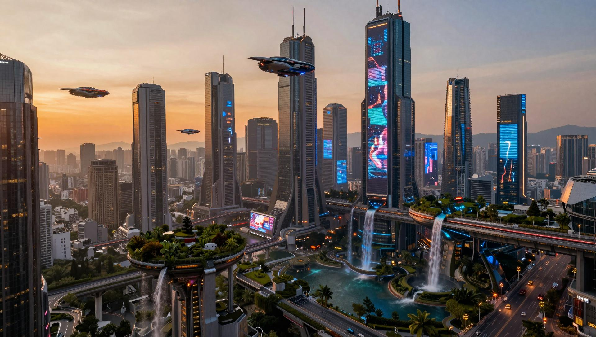
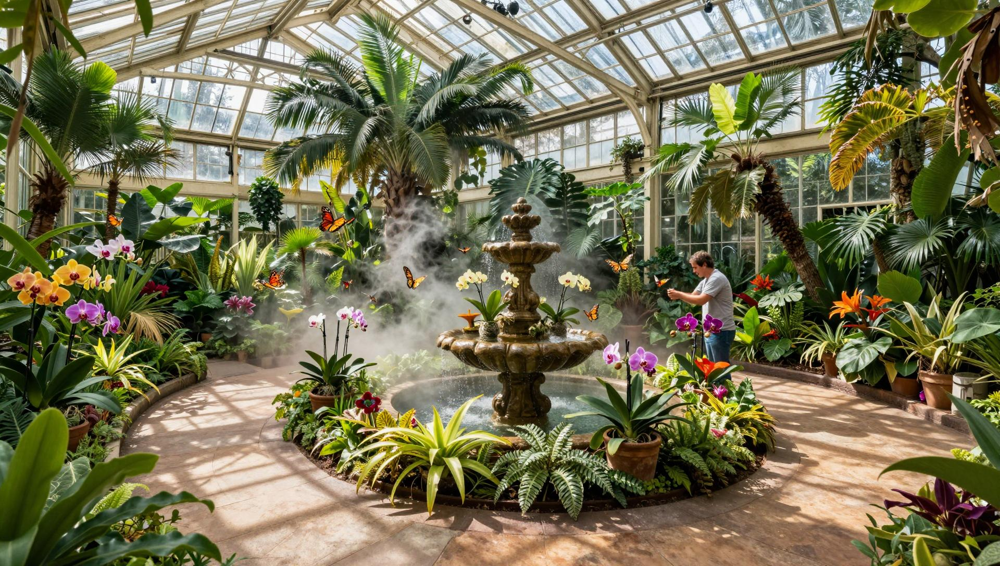
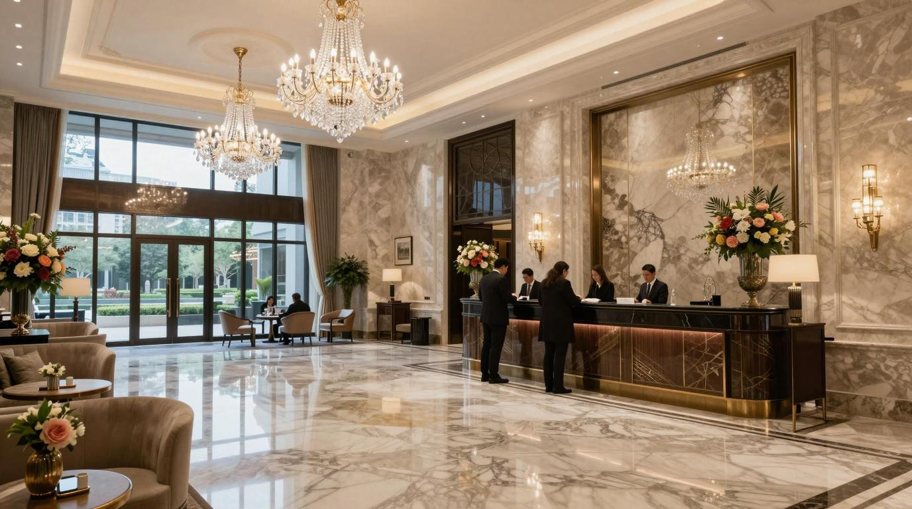
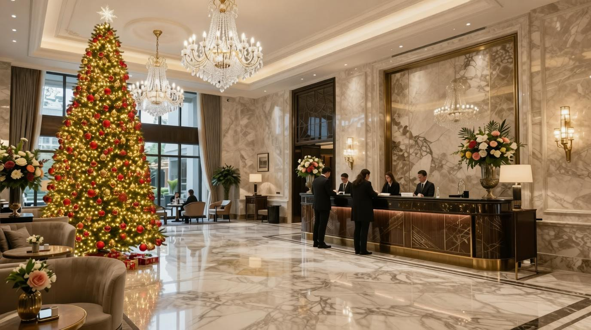
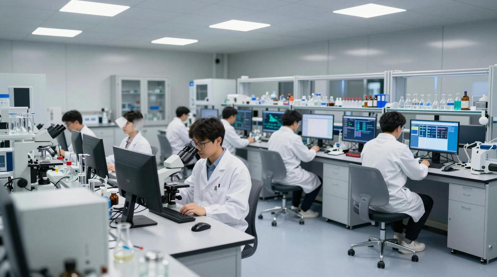
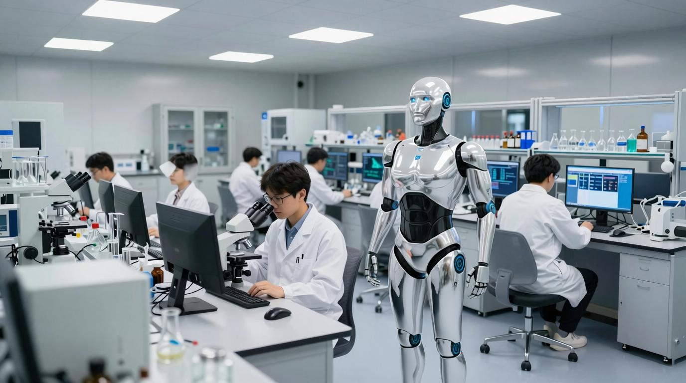

<!---
Copyright (c) 2026 Advanced Micro Devices, Inc. (AMD)

Permission is hereby granted, free of charge, to any person obtaining a copy
of this software and associated documentation files (the "Software"), to deal
in the Software without restriction, including without limitation the rights
to use, copy, modify, merge, publish, distribute, sublicense, and/or sell
copies of the Software, and to permit persons to whom the Software is
furnished to do so, subject to the following conditions:

The above copyright notice and this permission notice shall be included in all
copies or substantial portions of the Software.

THE SOFTWARE IS PROVIDED "AS IS", WITHOUT WARRANTY OF ANY KIND, EXPRESS OR
IMPLIED, INCLUDING BUT NOT LIMITED TO THE WARRANTIES OF MERCHANTABILITY,
FITNESS FOR A PARTICULAR PURPOSE AND NONINFRINGEMENT. IN NO EVENT SHALL THE
AUTHORS OR COPYRIGHT HOLDERS BE LIABLE FOR ANY CLAIM, DAMAGES OR OTHER
LIABILITY, WHETHER IN AN ACTION OF CONTRACT, TORT OR OTHERWISE, ARISING FROM,
OUT OF OR IN CONNECTION WITH THE SOFTWARE OR THE USE OR OTHER DEALINGS IN THE
SOFTWARE.
--->

# Fast Image Generation and Editing with SGLang Diffusion on AMD GPUs

Visual generative AI is advancing at an extraordinary pace. OpenAI's [GPT Image 2](https://openai.com/index/introducing-chatgpt-images-2-0/), released in April 2026, is a reasoning-enabled image model that performs an internal planning process before generating images. Its predecessor generated over 700 million images within just its first week after launch. Google's **Nano Banana** (Gemini 3.1 Flash Image) delivers real-time, knowledge-grounded image generation and editing, while open-source video models such as **HunyuanVideo** can now produce fluid, high-fidelity clips from a single sentence.

This rapid progress has placed serving infrastructure front and center. **SGLang** has established itself as a high-performance serving framework for large language and multimodal models. With **SGLang Diffusion**, it brings the same battle-tested scheduler and kernel optimizations to diffusion-based image and video generation. In this post, we demonstrate how to serve state-of-the-art diffusion models on **AMD GPUs** using SGLang Diffusion on **ROCm**, compare its performance against **Hugging Face Diffusers**, and explore the architectural innovations that make it possible.

---

## Performance Comparison — SGLang Diffusion vs. Hugging Face Diffusers

Before SGLang added diffusion support, **Hugging Face Diffusers** was the go-to Python library for running open-source diffusion models — flexible and well-documented, but not optimized for production serving. **SGLang Diffusion** closes that gap by combining SGLang's high-throughput scheduler, continuous request batching, and optimized compute kernels on the AMD ROCm platform, significantly reducing per-step overhead in the evaluated configurations.

We benchmarked the two frameworks across four models — **FLUX.1-dev**, **Qwen-Image**, **Qwen-Image-Edit-2511**, and **Z-Image-Turbo** — covering text-to-image generation and image editing. All runs used a single AMD MI350X GPU, single-request concurrency, identical model weights, and the same number of inference steps per model. As shown in Figure 1 and Table 1 below, SGLang Diffusion consistently outperforms Hugging Face Diffusers across every model tested.

```{figure} images/benchmark_sglang_vs_hf.png
:width: 75%
:align: center
:alt: SGLang vs. Hugging Face Diffusers — Single-Request Latency on AMD MI350X

Figure 1. Single-request latency comparison on AMD MI350X. Lower is better. SGLang achieves 1.5x – 6.3x speedups across all four image generation and editing models tested. Results may vary based on model, software version, workload, configuration, and system settings.
```

**Table 1.** Single-request latency on a single AMD MI350X GPU. Environment: SGLang v0.5.11, ROCm 7.2.0, AITER attention backend, bfloat16 precision.

| Model | Task | Resolution | Steps | SGLang (s) | HF Diffusers (s) | Speedup |
|---|---|---|---:|---:|---:|---:|
| FLUX.1-dev | Text-to-Image | 1024 x 1024 | 50 | 6.22 | 14.02 | **2.25x** |
| Qwen-Image | Text-to-Image | 1328 x 1328 | 50 | 106.00 | 161.83 | **1.53x** |
| Qwen-Image-Edit-2511 | Image-to-Image | 512 x 512 | 50 | 21.89 | 126.52 | **5.78x** |
| Z-Image-Turbo | Text-to-Image | 1024 x 1024 | 9 | 1.76 | 11.07 | **6.29x** |

As detailed in Table 1, SGLang Diffusion achieves **1.5x – 6.3x speedups** across all four models. Fused kernels and the AITER attention backend help sharply reduce per-step overhead, with distilled models like Z-Image-Turbo benefiting the most. On AMD ROCm, the AITER backend also transparently handles FP32 to BF16/FP16 dtype casting for encoder components in the diffusion pipeline, such as the CLIP encoder, ensuring numerically stable inference with no user-side code changes.

---

## Gallery — Sample Outputs

Below are representative outputs generated by each model on AMD MI350X via SGLang. Figures 2–4 show text-to-image results, and Figure 5 demonstrates image editing capabilities. These figures further illustrate that diffusion models running on AMD GPUs can generate images with high visual quality.

### Text-to-Image

**FLUX.1-dev:**

| | | |
|:---:|:---:|:---:|
|  |  |  |
| "A premium mechanical wristwatch displayed on polished black obsidian..." | "Movie still — a lone astronaut walks through an abandoned cathedral transformed into a forest..." | "A snow leopard resting on a rocky Himalayan cliff during sunrise..." |

*Figure 2. Text-to-image samples generated by FLUX.1-dev on AMD MI350X via SGLang.*

**Qwen-Image:**

| | | |
|:---:|:---:|:---:|
|  |  |  |
| "A high-fashion editorial photograph of an elegant woman standing beneath the glass roof of a historic European train station..." | "A majestic mountain landscape emerging through layers of drifting mist. Traditional Chinese shan shui painting..." | "A candid photograph of a couple walking through narrow cobblestone streets in southern Europe during blue hour..." |

*Figure 3. Text-to-image samples generated by Qwen-Image on AMD MI350X via SGLang.*

**Z-Image-Turbo:**

| | | |
|:---:|:---:|:---:|
|  |  |  |
| "A vast futuristic megacity at dusk. Hundreds of flying vehicles move between towering skyscrapers..." | "RAW photograph of a 32-year-old woman sitting in a cafe beside a window on a cloudy afternoon..." | "A magnificent Victorian greenhouse filled with exotic tropical plants and flowers. Sunlight filters through the glass ceiling..." |

*Figure 4. Text-to-image samples generated by Z-Image-Turbo on AMD MI350X via SGLang.*

### Image Editing (Text + Image → Image) — Qwen-Image-Edit-2511

:::{table}
:width: 75%
:align: center

| Original | Edited |
|:---:|:---:|
|  |  |
| "A picturesque fishing village along a rugged coastline during golden hour..." | "Add a vivid aurora borealis in shimmering green and purple ribbons across the sky above the village." |
:::

:::{table}
:width: 75%
:align: center

| Original | Edited |
|:---:|:---:|
|  |  |
| "A magnificent luxury hotel lobby featuring marble floors, crystal chandeliers..." | "Add a tall decorated Christmas tree with twinkling golden lights and red ornaments beside the elegant seating area." |
:::

:::{table}
:width: 75%
:align: center

| Original | Edited |
|:---:|:---:|
|  |  |
| "A cutting-edge research laboratory filled with advanced scientific equipment..." | "Add a sleek white humanoid robot assistant standing next to one of the researchers." |
:::

*Figure 5. Image editing samples generated by Qwen-Image-Edit-2511 on AMD MI350X via SGLang. Each pair shows the original image (left) and the edited result (right).*

---

## Step-by-Step Reproduction

All benchmarks and sample outputs in this post were produced on AMD MI350X GPUs. This section provides the exact commands for reproducing each experiment — from environment setup to launching the server and running the benchmark client.

### Environment Setup

Install SGLang with diffusion support on **AMD ROCm** (source build):

```bash
git clone -b v0.5.12 https://github.com/sgl-project/sglang.git
cd sglang

# Build and install sgl-kernel for ROCm
cd sgl-kernel
python setup_rocm.py install

# Install SGLang with diffusion + HIP support
cd ..
rm -rf python/pyproject.toml && mv python/pyproject_other.toml python/pyproject.toml
pip install -e "python[all_hip]"
```

Alternatively, pull the pre-built Docker image:

```bash
# AMD GPU Docker run alias
alias drun='docker run -it --rm --network=host --privileged \
  --device=/dev/kfd --device=/dev/dri \
  --ipc=host --shm-size 16G --group-add video \
  --cap-add=SYS_PTRACE --security-opt seccomp=unconfined \
  -v $HOME/dockerx:/dockerx'

drun lmsysorg/sglang:rocm-diffusion /bin/bash
```

### Text-to-Image with FLUX.1-dev

Single-shot generation via CLI:
```bash
sglang generate \
  --model-path black-forest-labs/FLUX.1-dev \
  --prompt "A Logo With Bold Large Text: SGL Diffusion" \
  --save-output
```

Benchmarking commands:
```bash
# Launch the server
sglang serve \
  --model-path black-forest-labs/FLUX.1-dev \
  --ulysses-degree=1 \
  --ring-degree=1 \
  --port 30000
```

```bash
# Run the benchmark client
python3 -m sglang.multimodal_gen.benchmarks.bench_serving \
  --backend sglang-image --dataset vbench --task text-to-image \
  --num-prompts 1 --max-concurrency 1 \
  --dataset-path $VBENCH
```

### Text-to-Image with Qwen-Image

**Qwen-Image:**

Single-shot generation via CLI:
```bash
sglang generate \
  --model-path Qwen/Qwen-Image \
  --prompt "A serene mountain landscape at sunset" \
  --save-output
```

Benchmarking commands:
```bash
# Launch the server
sglang serve \
  --model-path Qwen/Qwen-Image \
  --ulysses-degree=1 \
  --ring-degree=1 \
  --port 30000
```

```bash
# Run the benchmark client
python3 -m sglang.multimodal_gen.benchmarks.bench_serving \
  --backend sglang-image --dataset vbench --task text-to-image \
  --num-prompts 1 --max-concurrency 1 \
  --dataset-path $VBENCH
```

**Qwen-Image-Edit-2511:**

Single-shot generation via CLI:
```bash
sglang generate \
  --model-path Qwen/Qwen-Image-Edit-2511 \
  --prompt "Turn the sky into a starry night" \
  --save-output
```

Benchmarking commands:
```bash
# Launch the server
sglang serve \
  --model-path Qwen/Qwen-Image-Edit-2511 \
  --port 30000
```

```bash
# Run the benchmark client
python3 -m sglang.multimodal_gen.benchmarks.bench_serving \
  --backend sglang-image --dataset vbench --task image-to-image \
  --num-prompts 1 --max-concurrency 1
```

### Text-to-Image with Z-Image-Turbo

Single-shot generation via CLI:
```bash
sglang generate \
  --model-path Z-Image-Turbo \
  --prompt "A futuristic cityscape with neon lights" \
  --save-output
```

Benchmarking commands:
```bash
# Launch the server
sglang serve \
  --model-path Z-Image-Turbo \
  --ulysses-degree=1 \
  --ring-degree=1 \
  --port 30000
```

```bash
# Run the benchmark client
python3 -m sglang.multimodal_gen.benchmarks.bench_serving \
  --backend sglang-image --dataset vbench --task text-to-image \
  --num-prompts 1 --max-concurrency 1 \
  --dataset-path $VBENCH
```

For the full command reference and hardware-specific configurations, see the [SGLang Diffusion Cookbook](https://cookbook.sglang.io/diffusion) and the [AMD GPU platform docs](https://docs.sglang.io/platforms/amd_gpu.html).

---

## Architecture Deep Dive

### Latent Diffusion Pipeline

Modern diffusion models follow a three-stage pipeline: a **text encoder** (CLIP, T5, or LLaMA) produces conditioning embeddings, a **Diffusion Transformer (DiT)** iteratively denoises latent tokens over 20–50 steps (the dominant cost), and a **VAE decoder** maps latents back to pixel space.

### SGLang Diffusion Serving

SGLang Diffusion decomposes this pipeline into modular, independently schedulable stages (`TextEncodingStage → DenoisingStage → DecodingStage`) orchestrated by `ComposedPipelineBase` under the SGLang scheduler, which manages the request lifecycle and can run stages monolithically or disaggregated across separate encoder, denoiser, and decoder processes. Multi-GPU scaling is supported via **USP** (hybrid Ulysses-SP + Ring-Attention for the DiT), **CFG-Parallel** (splitting classifier-free guidance paths across GPUs), **Tensor Parallelism** (mainly for the text encoders), and dedicated **VAE parallelism**. Key kernel optimizations in `sgl-kernel` include fused MLP projections and a JIT-compiled kernel that fuses QK normalization with RoPE to cut memory round-trips. On top of these, **Distributed VAE** parallelizes encode/decode to avoid OOM at high resolutions.

### The AMD ROCm Stack

```
┌──────────────────────────────────────────────────────────┐
│                   SGLang Diffusion                       │
│          (ComposedPipelineBase + Scheduler)              │
├──────────────────────────────────────────────────────────┤
│                     sgl-kernel                           │
│  (fused DiT ops, Cache-DiT, Distributed VAE, RoPE)       │
├─────────────────────┬────────────────────────────────────┤
│      AITER          │          Triton (HIP backend)      │
│  (AI Tensor Engine) │  (flash attention, norm kernels)   │
├─────────────────────┴────────────────────────────────────┤
│               ROCm / HIP Runtime                         │
├──────────────────────────────────────────────────────────┤
│     AMD Instinct GPU  (MI300X / MI325X / MI355X)         │
└──────────────────────────────────────────────────────────┘
```

**[AITER](https://github.com/ROCm/aiter)** (AI Tensor Engine for ROCm) is AMD's high-performance kernel library, providing optimized flash attention, GEMM, and normalization primitives sourced from **Composable Kernel (CK)**, **Triton**, and **HIP/C++** backends with per-architecture dispatch. In SGLang Diffusion, AITER serves as the default attention backend, handling flash attention inside the DiT loop and transparently managing FP32 to BF16/FP16 dtype casting for compatibility with all model components. Quantization via **FP8** and **INT8** further reduces memory footprints for serving large models on AMD GPUs.

---

## Summary

In this blog, we explored how **SGLang Diffusion** serves state-of-the-art diffusion models on AMD GPUs, benchmarked its performance against Hugging Face Diffusers, and reproduced the results end-to-end. Across four models -- FLUX.1-dev, Qwen-Image, Qwen-Image-Edit-2511, and Z-Image-Turbo — you saw **1.5x – 6.3x speedups** on a single AMD MI350X, powered by SGLang's fused kernels, continuous batching scheduler, and the AITER attention backend on the ROCm stack. You also walked through the full reproduction workflow, from environment setup and server launch to running the benchmark client, and took a deeper look at the architecture that makes these gains possible.

Looking ahead, we are actively working on several fronts to push SGLang Diffusion further on AMD GPUs:

- **FP8 and INT8 quantization** — shrinking memory footprints to serve larger models and increase throughput on AMD Instinct GPUs.
- **Multi-GPU USP scaling** — extending hybrid Ulysses-SP and Ring-Attention parallelism to the largest video generation models.
- **Video generation workflows** — bringing the same serving optimizations to open-source video models such as HunyuanVideo and Wan.

Stay tuned for future posts from our team as we continue to optimize diffusion model serving on the AMD ROCm platform.

---

## Additional Resources

- [SGLang Diffusion Documentation](https://sgl-project.github.io/diffusion/index.html)
- [SGLang Diffusion Cookbook](https://cookbook.sglang.io/diffusion)
- [LMSYS Blog: SGLang Diffusion — Accelerating Video and Image Generation](https://www.lmsys.org/blog/2025-11-07-sglang-diffusion/)
- [LMSYS Blog: SGLang-Diffusion: Two Months In](https://www.lmsys.org/blog/2026-01-16-sglang-diffusion/)
- [LMSYS Blog: Advanced Optimizations for Production-Ready Video Generation](https://www.lmsys.org/blog/2026-02-16-sglang-diffusion-advanced-optimizations/)
- [SGLang AMD GPU Platform Docs](https://docs.sglang.io/platforms/amd_gpu.html)
- [AMD ROCm Blog: AITER — AI Tensor Engine for ROCm](https://rocm.blogs.amd.com/software-tools-optimization/aiter-ai-tensor-engine/README.html)
- [AITER GitHub Repository](https://github.com/ROCm/aiter)
- [OpenAI: Introducing ChatGPT Images 2.0](https://openai.com/index/introducing-chatgpt-images-2-0/)
- [Google: Imagen 4 Generally Available](https://developers.googleblog.com/announcing-imagen-4-fast-and-imagen-4-family-generally-available-in-the-gemini-api/)
- [SGLang GitHub Repository](https://github.com/sgl-project/sglang)

## Disclaimers

Third-party content is licensed to you directly by the third party that owns the content and is not licensed to you by AMD. ALL LINKED THIRD-PARTY CONTENT IS PROVIDED "AS IS" WITHOUT A WARRANTY OF ANY KIND. USE OF SUCH THIRD-PARTY CONTENT IS DONE AT YOUR SOLE DISCRETION AND UNDER NO CIRCUMSTANCES WILL AMD BE LIABLE TO YOU FOR ANY THIRD-PARTY CONTENT. YOU ASSUME ALL RISK AND ARE SOLELY RESPONSIBLE FOR ANY DAMAGES THAT MAY ARISE FROM YOUR USE OF THIRD-PARTY CONTENT.
